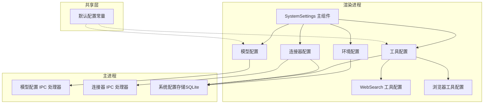
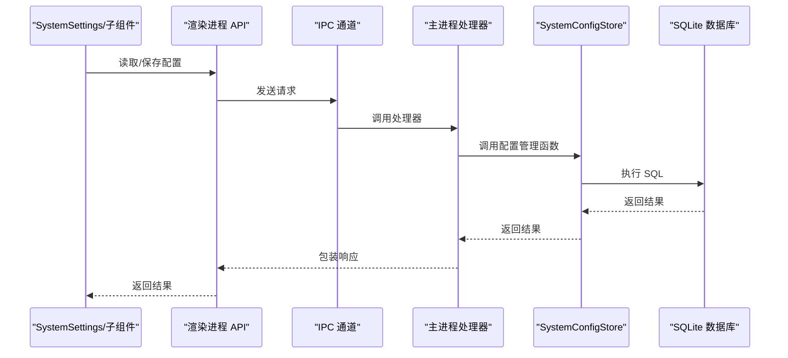
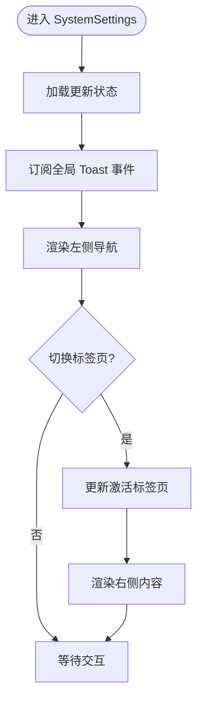
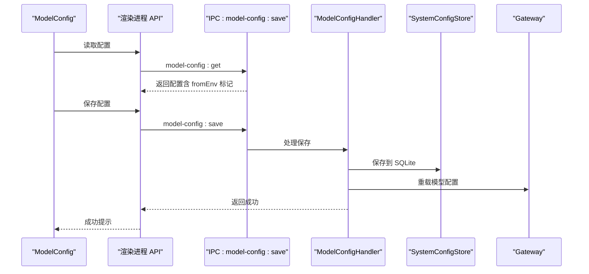
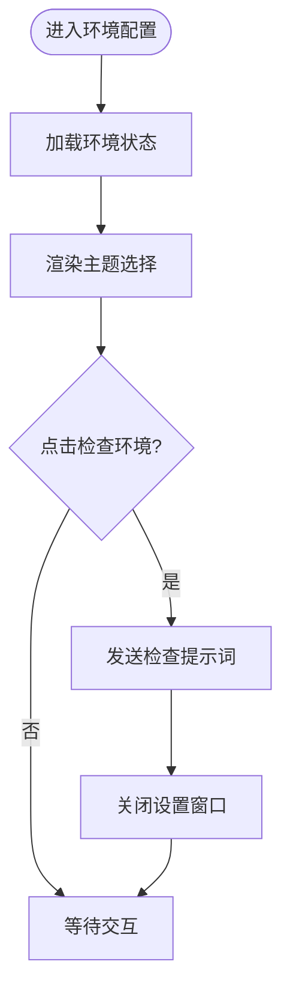
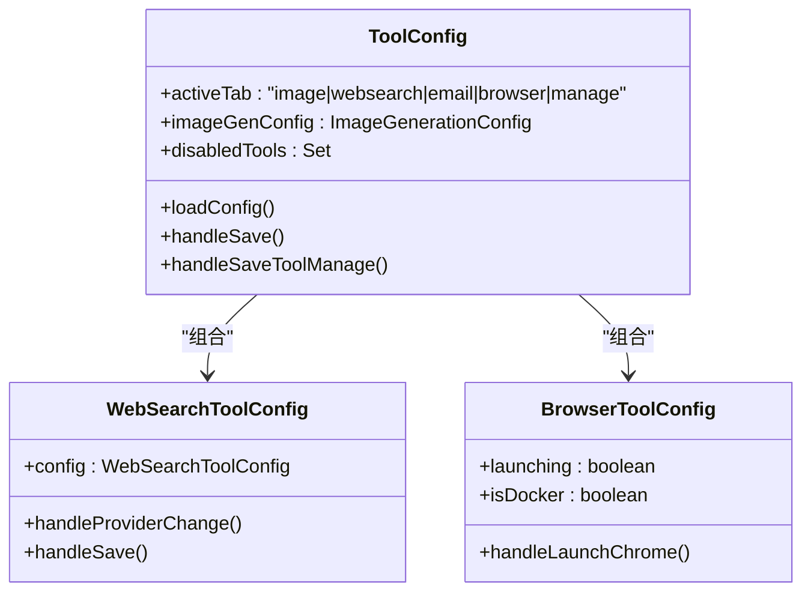
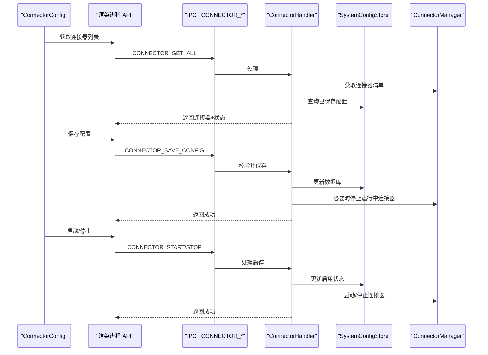
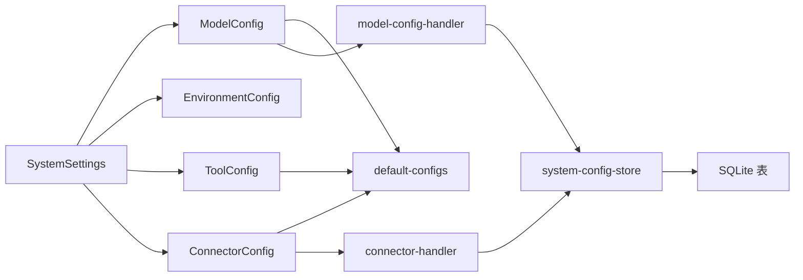

# 系统设置组件

<cite>
**本文引用的文件**
- [SystemSettings.tsx](file://src/renderer/components/SystemSettings.tsx)
- [ModelConfig.tsx](file://src/renderer/components/settings/ModelConfig.tsx)
- [EnvironmentConfig.tsx](file://src/renderer/components/settings/EnvironmentConfig.tsx)
- [ToolConfig.tsx](file://src/renderer/components/settings/ToolConfig.tsx)
- [ConnectorConfig.tsx](file://src/renderer/components/settings/ConnectorConfig.tsx)
- [WebSearchToolConfig.tsx](file://src/renderer/components/settings/WebSearchToolConfig.tsx)
- [BrowserToolConfig.tsx](file://src/renderer/components/settings/BrowserToolConfig.tsx)
- [default-configs.ts](file://src/shared/config/default-configs.ts)
- [system-config-store.ts](file://src/main/database/system-config-store.ts)
- [model-config.ts](file://src/main/database/model-config.ts)
- [environment-config.ts](file://src/main/database/environment-config.ts)
- [tool-config.ts](file://src/main/database/tool-config.ts)
- [model-config-handler.ts](file://src/main/ipc/model-config-handler.ts)
- [connector-handler.ts](file://src/main/ipc/connector-handler.ts)
- [config-types.ts](file://src/main/database/config-types.ts)
</cite>

## 目录
1. [简介](#简介)
2. [项目结构](#项目结构)
3. [核心组件](#核心组件)
4. [架构总览](#架构总览)
5. [详细组件分析](#详细组件分析)
6. [依赖关系分析](#依赖关系分析)
7. [性能考虑](#性能考虑)
8. [故障排查指南](#故障排查指南)
9. [结论](#结论)
10. [附录](#附录)

## 简介
本文件面向 史丽慧小助理 系统的“系统设置”组件群，重点阐述 SystemSettings 主组件的架构设计与子组件组织方式，并深入解析模型配置、环境配置、工具配置与连接器配置的实现细节。文档覆盖数据绑定机制、验证规则、保存流程、设置界面导航结构、标签页管理、配置导入导出能力、事件处理与状态管理，以及扩展机制与最佳实践。

## 项目结构
系统设置采用“主面板 + 左侧导航 + 右侧内容”的左右布局设计。主组件 SystemSettings 负责状态管理与导航切换；右侧按标签页动态渲染具体配置组件。各配置组件通过统一的 API 层与后端交互，后端使用 SQLite 存储配置并提供 IPC 处理器。

**图表来源**
- [SystemSettings.tsx:1-180](file://src/renderer/components/SystemSettings.tsx#L1-L180)
- [ModelConfig.tsx:1-432](file://src/renderer/components/settings/ModelConfig.tsx#L1-L432)
- [EnvironmentConfig.tsx:1-323](file://src/renderer/components/settings/EnvironmentConfig.tsx#L1-L323)
- [ToolConfig.tsx:1-505](file://src/renderer/components/settings/ToolConfig.tsx#L1-L505)
- [ConnectorConfig.tsx:1-800](file://src/renderer/components/settings/ConnectorConfig.tsx#L1-L800)
- [WebSearchToolConfig.tsx:1-184](file://src/renderer/components/settings/WebSearchToolConfig.tsx#L1-L184)
- [BrowserToolConfig.tsx:1-181](file://src/renderer/components/settings/BrowserToolConfig.tsx#L1-L181)
- [default-configs.ts:1-133](file://src/shared/config/default-configs.ts#L1-L133)
- [system-config-store.ts:1-576](file://src/main/database/system-config-store.ts#L1-L576)
- [model-config-handler.ts:1-228](file://src/main/ipc/model-config-handler.ts#L1-L228)
- [connector-handler.ts:1-406](file://src/main/ipc/connector-handler.ts#L1-L406)

**章节来源**
- [SystemSettings.tsx:1-180](file://src/renderer/components/SystemSettings.tsx#L1-L180)

## 核心组件
- SystemSettings 主组件：负责左侧导航菜单与右侧内容区的切换，维护当前激活标签页状态，订阅全局 Toast 与更新提示事件。
- 模型配置组件：支持多提供商选择、API 类型切换、主/快速模型配置、上下文窗口推断与保存。
- 环境配置组件：展示运行环境状态、一键检查、主题切换、安装指引与错误提示。
- 工具配置组件：集中管理图片生成、Web 搜索、浏览器、邮件等工具的配置与开关。
- 连接器配置组件：管理飞书、钉钉、Slack、企业微信、QQ 等外部通讯平台的配置、启停与 Pairing 管理。
- WebSearch 工具配置子组件：独立的 Web 搜索工具配置页面。
- 浏览器工具配置子组件：提供浏览器启动与使用说明。

**章节来源**
- [SystemSettings.tsx:23-179](file://src/renderer/components/SystemSettings.tsx#L23-L179)
- [ModelConfig.tsx:13-48](file://src/renderer/components/settings/ModelConfig.tsx#L13-L48)
- [EnvironmentConfig.tsx:15-29](file://src/renderer/components/settings/EnvironmentConfig.tsx#L15-L29)
- [ToolConfig.tsx:27-49](file://src/renderer/components/settings/ToolConfig.tsx#L27-L49)
- [ConnectorConfig.tsx:11-76](file://src/renderer/components/settings/ConnectorConfig.tsx#L11-L76)
- [WebSearchToolConfig.tsx:13-33](file://src/renderer/components/settings/WebSearchToolConfig.tsx#L13-L33)
- [BrowserToolConfig.tsx:9-21](file://src/renderer/components/settings/BrowserToolConfig.tsx#L9-L21)

## 架构总览
系统设置的前后端交互链路如下：
- 渲染进程通过统一 API 调用后端 IPC 通道。
- 主进程的 IPC 处理器对接 SystemConfigStore，后者封装 SQLite 数据持久化。
- 模型配置 IPC 处理器还负责上下文窗口推断与 Gateway 重载。
- 连接器 IPC 处理器负责连接器启停、健康检查与 Pairing 管理。

**图表来源**
- [model-config-handler.ts:40-112](file://src/main/ipc/model-config-handler.ts#L40-L112)
- [connector-handler.ts:65-104](file://src/main/ipc/connector-handler.ts#L65-L104)
- [system-config-store.ts:37-566](file://src/main/database/system-config-store.ts#L37-L566)

## 详细组件分析

### SystemSettings 主组件
- 导航结构：左侧为标签页按钮集合，右侧为当前标签页内容区。
- 状态管理：维护当前激活标签页、更新提示与 Toast 提示。
- 事件处理：关闭设置窗口、版本页清除更新标记。
- 样式与布局：采用 CSS 变量实现主题适配。

**图表来源**
- [SystemSettings.tsx:31-179](file://src/renderer/components/SystemSettings.tsx#L31-L179)

**章节来源**
- [SystemSettings.tsx:31-179](file://src/renderer/components/SystemSettings.tsx#L31-L179)

### 模型配置组件
- 数据绑定：使用受控组件模式，表单项与本地状态双向绑定。
- 预设与切换：通过 PROVIDER_PRESETS 在提供商间切换，自动填充基础配置。
- 验证规则：保存前校验 API 地址、模型 ID、API Key。
- 上下文窗口：支持手动设置或基于模型 ID 推断；保存后可触发 Gateway 重载与后端同步。
- 环境变量提示：若配置来自 .env，显示提示并标记 fromEnv。

**图表来源**
- [ModelConfig.tsx:31-149](file://src/renderer/components/settings/ModelConfig.tsx#L31-L149)
- [model-config-handler.ts:64-112](file://src/main/ipc/model-config-handler.ts#L64-L112)
- [model-config.ts:60-134](file://src/main/database/model-config.ts#L60-L134)

**章节来源**
- [ModelConfig.tsx:31-149](file://src/renderer/components/settings/ModelConfig.tsx#L31-L149)
- [default-configs.ts:11-54](file://src/shared/config/default-configs.ts#L11-L54)
- [model-config-handler.ts:64-112](file://src/main/ipc/model-config-handler.ts#L64-L112)
- [model-config.ts:60-134](file://src/main/database/model-config.ts#L60-L134)

### 环境配置组件
- 状态展示：渲染 Python 安装状态、版本、路径与错误信息。
- 一键检查：通过发送提示词到主 Agent 触发环境检查流程。
- 主题切换：支持浅色、深色、自动三种主题模式。
- 安装指引：提供常见平台的安装命令与注意事项。

**图表来源**
- [EnvironmentConfig.tsx:31-76](file://src/renderer/components/settings/EnvironmentConfig.tsx#L31-L76)

**章节来源**
- [EnvironmentConfig.tsx:31-76](file://src/renderer/components/settings/EnvironmentConfig.tsx#L31-L76)

### 工具配置组件
- 标签页管理：图片生成、Web 搜索、浏览器、邮件、工具管理五个标签页。
- 图片生成：支持提供商切换、API 地址与模型 ID、API Key 输入与保存。
- Web 搜索：独立子组件，提供提供商、API 地址、模型 ID、API Key 配置。
- 浏览器工具：提供快速启动 Chrome（CDP）与 Docker 无头浏览器说明。
- 工具管理：支持勾选启用/禁用内置工具，保存后立即生效。

**图表来源**
- [ToolConfig.tsx:38-505](file://src/renderer/components/settings/ToolConfig.tsx#L38-L505)
- [WebSearchToolConfig.tsx:24-184](file://src/renderer/components/settings/WebSearchToolConfig.tsx#L24-L184)
- [BrowserToolConfig.tsx:13-181](file://src/renderer/components/settings/BrowserToolConfig.tsx#L13-L181)

**章节来源**
- [ToolConfig.tsx:38-505](file://src/renderer/components/settings/ToolConfig.tsx#L38-L505)
- [WebSearchToolConfig.tsx:24-184](file://src/renderer/components/settings/WebSearchToolConfig.tsx#L24-L184)
- [BrowserToolConfig.tsx:13-181](file://src/renderer/components/settings/BrowserToolConfig.tsx#L13-L181)

### 连接器配置组件
- 连接器列表：动态加载可用连接器，显示启用状态与健康检查状态。
- 配置管理：按平台类型分别维护配置对象，保存前进行字段校验。
- 启停控制：保存配置后可选择立即启动/停止连接器；运行中连接器会在应用新配置前自动停止。
- Pairing 管理：支持批准、设为管理员、删除等操作，并广播待审批计数。

**图表来源**
- [ConnectorConfig.tsx:78-488](file://src/renderer/components/settings/ConnectorConfig.tsx#L78-L488)
- [connector-handler.ts:65-264](file://src/main/ipc/connector-handler.ts#L65-L264)
- [system-config-store.ts:443-463](file://src/main/database/system-config-store.ts#L443-L463)

**章节来源**
- [ConnectorConfig.tsx:78-488](file://src/renderer/components/settings/ConnectorConfig.tsx#L78-L488)
- [connector-handler.ts:65-264](file://src/main/ipc/connector-handler.ts#L65-L264)
- [system-config-store.ts:443-463](file://src/main/database/system-config-store.ts#L443-L463)

## 依赖关系分析
- SystemSettings 依赖各子组件与其样式文件。
- 子组件通过统一 API 与主进程通信，主进程处理器依赖 SystemConfigStore。
- SystemConfigStore 封装 SQLite 表结构与迁移逻辑，提供各配置模块的 CRUD 方法。
- 默认配置常量为前端提供预设值，保证一致性。

**图表来源**
- [SystemSettings.tsx:14-21](file://src/renderer/components/SystemSettings.tsx#L14-L21)
- [default-configs.ts:11-133](file://src/shared/config/default-configs.ts#L11-L133)
- [model-config-handler.ts:14-35](file://src/main/ipc/model-config-handler.ts#L14-L35)
- [connector-handler.ts:28-40](file://src/main/ipc/connector-handler.ts#L28-L40)
- [system-config-store.ts:37-60](file://src/main/database/system-config-store.ts#L37-L60)

**章节来源**
- [system-config-store.ts:37-60](file://src/main/database/system-config-store.ts#L37-L60)
- [config-types.ts:8-67](file://src/main/database/config-types.ts#L8-L67)

## 性能考虑
- 缓存策略：模型配置在内存中缓存，保存/删除后清空缓存，避免重复查询与日志输出。
- WAL 模式：SQLite 使用 WAL 模式并主动 checkpoint，确保写入及时落盘。
- 并发加载：工具配置使用 Promise.all 并行加载图片生成与禁用工具列表，减少首屏等待。
- 健康检查去抖：连接器健康状态在加载时仅对启用且无缓存的状态发起检查，避免重复请求。

**章节来源**
- [model-config.ts:8-16](file://src/main/database/model-config.ts#L8-L16)
- [model-config.ts:121-126](file://src/main/database/model-config.ts#L121-L126)
- [ToolConfig.tsx:60-90](file://src/renderer/components/settings/ToolConfig.tsx#L60-L90)
- [ConnectorConfig.tsx:164-181](file://src/renderer/components/settings/ConnectorConfig.tsx#L164-L181)

## 故障排查指南
- 模型配置保存失败：检查 API 地址、模型 ID、API Key 是否为空；查看后端返回的错误信息；确认 .env 环境变量是否覆盖了配置。
- 连接器启动失败：确认配置已保存且已启用；检查健康检查状态；查看主进程日志；必要时先停止再启动。
- 工具禁用无效：确认保存成功并刷新页面；检查数据库中 tool_disabled 表是否正确写入。
- 环境检查无结果：确认已发送检查提示词至主 Agent；检查网络与代理设置；查看错误提示。

**章节来源**
- [ModelConfig.tsx:104-149](file://src/renderer/components/settings/ModelConfig.tsx#L104-L149)
- [ConnectorConfig.tsx:450-486](file://src/renderer/components/settings/ConnectorConfig.tsx#L450-L486)
- [tool-config.ts:542-557](file://src/main/database/system-config-store.ts#L542-L557)

## 结论
系统设置组件群以 SystemSettings 为主中枢，围绕四大配置域（模型、环境、工具、连接器）构建清晰的子组件体系。通过统一的 API 与 IPC 通道，结合 SQLite 持久化与缓存优化，实现了稳定、可扩展的配置管理能力。建议在新增配置项时遵循现有命名规范、IPC 通道约定与数据库迁移流程，确保一致性和可维护性。

## 附录

### 配置组件属性接口与事件
- 模型配置
  - 属性：providerType、providerId、providerName、baseUrl、modelId、modelId2、modelName、apiType、apiKey、contextWindow、lastFetched、fromEnv
  - 事件：保存成功回调、首次配置提示
- 环境配置
  - 属性：主题模式、环境状态（安装状态、版本、路径、错误）
  - 事件：一键检查、主题切换
- 工具配置
  - 属性：图片生成配置、Web 搜索配置、禁用工具集合
  - 事件：保存图片生成配置、保存工具禁用列表
- 连接器配置
  - 属性：各平台配置对象、Pairing 记录、健康状态
  - 事件：保存配置、启动/停止、批准/删除 Pairing

**章节来源**
- [config-types.ts:34-67](file://src/main/database/config-types.ts#L34-L67)
- [ModelConfig.tsx:13-48](file://src/renderer/components/settings/ModelConfig.tsx#L13-L48)
- [EnvironmentConfig.tsx:15-29](file://src/renderer/components/settings/EnvironmentConfig.tsx#L15-L29)
- [ToolConfig.tsx:31-49](file://src/renderer/components/settings/ToolConfig.tsx#L31-L49)
- [ConnectorConfig.tsx:15-76](file://src/renderer/components/settings/ConnectorConfig.tsx#L15-L76)

### 配置验证与保存流程最佳实践
- 前端验证：必填字段校验、格式校验、范围校验。
- 后端验证：IPC 处理器中进行二次校验，必要时调用第三方服务验证连通性。
- 保存策略：原子性写入，失败回滚；保存后清理缓存并通知前端更新。
- 迁移与兼容：数据库迁移时保留历史数据，提供默认值与兼容逻辑。

**章节来源**
- [model-config-handler.ts:127-139](file://src/main/ipc/model-config-handler.ts#L127-L139)
- [system-config-store.ts:221-315](file://src/main/database/system-config-store.ts#L221-L315)