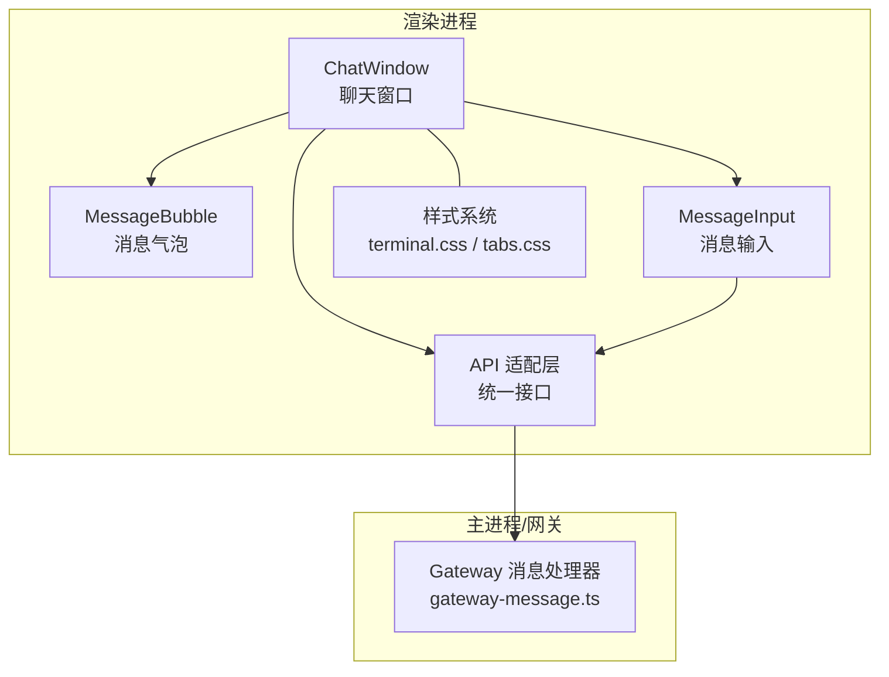
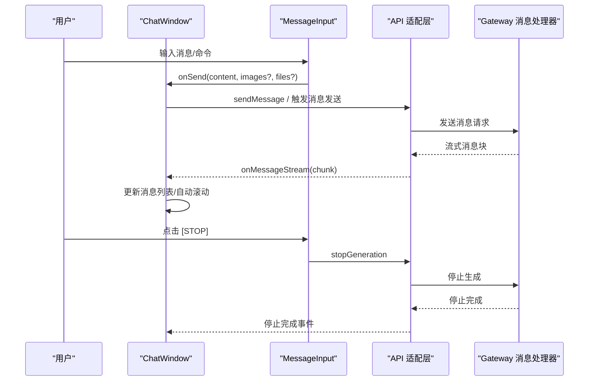
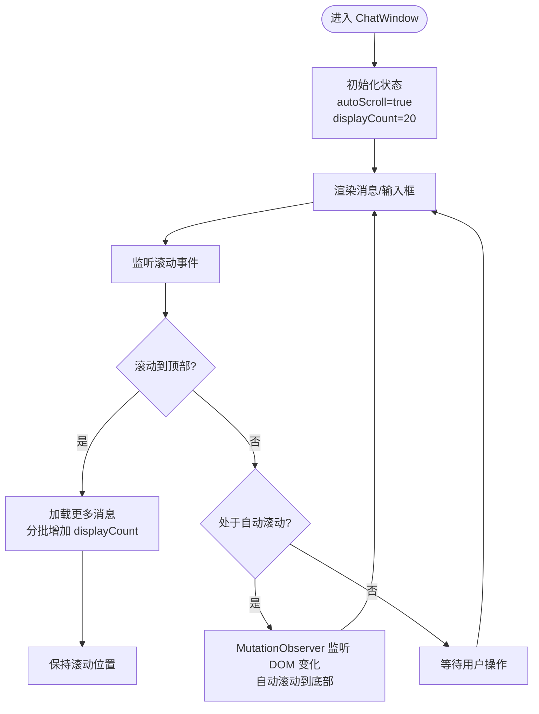
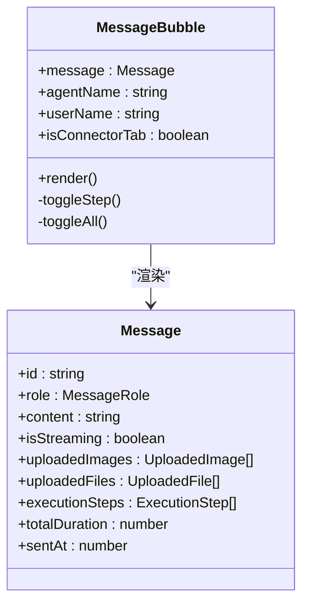
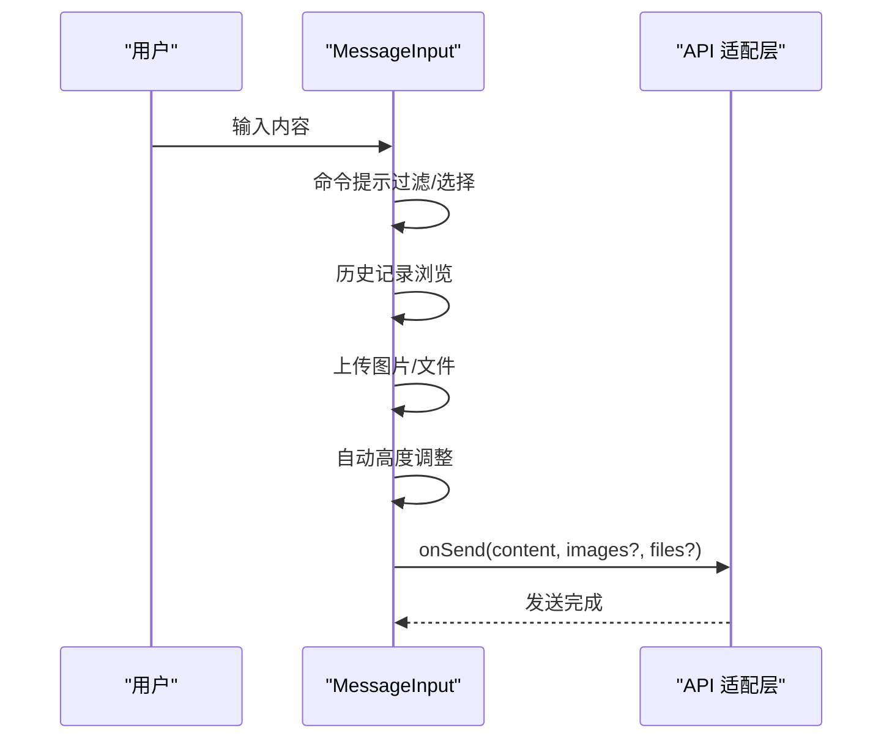
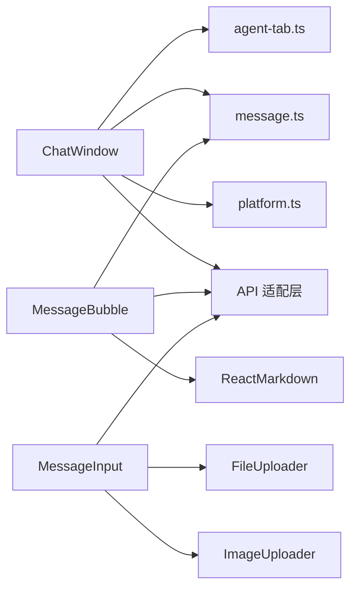

# 聊天窗口组件

<cite>
**本文档引用的文件**
- [ChatWindow.tsx](file://src/renderer/components/ChatWindow.tsx)
- [MessageBubble.tsx](file://src/renderer/components/MessageBubble.tsx)
- [MessageInput.tsx](file://src/renderer/components/MessageInput.tsx)
- [terminal.css](file://src/renderer/styles/terminal.css)
- [tabs.css](file://src/renderer/styles/tabs.css)
- [platform.ts](file://src/renderer/utils/platform.ts)
- [agent-tab.ts](file://src/types/agent-tab.ts)
- [message.ts](file://src/types/message.ts)
- [index.ts](file://src/renderer/api/index.ts)
- [App.tsx](file://src/renderer/App.tsx)
- [gateway-message.ts](file://src/main/gateway-message.ts)
</cite>

## 目录
1. [简介](#简介)
2. [项目结构](#项目结构)
3. [核心组件](#核心组件)
4. [架构总览](#架构总览)
5. [详细组件分析](#详细组件分析)
6. [依赖关系分析](#依赖关系分析)
7. [性能考量](#性能考量)
8. [故障排查指南](#故障排查指南)
9. [结论](#结论)
10. [附录](#附录)

## 简介
本文件为 DeepBot 聊天窗口组件的深度技术文档，围绕 ChatWindow 组件进行系统化说明。内容涵盖终端风格界面设计、消息流式渲染机制、自动滚动与分页加载优化、状态管理与 Tab 切换、滚动行为控制、响应式与 Electron 环境适配、组件属性接口、事件处理机制以及性能优化策略，并提供实际使用示例与最佳实践。

## 项目结构
ChatWindow 位于渲染进程，配合 MessageBubble、MessageInput、API 适配层与样式系统共同构成完整的终端风格聊天界面。其核心职责包括：
- 管理消息显示与分页加载
- 控制自动滚动与手动滚动检测
- 处理 Tab 切换与输入框显示逻辑
- 适配 Electron/Web 环境差异
- 与主进程/网关通信，接收流式消息与事件

**图表来源**
- [ChatWindow.tsx:32-509](file://src/renderer/components/ChatWindow.tsx#L32-L509)
- [MessageBubble.tsx:218-553](file://src/renderer/components/MessageBubble.tsx#L218-L553)
- [MessageInput.tsx:25-444](file://src/renderer/components/MessageInput.tsx#L25-L444)
- [index.ts:20-551](file://src/renderer/api/index.ts#L20-L551)
- [gateway-message.ts:1-524](file://src/main/gateway-message.ts#L1-L524)

**章节来源**
- [ChatWindow.tsx:32-509](file://src/renderer/components/ChatWindow.tsx#L32-L509)
- [terminal.css:60-1749](file://src/renderer/styles/terminal.css#L60-L1749)
- [tabs.css:5-181](file://src/renderer/styles/tabs.css#L5-L181)

## 核心组件
- ChatWindow：负责整体布局、消息分页、滚动控制、Tab 管理、输入框显示与事件派发。
- MessageBubble：渲染单条消息，支持 Markdown、图片加载、执行步骤展开/折叠、时间统计等。
- MessageInput：终端风格输入框，支持命令提示、历史记录、图片/文件上传、自动高度调整。
- API 适配层：统一 Electron/Web 环境下的 IPC/HTTP 调用与事件监听。
- 样式系统：terminal.css 与 tabs.css 提供终端主题与 Tab 样式。

**章节来源**
- [ChatWindow.tsx:14-509](file://src/renderer/components/ChatWindow.tsx#L14-L509)
- [MessageBubble.tsx:12-553](file://src/renderer/components/MessageBubble.tsx#L12-L553)
- [MessageInput.tsx:10-444](file://src/renderer/components/MessageInput.tsx#L10-L444)
- [index.ts:20-551](file://src/renderer/api/index.ts#L20-L551)

## 架构总览
ChatWindow 通过 API 适配层与主进程/网关交互，接收流式消息并通过 MutationObserver 实现自动滚动；通过分页加载与滚动检测实现高性能历史消息浏览；通过 Tab 管理与输入框条件渲染实现多会话体验。

**图表来源**
- [ChatWindow.tsx:305-312](file://src/renderer/components/ChatWindow.tsx#L305-L312)
- [MessageInput.tsx:140-170](file://src/renderer/components/MessageInput.tsx#L140-L170)
- [index.ts:279-287](file://src/renderer/api/index.ts#L279-L287)
- [gateway-message.ts:478-523](file://src/main/gateway-message.ts#L478-L523)

## 详细组件分析

### ChatWindow 组件
- 终端风格界面：顶部标题栏、控制按钮、Tab 栏、消息内容区、输入区。
- 消息分页加载：初始仅显示最近 N 条，滚动至顶部时按批增量加载。
- 自动滚动：基于 DOM 变化监听与程序滚动标记，避免用户手动滚动被打断。
- Tab 切换：根据 Tab 类型决定是否显示输入框；支持新建/关闭 Tab。
- 环境适配：Electron 环境显示系统原生窗口控制栏，Web 环境不显示。
- 名称配置：动态加载 Tab 的 Agent/用户名，支持全局/局部更新。

**图表来源**
- [ChatWindow.tsx:166-241](file://src/renderer/components/ChatWindow.tsx#L166-L241)
- [ChatWindow.tsx:265-302](file://src/renderer/components/ChatWindow.tsx#L265-L302)

**章节来源**
- [ChatWindow.tsx:32-509](file://src/renderer/components/ChatWindow.tsx#L32-L509)
- [platform.ts:10-26](file://src/renderer/utils/platform.ts#L10-L26)
- [agent-tab.ts:23-46](file://src/types/agent-tab.ts#L23-L46)

### MessageBubble 组件
- Markdown 渲染：支持 GFM，自定义代码块、列表、链接等样式。
- 图片加载：本地图片通过 IPC 读取，支持点击放大；远程图片直接显示。
- 执行步骤：可展开/折叠，区分 running/success/error 状态，显示耗时与详情。
- 时间统计：Agent 消息显示总执行时间与发送时间。
- 性能优化：自定义浅比较，减少不必要的重渲染。

**图表来源**
- [MessageBubble.tsx:218-553](file://src/renderer/components/MessageBubble.tsx#L218-L553)
- [message.ts:49-70](file://src/types/message.ts#L49-L70)

**章节来源**
- [MessageBubble.tsx:12-553](file://src/renderer/components/MessageBubble.tsx#L12-L553)
- [message.ts:15-70](file://src/types/message.ts#L15-L70)

### MessageInput 组件
- 命令提示：以 `/` 开头的命令自动补全与选择。
- 历史记录：上下键在首/末行时浏览历史，支持临时内容回退。
- 上传能力：图片/文件上传，互斥限制，预览与删除。
- 自动高度：根据内容动态调整高度，最大高度限制。
- 输入焦点：支持外部 focus 调用。

**图表来源**
- [MessageInput.tsx:25-444](file://src/renderer/components/MessageInput.tsx#L25-L444)
- [index.ts:279-287](file://src/renderer/api/index.ts#L279-L287)

**章节来源**
- [MessageInput.tsx:25-444](file://src/renderer/components/MessageInput.tsx#L25-L444)

### 样式系统
- 终端主题：深色/浅色双主题，支持提示符颜色、滚动条、代码块等样式。
- Tab 样式：横向滚动、激活态高亮、锁定态特殊标识。
- 响应式：在不同屏幕尺寸下保持可读性与可用性。

**章节来源**
- [terminal.css:6-800](file://src/renderer/styles/terminal.css#L6-L800)
- [tabs.css:5-181](file://src/renderer/styles/tabs.css#L5-L181)

## 依赖关系分析
- ChatWindow 依赖：
  - API 适配层：统一 IPC/HTTP 调用与事件监听。
  - 平台检测：isElectron 决定窗口控制栏显示。
  - Tab 类型：根据 Tab 类型决定输入框显示与行为。
  - 消息类型：Message/ExecutionStep 定义渲染与交互。
- MessageBubble 依赖：
  - ReactMarkdown/remarkGfm：Markdown 渲染。
  - API：图片读取、路径打开。
- MessageInput 依赖：
  - 上传组件：ImageUploader/FileUploader。
  - API：文件上传、路径打开。

**图表来源**
- [ChatWindow.tsx:5-12](file://src/renderer/components/ChatWindow.tsx#L5-L12)
- [MessageBubble.tsx:5-10](file://src/renderer/components/MessageBubble.tsx#L5-L10)
- [MessageInput.tsx:5-8](file://src/renderer/components/MessageInput.tsx#L5-L8)
- [platform.ts:10-26](file://src/renderer/utils/platform.ts#L10-L26)
- [agent-tab.ts:23-46](file://src/types/agent-tab.ts#L23-L46)
- [message.ts:49-70](file://src/types/message.ts#L49-L70)

**章节来源**
- [index.ts:20-551](file://src/renderer/api/index.ts#L20-L551)

## 性能考量
- 分页加载：初始仅渲染最近 N 条消息，滚动至顶部再按批加载，降低首屏渲染压力。
- 自动滚动优化：MutationObserver 监听 DOM 变化，仅在内容高度变化时滚动，避免重复滚动。
- 程序滚动标记：防止用户手动滚动被自动滚动覆盖。
- 图片缓存：MessageBubble 内置图片缓存，避免重复加载。
- 自定义浅比较：MessageBubble 使用自定义比较函数，减少不必要的重渲染。
- 输入框高度：动态计算高度，避免频繁重排。

**章节来源**
- [ChatWindow.tsx:58-68](file://src/renderer/components/ChatWindow.tsx#L58-L68)
- [ChatWindow.tsx:265-302](file://src/renderer/components/ChatWindow.tsx#L265-L302)
- [MessageBubble.tsx:19-216](file://src/renderer/components/MessageBubble.tsx#L19-L216)
- [MessageInput.tsx:76-93](file://src/renderer/components/MessageInput.tsx#L76-L93)

## 故障排查指南
- 无法自动滚动
  - 检查是否处于手动滚动状态（非底部）。
  - 确认 autoScroll 状态与 programScrollingRef 标记。
- 历史消息不加载
  - 确认 hasMoreMessages 与 isLoadingMore 状态。
  - 检查滚动至顶部触发条件与分批加载逻辑。
- Electron 环境下窗口控制栏不显示
  - 确认 isElectron() 判断与窗口控制栏渲染条件。
- 图片无法显示
  - 检查 IPC 读取流程与缓存命中情况。
  - 确认路径格式与 file:// 协议处理。
- 命令提示不出现
  - 确认输入以 `/` 开头且无空格。
  - 检查可用命令列表与过滤逻辑。

**章节来源**
- [ChatWindow.tsx:166-241](file://src/renderer/components/ChatWindow.tsx#L166-L241)
- [platform.ts:10-26](file://src/renderer/utils/platform.ts#L10-L26)
- [MessageBubble.tsx:40-140](file://src/renderer/components/MessageBubble.tsx#L40-L140)
- [MessageInput.tsx:95-138](file://src/renderer/components/MessageInput.tsx#L95-L138)

## 结论
ChatWindow 通过分页加载、自动滚动与滚动检测、Tab 管理与输入框条件渲染、Electron/Web 环境适配等机制，构建了高性能、易用的终端风格聊天界面。结合 MessageBubble 的 Markdown 渲染与执行步骤可视化、MessageInput 的命令与上传能力，形成完整的聊天体验。建议在大规模历史消息场景下优先启用分页加载与自动滚动优化，在需要精确控制滚动位置时谨慎使用程序滚动标记。

## 附录

### 组件属性接口说明
- ChatWindowProps
  - messages: Message[] — 消息数组
  - onSendMessage: (content, images?, files?) => void — 发送消息回调
  - onStopGeneration: () => void — 停止生成回调
  - isLoading?: boolean — 加载状态
  - isLocked?: boolean — 锁定状态（定时任务专属）
  - pendingPairingCount?: number — 待授权用户数量
  - tabs?: AgentTab[] — Tab 列表
  - activeTabId?: string — 当前激活 Tab
  - onTabClick?: (tabId) => void — Tab 点击
  - onTabClose?: (tabId) => void — Tab 关闭
  - onTabCreate?: () => void — 新建 Tab

- MessageBubbleProps
  - message: Message
  - agentName?: string
  - userName?: string
  - isConnectorTab?: boolean

- MessageInputProps
  - onSend: (content, images?, files?) => void
  - onStop: () => void
  - disabled?: boolean
  - isGenerating?: boolean
  - userName?: string
  - disableStop?: boolean
  - isConnectorTab?: boolean

**章节来源**
- [ChatWindow.tsx:14-30](file://src/renderer/components/ChatWindow.tsx#L14-L30)
- [MessageBubble.tsx:12-17](file://src/renderer/components/MessageBubble.tsx#L12-L17)
- [MessageInput.tsx:10-18](file://src/renderer/components/MessageInput.tsx#L10-L18)

### 事件处理机制
- API 适配层提供统一事件监听方法，包括：
  - onTabCreated/onTabUpdated/onTabMessagesCleared/onTabHistoryLoaded
  - onNameConfigUpdate/onMessageStream/onExecutionStepUpdate/onMessageError
  - onPendingCountUpdate/onClearAllMessages/onClearChat 等
- ChatWindow 通过这些事件实现：
  - Tab 切换与消息同步
  - 名称配置更新与标题联动
  - 历史消息加载与消息列表更新

**章节来源**
- [index.ts:340-398](file://src/renderer/api/index.ts#L340-L398)
- [App.tsx:47-160](file://src/renderer/App.tsx#L47-L160)

### 实际使用示例与最佳实践
- 示例：在 App.tsx 中创建 ChatWindow 并传入必要的 props，监听 Tab 事件与消息流，实现多 Tab 聊天与实时消息渲染。
- 最佳实践：
  - 使用分页加载处理大量历史消息。
  - 在发送消息后恢复自动滚动，保持用户体验一致性。
  - 为连接器 Tab 条件渲染输入框，避免误操作。
  - 使用 API 适配层统一处理 Electron/Web 差异。
  - 对图片与文件上传进行互斥限制，提升稳定性。

**章节来源**
- [App.tsx:24-200](file://src/renderer/App.tsx#L24-L200)
- [ChatWindow.tsx:32-509](file://src/renderer/components/ChatWindow.tsx#L32-L509)
- [index.ts:20-551](file://src/renderer/api/index.ts#L20-L551)