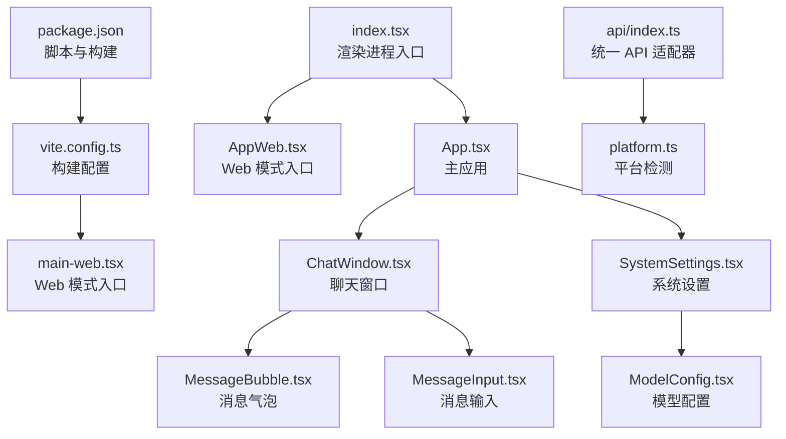
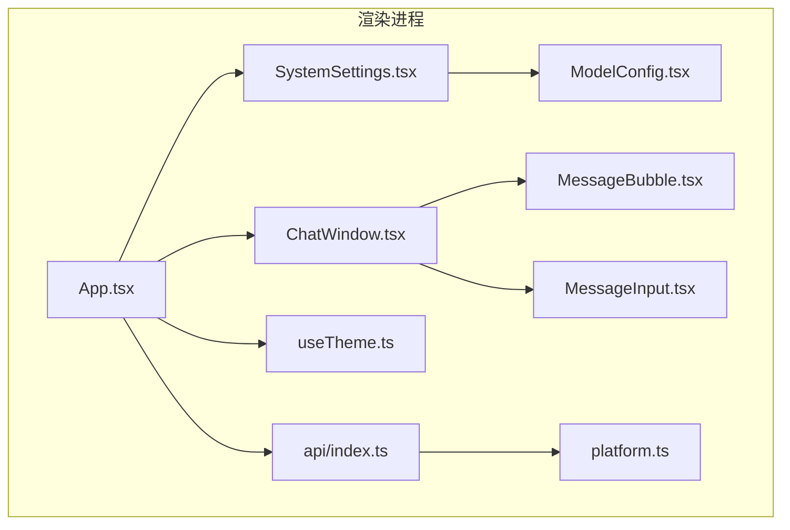
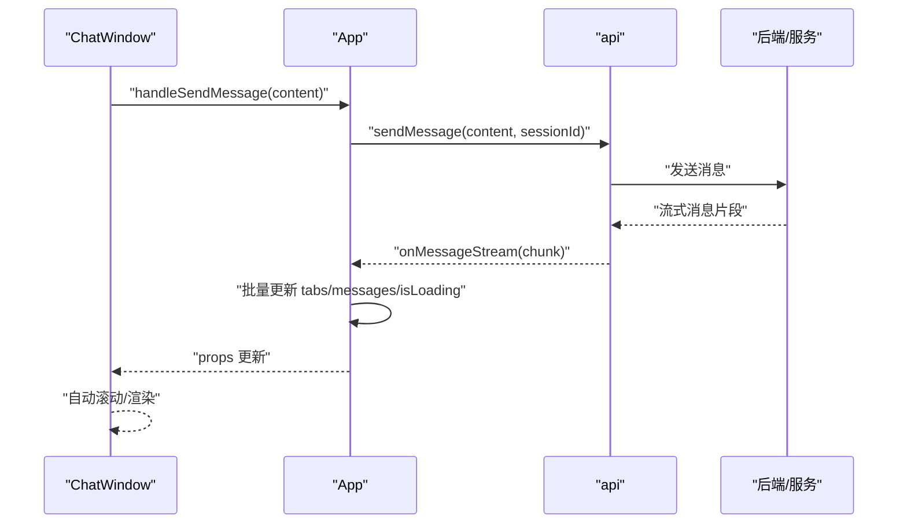
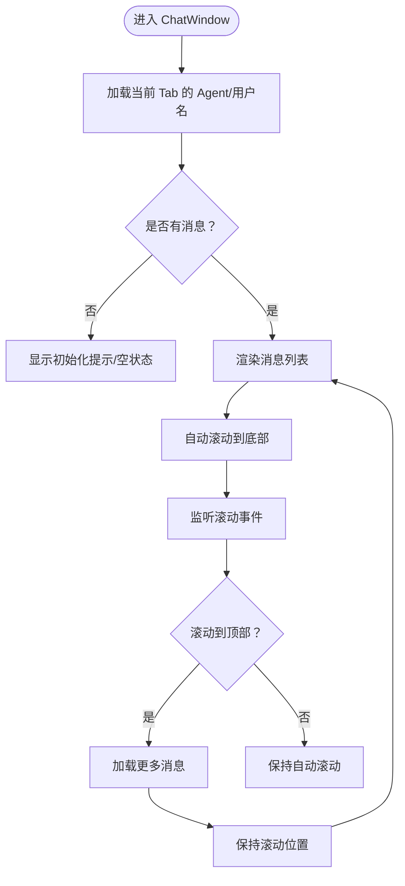
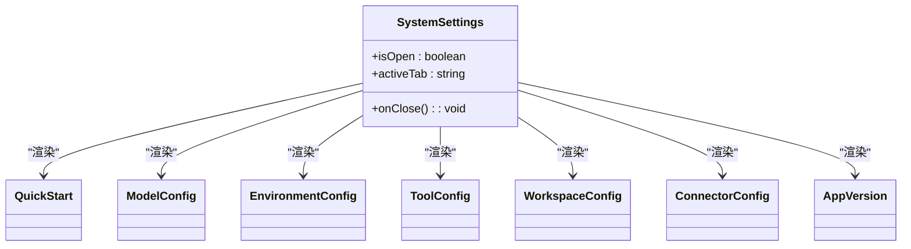
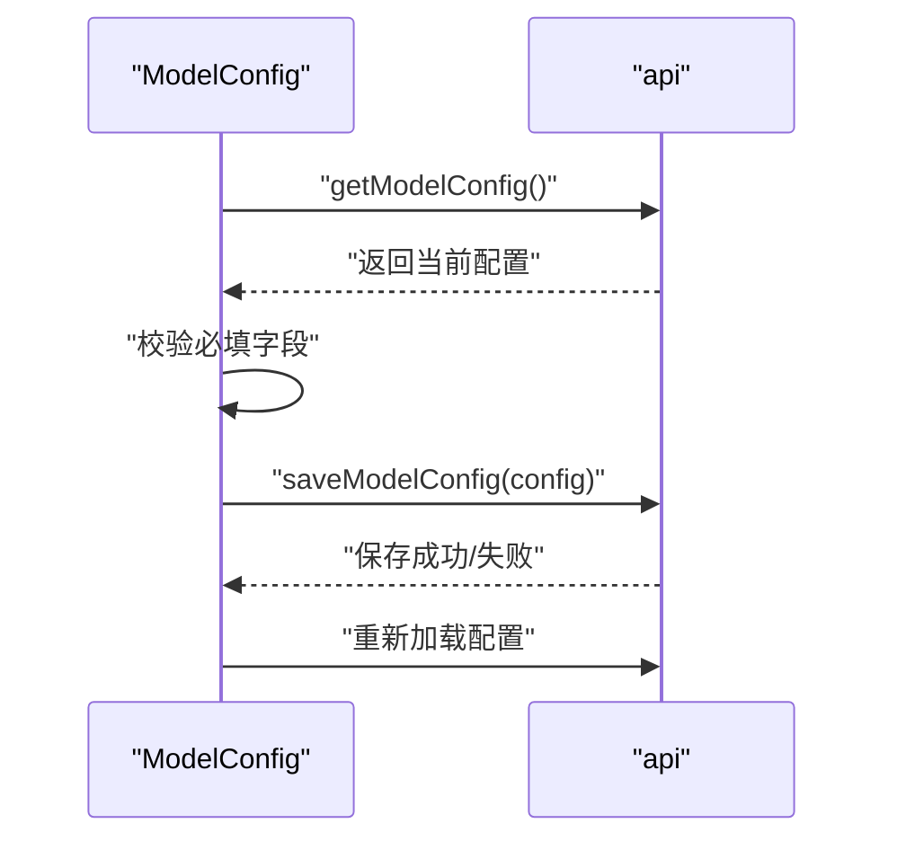
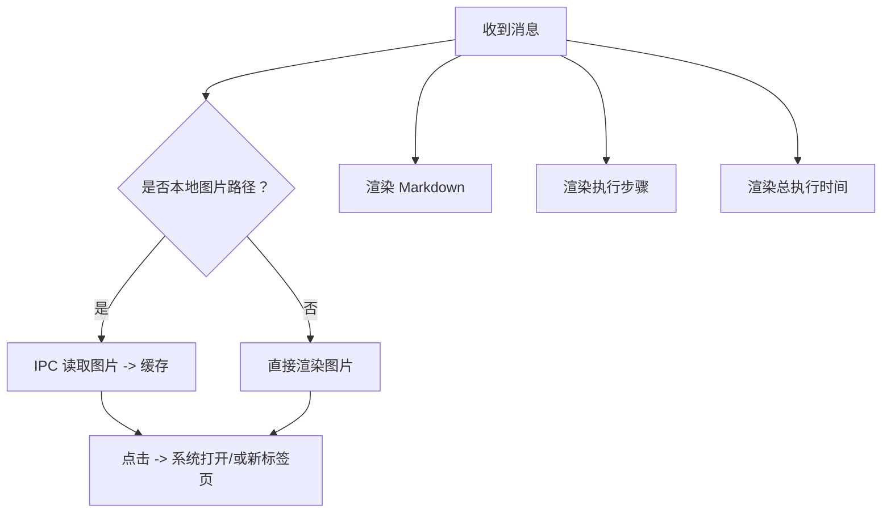
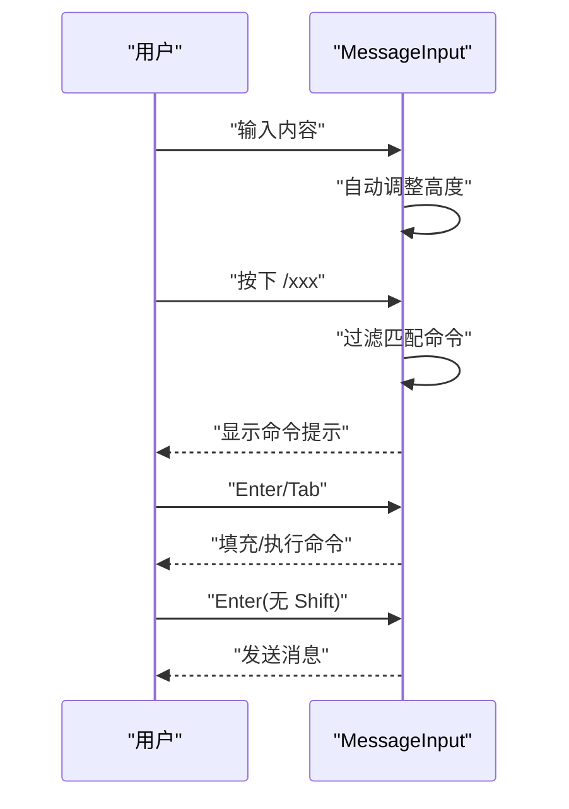
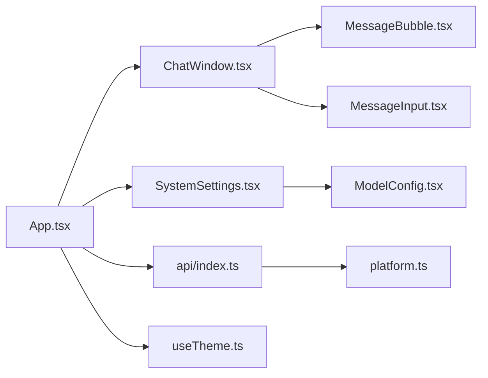

# 前端应用架构

<cite>
**本文档引用的文件**
- [src/renderer/App.tsx](file://src/renderer/App.tsx)
- [src/renderer/index.tsx](file://src/renderer/index.tsx)
- [src/renderer/main-web.tsx](file://src/renderer/main-web.tsx)
- [vite.config.ts](file://vite.config.ts)
- [package.json](file://package.json)
- [src/renderer/components/ChatWindow.tsx](file://src/renderer/components/ChatWindow.tsx)
- [src/renderer/components/SystemSettings.tsx](file://src/renderer/components/SystemSettings.tsx)
- [src/renderer/components/settings/ModelConfig.tsx](file://src/renderer/components/settings/ModelConfig.tsx)
- [src/renderer/components/MessageBubble.tsx](file://src/renderer/components/MessageBubble.tsx)
- [src/renderer/components/MessageInput.tsx](file://src/renderer/components/MessageInput.tsx)
- [src/renderer/hooks/useTheme.ts](file://src/renderer/hooks/useTheme.ts)
- [src/renderer/api/index.ts](file://src/renderer/api/index.ts)
- [src/renderer/utils/platform.ts](file://src/renderer/utils/platform.ts)
- [src/types/message.ts](file://src/types/message.ts)
- [src/renderer/styles/settings.css](file://src/renderer/styles/settings.css)
</cite>

## 目录
1. [简介](#简介)
2. [项目结构](#项目结构)
3. [核心组件](#核心组件)
4. [架构总览](#架构总览)
5. [详细组件分析](#详细组件分析)
6. [依赖关系分析](#依赖关系分析)
7. [性能考量](#性能考量)
8. [故障排查指南](#故障排查指南)
9. [结论](#结论)
10. [附录](#附录)

## 简介
本文件面向 DeepBot 前端应用，系统性梳理其 React 应用结构、组件层次、状态管理与路由配置，重点解析聊天窗口、系统设置与模型配置等核心 UI 组件的职责与实现方式；阐述组件间通信机制与数据流向；提供组件定制与扩展建议；并覆盖响应式设计与跨浏览器兼容策略及前端构建与部署流程。

## 项目结构
DeepBot 前端采用 Electron/Web 双模式开发，渲染进程基于 React + Vite，通过统一 API 适配器在不同运行环境下自动切换 IPC 或 HTTP 通道。入口文件根据 MODE 环境变量选择 App 或 AppWeb，分别对应 Electron 与 Web 模式。

图表来源
- [src/renderer/index.tsx:1-21](file://src/renderer/index.tsx#L1-L21)
- [src/renderer/App.tsx:1-741](file://src/renderer/App.tsx#L1-L741)
- [src/renderer/main-web.tsx:1-14](file://src/renderer/main-web.tsx#L1-L14)
- [vite.config.ts:1-63](file://vite.config.ts#L1-L63)
- [package.json:1-235](file://package.json#L1-L235)
- [src/renderer/api/index.ts:1-551](file://src/renderer/api/index.ts#L1-L551)
- [src/renderer/utils/platform.ts:1-27](file://src/renderer/utils/platform.ts#L1-L27)

章节来源
- [src/renderer/index.tsx:1-21](file://src/renderer/index.tsx#L1-L21)
- [vite.config.ts:1-63](file://vite.config.ts#L1-L63)
- [package.json:1-235](file://package.json#L1-L235)

## 核心组件
- 主应用 App：负责主题上下文、Tab 管理、消息流式接收与分发、系统设置开关、模型配置检查、待授权计数等全局状态与事件监听。
- 聊天窗口 ChatWindow：承载消息列表、输入区、Tab 标签、滚动与分页加载优化、提示符与命令提示、以及连接器 Tab 的特殊处理。
- 系统设置 SystemSettings：左右布局的设置面板，支持快速入门、模型配置、环境配置、工作目录、工具配置、外部通讯与版本信息等多标签页。
- 模型配置 ModelConfig：提供多种提供商预设与自定义配置，支持 API 地址、模型 ID、API Key、上下文窗口等字段的配置与保存。
- 消息气泡 MessageBubble：渲染 Markdown、图片、上传附件、执行步骤与总耗时等，具备图片缓存与本地文件读取能力。
- 消息输入 MessageInput：支持多行输入、自动高度、历史记录、命令提示与快捷键、图片/文件上传预览与发送。
- 主题 Hook useTheme：提供 light/dark/auto 三种主题模式，自动切换与持久化。
- 统一 API 适配器 api：在 Electron 与 Web 模式之间自动选择 IPC 或 HTTP 通道，封装事件监听、消息流、配置管理、文件上传等接口。

章节来源
- [src/renderer/App.tsx:1-741](file://src/renderer/App.tsx#L1-L741)
- [src/renderer/components/ChatWindow.tsx:1-510](file://src/renderer/components/ChatWindow.tsx#L1-L510)
- [src/renderer/components/SystemSettings.tsx:1-180](file://src/renderer/components/SystemSettings.tsx#L1-L180)
- [src/renderer/components/settings/ModelConfig.tsx:1-432](file://src/renderer/components/settings/ModelConfig.tsx#L1-L432)
- [src/renderer/components/MessageBubble.tsx:1-561](file://src/renderer/components/MessageBubble.tsx#L1-L561)
- [src/renderer/components/MessageInput.tsx:1-445](file://src/renderer/components/MessageInput.tsx#L1-L445)
- [src/renderer/hooks/useTheme.ts:1-64](file://src/renderer/hooks/useTheme.ts#L1-L64)
- [src/renderer/api/index.ts:1-551](file://src/renderer/api/index.ts#L1-L551)

## 架构总览
应用采用“统一 API 适配器 + 组件驱动”的架构。App 作为顶层容器协调全局状态与事件；ChatWindow 负责消息渲染与输入交互；SystemSettings 作为模态框承载各配置面板；api 抽象底层通信差异，平台检测模块辅助判断运行环境。

图表来源
- [src/renderer/App.tsx:1-741](file://src/renderer/App.tsx#L1-L741)
- [src/renderer/components/ChatWindow.tsx:1-510](file://src/renderer/components/ChatWindow.tsx#L1-L510)
- [src/renderer/components/SystemSettings.tsx:1-180](file://src/renderer/components/SystemSettings.tsx#L1-L180)
- [src/renderer/components/settings/ModelConfig.tsx:1-432](file://src/renderer/components/settings/ModelConfig.tsx#L1-L432)
- [src/renderer/components/MessageBubble.tsx:1-561](file://src/renderer/components/MessageBubble.tsx#L1-L561)
- [src/renderer/components/MessageInput.tsx:1-445](file://src/renderer/components/MessageInput.tsx#L1-L445)
- [src/renderer/hooks/useTheme.ts:1-64](file://src/renderer/hooks/useTheme.ts#L1-L64)
- [src/renderer/api/index.ts:1-551](file://src/renderer/api/index.ts#L1-L551)
- [src/renderer/utils/platform.ts:1-27](file://src/renderer/utils/platform.ts#L1-L27)

## 详细组件分析

### 主应用 App：状态管理与事件总线
- 主题上下文：通过 ThemeContext 与 useTheme 提供主题模式切换与持久化。
- Tab 管理：维护 tabs 与 activeTabId，支持创建、切换、关闭、标题更新、消息清空等。
- 消息流式处理：集中监听 onMessageStream、onExecutionStepUpdate、onMessageError 等事件，批量更新对应 Tab 的 messages 与 isLoading 状态，使用 requestAnimationFrame 降低重渲染成本。
- 模型配置检查：启动时检查模型配置，未配置时自动打开系统设置并注入系统提示消息。
- 待授权计数：监听连接器配对记录，展示徽标提醒。
- 事件清理：在组件卸载时统一移除监听器，避免内存泄漏。

图表来源
- [src/renderer/App.tsx:614-685](file://src/renderer/App.tsx#L614-L685)
- [src/renderer/api/index.ts:279-398](file://src/renderer/api/index.ts#L279-L398)

章节来源
- [src/renderer/App.tsx:18-741](file://src/renderer/App.tsx#L18-L741)
- [src/renderer/api/index.ts:1-551](file://src/renderer/api/index.ts#L1-L551)

### 聊天窗口 ChatWindow：消息渲染与输入交互
- 消息列表：支持分页加载（每次增加 20 条），自动滚动至底部，检测用户滚动以暂停/恢复自动滚动并在顶部加载更多。
- 初始化状态：根据 Tab 类型与消息数量动态显示初始化提示或空状态。
- 提示符与命令提示：根据角色显示不同提示符；支持以 “/” 开头的命令提示与快捷键选择。
- 输入区：集成图片/文件上传预览，自动高度调整，历史记录上下键浏览，发送/停止按钮状态联动。
- 连接器 Tab：特殊处理，不显示输入框，支持 /stop 指令。

图表来源
- [src/renderer/components/ChatWindow.tsx:58-247](file://src/renderer/components/ChatWindow.tsx#L58-L247)
- [src/renderer/components/ChatWindow.tsx:265-302](file://src/renderer/components/ChatWindow.tsx#L265-L302)

章节来源
- [src/renderer/components/ChatWindow.tsx:1-510](file://src/renderer/components/ChatWindow.tsx#L1-L510)

### 系统设置 SystemSettings：多标签页配置面板
- 左右布局：左侧菜单导航，右侧内容面板。
- 标签页：快速入门、模型配置、环境配置、工具配置、工作目录、外部通讯、系统版本。
- 版本更新提示：监听更新可用事件，显示小红点提醒。
- Toast 提示：全局 Toast 事件订阅，显示成功/错误提示。

图表来源
- [src/renderer/components/SystemSettings.tsx:31-179](file://src/renderer/components/SystemSettings.tsx#L31-L179)
- [src/renderer/components/settings/ModelConfig.tsx:31-432](file://src/renderer/components/settings/ModelConfig.tsx#L31-L432)

章节来源
- [src/renderer/components/SystemSettings.tsx:1-180](file://src/renderer/components/SystemSettings.tsx#L1-L180)

### 模型配置 ModelConfig：提供商与参数管理
- 提供商选择：支持 DeepBot/Qwen/DeepSeek/Gemini/MiniMax/Custom 等预设。
- API 类型：自定义模式下区分 OpenAI 兼容与 Google 原生 API。
- 配置字段：API 地址、模型 ID（主/快速）、API Key、上下文窗口大小。
- 环境变量提示：若配置来自 .env，显示提示并优先使用本地配置。
- 保存逻辑：验证必填项，保存后重新加载以获取后端推断的上下文窗口值。

图表来源
- [src/renderer/components/settings/ModelConfig.tsx:58-149](file://src/renderer/components/settings/ModelConfig.tsx#L58-L149)
- [src/renderer/api/index.ts:49-59](file://src/renderer/api/index.ts#L49-L59)

章节来源
- [src/renderer/components/settings/ModelConfig.tsx:1-432](file://src/renderer/components/settings/ModelConfig.tsx#L1-L432)

### 消息气泡 MessageBubble：富内容渲染与图片处理
- Markdown 渲染：使用 react-markdown + gfm，保持终端风格。
- 图片加载：支持本地文件路径通过 IPC 读取，data URL 转 Blob URL 打开，点击放大。
- 执行步骤：可展开/折叠，显示参数与结果/错误，优化错误场景仅显示错误框。
- 总执行时间：仅在 Agent 消息且存在时显示，包含发送时间戳。

图表来源
- [src/renderer/components/MessageBubble.tsx:26-140](file://src/renderer/components/MessageBubble.tsx#L26-L140)
- [src/renderer/components/MessageBubble.tsx:456-551](file://src/renderer/components/MessageBubble.tsx#L456-L551)

章节来源
- [src/renderer/components/MessageBubble.tsx:1-561](file://src/renderer/components/MessageBubble.tsx#L1-L561)

### 消息输入 MessageInput：命令与历史交互
- 自动高度：根据内容动态调整高度，最大 120px。
- 历史记录：上下键在首/末行且光标在边界时浏览历史。
- 命令提示：以 “/” 开头时显示匹配命令列表，支持上下键与 Tab/Enter 选择。
- 发送/停止：普通消息 Enter 发送，Shift+Enter 换行；生成中显示 STOP 按钮。

图表来源
- [src/renderer/components/MessageInput.tsx:95-138](file://src/renderer/components/MessageInput.tsx#L95-L138)
- [src/renderer/components/MessageInput.tsx:260-331](file://src/renderer/components/MessageInput.tsx#L260-L331)

章节来源
- [src/renderer/components/MessageInput.tsx:1-445](file://src/renderer/components/MessageInput.tsx#L1-L445)

### 主题 Hook useTheme：自动/浅色/深色主题
- 模式：light/dark/auto，默认深色。
- 自动模式：6:00-18:00 浅色，其余深色。
- 持久化：localStorage 保存用户选择。
- DOM 应用：通过 data-theme 属性切换主题。

章节来源
- [src/renderer/hooks/useTheme.ts:1-64](file://src/renderer/hooks/useTheme.ts#L1-L64)

### 统一 API 适配器 api：跨环境通信
- 环境判断：isElectron() 自动选择 IPC 或 HTTP。
- 事件监听：onMessageStream/onExecutionStepUpdate/onMessageError 等统一注册与分发。
- WebSocket：Web 模式下创建连接并批量订阅所有 Tab，确保历史消息推送不遗漏。
- 配置管理：getModelConfig/saveModelConfig 等配置读写接口。

章节来源
- [src/renderer/api/index.ts:1-551](file://src/renderer/api/index.ts#L1-L551)
- [src/renderer/utils/platform.ts:1-27](file://src/renderer/utils/platform.ts#L1-L27)

## 依赖关系分析
- 组件耦合：App 与 ChatWindow 强耦合（状态与事件），ChatWindow 与 MessageBubble/MessageInput 弱耦合（通过 props 传入回调）。
- 外部依赖：react-markdown、remark-gfm、TailwindCSS、lucide-react 等。
- 构建依赖：Vite、React 插件、PostCSS、TailwindCSS、TypeScript。

图表来源
- [src/renderer/App.tsx:1-741](file://src/renderer/App.tsx#L1-L741)
- [src/renderer/components/ChatWindow.tsx:1-510](file://src/renderer/components/ChatWindow.tsx#L1-L510)
- [src/renderer/components/MessageBubble.tsx:1-561](file://src/renderer/components/MessageBubble.tsx#L1-L561)
- [src/renderer/components/MessageInput.tsx:1-445](file://src/renderer/components/MessageInput.tsx#L1-L445)
- [src/renderer/components/SystemSettings.tsx:1-180](file://src/renderer/components/SystemSettings.tsx#L1-L180)
- [src/renderer/components/settings/ModelConfig.tsx:1-432](file://src/renderer/components/settings/ModelConfig.tsx#L1-L432)
- [src/renderer/api/index.ts:1-551](file://src/renderer/api/index.ts#L1-L551)
- [src/renderer/utils/platform.ts:1-27](file://src/renderer/utils/platform.ts#L1-L27)
- [src/renderer/hooks/useTheme.ts:1-64](file://src/renderer/hooks/useTheme.ts#L1-L64)

章节来源
- [package.json:45-107](file://package.json#L45-L107)

## 性能考量
- 批量更新与重渲染优化：App 使用 requestAnimationFrame 批量更新消息与加载状态，减少频繁重渲染。
- 消息分页加载：ChatWindow 每次只渲染最近 20 条消息，滚动到顶部再增量加载，避免长列表卡顿。
- 图片缓存：MessageBubble 对本地图片进行缓存，避免重复 IPC 读取。
- 自动滚动与 MutationObserver：仅在内容高度变化时滚动，避免重复滚动与抖动。
- 事件监听清理：组件卸载时移除所有监听器，防止内存泄漏。
- 主题切换：useTheme 通过定时器在自动模式下按分钟检查时间切换，避免高频 DOM 操作。

章节来源
- [src/renderer/App.tsx:374-507](file://src/renderer/App.tsx#L374-L507)
- [src/renderer/components/ChatWindow.tsx:220-241](file://src/renderer/components/ChatWindow.tsx#L220-L241)
- [src/renderer/components/MessageBubble.tsx:19-100](file://src/renderer/components/MessageBubble.tsx#L19-L100)
- [src/renderer/hooks/useTheme.ts:45-54](file://src/renderer/hooks/useTheme.ts#L45-L54)

## 故障排查指南
- 模型未配置：App 启动时检查模型配置，未配置则注入系统提示消息并打开系统设置。
- 发送失败：handleSendMessage 捕获异常并注入错误消息，必要时打开系统设置。
- WebSocket 连接：Web 模式下 api.createWebSocket() 建立连接并批量订阅所有 Tab，出现错误/关闭时清理订阅集合。
- 图片加载失败：MessageBubble 中对本地图片通过 IPC 读取，失败时显示错误提示；否则尝试用 Blob URL 在新标签页打开。
- 平台差异：isElectron()/isWeb() 用于区分 Electron 与 Web 行为，如 openPath/selectFolder 等仅在 Electron 生效。

章节来源
- [src/renderer/App.tsx:271-297](file://src/renderer/App.tsx#L271-L297)
- [src/renderer/App.tsx:658-684](file://src/renderer/App.tsx#L658-L684)
- [src/renderer/api/index.ts:412-487](file://src/renderer/api/index.ts#L412-L487)
- [src/renderer/components/MessageBubble.tsx:80-99](file://src/renderer/components/MessageBubble.tsx#L80-L99)
- [src/renderer/utils/platform.ts:7-27](file://src/renderer/utils/platform.ts#L7-L27)

## 结论
DeepBot 前端以统一 API 适配器为核心，结合 React 组件化与事件驱动模式，在 Electron/Web 双环境中实现一致的用户体验。通过分页加载、批量更新、图片缓存与主题自动切换等优化手段，兼顾性能与可维护性。系统设置与模型配置模块提供了完善的配置管理能力，便于企业级部署与运维。

## 附录

### 响应式设计与跨浏览器兼容
- 响应式：通过 TailwindCSS 断点与 Flex 布局适配不同屏幕尺寸。
- 跨浏览器：Vite 默认使用现代语法，TailwindCSS 与 PostCSS 提供基础兼容性；Electron 内核与现代浏览器一致，Web 环境建议使用现代浏览器以获得最佳体验。
- 滚动条与焦点：统一滚动条样式与移除默认 focus ring，提升一致性。

章节来源
- [src/renderer/styles/settings.css:543-576](file://src/renderer/styles/settings.css#L543-L576)

### 前端构建与部署流程
- 开发模式：
  - Electron：pnpm dev 同时启动渲染与主进程，自动等待 Vite 服务就绪后启动 Electron。
  - Web：pnpm dev:web-docker 或 pnpm dev:web 启动服务端与渲染端，配合 nodemon 热更新。
- 构建产物：
  - Electron：vite build 输出 dist，包含渲染与静态资源。
  - Web：vite build --mode web 输出 dist-web，入口替换为 main-web.tsx。
- 打包与发布：package.json 中包含打包脚本，结合 electron-builder 进行多平台打包与签名。

章节来源
- [package.json:9-44](file://package.json#L9-L44)
- [vite.config.ts:11-42](file://vite.config.ts#L11-L42)