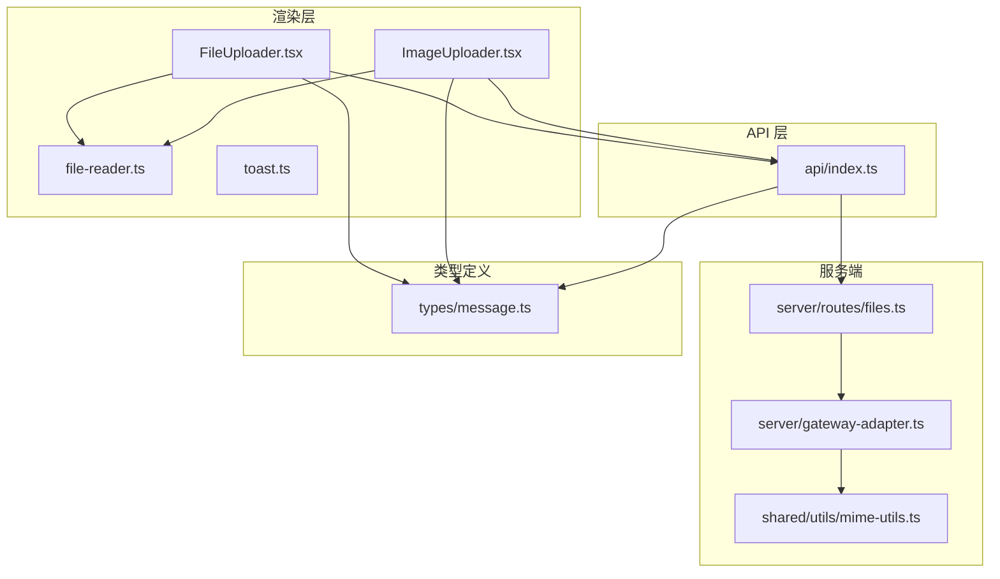
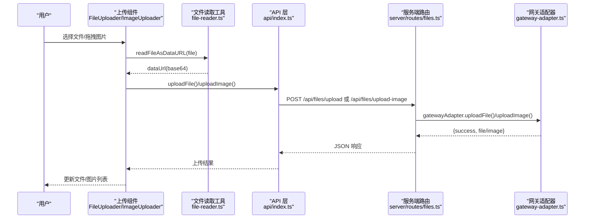
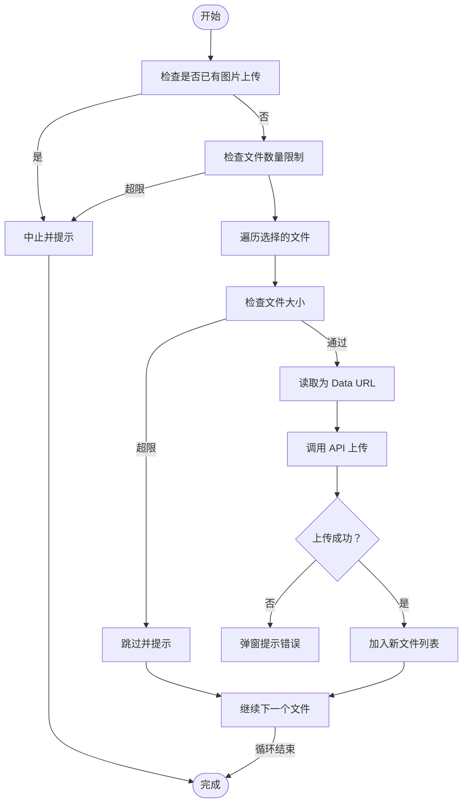
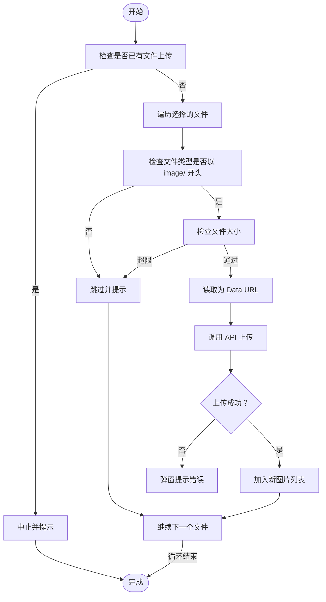
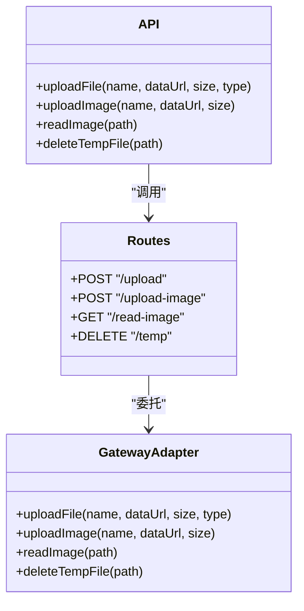
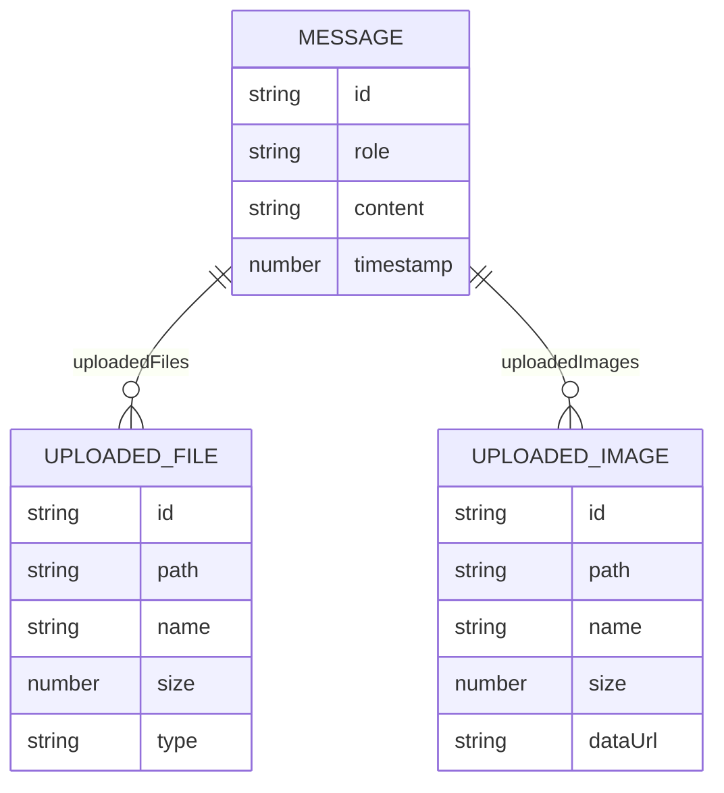
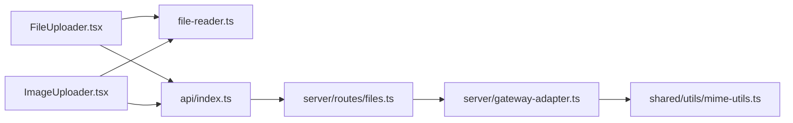

# 文件上传组件

<cite>
**本文引用的文件**
- [FileUploader.tsx](file://src/renderer/components/FileUploader.tsx)
- [ImageUploader.tsx](file://src/renderer/components/ImageUploader.tsx)
- [file-reader.ts](file://src/renderer/utils/file-reader.ts)
- [files.ts](file://src/server/routes/files.ts)
- [gateway-adapter.ts](file://src/server/gateway-adapter.ts)
- [mime-utils.ts](file://src/shared/utils/mime-utils.ts)
- [message.ts](file://src/types/message.ts)
- [index.ts](file://src/renderer/api/index.ts)
- [toast.ts](file://src/renderer/utils/toast.ts)
</cite>

## 目录
1. [简介](#简介)
2. [项目结构](#项目结构)
3. [核心组件](#核心组件)
4. [架构概览](#架构概览)
5. [详细组件分析](#详细组件分析)
6. [依赖关系分析](#依赖关系分析)
7. [性能考量](#性能考量)
8. [故障排查指南](#故障排查指南)
9. [结论](#结论)
10. [附录](#附录)

## 简介
本文件上传组件旨在为 史丽慧小助理 提供完整的文件与图片上传能力，覆盖以下关键能力：
- 文件选择与图片选择：支持点击触发与隐藏输入框两种方式
- 拖拽上传：图片上传组件支持拖拽交互（基于标准 HTML 拖放 API）
- 进度显示：当前实现未包含上传进度反馈，但预留了扩展点
- 错误处理：包含参数校验、大小限制、类型限制与异常捕获
- 文件读取与格式验证：浏览器端读取为 Data URL，服务端解析并持久化
- 与后端 API 的交互：通过统一 API 层进行跨平台适配（Electron/Web）
- 安全考虑：路径白名单、临时目录隔离与错误信息规范化
- 性能优化建议：分片上传、并发控制与内存占用优化
- 多文件与批量处理：组件支持多文件选择与逐个处理流程

## 项目结构
文件上传相关的核心文件分布如下：
- 渲染层组件：FileUploader.tsx、ImageUploader.tsx
- 工具函数：file-reader.ts（浏览器端读取）、mime-utils.ts（MIME 工具）
- 类型定义：message.ts（UploadedFile、UploadedImage）
- API 层：index.ts（统一 API，区分 Electron/Web）
- 服务端路由：files.ts（文件上传、图片读取、临时文件删除）
- 网关适配器：gateway-adapter.ts（实际文件写入、读取与删除）

**图表来源**
- [FileUploader.tsx:1-238](file://src/renderer/components/FileUploader.tsx#L1-L238)
- [ImageUploader.tsx:1-242](file://src/renderer/components/ImageUploader.tsx#L1-L242)
- [file-reader.ts:1-24](file://src/renderer/utils/file-reader.ts#L1-L24)
- [files.ts:1-107](file://src/server/routes/files.ts#L1-L107)
- [gateway-adapter.ts:548-720](file://src/server/gateway-adapter.ts#L548-L720)
- [mime-utils.ts:1-33](file://src/shared/utils/mime-utils.ts#L1-L33)
- [message.ts:28-47](file://src/types/message.ts#L28-L47)
- [index.ts:298-329](file://src/renderer/api/index.ts#L298-L329)

**章节来源**
- [FileUploader.tsx:1-238](file://src/renderer/components/FileUploader.tsx#L1-L238)
- [ImageUploader.tsx:1-242](file://src/renderer/components/ImageUploader.tsx#L1-L242)
- [files.ts:1-107](file://src/server/routes/files.ts#L1-L107)
- [gateway-adapter.ts:548-720](file://src/server/gateway-adapter.ts#L548-L720)
- [mime-utils.ts:1-33](file://src/shared/utils/mime-utils.ts#L1-L33)
- [message.ts:28-47](file://src/types/message.ts#L28-L47)
- [index.ts:298-329](file://src/renderer/api/index.ts#L298-L329)

## 核心组件
- 文件上传组件（FileUploader）
  - 功能：支持点击上传、最多 5 个文件、每个最大 500MB；显示文件列表与删除按钮
  - 互斥控制：当存在图片上传时禁止同时上传文件
  - 交互：隐藏的文件输入框配合按钮触发；支持“只显示按钮”和“只显示预览”两种模式
  - 数据流：读取为 Data URL → 通过 API 上传 → 服务端保存至临时目录 → 返回 UploadedFile

- 图片上传组件（ImageUploader）
  - 功能：支持点击与拖拽上传、最多 5 张图片、每张最大 5MB；显示缩略图与删除按钮
  - 互斥控制：当存在文件上传时禁止同时上传图片
  - 交互：accept="image/*" 限定图片类型；支持“只显示按钮”和“只显示预览”两种模式
  - 数据流：读取为 Data URL → 通过 API 上传 → 服务端保存至临时目录 → 返回 UploadedImage

- 文件读取工具（file-reader.ts）
  - 功能：将 File 对象读取为 Data URL（Promise 包装）
  - 用途：为上传组件提供 base64 数据源

- 类型定义（message.ts）
  - UploadedFile：包含 id、path、name、size、type
  - UploadedImage：包含 id、path、name、size、dataUrl

**章节来源**
- [FileUploader.tsx:1-238](file://src/renderer/components/FileUploader.tsx#L1-L238)
- [ImageUploader.tsx:1-242](file://src/renderer/components/ImageUploader.tsx#L1-L242)
- [file-reader.ts:1-24](file://src/renderer/utils/file-reader.ts#L1-L24)
- [message.ts:28-47](file://src/types/message.ts#L28-L47)

## 架构概览
文件上传的端到端流程如下：

**图表来源**
- [FileUploader.tsx:71-87](file://src/renderer/components/FileUploader.tsx#L71-L87)
- [ImageUploader.tsx:77-93](file://src/renderer/components/ImageUploader.tsx#L77-L93)
- [file-reader.ts:16-23](file://src/renderer/utils/file-reader.ts#L16-L23)
- [index.ts:298-311](file://src/renderer/api/index.ts#L298-L311)
- [files.ts:14-57](file://src/server/routes/files.ts#L14-L57)
- [gateway-adapter.ts:630-643](file://src/server/gateway-adapter.ts#L630-L643)

## 详细组件分析

### 文件上传组件（FileUploader）
- 输入参数与行为
  - maxFiles：默认 5，超出提示
  - maxSizeMB：默认 500MB，逐个文件检查
  - hasImages：互斥检查，防止同时上传文件与图片
  - showButtonOnly/showPreviewOnly：三种展示模式
- 处理流程
  - 读取文件为 Data URL
  - 调用 API 上传（文件名、Data URL、大小、类型）
  - 服务端保存到临时目录，返回 UploadedFile
  - 更新父组件状态并清空 input
- 错误处理
  - 参数缺失、大小超限、类型不符、网络异常均弹窗提示
  - 服务端返回错误时统一处理

**图表来源**
- [FileUploader.tsx:38-97](file://src/renderer/components/FileUploader.tsx#L38-L97)

**章节来源**
- [FileUploader.tsx:1-238](file://src/renderer/components/FileUploader.tsx#L1-L238)

### 图片上传组件（ImageUploader）
- 输入参数与行为
  - maxImages：默认 5，超出提示
  - maxSizeMB：默认 5MB，逐个文件检查
  - hasFiles：互斥检查，防止同时上传文件与图片
  - accept="image/*" 限定图片类型
- 处理流程
  - 读取为 Data URL
  - 调用 API 上传（文件名、Data URL、大小）
  - 服务端保存到临时目录，返回 UploadedImage（包含 dataUrl 用于缩略图）
  - 更新父组件状态并清空 input
- 错误处理
  - 类型非 image/*、大小超限、网络异常均弹窗提示

**图表来源**
- [ImageUploader.tsx:38-103](file://src/renderer/components/ImageUploader.tsx#L38-L103)

**章节来源**
- [ImageUploader.tsx:1-242](file://src/renderer/components/ImageUploader.tsx#L1-L242)

### API 与后端交互
- API 层（统一入口）
  - uploadFile(fileName, dataUrl, fileSize, fileType)
  - uploadImage(fileName, dataUrl, fileSize)
  - readImage(filePath)
  - deleteTempFile(filePath)
  - 自动区分 Electron 与 Web 环境，分别调用 IPC 或 HTTP
- 服务端路由
  - POST /api/files/upload：接收 fileName、dataUrl、fileSize、fileType
  - POST /api/files/upload-image：接收 fileName、dataUrl、fileSize
  - GET /api/files/read-image：按路径读取图片并转为 Data URL
  - DELETE /api/files/temp：删除临时文件（带路径校验）
- 网关适配器
  - uploadFile：解析 Data URL，写入工作目录下的临时 uploads 目录，返回 UploadedFile
  - uploadImage：同上，但限制更严格（5MB）
  - readImage：路径白名单校验，读取后转换为 Data URL
  - deleteTempFile：路径必须位于临时目录内，否则拒绝

**图表来源**
- [index.ts:298-329](file://src/renderer/api/index.ts#L298-L329)
- [files.ts:14-103](file://src/server/routes/files.ts#L14-L103)
- [gateway-adapter.ts:630-720](file://src/server/gateway-adapter.ts#L630-L720)

**章节来源**
- [index.ts:298-329](file://src/renderer/api/index.ts#L298-L329)
- [files.ts:1-107](file://src/server/routes/files.ts#L1-L107)
- [gateway-adapter.ts:548-720](file://src/server/gateway-adapter.ts#L548-L720)

### 类型与数据模型
- UploadedFile：用于文件上传后的元数据
- UploadedImage：用于图片上传后的元数据（包含 dataUrl 用于缩略图）
- Message：消息体可携带 uploadedFiles 与 uploadedImages 字段

**图表来源**
- [message.ts:28-63](file://src/types/message.ts#L28-L63)

**章节来源**
- [message.ts:28-63](file://src/types/message.ts#L28-L63)

## 依赖关系分析
- 组件依赖
  - FileUploader/ImageUploader 依赖 file-reader.ts 进行 Data URL 读取
  - 两者均通过 api/index.ts 调用后端接口
- API 层依赖
  - api/index.ts 在 Electron 与 Web 环境间自动切换
  - Web 模式下通过 HTTP 客户端访问 /api/files/*
- 服务端依赖
  - routes/files.ts 将请求转发给 gateway-adapter.ts
  - gateway-adapter.ts 使用 mime-utils.ts 进行图片 MIME 转换
  - 临时文件保存在工作目录的 .slhbot/temp/uploads 下

**图表来源**
- [FileUploader.tsx:10-14](file://src/renderer/components/FileUploader.tsx#L10-L14)
- [ImageUploader.tsx:10-14](file://src/renderer/components/ImageUploader.tsx#L10-L14)
- [index.ts:298-311](file://src/renderer/api/index.ts#L298-L311)
- [files.ts:14-57](file://src/server/routes/files.ts#L14-L57)
- [gateway-adapter.ts:645-682](file://src/server/gateway-adapter.ts#L645-L682)
- [mime-utils.ts:28-32](file://src/shared/utils/mime-utils.ts#L28-L32)

**章节来源**
- [FileUploader.tsx:10-14](file://src/renderer/components/FileUploader.tsx#L10-L14)
- [ImageUploader.tsx:10-14](file://src/renderer/components/ImageUploader.tsx#L10-L14)
- [index.ts:298-311](file://src/renderer/api/index.ts#L298-L311)
- [files.ts:14-57](file://src/server/routes/files.ts#L14-L57)
- [gateway-adapter.ts:645-682](file://src/server/gateway-adapter.ts#L645-L682)
- [mime-utils.ts:28-32](file://src/shared/utils/mime-utils.ts#L28-L32)

## 性能考量
- 当前实现
  - 文件读取采用 FileReader.readAsDataURL，适合中小文件
  - 服务端直接写入磁盘，简单可靠
- 优化建议
  - 分片上传：将大文件切分为多个片段，提升稳定性与断点续传能力
  - 并发控制：限制同时上传的任务数，避免内存峰值过高
  - 内存占用：对超大文件建议使用流式读取或 Blob.slice，减少一次性内存压力
  - 缓存策略：对已上传的相同文件进行去重与缓存，避免重复传输
  - 压缩预处理：对图片进行压缩或格式转换，降低体积与带宽消耗
  - 进度反馈：在 API 层增加上传进度回调，增强用户体验

[本节为通用性能指导，不直接分析具体文件，故无章节来源]

## 故障排查指南
- 常见问题与定位
  - 无法上传：检查 API 层是否正确区分 Electron/Web 环境
  - 文件过大：确认前端限制与后端限制一致（文件 500MB，图片 5MB）
  - 类型不符：图片上传需满足 image/* 类型
  - 路径错误：readImage/deleteTempFile 仅允许工作目录及其子目录
- 错误处理
  - 组件层：统一 alert 提示与 console 错误输出
  - API 层：HTTP 请求失败时返回标准化错误
  - 服务端：统一错误信息封装，避免泄露内部细节
- 建议
  - 使用 toast.ts 进行统一通知（当前组件仍使用 alert，可逐步替换）
  - 增加重试与退避策略，提升网络不稳定场景的可用性

**章节来源**
- [FileUploader.tsx:83-86](file://src/renderer/components/FileUploader.tsx#L83-L86)
- [ImageUploader.tsx:89-92](file://src/renderer/components/ImageUploader.tsx#L89-L92)
- [index.ts:298-329](file://src/renderer/api/index.ts#L298-L329)
- [files.ts:14-103](file://src/server/routes/files.ts#L14-L103)
- [gateway-adapter.ts:645-720](file://src/server/gateway-adapter.ts#L645-L720)
- [toast.ts:1-28](file://src/renderer/utils/toast.ts#L1-L28)

## 结论
史丽慧小助理 的文件上传组件通过清晰的职责分离与跨平台适配，实现了稳定可靠的文件与图片上传能力。组件具备完善的参数校验、互斥控制与错误处理机制，服务端通过严格的路径白名单与临时目录隔离保障安全性。未来可在分片上传、并发控制与进度反馈等方面进一步优化，以满足更大规模与更高性能的需求。

[本节为总结性内容，不直接分析具体文件，故无章节来源]

## 附录
- 互斥规则
  - 文件上传与图片上传互斥：任一存在即阻止另一类上传
- 展示模式
  - 默认完整模式：按钮 + 列表
  - 只显示按钮：内联按钮，适合输入框内嵌
  - 只显示预览：悬浮层展示，便于快速查看与删除
- MIME 工具
  - imageToDataUrl：根据扩展名推导 MIME 并拼接 Data URL

**章节来源**
- [FileUploader.tsx:41-45](file://src/renderer/components/FileUploader.tsx#L41-L45)
- [ImageUploader.tsx:41-45](file://src/renderer/components/ImageUploader.tsx#L41-L45)
- [mime-utils.ts:28-32](file://src/shared/utils/mime-utils.ts#L28-L32)