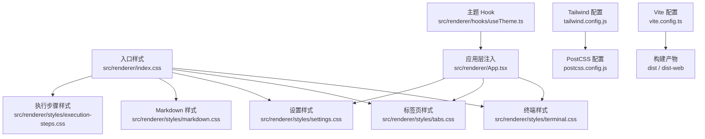
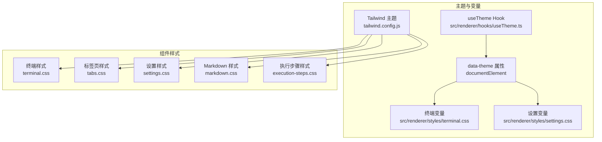
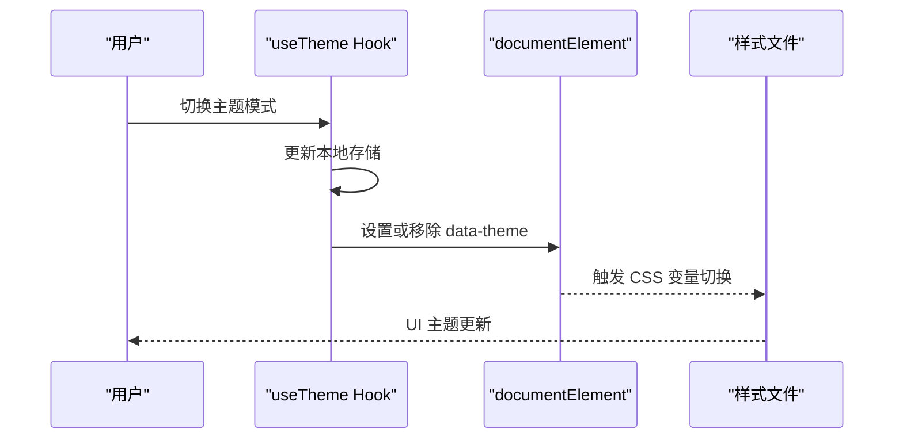
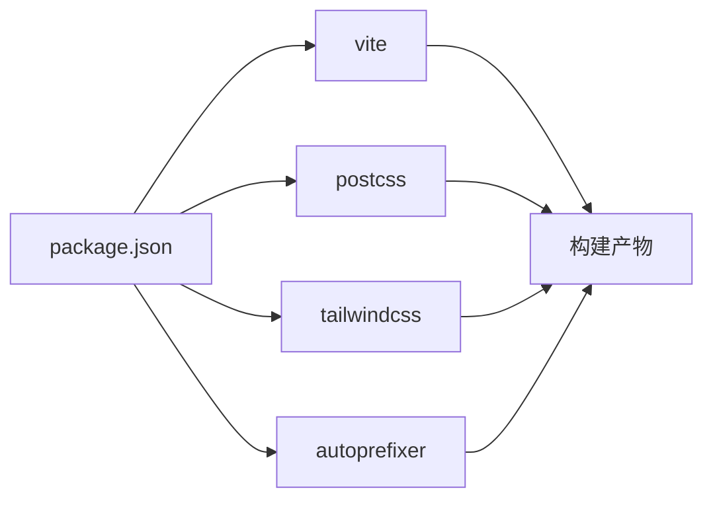

# 样式系统

<cite>
**本文档引用的文件**
- [tailwind.config.js](file://tailwind.config.js)
- [postcss.config.js](file://postcss.config.js)
- [src/renderer/index.css](file://src/renderer/index.css)
- [vite.config.ts](file://vite.config.ts)
- [src/renderer/hooks/useTheme.ts](file://src/renderer/hooks/useTheme.ts)
- [src/renderer/styles/terminal.css](file://src/renderer/styles/terminal.css)
- [src/renderer/styles/tabs.css](file://src/renderer/styles/tabs.css)
- [src/renderer/styles/settings.css](file://src/renderer/styles/settings.css)
- [src/renderer/styles/markdown.css](file://src/renderer/styles/markdown.css)
- [src/renderer/styles/execution-steps.css](file://src/renderer/styles/execution-steps.css)
- [src/renderer/components/ChatWindow.tsx](file://src/renderer/components/ChatWindow.tsx)
- [src/renderer/App.tsx](file://src/renderer/App.tsx)
- [package.json](file://package.json)
</cite>

## 目录
1. [简介](#简介)
2. [项目结构](#项目结构)
3. [核心组件](#核心组件)
4. [架构总览](#架构总览)
5. [详细组件分析](#详细组件分析)
6. [依赖分析](#依赖分析)
7. [性能考量](#性能考量)
8. [故障排查指南](#故障排查指南)
9. [结论](#结论)
10. [附录](#附录)

## 简介
本文件系统性梳理 DeepBot 的样式体系，覆盖 CSS 文件组织、Tailwind CSS 配置与使用、PostCSS 预处理与构建流程、主题切换机制、响应式与跨浏览器兼容策略，以及样式定制与主题切换的实践指南。文档面向不同技术背景的读者，既提供高层架构说明，也给出代码级的可视化与实操建议。

## 项目结构
样式系统采用“基础样式 + 组件样式 + 主题变量”的分层组织：
- 基础样式：通过入口 CSS 导入各模块样式，统一全局与基础排版。
- 组件样式：按功能域拆分，如终端、标签页、设置、Markdown、执行步骤等。
- 主题系统：基于 CSS 变量与 data-theme 属性，支持深浅与自动模式。
- 构建链路：Vite + PostCSS + Tailwind，支持 Web/Electron 双模式。

图表来源
- [src/renderer/index.css:1-55](file://src/renderer/index.css#L1-L55)
- [src/renderer/styles/terminal.css:1-80](file://src/renderer/styles/terminal.css#L1-L80)
- [src/renderer/styles/tabs.css:1-181](file://src/renderer/styles/tabs.css#L1-L181)
- [src/renderer/styles/settings.css:1-621](file://src/renderer/styles/settings.css#L1-L621)
- [src/renderer/styles/markdown.css:1-437](file://src/renderer/styles/markdown.css#L1-L437)
- [src/renderer/styles/execution-steps.css:1-296](file://src/renderer/styles/execution-steps.css#L1-L296)
- [src/renderer/hooks/useTheme.ts:1-64](file://src/renderer/hooks/useTheme.ts#L1-L64)
- [src/renderer/App.tsx:1-741](file://src/renderer/App.tsx#L1-L741)
- [tailwind.config.js:1-76](file://tailwind.config.js#L1-L76)
- [postcss.config.js:1-7](file://postcss.config.js#L1-L7)
- [vite.config.ts:1-63](file://vite.config.ts#L1-L63)

章节来源
- [src/renderer/index.css:1-55](file://src/renderer/index.css#L1-L55)
- [tailwind.config.js:1-76](file://tailwind.config.js#L1-L76)
- [postcss.config.js:1-7](file://postcss.config.js#L1-L7)
- [vite.config.ts:1-63](file://vite.config.ts#L1-L63)

## 核心组件
- Tailwind CSS：提供原子化类名与响应式工具，配合自定义主题扩展。
- PostCSS：启用 Tailwind 与 Autoprefixer，统一厂商前缀与兼容性。
- 主题系统：useTheme Hook 管理主题模式与持久化，通过 data-theme 控制 CSS 变量。
- 组件样式：终端、标签页、设置、Markdown、执行步骤等模块化样式文件。
- 构建链路：Vite 在开发与生产模式下分别输出 Electron 或 Web 构建。

章节来源
- [tailwind.config.js:1-76](file://tailwind.config.js#L1-L76)
- [postcss.config.js:1-7](file://postcss.config.js#L1-L7)
- [src/renderer/hooks/useTheme.ts:1-64](file://src/renderer/hooks/useTheme.ts#L1-L64)
- [src/renderer/styles/terminal.css:1-80](file://src/renderer/styles/terminal.css#L1-L80)
- [src/renderer/styles/tabs.css:1-181](file://src/renderer/styles/tabs.css#L1-L181)
- [src/renderer/styles/settings.css:1-621](file://src/renderer/styles/settings.css#L1-L621)
- [src/renderer/styles/markdown.css:1-437](file://src/renderer/styles/markdown.css#L1-L437)
- [src/renderer/styles/execution-steps.css:1-296](file://src/renderer/styles/execution-steps.css#L1-L296)
- [vite.config.ts:1-63](file://vite.config.ts#L1-L63)

## 架构总览
样式系统围绕“主题变量 + 组件样式 + Tailwind 工具类”展开，主题模式通过 data-theme 切换，组件样式以 CSS 变量驱动深浅两套配色，同时保留独立的终端主题变量以实现科幻风格。

图表来源
- [src/renderer/hooks/useTheme.ts:1-64](file://src/renderer/hooks/useTheme.ts#L1-L64)
- [src/renderer/styles/terminal.css:1-80](file://src/renderer/styles/terminal.css#L1-L80)
- [src/renderer/styles/settings.css:1-621](file://src/renderer/styles/settings.css#L1-L621)
- [tailwind.config.js:1-76](file://tailwind.config.js#L1-L76)
- [src/renderer/styles/terminal.css:1-80](file://src/renderer/styles/terminal.css#L1-L80)
- [src/renderer/styles/tabs.css:1-181](file://src/renderer/styles/tabs.css#L1-L181)
- [src/renderer/styles/settings.css:1-621](file://src/renderer/styles/settings.css#L1-L621)
- [src/renderer/styles/markdown.css:1-437](file://src/renderer/styles/markdown.css#L1-L437)
- [src/renderer/styles/execution-steps.css:1-296](file://src/renderer/styles/execution-steps.css#L1-L296)

## 详细组件分析

### Tailwind CSS 配置与使用
- 配置范围：扫描入口 HTML 与 src 目录下的 JS/TS/JSX/TSX 文件，确保原子类被正确摇树。
- 主题扩展：品牌色、背景色、边框色、文字色；字体族（无衬线与等宽）；字号与字重。
- 插件：未启用额外插件，保持最小依赖。

章节来源
- [tailwind.config.js:1-76](file://tailwind.config.js#L1-L76)

### PostCSS 预处理与构建流程
- 插件：tailwindcss、autoprefixer。
- 构建：Vite 在开发模式下热更新，生产模式下打包；Web/Electron 双模式通过 mode 区分入口与输出目录。

章节来源
- [postcss.config.js:1-7](file://postcss.config.js#L1-L7)
- [vite.config.ts:1-63](file://vite.config.ts#L1-L63)

### 主题系统与主题切换
- 模式：light、dark、auto（6:00-18:00 为 light，其余为 dark）。
- 存储：localStorage 持久化。
- 应用：useTheme 将当前主题写入 documentElement 的 data-theme 属性，组件样式通过 [data-theme="light"] 与 :root 双轨变量实现深浅两套配色。
- 自动切换：auto 模式下每分钟检查一次时间并应用。

图表来源
- [src/renderer/hooks/useTheme.ts:1-64](file://src/renderer/hooks/useTheme.ts#L1-L64)
- [src/renderer/styles/terminal.css:34-58](file://src/renderer/styles/terminal.css#L34-L58)
- [src/renderer/styles/settings.css:21-32](file://src/renderer/styles/settings.css#L21-L32)

章节来源
- [src/renderer/hooks/useTheme.ts:1-64](file://src/renderer/hooks/useTheme.ts#L1-L64)
- [src/renderer/styles/terminal.css:34-58](file://src/renderer/styles/terminal.css#L34-L58)
- [src/renderer/styles/settings.css:21-32](file://src/renderer/styles/settings.css#L21-L32)

### 终端样式（Hackerman 风格）
- 设计理念：护眼深色科幻风格，浅色模式采用 Apple 风格。
- 关键变量：背景、文本、提示符、边框、选区、光标、强调色、阴影、代码背景等。
- 组件结构：容器、内容区、消息行、时间戳、复制按钮、提示符、输入区、按钮、窗口控制栏、加载动画、执行步骤、空状态、代码块、列表、选中态等。
- 交互细节：悬停高亮、滚动条、光标闪烁、焦点高亮、禁用态、危险态等。

章节来源
- [src/renderer/styles/terminal.css:1-800](file://src/renderer/styles/terminal.css#L1-L800)

### 标签页样式
- 设计理念：与终端主题一致，使用终端变量驱动。
- 关键结构：容器、滚动条、普通 Tab、激活态、锁定态（定时任务专属）、关闭按钮、创建按钮等。
- 交互细节：悬停变色、激活边框、锁定态图标与颜色区分。

章节来源
- [src/renderer/styles/tabs.css:1-181](file://src/renderer/styles/tabs.css#L1-L181)

### 设置页面样式（模态框）
- 设计理念：终端科幻风格的统一模态框，覆盖 Tailwind 默认样式。
- 关键结构：遮罩层、容器、标题栏、底部栏、侧边栏、内容区、导航项、输入框、按钮、卡片、代码块、滚动条、进度条等。
- 覆盖策略：通过高特异性选择器覆盖 Tailwind 默认类名，确保一致性。

章节来源
- [src/renderer/styles/settings.css:1-621](file://src/renderer/styles/settings.css#L1-L621)

### Markdown 内容样式
- 设计理念：紧凑精致排版，优化可读性。
- 关键结构：标题、段落、列表、内联代码、代码块、引用、表格、链接、分隔线、强调、删除线、任务列表、图片、Emoji、滚动条、响应式调整、代码高亮主题等。
- 响应式：在 768px 以下缩小字号与表格尺寸。

章节来源
- [src/renderer/styles/markdown.css:1-437](file://src/renderer/styles/markdown.css#L1-L437)

### 执行步骤样式
- 设计理念：浅色统一方案，简洁直观。
- 关键结构：步骤容器、折叠切换、步骤项、运行中、成功、错误态、编号、工具名、耗时、参数详情、结果展示、滚动条、动画等。

章节来源
- [src/renderer/styles/execution-steps.css:1-296](file://src/renderer/styles/execution-steps.css#L1-L296)

### 组件集成与使用
- ChatWindow：作为主容器，使用 terminal-container、terminal-header、agent-tabs-wrapper、terminal-content、terminal-input 等类名组合终端与标签页。
- App：通过 ThemeContext 注入主题模式，组件样式随 data-theme 切换。

章节来源
- [src/renderer/components/ChatWindow.tsx:318-505](file://src/renderer/components/ChatWindow.tsx#L318-L505)
- [src/renderer/App.tsx:697-737](file://src/renderer/App.tsx#L697-L737)

## 依赖分析
- 构建工具链：Vite、PostCSS、Tailwind CSS。
- 样式依赖：React 组件通过类名使用 Tailwind 工具类与自定义样式文件。
- 主题依赖：useTheme Hook 与 CSS 变量双轨控制。

图表来源
- [package.json:78-107](file://package.json#L78-L107)
- [vite.config.ts:1-63](file://vite.config.ts#L1-L63)
- [postcss.config.js:1-7](file://postcss.config.js#L1-L7)
- [tailwind.config.js:1-76](file://tailwind.config.js#L1-L76)

章节来源
- [package.json:78-107](file://package.json#L78-L107)

## 性能考量
- Tailwind 原子类：通过 content 排除策略减少未使用类，避免样式体积膨胀。
- CSS 变量：集中管理颜色与排版，降低重复定义与计算成本。
- 组件样式：模块化拆分，按需引入，避免全局污染。
- 构建优化：Vite 开发模式热更新，生产模式 Tree-shaking 与压缩。

## 故障排查指南
- 主题不生效
  - 检查 useTheme 是否正确设置 data-theme。
  - 确认 CSS 变量是否在 :root 与 [data-theme="light"] 中均定义。
- 样式被 Tailwind 覆盖
  - 使用更高特异性的选择器或在设置样式中进行针对性覆盖。
- 构建异常
  - 确认 PostCSS 插件与 Tailwind 版本兼容。
  - 检查 Vite 模式配置（web/electron）与入口文件映射。
- 响应式问题
  - 检查媒体查询断点与设备视口设置。
  - 确认 CSS 变量在不同主题下的表现。

章节来源
- [src/renderer/hooks/useTheme.ts:1-64](file://src/renderer/hooks/useTheme.ts#L1-L64)
- [src/renderer/styles/settings.css:1-621](file://src/renderer/styles/settings.css#L1-L621)
- [postcss.config.js:1-7](file://postcss.config.js#L1-L7)
- [vite.config.ts:1-63](file://vite.config.ts#L1-L63)

## 结论
DeepBot 的样式系统以 Tailwind 原子类为基础，结合 CSS 变量与模块化样式文件，实现了终端风格的统一视觉语言与灵活的主题切换。通过 PostCSS 与 Vite 的现代化构建链路，系统在开发与生产环境下均具备良好的性能与可维护性。建议在后续迭代中持续完善主题变量的覆盖范围与响应式细节，以提升跨平台与跨设备的一致体验。

## 附录

### 样式定制与主题切换实践指南
- 自定义颜色与字体
  - 在 tailwind.config.js 的 theme.extend 中新增品牌色与字体族。
  - 在 CSS 变量中补充对应终端与设置变量，确保深浅两套配色齐全。
- 新增组件样式
  - 在 src/renderer/styles 下新增模块样式文件，优先使用 Tailwind 工具类，必要时补充局部变量。
  - 在组件中通过类名组合使用，避免内联样式。
- 主题切换
  - 通过 useTheme Hook 的 setThemeMode 更新模式并持久化。
  - 在组件中监听 ThemeContext，动态应用 data-theme 属性。
- 响应式设计
  - 在组件样式中使用媒体查询，针对移动端进行微调。
  - 保持 CSS 变量在不同断点下的语义一致。

章节来源
- [tailwind.config.js:1-76](file://tailwind.config.js#L1-L76)
- [src/renderer/styles/terminal.css:1-80](file://src/renderer/styles/terminal.css#L1-L80)
- [src/renderer/styles/settings.css:1-621](file://src/renderer/styles/settings.css#L1-L621)
- [src/renderer/hooks/useTheme.ts:1-64](file://src/renderer/hooks/useTheme.ts#L1-L64)
- [src/renderer/styles/markdown.css:289-307](file://src/renderer/styles/markdown.css#L289-L307)