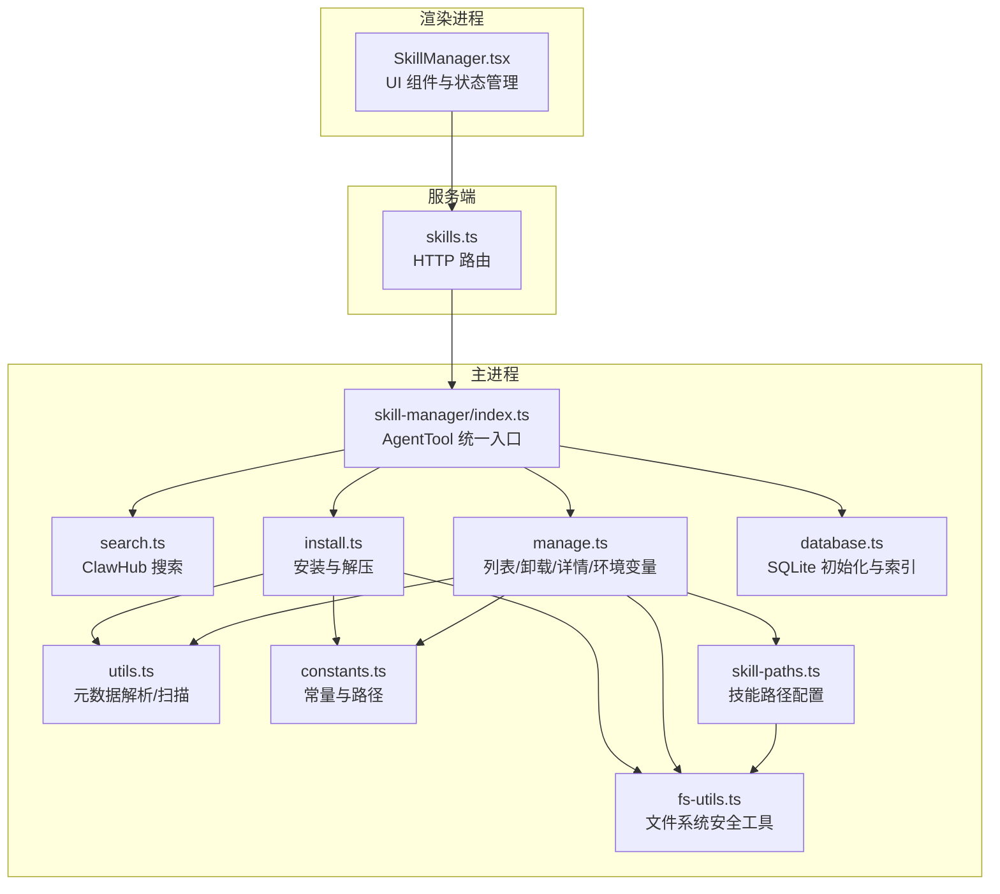
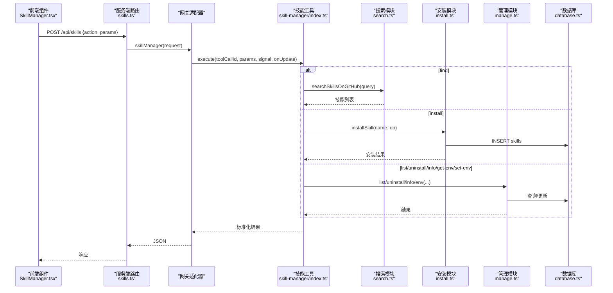
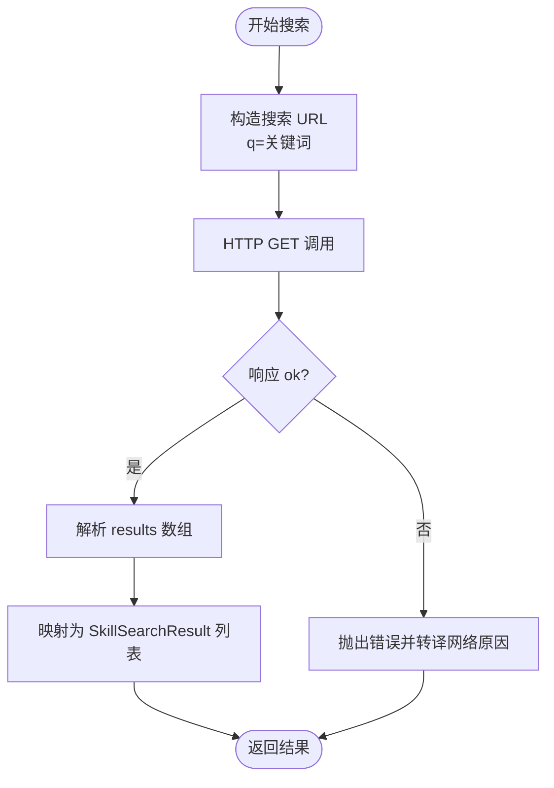
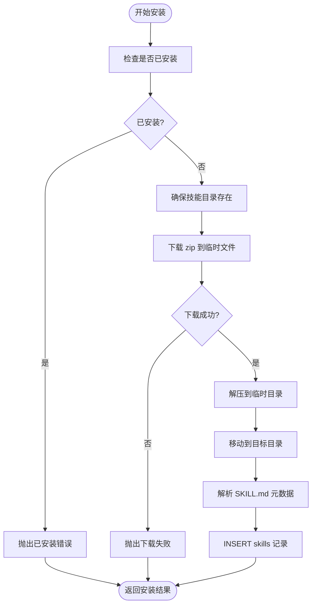
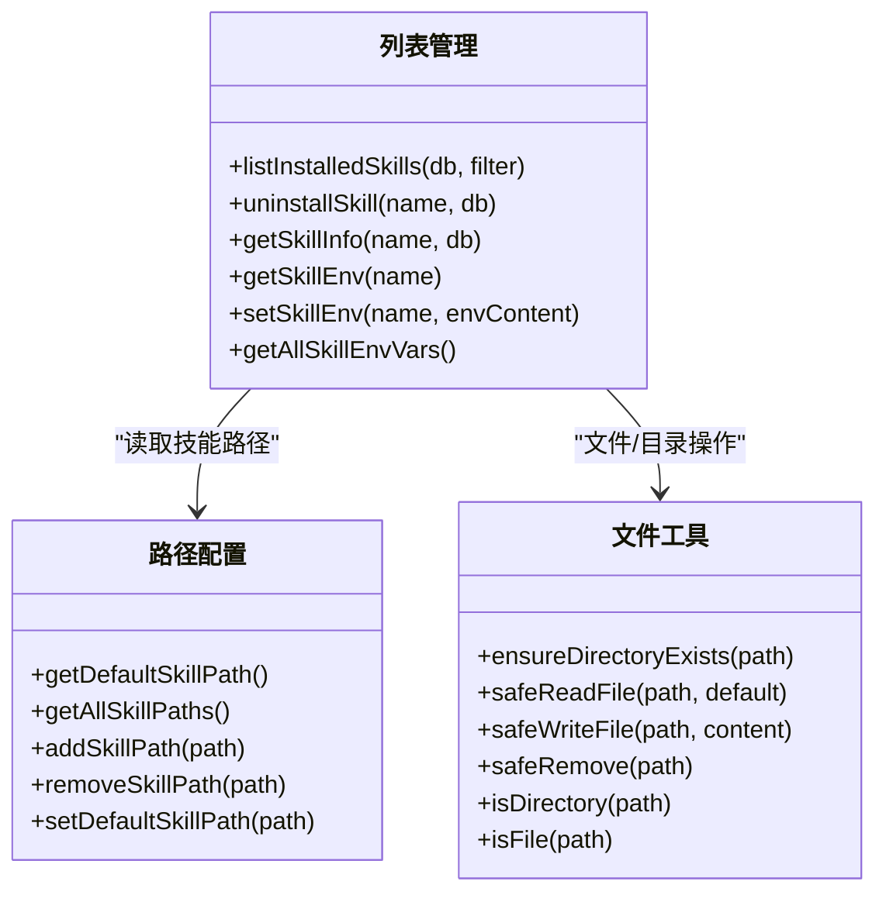
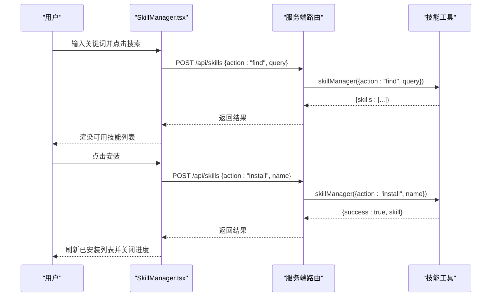
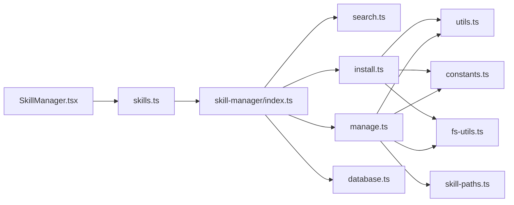

# Skill 管理器

<cite>
**本文引用的文件**
- [src/main/tools/skill-manager/index.ts](file://src/main/tools/skill-manager/index.ts)
- [src/main/tools/skill-manager/manage.ts](file://src/main/tools/skill-manager/manage.ts)
- [src/main/tools/skill-manager/install.ts](file://src/main/tools/skill-manager/install.ts)
- [src/main/tools/skill-manager/search.ts](file://src/main/tools/skill-manager/search.ts)
- [src/main/tools/skill-manager/types.ts](file://src/main/tools/skill-manager/types.ts)
- [src/main/tools/skill-manager/constants.ts](file://src/main/tools/skill-manager/constants.ts)
- [src/main/tools/skill-manager/utils.ts](file://src/main/tools/skill-manager/utils.ts)
- [src/main/tools/skill-manager/database.ts](file://src/main/tools/skill-manager/database.ts)
- [src/main/config/skill-paths.ts](file://src/main/config/skill-paths.ts)
- [src/shared/utils/fs-utils.ts](file://src/shared/utils/fs-utils.ts)
- [src/renderer/components/SkillManager.tsx](file://src/renderer/components/SkillManager.tsx)
- [src/server/routes/skills.ts](file://src/server/routes/skills.ts)
- [src/main/tools/skill-manager-tool.ts](file://src/main/tools/skill-manager-tool.ts)
</cite>

## 目录
1. [简介](#简介)
2. [项目结构](#项目结构)
3. [核心组件](#核心组件)
4. [架构总览](#架构总览)
5. [详细组件分析](#详细组件分析)
6. [依赖关系分析](#依赖关系分析)
7. [性能考量](#性能考量)
8. [故障排查指南](#故障排查指南)
9. [结论](#结论)
10. [附录](#附录)

## 简介
本技术文档围绕 史丽慧小助理 的 Skill 管理器展开，系统阐述其核心能力与实现细节，包括技能搜索、安装、卸载、环境变量配置、元数据与依赖解析、文件管理、进度跟踪、错误处理与回滚策略，并给出面向开发者的扩展指南与最佳实践。同时覆盖前端组件架构、状态管理与用户交互设计，以及与技能市场的集成、版本管理与性能优化策略。

## 项目结构
Skill 管理器由“主进程工具”“渲染进程组件”“服务端路由”三部分协同组成：
- 主进程工具：提供统一的 Agent 工具接口，封装搜索、安装、管理、环境变量等能力，并维护 SQLite 数据库存储技能元数据。
- 渲染进程组件：提供 Skill 管理器 UI，支持搜索、安装、卸载、查看详情、编辑环境变量等交互。
- 服务端路由：对外暴露 HTTP 接口，转发请求至主进程工具，统一错误处理与响应格式。

图表来源
- [src/renderer/components/SkillManager.tsx:1-796](file://src/renderer/components/SkillManager.tsx#L1-L796)
- [src/server/routes/skills.ts:1-38](file://src/server/routes/skills.ts#L1-L38)
- [src/main/tools/skill-manager/index.ts:1-180](file://src/main/tools/skill-manager/index.ts#L1-L180)
- [src/main/tools/skill-manager/search.ts:1-81](file://src/main/tools/skill-manager/search.ts#L1-L81)
- [src/main/tools/skill-manager/install.ts:1-150](file://src/main/tools/skill-manager/install.ts#L1-L150)
- [src/main/tools/skill-manager/manage.ts:1-281](file://src/main/tools/skill-manager/manage.ts#L1-L281)
- [src/main/tools/skill-manager/utils.ts:1-92](file://src/main/tools/skill-manager/utils.ts#L1-L92)
- [src/main/tools/skill-manager/database.ts:1-41](file://src/main/tools/skill-manager/database.ts#L1-L41)
- [src/main/tools/skill-manager/constants.ts:1-35](file://src/main/tools/skill-manager/constants.ts#L1-L35)
- [src/main/config/skill-paths.ts:1-69](file://src/main/config/skill-paths.ts#L1-L69)
- [src/shared/utils/fs-utils.ts:1-162](file://src/shared/utils/fs-utils.ts#L1-L162)

章节来源
- [src/main/tools/skill-manager/index.ts:1-180](file://src/main/tools/skill-manager/index.ts#L1-L180)
- [src/renderer/components/SkillManager.tsx:1-796](file://src/renderer/components/SkillManager.tsx#L1-L796)
- [src/server/routes/skills.ts:1-38](file://src/server/routes/skills.ts#L1-L38)

## 核心组件
- 统一工具入口：提供 find/install/list/uninstall/info/get-env/set-env 等操作，参数校验与错误包装，返回标准化结果。
- 搜索模块：对接 ClawHub 搜索 API，返回技能摘要列表。
- 安装模块：从 ClawHub 下载 zip，解压到技能目录，解析元数据并入库。
- 管理模块：扫描技能目录、列出/卸载/详情、读取/保存环境变量。
- 数据库模块：初始化 SQLite 表与索引，持久化技能元数据。
- 路径与文件工具：统一技能路径配置、安全文件操作。
- 前端组件：提供搜索、安装、卸载、详情、环境变量编辑等交互。

章节来源
- [src/main/tools/skill-manager/index.ts:27-179](file://src/main/tools/skill-manager/index.ts#L27-L179)
- [src/main/tools/skill-manager/search.ts:29-80](file://src/main/tools/skill-manager/search.ts#L29-L80)
- [src/main/tools/skill-manager/install.ts:22-80](file://src/main/tools/skill-manager/install.ts#L22-L80)
- [src/main/tools/skill-manager/manage.ts:17-281](file://src/main/tools/skill-manager/manage.ts#L17-L281)
- [src/main/tools/skill-manager/database.ts:13-40](file://src/main/tools/skill-manager/database.ts#L13-L40)
- [src/main/tools/skill-manager/constants.ts:9-35](file://src/main/tools/skill-manager/constants.ts#L9-L35)
- [src/main/config/skill-paths.ts:16-69](file://src/main/config/skill-paths.ts#L16-L69)
- [src/shared/utils/fs-utils.ts:19-161](file://src/shared/utils/fs-utils.ts#L19-L161)
- [src/renderer/components/SkillManager.tsx:45-482](file://src/renderer/components/SkillManager.tsx#L45-L482)

## 架构总览
Skill 管理器遵循“前端 UI -> 服务端路由 -> 主进程工具”的调用链路，主进程工具内部协调搜索、安装、管理与数据库操作，确保技能生命周期的完整闭环。

图表来源
- [src/renderer/components/SkillManager.tsx:73-163](file://src/renderer/components/SkillManager.tsx#L73-L163)
- [src/server/routes/skills.ts:14-34](file://src/server/routes/skills.ts#L14-L34)
- [src/main/tools/skill-manager/index.ts:78-177](file://src/main/tools/skill-manager/index.ts#L78-L177)
- [src/main/tools/skill-manager/search.ts:29-80](file://src/main/tools/skill-manager/search.ts#L29-L80)
- [src/main/tools/skill-manager/install.ts:22-80](file://src/main/tools/skill-manager/install.ts#L22-L80)
- [src/main/tools/skill-manager/manage.ts:17-281](file://src/main/tools/skill-manager/manage.ts#L17-L281)
- [src/main/tools/skill-manager/database.ts:13-40](file://src/main/tools/skill-manager/database.ts#L13-L40)

## 详细组件分析

### 统一工具入口（AgentTool）
- 职责：封装技能管理的所有动作，提供统一参数校验、错误包装与结果序列化。
- 关键点：
  - 动作枚举：find/install/list/enable/disable/uninstall/info/get-env/set-env。
  - 错误处理：捕获异常并返回标准化错误文本与 details。
  - 环境变量变更：set-env 后重置 Shell 路径缓存以确保生效。

章节来源
- [src/main/tools/skill-manager/index.ts:27-179](file://src/main/tools/skill-manager/index.ts#L27-L179)

### 搜索模块（ClawHub）
- 功能：基于关键词调用 ClawHub 搜索 API，返回技能摘要（名称、展示名、描述、版本、作者、星数、下载量、最后更新时间等）。
- 错误处理：针对网络类错误（DNS/超时/拒绝）给出明确提示，引导检查网络与代理。

图表来源
- [src/main/tools/skill-manager/search.ts:29-80](file://src/main/tools/skill-manager/search.ts#L29-L80)

章节来源
- [src/main/tools/skill-manager/search.ts:29-80](file://src/main/tools/skill-manager/search.ts#L29-L80)

### 安装模块（ClawHub 下载与解压）
- 流程：
  1) 校验是否已安装；
  2) 确保技能目录存在；
  3) 从 ClawHub 下载 zip 至临时目录；
  4) 解压 zip，处理 zip 内部可能存在的子目录；
  5) 解析 SKILL.md 元数据；
  6) 写入数据库。
- 错误处理：下载失败、解压失败、元数据缺失均抛出可读错误；清理临时文件与解压目录。

图表来源
- [src/main/tools/skill-manager/install.ts:22-80](file://src/main/tools/skill-manager/install.ts#L22-L80)
- [src/main/tools/skill-manager/utils.ts:28-80](file://src/main/tools/skill-manager/utils.ts#L28-L80)
- [src/main/tools/skill-manager/database.ts:13-40](file://src/main/tools/skill-manager/database.ts#L13-L40)

章节来源
- [src/main/tools/skill-manager/install.ts:22-150](file://src/main/tools/skill-manager/install.ts#L22-L150)
- [src/main/tools/skill-manager/utils.ts:28-80](file://src/main/tools/skill-manager/utils.ts#L28-L80)
- [src/main/tools/skill-manager/database.ts:13-40](file://src/main/tools/skill-manager/database.ts#L13-L40)

### 管理模块（列表/卸载/详情/环境变量）
- 列表：扫描所有技能路径，识别含 SKILL.md 的目录，合并数据库记录与本地元数据，支持按启用状态过滤与排序。
- 卸载：删除数据库记录与文件目录。
- 详情：读取 SKILL.md 与文件树，聚合工具与依赖信息。
- 环境变量：读取/写入 .env 文件，支持 KEY=VALUE 与注释行，合并所有技能的环境变量。

图表来源
- [src/main/tools/skill-manager/manage.ts:17-281](file://src/main/tools/skill-manager/manage.ts#L17-L281)
- [src/main/config/skill-paths.ts:16-69](file://src/main/config/skill-paths.ts#L16-L69)
- [src/shared/utils/fs-utils.ts:19-161](file://src/shared/utils/fs-utils.ts#L19-L161)

章节来源
- [src/main/tools/skill-manager/manage.ts:17-281](file://src/main/tools/skill-manager/manage.ts#L17-L281)
- [src/main/config/skill-paths.ts:16-69](file://src/main/config/skill-paths.ts#L16-L69)
- [src/shared/utils/fs-utils.ts:19-161](file://src/shared/utils/fs-utils.ts#L19-L161)

### 数据库与常量
- 数据库：skills 表包含唯一 name、版本、启用状态、安装时间、最近使用时间、使用计数、仓库地址、元数据 JSON。
- 常量：技能目录、数据库路径、ClawHub 搜索与下载 API。

章节来源
- [src/main/tools/skill-manager/database.ts:13-40](file://src/main/tools/skill-manager/database.ts#L13-L40)
- [src/main/tools/skill-manager/constants.ts:9-35](file://src/main/tools/skill-manager/constants.ts#L9-L35)

### 前端组件（SkillManager.tsx）
- 状态管理：标签页切换、搜索查询、加载状态、安装进度模拟、环境变量编辑状态、选中技能详情。
- 交互流程：
  - 搜索：调用 find，过滤已安装项，展示可用技能。
  - 安装：调用 install，模拟进度条，完成后刷新已安装列表。
  - 卸载：确认后调用 uninstall。
  - 详情：installed 调用 info，否则使用搜索结果基本信息。
  - 环境变量：get-env 读取，set-env 保存。
- UI 设计：卡片式展示、标签页切换、详情弹窗、文件与依赖可视化。

图表来源
- [src/renderer/components/SkillManager.tsx:73-163](file://src/renderer/components/SkillManager.tsx#L73-L163)
- [src/server/routes/skills.ts:14-34](file://src/server/routes/skills.ts#L14-L34)
- [src/main/tools/skill-manager/index.ts:78-177](file://src/main/tools/skill-manager/index.ts#L78-L177)

章节来源
- [src/renderer/components/SkillManager.tsx:45-482](file://src/renderer/components/SkillManager.tsx#L45-L482)
- [src/server/routes/skills.ts:14-34](file://src/server/routes/skills.ts#L14-L34)

## 依赖关系分析
- 组件耦合：
  - 统一工具入口依赖搜索、安装、管理模块与数据库。
  - 安装与管理模块依赖路径配置与文件工具。
  - 前端组件依赖服务端路由与统一工具入口。
- 外部依赖：
  - ClawHub 搜索与下载 API。
  - adm-zip 解压。
  - SQLite 本地存储。
- 循环依赖：未见循环导入。

图表来源
- [src/renderer/components/SkillManager.tsx:1-796](file://src/renderer/components/SkillManager.tsx#L1-L796)
- [src/server/routes/skills.ts:1-38](file://src/server/routes/skills.ts#L1-L38)
- [src/main/tools/skill-manager/index.ts:1-180](file://src/main/tools/skill-manager/index.ts#L1-L180)
- [src/main/tools/skill-manager/search.ts:1-81](file://src/main/tools/skill-manager/search.ts#L1-L81)
- [src/main/tools/skill-manager/install.ts:1-150](file://src/main/tools/skill-manager/install.ts#L1-L150)
- [src/main/tools/skill-manager/manage.ts:1-281](file://src/main/tools/skill-manager/manage.ts#L1-L281)
- [src/main/tools/skill-manager/utils.ts:1-92](file://src/main/tools/skill-manager/utils.ts#L1-L92)
- [src/main/tools/skill-manager/constants.ts:1-35](file://src/main/tools/skill-manager/constants.ts#L1-L35)
- [src/main/config/skill-paths.ts:1-69](file://src/main/config/skill-paths.ts#L1-L69)
- [src/shared/utils/fs-utils.ts:1-162](file://src/shared/utils/fs-utils.ts#L1-L162)

章节来源
- [src/main/tools/skill-manager/index.ts:1-180](file://src/main/tools/skill-manager/index.ts#L1-L180)
- [src/main/tools/skill-manager/manage.ts:1-281](file://src/main/tools/skill-manager/manage.ts#L1-L281)
- [src/main/tools/skill-manager/install.ts:1-150](file://src/main/tools/skill-manager/install.ts#L1-L150)
- [src/main/tools/skill-manager/search.ts:1-81](file://src/main/tools/skill-manager/search.ts#L1-L81)
- [src/main/tools/skill-manager/utils.ts:1-92](file://src/main/tools/skill-manager/utils.ts#L1-L92)
- [src/main/tools/skill-manager/constants.ts:1-35](file://src/main/tools/skill-manager/constants.ts#L1-L35)
- [src/main/config/skill-paths.ts:1-69](file://src/main/config/skill-paths.ts#L1-L69)
- [src/shared/utils/fs-utils.ts:1-162](file://src/shared/utils/fs-utils.ts#L1-L162)
- [src/renderer/components/SkillManager.tsx:1-796](file://src/renderer/components/SkillManager.tsx#L1-L796)
- [src/server/routes/skills.ts:1-38](file://src/server/routes/skills.ts#L1-L38)

## 性能考量
- I/O 优化：
  - 安装阶段使用临时目录解压后再移动，避免跨文件系统重命名错误。
  - 文件读写统一通过安全工具函数，减少异常与重复逻辑。
- 索引与查询：
  - skills 表建立 name 与 enabled 索引，提升列表与过滤效率。
- 前端体验：
  - 安装进度模拟提升感知速度；分页/截断展示文件列表，避免长列表渲染压力。
- 网络健壮性：
  - 搜索 API 超时与网络错误明确提示，便于用户快速定位问题。

章节来源
- [src/main/tools/skill-manager/install.ts:119-149](file://src/main/tools/skill-manager/install.ts#L119-L149)
- [src/shared/utils/fs-utils.ts:19-79](file://src/shared/utils/fs-utils.ts#L19-L79)
- [src/main/tools/skill-manager/database.ts:22-37](file://src/main/tools/skill-manager/database.ts#L22-L37)
- [src/renderer/components/SkillManager.tsx:128-163](file://src/renderer/components/SkillManager.tsx#L128-L163)

## 故障排查指南
- 搜索失败（ClawHub）：
  - 现象：返回网络错误提示。
  - 排查：检查网络连通性、代理设置、防火墙；确认 API 可达。
- 安装失败：
  - 现象：下载/解压/元数据解析失败。
  - 排查：确认 zip 可下载、磁盘空间充足、权限允许写入；检查 SKILL.md 格式。
- 卸载失败：
  - 现象：技能不存在或删除失败。
  - 排查：确认技能名称正确、路径存在、无进程占用。
- 环境变量无效：
  - 现象：变量未生效。
  - 排查：确认 .env 格式正确、set-env 成功、Shell 缓存已重置。
- 前端无数据：
  - 现象：已安装列表为空或搜索无结果。
  - 排查：确认服务端路由正常、工具入口返回成功、前端状态更新。

章节来源
- [src/main/tools/skill-manager/search.ts:65-79](file://src/main/tools/skill-manager/search.ts#L65-L79)
- [src/main/tools/skill-manager/install.ts:76-79](file://src/main/tools/skill-manager/install.ts#L76-L79)
- [src/main/tools/skill-manager/manage.ts:123-150](file://src/main/tools/skill-manager/manage.ts#L123-L150)
- [src/main/tools/skill-manager/manage.ts:169-188](file://src/main/tools/skill-manager/manage.ts#L169-L188)
- [src/renderer/components/SkillManager.tsx:70-89](file://src/renderer/components/SkillManager.tsx#L70-L89)

## 结论
Skill 管理器通过清晰的职责划分与统一的工具入口，实现了从搜索、安装、管理到环境变量配置的完整闭环。前端组件提供直观的交互体验，主进程工具与数据库保障数据一致性，服务端路由提供稳定的对外接口。整体设计具备良好的扩展性与可维护性，适合进一步引入版本管理、增量更新与回滚机制。

## 附录

### 技能元数据结构与依赖处理
- 元数据来源：SKILL.md YAML frontmatter，包含 name/description/version/author/repository/tags/requires。
- 依赖分类：requires.tools（工具依赖）、requires.dependencies（包依赖）。
- 文件管理：扫描 scripts/references/assets 三类目录，支持文件数量统计与截断展示。

章节来源
- [src/main/tools/skill-manager/utils.ts:28-80](file://src/main/tools/skill-manager/utils.ts#L28-L80)
- [src/main/tools/skill-manager/manage.ts:259-280](file://src/main/tools/skill-manager/manage.ts#L259-L280)
- [src/main/tools/skill-manager/types.ts:72-84](file://src/main/tools/skill-manager/types.ts#L72-L84)

### 技能市场集成与版本管理建议
- 市场集成：通过 ClawHub 搜索与下载 API 实现技能发现与安装。
- 版本管理：利用元数据 version 字段与仓库链接，支持后续版本对比与升级提示。
- 回滚策略：建议在安装前备份原目录，失败时恢复；当前实现未内置回滚，可在上层工具中补充。

章节来源
- [src/main/tools/skill-manager/search.ts:29-64](file://src/main/tools/skill-manager/search.ts#L29-L64)
- [src/main/tools/skill-manager/install.ts:44-56](file://src/main/tools/skill-manager/install.ts#L44-L56)
- [src/main/tools/skill-manager/types.ts:8-20](file://src/main/tools/skill-manager/types.ts#L8-L20)

### 开发者扩展指南与最佳实践
- 新增动作：在统一工具入口的参数校验与 switch 分支中新增动作，确保错误包装与返回格式一致。
- 新增搜索源：在搜索模块增加新的 API 调用与结果映射，保持 SkillSearchResult 结构稳定。
- 安装流程增强：在安装模块增加校验步骤（如完整性校验、依赖预检），并在失败时清理临时文件。
- 前端交互：复用现有 UI 组件与状态管理模式，保证一致性与可维护性。
- 最佳实践：
  - 统一错误文案与网络提示；
  - 使用安全文件工具函数；
  - 为关键操作添加日志与指标；
  - 对外接口返回标准化结构，便于前端消费。

章节来源
- [src/main/tools/skill-manager/index.ts:60-177](file://src/main/tools/skill-manager/index.ts#L60-L177)
- [src/main/tools/skill-manager/search.ts:29-80](file://src/main/tools/skill-manager/search.ts#L29-L80)
- [src/main/tools/skill-manager/install.ts:22-80](file://src/main/tools/skill-manager/install.ts#L22-L80)
- [src/renderer/components/SkillManager.tsx:45-482](file://src/renderer/components/SkillManager.tsx#L45-L482)