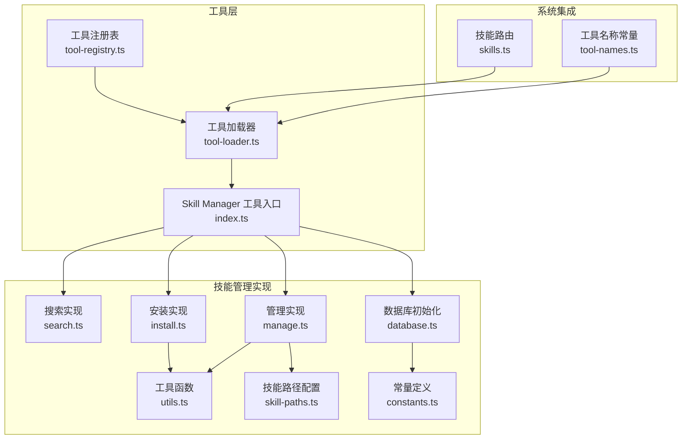
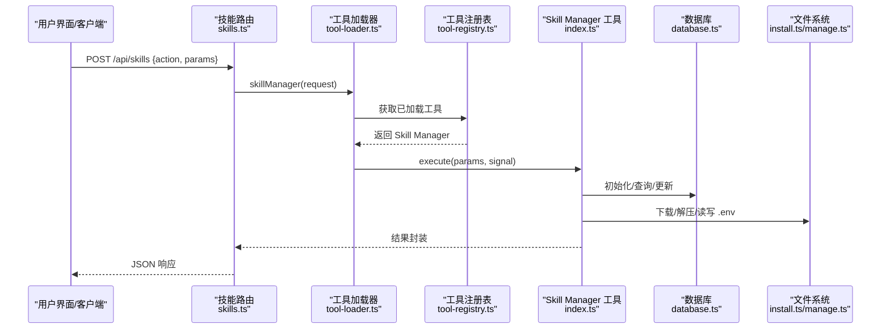
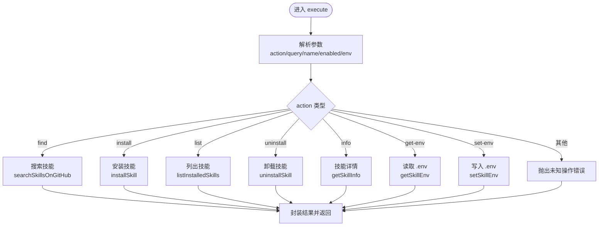
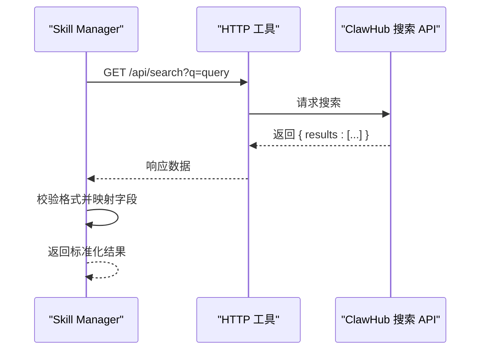
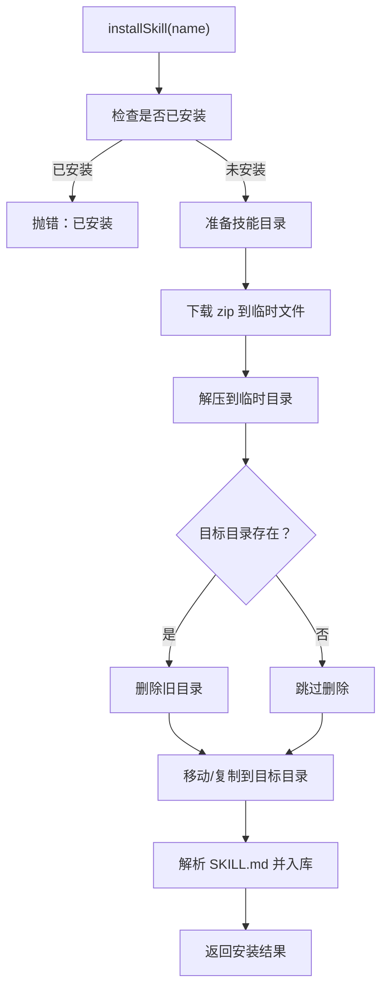
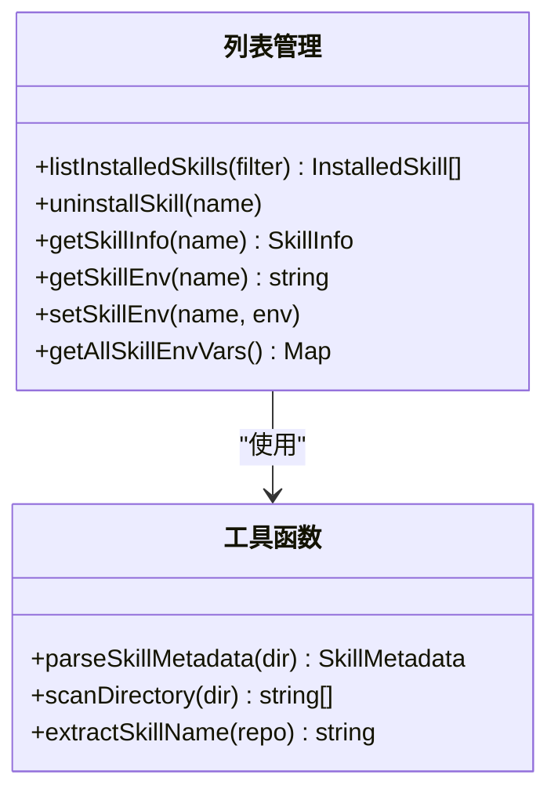
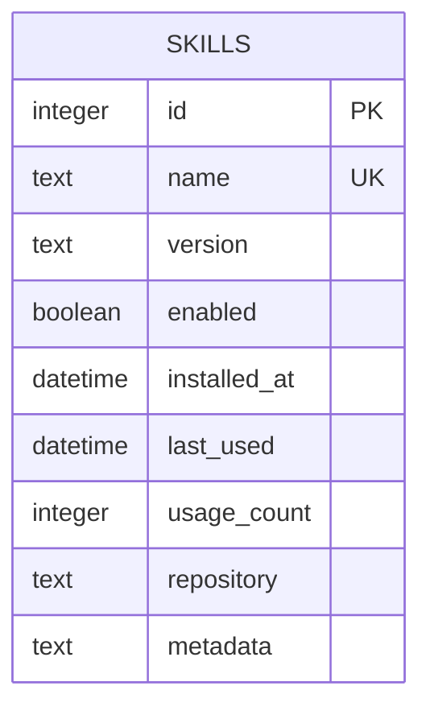
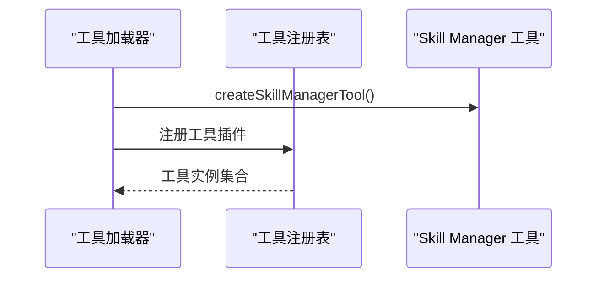
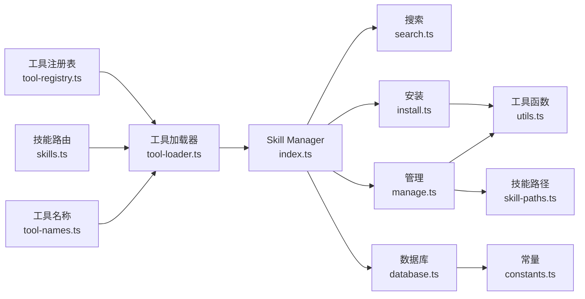

# Skill 管理器概览

<cite>
**本文引用的文件**
- [index.ts](file://src/main/tools/skill-manager/index.ts)
- [types.ts](file://src/main/tools/skill-manager/types.ts)
- [search.ts](file://src/main/tools/skill-manager/search.ts)
- [manage.ts](file://src/main/tools/skill-manager/manage.ts)
- [install.ts](file://src/main/tools/skill-manager/install.ts)
- [database.ts](file://src/main/tools/skill-manager/database.ts)
- [constants.ts](file://src/main/tools/skill-manager/constants.ts)
- [utils.ts](file://src/main/tools/skill-manager/utils.ts)
- [skill-paths.ts](file://src/main/config/skill-paths.ts)
- [tool-loader.ts](file://src/main/tools/registry/tool-loader.ts)
- [tool-registry.ts](file://src/main/tools/registry/tool-registry.ts)
- [tool-names.ts](file://src/main/tools/tool-names.ts)
- [skills.ts](file://src/server/routes/skills.ts)
- [README.md](file://README.md)
</cite>

## 目录
1. [简介](#简介)
2. [项目结构](#项目结构)
3. [核心组件](#核心组件)
4. [架构总览](#架构总览)
5. [详细组件分析](#详细组件分析)
6. [依赖分析](#依赖分析)
7. [性能考虑](#性能考虑)
8. [故障排除指南](#故障排除指南)
9. [结论](#结论)
10. [附录](#附录)

## 简介
Skill 管理器是 DeepBot 的核心工具之一，负责在运行时对技能包（Skills）进行搜索、安装、管理与状态维护。它以 Agent 工具的形式集成到系统中，通过统一的参数接口对外提供能力，并与 SQLite 数据库存储技能元数据、安装状态与使用统计。Skill 管理器遵循“声明式参数 + 异步执行”的设计，支持网络搜索（ClawHub）、本地安装（zip 下载与解压）、目录扫描与注册、环境变量配置以及技能详情查看等完整生命周期管理。

## 项目结构
Skill 管理器位于 src/main/tools/skill-manager 目录，围绕“工具入口 + 数据库 + 搜索 + 安装 + 管理 + 工具函数”的分层组织，配合工具注册与加载机制，形成从 UI/网关到工具执行的完整链路。

图表来源
- [index.ts:1-180](file://src/main/tools/skill-manager/index.ts#L1-L180)
- [tool-loader.ts:1-312](file://src/main/tools/registry/tool-loader.ts#L1-L312)
- [tool-registry.ts:1-328](file://src/main/tools/registry/tool-registry.ts#L1-L328)
- [search.ts:1-81](file://src/main/tools/skill-manager/search.ts#L1-L81)
- [install.ts:1-150](file://src/main/tools/skill-manager/install.ts#L1-L150)
- [manage.ts:1-281](file://src/main/tools/skill-manager/manage.ts#L1-L281)
- [utils.ts:1-92](file://src/main/tools/skill-manager/utils.ts#L1-L92)
- [database.ts:1-41](file://src/main/tools/skill-manager/database.ts#L1-L41)
- [constants.ts:1-35](file://src/main/tools/skill-manager/constants.ts#L1-L35)
- [skill-paths.ts:1-69](file://src/main/config/skill-paths.ts#L1-L69)
- [skills.ts:1-38](file://src/server/routes/skills.ts#L1-L38)
- [tool-names.ts:1-106](file://src/main/tools/tool-names.ts#L1-L106)

章节来源
- [index.ts:1-180](file://src/main/tools/skill-manager/index.ts#L1-L180)
- [README.md:128-248](file://README.md#L128-L248)

## 核心组件
- 工具入口与参数校验：定义工具名称、标签、描述与 TypeBox 参数模式，集中处理动作分发与错误包装。
- 搜索模块：对接 ClawHub API，返回标准化的技能清单。
- 安装模块：下载 zip、解压、解析元数据、入库。
- 管理模块：扫描已安装技能、卸载、读取/设置 .env、聚合环境变量。
- 数据库模块：SQLite 初始化、表结构与索引。
- 工具函数：解析 SKILL.md、扫描目录、提取技能名。
- 路径配置：统一管理技能目录（含默认与多路径）。
- 工具注册与加载：在工具加载器中注册 Skill Manager 工具，供 Agent Runtime 使用。

章节来源
- [index.ts:27-179](file://src/main/tools/skill-manager/index.ts#L27-L179)
- [types.ts:1-84](file://src/main/tools/skill-manager/types.ts#L1-L84)
- [search.ts:29-80](file://src/main/tools/skill-manager/search.ts#L29-L80)
- [install.ts:22-80](file://src/main/tools/skill-manager/install.ts#L22-L80)
- [manage.ts:17-280](file://src/main/tools/skill-manager/manage.ts#L17-L280)
- [database.ts:13-40](file://src/main/tools/skill-manager/database.ts#L13-L40)
- [utils.ts:28-92](file://src/main/tools/skill-manager/utils.ts#L28-L92)
- [skill-paths.ts:16-69](file://src/main/config/skill-paths.ts#L16-L69)

## 架构总览
Skill 管理器作为 Agent 工具，通过工具加载器注入到 Agent Runtime；UI/Web 通过路由将请求转发至网关适配器，再由工具执行器调用 Skill Manager 的 execute 分支，最终落盘到 SQLite 数据库与文件系统。

图表来源
- [skills.ts:14-34](file://src/server/routes/skills.ts#L14-L34)
- [tool-loader.ts:151-153](file://src/main/tools/registry/tool-loader.ts#L151-L153)
- [tool-registry.ts:201-209](file://src/main/tools/registry/tool-registry.ts#L201-L209)
- [index.ts:78-177](file://src/main/tools/skill-manager/index.ts#L78-L177)
- [database.ts:13-40](file://src/main/tools/skill-manager/database.ts#L13-L40)
- [install.ts:85-149](file://src/main/tools/skill-manager/install.ts#L85-L149)
- [manage.ts:123-188](file://src/main/tools/skill-manager/manage.ts#L123-L188)

## 详细组件分析

### 工具入口与参数定义
- 工具名称与标签：统一使用工具名称常量，便于注册与识别。
- 参数模式：基于 TypeBox 定义 action、query、name、enabled、env 等字段，提供清晰的参数约束与描述。
- 执行流程：根据 action 分派到对应处理器，统一返回结构化内容与 details，错误时包装为 isError 并输出可读错误信息。

图表来源
- [index.ts:78-177](file://src/main/tools/skill-manager/index.ts#L78-L177)
- [tool-names.ts:17-18](file://src/main/tools/tool-names.ts#L17-L18)

章节来源
- [index.ts:27-179](file://src/main/tools/skill-manager/index.ts#L27-L179)
- [tool-names.ts:1-106](file://src/main/tools/tool-names.ts#L1-L106)

### 搜索模块（ClawHub）
- 接口：调用 ClawHub 搜索 API，解析返回并映射为统一的技能结果结构。
- 错误处理：针对网络异常（DNS/超时/拒绝）给出明确提示，引导用户检查网络与防火墙。

图表来源
- [search.ts:29-80](file://src/main/tools/skill-manager/search.ts#L29-L80)
- [constants.ts:27-27](file://src/main/tools/skill-manager/constants.ts#L27-L27)

章节来源
- [search.ts:29-80](file://src/main/tools/skill-manager/search.ts#L29-L80)
- [constants.ts:27-27](file://src/main/tools/skill-manager/constants.ts#L27-L27)

### 安装模块（zip 下载与解压）
- 流程：检查是否已安装 → 确保技能目录存在 → 下载 zip → 解压到目标目录 → 解析 SKILL.md → 入库 → 返回安装结果。
- 安全性：使用临时目录与跨平台解压库，避免跨文件系统重命名错误；清理临时文件。

图表来源
- [install.ts:22-80](file://src/main/tools/skill-manager/install.ts#L22-L80)
- [install.ts:85-149](file://src/main/tools/skill-manager/install.ts#L85-L149)
- [utils.ts:28-80](file://src/main/tools/skill-manager/utils.ts#L28-L80)

章节来源
- [install.ts:22-80](file://src/main/tools/skill-manager/install.ts#L22-L80)
- [install.ts:85-149](file://src/main/tools/skill-manager/install.ts#L85-L149)
- [utils.ts:28-80](file://src/main/tools/skill-manager/utils.ts#L28-L80)

### 管理模块（列表、卸载、详情、环境变量）
- 列表：扫描所有技能路径，匹配 SKILL.md，从数据库读取或自动注册，支持按启用状态过滤与排序。
- 卸载：删除数据库记录与文件目录。
- 详情：读取 README 与文件树，聚合 requires 与 files。
- 环境变量：读取/写入 .env，支持多路径合并为 Map。

图表来源
- [manage.ts:17-280](file://src/main/tools/skill-manager/manage.ts#L17-L280)
- [utils.ts:28-92](file://src/main/tools/skill-manager/utils.ts#L28-L92)

章节来源
- [manage.ts:17-280](file://src/main/tools/skill-manager/manage.ts#L17-L280)
- [utils.ts:28-92](file://src/main/tools/skill-manager/utils.ts#L28-L92)

### 数据库与状态管理
- 初始化：确保目录存在，创建 skills 表与索引，字段覆盖版本、启用状态、安装时间、最近使用、使用计数、仓库地址与元数据。
- 状态：启用/禁用通过布尔字段维护；使用计数与最近使用用于排序与统计。

图表来源
- [database.ts:22-37](file://src/main/tools/skill-manager/database.ts#L22-L37)

章节来源
- [database.ts:13-40](file://src/main/tools/skill-manager/database.ts#L13-L40)

### 工具集成与加载
- 工具加载器：在加载内置工具时创建 Skill Manager 工具实例并加入工具集合。
- 工具注册表：提供工具注册、查询、配置与清理能力，支持 UI 展示工具列表。

图表来源
- [tool-loader.ts:151-153](file://src/main/tools/registry/tool-loader.ts#L151-L153)
- [tool-registry.ts:46-55](file://src/main/tools/registry/tool-registry.ts#L46-L55)

章节来源
- [tool-loader.ts:151-153](file://src/main/tools/registry/tool-loader.ts#L151-L153)
- [tool-registry.ts:46-55](file://src/main/tools/registry/tool-registry.ts#L46-L55)

## 依赖分析
- 外部依赖：ClawHub 搜索与下载 API、adm-zip 解压库、sqlite 适配器。
- 内部依赖：工具名称常量、路径配置、工具注册与加载、系统提示词模板（用于说明工具能力）。
- 路由依赖：技能路由将请求转发给工具执行器，实现 Web 与桌面端统一入口。

图表来源
- [index.ts:18-22](file://src/main/tools/skill-manager/index.ts#L18-L22)
- [install.ts:13-15](file://src/main/tools/skill-manager/install.ts#L13-L15)
- [manage.ts:9-12](file://src/main/tools/skill-manager/manage.ts#L9-L12)
- [database.ts:6-8](file://src/main/tools/skill-manager/database.ts#L6-L8)
- [constants.ts:5-7](file://src/main/tools/skill-manager/constants.ts#L5-L7)
- [tool-loader.ts:22](file://src/main/tools/registry/tool-loader.ts#L22)
- [tool-registry.ts:36-40](file://src/main/tools/registry/tool-registry.ts#L36-L40)
- [skills.ts:25](file://src/server/routes/skills.ts#L25)
- [tool-names.ts:17-18](file://src/main/tools/tool-names.ts#L17-L18)

章节来源
- [index.ts:18-22](file://src/main/tools/skill-manager/index.ts#L18-L22)
- [install.ts:13-15](file://src/main/tools/skill-manager/install.ts#L13-L15)
- [manage.ts:9-12](file://src/main/tools/skill-manager/manage.ts#L9-L12)
- [database.ts:6-8](file://src/main/tools/skill-manager/database.ts#L6-L8)
- [constants.ts:5-7](file://src/main/tools/skill-manager/constants.ts#L5-L7)
- [tool-loader.ts:22](file://src/main/tools/registry/tool-loader.ts#L22)
- [tool-registry.ts:36-40](file://src/main/tools/registry/tool-registry.ts#L36-L40)
- [skills.ts:25](file://src/server/routes/skills.ts#L25)
- [tool-names.ts:17-18](file://src/main/tools/tool-names.ts#L17-L18)

## 性能考虑
- I/O 优化：安装阶段使用临时目录与跨平台解压，避免频繁重命名；解压后一次性移动/复制，减少碎片。
- 索引与查询：数据库为 skills 表建立 name 与 enabled 索引，提升列表与过滤性能。
- 扫描策略：管理模块按路径逐个扫描，遇到异常路径与文件时快速跳过并记录警告，避免阻塞。
- 网络超时：搜索与下载设置合理超时，避免长时间阻塞工具执行。

## 故障排除指南
- 网络问题（ClawHub）：若出现 DNS/超时/拒绝错误，检查代理、防火墙与网络连通性。
- 权限与路径：确认技能目录存在且具备读写权限；多路径配置需展开用户路径后再使用。
- 安装冲突：若提示已安装，先卸载再安装；或检查数据库中是否存在残留记录。
- 解压失败：清理临时文件与目标目录，重试安装；确保 zip 文件完整。
- 环境变量：set-env 成功后会重置 Shell 路径缓存，下次命令执行时生效。

章节来源
- [search.ts:65-79](file://src/main/tools/skill-manager/search.ts#L65-L79)
- [install.ts:76-79](file://src/main/tools/skill-manager/install.ts#L76-L79)
- [manage.ts:123-150](file://src/main/tools/skill-manager/manage.ts#L123-L150)
- [manage.ts:169-188](file://src/main/tools/skill-manager/manage.ts#L169-L188)

## 结论
Skill 管理器以“工具 + 数据库 + 文件系统”的一体化设计，实现了从云端搜索到本地安装、从状态维护到环境管理的完整闭环。其参数化接口与统一的错误处理机制，使其易于在 Agent Runtime 中编排与扩展。配合工具注册与加载体系，Skill 管理器成为 DeepBot 生态中可发现、可配置、可演进的核心能力之一。

## 附录

### 使用示例（参数与行为）
- 查找可安装的技能：action=find，query=关键词
- 安装技能：action=install，name=技能 slug
- 列出技能：action=list，enabled=可选过滤
- 启用/禁用：通过外部工具或后续扩展实现（当前入口未暴露 enable/disable）
- 卸载技能：action=uninstall，name=技能名
- 技能详情：action=info，name=技能名
- 环境变量：action=get-env 或 set-env，name 与 env 内容

章节来源
- [index.ts:36-58](file://src/main/tools/skill-manager/index.ts#L36-L58)
- [index.ts:84-152](file://src/main/tools/skill-manager/index.ts#L84-L152)

### 最佳实践
- 在安装前先使用 find 确认技能可用性与版本信息。
- 使用 set-env 为技能配置必要的 API Key 或凭据，注意 .env 格式与注释行处理。
- 定期使用 list 检查已安装技能与使用频率，清理不再使用的技能。
- 多路径配置时，优先使用系统配置中心统一管理，避免路径散乱。
- 对于大型 zip 包，预留充足磁盘空间与网络带宽，避免安装中断。

章节来源
- [README.md:569-664](file://README.md#L569-L664)
- [skill-paths.ts:31-69](file://src/main/config/skill-paths.ts#L31-L69)