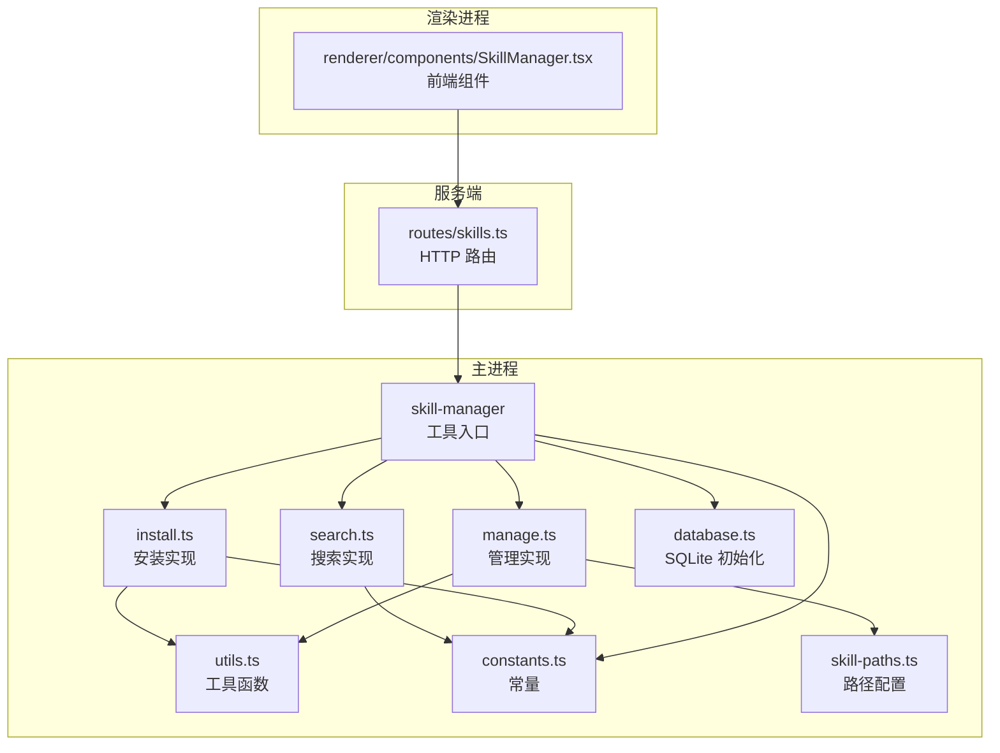
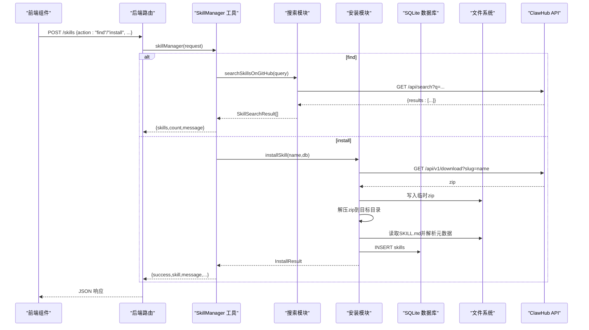
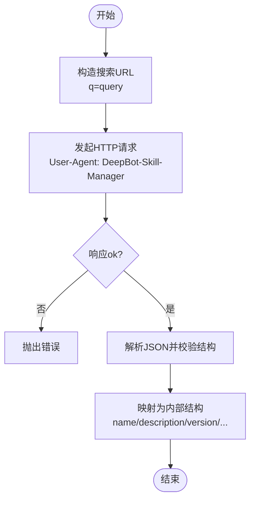
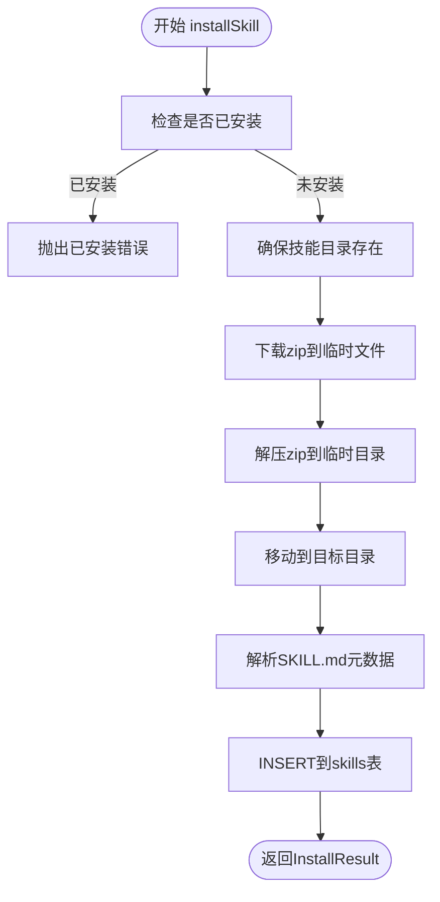
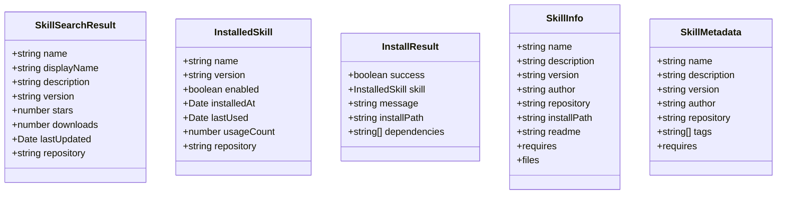
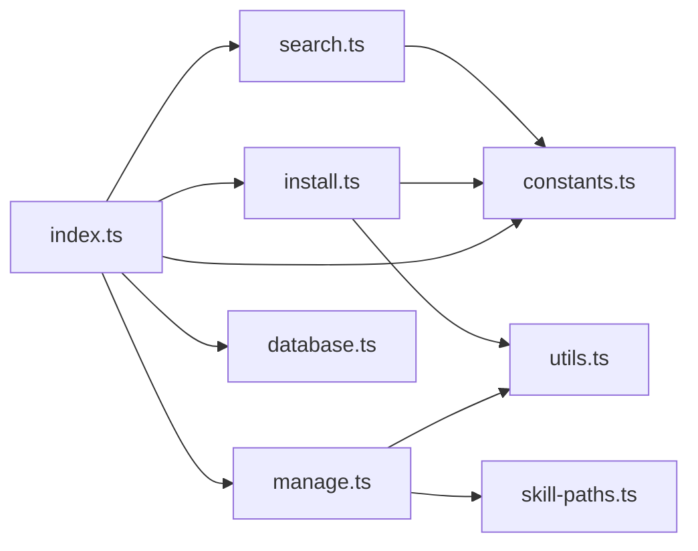

# 技能搜索与安装

<cite>
**本文引用的文件**
- [src/main/tools/skill-manager/index.ts](file://src/main/tools/skill-manager/index.ts)
- [src/main/tools/skill-manager/search.ts](file://src/main/tools/skill-manager/search.ts)
- [src/main/tools/skill-manager/install.ts](file://src/main/tools/skill-manager/install.ts)
- [src/main/tools/skill-manager/manage.ts](file://src/main/tools/skill-manager/manage.ts)
- [src/main/tools/skill-manager/types.ts](file://src/main/tools/skill-manager/types.ts)
- [src/main/tools/skill-manager/constants.ts](file://src/main/tools/skill-manager/constants.ts)
- [src/main/tools/skill-manager/utils.ts](file://src/main/tools/skill-manager/utils.ts)
- [src/main/tools/skill-manager/database.ts](file://src/main/tools/skill-manager/database.ts)
- [src/main/config/skill-paths.ts](file://src/main/config/skill-paths.ts)
- [src/server/routes/skills.ts](file://src/server/routes/skills.ts)
- [src/renderer/components/SkillManager.tsx](file://src/renderer/components/SkillManager.tsx)
- [src/shared/utils/error-handler.ts](file://src/shared/utils/error-handler.ts)
- [src/shared/utils/async-utils.ts](file://src/shared/utils/async-utils.ts)
</cite>

## 目录
1. [简介](#简介)
2. [项目结构](#项目结构)
3. [核心组件](#核心组件)
4. [架构总览](#架构总览)
5. [详细组件分析](#详细组件分析)
6. [依赖关系分析](#依赖关系分析)
7. [性能考量](#性能考量)
8. [故障排查指南](#故障排查指南)
9. [结论](#结论)
10. [附录](#附录)

## 简介
本文件面向 DeepBot 的“技能搜索与安装”能力，系统性阐述以下方面：
- 技能搜索机制：GitHub/ClawHub 集成、关键词匹配与排序逻辑
- 技能安装流程：下载、解压、元数据解析、依赖声明、安装验证与持久化
- 技能元数据与版本管理：SKILL.md 解析、版本号、依赖清单
- 冲突检测与环境变量管理：多路径扫描、.env 合并与冲突提示
- 搜索参数配置、安装进度跟踪与错误恢复策略
- 技能源配置、网络请求优化与缓存机制建议

## 项目结构
技能管理相关代码集中在主进程的 skill-manager 子模块，并通过工具接口对外暴露；前端通过 API 组件调用后端路由实现用户交互。

图表来源
- [src/main/tools/skill-manager/index.ts:1-180](file://src/main/tools/skill-manager/index.ts#L1-L180)
- [src/main/tools/skill-manager/search.ts:1-81](file://src/main/tools/skill-manager/search.ts#L1-L81)
- [src/main/tools/skill-manager/install.ts:1-150](file://src/main/tools/skill-manager/install.ts#L1-L150)
- [src/main/tools/skill-manager/manage.ts:1-281](file://src/main/tools/skill-manager/manage.ts#L1-L281)
- [src/main/tools/skill-manager/database.ts:1-41](file://src/main/tools/skill-manager/database.ts#L1-L41)
- [src/main/tools/skill-manager/utils.ts:1-92](file://src/main/tools/skill-manager/utils.ts#L1-L92)
- [src/main/tools/skill-manager/constants.ts:1-35](file://src/main/tools/skill-manager/constants.ts#L1-L35)
- [src/main/config/skill-paths.ts:1-69](file://src/main/config/skill-paths.ts#L1-L69)
- [src/server/routes/skills.ts:1-38](file://src/server/routes/skills.ts#L1-L38)
- [src/renderer/components/SkillManager.tsx:1-200](file://src/renderer/components/SkillManager.tsx#L1-L200)

章节来源
- [src/main/tools/skill-manager/index.ts:1-180](file://src/main/tools/skill-manager/index.ts#L1-L180)
- [src/server/routes/skills.ts:1-38](file://src/server/routes/skills.ts#L1-L38)
- [src/renderer/components/SkillManager.tsx:1-200](file://src/renderer/components/SkillManager.tsx#L1-L200)

## 核心组件
- 工具入口：提供 find/install/list/uninstall/info/get-env/set-env 等操作，封装参数校验与错误处理。
- 搜索模块：对接 ClawHub 搜索 API，解析返回并映射为内部搜索结果结构。
- 安装模块：下载 zip、解压、解析元数据、入库、返回安装结果。
- 管理模块：扫描多路径、解析 SKILL.md、维护数据库、环境变量读写与合并。
- 数据库模块：初始化 SQLite 表结构与索引。
- 常量与路径：ClawHub 地址、技能存储目录、默认与多路径配置。
- 前端组件：提供搜索、安装进度模拟、卸载、环境变量编辑等 UI 交互。

章节来源
- [src/main/tools/skill-manager/index.ts:27-179](file://src/main/tools/skill-manager/index.ts#L27-L179)
- [src/main/tools/skill-manager/search.ts:29-80](file://src/main/tools/skill-manager/search.ts#L29-L80)
- [src/main/tools/skill-manager/install.ts:22-150](file://src/main/tools/skill-manager/install.ts#L22-L150)
- [src/main/tools/skill-manager/manage.ts:17-281](file://src/main/tools/skill-manager/manage.ts#L17-L281)
- [src/main/tools/skill-manager/database.ts:13-41](file://src/main/tools/skill-manager/database.ts#L13-L41)
- [src/main/tools/skill-manager/constants.ts:9-35](file://src/main/tools/skill-manager/constants.ts#L9-L35)
- [src/main/config/skill-paths.ts:16-69](file://src/main/config/skill-paths.ts#L16-L69)
- [src/renderer/components/SkillManager.tsx:45-200](file://src/renderer/components/SkillManager.tsx#L45-L200)

## 架构总览
技能搜索与安装的端到端流程如下：

图表来源
- [src/server/routes/skills.ts:14-34](file://src/server/routes/skills.ts#L14-L34)
- [src/main/tools/skill-manager/index.ts:78-177](file://src/main/tools/skill-manager/index.ts#L78-L177)
- [src/main/tools/skill-manager/search.ts:29-80](file://src/main/tools/skill-manager/search.ts#L29-L80)
- [src/main/tools/skill-manager/install.ts:22-150](file://src/main/tools/skill-manager/install.ts#L22-L150)
- [src/main/tools/skill-manager/database.ts:13-41](file://src/main/tools/skill-manager/database.ts#L13-L41)

## 详细组件分析

### 搜索机制与排序
- 关键词匹配：调用 ClawHub 搜索 API，传入 query 参数，返回包含 slug/displayName/summary/stars/downloads/updatedAt 等字段的结果集。
- 结果映射：将 ClawHub 字段映射为内部结构，补充 version、lastUpdated、repository 等字段。
- 错误处理：对 DNS/超时/拒绝连接等网络类错误进行友好提示。

图表来源
- [src/main/tools/skill-manager/search.ts:29-80](file://src/main/tools/skill-manager/search.ts#L29-L80)

章节来源
- [src/main/tools/skill-manager/search.ts:29-80](file://src/main/tools/skill-manager/search.ts#L29-L80)

### 安装流程与依赖检查
- 冲突检测：安装前查询数据库，若已存在则报错。
- 下载与解压：使用统一下载工具下载 zip，写入临时文件，解压到目标目录；解压时自动识别 slug-version 子目录，避免跨文件系统移动错误。
- 元数据解析：读取 SKILL.md，解析 YAML frontmatter，要求 name/description 存在。
- 入库与返回：插入 skills 表，返回安装结果（含依赖清单）。
- 依赖检查：当前实现未在安装阶段进行依赖冲突检测，建议在后续版本中扩展。

图表来源
- [src/main/tools/skill-manager/install.ts:22-150](file://src/main/tools/skill-manager/install.ts#L22-L150)
- [src/main/tools/skill-manager/utils.ts:28-80](file://src/main/tools/skill-manager/utils.ts#L28-L80)

章节来源
- [src/main/tools/skill-manager/install.ts:22-150](file://src/main/tools/skill-manager/install.ts#L22-L150)
- [src/main/tools/skill-manager/utils.ts:28-80](file://src/main/tools/skill-manager/utils.ts#L28-L80)

### 元数据解析与版本管理
- 元数据来源：SKILL.md 的 YAML frontmatter，支持 name/description/version/author/repository/tags/requires 等字段。
- 版本管理：若 SKILL.md 中未提供 version，则回退为默认版本；数据库中 version 字段用于显示与排序。
- 冲突检测：当前未实现版本冲突检测，建议在安装时比对已安装版本并给出升级/覆盖策略。

章节来源
- [src/main/tools/skill-manager/utils.ts:28-80](file://src/main/tools/skill-manager/utils.ts#L28-L80)
- [src/main/tools/skill-manager/types.ts:72-83](file://src/main/tools/skill-manager/types.ts#L72-L83)

### 管理与环境变量
- 列表与排序：扫描所有技能路径，解析 SKILL.md，按 usageCount 降序、installedAt 降序排序；支持 enabled 过滤。
- 卸载：删除数据库记录并移除文件目录。
- 环境变量：支持读取/写入每个技能目录下的 .env 文件；提供合并为 Map 的能力，便于运行时注入。

图表来源
- [src/main/tools/skill-manager/types.ts:8-83](file://src/main/tools/skill-manager/types.ts#L8-L83)

章节来源
- [src/main/tools/skill-manager/manage.ts:17-281](file://src/main/tools/skill-manager/manage.ts#L17-L281)
- [src/main/tools/skill-manager/types.ts:8-83](file://src/main/tools/skill-manager/types.ts#L8-L83)

### 数据库与路径配置
- 数据库：SQLite 表 skills，包含唯一 name、version、enabled、时间戳、usage_count、repository、metadata 等字段，并建立索引。
- 路径：支持多路径配置，默认路径与工作区设置一致；Docker 模式下持久化到 /data/skills。

章节来源
- [src/main/tools/skill-manager/database.ts:13-41](file://src/main/tools/skill-manager/database.ts#L13-L41)
- [src/main/config/skill-paths.ts:16-69](file://src/main/config/skill-paths.ts#L16-L69)
- [src/main/tools/skill-manager/constants.ts:9-35](file://src/main/tools/skill-manager/constants.ts#L9-L35)

### 前端交互与进度跟踪
- 搜索：输入关键词后触发 find，过滤掉已安装项，展示可用技能。
- 安装：点击安装按钮后模拟进度条，完成后刷新已安装列表。
- 卸载：确认后调用 uninstall，刷新列表。
- 环境变量：打开编辑框读取 .env，保存后写回对应技能目录。

章节来源
- [src/renderer/components/SkillManager.tsx:45-200](file://src/renderer/components/SkillManager.tsx#L45-L200)

## 依赖关系分析
- 工具入口依赖：搜索、安装、管理、数据库、常量与工具函数。
- 安装依赖：下载工具、文件系统工具、压缩库、元数据解析。
- 管理依赖：路径配置、文件系统工具、JSON 工具、元数据解析。
- 前端依赖：API 组件、样式、图标库。

图表来源
- [src/main/tools/skill-manager/index.ts:14-22](file://src/main/tools/skill-manager/index.ts#L14-L22)
- [src/main/tools/skill-manager/install.ts:6-15](file://src/main/tools/skill-manager/install.ts#L6-L15)
- [src/main/tools/skill-manager/manage.ts:5-12](file://src/main/tools/skill-manager/manage.ts#L5-L12)
- [src/main/tools/skill-manager/search.ts:6-8](file://src/main/tools/skill-manager/search.ts#L6-L8)
- [src/main/tools/skill-manager/constants.ts:5-7](file://src/main/tools/skill-manager/constants.ts#L5-L7)

章节来源
- [src/main/tools/skill-manager/index.ts:14-22](file://src/main/tools/skill-manager/index.ts#L14-L22)
- [src/main/tools/skill-manager/install.ts:6-15](file://src/main/tools/skill-manager/install.ts#L6-L15)
- [src/main/tools/skill-manager/manage.ts:5-12](file://src/main/tools/skill-manager/manage.ts#L5-L12)
- [src/main/tools/skill-manager/search.ts:6-8](file://src/main/tools/skill-manager/search.ts#L6-L8)
- [src/main/tools/skill-manager/constants.ts:5-7](file://src/main/tools/skill-manager/constants.ts#L5-L7)

## 性能考量
- 网络请求优化
  - 使用统一的下载工具与超时控制，避免重复请求。
  - 建议在搜索结果中缓存最近查询结果，减少重复网络开销。
- 文件系统操作
  - 解压采用临时目录 + 移动策略，避免跨分区移动导致的 EXDEV 错误。
  - 安装完成后清理临时文件，降低磁盘占用。
- 数据库访问
  - 对 skills 表建立 name 与 enabled 索引，提升列表与过滤性能。
- 前端体验
  - 安装进度模拟提升用户感知，建议结合真实下载进度回调进行更精确的更新。

[本节为通用指导，不直接分析具体文件]

## 故障排查指南
- 网络错误
  - DNS/超时/拒绝连接：工具会抛出明确提示，检查网络与防火墙设置。
- 下载失败
  - 无法获取文件内容：检查 slug 是否正确、ClawHub 可达性。
- 解压失败
  - zip 结构异常或权限不足：确认 zip 完整性与目标目录权限。
- 元数据缺失
  - SKILL.md 缺少 frontmatter 或必需字段：补齐 YAML frontmatter。
- 已安装冲突
  - 同名技能已存在：先卸载再安装，或使用升级策略。
- 环境变量问题
  - .env 内容格式不正确：支持 export KEY=VALUE 与 KEY="value" 等常见格式。

章节来源
- [src/main/tools/skill-manager/search.ts:65-79](file://src/main/tools/skill-manager/search.ts#L65-L79)
- [src/main/tools/skill-manager/install.ts:92-112](file://src/main/tools/skill-manager/install.ts#L92-L112)
- [src/main/tools/skill-manager/utils.ts:38-80](file://src/main/tools/skill-manager/utils.ts#L38-L80)
- [src/shared/utils/error-handler.ts:8-50](file://src/shared/utils/error-handler.ts#L8-L50)

## 结论
DeepBot 的技能搜索与安装模块以清晰的职责划分实现了从搜索、下载、解压、解析元数据到入库与管理的完整链路。当前实现具备良好的可扩展性，建议后续增强：
- 安装阶段的依赖与版本冲突检测
- 搜索结果缓存与排序策略优化
- 安装进度的真实回调与断点续传
- 更完善的错误恢复与重试机制

[本节为总结性内容，不直接分析具体文件]

## 附录

### API 定义（后端路由）
- 路由：POST /skills
- 请求体字段
  - action: find | install | list | uninstall | info | get-env | set-env
  - query: 关键词（find 必填）
  - name: 技能 slug（install/list/uninstall/info/get-env/set-env 必填）
  - enabled: 布尔值（list 可选）
  - env: 环境变量文本（set-env 必填）
- 响应
  - 成功：返回 { success: true, ... }，其中 find/install/list/info/get-env/set-env 等包含相应数据
  - 失败：返回 { success: false, error: string }

章节来源
- [src/server/routes/skills.ts:14-34](file://src/server/routes/skills.ts#L14-L34)

### 前端交互要点
- 搜索：触发 find，过滤已安装项，展示可用技能。
- 安装：模拟进度条，完成后刷新列表。
- 卸载：确认后调用 uninstall。
- 环境变量：读取/保存 .env，支持多行 KEY=VALUE 格式。

章节来源
- [src/renderer/components/SkillManager.tsx:91-163](file://src/renderer/components/SkillManager.tsx#L91-L163)