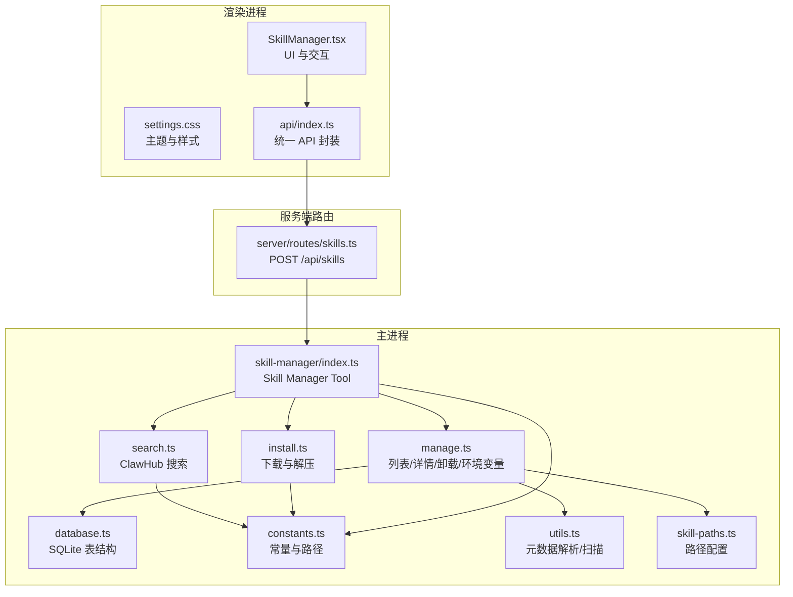
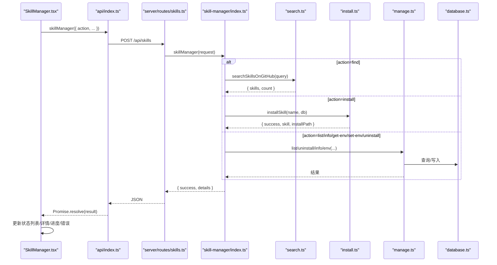
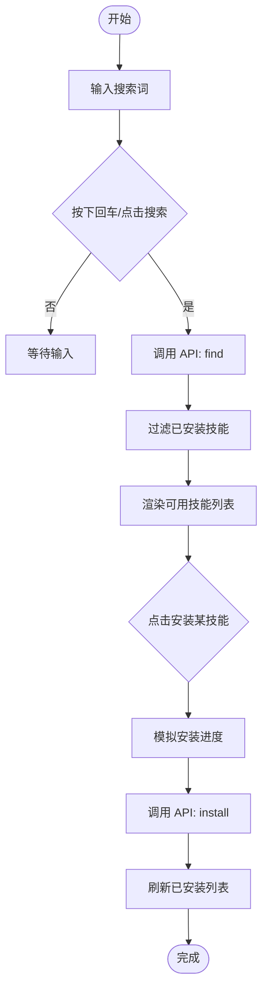
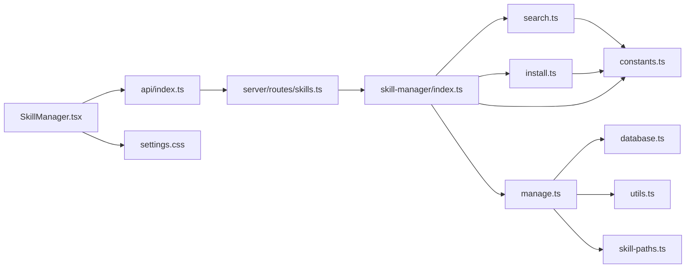

# 技能界面组件

<cite>
**本文引用的文件**
- [SkillManager.tsx](file://src/renderer/components/SkillManager.tsx)
- [settings.css](file://src/renderer/styles/settings.css)
- [index.ts](file://src/renderer/api/index.ts)
- [skills.ts](file://src/server/routes/skills.ts)
- [index.ts](file://src/main/tools/skill-manager/index.ts)
- [types.ts](file://src/main/tools/skill-manager/types.ts)
- [search.ts](file://src/main/tools/skill-manager/search.ts)
- [install.ts](file://src/main/tools/skill-manager/install.ts)
- [manage.ts](file://src/main/tools/skill-manager/manage.ts)
- [database.ts](file://src/main/tools/skill-manager/database.ts)
- [constants.ts](file://src/main/tools/skill-manager/constants.ts)
- [utils.ts](file://src/main/tools/skill-manager/utils.ts)
- [skill-paths.ts](file://src/main/config/skill-paths.ts)
</cite>

## 目录
1. [简介](#简介)
2. [项目结构](#项目结构)
3. [核心组件](#核心组件)
4. [架构总览](#架构总览)
5. [详细组件分析](#详细组件分析)
6. [依赖关系分析](#依赖关系分析)
7. [性能考量](#性能考量)
8. [故障排查指南](#故障排查指南)
9. [结论](#结论)
10. [附录](#附录)

## 简介
本文件面向 史丽慧小助理 的“技能界面组件”，聚焦于 SkillManager 组件的架构设计与状态管理，系统性阐述技能搜索界面、安装进度显示、技能列表展示的实现方式；同时覆盖用户交互设计（搜索输入处理、技能卡片渲染、操作按钮状态管理）、数据流设计（与后端 API 的通信、状态同步与错误处理）、可定制性与主题支持、响应式设计以及用户体验优化与无障碍访问建议。文档通过多幅图示帮助读者快速理解组件间的调用链路与数据流转。

## 项目结构
SkillManager 组件位于渲染进程，负责 UI 展示与用户交互；其后端能力由主进程的 Skill Manager Tool 提供，通过统一 API 接口在 Electron/Web 环境下进行路由转发与执行。技能元数据与文件结构由主进程解析与持久化，渲染侧通过 API 调用获取最新状态并驱动 UI。

图表来源
- [SkillManager.tsx:1-796](file://src/renderer/components/SkillManager.tsx#L1-L796)
- [settings.css:1-621](file://src/renderer/styles/settings.css#L1-L621)
- [index.ts:333-336](file://src/renderer/api/index.ts#L333-L336)
- [skills.ts:10-37](file://src/server/routes/skills.ts#L10-L37)
- [index.ts:27-179](file://src/main/tools/skill-manager/index.ts#L27-L179)
- [search.ts:29-80](file://src/main/tools/skill-manager/search.ts#L29-L80)
- [install.ts:22-150](file://src/main/tools/skill-manager/install.ts#L22-L150)
- [manage.ts:17-281](file://src/main/tools/skill-manager/manage.ts#L17-L281)
- [database.ts:13-40](file://src/main/tools/skill-manager/database.ts#L13-L40)
- [constants.ts:9-35](file://src/main/tools/skill-manager/constants.ts#L9-L35)
- [utils.ts:28-92](file://src/main/tools/skill-manager/utils.ts#L28-L92)
- [skill-paths.ts:16-69](file://src/main/config/skill-paths.ts#L16-L69)

章节来源
- [SkillManager.tsx:1-796](file://src/renderer/components/SkillManager.tsx#L1-L796)
- [index.ts:333-336](file://src/renderer/api/index.ts#L333-L336)
- [skills.ts:10-37](file://src/server/routes/skills.ts#L10-L37)

## 核心组件
- SkillManager（渲染侧）：负责搜索、安装、卸载、查看详情、环境变量编辑等交互；维护标签页切换、加载状态、错误提示与安装进度模拟。
- SkillCard（渲染侧）：封装单个技能卡片的渲染与操作按钮状态，支持“安装中”进度条与“详情/卸载/环境变量”按钮。
- SkillDetailDialog（渲染侧）：展示技能详情、依赖、文件列表与使用说明。
- Skill Manager Tool（主进程）：提供 find/install/list/uninstall/info/get-env/set-env 等动作，调用搜索、安装、管理与数据库模块。
- 数据库与路径：SQLite 表结构、技能路径配置、元数据解析与文件扫描。

章节来源
- [SkillManager.tsx:45-482](file://src/renderer/components/SkillManager.tsx#L45-L482)
- [index.ts:27-179](file://src/main/tools/skill-manager/index.ts#L27-L179)
- [database.ts:13-40](file://src/main/tools/skill-manager/database.ts#L13-L40)
- [skill-paths.ts:16-69](file://src/main/config/skill-paths.ts#L16-L69)

## 架构总览
SkillManager 的数据流自上而下分为三层：
- 视图层：SkillManager 组件根据状态渲染搜索栏、标签页、技能列表与详情/环境变量弹窗。
- API 层：统一 API 封装根据运行环境选择 IPC 或 HTTP，向服务端路由转发请求。
- 业务层：服务端路由将请求交由 Skill Manager Tool 执行，调用搜索、安装、管理与数据库模块，返回结构化结果。

图表来源
- [SkillManager.tsx:92-163](file://src/renderer/components/SkillManager.tsx#L92-L163)
- [index.ts:333-336](file://src/renderer/api/index.ts#L333-L336)
- [skills.ts:14-34](file://src/server/routes/skills.ts#L14-L34)
- [index.ts:78-177](file://src/main/tools/skill-manager/index.ts#L78-L177)
- [search.ts:29-80](file://src/main/tools/skill-manager/search.ts#L29-L80)
- [install.ts:22-80](file://src/main/tools/skill-manager/install.ts#L22-L80)
- [manage.ts:17-281](file://src/main/tools/skill-manager/manage.ts#L17-L281)
- [database.ts:13-40](file://src/main/tools/skill-manager/database.ts#L13-L40)

## 详细组件分析

### SkillManager 组件（渲染侧）
职责与状态：
- 标签页：installed/available，切换时按需加载已安装技能列表。
- 搜索：输入关键词触发搜索，过滤已安装项，展示可用技能列表。
- 安装：点击安装按钮启动进度模拟，调用 API 完成安装后刷新列表。
- 卸载：确认后调用 API 卸载并刷新列表。
- 详情：查看已安装或未安装技能的详细信息（含 README、依赖、文件列表）。
- 环境变量：打开编辑弹窗，保存后刷新。

交互流程（搜索与安装）：

图表来源
- [SkillManager.tsx:92-163](file://src/renderer/components/SkillManager.tsx#L92-L163)

章节来源
- [SkillManager.tsx:64-163](file://src/renderer/components/SkillManager.tsx#L64-L163)

### SkillCard 组件（渲染侧）
- 渲染技能标题、描述、版本、作者、星数、下载量、标签等信息。
- 按状态显示“详情/卸载/环境变量”按钮。
- 安装中时显示进度条与百分比动画。
- 支持序号前缀（搜索结果展示）。

章节来源
- [SkillManager.tsx:484-601](file://src/renderer/components/SkillManager.tsx#L484-L601)

### SkillDetailDialog 组件（渲染侧）
- 展示技能描述、版本、作者、仓库、安装路径等基本信息。
- 展示依赖（工具与依赖包）与标签。
- 展示 SKILL.md 内容与脚本/参考/资源文件列表（分组与截断）。
- 提供关闭按钮。

章节来源
- [SkillManager.tsx:603-795](file://src/renderer/components/SkillManager.tsx#L603-L795)

### API 与路由（统一接口与服务端转发）
- 渲染侧通过统一 API 封装调用 skillManager，自动区分 Electron IPC 与 Web HTTP。
- 服务端路由接收请求并转发给 Skill Manager Tool 执行，返回统一结构。

章节来源
- [index.ts:333-336](file://src/renderer/api/index.ts#L333-L336)
- [skills.ts:14-34](file://src/server/routes/skills.ts#L14-L34)

### Skill Manager Tool（主进程）
- 动作定义：find、install、list、enable、disable、uninstall、info、get-env、set-env。
- 参数校验与错误包装，返回统一结构（success/details/error）。
- 调用搜索、安装、管理与数据库模块。

章节来源
- [index.ts:27-179](file://src/main/tools/skill-manager/index.ts#L27-L179)

### 搜索与安装（ClawHub 集成）
- 搜索：调用 ClawHub 搜索 API，解析结果为 SkillSearchResult 列表。
- 安装：下载 zip、解压到技能目录，解析 SKILL.md 元数据，写入数据库。

章节来源
- [search.ts:29-80](file://src/main/tools/skill-manager/search.ts#L29-L80)
- [install.ts:22-150](file://src/main/tools/skill-manager/install.ts#L22-L150)

### 管理与数据库（列表/详情/卸载/环境变量）
- 列表：扫描技能路径，解析 SKILL.md，合并数据库记录，排序并过滤。
- 详情：读取 README 与文件列表，合并元数据。
- 卸载：删除数据库记录与文件。
- 环境变量：读取/写入 .env 文件，支持多路径合并。

章节来源
- [manage.ts:17-281](file://src/main/tools/skill-manager/manage.ts#L17-L281)
- [database.ts:13-40](file://src/main/tools/skill-manager/database.ts#L13-L40)

### 类型与常量
- 类型：SkillSearchResult、InstalledSkill、InstallResult、SkillInfo、SkillMetadata。
- 常量：技能目录、数据库路径、ClawHub 搜索与下载 API。

章节来源
- [types.ts:8-84](file://src/main/tools/skill-manager/types.ts#L8-L84)
- [constants.ts:9-35](file://src/main/tools/skill-manager/constants.ts#L9-L35)

### 工具函数与路径配置
- 元数据解析：从 SKILL.md frontmatter 提取 name/description/version/author/repository/tags/requires。
- 文件扫描：递归列出 scripts/references/assets 目录。
- 路径配置：从系统配置读取默认与全部技能路径，支持展开用户路径。

章节来源
- [utils.ts:28-92](file://src/main/tools/skill-manager/utils.ts#L28-L92)
- [skill-paths.ts:16-69](file://src/main/config/skill-paths.ts#L16-L69)

## 依赖关系分析
- 组件耦合：SkillManager 依赖 API 封装与样式；SkillCard/SkillDetailDialog 为纯展示组件，依赖 SkillManager 传递的状态与回调。
- 外部依赖：ClawHub 搜索/下载 API；SQLite 数据库；文件系统读写；路径展开工具。
- 循环依赖：未发现循环依赖，模块职责清晰（UI/路由/工具/数据库）。

图表来源
- [SkillManager.tsx:1-796](file://src/renderer/components/SkillManager.tsx#L1-L796)
- [index.ts:333-336](file://src/renderer/api/index.ts#L333-L336)
- [skills.ts:10-37](file://src/server/routes/skills.ts#L10-L37)
- [index.ts:27-179](file://src/main/tools/skill-manager/index.ts#L27-L179)
- [manage.ts:17-281](file://src/main/tools/skill-manager/manage.ts#L17-L281)
- [database.ts:13-40](file://src/main/tools/skill-manager/database.ts#L13-L40)
- [utils.ts:28-92](file://src/main/tools/skill-manager/utils.ts#L28-L92)
- [skill-paths.ts:16-69](file://src/main/config/skill-paths.ts#L16-L69)
- [constants.ts:9-35](file://src/main/tools/skill-manager/constants.ts#L9-L35)

## 性能考量
- 搜索与安装的网络请求具备超时与错误包装，避免阻塞 UI。
- 安装进度采用定时器模拟，避免真实下载进度难以获取导致的 UI 卡顿。
- 列表渲染使用虚拟滚动或分页策略可进一步优化长列表性能（当前为简单列表，建议在数据量大时引入）。
- 数据库查询使用索引（name、enabled），减少排序与过滤成本。
- 文件扫描与 SKILL.md 解析在管理阶段执行，避免频繁 IO。

[本节为通用性能建议，无需特定文件来源]

## 故障排查指南
常见问题与定位要点：
- 搜索失败：检查网络连通性与代理设置；ClawHub API 返回异常会被包装为更友好的错误信息。
- 安装失败：检查磁盘空间、权限与 zip 下载/解压过程；查看临时文件清理逻辑。
- 卸载后残留：确认技能目录存在且 .env 文件已删除；检查路径配置是否正确。
- 详情为空：确认 SKILL.md 存在且包含必要 frontmatter 字段；检查 README 读取与文件扫描。
- 环境变量未生效：确认 .env 内容格式正确（KEY=VALUE，支持注释）；检查缓存重置逻辑。

章节来源
- [search.ts:65-79](file://src/main/tools/skill-manager/search.ts#L65-L79)
- [install.ts:76-79](file://src/main/tools/skill-manager/install.ts#L76-L79)
- [manage.ts:123-150](file://src/main/tools/skill-manager/manage.ts#L123-L150)
- [utils.ts:38-79](file://src/main/tools/skill-manager/utils.ts#L38-L79)

## 结论
SkillManager 组件通过清晰的职责划分与统一 API 设计，实现了从搜索、安装到管理的完整闭环。渲染侧以状态驱动 UI，主进程以工具函数与数据库为核心，配合路径与元数据解析，形成可扩展、可维护的技能生态。后续可在长列表渲染、真实安装进度上报、多语言与无障碍方面持续优化。

[本节为总结性内容，无需特定文件来源]

## 附录

### 用户交互设计要点
- 搜索输入处理：支持回车触发与按钮点击；禁用无效输入；搜索结果过滤已安装项。
- 技能卡片渲染：展示关键信息与标签；安装中显示进度条与动画。
- 操作按钮状态管理：根据 isInstalled 与 installingSkill 控制按钮显隐与禁用。
- 详情与环境变量：详情弹窗承载丰富信息；环境变量编辑支持注释与占位提示。

章节来源
- [SkillManager.tsx:92-256](file://src/renderer/components/SkillManager.tsx#L92-L256)

### 数据流设计与状态同步
- 渲染侧状态：activeTab、searchQuery、installedSkills、availableSkills、isLoading、selectedSkill、searchError、installingSkill、installProgress、envEditSkill、envContent、envSaving。
- 后端状态：数据库记录（skills 表）与文件系统（技能目录）。
- 同步策略：安装完成后主动刷新已安装列表；卸载后同步刷新；详情失败时回退至基础信息。

章节来源
- [SkillManager.tsx:45-89](file://src/renderer/components/SkillManager.tsx#L45-L89)
- [manage.ts:17-118](file://src/main/tools/skill-manager/manage.ts#L17-L118)

### 主题支持与响应式设计
- 主题变量：settings.css 定义深浅主题变量，统一颜色与边框。
- 统一样式：按钮、输入框、卡片、滚动条等均通过 CSS 变量适配主题。
- 响应式：容器尺寸与最大高度限制，保证在不同屏幕下的可读性与可操作性。

章节来源
- [settings.css:7-621](file://src/renderer/styles/settings.css#L7-L621)

### 可定制性选项
- 路径配置：支持多技能路径与默认路径，便于扩展与迁移。
- 元数据字段：name/description/version/author/repository/tags/requires 可扩展。
- 环境变量：支持多路径合并，便于团队协作与隔离。

章节来源
- [skill-paths.ts:16-69](file://src/main/config/skill-paths.ts#L16-L69)
- [utils.ts:28-92](file://src/main/tools/skill-manager/utils.ts#L28-L92)
- [manage.ts:193-226](file://src/main/tools/skill-manager/manage.ts#L193-L226)

### 无障碍访问建议
- 键盘导航：为按钮与输入框提供明确的焦点顺序与可见焦点指示。
- 屏幕阅读器：为图标按钮提供 aria-label；详情弹窗提供语义化标题。
- 对比度与字体：确保文本对比度满足 WCAG；使用等宽字体提升代码可读性。
- 错误提示：错误信息提供可读文案与重试按钮，避免仅图标提示。

[本节为通用无障碍建议，无需特定文件来源]