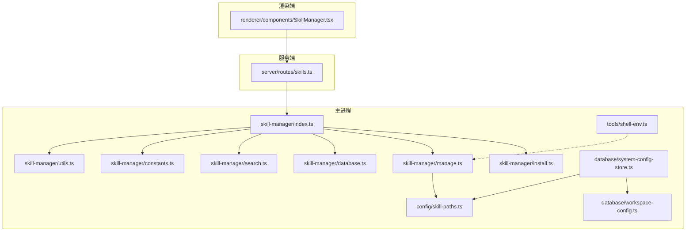
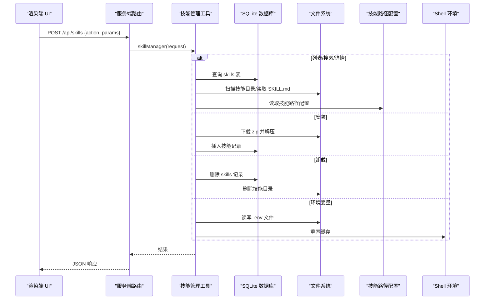
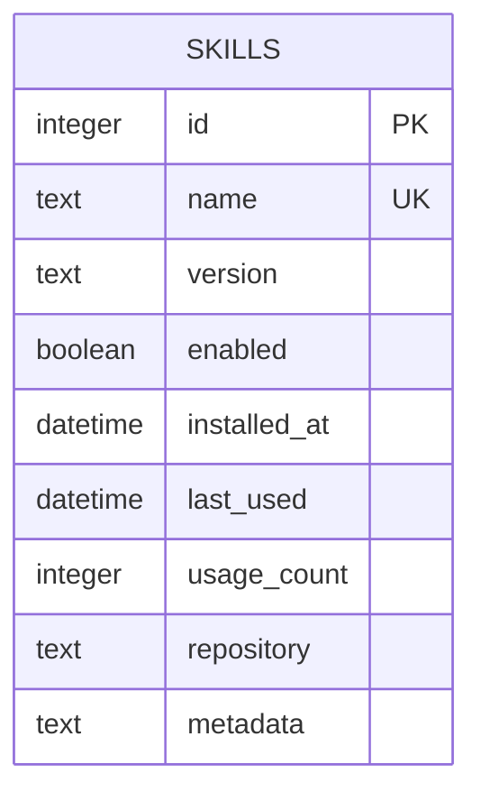
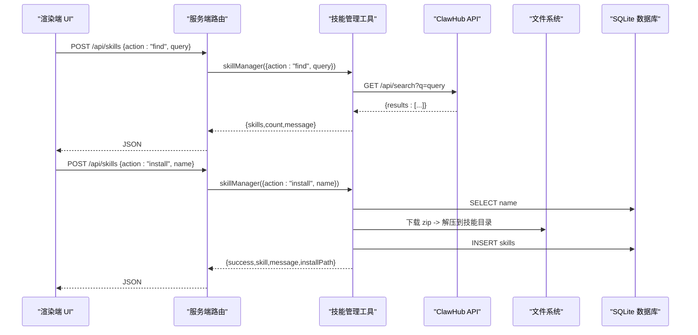
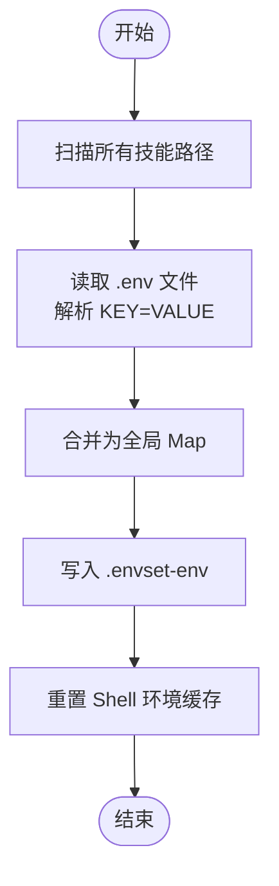
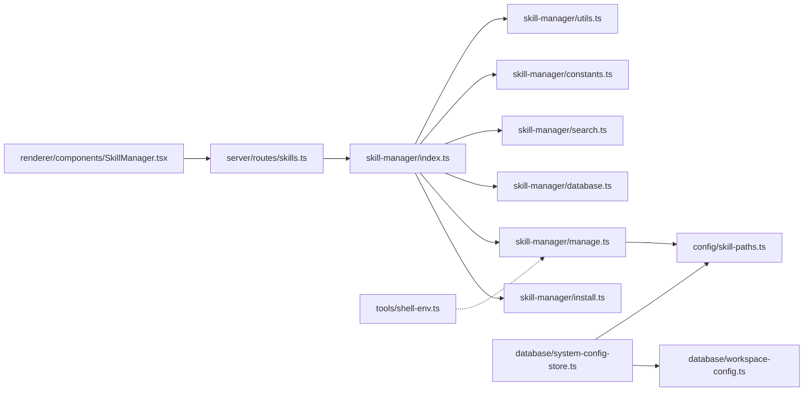

# 技能管理操作

<cite>
**本文引用的文件**
- [src/main/tools/skill-manager/index.ts](file://src/main/tools/skill-manager/index.ts)
- [src/main/tools/skill-manager/manage.ts](file://src/main/tools/skill-manager/manage.ts)
- [src/main/tools/skill-manager/database.ts](file://src/main/tools/skill-manager/database.ts)
- [src/main/tools/skill-manager/search.ts](file://src/main/tools/skill-manager/search.ts)
- [src/main/tools/skill-manager/install.ts](file://src/main/tools/skill-manager/install.ts)
- [src/main/tools/skill-manager/constants.ts](file://src/main/tools/skill-manager/constants.ts)
- [src/main/tools/skill-manager/utils.ts](file://src/main/tools/skill-manager/utils.ts)
- [src/main/config/skill-paths.ts](file://src/main/config/skill-paths.ts)
- [src/main/database/system-config-store.ts](file://src/main/database/system-config-store.ts)
- [src/main/database/workspace-config.ts](file://src/main/database/workspace-config.ts)
- [src/main/tools/shell-env.ts](file://src/main/tools/shell-env.ts)
- [src/server/routes/skills.ts](file://src/server/routes/skills.ts)
- [src/renderer/components/SkillManager.tsx](file://src/renderer/components/SkillManager.tsx)
- [src/shared/utils/sqlite-adapter.ts](file://src/shared/utils/sqlite-adapter.ts)
</cite>

## 目录
1. [简介](#简介)
2. [项目结构](#项目结构)
3. [核心组件](#核心组件)
4. [架构总览](#架构总览)
5. [详细组件分析](#详细组件分析)
6. [依赖关系分析](#依赖关系分析)
7. [性能考虑](#性能考虑)
8. [故障排查指南](#故障排查指南)
9. [结论](#结论)
10. [附录](#附录)

## 简介
本文件面向 DeepBot 技能管理操作，围绕技能的启用/禁用机制、卸载流程与状态管理进行深入技术说明；详述技能数据库设计（技能信息存储、配置管理、元数据维护）、技能列表查询与排序规则；解释技能环境变量管理（配置文件读写、变量解析与缓存机制）；提供技能更新检测、版本比较与升级策略建议；并给出数据库迁移、备份恢复与性能优化方案。

## 项目结构
技能管理相关代码主要位于以下模块：
- 主进程工具层：技能搜索、安装、管理、数据库初始化与常量定义
- 配置与路径：系统配置存储、工作目录与技能路径配置
- Shell 环境：环境变量与 PATH 的补全与缓存
- 服务端路由：对外暴露技能管理接口
- 渲染端组件：可视化技能管理界面

**图表来源**
- [src/main/tools/skill-manager/index.ts:1-180](file://src/main/tools/skill-manager/index.ts#L1-L180)
- [src/main/tools/skill-manager/install.ts:1-150](file://src/main/tools/skill-manager/install.ts#L1-L150)
- [src/main/tools/skill-manager/manage.ts:1-281](file://src/main/tools/skill-manager/manage.ts#L1-L281)
- [src/main/tools/skill-manager/database.ts:1-41](file://src/main/tools/skill-manager/database.ts#L1-L41)
- [src/main/tools/skill-manager/search.ts:1-81](file://src/main/tools/skill-manager/search.ts#L1-L81)
- [src/main/tools/skill-manager/constants.ts:1-35](file://src/main/tools/skill-manager/constants.ts#L1-L35)
- [src/main/tools/skill-manager/utils.ts:1-92](file://src/main/tools/skill-manager/utils.ts#L1-L92)
- [src/main/config/skill-paths.ts:1-69](file://src/main/config/skill-paths.ts#L1-L69)
- [src/main/database/system-config-store.ts:1-576](file://src/main/database/system-config-store.ts#L1-L576)
- [src/main/database/workspace-config.ts:1-219](file://src/main/database/workspace-config.ts#L1-L219)
- [src/main/tools/shell-env.ts:1-417](file://src/main/tools/shell-env.ts#L1-L417)
- [src/server/routes/skills.ts:1-38](file://src/server/routes/skills.ts#L1-L38)
- [src/renderer/components/SkillManager.tsx:1-796](file://src/renderer/components/SkillManager.tsx#L1-L796)

**章节来源**
- [src/main/tools/skill-manager/index.ts:1-180](file://src/main/tools/skill-manager/index.ts#L1-L180)
- [src/main/tools/skill-manager/manage.ts:1-281](file://src/main/tools/skill-manager/manage.ts#L1-L281)
- [src/main/tools/skill-manager/database.ts:1-41](file://src/main/tools/skill-manager/database.ts#L1-L41)
- [src/main/tools/skill-manager/search.ts:1-81](file://src/main/tools/skill-manager/search.ts#L1-L81)
- [src/main/tools/skill-manager/install.ts:1-150](file://src/main/tools/skill-manager/install.ts#L1-L150)
- [src/main/tools/skill-manager/constants.ts:1-35](file://src/main/tools/skill-manager/constants.ts#L1-L35)
- [src/main/tools/skill-manager/utils.ts:1-92](file://src/main/tools/skill-manager/utils.ts#L1-L92)
- [src/main/config/skill-paths.ts:1-69](file://src/main/config/skill-paths.ts#L1-L69)
- [src/main/database/system-config-store.ts:1-576](file://src/main/database/system-config-store.ts#L1-L576)
- [src/main/database/workspace-config.ts:1-219](file://src/main/database/workspace-config.ts#L1-L219)
- [src/main/tools/shell-env.ts:1-417](file://src/main/tools/shell-env.ts#L1-L417)
- [src/server/routes/skills.ts:1-38](file://src/server/routes/skills.ts#L1-L38)
- [src/renderer/components/SkillManager.tsx:1-796](file://src/renderer/components/SkillManager.tsx#L1-L796)

## 核心组件
- 技能管理工具入口：提供 find、install、list、enable、disable、uninstall、info、get-env、set-env 等操作，封装参数校验与错误处理。
- 数据库层：SQLite 表 skills 存放技能元数据与状态，含索引以提升查询性能。
- 路径与配置：SystemConfigStore 统一管理工作目录、技能目录列表与默认技能目录；技能路径由配置驱动。
- 环境变量：ShellEnv 提供登录 shell 环境变量与 PATH 的补全，并缓存以减少重复执行；技能 .env 优先级高于系统配置。
- UI 组件：渲染端提供搜索、安装、卸载、详情查看与环境变量编辑能力。

**章节来源**
- [src/main/tools/skill-manager/index.ts:27-179](file://src/main/tools/skill-manager/index.ts#L27-L179)
- [src/main/tools/skill-manager/database.ts:13-40](file://src/main/tools/skill-manager/database.ts#L13-L40)
- [src/main/config/skill-paths.ts:31-69](file://src/main/config/skill-paths.ts#L31-L69)
- [src/main/database/system-config-store.ts:337-379](file://src/main/database/system-config-store.ts#L337-L379)
- [src/main/tools/shell-env.ts:355-416](file://src/main/tools/shell-env.ts#L355-L416)
- [src/renderer/components/SkillManager.tsx:45-256](file://src/renderer/components/SkillManager.tsx#L45-L256)

## 架构总览
技能管理操作从渲染端发起请求，经服务端路由转发至主进程工具，工具层协调数据库、路径与环境变量模块完成具体操作。

**图表来源**
- [src/server/routes/skills.ts:14-34](file://src/server/routes/skills.ts#L14-L34)
- [src/main/tools/skill-manager/index.ts:78-177](file://src/main/tools/skill-manager/index.ts#L78-L177)
- [src/main/tools/skill-manager/manage.ts:17-150](file://src/main/tools/skill-manager/manage.ts#L17-L150)
- [src/main/tools/skill-manager/install.ts:22-80](file://src/main/tools/skill-manager/install.ts#L22-L80)
- [src/main/tools/skill-manager/database.ts:13-40](file://src/main/tools/skill-manager/database.ts#L13-L40)
- [src/main/config/skill-paths.ts:31-41](file://src/main/config/skill-paths.ts#L31-L41)
- [src/main/tools/shell-env.ts:332-336](file://src/main/tools/shell-env.ts#L332-L336)

## 详细组件分析

### 技能数据库设计与状态管理
- 表结构：skills 表包含唯一 name、version、enabled、installed_at、last_used、usage_count、repository、metadata 等字段；创建 name 与 enabled 索引以优化查询。
- 状态字段：enabled 控制技能启用/禁用；usage_count 与 last_used 用于统计与排序；metadata 存放 SKILL.md 解析出的结构化信息。
- 初始化：首次扫描技能目录时若数据库无记录，则解析 SKILL.md 并插入默认启用状态。
- 列表与排序：支持按 enabled 过滤；按 usage_count 降序、installed_at 降序排序。

**图表来源**
- [src/main/tools/skill-manager/database.ts:22-37](file://src/main/tools/skill-manager/database.ts#L22-L37)
- [src/main/tools/skill-manager/manage.ts:48-117](file://src/main/tools/skill-manager/manage.ts#L48-L117)

**章节来源**
- [src/main/tools/skill-manager/database.ts:13-40](file://src/main/tools/skill-manager/database.ts#L13-L40)
- [src/main/tools/skill-manager/manage.ts:17-118](file://src/main/tools/skill-manager/manage.ts#L17-L118)

### 技能列表查询、过滤与排序
- 过滤：支持 enabled 参数仅列出已启用或已禁用的技能。
- 排序：优先按 usage_count 降序，其次按 installed_at 降序。
- 路径扫描：遍历所有技能路径，检查每个子目录是否包含 SKILL.md，作为“已安装”的判定依据。

**章节来源**
- [src/main/tools/skill-manager/manage.ts:17-118](file://src/main/tools/skill-manager/manage.ts#L17-L118)
- [src/main/config/skill-paths.ts:31-41](file://src/main/config/skill-paths.ts#L31-L41)

### 技能搜索与安装流程
- 搜索：调用 ClawHub 搜索 API，返回技能摘要列表；对网络错误进行友好提示。
- 安装：检查是否已安装；下载 zip 并解压到技能目录；解析 SKILL.md 并写入数据库；返回安装结果与依赖信息。

**图表来源**
- [src/main/tools/skill-manager/search.ts:29-80](file://src/main/tools/skill-manager/search.ts#L29-L80)
- [src/main/tools/skill-manager/install.ts:22-80](file://src/main/tools/skill-manager/install.ts#L22-L80)
- [src/server/routes/skills.ts:14-34](file://src/server/routes/skills.ts#L14-L34)

**章节来源**
- [src/main/tools/skill-manager/search.ts:29-80](file://src/main/tools/skill-manager/search.ts#L29-L80)
- [src/main/tools/skill-manager/install.ts:22-80](file://src/main/tools/skill-manager/install.ts#L22-L80)

### 技能启用/禁用机制与状态更新
- 当前实现：技能状态存储于数据库的 enabled 字段；列表查询时可按 enabled 过滤；排序逻辑基于 usage_count 与 installed_at。
- 实际运行时的启用/禁用：工具层通过 SystemConfigStore 的工具禁用表控制工具级启用/禁用，与技能表的 enabled 字段不同维度；两者协同影响最终行为。
- 建议：若需将技能视为“工具”，可在工具层增加对 skills.enabled 的读取与应用，或在运行时根据 enabled 字段动态调整工具注册。

**章节来源**
- [src/main/tools/skill-manager/manage.ts:17-118](file://src/main/tools/skill-manager/manage.ts#L17-L118)
- [src/main/database/system-config-store.ts:544-556](file://src/main/database/system-config-store.ts#L544-L556)

### 技能卸载流程
- 删除数据库记录：执行 DELETE FROM skills WHERE name = ?。
- 删除文件：在所有技能路径中定位技能目录并安全删除。
- 异常处理：若记录不存在抛出错误；若目录不存在则跳过删除。

**章节来源**
- [src/main/tools/skill-manager/manage.ts:123-150](file://src/main/tools/skill-manager/manage.ts#L123-L150)

### 技能环境变量管理
- 读取：遍历所有技能路径下的 .env 文件，解析 KEY=VALUE（支持 export 前缀与注释行），合并为 Map。
- 写入：在指定技能目录写入 .env 文件。
- 优先级：技能 .env 的变量优先于系统配置文件中的同名变量。
- 缓存与刷新：设置环境变量后调用 resetShellPathCache，下次执行命令时重新加载完整环境。

**图表来源**
- [src/main/tools/skill-manager/manage.ts:193-226](file://src/main/tools/skill-manager/manage.ts#L193-L226)
- [src/main/tools/skill-manager/manage.ts:169-188](file://src/main/tools/skill-manager/manage.ts#L169-L188)
- [src/main/tools/shell-env.ts:332-336](file://src/main/tools/shell-env.ts#L332-L336)

**章节来源**
- [src/main/tools/skill-manager/manage.ts:155-226](file://src/main/tools/skill-manager/manage.ts#L155-L226)
- [src/main/tools/shell-env.ts:355-416](file://src/main/tools/shell-env.ts#L355-L416)

### 技能元数据与 SKILL.md 解析
- 元数据字段：name、description、version、author、repository、tags、requires（tools、dependencies）。
- 解析方式：提取 YAML frontmatter，逐行解析键值；校验必需字段。
- 用途：安装时写入数据库 metadata 字段；详情查询时读取 SKILL.md 与目录文件列表。

**章节来源**
- [src/main/tools/skill-manager/utils.ts:28-80](file://src/main/tools/skill-manager/utils.ts#L28-L80)
- [src/main/tools/skill-manager/manage.ts:229-280](file://src/main/tools/skill-manager/manage.ts#L229-L280)

### 技能路径与配置管理
- 默认路径：SystemConfigStore 提供默认工作目录与技能目录；Docker 模式下强制使用 /data/*。
- 动态路径：支持多技能目录与默认技能目录；可通过 UI 或配置接口修改。
- 读取：getAllSkillPaths 返回展开后的绝对路径列表；用于扫描与安装定位。

**章节来源**
- [src/main/database/workspace-config.ts:17-46](file://src/main/database/workspace-config.ts#L17-L46)
- [src/main/database/workspace-config.ts:51-89](file://src/main/database/workspace-config.ts#L51-L89)
- [src/main/config/skill-paths.ts:31-41](file://src/main/config/skill-paths.ts#L31-L41)

### 渲染端技能管理界面
- 功能：搜索可用技能、安装、卸载、查看详情、编辑环境变量、显示安装进度。
- 数据流：调用 /api/skills，根据返回结果更新 UI；对错误进行提示与重试引导。

**章节来源**
- [src/renderer/components/SkillManager.tsx:45-256](file://src/renderer/components/SkillManager.tsx#L45-L256)

## 依赖关系分析

**图表来源**
- [src/main/tools/skill-manager/index.ts:18-22](file://src/main/tools/skill-manager/index.ts#L18-L22)
- [src/main/tools/skill-manager/manage.ts:9-11](file://src/main/tools/skill-manager/manage.ts#L9-L11)
- [src/main/config/skill-paths.ts:9-11](file://src/main/config/skill-paths.ts#L9-L11)
- [src/main/database/system-config-store.ts:11-15](file://src/main/database/system-config-store.ts#L11-L15)
- [src/main/database/workspace-config.ts:5-11](file://src/main/database/workspace-config.ts#L5-L11)
- [src/main/tools/shell-env.ts:10-11](file://src/main/tools/shell-env.ts#L10-L11)
- [src/server/routes/skills.ts:10-26](file://src/server/routes/skills.ts#L10-L26)
- [src/renderer/components/SkillManager.tsx](file://src/renderer/components/SkillManager.tsx#L8)

**章节来源**
- [src/main/tools/skill-manager/index.ts:18-22](file://src/main/tools/skill-manager/index.ts#L18-L22)
- [src/main/tools/skill-manager/manage.ts:9-11](file://src/main/tools/skill-manager/manage.ts#L9-L11)
- [src/main/config/skill-paths.ts:9-11](file://src/main/config/skill-paths.ts#L9-L11)
- [src/main/database/system-config-store.ts:11-15](file://src/main/database/system-config-store.ts#L11-L15)
- [src/main/database/workspace-config.ts:5-11](file://src/main/database/workspace-config.ts#L5-L11)
- [src/main/tools/shell-env.ts:10-11](file://src/main/tools/shell-env.ts#L10-L11)
- [src/server/routes/skills.ts:10-26](file://src/server/routes/skills.ts#L10-L26)
- [src/renderer/components/SkillManager.tsx](file://src/renderer/components/SkillManager.tsx#L8)

## 性能考虑
- 数据库索引：skills 表已建立 name 与 enabled 索引，有助于高频查询与过滤。
- I/O 优化：安装时使用临时目录解压并一次性移动，避免跨文件系统重命名错误；扫描技能目录时仅检查 SKILL.md 存在性。
- 环境变量缓存：ShellEnv 对 PATH 与完整环境变量进行缓存，减少重复执行 shell 的开销。
- UI 体验：安装过程模拟进度条，避免长时间阻塞；错误时提供重试按钮与原因提示。

**章节来源**
- [src/main/tools/skill-manager/database.ts:35-37](file://src/main/tools/skill-manager/database.ts#L35-L37)
- [src/main/tools/skill-manager/install.ts:119-149](file://src/main/tools/skill-manager/install.ts#L119-L149)
- [src/main/tools/shell-env.ts:284-336](file://src/main/tools/shell-env.ts#L284-L336)
- [src/renderer/components/SkillManager.tsx:128-163](file://src/renderer/components/SkillManager.tsx#L128-L163)

## 故障排查指南
- 网络连接问题（ClawHub 搜索/下载失败）
  - 现象：搜索或安装报错，提示无法连接。
  - 排查：检查网络、代理与防火墙；确认 API 地址可达。
  - 参考
    - [src/main/tools/skill-manager/search.ts:65-79](file://src/main/tools/skill-manager/search.ts#L65-L79)
- 技能目录不存在或权限不足
  - 现象：卸载或安装后残留文件；或扫描不到技能。
  - 排查：确认技能路径配置正确且目录存在；检查权限。
  - 参考
    - [src/main/config/skill-paths.ts:31-41](file://src/main/config/skill-paths.ts#L31-L41)
    - [src/main/tools/skill-manager/manage.ts:134-147](file://src/main/tools/skill-manager/manage.ts#L134-L147)
- 环境变量未生效
  - 现象：设置 .env 后仍无法读取变量。
  - 排查：确认 .env 格式正确；调用 set-env 后已触发缓存重置；重启相关进程。
  - 参考
    - [src/main/tools/skill-manager/manage.ts:169-188](file://src/main/tools/skill-manager/manage.ts#L169-L188)
    - [src/main/tools/shell-env.ts:332-336](file://src/main/tools/shell-env.ts#L332-L336)
- 数据库异常
  - 现象：SQLite 报错或表结构不一致。
  - 排查：确认数据库路径与权限；必要时迁移或重建。
  - 参考
    - [src/shared/utils/sqlite-adapter.ts:14-70](file://src/shared/utils/sqlite-adapter.ts#L14-L70)
    - [src/main/tools/skill-manager/database.ts:13-40](file://src/main/tools/skill-manager/database.ts#L13-L40)

**章节来源**
- [src/main/tools/skill-manager/search.ts:65-79](file://src/main/tools/skill-manager/search.ts#L65-L79)
- [src/main/config/skill-paths.ts:31-41](file://src/main/config/skill-paths.ts#L31-L41)
- [src/main/tools/skill-manager/manage.ts:134-147](file://src/main/tools/skill-manager/manage.ts#L134-L147)
- [src/main/tools/shell-env.ts:332-336](file://src/main/tools/shell-env.ts#L332-L336)
- [src/shared/utils/sqlite-adapter.ts:14-70](file://src/shared/utils/sqlite-adapter.ts#L14-L70)
- [src/main/tools/skill-manager/database.ts:13-40](file://src/main/tools/skill-manager/database.ts#L13-L40)

## 结论
DeepBot 的技能管理以 SQLite 为核心存储，结合多路径扫描与元数据解析，实现了从搜索、安装、管理到环境变量的完整闭环。通过索引与缓存优化，系统在功能完整性与性能之间取得平衡。未来可在工具层进一步整合 skills.enabled 与工具启用状态，完善技能的启用/禁用与运行时控制。

## 附录

### 数据库迁移与备份恢复
- 迁移策略
  - 使用 SystemConfigStore 的迁移方法对表结构进行增量升级（如新增列），确保向后兼容。
  - 技能数据库 skills 表结构稳定，迁移时遵循“先检查字段存在性，再执行 ALTER”原则。
- 备份与恢复
  - 备份：复制 SQLite 数据库文件（skills.db）与关键配置表。
  - 恢复：停止服务后替换数据库文件，启动后验证技能列表与元数据完整性。

**章节来源**
- [src/main/database/system-config-store.ts:230-315](file://src/main/database/system-config-store.ts#L230-L315)
- [src/main/tools/skill-manager/database.ts:13-40](file://src/main/tools/skill-manager/database.ts#L13-L40)

### 版本比较与升级策略
- 版本字段：skills 表 version 字段与 SKILL.md version 字段共同标识版本。
- 升级建议：安装新版本时先检查依赖（requires.dependencies），确认兼容后再替换旧版本目录；保留旧版本以便回滚。

**章节来源**
- [src/main/tools/skill-manager/install.ts:44-75](file://src/main/tools/skill-manager/install.ts#L44-L75)
- [src/main/tools/skill-manager/utils.ts:60-72](file://src/main/tools/skill-manager/utils.ts#L60-L72)