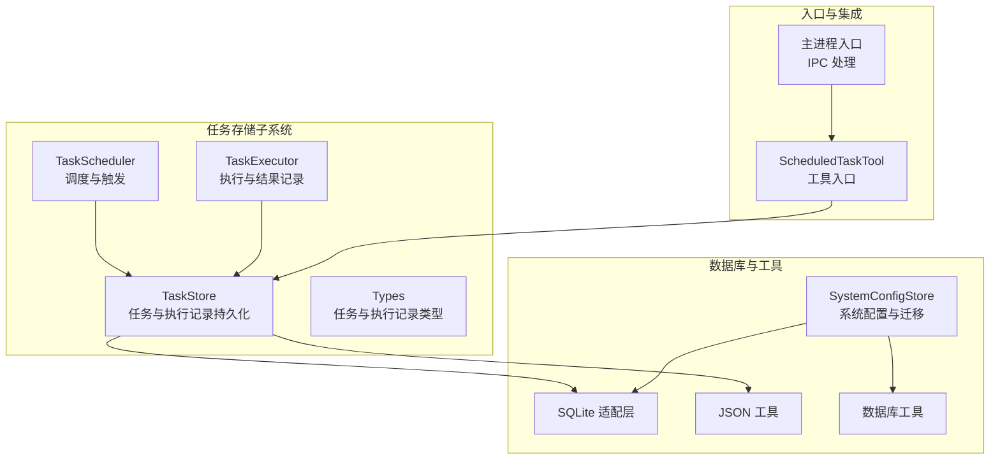
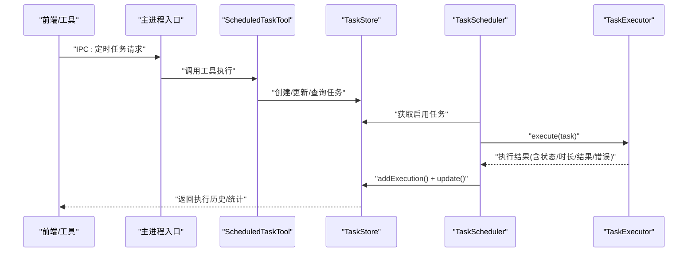
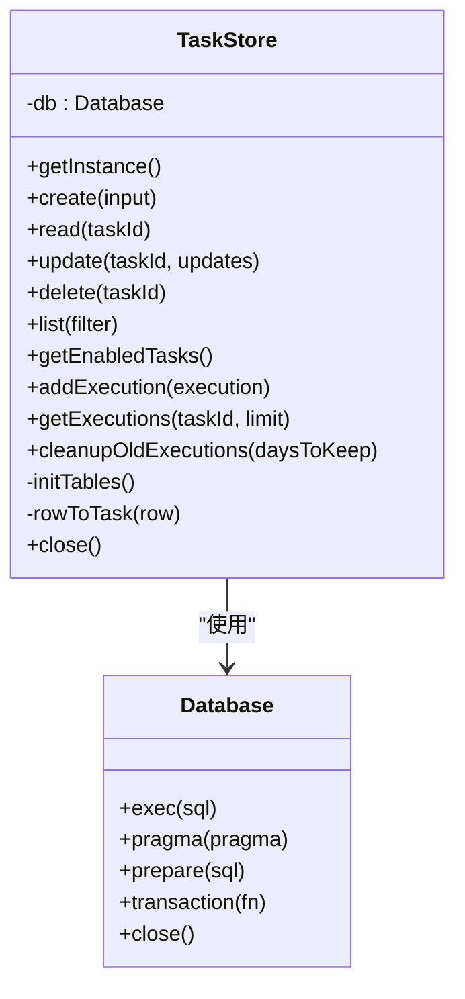
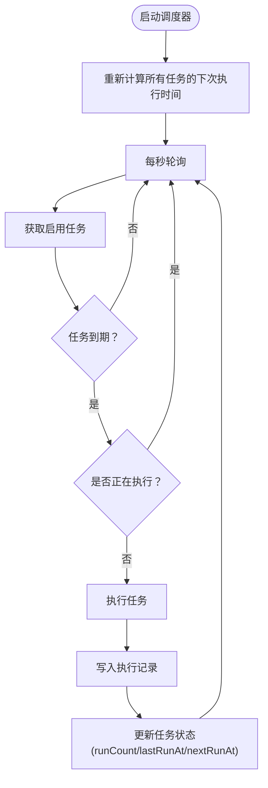
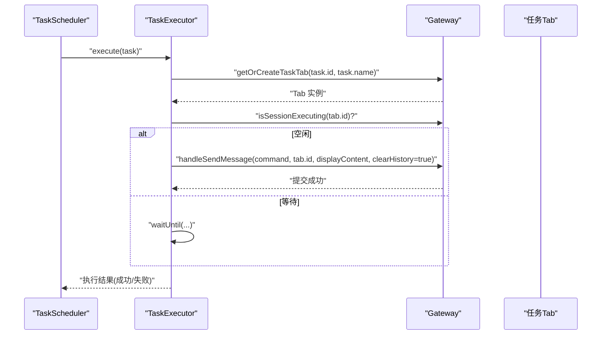
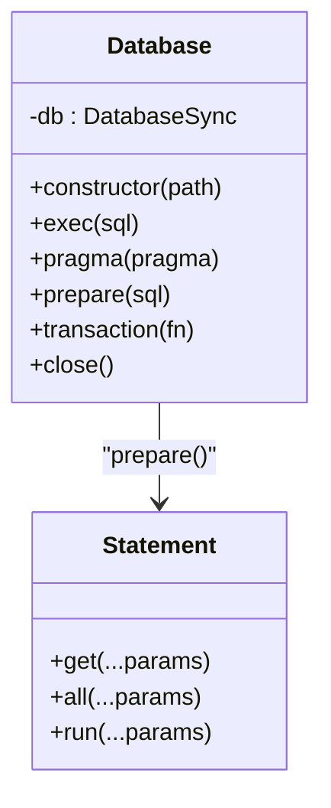
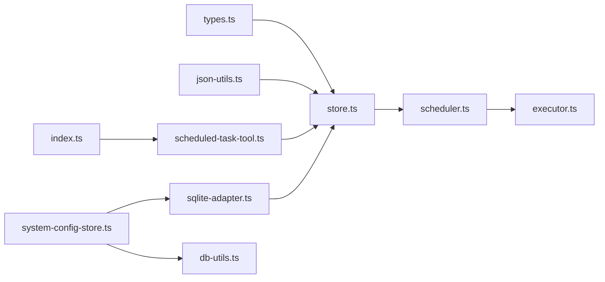
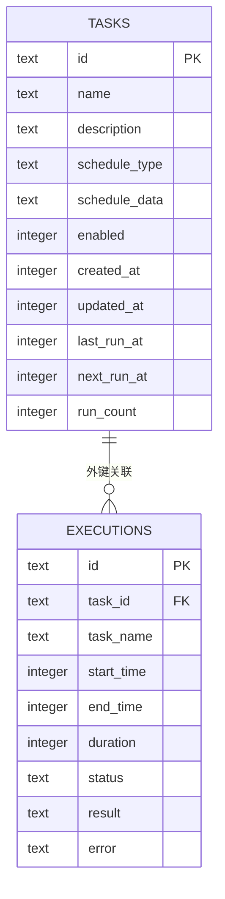

# 任务存储管理

<cite>
**本文档引用的文件**
- [src/main/scheduled-tasks/store.ts](file://src/main/scheduled-tasks/store.ts)
- [src/main/scheduled-tasks/types.ts](file://src/main/scheduled-tasks/types.ts)
- [src/main/scheduled-tasks/executor.ts](file://src/main/scheduled-tasks/executor.ts)
- [src/main/scheduled-tasks/scheduler.ts](file://src/main/scheduled-tasks/scheduler.ts)
- [src/shared/utils/sqlite-adapter.ts](file://src/shared/utils/sqlite-adapter.ts)
- [src/shared/utils/json-utils.ts](file://src/shared/utils/json-utils.ts)
- [src/shared/utils/db-utils.ts](file://src/shared/utils/db-utils.ts)
- [src/main/database/system-config-store.ts](file://src/main/database/system-config-store.ts)
- [src/main/database/model-config.ts](file://src/main/database/model-config.ts)
- [src/main/database/connector-config.ts](file://src/main/database/connector-config.ts)
- [src/main/tools/scheduled-task-tool.ts](file://src/main/tools/scheduled-task-tool.ts)
- [src/main/index.ts](file://src/main/index.ts)
</cite>

## 目录
1. [简介](#简介)
2. [项目结构](#项目结构)
3. [核心组件](#核心组件)
4. [架构总览](#架构总览)
5. [详细组件分析](#详细组件分析)
6. [依赖关系分析](#依赖关系分析)
7. [性能考量](#性能考量)
8. [故障排查指南](#故障排查指南)
9. [结论](#结论)
10. [附录](#附录)

## 简介
本文件面向 史丽慧小助理 任务存储管理系统，聚焦定时任务的持久化存储、数据库设计与查询优化、任务配置的序列化与反序列化、数据一致性与并发控制、备份恢复与迁移升级、以及性能优化与容量管理等主题。通过对任务存储、调度器、执行器、SQLite 适配层及系统配置存储的深入分析，帮助读者全面理解任务数据的生命周期与可靠性保障。

## 项目结构
任务存储相关的核心位于以下模块：
- 定时任务存储与调度：src/main/scheduled-tasks/*
- SQLite 适配层：src/shared/utils/sqlite-adapter.ts
- JSON 工具与数据库工具：src/shared/utils/json-utils.ts、src/shared/utils/db-utils.ts
- 系统配置存储（含迁移与索引）：src/main/database/system-config-store.ts、model-config.ts、connector-config.ts
- 任务工具入口：src/main/tools/scheduled-task-tool.ts
- 主进程入口与 IPC：src/main/index.ts

**图表来源**
- [src/main/scheduled-tasks/store.ts:23-363](file://src/main/scheduled-tasks/store.ts#L23-L363)
- [src/main/scheduled-tasks/scheduler.ts:12-322](file://src/main/scheduled-tasks/scheduler.ts#L12-L322)
- [src/main/scheduled-tasks/executor.ts:17-170](file://src/main/scheduled-tasks/executor.ts#L17-L170)
- [src/shared/utils/sqlite-adapter.ts:14-101](file://src/shared/utils/sqlite-adapter.ts#L14-L101)
- [src/shared/utils/json-utils.ts:19-53](file://src/shared/utils/json-utils.ts#L19-L53)
- [src/shared/utils/db-utils.ts:21-137](file://src/shared/utils/db-utils.ts#L21-L137)
- [src/main/database/system-config-store.ts:37-566](file://src/main/database/system-config-store.ts#L37-L566)
- [src/main/tools/scheduled-task-tool.ts:149-494](file://src/main/tools/scheduled-task-tool.ts#L149-L494)
- [src/main/index.ts:381-421](file://src/main/index.ts#L381-L421)

**章节来源**
- [src/main/scheduled-tasks/store.ts:1-364](file://src/main/scheduled-tasks/store.ts#L1-L364)
- [src/main/scheduled-tasks/types.ts:1-86](file://src/main/scheduled-tasks/types.ts#L1-L86)
- [src/shared/utils/sqlite-adapter.ts:1-102](file://src/shared/utils/sqlite-adapter.ts#L1-L102)
- [src/main/database/system-config-store.ts:1-576](file://src/main/database/system-config-store.ts#L1-L576)

## 核心组件
- 任务存储 TaskStore：负责任务与执行记录的创建、读取、更新、删除、列表查询、执行历史查询与旧记录清理；采用 SQLite WAL 模式，内置索引以优化查询。
- 任务调度器 TaskScheduler：按秒轮询检查到期任务，支持一次性、周期性与 Cron 调度类型，维护执行中集合防止并发重复执行，并在执行完成后更新任务状态。
- 任务执行器 TaskExecutor：在专用 Tab 中执行任务，记录执行时长、状态、结果或错误，并通过 Gateway 与前端交互。
- SQLite 适配层：提供与 better-sqlite3 兼容的 API，支持事务、PRAGMA、prepare/run 等，兼容 node:sqlite。
- JSON 工具：提供安全的 JSON 解析与序列化，避免异常导致的崩溃。
- 系统配置存储 SystemConfigStore：集中管理多类配置（模型、工具、连接器、名称、工作目录等），内置迁移逻辑与索引，支持 WAL 模式。

**章节来源**
- [src/main/scheduled-tasks/store.ts:23-363](file://src/main/scheduled-tasks/store.ts#L23-L363)
- [src/main/scheduled-tasks/scheduler.ts:12-322](file://src/main/scheduled-tasks/scheduler.ts#L12-L322)
- [src/main/scheduled-tasks/executor.ts:17-170](file://src/main/scheduled-tasks/executor.ts#L17-L170)
- [src/shared/utils/sqlite-adapter.ts:14-101](file://src/shared/utils/sqlite-adapter.ts#L14-L101)
- [src/shared/utils/json-utils.ts:19-53](file://src/shared/utils/json-utils.ts#L19-L53)
- [src/main/database/system-config-store.ts:37-566](file://src/main/database/system-config-store.ts#L37-L566)

## 架构总览
任务存储管理的整体流程如下：
- 任务创建：通过 ScheduledTaskTool 或前端入口发起，经 IPC 到主进程，最终由 TaskStore 写入 tasks 表。
- 调度执行：TaskScheduler 每秒扫描 enabled 且 next_run_at 到期的任务，调用 TaskExecutor 执行。
- 执行记录：TaskExecutor 返回执行结果，TaskScheduler 写入 executions 表并更新任务 run_count、last_run_at、next_run_at。
- 查询与清理：支持按条件筛选任务、按任务查询执行历史、定期清理旧执行记录。
- 存储一致性：SQLite WAL 模式 + 事务封装，配合 PRAGMA checkpoint 确保落盘；JSON 字符串安全解析/序列化。

**图表来源**
- [src/main/index.ts:381-421](file://src/main/index.ts#L381-L421)
- [src/main/tools/scheduled-task-tool.ts:149-494](file://src/main/tools/scheduled-task-tool.ts#L149-L494)
- [src/main/scheduled-tasks/store.ts:133-241](file://src/main/scheduled-tasks/store.ts#L133-L241)
- [src/main/scheduled-tasks/scheduler.ts:131-240](file://src/main/scheduled-tasks/scheduler.ts#L131-L240)
- [src/main/scheduled-tasks/executor.ts:21-79](file://src/main/scheduled-tasks/executor.ts#L21-L79)

## 详细组件分析

### 任务存储 TaskStore
- 数据库初始化：根据运行模式（Docker/普通）确定数据库路径，确保目录存在；若检测到孤立的 -shm/-wal 文件则清理；开启 WAL 模式。
- 表结构与索引：
  - tasks：主任务表，包含调度类型、调度数据（JSON）、启用状态、时间戳、运行计数等。
  - executions：执行记录表，外键关联 tasks，包含执行时长、状态、结果、错误等。
  - 索引：tasks.enabled、tasks.next_run_at、executions.task_id。
- 序列化与反序列化：schedule 字段以 JSON 字符串存储，读取时通过安全解析函数恢复为对象；执行记录的 result/error 以可空文本存储。
- 并发与一致性：通过 SQLite WAL 模式提升并发读写性能；关键写入路径使用事务封装（见适配层）。
- 查询优化：按 enabled 与 next_run_at 索引快速筛选到期任务；按 task_id 索引查询执行历史。
- 生命周期管理：提供清理旧执行记录接口，按时间阈值删除过期记录。

**图表来源**
- [src/main/scheduled-tasks/store.ts:23-363](file://src/main/scheduled-tasks/store.ts#L23-L363)
- [src/shared/utils/sqlite-adapter.ts:14-101](file://src/shared/utils/sqlite-adapter.ts#L14-L101)

**章节来源**
- [src/main/scheduled-tasks/store.ts:23-363](file://src/main/scheduled-tasks/store.ts#L23-L363)

### 任务调度器 TaskScheduler
- 启动与轮询：每秒检查一次到期任务，支持暂停/恢复/手动触发。
- 并发控制：维护执行中任务集合，避免同一任务并发执行。
- 执行流程：执行前再次确认任务存在且启用；执行后写入执行记录并更新任务状态（runCount、lastRunAt、nextRunAt）；达到最大执行次数或一次性任务完成后自动禁用。
- 调度算法：支持 once、interval、cron 三种类型，interval 最小间隔保护，cron 使用第三方库计算下次执行时间。

**图表来源**
- [src/main/scheduled-tasks/scheduler.ts:29-240](file://src/main/scheduled-tasks/scheduler.ts#L29-L240)

**章节来源**
- [src/main/scheduled-tasks/scheduler.ts:12-322](file://src/main/scheduled-tasks/scheduler.ts#L12-L322)

### 任务执行器 TaskExecutor
- 执行环境：通过 Gateway 获取或创建任务专属 Tab，等待 Tab 空闲后发送任务命令，避免并发冲突。
- 结果记录：捕获执行结果与错误，记录开始/结束时间、时长与状态，返回标准化的执行记录对象。
- 命令构建：为 AI 明确“定时任务执行”语义，避免歧义与重复创建。

**图表来源**
- [src/main/scheduled-tasks/executor.ts:86-153](file://src/main/scheduled-tasks/executor.ts#L86-L153)

**章节来源**
- [src/main/scheduled-tasks/executor.ts:17-170](file://src/main/scheduled-tasks/executor.ts#L17-L170)

### SQLite 适配层与事务
- 兼容 API：提供 exec、pragma、prepare、transaction、close 等方法，兼容 better-sqlite3 使用习惯。
- 事务封装：手动实现 BEGIN/COMMIT/ROLLBACK，确保多语句原子性。
- WAL 模式：通过 PRAGMA journal_mode=WAL 提升并发读写能力；必要时可触发 checkpoint。

**图表来源**
- [src/shared/utils/sqlite-adapter.ts:14-101](file://src/shared/utils/sqlite-adapter.ts#L14-L101)

**章节来源**
- [src/shared/utils/sqlite-adapter.ts:14-101](file://src/shared/utils/sqlite-adapter.ts#L14-L101)

### JSON 序列化与反序列化
- 安全解析：safeJsonParse 在解析失败时返回默认值，避免异常传播。
- 安全序列化：safeJsonStringify 支持格式化输出与默认值回退。
- 使用场景：任务调度配置、连接器配置等以 JSON 字符串存储，读取时安全解析。

**章节来源**
- [src/shared/utils/json-utils.ts:19-53](file://src/shared/utils/json-utils.ts#L19-L53)
- [src/main/database/connector-config.ts:13-60](file://src/main/database/connector-config.ts#L13-L60)

### 系统配置存储与迁移
- 多表结构：环境配置、工作目录、模型配置、工具配置、连接器配置、名称配置、Tab 配置、Pairing 记录等。
- 迁移策略：启动时检查缺失字段并增量添加，保证向后兼容；对新增字段进行默认值填充。
- 索引优化：为常用查询建立索引（如 pairing_code、connector_id+user_id）。
- 模型配置缓存：内存缓存避免重复查询与日志打印，变更后主动清除缓存。

**章节来源**
- [src/main/database/system-config-store.ts:82-225](file://src/main/database/system-config-store.ts#L82-L225)
- [src/main/database/system-config-store.ts:227-315](file://src/main/database/system-config-store.ts#L227-L315)
- [src/main/database/model-config.ts:60-95](file://src/main/database/model-config.ts#L60-L95)
- [src/main/database/model-config.ts:100-134](file://src/main/database/model-config.ts#L100-L134)

## 依赖关系分析
- TaskStore 依赖 SQLite 适配层与 JSON 工具；TaskScheduler/TaskExecutor 依赖 TaskStore。
- ScheduledTaskTool 通过 IPC 与主进程交互，间接驱动任务存储与调度。
- SystemConfigStore 独立管理多类配置，提供迁移与索引，服务于系统整体配置。

**图表来源**
- [src/main/scheduled-tasks/types.ts:1-86](file://src/main/scheduled-tasks/types.ts#L1-L86)
- [src/main/scheduled-tasks/store.ts:7-21](file://src/main/scheduled-tasks/store.ts#L7-L21)
- [src/main/scheduled-tasks/scheduler.ts:7-24](file://src/main/scheduled-tasks/scheduler.ts#L7-L24)
- [src/main/scheduled-tasks/executor.ts:7-15](file://src/main/scheduled-tasks/executor.ts#L7-L15)
- [src/main/index.ts:381-421](file://src/main/index.ts#L381-L421)
- [src/main/tools/scheduled-task-tool.ts:149-494](file://src/main/tools/scheduled-task-tool.ts#L149-L494)
- [src/main/database/system-config-store.ts:11-32](file://src/main/database/system-config-store.ts#L11-L32)

**章节来源**
- [src/main/scheduled-tasks/store.ts:7-21](file://src/main/scheduled-tasks/store.ts#L7-L21)
- [src/main/scheduled-tasks/scheduler.ts:7-24](file://src/main/scheduled-tasks/scheduler.ts#L7-L24)
- [src/main/scheduled-tasks/executor.ts:7-15](file://src/main/scheduled-tasks/executor.ts#L7-L15)
- [src/main/index.ts:381-421](file://src/main/index.ts#L381-L421)
- [src/main/tools/scheduled-task-tool.ts:149-494](file://src/main/tools/scheduled-task-tool.ts#L149-L494)
- [src/main/database/system-config-store.ts:11-32](file://src/main/database/system-config-store.ts#L11-L32)

## 性能考量
- 存储模式：WAL 模式显著提升并发读写吞吐，适合高频读写场景。
- 索引策略：tasks.enabled、tasks.next_run_at、executions.task_id 三处索引覆盖常见查询路径。
- 事务优化：关键写入使用事务封装，减少频繁提交带来的开销。
- 查询限制：执行历史查询默认限制数量，避免一次性返回过多数据。
- 缓存策略：模型配置内存缓存减少重复查询与日志输出。
- I/O 落盘：模型配置保存后显式触发 WAL checkpoint，确保数据尽快落盘。

**章节来源**
- [src/main/scheduled-tasks/store.ts:69-127](file://src/main/scheduled-tasks/store.ts#L69-L127)
- [src/main/database/model-config.ts:121-122](file://src/main/database/model-config.ts#L121-L122)
- [src/main/database/model-config.ts:145-146](file://src/main/database/model-config.ts#L145-L146)

## 故障排查指南
- 数据库文件异常：
  - 现象：启动时报错或数据不一致。
  - 处理：TaskStore 在启动时检测并清理孤立的 -shm/-wal 文件；确认目录权限与磁盘空间充足。
- 任务未执行或重复执行：
  - 现象：任务到期未触发或并发执行。
  - 处理：检查 TaskScheduler 的执行中集合与 next_run_at 计算；确认任务处于 enabled 状态。
- 执行记录缺失：
  - 现象：执行完成后未看到记录。
  - 处理：确认 TaskScheduler 在执行完成后调用 addExecution；检查 executions 表写入是否成功。
- JSON 解析失败：
  - 现象：读取任务/配置时出现异常。
  - 处理：使用 safeJsonParse 提供默认值；检查存储的 JSON 字符串格式。
- 迁移失败：
  - 现象：新增字段未生效或报错。
  - 处理：查看 SystemConfigStore 的迁移日志；确认数据库权限与表结构存在性。

**章节来源**
- [src/main/scheduled-tasks/store.ts:40-65](file://src/main/scheduled-tasks/store.ts#L40-L65)
- [src/main/scheduled-tasks/scheduler.ts:156-240](file://src/main/scheduled-tasks/scheduler.ts#L156-L240)
- [src/shared/utils/json-utils.ts:19-29](file://src/shared/utils/json-utils.ts#L19-L29)
- [src/main/database/system-config-store.ts:227-315](file://src/main/database/system-config-store.ts#L227-L315)

## 结论
史丽慧小助理 的任务存储管理以 SQLite 为核心，结合 WAL 模式、事务封装与索引策略，实现了高可靠、高性能的任务持久化与调度执行。通过安全的 JSON 序列化、完善的迁移机制与缓存策略，系统在功能扩展与数据一致性之间取得了良好平衡。建议在生产环境中定期清理旧执行记录、监控 WAL 文件状态，并在升级时关注迁移日志，确保平滑演进。

## 附录

### 数据模型与索引

**图表来源**
- [src/main/scheduled-tasks/store.ts:90-120](file://src/main/scheduled-tasks/store.ts#L90-L120)

### 备份与恢复建议
- 备份策略：定期复制 SQLite 数据库文件（含 -wal/-shm 文件），或导出关键表数据。
- 恢复流程：停止服务 → 替换数据库文件 → 启动服务 → 校验任务与执行记录完整性。
- 验证方法：通过 ScheduledTaskTool 查询任务与执行历史，核对时间戳与状态。

**章节来源**
- [src/main/scheduled-tasks/store.ts:27-73](file://src/main/scheduled-tasks/store.ts#L27-L73)
- [src/main/tools/scheduled-task-tool.ts:436-462](file://src/main/tools/scheduled-task-tool.ts#L436-L462)

### 迁移与版本兼容
- 迁移机制：SystemConfigStore 在启动时检查并为缺失字段添加默认值，保证向后兼容。
- 版本演进：通过 PRAGMA table_info 检查字段存在性，避免重复迁移与错误。
- 建议：在重大结构变更前，先在测试环境验证迁移脚本，再灰度发布。

**章节来源**
- [src/main/database/system-config-store.ts:227-315](file://src/main/database/system-config-store.ts#L227-L315)