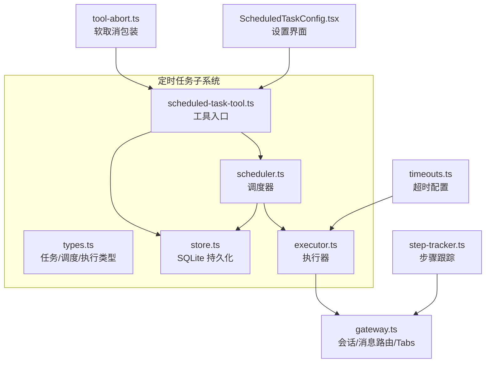
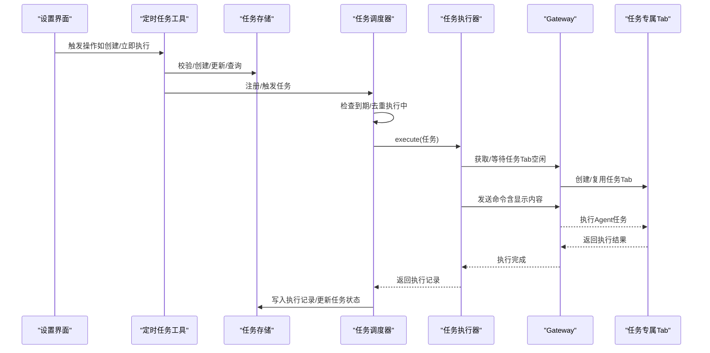
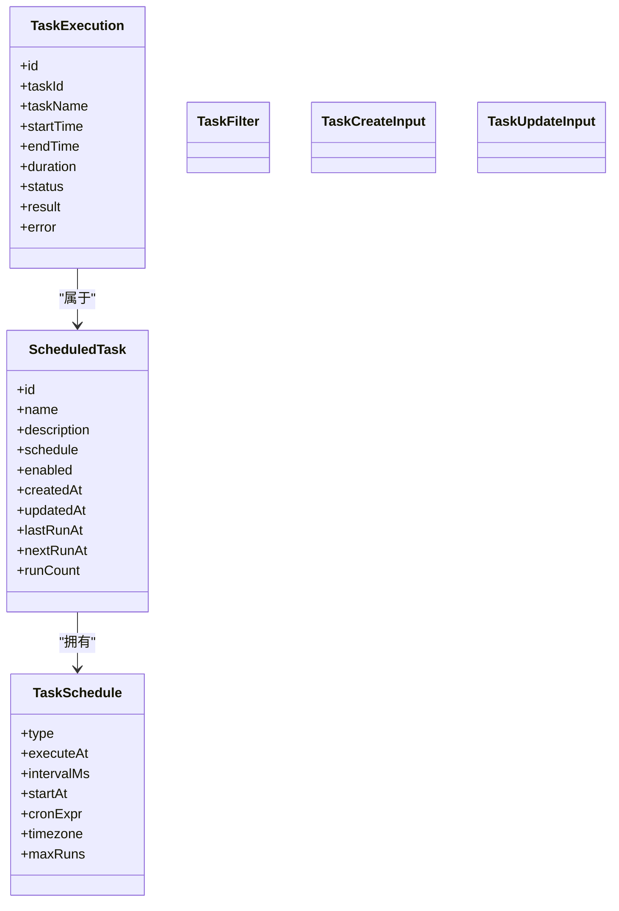
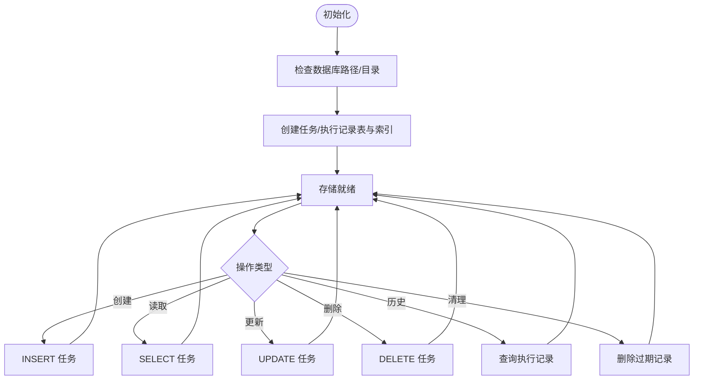
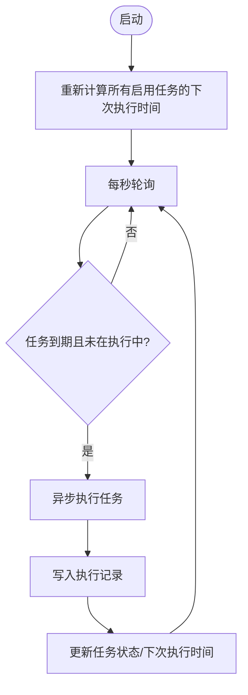
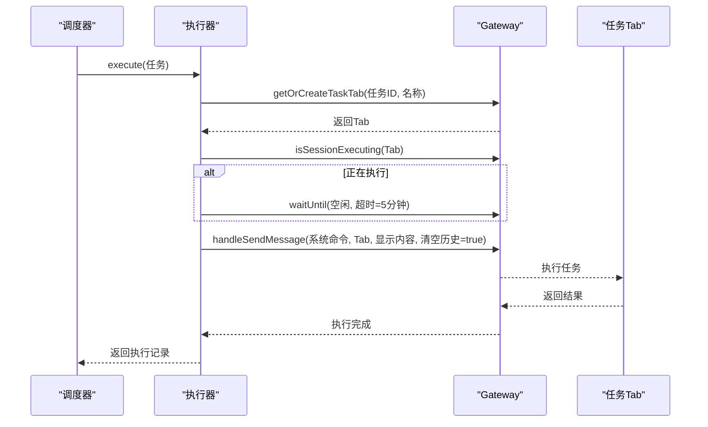
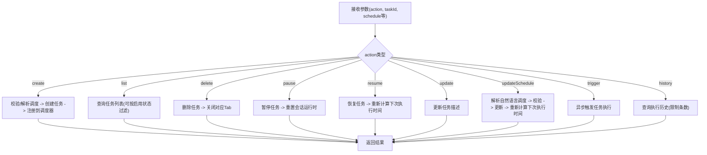
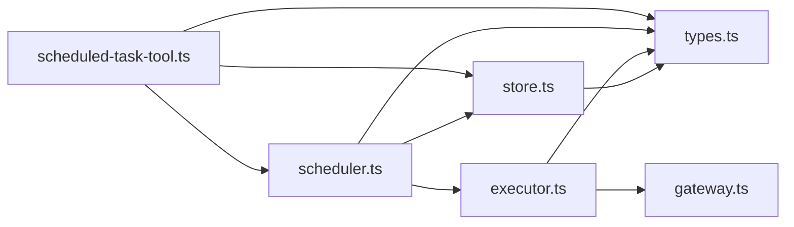

# 任务执行引擎

<cite>
**本文引用的文件**
- [src/main/scheduled-tasks/executor.ts](file://src/main/scheduled-tasks/executor.ts)
- [src/main/scheduled-tasks/scheduler.ts](file://src/main/scheduled-tasks/scheduler.ts)
- [src/main/scheduled-tasks/store.ts](file://src/main/scheduled-tasks/store.ts)
- [src/main/scheduled-tasks/types.ts](file://src/main/scheduled-tasks/types.ts)
- [src/main/scheduled-tasks/index.ts](file://src/main/scheduled-tasks/index.ts)
- [src/main/tools/scheduled-task-tool.ts](file://src/main/tools/scheduled-task-tool.ts)
- [src/main/gateway.ts](file://src/main/gateway.ts)
- [src/main/config/timeouts.ts](file://src/main/config/timeouts.ts)
- [src/main/tools/tool-abort.ts](file://src/main/tools/tool-abort.ts)
- [src/main/agent-runtime/step-tracker.ts](file://src/main/agent-runtime/step-tracker.ts)
- [src/renderer/components/settings/ScheduledTaskConfig.tsx](file://src/renderer/components/settings/ScheduledTaskConfig.tsx)
</cite>

## 目录
1. [简介](#简介)
2. [项目结构](#项目结构)
3. [核心组件](#核心组件)
4. [架构总览](#架构总览)
5. [详细组件分析](#详细组件分析)
6. [依赖关系分析](#依赖关系分析)
7. [性能考量](#性能考量)
8. [故障排查指南](#故障排查指南)
9. [结论](#结论)
10. [附录](#附录)

## 简介
本文件为 DeepBot 任务执行引擎的全面技术文档，聚焦“定时任务”的生命周期管理、并发控制、资源管理、队列与调度、超时与取消、安全与权限控制、配置与监控、以及日志与调试。引擎采用“工具 + 调度器 + 存储 + 执行器”的分层设计，结合专用 Tab 执行与 Gateway 消息路由，实现稳定可靠的自动化任务执行。

## 项目结构
与任务执行引擎直接相关的模块分布如下：
- scheduled-tasks：任务定义、调度器、执行器、存储
- tools：定时任务工具入口，负责参数校验、调度文本解析、与调度器交互
- gateway：会话与消息路由中枢，提供任务专属 Tab、会话状态管理
- config：超时配置与软取消机制
- agent-runtime：步骤跟踪与计划管理（用于任务执行过程的状态可视化）
- renderer：定时任务配置界面（UI 展示与操作）

**图表来源**
- [src/main/scheduled-tasks/types.ts:1-86](file://src/main/scheduled-tasks/types.ts#L1-L86)
- [src/main/scheduled-tasks/store.ts:1-364](file://src/main/scheduled-tasks/store.ts#L1-L364)
- [src/main/scheduled-tasks/scheduler.ts:1-322](file://src/main/scheduled-tasks/scheduler.ts#L1-L322)
- [src/main/scheduled-tasks/executor.ts:1-170](file://src/main/scheduled-tasks/executor.ts#L1-L170)
- [src/main/tools/scheduled-task-tool.ts:1-628](file://src/main/tools/scheduled-task-tool.ts#L1-L628)
- [src/main/gateway.ts:1-200](file://src/main/gateway.ts#L1-L200)
- [src/main/config/timeouts.ts:1-78](file://src/main/config/timeouts.ts#L1-L78)
- [src/main/tools/tool-abort.ts:47-144](file://src/main/tools/tool-abort.ts#L47-L144)
- [src/main/agent-runtime/step-tracker.ts:1-65](file://src/main/agent-runtime/step-tracker.ts#L1-L65)
- [src/renderer/components/settings/ScheduledTaskConfig.tsx:299-336](file://src/renderer/components/settings/ScheduledTaskConfig.tsx#L299-L336)

**章节来源**
- [src/main/scheduled-tasks/index.ts:1-9](file://src/main/scheduled-tasks/index.ts#L1-L9)
- [src/main/scheduled-tasks/types.ts:1-86](file://src/main/scheduled-tasks/types.ts#L1-L86)
- [src/main/scheduled-tasks/store.ts:1-364](file://src/main/scheduled-tasks/store.ts#L1-L364)
- [src/main/scheduled-tasks/scheduler.ts:1-322](file://src/main/scheduled-tasks/scheduler.ts#L1-L322)
- [src/main/scheduled-tasks/executor.ts:1-170](file://src/main/scheduled-tasks/executor.ts#L1-L170)
- [src/main/tools/scheduled-task-tool.ts:1-628](file://src/main/tools/scheduled-task-tool.ts#L1-L628)
- [src/main/gateway.ts:1-200](file://src/main/gateway.ts#L1-L200)
- [src/main/config/timeouts.ts:1-78](file://src/main/config/timeouts.ts#L1-L78)
- [src/main/tools/tool-abort.ts:47-144](file://src/main/tools/tool-abort.ts#L47-L144)
- [src/main/agent-runtime/step-tracker.ts:1-65](file://src/main/agent-runtime/step-tracker.ts#L1-L65)
- [src/renderer/components/settings/ScheduledTaskConfig.tsx:299-336](file://src/renderer/components/settings/ScheduledTaskConfig.tsx#L299-L336)

## 核心组件
- 类型与接口：定义任务、调度、执行记录的数据结构与过滤器，统一跨模块契约。
- 存储层：基于 SQLite 的任务与执行记录持久化，支持索引优化与 WAL 模式，具备清理旧记录能力。
- 调度器：按秒轮询检查到期任务，去重执行中任务，支持一次性、周期性、Cron 三种调度类型，并自动处理最大执行次数与任务禁用。
- 执行器：在专用 Tab 中执行任务，等待窗口空闲、构建命令、发送消息到 Gateway，记录成功/失败与耗时。
- 工具入口：对外暴露 create/list/delete/pause/resume/trigger/history 等操作，内置调度文本解析与参数校验，限制最大任务数。
- Gateway：提供任务专属 Tab、会话状态管理、消息路由；定时任务工具通过它与 AgentRuntime 交互。
- 超时与取消：全局超时配置与软取消（AbortSignal）机制，工具可选择响应取消以保证可中断性。
- 步骤跟踪：任务执行步骤的计划与状态跟踪，便于 UI 展示与调试。
- UI：设置界面提供任务启停、立即执行、删除等操作入口。

**章节来源**
- [src/main/scheduled-tasks/types.ts:1-86](file://src/main/scheduled-tasks/types.ts#L1-L86)
- [src/main/scheduled-tasks/store.ts:1-364](file://src/main/scheduled-tasks/store.ts#L1-L364)
- [src/main/scheduled-tasks/scheduler.ts:1-322](file://src/main/scheduled-tasks/scheduler.ts#L1-L322)
- [src/main/scheduled-tasks/executor.ts:1-170](file://src/main/scheduled-tasks/executor.ts#L1-L170)
- [src/main/tools/scheduled-task-tool.ts:1-628](file://src/main/tools/scheduled-task-tool.ts#L1-L628)
- [src/main/gateway.ts:1-200](file://src/main/gateway.ts#L1-L200)
- [src/main/config/timeouts.ts:1-78](file://src/main/config/timeouts.ts#L1-L78)
- [src/main/tools/tool-abort.ts:47-144](file://src/main/tools/tool-abort.ts#L47-L144)
- [src/main/agent-runtime/step-tracker.ts:1-65](file://src/main/agent-runtime/step-tracker.ts#L1-L65)
- [src/renderer/components/settings/ScheduledTaskConfig.tsx:299-336](file://src/renderer/components/settings/ScheduledTaskConfig.tsx#L299-L336)

## 架构总览
定时任务从“工具入口”接收请求，经过参数校验与调度解析，写入存储并交由调度器按规则触发执行器。执行器通过 Gateway 在专用 Tab 中执行任务，记录执行结果与耗时，调度器据此更新任务状态与下次执行时间。

**图表来源**
- [src/main/tools/scheduled-task-tool.ts:171-494](file://src/main/tools/scheduled-task-tool.ts#L171-L494)
- [src/main/scheduled-tasks/store.ts:133-297](file://src/main/scheduled-tasks/store.ts#L133-L297)
- [src/main/scheduled-tasks/scheduler.ts:131-240](file://src/main/scheduled-tasks/scheduler.ts#L131-L240)
- [src/main/scheduled-tasks/executor.ts:21-153](file://src/main/scheduled-tasks/executor.ts#L21-L153)
- [src/main/gateway.ts:1-200](file://src/main/gateway.ts#L1-L200)

## 详细组件分析

### 类型与数据模型
- 调度配置：支持 once、interval、cron 三类，包含时间戳、间隔、开始时间、Cron 表达式与时区、最大执行次数。
- 任务实体：包含标识、名称、描述、调度、启用状态、时间戳与执行计数。
- 执行记录：包含任务关联、起止时间、耗时、状态、结果或错误信息。
- 过滤器与输入：用于列表、创建、更新等场景的参数约束。

**图表来源**
- [src/main/scheduled-tasks/types.ts:8-85](file://src/main/scheduled-tasks/types.ts#L8-L85)

**章节来源**
- [src/main/scheduled-tasks/types.ts:1-86](file://src/main/scheduled-tasks/types.ts#L1-L86)

### 存储层（SQLite）
- 单例模式，自动初始化任务表与执行记录表，创建索引提升查询效率。
- 支持任务 CRUD、启用任务列表、执行历史查询、清理旧记录。
- Docker 模式下自动定位数据库目录，避免孤儿 WAL/SHM 文件影响。

**图表来源**
- [src/main/scheduled-tasks/store.ts:27-128](file://src/main/scheduled-tasks/store.ts#L27-L128)
- [src/main/scheduled-tasks/store.ts:133-337](file://src/main/scheduled-tasks/store.ts#L133-L337)

**章节来源**
- [src/main/scheduled-tasks/store.ts:1-364](file://src/main/scheduled-tasks/store.ts#L1-L364)

### 调度器（按秒轮询）
- 启动后计算所有启用任务的下次执行时间，随后每秒轮询。
- 去重执行中任务集合，避免并发重复执行。
- 支持一次性、周期性（含最小间隔保护）、Cron 三种调度类型；自动处理最大执行次数与任务禁用。
- 执行完成后写入执行记录并更新任务状态（最后执行时间、下次执行时间、执行计数）。

**图表来源**
- [src/main/scheduled-tasks/scheduler.ts:29-45](file://src/main/scheduled-tasks/scheduler.ts#L29-L45)
- [src/main/scheduled-tasks/scheduler.ts:131-151](file://src/main/scheduled-tasks/scheduler.ts#L131-L151)
- [src/main/scheduled-tasks/scheduler.ts:156-240](file://src/main/scheduled-tasks/scheduler.ts#L156-L240)
- [src/main/scheduled-tasks/scheduler.ts:245-302](file://src/main/scheduled-tasks/scheduler.ts#L245-L302)

**章节来源**
- [src/main/scheduled-tasks/scheduler.ts:1-322](file://src/main/scheduled-tasks/scheduler.ts#L1-L322)

### 执行器（专用 Tab 执行）
- 生成执行 ID 与时间戳，记录开始/结束与耗时。
- 通过 Gateway 获取或创建任务专属 Tab，等待窗口空闲（最长等待 5 分钟）。
- 构建“定时任务”系统前缀命令，避免 AI 将其理解为周期性任务；向 Tab 发送命令并清空历史消息以避免干扰。
- 成功/失败均返回标准化执行记录，包含状态、结果或错误信息。

**图表来源**
- [src/main/scheduled-tasks/executor.ts:21-153](file://src/main/scheduled-tasks/executor.ts#L21-L153)
- [src/main/gateway.ts:1-200](file://src/main/gateway.ts#L1-L200)

**章节来源**
- [src/main/scheduled-tasks/executor.ts:1-170](file://src/main/scheduled-tasks/executor.ts#L1-L170)

### 工具入口（定时任务工具）
- 对外提供 create/list/delete/pause/resume/trigger/history 等操作。
- 参数校验与调度文本解析（支持“每隔X秒/分钟/小时”、“每天X点”、“Cron表达式”等自然语言描述）。
- 限制最大任务数（默认 10），手动触发异步执行，历史查询支持限制条数。
- 通过 Gateway 实例管理任务 Tab（暂停时重置会话运行时，删除时关闭 Tab）。

**图表来源**
- [src/main/tools/scheduled-task-tool.ts:171-494](file://src/main/tools/scheduled-task-tool.ts#L171-L494)

**章节来源**
- [src/main/tools/scheduled-task-tool.ts:1-628](file://src/main/tools/scheduled-task-tool.ts#L1-L628)

### Gateway 与会话管理
- 作为消息路由中枢，维护多个 AgentRuntime 实例（每个 Tab 一个）。
- 提供任务专属 Tab 的获取/创建、会话执行状态查询、会话重置与关闭等能力。
- 定时任务工具通过 Gateway 与 AgentRuntime 交互，确保任务在独立会话中执行。

**章节来源**
- [src/main/gateway.ts:1-200](file://src/main/gateway.ts#L1-L200)

### 超时与取消机制
- 全局超时配置集中管理，主 Agent 消息超时较长以支持长任务，浏览器、HTTP、搜索等均有明确超时。
- 软取消（AbortSignal）：工具可选择响应取消以保证可中断性；工具包装器支持合并多个取消信号。
- 执行器内部等待窗口空闲设置了固定超时（5 分钟），避免长时间阻塞。

**章节来源**
- [src/main/config/timeouts.ts:1-78](file://src/main/config/timeouts.ts#L1-L78)
- [src/main/tools/tool-abort.ts:47-144](file://src/main/tools/tool-abort.ts#L47-L144)
- [src/main/scheduled-tasks/executor.ts:108-126](file://src/main/scheduled-tasks/executor.ts#L108-L126)

### 步骤跟踪与 UI
- 步骤跟踪器支持创建计划、跟踪步骤状态、重试次数与完成检测，便于任务执行过程可视化。
- 设置界面提供任务启停、立即执行、删除等操作按钮，展示任务 ID 便于调试。

**章节来源**
- [src/main/agent-runtime/step-tracker.ts:1-65](file://src/main/agent-runtime/step-tracker.ts#L1-L65)
- [src/renderer/components/settings/ScheduledTaskConfig.tsx:299-336](file://src/renderer/components/settings/ScheduledTaskConfig.tsx#L299-L336)

## 依赖关系分析
- 模块内聚：调度器与执行器通过接口耦合，执行器依赖 Gateway；工具入口聚合调度器与存储。
- 外部依赖：Cron 解析、SQLite、Node FS、IPC 通道等。
- 循环依赖：未见循环导入；类型定义位于独立文件，避免循环引用。

**图表来源**
- [src/main/tools/scheduled-task-tool.ts:1-628](file://src/main/tools/scheduled-task-tool.ts#L1-L628)
- [src/main/scheduled-tasks/scheduler.ts:1-322](file://src/main/scheduled-tasks/scheduler.ts#L1-L322)
- [src/main/scheduled-tasks/store.ts:1-364](file://src/main/scheduled-tasks/store.ts#L1-L364)
- [src/main/scheduled-tasks/executor.ts:1-170](file://src/main/scheduled-tasks/executor.ts#L1-L170)
- [src/main/scheduled-tasks/types.ts:1-86](file://src/main/scheduled-tasks/types.ts#L1-L86)
- [src/main/gateway.ts:1-200](file://src/main/gateway.ts#L1-L200)

**章节来源**
- [src/main/scheduled-tasks/index.ts:1-9](file://src/main/scheduled-tasks/index.ts#L1-L9)

## 性能考量
- 轮询频率：调度器每秒轮询，兼顾实时性与 CPU 开销；最小间隔保护避免过于频繁的周期任务。
- 并发控制：执行中任务集合去重，避免重复触发；等待窗口空闲采用固定超时，防止无限等待。
- 存储优化：WAL 模式与索引（启用状态、下次执行时间、任务 ID）提升查询性能；定期清理执行记录降低表膨胀。
- 超时与取消：软取消与超时配置确保长时间任务可中断，减少资源占用。
- UI 与会话：专用 Tab 避免任务间相互干扰，提高稳定性。

[本节为通用性能建议，无需特定文件引用]

## 故障排查指南
- 调度器未启动：检查工具入口是否正确设置 Gateway 并延时启动调度器；查看重试日志与最终失败静默处理。
- 任务未执行：确认任务启用状态、下次执行时间、是否处于执行中集合；检查调度器轮询与到期判断。
- 执行卡住：关注执行器等待窗口空闲的超时（5 分钟）；检查目标 Tab 是否被外部关闭或异常。
- 执行失败：查看执行记录中的错误信息；核对调度配置（Cron 表达式、最小间隔）。
- 存储异常：Docker 模式下注意 DB 目录与权限；留意孤立 WAL/SHM 文件清理。
- UI 操作无效：确认任务 ID、Tab 是否存在；暂停/删除/恢复操作会触发 Gateway 的会话重置/关闭。

**章节来源**
- [src/main/tools/scheduled-task-tool.ts:56-86](file://src/main/tools/scheduled-task-tool.ts#L56-L86)
- [src/main/scheduled-tasks/scheduler.ts:131-151](file://src/main/scheduled-tasks/scheduler.ts#L131-L151)
- [src/main/scheduled-tasks/executor.ts:97-129](file://src/main/scheduled-tasks/executor.ts#L97-L129)
- [src/main/scheduled-tasks/store.ts:40-65](file://src/main/scheduled-tasks/store.ts#L40-L65)
- [src/main/gateway.ts:1-200](file://src/main/gateway.ts#L1-L200)

## 结论
DeepBot 任务执行引擎通过清晰的分层设计与完善的生命周期管理，实现了稳定、可观测、可扩展的定时任务系统。调度器的秒级轮询与去重机制、执行器的专用 Tab 执行与超时控制、存储的持久化与索引优化，共同构成了高可靠的任务执行链路。配合软取消与超时配置、步骤跟踪与 UI 操作，满足日常自动化任务的管理与运维需求。

[本节为总结性内容，无需特定文件引用]

## 附录

### 配置项与行为
- 最大任务数：默认 10，超过上限将拒绝创建新任务。
- 最小调度间隔：周期性任务最小间隔保护为 10 秒。
- Cron 表达式：支持 5/6 段格式与时区配置。
- 执行记录清理：可按天数清理过期记录，默认 30 天。
- 超时配置：主 Agent 消息超时较长，浏览器、HTTP、搜索等有明确超时；工具可结合软取消实现可中断执行。

**章节来源**
- [src/main/tools/scheduled-task-tool.ts:51-51](file://src/main/tools/scheduled-task-tool.ts#L51-L51)
- [src/main/tools/scheduled-task-tool.ts:504-538](file://src/main/tools/scheduled-task-tool.ts#L504-L538)
- [src/main/scheduled-tasks/store.ts:328-337](file://src/main/scheduled-tasks/store.ts#L328-L337)
- [src/main/config/timeouts.ts:1-78](file://src/main/config/timeouts.ts#L1-L78)

### 日志与调试
- 执行器与调度器均输出结构化日志，包含任务名、ID、开始/结束时间、耗时、状态与错误信息。
- UI 展示任务 ID 便于问题定位；步骤跟踪器提供执行步骤可视化。
- 建议在开发/测试环境中开启更详细的日志级别，结合执行记录与日志进行问题复盘。

**章节来源**
- [src/main/scheduled-tasks/executor.ts:26-78](file://src/main/scheduled-tasks/executor.ts#L26-L78)
- [src/main/scheduled-tasks/scheduler.ts:146-234](file://src/main/scheduled-tasks/scheduler.ts#L146-L234)
- [src/renderer/components/settings/ScheduledTaskConfig.tsx:330-332](file://src/renderer/components/settings/ScheduledTaskConfig.tsx#L330-L332)
- [src/main/agent-runtime/step-tracker.ts:48-65](file://src/main/agent-runtime/step-tracker.ts#L48-L65)