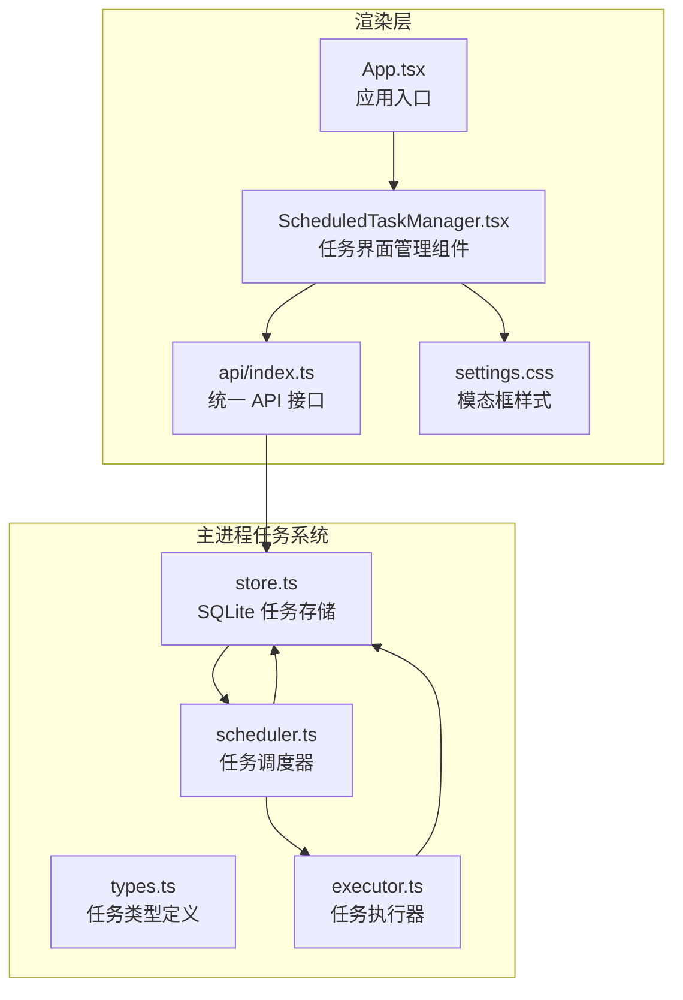
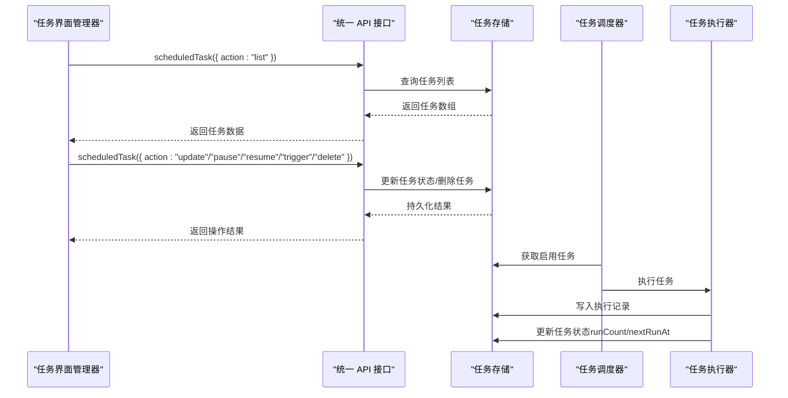
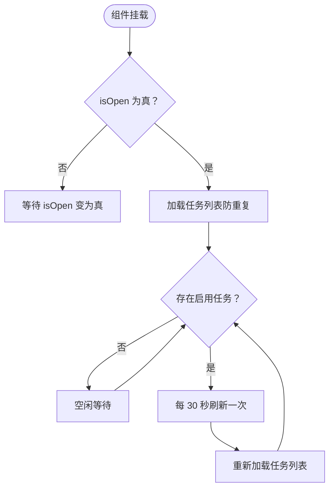
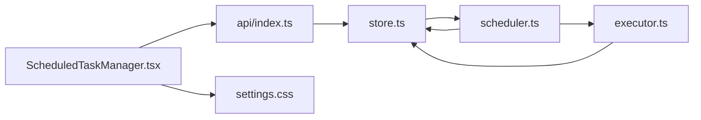

# 任务界面管理

<cite>
**本文档引用的文件**
- [ScheduledTaskManager.tsx](file://src/renderer/components/ScheduledTaskManager.tsx)
- [types.ts](file://src/main/scheduled-tasks/types.ts)
- [store.ts](file://src/main/scheduled-tasks/store.ts)
- [scheduler.ts](file://src/main/scheduled-tasks/scheduler.ts)
- [executor.ts](file://src/main/scheduled-tasks/executor.ts)
- [index.ts](file://src/main/scheduled-tasks/index.ts)
- [api/index.ts](file://src/renderer/api/index.ts)
- [settings.css](file://src/renderer/styles/settings.css)
- [App.tsx](file://src/renderer/App.tsx)
</cite>

## 目录
1. [简介](#简介)
2. [项目结构](#项目结构)
3. [核心组件](#核心组件)
4. [架构总览](#架构总览)
5. [详细组件分析](#详细组件分析)
6. [依赖关系分析](#依赖关系分析)
7. [性能考量](#性能考量)
8. [故障排除指南](#故障排除指南)
9. [结论](#结论)
10. [附录](#附录)

## 简介
本文件为 史丽慧小助理 任务界面管理组件的全面技术文档，聚焦于 React 组件的设计架构、状态管理与用户交互逻辑。文档围绕定时任务管理器组件展开，详细说明任务列表渲染机制、编辑模式切换、表单验证流程、生命周期管理、事件处理与异步数据加载策略；同时覆盖响应式设计、主题适配与无障碍支持，提供 Props 接口、事件回调与样式定制说明，并总结用户体验优化、性能提升与错误处理的最佳实践。最后给出扩展组件功能与集成新调度类型的指导。

## 项目结构
任务界面管理涉及渲染层组件与主进程任务系统两大层面：
- 渲染层组件：负责 UI 呈现、用户交互与状态管理
- 主进程任务系统：负责任务持久化、调度与执行

**图表来源**
- [ScheduledTaskManager.tsx:1-571](file://src/renderer/components/ScheduledTaskManager.tsx#L1-L571)
- [api/index.ts:232-235](file://src/renderer/api/index.ts#L232-L235)
- [settings.css:1-621](file://src/renderer/styles/settings.css#L1-L621)
- [App.tsx:722-726](file://src/renderer/App.tsx#L722-L726)
- [types.ts:1-86](file://src/main/scheduled-tasks/types.ts#L1-L86)
- [store.ts:1-364](file://src/main/scheduled-tasks/store.ts#L1-L364)
- [scheduler.ts:1-322](file://src/main/scheduled-tasks/scheduler.ts#L1-L322)
- [executor.ts:1-170](file://src/main/scheduled-tasks/executor.ts#L1-L170)

**章节来源**
- [ScheduledTaskManager.tsx:1-571](file://src/renderer/components/ScheduledTaskManager.tsx#L1-L571)
- [api/index.ts:232-235](file://src/renderer/api/index.ts#L232-L235)
- [settings.css:1-621](file://src/renderer/styles/settings.css#L1-L621)
- [App.tsx:722-726](file://src/renderer/App.tsx#L722-L726)
- [types.ts:1-86](file://src/main/scheduled-tasks/types.ts#L1-L86)
- [store.ts:1-364](file://src/main/scheduled-tasks/store.ts#L1-L364)
- [scheduler.ts:1-322](file://src/main/scheduled-tasks/scheduler.ts#L1-L322)
- [executor.ts:1-170](file://src/main/scheduled-tasks/executor.ts#L1-L170)

## 核心组件
- 任务界面管理器（ScheduledTaskManager）：提供定时任务的查看、编辑、暂停/恢复、立即执行与删除能力，支持自然语言描述的调度方式编辑与校验。
- 统一 API 接口（api/index.ts）：封装 IPC/Web 请求，暴露 scheduledTask 动作接口，屏蔽运行环境差异。
- 任务类型定义（types.ts）：定义任务、调度配置、执行记录与过滤器等核心数据结构。
- 任务存储（store.ts）：基于 SQLite 的持久化存储，提供任务 CRUD、执行记录与索引管理。
- 任务调度器（scheduler.ts）：负责任务到期检测、并发控制、执行计数与下次执行时间计算。
- 任务执行器（executor.ts）：在专用 Tab 中执行任务，处理等待窗口空闲、构建执行命令与记录执行结果。

**章节来源**
- [ScheduledTaskManager.tsx:1-571](file://src/renderer/components/ScheduledTaskManager.tsx#L1-L571)
- [api/index.ts:232-235](file://src/renderer/api/index.ts#L232-L235)
- [types.ts:1-86](file://src/main/scheduled-tasks/types.ts#L1-L86)
- [store.ts:1-364](file://src/main/scheduled-tasks/store.ts#L1-L364)
- [scheduler.ts:1-322](file://src/main/scheduled-tasks/scheduler.ts#L1-L322)
- [executor.ts:1-170](file://src/main/scheduled-tasks/executor.ts#L1-L170)

## 架构总览
渲染层组件通过统一 API 接口调用主进程任务系统，实现任务的增删改查与调度控制。调度器周期性检查到期任务并交由执行器执行，执行器在专用 Tab 中执行任务并将结果写回存储。

**图表来源**
- [ScheduledTaskManager.tsx:51-66](file://src/renderer/components/ScheduledTaskManager.tsx#L51-L66)
- [api/index.ts:232-235](file://src/renderer/api/index.ts#L232-L235)
- [store.ts:246-266](file://src/main/scheduled-tasks/store.ts#L246-L266)
- [scheduler.ts:137-151](file://src/main/scheduled-tasks/scheduler.ts#L137-L151)
- [executor.ts:21-79](file://src/main/scheduled-tasks/executor.ts#L21-L79)

## 详细组件分析

### 任务界面管理器（ScheduledTaskManager）
- 设计目标：提供直观的任务管理界面，支持任务内容与调度方式的在线编辑，以及暂停/恢复、立即执行与删除等操作。
- 状态管理：
  - 任务列表状态：维护渲染所需的任务数组
  - 加载状态：指示数据加载中
  - 编辑状态：分别跟踪“编辑任务内容”和“编辑调度方式”的上下文
  - 防重复加载：通过 useRef 标记避免严格模式下的重复初始化
- 生命周期：
  - 打开时加载：isOpen 为真时加载任务列表，使用 hasLoadedRef 防止重复加载
  - 定时刷新：仅在存在启用任务时每 30 秒刷新一次，降低资源消耗
- 用户交互：
  - 编辑任务内容：进入编辑模式，支持保存与取消
  - 编辑调度方式：以自然语言形式编辑，保存时调用 updateSchedule 动作
  - 暂停/恢复：根据当前状态切换
  - 立即执行：触发一次执行而不改变计划
  - 删除任务：二次确认后删除
- 数据格式化：
  - 调度信息格式化：将内部调度配置转为人类可读文本
  - 时间格式化：格式化时间戳为本地化字符串
  - 下次执行倒计时：计算并展示相对时间
- 样式与主题：
  - 使用 settings.css 提供统一的模态框样式与终端风格
  - 支持浅色/深色主题变量切换
- 无障碍与响应式：
  - 使用语义化标签与清晰的视觉层次
  - 响应式布局适配不同屏幕尺寸

**图表来源**
- [ScheduledTaskManager.tsx:240-272](file://src/renderer/components/ScheduledTaskManager.tsx#L240-L272)

**章节来源**
- [ScheduledTaskManager.tsx:1-571](file://src/renderer/components/ScheduledTaskManager.tsx#L1-L571)
- [settings.css:1-621](file://src/renderer/styles/settings.css#L1-L621)

### 统一 API 接口（api/index.ts）
- 功能：根据运行环境自动选择 IPC 或 HTTP 调用，封装 scheduledTask 动作请求，屏蔽平台差异。
- 关键动作：
  - list：获取任务列表
  - update：更新任务内容
  - updateSchedule：更新调度方式（自然语言）
  - pause/resume：暂停/恢复任务
  - trigger：立即执行任务
  - delete：删除任务

**章节来源**
- [api/index.ts:232-235](file://src/renderer/api/index.ts#L232-L235)

### 任务类型定义（types.ts）
- 任务调度配置（TaskSchedule）：支持一次性（executeAt）、周期性（intervalMs/startAt）与 Cron（cronExpr/timezone）三种类型，并支持最大执行次数（maxRuns）。
- 任务实体（ScheduledTask）：包含任务标识、名称、描述、调度配置、启用状态、时间戳与执行计数。
- 执行记录（TaskExecution）：记录每次执行的起止时间、时长、状态与结果/错误。
- 过滤器与输入：支持按启用状态与调度类型过滤，以及创建/更新输入结构。

**章节来源**
- [types.ts:1-86](file://src/main/scheduled-tasks/types.ts#L1-L86)

### 任务存储（store.ts）
- 数据库：使用 SQLite，表结构包含任务与执行记录，带索引优化查询。
- 核心方法：
  - create：创建任务并持久化
  - read/update/delete：读取、更新与删除任务
  - list/getEnabledTasks：按条件列出任务
  - addExecution/getExecutions：新增与查询执行记录
  - cleanupOldExecutions：清理旧执行记录
- 初始化与清理：启动时初始化表与索引，处理孤立 WAL/SHM 文件。

**章节来源**
- [store.ts:1-364](file://src/main/scheduled-tasks/store.ts#L1-L364)

### 任务调度器（scheduler.ts）
- 启动与停止：启动定时检查，每秒检查一次到期任务。
- 任务管理：
  - addTask/deleteTask：添加/删除任务并更新下次执行时间
  - pauseTask/resumeTask：暂停/恢复任务并重置计数
  - triggerTask：手动触发任务执行
- 执行控制：
  - 并发控制：使用 Set 标记正在执行的任务，避免重复执行
  - 执行后状态更新：更新执行次数、下次执行时间，处理最大执行次数与一次性任务
  - 计算下次执行：支持一次性、周期性与 Cron，确保最小间隔约束
- 重新计算：启动时为所有启用任务重新计算下次执行时间。

**章节来源**
- [scheduler.ts:1-322](file://src/main/scheduled-tasks/scheduler.ts#L1-L322)

### 任务执行器（executor.ts）
- 执行流程：在专用 Tab 中执行任务，等待窗口空闲，构建执行命令并发送消息。
- 等待机制：使用等待工具等待窗口空闲，超时抛错。
- 结果记录：捕获异常并记录执行结果与错误，生成执行记录。
- 命令构建：为 AI 提供明确的系统提示，避免误解为创建定时任务。

**章节来源**
- [executor.ts:1-170](file://src/main/scheduled-tasks/executor.ts#L1-L170)

### 应用集成（App.tsx）
- 状态管理：在应用层维护 Tabs、活动 Tab、消息与加载状态，并通过事件监听器同步更新。
- 任务管理器集成：通过状态开关渲染 ScheduledTaskManager，并传入 isOpen 与 onClose 回调。
- 事件监听：监听消息流、执行步骤与错误事件，实时更新消息与加载状态。

**章节来源**
- [App.tsx:722-726](file://src/renderer/App.tsx#L722-L726)

## 依赖关系分析
组件间依赖关系如下：

**图表来源**
- [ScheduledTaskManager.tsx:12-15](file://src/renderer/components/ScheduledTaskManager.tsx#L12-L15)
- [api/index.ts:232-235](file://src/renderer/api/index.ts#L232-L235)
- [store.ts:1-364](file://src/main/scheduled-tasks/store.ts#L1-L364)
- [scheduler.ts:1-322](file://src/main/scheduled-tasks/scheduler.ts#L1-L322)
- [executor.ts:1-170](file://src/main/scheduled-tasks/executor.ts#L1-L170)

**章节来源**
- [index.ts:1-9](file://src/main/scheduled-tasks/index.ts#L1-L9)

## 性能考量
- 渲染层优化
  - 防重复初始化：通过 useRef 标记避免严格模式下的重复加载
  - 条件刷新：仅在存在启用任务时进行定时刷新，降低轮询频率
  - 事件批量更新：使用 requestAnimationFrame 批量更新消息，减少重渲染
- 主进程优化
  - 索引优化：对启用状态与下次执行时间建立索引，加速查询
  - 并发控制：调度器使用 Set 标记正在执行的任务，避免重复执行
  - 最小间隔约束：周期性任务最小间隔为 10 秒，防止过于频繁的执行
- 异步与错误处理
  - 统一的错误提示与回退逻辑，避免阻塞 UI
  - 执行超时处理：等待窗口空闲设置超时，避免长时间阻塞

[本节为通用性能建议，无需特定文件引用]

## 故障排除指南
- 任务列表为空
  - 检查 isOpen 状态与 hasLoadedRef 标记，确认已触发加载
  - 查看网络请求与 API 返回，确认 scheduledTask 动作正常
- 编辑保存失败
  - 确认输入非空并通过前端校验
  - 查看 API 返回的错误信息，确认主进程存储更新成功
- 暂停/恢复无效
  - 检查任务状态字段与调度器状态，确认已正确更新
- 立即执行未生效
  - 确认触发动作已调用，检查调度器是否正确处理
- 删除任务后仍可见
  - 检查刷新逻辑与定时器，确认列表已重新加载
- 执行超时
  - 检查窗口空闲等待逻辑与超时阈值，必要时增加等待时间或优化执行流程

**章节来源**
- [ScheduledTaskManager.tsx:51-66](file://src/renderer/components/ScheduledTaskManager.tsx#L51-L66)
- [api/index.ts:232-235](file://src/renderer/api/index.ts#L232-L235)
- [store.ts:189-230](file://src/main/scheduled-tasks/store.ts#L189-L230)
- [scheduler.ts:137-151](file://src/main/scheduled-tasks/scheduler.ts#L137-L151)
- [executor.ts:108-129](file://src/main/scheduled-tasks/executor.ts#L108-L129)

## 结论
任务界面管理组件通过清晰的职责分离与完善的生命周期管理，实现了高效、稳定的定时任务管理体验。渲染层组件专注于用户交互与状态呈现，主进程任务系统提供可靠的持久化、调度与执行能力。结合响应式设计与主题适配，组件在不同环境下均能提供一致的用户体验。通过合理的性能优化与错误处理策略，系统具备良好的可维护性与扩展性。

[本节为总结性内容，无需特定文件引用]

## 附录

### Props 接口与事件回调
- ScheduledTaskManager Props
  - isOpen: boolean
  - onClose: () => void
- 事件回调
  - onOpenScheduledTaskManager: () => void（由 App.tsx 触发）
  - onClose: () => void（由组件自身触发）

**章节来源**
- [ScheduledTaskManager.tsx:36-39](file://src/renderer/components/ScheduledTaskManager.tsx#L36-L39)
- [App.tsx:706-707](file://src/renderer/App.tsx#L706-L707)

### 样式定制与主题适配
- 主题变量：通过 CSS 变量定义深色/浅色主题的颜色体系
- 统一样式：模态框容器、标题栏、按钮、输入框与卡片等元素采用统一风格
- 响应式适配：宽度与高度限制，保证在不同设备上的可用性

**章节来源**
- [settings.css:1-621](file://src/renderer/styles/settings.css#L1-L621)

### 扩展与集成指南
- 新增调度类型
  - 在 types.ts 中扩展 TaskSchedule 类型定义
  - 在 scheduler.ts 中扩展 calculateNextRun 与执行逻辑
  - 在 ScheduledTaskManager 中扩展调度编辑与格式化逻辑
- 新增任务动作
  - 在 api/index.ts 中新增 scheduledTask 动作
  - 在 store.ts 中实现相应存储逻辑
  - 在 scheduler.ts 与 executor.ts 中完善调度与执行流程
- UI 扩展
  - 在 ScheduledTaskManager 中新增编辑/显示区域
  - 在 settings.css 中补充样式类名

**章节来源**
- [types.ts:8-24](file://src/main/scheduled-tasks/types.ts#L8-L24)
- [scheduler.ts:245-302](file://src/main/scheduled-tasks/scheduler.ts#L245-L302)
- [store.ts:133-168](file://src/main/scheduled-tasks/store.ts#L133-L168)
- [api/index.ts:232-235](file://src/renderer/api/index.ts#L232-L235)