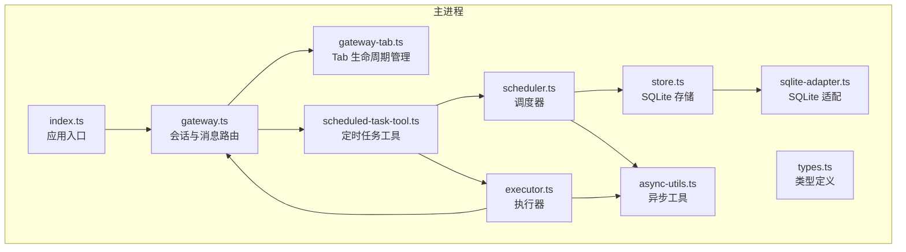
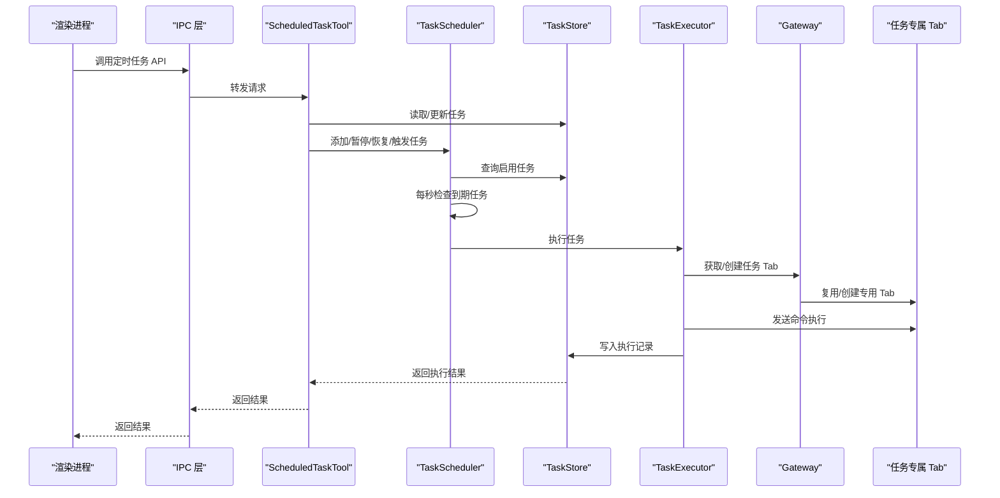
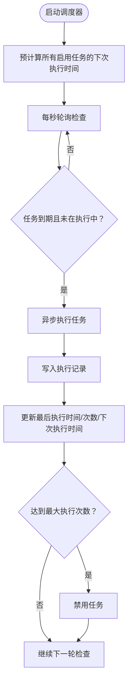
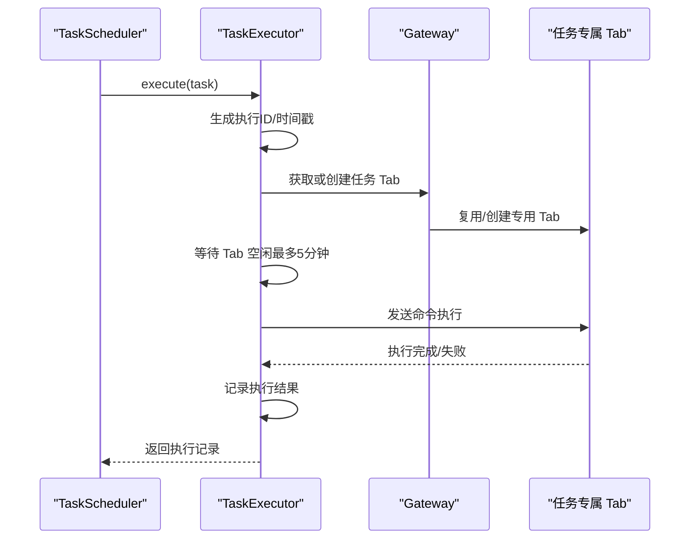
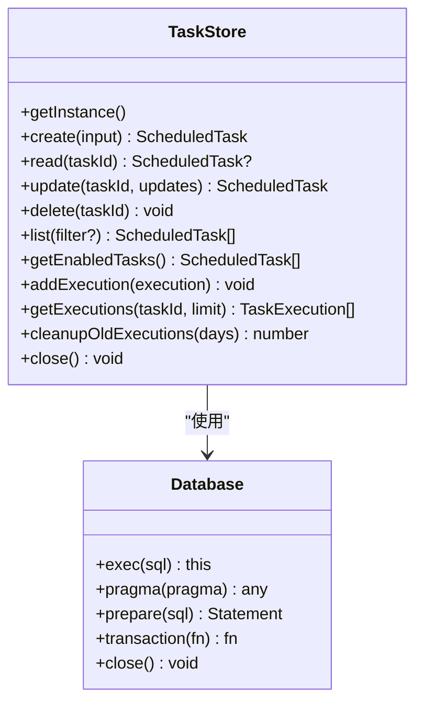
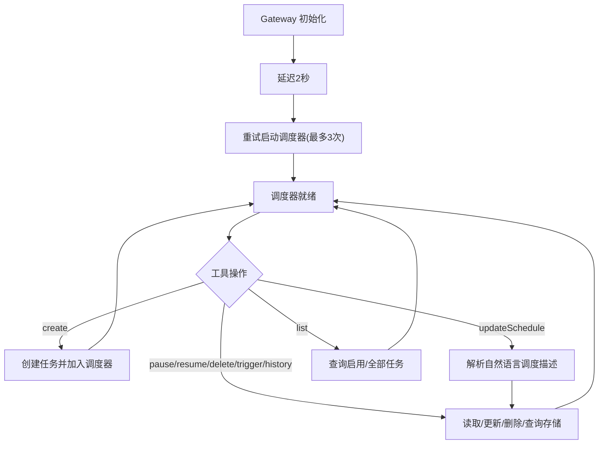
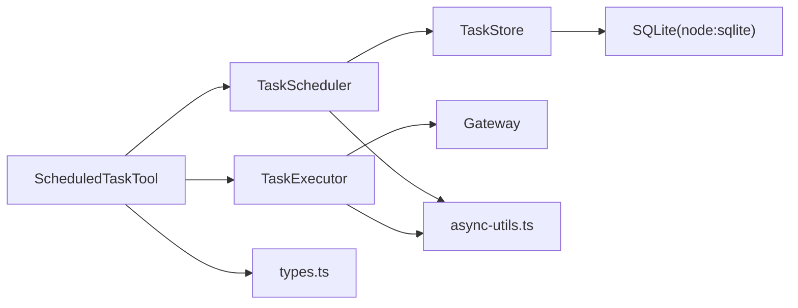

# 任务调度引擎

<cite>
**本文引用的文件**
- [index.ts](file://src/main/index.ts)
- [gateway.ts](file://src/main/gateway.ts)
- [gateway-tab.ts](file://src/main/gateway-tab.ts)
- [scheduled-task-tool.ts](file://src/main/tools/scheduled-task-tool.ts)
- [scheduler.ts](file://src/main/scheduled-tasks/scheduler.ts)
- [executor.ts](file://src/main/scheduled-tasks/executor.ts)
- [store.ts](file://src/main/scheduled-tasks/store.ts)
- [types.ts](file://src/main/scheduled-tasks/types.ts)
- [sqlite-adapter.ts](file://src/shared/utils/sqlite-adapter.ts)
- [async-utils.ts](file://src/shared/utils/async-utils.ts)
</cite>

## 目录
1. [简介](#简介)
2. [项目结构](#项目结构)
3. [核心组件](#核心组件)
4. [架构总览](#架构总览)
5. [详细组件分析](#详细组件分析)
6. [依赖关系分析](#依赖关系分析)
7. [性能与精度](#性能与精度)
8. [故障排查指南](#故障排查指南)
9. [结论](#结论)
10. [附录](#附录)

## 简介
本技术文档面向 DeepBot 任务调度引擎，系统性阐述其架构设计、核心算法与实现细节，重点覆盖：
- Cron 表达式解析与时间计算
- 时间精度与调度循环机制
- 任务队列与并发控制
- 任务类型（一次性、间隔执行、Cron 表达式）的调度逻辑与生命周期
- 启动、停止与重启流程，以及与主进程的通信机制
- 调度精度、性能优化与内存管理策略
- 配置参数、日志记录与错误处理

## 项目结构
调度系统位于主进程模块中，围绕“工具-调度器-执行器-存储”四层展开，并通过 Gateway 与渲染进程进行 IPC 交互。

图表来源
- [index.ts:307-331](file://src/main/index.ts#L307-L331)
- [gateway.ts:100-123](file://src/main/gateway.ts#L100-L123)
- [scheduled-task-tool.ts:56-86](file://src/main/tools/scheduled-task-tool.ts#L56-L86)
- [scheduler.ts:21-24](file://src/main/scheduled-tasks/scheduler.ts#L21-L24)
- [executor.ts:13-15](file://src/main/scheduled-tasks/executor.ts#L13-L15)
- [store.ts:27-83](file://src/main/scheduled-tasks/store.ts#L27-L83)
- [sqlite-adapter.ts:14-70](file://src/shared/utils/sqlite-adapter.ts#L14-L70)
- [async-utils.ts:102-135](file://src/shared/utils/async-utils.ts#L102-L135)

章节来源
- [index.ts:307-331](file://src/main/index.ts#L307-L331)
- [gateway.ts:100-123](file://src/main/gateway.ts#L100-L123)
- [scheduled-task-tool.ts:56-86](file://src/main/tools/scheduled-task-tool.ts#L56-L86)

## 核心组件
- 调度器（TaskScheduler）：负责每秒轮询检查到期任务，触发执行并更新任务状态。
- 执行器（TaskExecutor）：在专用 Tab 中执行任务，封装执行生命周期与结果记录。
- 存储（TaskStore）：基于 SQLite 的持久化存储，维护任务元数据与执行历史。
- 工具（ScheduledTaskTool）：对外暴露的 Agent 工具接口，负责参数校验、调度解析与生命周期管理。
- 类型（types.ts）：统一的任务与调度数据结构定义。
- 适配层（sqlite-adapter.ts）：对 node:sqlite 的兼容封装。
- 异步工具（async-utils.ts）：提供重试、等待、批量执行等通用异步能力。

章节来源
- [scheduler.ts:12-24](file://src/main/scheduled-tasks/scheduler.ts#L12-L24)
- [executor.ts:17-79](file://src/main/scheduled-tasks/executor.ts#L17-L79)
- [store.ts:23-83](file://src/main/scheduled-tasks/store.ts#L23-L83)
- [scheduled-task-tool.ts:128-494](file://src/main/tools/scheduled-task-tool.ts#L128-L494)
- [types.ts:8-86](file://src/main/scheduled-tasks/types.ts#L8-L86)
- [sqlite-adapter.ts:14-70](file://src/shared/utils/sqlite-adapter.ts#L14-L70)
- [async-utils.ts:102-135](file://src/shared/utils/async-utils.ts#L102-L135)

## 架构总览
调度引擎采用“工具驱动 + 调度器 + 执行器 + 存储”的分层架构，通过 IPC 与主进程的 Gateway 协作，实现跨进程的任务执行与状态管理。

图表来源
- [index.ts:381-421](file://src/main/index.ts#L381-L421)
- [scheduled-task-tool.ts:171-494](file://src/main/tools/scheduled-task-tool.ts#L171-L494)
- [scheduler.ts:131-151](file://src/main/scheduled-tasks/scheduler.ts#L131-L151)
- [executor.ts:86-153](file://src/main/scheduled-tasks/executor.ts#L86-L153)
- [gateway-tab.ts:616-652](file://src/main/gateway-tab.ts#L616-L652)

## 详细组件分析

### 调度器（TaskScheduler）
- 启动与停止
  - 启动时预计算所有启用任务的下次执行时间，随后以 1 秒为间隔轮询检查。
  - 停止时清理定时器，保证资源回收。
- 任务检查与执行
  - 每秒遍历启用任务，若“下次执行时间 ≤ 当前时间”且任务未在执行中，则异步触发执行。
  - 使用 Set 标记正在执行的任务 ID，避免并发重复执行。
- 执行后状态更新
  - 成功执行后写入执行记录，按调度类型重新计算“下次执行时间”，并更新“最后执行时间”和“执行次数”。
  - 若达到最大执行次数，自动禁用任务；一次性任务在执行完成后自动禁用。
- 时间计算
  - once：仅在指定时间点执行一次。
  - interval：支持首次执行时间 startAt 与固定间隔 intervalMs，最小间隔为 10 秒。
  - cron：使用 cron 库解析表达式，支持时区配置。
- 重试与健壮性
  - 启动阶段通过重试工具进行三次重试，避免数据库初始化未完成导致的启动失败。
  - 执行前后均进行任务存在性与启用状态校验，防止并发删除导致的状态不一致。

图表来源
- [scheduler.ts:29-45](file://src/main/scheduled-tasks/scheduler.ts#L29-L45)
- [scheduler.ts:307-320](file://src/main/scheduled-tasks/scheduler.ts#L307-L320)
- [scheduler.ts:131-151](file://src/main/scheduled-tasks/scheduler.ts#L131-L151)
- [scheduler.ts:156-240](file://src/main/scheduled-tasks/scheduler.ts#L156-L240)
- [scheduler.ts:245-302](file://src/main/scheduled-tasks/scheduler.ts#L245-L302)

章节来源
- [scheduler.ts:29-62](file://src/main/scheduled-tasks/scheduler.ts#L29-L62)
- [scheduler.ts:131-151](file://src/main/scheduled-tasks/scheduler.ts#L131-L151)
- [scheduler.ts:156-240](file://src/main/scheduled-tasks/scheduler.ts#L156-L240)
- [scheduler.ts:245-302](file://src/main/scheduled-tasks/scheduler.ts#L245-L302)
- [scheduler.ts:307-320](file://src/main/scheduled-tasks/scheduler.ts#L307-L320)

### 执行器（TaskExecutor）
- 执行生命周期
  - 生成执行 ID 与时间戳，记录执行开始与结束。
  - 通过 Gateway 获取或创建任务专属 Tab，确保任务在独立会话中执行。
- 并发与等待
  - 若目标 Tab 正在执行，等待其空闲（最长 5 分钟），避免并发冲突。
  - 首次创建 Tab 后短暂延时，确保前端已收到 Tab 创建通知。
- 命令构建
  - 构造明确的系统提示，强调“定时任务的一次执行”，避免 AI 误解为周期性行为。
- 结果记录
  - 成功/失败均返回标准化执行记录，包含开始时间、结束时间、耗时、状态与结果或错误信息。

图表来源
- [executor.ts:21-79](file://src/main/scheduled-tasks/executor.ts#L21-L79)
- [executor.ts:86-153](file://src/main/scheduled-tasks/executor.ts#L86-L153)
- [gateway-tab.ts:616-652](file://src/main/gateway-tab.ts#L616-L652)

章节来源
- [executor.ts:17-79](file://src/main/scheduled-tasks/executor.ts#L17-L79)
- [executor.ts:86-153](file://src/main/scheduled-tasks/executor.ts#L86-L153)

### 存储（TaskStore）
- 数据库与表结构
  - 使用 node:sqlite 适配层，开启 WAL 模式提升并发性能。
  - 任务表与执行记录表，含索引以加速查询。
- 生命周期管理
  - 单例模式，延迟初始化，支持任务创建、读取、更新、删除、列表与过滤。
  - 执行历史写入与清理（按天数阈值清理旧记录）。
- 健壮性
  - 启动时检测并清理孤立的 -shm/-wal 文件，避免锁文件残留导致的初始化失败。

图表来源
- [store.ts:23-83](file://src/main/scheduled-tasks/store.ts#L23-L83)
- [store.ts:88-128](file://src/main/scheduled-tasks/store.ts#L88-L128)
- [store.ts:133-241](file://src/main/scheduled-tasks/store.ts#L133-L241)
- [sqlite-adapter.ts:14-70](file://src/shared/utils/sqlite-adapter.ts#L14-L70)

章节来源
- [store.ts:23-83](file://src/main/scheduled-tasks/store.ts#L23-L83)
- [store.ts:88-128](file://src/main/scheduled-tasks/store.ts#L88-L128)
- [store.ts:133-241](file://src/main/scheduled-tasks/store.ts#L133-L241)
- [sqlite-adapter.ts:14-70](file://src/shared/utils/sqlite-adapter.ts#L14-L70)

### 工具（ScheduledTaskTool）
- 生命周期与初始化
  - 在 Gateway 初始化完成后，延迟 2 秒并使用重试机制启动调度器，避免数据库未就绪。
  - 将 Gateway 实例传递给执行器，确保执行器可通过 Gateway 与 Tab 管理交互。
- 功能接口
  - create/list/update/updateSchedule/delete/pause/resume/trigger/history 等。
  - 支持自然语言解析调度描述，如“每隔10秒”、“每天早上9点”、“Cron表达式：0 9 * * *”。
- 限制与安全
  - 任务数量上限为 10。
  - 严格参数校验与错误处理，失败时返回可读错误信息。

图表来源
- [scheduled-task-tool.ts:56-86](file://src/main/tools/scheduled-task-tool.ts#L56-L86)
- [scheduled-task-tool.ts:171-494](file://src/main/tools/scheduled-task-tool.ts#L171-L494)
- [scheduled-task-tool.ts:540-615](file://src/main/tools/scheduled-task-tool.ts#L540-L615)

章节来源
- [scheduled-task-tool.ts:56-86](file://src/main/tools/scheduled-task-tool.ts#L56-L86)
- [scheduled-task-tool.ts:171-494](file://src/main/tools/scheduled-task-tool.ts#L171-L494)
- [scheduled-task-tool.ts:540-615](file://src/main/tools/scheduled-task-tool.ts#L540-L615)

### 类型与数据模型
- 调度配置（TaskSchedule）
  - once：executeAt（执行时间戳）
  - interval：intervalMs（间隔毫秒）、startAt（首次执行时间戳）
  - cron：cronExpr（表达式）、timezone（时区）、maxRuns（最大执行次数）
- 任务（ScheduledTask）
  - 包含 id/name/description/schedule/enabled/createdAt/updatedAt/lastRunAt/nextRunAt/runCount
- 执行记录（TaskExecution）
  - 包含 id/taskId/taskName/startTime/endTime/duration/status/result/error

章节来源
- [types.ts:8-86](file://src/main/scheduled-tasks/types.ts#L8-L86)

## 依赖关系分析
- 组件耦合
  - ScheduledTaskTool 作为门面，协调调度器与存储；调度器依赖存储与执行器；执行器依赖 Gateway 与 Tab 管理。
- 外部依赖
  - cron 库用于 Cron 表达式解析与时区支持。
  - node:sqlite 用于数据库访问与事务封装。
  - Electron IPC 用于与渲染进程交互。
- 循环依赖
  - 通过模块导入延迟与工具函数避免循环依赖。

图表来源
- [scheduled-task-tool.ts:128-494](file://src/main/tools/scheduled-task-tool.ts#L128-L494)
- [scheduler.ts:7-10](file://src/main/scheduled-tasks/scheduler.ts#L7-L10)
- [executor.ts:7-8](file://src/main/scheduled-tasks/executor.ts#L7-L8)
- [store.ts:7-14](file://src/main/scheduled-tasks/store.ts#L7-L14)
- [sqlite-adapter.ts:9](file://src/shared/utils/sqlite-adapter.ts#L9)
- [async-utils.ts:102-135](file://src/shared/utils/async-utils.ts#L102-L135)

章节来源
- [scheduled-task-tool.ts:128-494](file://src/main/tools/scheduled-task-tool.ts#L128-L494)
- [scheduler.ts:7-10](file://src/main/scheduled-tasks/scheduler.ts#L7-L10)
- [executor.ts:7-8](file://src/main/scheduled-tasks/executor.ts#L7-L8)
- [store.ts:7-14](file://src/main/scheduled-tasks/store.ts#L7-L14)
- [sqlite-adapter.ts:9](file://src/shared/utils/sqlite-adapter.ts#L9)
- [async-utils.ts:102-135](file://src/shared/utils/async-utils.ts#L102-L135)

## 性能与精度
- 调度精度
  - 每秒轮询检查，确保到期任务及时触发；Cron 解析精确到秒级。
- 并发控制
  - 使用 Set 标记执行中任务，避免重复执行；执行器等待 Tab 空闲，避免并发冲突。
- 数据库性能
  - WAL 模式提升读写并发；为任务表与执行表建立索引，加速查询。
- 资源管理
  - 停止调度器时清理定时器；任务删除时关闭对应 Tab 并重置会话运行时。
- 异步与重试
  - 启动阶段重试三次，降低初始化失败概率；等待与超时控制保障稳定性。

章节来源
- [scheduler.ts:17-19](file://src/main/scheduled-tasks/scheduler.ts#L17-L19)
- [scheduler.ts:14-19](file://src/main/scheduled-tasks/scheduler.ts#L14-L19)
- [store.ts:69](file://src/main/scheduled-tasks/store.ts#L69)
- [store.ts:123-127](file://src/main/scheduled-tasks/store.ts#L123-L127)
- [async-utils.ts:102-135](file://src/shared/utils/async-utils.ts#L102-L135)

## 故障排查指南
- 调度器启动失败
  - 现象：定时任务功能不可用。
  - 排查：检查数据库初始化是否完成；查看重试日志；确认任务数量未超过上限。
  - 参考：[scheduled-task-tool.ts:56-86](file://src/main/tools/scheduled-task-tool.ts#L56-L86)
- Cron 表达式无效
  - 现象：Cron 任务不触发或返回 null。
  - 排查：检查表达式格式与时区；查看错误日志。
  - 参考：[scheduler.ts:284-296](file://src/main/scheduled-tasks/scheduler.ts#L284-L296)
- 任务执行卡住
  - 现象：任务长时间处于执行中。
  - 排查：确认目标 Tab 是否空闲；检查等待超时（5 分钟）；查看执行器日志。
  - 参考：[executor.ts:97-129](file://src/main/scheduled-tasks/executor.ts#L97-L129)
- 数据库锁文件问题
  - 现象：启动时报错或初始化失败。
  - 排查：检查 -shm/-wal 孤立文件并清理；确认数据库路径权限。
  - 参考：[store.ts:40-65](file://src/main/scheduled-tasks/store.ts#L40-L65)
- 任务被提前删除
  - 现象：执行记录写入但任务状态未更新。
  - 排查：确认执行前后任务存在性校验；检查并发删除风险。
  - 参考：[scheduler.ts:162-193](file://src/main/scheduled-tasks/scheduler.ts#L162-L193)

章节来源
- [scheduled-task-tool.ts:56-86](file://src/main/tools/scheduled-task-tool.ts#L56-L86)
- [scheduler.ts:284-296](file://src/main/scheduled-tasks/scheduler.ts#L284-L296)
- [executor.ts:97-129](file://src/main/scheduled-tasks/executor.ts#L97-L129)
- [store.ts:40-65](file://src/main/scheduled-tasks/store.ts#L40-L65)
- [scheduler.ts:162-193](file://src/main/scheduled-tasks/scheduler.ts#L162-L193)

## 结论
DeepBot 任务调度引擎通过清晰的分层设计与稳健的实现，提供了高可用的定时任务能力。其核心优势包括：
- 精准的 Cron 解析与时区支持
- 严格的并发控制与资源回收
- 完整的生命周期管理与错误处理
- 与主进程的无缝 IPC 集成

建议在生产环境中关注数据库 WAL 模式与索引策略，合理设置任务数量上限与最小间隔，以确保系统长期稳定运行。

## 附录

### 启动、停止与重启流程
- 启动
  - 主进程创建 Gateway 并设置主窗口。
  - Gateway 将自身实例传递给 ScheduledTaskTool。
  - ScheduledTaskTool 延迟 2 秒并重试三次启动调度器。
- 停止
  - 应用关闭时调用 stopScheduler，停止调度器定时器。
  - 任务删除时关闭对应 Tab 并重置会话运行时。
- 重启
  - 通过工具接口触发暂停/恢复或更新调度配置，调度器自动重新计算下次执行时间。

章节来源
- [index.ts:307-331](file://src/main/index.ts#L307-L331)
- [gateway.ts:100-123](file://src/main/gateway.ts#L100-L123)
- [scheduled-task-tool.ts:56-86](file://src/main/tools/scheduled-task-tool.ts#L56-L86)
- [scheduled-task-tool.ts:618-627](file://src/main/tools/scheduled-task-tool.ts#L618-L627)

### 配置参数与约束
- 任务数量上限：10
- 最小间隔：10 秒（interval）
- Cron 表达式格式：至少 5 个字段，最多 6 个字段
- 时区：默认 Asia/Shanghai

章节来源
- [scheduled-task-tool.ts:51](file://src/main/tools/scheduled-task-tool.ts#L51)
- [scheduled-task-tool.ts:504-538](file://src/main/tools/scheduled-task-tool.ts#L504-L538)
- [scheduler.ts:263-266](file://src/main/scheduled-tasks/scheduler.ts#L263-L266)
- [scheduler.ts:285-291](file://src/main/scheduled-tasks/scheduler.ts#L285-L291)

### 日志记录与错误处理
- 调度器：启动/停止/任务到期/执行完成/错误日志
- 执行器：开始/结束/等待/错误日志
- 工具：参数校验失败、操作异常、IPC 调用错误
- 存储：数据库初始化失败、锁文件清理、执行历史清理

章节来源
- [scheduler.ts:36-37](file://src/main/scheduled-tasks/scheduler.ts#L36-L37)
- [scheduler.ts:146-149](file://src/main/scheduled-tasks/scheduler.ts#L146-L149)
- [scheduler.ts:234-236](file://src/main/scheduled-tasks/scheduler.ts#L234-L236)
- [executor.ts:26-32](file://src/main/scheduled-tasks/executor.ts#L26-L32)
- [executor.ts:62-67](file://src/main/scheduled-tasks/executor.ts#L62-L67)
- [executor.ts:114-118](file://src/main/scheduled-tasks/executor.ts#L114-L118)
- [scheduled-task-tool.ts:478-491](file://src/main/tools/scheduled-task-tool.ts#L478-L491)
- [store.ts:47-63](file://src/main/scheduled-tasks/store.ts#L47-L63)