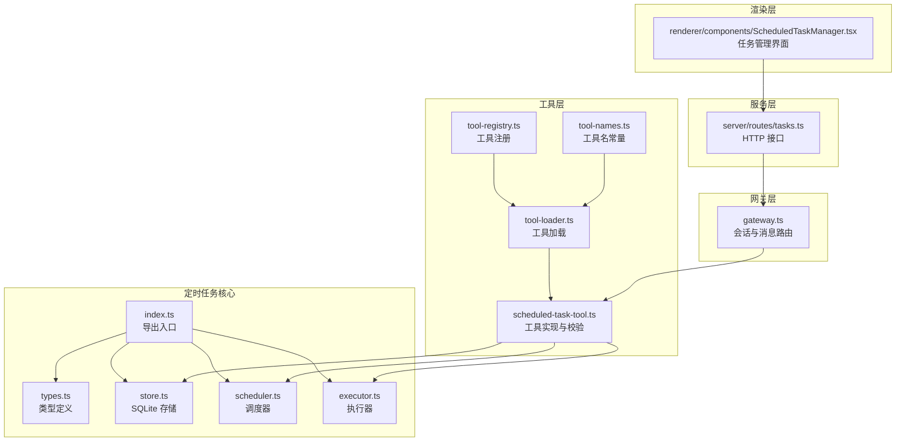
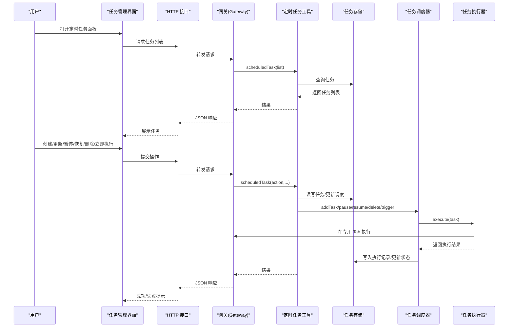
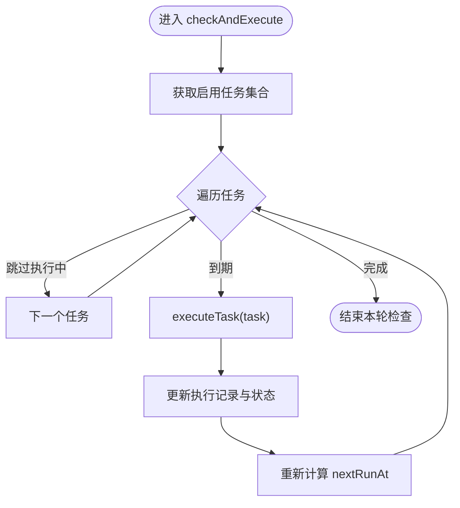
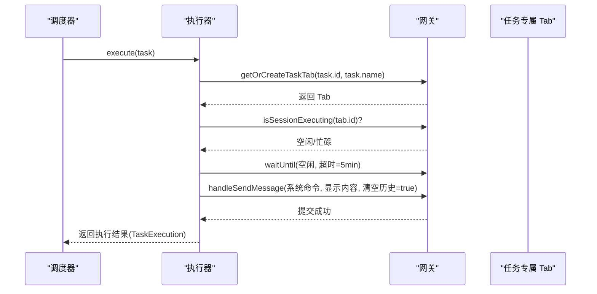
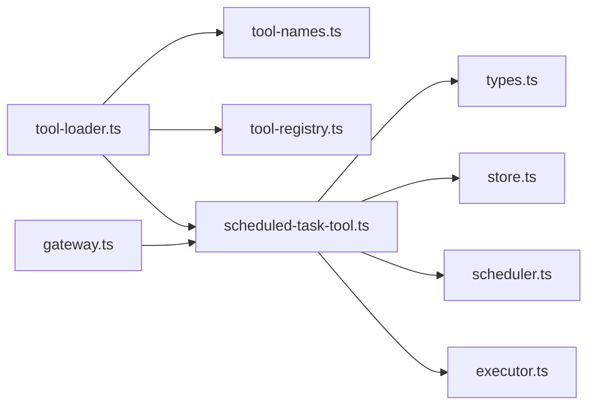

# 定时任务管理器

<cite>
**本文引用的文件**
- [index.ts](file://src/main/scheduled-tasks/index.ts)
- [types.ts](file://src/main/scheduled-tasks/types.ts)
- [scheduler.ts](file://src/main/scheduled-tasks/scheduler.ts)
- [executor.ts](file://src/main/scheduled-tasks/executor.ts)
- [store.ts](file://src/main/scheduled-tasks/store.ts)
- [scheduled-task-tool.ts](file://src/main/tools/scheduled-task-tool.ts)
- [tasks.ts](file://src/server/routes/tasks.ts)
- [ScheduledTaskManager.tsx](file://src/renderer/components/ScheduledTaskManager.tsx)
- [gateway.ts](file://src/main/gateway.ts)
- [tool-loader.ts](file://src/main/tools/registry/tool-loader.ts)
- [tool-registry.ts](file://src/main/tools/registry/tool-registry.ts)
- [tool-names.ts](file://src/main/tools/tool-names.ts)
- [README.md](file://README.md)
</cite>

## 目录
1. [简介](#简介)
2. [项目结构](#项目结构)
3. [核心组件](#核心组件)
4. [架构总览](#架构总览)
5. [详细组件分析](#详细组件分析)
6. [依赖关系分析](#依赖关系分析)
7. [性能考量](#性能考量)
8. [故障排查指南](#故障排查指南)
9. [结论](#结论)
10. [附录](#附录)

## 简介
本技术文档围绕 史丽慧小助理 的定时任务管理器展开，系统性阐述定时任务的创建、配置、执行与监控机制；解释 Cron 表达式的解析与校验规则；剖析任务调度器的工作原理、执行器的任务队列与并发控制策略；覆盖任务状态跟踪、执行历史记录与错误恢复机制；提供任务模板、批量操作与导入导出的使用建议；并总结性能优化、资源管理与故障诊断的最佳实践。

## 项目结构
定时任务相关代码位于 src/main/scheduled-tasks 目录，配合工具层、网关层与渲染层共同构成完整的任务生命周期闭环。

图表来源
- [index.ts:1-9](file://src/main/scheduled-tasks/index.ts#L1-L9)
- [types.ts:1-86](file://src/main/scheduled-tasks/types.ts#L1-L86)
- [store.ts:1-364](file://src/main/scheduled-tasks/store.ts#L1-L364)
- [scheduler.ts:1-322](file://src/main/scheduled-tasks/scheduler.ts#L1-L322)
- [executor.ts:1-170](file://src/main/scheduled-tasks/executor.ts#L1-L170)
- [scheduled-task-tool.ts:1-628](file://src/main/tools/scheduled-task-tool.ts#L1-L628)
- [tool-loader.ts:1-312](file://src/main/tools/registry/tool-loader.ts#L1-L312)
- [tool-registry.ts:1-328](file://src/main/tools/registry/tool-registry.ts#L1-L328)
- [tool-names.ts:1-106](file://src/main/tools/tool-names.ts#L1-L106)
- [gateway.ts:1-200](file://src/main/gateway.ts#L1-L200)
- [tasks.ts:1-33](file://src/server/routes/tasks.ts#L1-L33)
- [ScheduledTaskManager.tsx:1-571](file://src/renderer/components/ScheduledTaskManager.tsx#L1-L571)

章节来源
- [index.ts:1-9](file://src/main/scheduled-tasks/index.ts#L1-L9)
- [README.md:1-200](file://README.md#L1-L200)

## 核心组件
- 类型与数据模型：定义任务、调度配置、执行记录与过滤器等核心数据结构，确保前后端一致的数据契约。
- 存储层：基于 SQLite 的持久化存储，提供任务与执行记录的增删改查、索引与清理能力。
- 调度器：负责周期性检查、触发与状态推进，支持一次性、周期性与 Cron 三种调度类型。
- 执行器：在专用 Tab 中执行任务，确保任务与用户会话隔离，并提供等待与超时控制。
- 工具层：封装定时任务的创建、查询、暂停/恢复、手动触发、历史查看等操作，并内置调度校验与自然语言解析。
- 网关层：向工具层暴露统一入口，承载任务执行所需的会话与消息路由能力。
- 服务层：提供 HTTP 接口，将前端请求转发至网关适配器。
- 渲染层：提供任务管理界面，支持编辑内容、调度、暂停/恢复、立即执行与删除等操作。

章节来源
- [types.ts:1-86](file://src/main/scheduled-tasks/types.ts#L1-L86)
- [store.ts:1-364](file://src/main/scheduled-tasks/store.ts#L1-L364)
- [scheduler.ts:1-322](file://src/main/scheduled-tasks/scheduler.ts#L1-L322)
- [executor.ts:1-170](file://src/main/scheduled-tasks/executor.ts#L1-L170)
- [scheduled-task-tool.ts:1-628](file://src/main/tools/scheduled-task-tool.ts#L1-L628)
- [gateway.ts:1-200](file://src/main/gateway.ts#L1-L200)
- [tasks.ts:1-33](file://src/server/routes/tasks.ts#L1-L33)
- [ScheduledTaskManager.tsx:1-571](file://src/renderer/components/ScheduledTaskManager.tsx#L1-L571)

## 架构总览
定时任务从“对话创建”到“执行与监控”的完整链路如下：

图表来源
- [tasks.ts:1-33](file://src/server/routes/tasks.ts#L1-L33)
- [gateway.ts:1-200](file://src/main/gateway.ts#L1-L200)
- [scheduled-task-tool.ts:1-628](file://src/main/tools/scheduled-task-tool.ts#L1-L628)
- [store.ts:1-364](file://src/main/scheduled-tasks/store.ts#L1-L364)
- [scheduler.ts:1-322](file://src/main/scheduled-tasks/scheduler.ts#L1-L322)
- [executor.ts:1-170](file://src/main/scheduled-tasks/executor.ts#L1-L170)
- [ScheduledTaskManager.tsx:1-571](file://src/renderer/components/ScheduledTaskManager.tsx#L1-L571)

## 详细组件分析

### 类型与数据模型（types.ts）
- 任务调度配置 TaskSchedule 支持三种类型：
  - once：一次性，指定执行时间戳 executeAt
  - interval：周期性，指定间隔毫秒数 intervalMs 与可选起始时间 startAt
  - cron：Cron 表达式，支持 cronExpr 与时区 timezone，以及最大执行次数 maxRuns
- ScheduledTask：任务实体，包含标识、名称、描述、调度配置、启用状态、时间戳与执行计数
- TaskExecution：执行记录，包含任务标识、名称、开始/结束时间、耗时、状态与结果/错误
- TaskFilter：任务过滤器，支持按启用状态与调度类型筛选
- TaskCreateInput/TaskUpdateInput：创建与更新输入，约束字段与可选更新范围

章节来源
- [types.ts:1-86](file://src/main/scheduled-tasks/types.ts#L1-L86)

### 存储层（store.ts）
- 数据库初始化：根据 Docker 模式与普通模式选择数据库路径，确保目录存在；检测并清理孤立的 WAL/SHM 文件
- 表结构：
  - tasks：任务主表，含调度类型与序列化调度数据
  - executions：执行记录表，外键关联 tasks
- 索引：对启用状态、下次执行时间与执行记录的任务 ID 建立索引，提升查询效率
- 主要能力：
  - create/read/update/delete/list/getEnabledTasks
  - addExecution/getExecutions/cleanupOldExecutions
  - rowToTask 反序列化任务对象
- 事务与一致性：使用 SQLite WAL 模式，保证高并发下的可靠性

章节来源
- [store.ts:1-364](file://src/main/scheduled-tasks/store.ts#L1-L364)

### 调度器（scheduler.ts）
- 启动与停止：启动时计算所有启用任务的下次执行时间，随后每秒轮询检查
- 并发控制：维护 executingTasks 集合，避免同一任务并发执行
- 任务推进：
  - 检查到期任务并异步执行（不阻塞轮询）
  - 执行完成后更新 lastRunAt、runCount 与 nextRunAt
  - 达到 maxRuns 自动禁用任务；一次性任务执行后自动禁用
- 计算下次执行时间：
  - once：若执行时间在未来则返回，否则返回 null
  - interval：强制最小间隔 10 秒；首次执行依据 startAt 或当前时间+间隔
  - cron：使用 cron 库解析表达式与时区，异常时返回 null
- 重算机制：启动时与更新调度后重算 nextRunAt

图表来源
- [scheduler.ts:131-151](file://src/main/scheduled-tasks/scheduler.ts#L131-L151)
- [scheduler.ts:156-240](file://src/main/scheduled-tasks/scheduler.ts#L156-L240)

章节来源
- [scheduler.ts:1-322](file://src/main/scheduled-tasks/scheduler.ts#L1-L322)

### 执行器（executor.ts）
- 执行流程：
  - 生成执行 ID 与开始时间
  - 通过网关获取或创建任务专属 Tab
  - 等待 Tab 空闲（最长 5 分钟），避免并发冲突
  - 构造任务命令（系统提示 + 原始描述），发送到 Tab 执行
  - 记录成功/失败结果与耗时
- 命令构造：强调“定时任务的其中一次执行”，避免 AI 将其理解为创建新任务
- 等待与超时：使用 waitUntil 控制等待进度与超时，防止死锁

图表来源
- [executor.ts:21-79](file://src/main/scheduled-tasks/executor.ts#L21-L79)
- [executor.ts:86-153](file://src/main/scheduled-tasks/executor.ts#L86-L153)

章节来源
- [executor.ts:1-170](file://src/main/scheduled-tasks/executor.ts#L1-L170)

### 工具层（scheduled-task-tool.ts）
- 工具职责：创建、列出、更新、删除、暂停/恢复、手动触发、查看历史
- 调度校验：
  - once：必须提供 executeAt
  - interval：必须提供 intervalMs，且最小值为 10 秒
  - cron：必须提供 cronExpr，简单校验字段数量
- 自然语言解析：
  - 支持“每隔X秒/分钟/小时”、“每天X点”、“Cron表达式：...”等格式
  - 可提取“最多N次”作为 maxRuns
- 限制与增强：
  - 最多允许创建 10 个任务
  - 启动时异步重试启动调度器，避免阻塞网关初始化
  - 暂停时重置对应 Tab 的 AgentRuntime，删除时关闭任务 Tab
- 与网关集成：setGatewayInstance 传入网关实例，供执行器与工具使用

章节来源
- [scheduled-task-tool.ts:1-628](file://src/main/tools/scheduled-task-tool.ts#L1-L628)

### 网关层（gateway.ts）
- 作用：管理会话生命周期、消息路由、连接器与 Tab 管理
- 与定时任务集成：在构造函数中设置 Gateway 实例给 scheduled-task-tool，确保执行器可用

章节来源
- [gateway.ts:1-200](file://src/main/gateway.ts#L1-L200)

### 服务层（server/routes/tasks.ts）
- 提供 /api/tasks 接口，接收前端请求并调用网关适配器的 scheduledTask 方法
- 统一错误处理，返回 JSON 响应

章节来源
- [tasks.ts:1-33](file://src/server/routes/tasks.ts#L1-L33)

### 渲染层（renderer/components/ScheduledTaskManager.tsx）
- 功能：展示任务列表、编辑任务内容、编辑调度方式、暂停/恢复、立即执行、删除
- 交互：支持自然语言调度描述生成与解析，定时刷新（启用任务时每 30 秒）
- 提示：提供使用说明与注意事项

章节来源
- [ScheduledTaskManager.tsx:1-571](file://src/renderer/components/ScheduledTaskManager.tsx#L1-L571)

## 依赖关系分析
- 工具加载链路：tool-loader.ts 导入 createScheduledTaskTool 并注入到 Agent 工具集，使定时任务能力在对话中可用
- 工具注册：tool-registry.ts 管理工具插件注册与查询
- 工具名常量：tool-names.ts 统一管理工具名，避免硬编码
- 网关传递：gateway.ts 在构造阶段将自身实例传递给 scheduled-task-tool，确保执行器可用

图表来源
- [tool-loader.ts:1-312](file://src/main/tools/registry/tool-loader.ts#L1-L312)
- [tool-registry.ts:1-328](file://src/main/tools/registry/tool-registry.ts#L1-L328)
- [tool-names.ts:1-106](file://src/main/tools/tool-names.ts#L1-L106)
- [scheduled-task-tool.ts:1-628](file://src/main/tools/scheduled-task-tool.ts#L1-L628)
- [gateway.ts:1-200](file://src/main/gateway.ts#L1-L200)

章节来源
- [tool-loader.ts:1-312](file://src/main/tools/registry/tool-loader.ts#L1-L312)
- [tool-registry.ts:1-328](file://src/main/tools/registry/tool-registry.ts#L1-L328)
- [tool-names.ts:1-106](file://src/main/tools/tool-names.ts#L1-L106)
- [gateway.ts:1-200](file://src/main/gateway.ts#L1-L200)

## 性能考量
- 轮询频率：调度器每秒检查一次，平衡实时性与 CPU 开销
- 并发控制：通过 executingTasks 集合避免任务并发执行，减少资源争用
- 最小间隔：强制 interval 最小值为 10 秒，防止过于频繁的任务导致系统压力
- 数据库优化：WAL 模式、索引（启用状态、下次执行时间、执行记录任务 ID）提升查询性能
- 执行等待：Tab 空闲等待最多 5 分钟，避免长时间阻塞；超时后抛错，确保系统可用性
- 历史清理：定期清理旧执行记录，控制数据库体积

章节来源
- [scheduler.ts:17-18](file://src/main/scheduled-tasks/scheduler.ts#L17-L18)
- [scheduler.ts:262-266](file://src/main/scheduled-tasks/scheduler.ts#L262-L266)
- [store.ts:69-127](file://src/main/scheduled-tasks/store.ts#L69-L127)
- [executor.ts:104-129](file://src/main/scheduled-tasks/executor.ts#L104-L129)
- [scheduled-task-tool.ts:51-51](file://src/main/tools/scheduled-task-tool.ts#L51-L51)

## 故障排查指南
- 调度器未启动
  - 现象：任务不触发
  - 排查：确认 Gateway 初始化完成；查看工具层启动重试日志；检查数据库初始化是否成功
- Cron 表达式无效
  - 现象：计算下次执行时间为 null
  - 排查：核对表达式格式与字段数量；确认时区配置；查看日志中的错误信息
- 任务卡在执行中
  - 现象：执行器长时间等待 Tab 空闲
  - 排查：确认目标 Tab 是否存在；检查 isSessionExecuting 状态；等待超时为 5 分钟
- 执行记录缺失
  - 现象：历史记录为空或不完整
  - 排查：确认执行器返回的 TaskExecution 是否写入；检查 cleanupOldExecutions 是否提前清理
- 任务数量超限
  - 现象：创建失败并提示已达上限
  - 排查：删除部分任务后重试创建

章节来源
- [scheduler.ts:284-296](file://src/main/scheduled-tasks/scheduler.ts#L284-L296)
- [executor.ts:87-129](file://src/main/scheduled-tasks/executor.ts#L87-L129)
- [store.ts:328-337](file://src/main/scheduled-tasks/store.ts#L328-L337)
- [scheduled-task-tool.ts:187-191](file://src/main/tools/scheduled-task-tool.ts#L187-L191)

## 结论
史丽慧小助理 的定时任务管理器以清晰的分层架构实现了从“创建/配置”到“执行/监控”的完整闭环。通过 SQLite 持久化、Cron 解析与严格的并发控制，系统在保证稳定性的同时提供了灵活的调度能力。工具层与网关层的紧密协作，使得任务能够在专用 Tab 中安全执行，并通过 UI 提供直观的操作体验。建议在生产环境中结合最小间隔、历史清理与超时控制，持续优化资源占用与执行可靠性。

## 附录

### Cron 表达式解析与校验规则
- 格式要求：至少 5 个字段，最多 6 个字段（可选秒字段）
- 校验逻辑：工具层对 cronExpr 进行简单格式校验；调度器使用 cron 库解析并处理异常
- 时区：默认 Asia/Shanghai，可在调度配置中指定

章节来源
- [scheduled-task-tool.ts:524-533](file://src/main/tools/scheduled-task-tool.ts#L524-L533)
- [scheduler.ts:282-296](file://src/main/scheduled-tasks/scheduler.ts#L282-L296)

### 任务状态跟踪与执行历史
- 状态字段：enabled、lastRunAt、nextRunAt、runCount
- 历史记录：包含开始/结束时间、耗时、状态、结果与错误
- 查询接口：按任务 ID 限制条数查询最近执行记录

章节来源
- [types.ts:29-55](file://src/main/scheduled-tasks/types.ts#L29-L55)
- [store.ts:302-323](file://src/main/scheduled-tasks/store.ts#L302-L323)

### 并发控制与队列管理
- 调度器：每秒轮询，使用 Set 标记执行中任务，避免并发
- 执行器：等待 Tab 空闲，最长 5 分钟；超时抛错
- 最小间隔：强制 interval 至少 10 秒

章节来源
- [scheduler.ts:19-19](file://src/main/scheduled-tasks/scheduler.ts#L19-L19)
- [scheduler.ts:131-151](file://src/main/scheduled-tasks/scheduler.ts#L131-L151)
- [executor.ts:97-129](file://src/main/scheduled-tasks/executor.ts#L97-L129)
- [scheduled-task-tool.ts:518-521](file://src/main/tools/scheduled-task-tool.ts#L518-L521)

### 使用指南与最佳实践
- 创建任务：通过对话或 UI 输入自然语言描述，系统解析为调度配置
- 编辑内容：修改任务描述，下次执行时生效
- 调度方式：支持一次性、周期性与 Cron；可设置最大执行次数
- 批量操作：暂停/恢复/删除支持批量选择；立即执行不影响下次计划
- 导入导出：当前实现未提供直接的导入导出功能，建议通过备份数据库文件实现迁移

章节来源
- [ScheduledTaskManager.tsx:108-146](file://src/renderer/components/ScheduledTaskManager.tsx#L108-L146)
- [ScheduledTaskManager.tsx:173-194](file://src/renderer/components/ScheduledTaskManager.tsx#L173-L194)
- [ScheduledTaskManager.tsx:196-214](file://src/renderer/components/ScheduledTaskManager.tsx#L196-L214)
- [ScheduledTaskManager.tsx:216-237](file://src/renderer/components/ScheduledTaskManager.tsx#L216-L237)
- [store.ts:328-337](file://src/main/scheduled-tasks/store.ts#L328-L337)