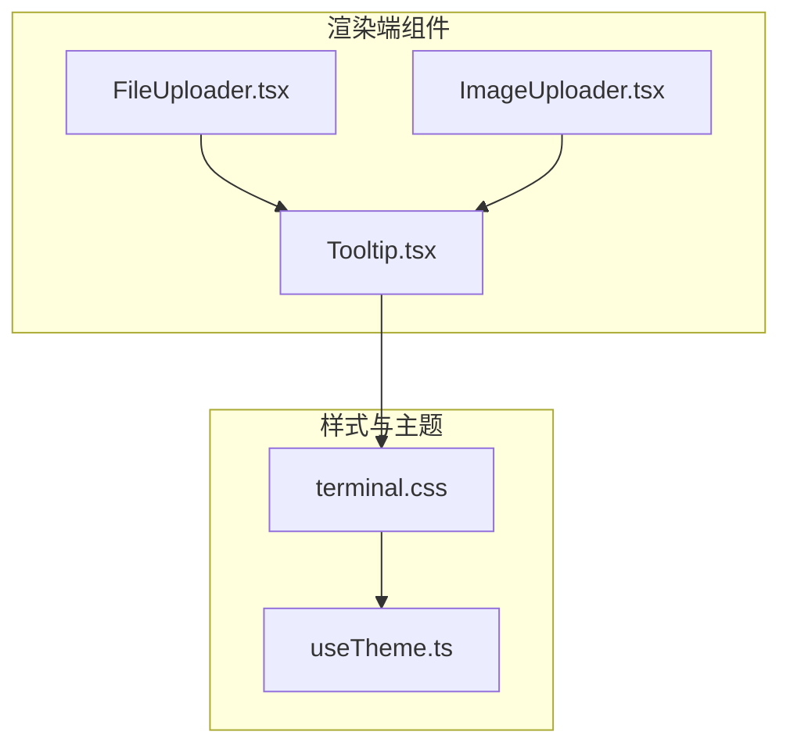
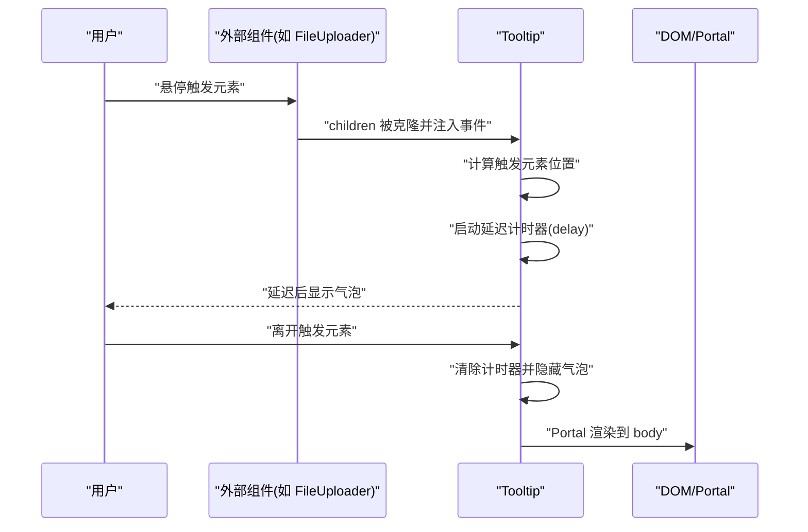
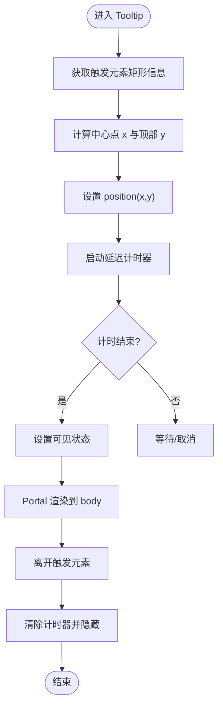
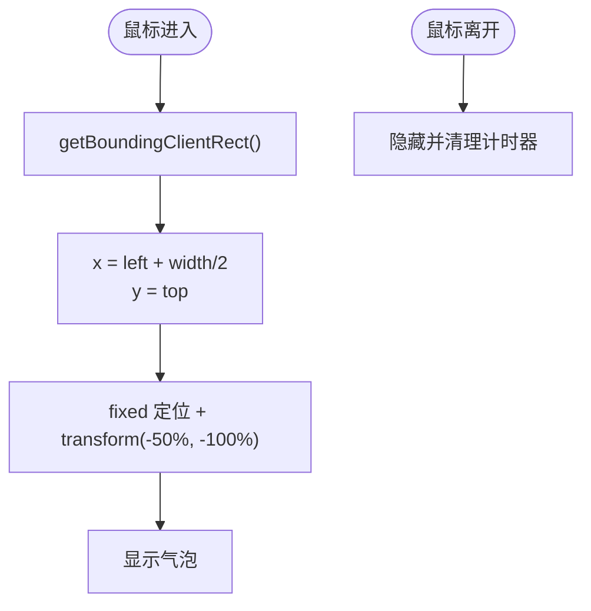
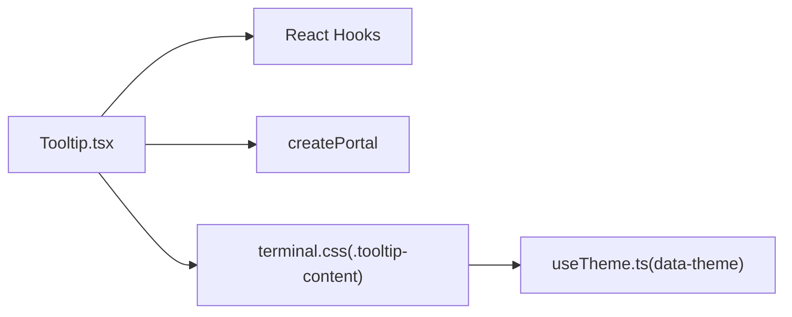

# 提示气泡组件

<cite>
**本文引用的文件**
- [Tooltip.tsx](file://src/renderer/components/Tooltip.tsx)
- [FileUploader.tsx](file://src/renderer/components/FileUploader.tsx)
- [ImageUploader.tsx](file://src/renderer/components/ImageUploader.tsx)
- [terminal.css](file://src/renderer/styles/terminal.css)
- [useTheme.ts](file://src/renderer/hooks/useTheme.ts)
</cite>

## 目录
1. [简介](#简介)
2. [项目结构](#项目结构)
3. [核心组件](#核心组件)
4. [架构总览](#架构总览)
5. [详细组件分析](#详细组件分析)
6. [依赖关系分析](#依赖关系分析)
7. [性能考量](#性能考量)
8. [无障碍与键盘导航](#无障碍与键盘导航)
9. [样式定制与主题适配](#样式定制与主题适配)
10. [扩展接口与自定义指南](#扩展接口与自定义指南)
11. [故障排查](#故障排查)
12. [结论](#结论)

## 简介
本文件为 史丽慧小助理 提示气泡组件（Tooltip）的详细 UI 组件文档。内容涵盖设计理念、实现原理、属性配置、样式定制、主题适配、位置计算与边界检测、无障碍支持、扩展接口与动画效果、性能优化与常见问题等。该组件以轻量、快速响应为目标，提供 0.2 秒延迟显示与固定定位的气泡展示，并通过 Portal 将气泡渲染至页面根节点，避免层级与定位问题。

## 项目结构
Tooltip 组件位于渲染端组件目录，配合终端主题样式与主题 Hook 实现跨主题一致的外观表现；在文件上传与图片上传组件中作为子组件使用，为按钮或预览项提供悬浮提示。

图表来源
- [Tooltip.tsx:1-91](file://src/renderer/components/Tooltip.tsx#L1-L91)
- [FileUploader.tsx:1-238](file://src/renderer/components/FileUploader.tsx#L1-L238)
- [ImageUploader.tsx:1-242](file://src/renderer/components/ImageUploader.tsx#L1-L242)
- [terminal.css:1498-1542](file://src/renderer/styles/terminal.css#L1498-L1542)
- [useTheme.ts:1-64](file://src/renderer/hooks/useTheme.ts#L1-L64)

章节来源
- [Tooltip.tsx:1-91](file://src/renderer/components/Tooltip.tsx#L1-L91)
- [FileUploader.tsx:12-151](file://src/renderer/components/FileUploader.tsx#L12-L151)
- [ImageUploader.tsx:13-188](file://src/renderer/components/ImageUploader.tsx#L13-L188)
- [terminal.css:1498-1542](file://src/renderer/styles/terminal.css#L1498-L1542)
- [useTheme.ts:1-64](file://src/renderer/hooks/useTheme.ts#L1-L64)

## 核心组件
- 组件名称：Tooltip
- 类型：函数组件（React.FC）
- 主要职责：
  - 接收内容字符串与触发子元素
  - 延迟显示（默认 200ms）
  - 计算并定位气泡位置（固定定位，基于触发元素中心上方）
  - 使用 Portal 渲染到 document.body，确保层级与溢出可见性
  - 支持多行文本（按换行符拆分）

关键属性
- content: string —— 气泡内容（支持换行）
- children: React.ReactElement —— 触发元素（会被克隆并注入鼠标事件）
- delay?: number —— 显示延迟（毫秒，默认 200）

内部状态与逻辑
- 可见性状态：isVisible
- 位置状态：position（x, y）
- 延迟计时器：timeoutRef
- 生命周期清理：组件卸载时清除未完成的延迟

章节来源
- [Tooltip.tsx:12-22](file://src/renderer/components/Tooltip.tsx#L12-L22)
- [Tooltip.tsx:23-49](file://src/renderer/components/Tooltip.tsx#L23-L49)
- [Tooltip.tsx:51-57](file://src/renderer/components/Tooltip.tsx#L51-L57)
- [Tooltip.tsx:66-82](file://src/renderer/components/Tooltip.tsx#L66-L82)

## 架构总览
Tooltip 的调用链路简洁清晰：外部组件将 Tooltip 包裹在需要提示的元素上，Tooltip 通过克隆子元素注入鼠标事件，在进入时计算位置并延时显示，在离开时立即隐藏并清理计时器。最终通过 Portal 将气泡渲染到页面根节点，避免 CSS 定位与层级影响。

图表来源
- [Tooltip.tsx:27-49](file://src/renderer/components/Tooltip.tsx#L27-L49)
- [Tooltip.tsx:66-82](file://src/renderer/components/Tooltip.tsx#L66-L82)
- [FileUploader.tsx:129-151](file://src/renderer/components/FileUploader.tsx#L129-L151)
- [ImageUploader.tsx:128-148](file://src/renderer/components/ImageUploader.tsx#L128-L148)

## 详细组件分析

### 设计理念与实现要点
- 快速响应：默认 0.2 秒延迟，减少误触干扰
- 固定定位：使用 fixed 定位，确保在滚动与复杂布局下稳定显示
- Portal 渲染：将气泡挂载到 body，避免父级 overflow 或 transform 影响
- 多行支持：按换行符拆分行并插入换行标签，保持可读性
- 事件透传：克隆子元素并注入事件，不改变原元素行为

图表来源
- [Tooltip.tsx:27-49](file://src/renderer/components/Tooltip.tsx#L27-L49)
- [Tooltip.tsx:66-82](file://src/renderer/components/Tooltip.tsx#L66-L82)

章节来源
- [Tooltip.tsx:1-91](file://src/renderer/components/Tooltip.tsx#L1-L91)

### 位置计算与边界检测
- 位置来源：从事件目标元素获取边界矩形，计算中心点 x 与顶部 y
- 定位策略：固定定位，transform 向左偏移 50%，再向上偏移一定像素，形成“上方居中”提示
- 边界检测：当前实现未进行视口边界检测与自动翻转；若需增强，可在计算阶段加入视口尺寸比对与方向切换逻辑

图表来源
- [Tooltip.tsx:27-49](file://src/renderer/components/Tooltip.tsx#L27-L49)
- [Tooltip.tsx:66-72](file://src/renderer/components/Tooltip.tsx#L66-L72)

章节来源
- [Tooltip.tsx:27-49](file://src/renderer/components/Tooltip.tsx#L27-L49)
- [Tooltip.tsx:66-72](file://src/renderer/components/Tooltip.tsx#L66-L72)

### 样式与动画
- 容器类名：tooltip-content（固定定位、圆角、阴影、z-index 较高）
- 箭头伪元素：::after 生成三角形指向触发元素
- 动画：淡入动画，时长短促，提升反馈速度
- 主题变量：背景、文字、边框、阴影均使用 CSS 变量，随主题切换而变化

章节来源
- [terminal.css:1504-1521](file://src/renderer/styles/terminal.css#L1504-L1521)
- [terminal.css:1522-1531](file://src/renderer/styles/terminal.css#L1522-L1531)
- [terminal.css:1533-1542](file://src/renderer/styles/terminal.css#L1533-L1542)

### 在业务组件中的使用
- FileUploader：在“内联上传按钮”与“悬浮预览”场景中使用 Tooltip，为用户提供容量与数量限制说明
- ImageUploader：在“内联上传按钮”与“悬浮预览”场景中使用 Tooltip，为用户提供图片路径与名称提示

章节来源
- [FileUploader.tsx:129-151](file://src/renderer/components/FileUploader.tsx#L129-L151)
- [FileUploader.tsx:172-184](file://src/renderer/components/FileUploader.tsx#L172-L184)
- [ImageUploader.tsx:128-148](file://src/renderer/components/ImageUploader.tsx#L128-L148)
- [ImageUploader.tsx:170-186](file://src/renderer/components/ImageUploader.tsx#L170-L186)

## 依赖关系分析
- 组件依赖
  - React：函数组件、useState、useRef、useEffect
  - createPortal：将气泡渲染到 document.body
- 样式依赖
  - terminal.css：定义 tooltip-content、箭头与淡入动画
- 主题依赖
  - useTheme.ts：提供 light/dark/auto 主题模式，通过 data-theme 属性驱动 CSS 变量切换

图表来源
- [Tooltip.tsx:9-10](file://src/renderer/components/Tooltip.tsx#L9-L10)
- [terminal.css:1504-1521](file://src/renderer/styles/terminal.css#L1504-L1521)
- [useTheme.ts:23-28](file://src/renderer/hooks/useTheme.ts#L23-L28)

章节来源
- [Tooltip.tsx:9-10](file://src/renderer/components/Tooltip.tsx#L9-L10)
- [terminal.css:1504-1521](file://src/renderer/styles/terminal.css#L1504-L1521)
- [useTheme.ts:23-28](file://src/renderer/hooks/useTheme.ts#L23-L28)

## 性能考量
- 延迟显示：默认 200ms，降低频繁悬停导致的重绘与布局开销
- Portal 渲染：仅在需要时创建与更新气泡 DOM，避免深层嵌套带来的样式计算成本
- 事件绑定：通过克隆子元素注入事件，避免额外的事件委托或全局监听
- 建议优化
  - 若存在大量 Tooltip 并发使用，可考虑统一调度显示队列，避免同时创建多个 Portal
  - 对于高频触发场景，可将 delay 参数外置为 props，允许调用方按需调整
  - 在大数据量预览场景中，建议对 content 进行节流或截断，避免过多换行造成渲染压力

## 无障碍与键盘导航
- 当前实现
  - 通过鼠标事件触发，未提供键盘激活（如 Enter/Space）或焦点管理
  - 未设置 aria-* 属性（如 role、aria-describedby）
- 建议改进
  - 为触发元素添加 aria-describedby，指向 Tooltip 内容
  - 支持键盘激活：在受控元素上监听 Enter/Space 键，模拟鼠标进入/离开行为
  - 为 Tooltip 容器添加 role="tooltip"，并在隐藏时移除 aria-hidden
  - 在自动翻转与边界检测完善后，确保提示始终在可视区域内

## 样式定制与主题适配
- 主题变量
  - 背景：--terminal-header-bg
  - 文本：--terminal-text
  - 边框：--terminal-border
  - 阴影：--terminal-shadow
- 主题切换
  - light 模式通过 data-theme="light" 生效，覆盖部分终端组件样式
  - Tooltip 通过 CSS 变量继承主题色，无需额外改动
- 自定义建议
  - 如需独立样式，可在业务层为 Tooltip 容器包裹额外类名，使用更特异的选择器覆盖默认样式
  - 若需动态主题色，可通过 JS 注入 CSS 变量或使用 styled-components 等方案

章节来源
- [terminal.css:1506-1517](file://src/renderer/styles/terminal.css#L1506-L1517)
- [useTheme.ts:23-28](file://src/renderer/hooks/useTheme.ts#L23-L28)

## 扩展接口与自定义指南
- 可扩展点
  - 方向与定位：当前固定为上方居中，可新增方位枚举（上/下/左/右）与边界检测自动翻转
  - 动画与过渡：可引入更多入场/出场动画（滑入、缩放等）
  - 触发方式：支持点击、聚焦、长按等多种交互
  - 内容类型：支持 JSX/ReactNode，而非仅字符串
- 自定义样式
  - 通过为 Tooltip 容器添加自定义类名，覆盖 .tooltip-content 的默认样式
  - 使用 CSS 变量或 CSS-in-JS 控制字体、间距、圆角与阴影
- 动画效果
  - 可在现有淡入基础上增加位移动画（如轻微上移）
  - 结合 useTransition 或 Framer Motion 实现更丰富的交互动画

## 故障排查
- 气泡不显示
  - 检查 children 是否正确注入事件（克隆元素）
  - 确认 delay 设置是否过大导致感知延迟
  - 确认 Portal 是否成功挂载到 body
- 气泡位置异常
  - 触发元素定位为 fixed/absolute 时，确认其父级无 transform 导致坐标错位
  - 若出现溢出遮挡，建议启用边界检测与自动翻转
- 样式未生效
  - 确认主题变量是否正确写入 data-theme
  - 检查 CSS 优先级，必要时提高选择器特异性
- 性能问题
  - 大量并发 Tooltip 时，考虑统一调度与内容节流
  - 避免在 content 中使用过多换行与复杂结构

章节来源
- [Tooltip.tsx:59-63](file://src/renderer/components/Tooltip.tsx#L59-L63)
- [Tooltip.tsx:66-82](file://src/renderer/components/Tooltip.tsx#L66-L82)
- [terminal.css:1504-1521](file://src/renderer/styles/terminal.css#L1504-L1521)
- [useTheme.ts:23-28](file://src/renderer/hooks/useTheme.ts#L23-L28)

## 结论
Tooltip 组件以简洁高效的实现满足了快速提示需求，具备良好的可扩展性与主题适配能力。建议在未来版本中补充键盘交互、无障碍属性、边界检测与自动翻转、以及更丰富的动画与内容类型支持，以进一步提升用户体验与可维护性。