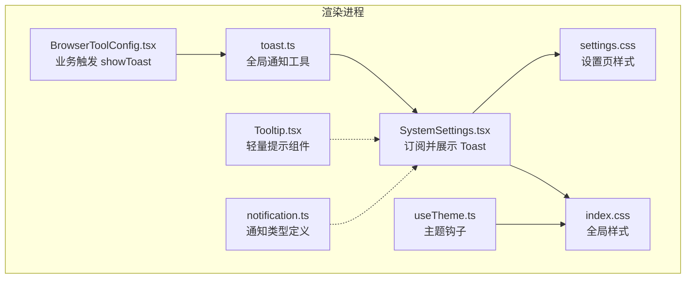
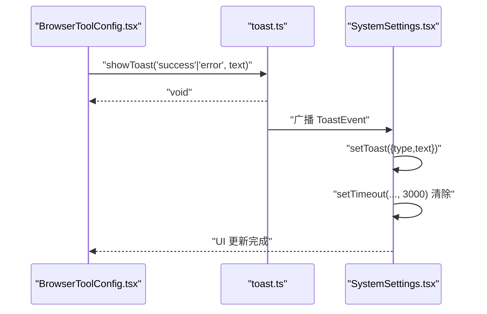
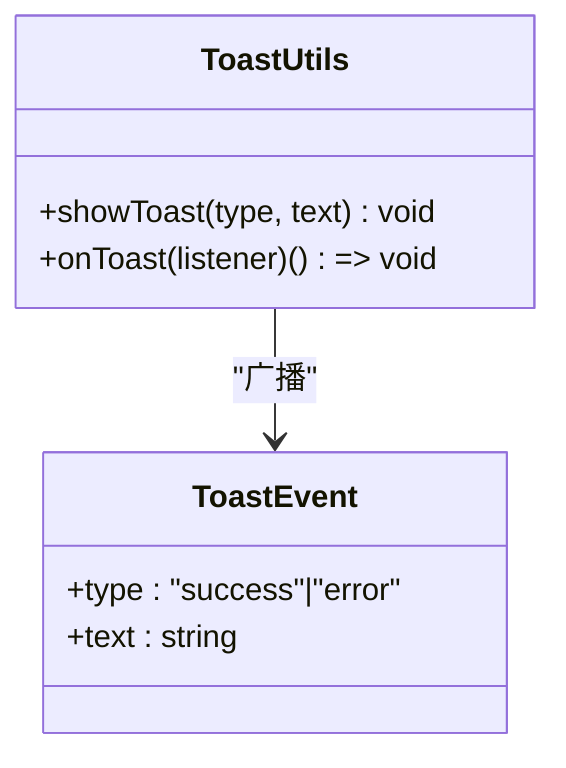
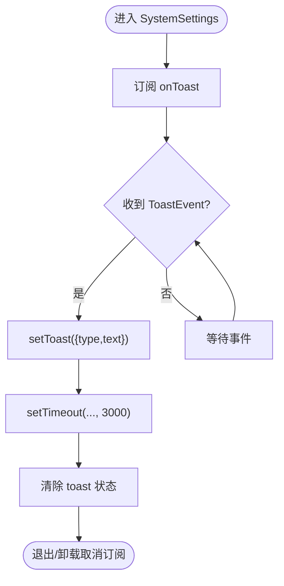
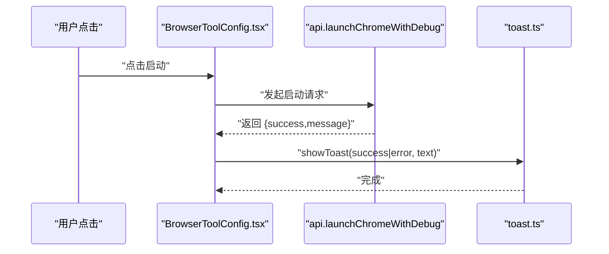
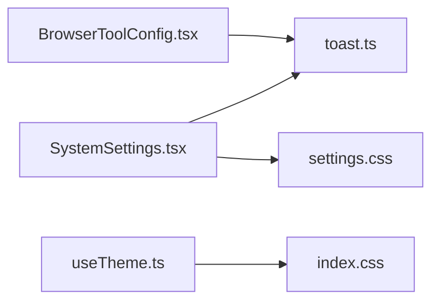

# 消息提示系统

<cite>
**本文档引用的文件**
- [src/renderer/utils/toast.ts](file://src/renderer/utils/toast.ts)
- [src/renderer/components/SystemSettings.tsx](file://src/renderer/components/SystemSettings.tsx)
- [src/renderer/components/settings/BrowserToolConfig.tsx](file://src/renderer/components/settings/BrowserToolConfig.tsx)
- [src/renderer/components/Tooltip.tsx](file://src/renderer/components/Tooltip.tsx)
- [src/renderer/styles/settings.css](file://src/renderer/styles/settings.css)
- [src/renderer/hooks/useTheme.ts](file://src/renderer/hooks/useTheme.ts)
- [src/renderer/index.css](file://src/renderer/index.css)
- [src/types/notification.ts](file://src/types/notification.ts)
</cite>

## 目录
1. [简介](#简介)
2. [项目结构](#项目结构)
3. [核心组件](#核心组件)
4. [架构总览](#架构总览)
5. [详细组件分析](#详细组件分析)
6. [依赖关系分析](#依赖关系分析)
7. [性能考量](#性能考量)
8. [故障排查指南](#故障排查指南)
9. [结论](#结论)
10. [附录](#附录)

## 简介
本文件为 DeepBot 消息提示系统（Toast 通知）的完整使用与开发文档。系统采用事件总线模式，提供全局 Toast 通知能力，支持成功与错误两类消息类型，并在系统设置界面以悬浮提示形式呈现。文档涵盖通知显示机制、消息类型与样式定制、生命周期管理、自动消失机制、用户交互处理、消息队列与去重策略、优先级排序建议、全局配置与主题定制、动画效果实现指南，以及无障碍访问与键盘快捷键的最佳实践。

## 项目结构
消息提示系统涉及以下关键文件：
- 通知工具：src/renderer/utils/toast.ts
- 通知消费与展示：src/renderer/components/SystemSettings.tsx
- 业务触发点：src/renderer/components/settings/BrowserToolConfig.tsx
- 辅助组件：src/renderer/components/Tooltip.tsx
- 主题与样式：src/renderer/hooks/useTheme.ts、src/renderer/styles/settings.css、src/renderer/index.css
- 通知类型定义：src/types/notification.ts（与 Toast 类型不同，但同属通知体系）

**图表来源**
- [src/renderer/utils/toast.ts:1-28](file://src/renderer/utils/toast.ts#L1-L28)
- [src/renderer/components/SystemSettings.tsx:31-180](file://src/renderer/components/SystemSettings.tsx#L31-L180)
- [src/renderer/components/settings/BrowserToolConfig.tsx:13-181](file://src/renderer/components/settings/BrowserToolConfig.tsx#L13-L181)
- [src/renderer/components/Tooltip.tsx:1-91](file://src/renderer/components/Tooltip.tsx#L1-L91)
- [src/renderer/hooks/useTheme.ts:1-64](file://src/renderer/hooks/useTheme.ts#L1-L64)
- [src/renderer/styles/settings.css:1-621](file://src/renderer/styles/settings.css#L1-L621)
- [src/renderer/index.css:1-55](file://src/renderer/index.css#L1-L55)
- [src/types/notification.ts:1-53](file://src/types/notification.ts#L1-L53)

**章节来源**
- [src/renderer/utils/toast.ts:1-28](file://src/renderer/utils/toast.ts#L1-L28)
- [src/renderer/components/SystemSettings.tsx:31-180](file://src/renderer/components/SystemSettings.tsx#L31-L180)
- [src/renderer/components/settings/BrowserToolConfig.tsx:13-181](file://src/renderer/components/settings/BrowserToolConfig.tsx#L13-L181)
- [src/renderer/components/Tooltip.tsx:1-91](file://src/renderer/components/Tooltip.tsx#L1-L91)
- [src/renderer/hooks/useTheme.ts:1-64](file://src/renderer/hooks/useTheme.ts#L1-L64)
- [src/renderer/styles/settings.css:1-621](file://src/renderer/styles/settings.css#L1-L621)
- [src/renderer/index.css:1-55](file://src/renderer/index.css#L1-L55)
- [src/types/notification.ts:1-53](file://src/types/notification.ts#L1-L53)

## 核心组件
- 全局通知工具（toast.ts）
  - 提供 showToast(type, text) 触发通知
  - 提供 onToast(listener) 订阅通知，返回取消订阅函数
  - 通知类型：success、error
- 系统设置页面（SystemSettings.tsx）
  - 订阅全局 Toast 事件，渲染悬浮提示
  - 自动消失：3 秒后清除
  - 样式基于 settings.css 的变量与主题
- 业务触发点（BrowserToolConfig.tsx）
  - 在浏览器工具启动流程中调用 showToast 展示结果
- 轻量提示（Tooltip.tsx）
  - 0.2 秒延迟显示，自动定位至元素上方
- 主题与样式（useTheme.ts、settings.css、index.css）
  - 主题模式：light/dark/auto
  - CSS 变量统一管理颜色与边框
- 通知类型定义（notification.ts）
  - 与 Toast 类型不同，属于另一套通知体系（Sub Agent 通知）

**章节来源**
- [src/renderer/utils/toast.ts:7-27](file://src/renderer/utils/toast.ts#L7-L27)
- [src/renderer/components/SystemSettings.tsx:50-57](file://src/renderer/components/SystemSettings.tsx#L50-L57)
- [src/renderer/components/SystemSettings.tsx:64-84](file://src/renderer/components/SystemSettings.tsx#L64-L84)
- [src/renderer/components/settings/BrowserToolConfig.tsx:23-37](file://src/renderer/components/settings/BrowserToolConfig.tsx#L23-L37)
- [src/renderer/components/Tooltip.tsx:18-49](file://src/renderer/components/Tooltip.tsx#L18-L49)
- [src/renderer/hooks/useTheme.ts:10-63](file://src/renderer/hooks/useTheme.ts#L10-L63)
- [src/renderer/styles/settings.css:6-32](file://src/renderer/styles/settings.css#L6-L32)
- [src/types/notification.ts:25-52](file://src/types/notification.ts#L25-L52)

## 架构总览
Toast 通知采用“事件总线”模式：业务模块通过 showToast 触发，系统设置页面通过 onToast 订阅并渲染，实现解耦与复用。

**图表来源**
- [src/renderer/components/settings/BrowserToolConfig.tsx:23-37](file://src/renderer/components/settings/BrowserToolConfig.tsx#L23-L37)
- [src/renderer/utils/toast.ts:19-21](file://src/renderer/utils/toast.ts#L19-L21)
- [src/renderer/components/SystemSettings.tsx:50-57](file://src/renderer/components/SystemSettings.tsx#L50-L57)
- [src/renderer/components/SystemSettings.tsx:54](file://src/renderer/components/SystemSettings.tsx#L54)

## 详细组件分析

### 组件 A：全局通知工具（toast.ts）
- 数据结构
  - ToastType：'success' | 'error'
  - ToastEvent：{ type, text }
  - 监听者集合：Set<ToastListener>
- 处理逻辑
  - showToast：遍历监听者并广播事件
  - onToast：注册监听者，返回取消订阅函数
- 错误处理
  - 无显式异常捕获；调用方需自行处理异步错误
- 性能特征
  - O(n) 广播复杂度，n 为监听者数量
  - 无去重与队列管理，适合轻量场景

**图表来源**
- [src/renderer/utils/toast.ts:7-27](file://src/renderer/utils/toast.ts#L7-L27)

**章节来源**
- [src/renderer/utils/toast.ts:7-27](file://src/renderer/utils/toast.ts#L7-L27)

### 组件 B：系统设置页面（SystemSettings.tsx）
- 订阅与展示
  - useEffect 订阅 onToast，接收 { type, text }，设置 toast 状态
  - 3 秒后自动清除，实现自动消失
- 样式与主题
  - 使用 CSS 变量控制背景、边框、文本与强调色
  - 基于 settings.css 的 success/error 颜色映射
- 交互处理
  - 关闭按钮与更新提示等 UI 交互
- 性能与可用性
  - 仅在 isOpen 为真时渲染，减少不必要的开销

**图表来源**
- [src/renderer/components/SystemSettings.tsx:50-57](file://src/renderer/components/SystemSettings.tsx#L50-L57)
- [src/renderer/components/SystemSettings.tsx:64-84](file://src/renderer/components/SystemSettings.tsx#L64-L84)

**章节来源**
- [src/renderer/components/SystemSettings.tsx:31-180](file://src/renderer/components/SystemSettings.tsx#L31-L180)
- [src/renderer/styles/settings.css:6-32](file://src/renderer/styles/settings.css#L6-L32)

### 组件 C：业务触发点（BrowserToolConfig.tsx）
- 触发时机
  - 浏览器工具启动流程中，根据结果调用 showToast
- 消息类型
  - 成功：'success'
  - 失败：'error'
- 用户体验
  - 与系统设置页面的 Toast 一致，保证一致性

**图表来源**
- [src/renderer/components/settings/BrowserToolConfig.tsx:23-37](file://src/renderer/components/settings/BrowserToolConfig.tsx#L23-L37)
- [src/renderer/utils/toast.ts:19-21](file://src/renderer/utils/toast.ts#L19-L21)

**章节来源**
- [src/renderer/components/settings/BrowserToolConfig.tsx:13-181](file://src/renderer/components/settings/BrowserToolConfig.tsx#L13-L181)

### 组件 D：轻量提示（Tooltip.tsx）
- 功能要点
  - 0.2 秒延迟显示，鼠标移入触发
  - 自动定位至元素上方，使用 Portal 渲染
- 适用场景
  - 简短帮助信息与操作提示，避免干扰主流程

**章节来源**
- [src/renderer/components/Tooltip.tsx:18-89](file://src/renderer/components/Tooltip.tsx#L18-L89)

### 组件 E：主题与样式（useTheme.ts、settings.css、index.css）
- 主题模式
  - light/dark/auto，默认 dark
  - auto 模式按 6:00-18:00 为浅色，其余为深色
- 样式变量
  - settings.css 定义 --settings-* 变量，统一颜色与边框
  - index.css 引入 Tailwind 与全局基础样式
- 应用方式
  - useTheme 将 data-theme 属性写入 html 元素，影响 CSS 变量

**章节来源**
- [src/renderer/hooks/useTheme.ts:10-63](file://src/renderer/hooks/useTheme.ts#L10-L63)
- [src/renderer/styles/settings.css:6-32](file://src/renderer/styles/settings.css#L6-L32)
- [src/renderer/index.css:1-55](file://src/renderer/index.css#L1-L55)

### 组件 F：通知类型定义（notification.ts）
- 作用
  - 定义 Sub Agent 通知类型与发送器接口，与 Toast 类型不同
- 与 Toast 的关系
  - 分属两套通知体系：Toast 用于 UI 提示，Sub Agent 通知用于运行时状态

**章节来源**
- [src/types/notification.ts:25-52](file://src/types/notification.ts#L25-L52)

## 依赖关系分析
- 组件耦合
  - BrowserToolConfig.tsx → toast.ts：单向依赖，触发通知
  - SystemSettings.tsx → toast.ts：单向依赖，消费通知
  - SystemSettings.tsx → settings.css：样式依赖
  - useTheme.ts → index.css：主题变量依赖
- 外部依赖
  - React、Portal、CSS 变量
- 循环依赖
  - 未见循环依赖迹象

**图表来源**
- [src/renderer/components/settings/BrowserToolConfig.tsx:7](file://src/renderer/components/settings/BrowserToolConfig.tsx#L7)
- [src/renderer/utils/toast.ts:19-21](file://src/renderer/utils/toast.ts#L19-L21)
- [src/renderer/components/SystemSettings.tsx:13](file://src/renderer/components/SystemSettings.tsx#L13)
- [src/renderer/styles/settings.css:1-621](file://src/renderer/styles/settings.css#L1-L621)
- [src/renderer/hooks/useTheme.ts:23-29](file://src/renderer/hooks/useTheme.ts#L23-L29)
- [src/renderer/index.css:1-55](file://src/renderer/index.css#L1-L55)

**章节来源**
- [src/renderer/components/settings/BrowserToolConfig.tsx:7](file://src/renderer/components/settings/BrowserToolConfig.tsx#L7)
- [src/renderer/utils/toast.ts:19-21](file://src/renderer/utils/toast.ts#L19-L21)
- [src/renderer/components/SystemSettings.tsx:13](file://src/renderer/components/SystemSettings.tsx#L13)
- [src/renderer/styles/settings.css:1-621](file://src/renderer/styles/settings.css#L1-L621)
- [src/renderer/hooks/useTheme.ts:23-29](file://src/renderer/hooks/useTheme.ts#L23-L29)
- [src/renderer/index.css:1-55](file://src/renderer/index.css#L1-L55)

## 性能考量
- 广播复杂度
  - toast.ts 使用 Set 存储监听者，广播为 O(n)，n 为监听者数量
- 渲染与内存
  - SystemSettings.tsx 仅在 isOpen 时渲染，避免常驻开销
  - Toast 状态在 3 秒后清除，防止内存泄漏
- 样式与主题
  - CSS 变量统一管理颜色，减少重复计算
  - 主题切换通过 data-theme 属性，避免全量重绘

[本节为通用性能讨论，无需特定文件来源]

## 故障排查指南
- 问题：Toast 不显示
  - 检查是否在 SystemSettings.tsx 中正确订阅 onToast
  - 确认 isOpen 为真，否则组件不渲染
- 问题：Toast 一直存在
  - 检查是否正确调用 setTimeout 清除状态
  - 确认组件卸载时取消订阅
- 问题：样式异常
  - 检查 settings.css 中的 CSS 变量是否被覆盖
  - 确认 useTheme.ts 是否正确设置 data-theme
- 问题：主题切换无效
  - 确认 useTheme.ts 的 applyTheme 是否被执行
  - 检查 index.css 是否正确引入

**章节来源**
- [src/renderer/components/SystemSettings.tsx:50-57](file://src/renderer/components/SystemSettings.tsx#L50-L57)
- [src/renderer/components/SystemSettings.tsx:64-84](file://src/renderer/components/SystemSettings.tsx#L64-L84)
- [src/renderer/styles/settings.css:6-32](file://src/renderer/styles/settings.css#L6-L32)
- [src/renderer/hooks/useTheme.ts:23-29](file://src/renderer/hooks/useTheme.ts#L23-L29)

## 结论
DeepBot 的 Toast 通知系统以事件总线为核心，实现了低耦合、易扩展的通知机制。通过系统设置页面统一消费与展示，结合主题与样式变量，提供了良好的用户体验。对于更复杂的队列、去重与优先级需求，可在现有基础上进行扩展（见“附录”）。

[本节为总结，无需特定文件来源]

## 附录

### 消息队列管理、重复消息过滤与优先级排序（扩展建议）
- 消息队列
  - 在 toast.ts 中维护一个队列数组，按时间戳排序
  - 每次 showToast 时推入队列，限制最大长度（如 10 条）
- 重复消息过滤
  - 以最近 N 秒内的消息内容作为去重键，若相同则合并计数
- 优先级排序
  - 为消息增加优先级字段（高/中/低），出队时优先弹出高优先级
- 生命周期管理
  - 为每条消息附加 TTL（如 5 秒），到期自动清理
- 自动消失机制
  - 采用定时器逐条清除，避免阻塞后续消息

[本节为概念性扩展建议，无需特定文件来源]

### 全局配置选项、主题定制与动画效果实现指南
- 全局配置
  - 在 toast.ts 中增加配置项：最大队列长度、默认消失时间、是否启用去重
- 主题定制
  - 通过 settings.css 的 CSS 变量统一调整颜色与边框
  - useTheme.ts 支持 light/dark/auto，可扩展更多主题
- 动画效果
  - 使用 CSS 过渡或关键帧动画实现淡入淡出、位移动画
  - 通过 Portal 渲染，避免层级与定位问题

[本节为通用实现指南，无需特定文件来源]

### 无障碍访问支持、键盘快捷键与屏幕阅读器兼容性最佳实践
- 无障碍支持
  - Toast 文本应简洁明确，避免仅依赖颜色传达语义
  - 使用语义化标签与 ARIA 属性（如 role="alert" 或 aria-live="polite"）
- 键盘快捷键
  - 提供一键清除所有 Toast 的快捷键（如 Escape）
- 屏幕阅读器兼容
  - 为 Toast 添加 aria-live 区域，确保及时播报
  - 避免频繁弹窗，以免干扰用户焦点流

[本节为通用最佳实践，无需特定文件来源]