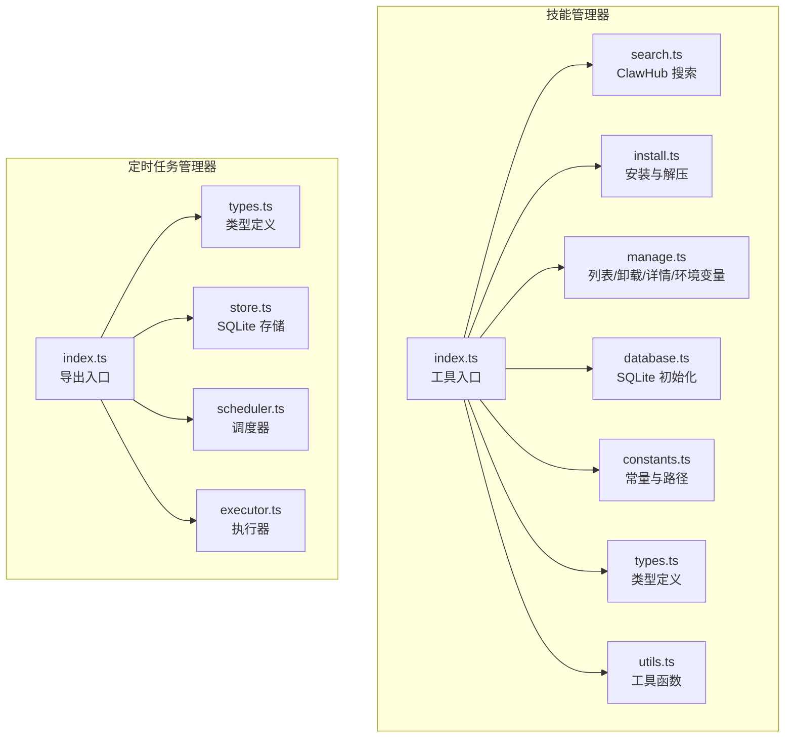
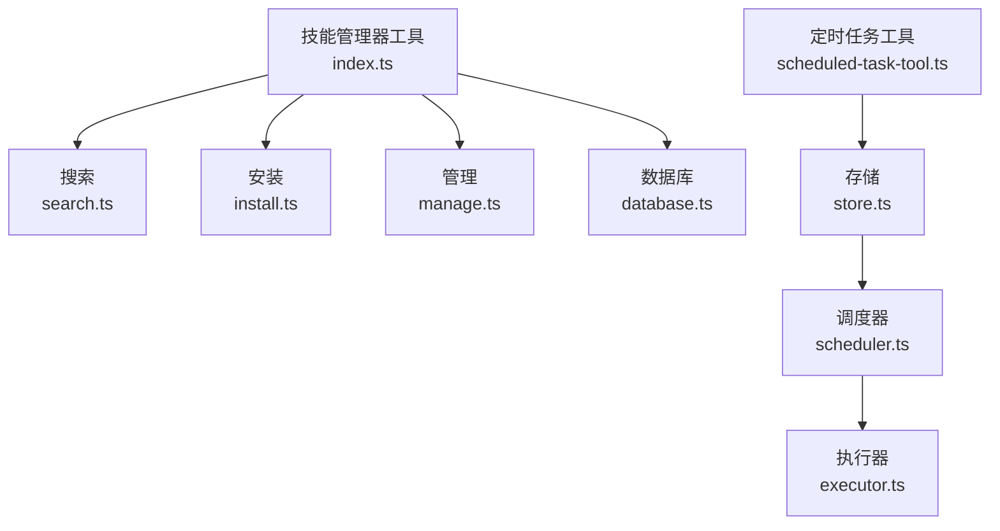
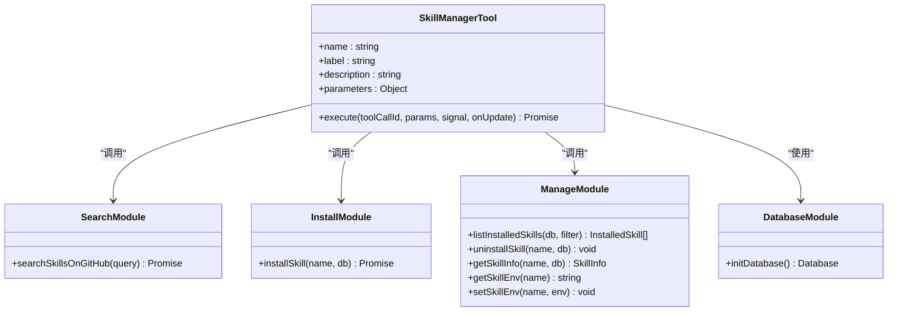
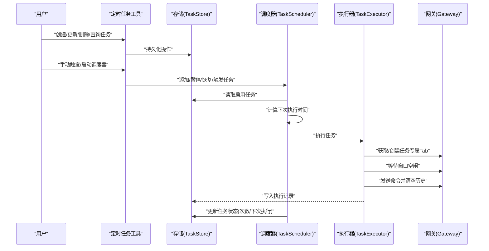
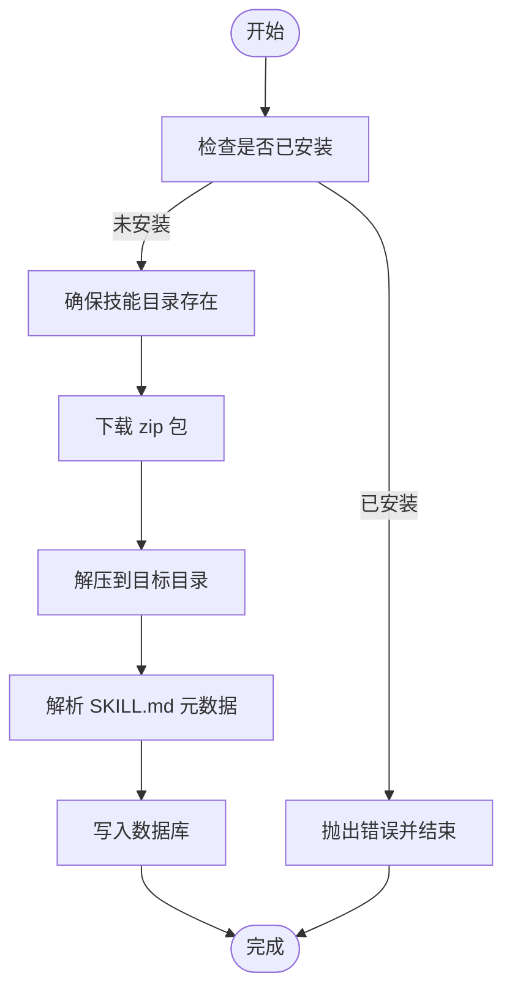
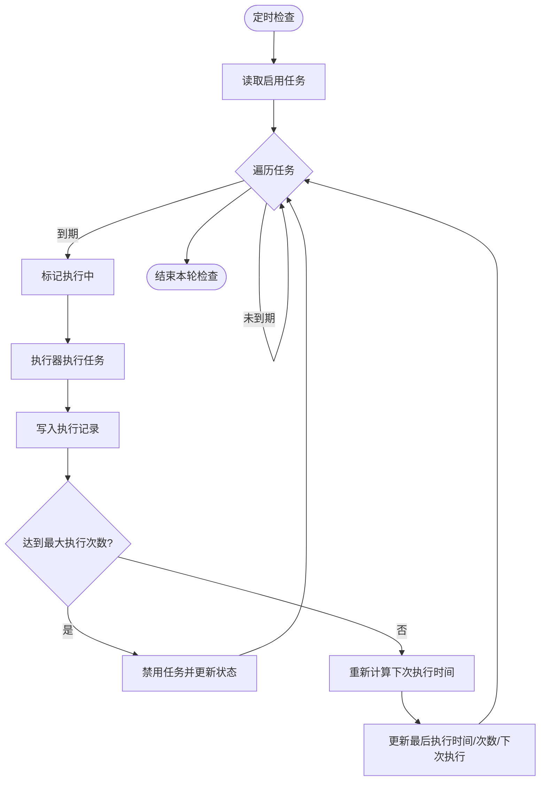
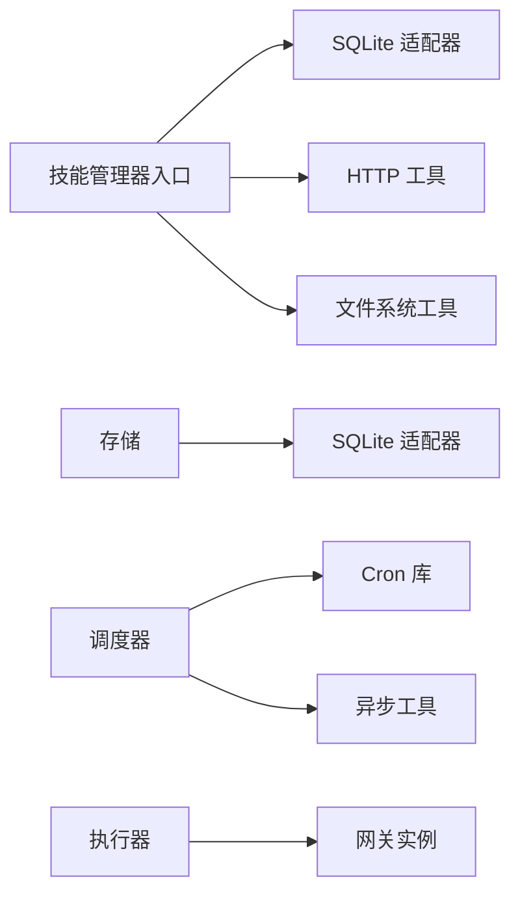

# 特色功能组件

<cite>
**本文引用的文件**
- [src/main/tools/skill-manager/index.ts](file://src/main/tools/skill-manager/index.ts)
- [src/main/tools/skill-manager/types.ts](file://src/main/tools/skill-manager/types.ts)
- [src/main/tools/skill-manager/manage.ts](file://src/main/tools/skill-manager/manage.ts)
- [src/main/tools/skill-manager/install.ts](file://src/main/tools/skill-manager/install.ts)
- [src/main/tools/skill-manager/search.ts](file://src/main/tools/skill-manager/search.ts)
- [src/main/tools/skill-manager/database.ts](file://src/main/tools/skill-manager/database.ts)
- [src/main/tools/skill-manager/constants.ts](file://src/main/tools/skill-manager/constants.ts)
- [src/main/tools/skill-manager/utils.ts](file://src/main/tools/skill-manager/utils.ts)
- [src/main/scheduled-tasks/index.ts](file://src/main/scheduled-tasks/index.ts)
- [src/main/scheduled-tasks/types.ts](file://src/main/scheduled-tasks/types.ts)
- [src/main/scheduled-tasks/store.ts](file://src/main/scheduled-tasks/store.ts)
- [src/main/scheduled-tasks/scheduler.ts](file://src/main/scheduled-tasks/scheduler.ts)
- [src/main/scheduled-tasks/executor.ts](file://src/main/scheduled-tasks/executor.ts)
- [src/main/tools/scheduled-task-tool.ts](file://src/main/tools/scheduled-task-tool.ts)
- [src/main/tools/skill-manager-tool.ts](file://src/main/tools/skill-manager-tool.ts)
</cite>

## 目录
1. [简介](#简介)
2. [项目结构](#项目结构)
3. [核心组件](#核心组件)
4. [架构总览](#架构总览)
5. [详细组件分析](#详细组件分析)
6. [依赖关系分析](#依赖关系分析)
7. [性能考量](#性能考量)
8. [故障排查指南](#故障排查指南)
9. [结论](#结论)
10. [附录](#附录)

## 简介
本文件聚焦 DeepBot 的两大特色功能组件：技能管理器与定时任务管理器。前者负责从外部生态发现、安装、管理技能，并提供技能的启用/禁用、卸载与环境变量配置；后者负责任务的持久化存储、调度与执行，支持一次性、周期性与 Cron 三种调度方式，并提供执行历史与统计。文档将从架构、数据流、状态管理、事件处理、集成与扩展、用户体验与交互优化等方面进行系统化阐述。

## 项目结构
围绕“技能管理器”与“定时任务管理器”，代码采用按功能域分层组织：
- 技能管理器位于 src/main/tools/skill-manager，包含入口工具、类型定义、数据库初始化、搜索、安装、管理（列表/卸载/详情/环境变量）与工具函数。
- 定时任务管理器位于 src/main/scheduled-tasks，包含类型定义、存储（SQLite）、调度器、执行器与导出入口。
- 对外工具封装位于 src/main/tools，分别提供技能管理工具与定时任务工具，供 Agent Runtime 调用。

图示来源
- [src/main/tools/skill-manager/index.ts:1-180](file://src/main/tools/skill-manager/index.ts#L1-L180)
- [src/main/scheduled-tasks/index.ts:1-9](file://src/main/scheduled-tasks/index.ts#L1-L9)

章节来源
- [src/main/tools/skill-manager/index.ts:1-180](file://src/main/tools/skill-manager/index.ts#L1-L180)
- [src/main/scheduled-tasks/index.ts:1-9](file://src/main/scheduled-tasks/index.ts#L1-L9)

## 核心组件
- 技能管理器工具：提供 find/install/list/enable/disable/uninstall/info/get-env/set-env 等操作，统一参数校验与错误处理，返回结构化结果与细节。
- 定时任务管理器：提供任务的创建、读取、更新、删除、列出、执行历史查询与清理，支持一次性、周期性与 Cron 调度，具备执行并发控制与最大执行次数限制。

章节来源
- [src/main/tools/skill-manager/index.ts:27-179](file://src/main/tools/skill-manager/index.ts#L27-L179)
- [src/main/scheduled-tasks/store.ts:133-241](file://src/main/scheduled-tasks/store.ts#L133-L241)
- [src/main/scheduled-tasks/types.ts:29-85](file://src/main/scheduled-tasks/types.ts#L29-L85)

## 架构总览
技能管理器与定时任务管理器均采用“工具入口 + 子模块”的分层设计，通过类型定义统一数据契约，通过工具封装对外暴露统一接口。定时任务管理器进一步拆分为存储、调度器与执行器三部分，形成清晰的关注点分离。

图示来源
- [src/main/tools/skill-manager/index.ts:27-179](file://src/main/tools/skill-manager/index.ts#L27-L179)
- [src/main/scheduled-tasks/store.ts:23-83](file://src/main/scheduled-tasks/store.ts#L23-L83)
- [src/main/scheduled-tasks/scheduler.ts:12-24](file://src/main/scheduled-tasks/scheduler.ts#L12-L24)
- [src/main/scheduled-tasks/executor.ts:17-15](file://src/main/scheduled-tasks/executor.ts#L17-L15)

## 详细组件分析

### 技能管理器组件分析
- 功能职责
  - 搜索：调用外部 ClawHub API，返回可安装技能列表。
  - 安装：下载 zip 包并解压至技能目录，解析元数据，写入数据库。
  - 管理：列出已安装技能、卸载、查看详情、读取/设置技能环境变量。
  - 数据库：SQLite 初始化与表结构，维护技能元数据与状态。
  - 工具函数：解析 SKILL.md、扫描目录、提取技能名等。
- 数据模型
  - 搜索结果、已安装技能、技能详情、技能元数据等类型定义清晰，便于前后端与工具链协作。
- 状态与事件
  - 安装成功后写入数据库并记录安装路径与依赖；环境变量变更后重置 Shell 缓存以确保生效。
- 用户交互与体验
  - 统一的错误消息与结构化返回，便于上层 UI 呈现；安装/搜索失败时给出网络连通性提示。

图示来源
- [src/main/tools/skill-manager/index.ts:27-179](file://src/main/tools/skill-manager/index.ts#L27-L179)
- [src/main/tools/skill-manager/search.ts:29-80](file://src/main/tools/skill-manager/search.ts#L29-L80)
- [src/main/tools/skill-manager/install.ts:22-80](file://src/main/tools/skill-manager/install.ts#L22-L80)
- [src/main/tools/skill-manager/manage.ts:17-280](file://src/main/tools/skill-manager/manage.ts#L17-L280)
- [src/main/tools/skill-manager/database.ts:13-40](file://src/main/tools/skill-manager/database.ts#L13-L40)

章节来源
- [src/main/tools/skill-manager/index.ts:27-179](file://src/main/tools/skill-manager/index.ts#L27-L179)
- [src/main/tools/skill-manager/types.ts:8-83](file://src/main/tools/skill-manager/types.ts#L8-L83)
- [src/main/tools/skill-manager/manage.ts:17-280](file://src/main/tools/skill-manager/manage.ts#L17-L280)
- [src/main/tools/skill-manager/install.ts:22-150](file://src/main/tools/skill-manager/install.ts#L22-L150)
- [src/main/tools/skill-manager/database.ts:13-40](file://src/main/tools/skill-manager/database.ts#L13-L40)
- [src/main/tools/skill-manager/constants.ts:19-35](file://src/main/tools/skill-manager/constants.ts#L19-L35)
- [src/main/tools/skill-manager/utils.ts:28-92](file://src/main/tools/skill-manager/utils.ts#L28-L92)

### 定时任务管理器组件分析
- 功能职责
  - 存储：SQLite 持久化任务与执行记录，提供创建、读取、更新、删除、列表、执行历史查询与清理。
  - 调度器：周期性检查到期任务，支持一次性、周期性与 Cron 三种调度类型，具备最小间隔限制与最大执行次数控制。
  - 执行器：在专用 Tab 中执行任务，等待窗口空闲、构建任务命令、提交消息并记录执行结果。
- 数据模型
  - 任务、调度配置、执行记录、过滤器与创建/更新输入类型完整，便于前后端与工具链协作。
- 状态与事件
  - 任务状态包括启用/禁用、下次执行时间、执行次数、最后执行时间；调度器在执行前后更新状态并持久化。
- 用户交互与体验
  - 执行器对用户可见内容与 AI 内容进行区分，避免混淆；等待窗口空闲时提供进度反馈。

图示来源
- [src/main/scheduled-tasks/store.ts:133-241](file://src/main/scheduled-tasks/store.ts#L133-L241)
- [src/main/scheduled-tasks/scheduler.ts:128-240](file://src/main/scheduled-tasks/scheduler.ts#L128-L240)
- [src/main/scheduled-tasks/executor.ts:86-153](file://src/main/scheduled-tasks/executor.ts#L86-L153)

章节来源
- [src/main/scheduled-tasks/types.ts:29-85](file://src/main/scheduled-tasks/types.ts#L29-L85)
- [src/main/scheduled-tasks/store.ts:23-363](file://src/main/scheduled-tasks/store.ts#L23-L363)
- [src/main/scheduled-tasks/scheduler.ts:12-322](file://src/main/scheduled-tasks/scheduler.ts#L12-L322)
- [src/main/scheduled-tasks/executor.ts:17-170](file://src/main/scheduled-tasks/executor.ts#L17-L170)

### 复杂逻辑流程图：安装技能

图示来源
- [src/main/tools/skill-manager/install.ts:22-80](file://src/main/tools/skill-manager/install.ts#L22-L80)
- [src/main/tools/skill-manager/install.ts:85-150](file://src/main/tools/skill-manager/install.ts#L85-L150)

### 复杂逻辑流程图：调度器执行与状态更新

图示来源
- [src/main/scheduled-tasks/scheduler.ts:131-240](file://src/main/scheduled-tasks/scheduler.ts#L131-L240)

## 依赖关系分析
- 技能管理器
  - 依赖 SQLite 适配器进行持久化，依赖 HTTP 工具进行网络请求，依赖文件系统工具进行目录与文件操作。
  - 通过常量模块统一路径与 API 地址，通过类型模块统一数据契约。
- 定时任务管理器
  - 依赖 SQLite 适配器与索引优化，依赖 Cron 库解析表达式，依赖异步工具等待窗口空闲。
  - 通过类型模块统一任务、调度与执行记录的数据结构。

图示来源
- [src/main/tools/skill-manager/index.ts:18-22](file://src/main/tools/skill-manager/index.ts#L18-L22)
- [src/main/scheduled-tasks/store.ts:7-21](file://src/main/scheduled-tasks/store.ts#L7-L21)
- [src/main/scheduled-tasks/scheduler.ts:10-10](file://src/main/scheduled-tasks/scheduler.ts#L10-L10)
- [src/main/scheduled-tasks/executor.ts:10-15](file://src/main/scheduled-tasks/executor.ts#L10-L15)

章节来源
- [src/main/tools/skill-manager/index.ts:18-22](file://src/main/tools/skill-manager/index.ts#L18-L22)
- [src/main/scheduled-tasks/store.ts:7-21](file://src/main/scheduled-tasks/store.ts#L7-L21)
- [src/main/scheduled-tasks/scheduler.ts:10-10](file://src/main/scheduled-tasks/scheduler.ts#L10-L10)
- [src/main/scheduled-tasks/executor.ts:10-15](file://src/main/scheduled-tasks/executor.ts#L10-L15)

## 性能考量
- SQLite WAL 模式与索引
  - 存储模块启用 WAL 模式提升并发读写性能，并建立关键索引减少查询成本。
- 调度器检查频率与最小间隔
  - 每秒检查一次，周期性任务最小间隔限制为 10 秒，避免过密轮询造成资源浪费。
- 执行并发控制
  - 使用集合跟踪正在执行的任务 ID，避免同一任务重复执行，提高稳定性。
- I/O 与网络
  - 技能安装阶段涉及网络下载与磁盘解压，建议在后台线程或异步上下文中执行，避免阻塞主线程。
- 执行历史清理
  - 提供按天数清理旧执行记录的能力，默认保留 30 天，防止日志膨胀影响性能。

章节来源
- [src/main/scheduled-tasks/store.ts:69-128](file://src/main/scheduled-tasks/store.ts#L69-L128)
- [src/main/scheduled-tasks/scheduler.ts:17-19](file://src/main/scheduled-tasks/scheduler.ts#L17-L19)
- [src/main/scheduled-tasks/scheduler.ts:140-150](file://src/main/scheduled-tasks/scheduler.ts#L140-L150)
- [src/main/scheduled-tasks/store.ts:328-337](file://src/main/scheduled-tasks/store.ts#L328-L337)

## 故障排查指南
- 技能管理器
  - 网络问题：搜索失败时若出现 DNS/超时/拒绝连接等错误，优先检查网络与防火墙设置。
  - 安装失败：确认 zip 下载与解压过程是否成功，检查目标目录权限与磁盘空间。
  - 元数据缺失：SKILL.md 缺少必需字段或 YAML frontmatter 不规范会导致解析失败。
- 定时任务管理器
  - Cron 表达式无效：检查表达式语法与时区配置，无效表达式将导致无法计算下次执行时间。
  - 执行卡住：若窗口长时间处于执行状态，执行器会等待空闲，超时将报错；检查任务 Tab 的执行状态。
  - 数据库异常：若检测到孤立的 WAL/SHM 文件，存储模块会尝试清理，必要时重启应用或手动删除残留文件。

章节来源
- [src/main/tools/skill-manager/search.ts:65-79](file://src/main/tools/skill-manager/search.ts#L65-L79)
- [src/main/tools/skill-manager/install.ts:76-80](file://src/main/tools/skill-manager/install.ts#L76-L80)
- [src/main/scheduled-tasks/scheduler.ts:282-297](file://src/main/scheduled-tasks/scheduler.ts#L282-L297)
- [src/main/scheduled-tasks/executor.ts:108-125](file://src/main/scheduled-tasks/executor.ts#L108-L125)
- [src/main/scheduled-tasks/store.ts:40-65](file://src/main/scheduled-tasks/store.ts#L40-L65)

## 结论
技能管理器与定时任务管理器在 DeepBot 中分别承担“外部生态接入”与“自动化执行”的核心职责。前者通过统一的工具入口与类型定义，简化了技能的发现、安装与管理；后者通过存储、调度与执行的清晰分层，提供了高可靠、可观测的定时任务能力。两者均注重错误处理、状态管理与用户体验，适合在生产环境中稳定运行，并可通过扩展接口持续增强。

## 附录
- 集成与扩展指南
  - 技能管理器：新增操作可在工具入口参数校验与执行分支中扩展；新增技能源可替换搜索模块；数据库结构可根据需求扩展字段。
  - 定时任务管理器：新增调度类型可在调度器计算逻辑中扩展；新增执行通道可扩展执行器；存储层可增加新的索引或表以支持更复杂的查询。
- 用户体验与交互优化
  - 技能管理器：提供结构化返回与错误提示，便于 UI 呈现；环境变量变更后自动刷新缓存，减少用户感知复杂度。
  - 定时任务管理器：执行器区分用户可见内容与 AI 内容，避免歧义；等待窗口空闲时提供进度反馈，提升可感知性。