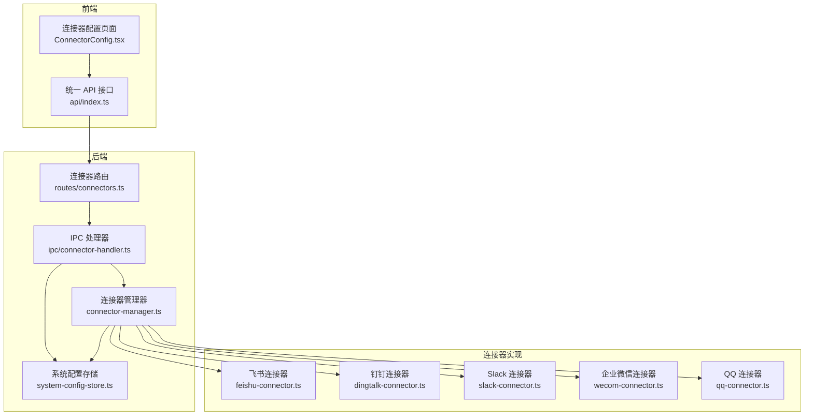
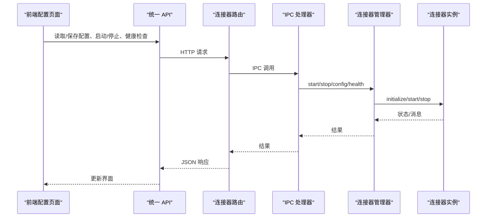
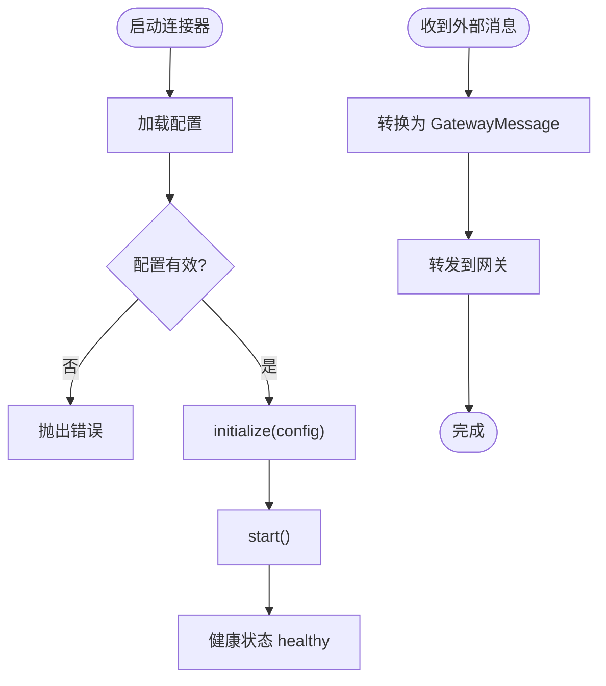
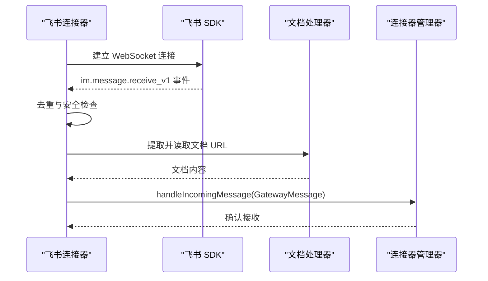
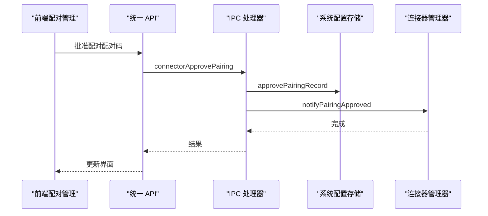
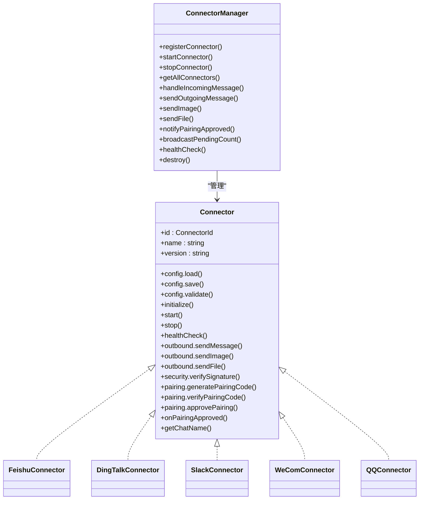

# 外部连接器配置

<cite>
**本文档引用的文件**
- [src/main/connectors/index.ts](file://src/main/connectors/index.ts)
- [src/main/connectors/connector-manager.ts](file://src/main/connectors/connector-manager.ts)
- [src/main/connectors/feishu/feishu-connector.ts](file://src/main/connectors/feishu/feishu-connector.ts)
- [src/main/connectors/feishu/document-handler.ts](file://src/main/connectors/feishu/document-handler.ts)
- [src/main/connectors/dingtalk/dingtalk-connector.ts](file://src/main/connectors/dingtalk/dingtalk-connector.ts)
- [src/main/connectors/slack/slack-connector.ts](file://src/main/connectors/slack/slack-connector.ts)
- [src/main/connectors/wecom/wecom-connector.ts](file://src/main/connectors/wecom/wecom-connector.ts)
- [src/main/connectors/qq/qq-connector.ts](file://src/main/connectors/qq/qq-connector.ts)
- [src/types/connector.ts](file://src/types/connector.ts)
- [src/main/database/connector-config.ts](file://src/main/database/connector-config.ts)
- [src/main/database/system-config-store.ts](file://src/main/database/system-config-store.ts)
- [src/server/routes/connectors.ts](file://src/server/routes/connectors.ts)
- [src/main/ipc/connector-handler.ts](file://src/main/ipc/connector-handler.ts)
- [src/renderer/components/settings/ConnectorConfig.tsx](file://src/renderer/components/settings/ConnectorConfig.tsx)
- [src/renderer/api/index.ts](file://src/renderer/api/index.ts)
</cite>

## 目录
1. [简介](#简介)
2. [项目结构](#项目结构)
3. [核心组件](#核心组件)
4. [架构概览](#架构概览)
5. [详细组件分析](#详细组件分析)
6. [依赖关系分析](#依赖关系分析)
7. [性能考虑](#性能考虑)
8. [故障排查指南](#故障排查指南)
9. [结论](#结论)

## 简介
本文件面向 DeepBot 外部连接器配置组件，系统性阐述连接器配置页面的功能与实现，覆盖第三方服务集成配置、认证设置、连接状态管理、消息路由、配对授权机制、验证规则、连接测试与故障诊断等方面。文档同时总结最佳实践，包括安全性考虑、性能优化与故障恢复策略，并说明连接器配置对系统集成能力与数据流转的影响。

## 项目结构
连接器系统采用“统一管理 + 多平台适配”的架构设计：
- 连接器管理器负责生命周期管理、消息路由与状态广播
- 各平台连接器（飞书、钉钉、Slack、企业微信、QQ）实现具体协议与消息处理
- 配置持久化通过系统配置存储模块完成
- 前端通过统一 API 访问后端接口，实现配置页面的交互

**图表来源**
- [src/renderer/components/settings/ConnectorConfig.tsx:1-800](file://src/renderer/components/settings/ConnectorConfig.tsx#L1-800)
- [src/renderer/api/index.ts:187-234](file://src/renderer/api/index.ts#L187-234)
- [src/server/routes/connectors.ts:9-214](file://src/server/routes/connectors.ts#L9-214)
- [src/main/ipc/connector-handler.ts:65-405](file://src/main/ipc/connector-handler.ts#L65-405)
- [src/main/connectors/connector-manager.ts:21-379](file://src/main/connectors/connector-manager.ts#L21-379)

**章节来源**
- [src/main/connectors/index.ts:1-11](file://src/main/connectors/index.ts#L1-11)
- [src/main/connectors/connector-manager.ts:1-379](file://src/main/connectors/connector-manager.ts#L1-379)
- [src/types/connector.ts:1-387](file://src/types/connector.ts#L1-387)

## 核心组件
- 连接器管理器（ConnectorManager）：统一注册、启动/停止连接器；处理外部消息并转发至网关；提供健康检查与状态广播；支持发送文本/图片/文件消息。
- 各平台连接器：实现统一 Connector 接口，包含配置加载/保存/校验、生命周期管理、消息收发、安全控制与配对机制。
- 系统配置存储（SystemConfigStore）：SQLite 持久化，提供连接器配置、配对记录、工作空间设置等管理。
- 前端连接器配置页面：提供多平台配置输入、保存、启动/停止、健康检查与配对管理。

**章节来源**
- [src/main/connectors/connector-manager.ts:21-379](file://src/main/connectors/connector-manager.ts#L21-379)
- [src/types/connector.ts:76-146](file://src/types/connector.ts#L76-146)
- [src/main/database/system-config-store.ts:37-566](file://src/main/database/system-config-store.ts#L37-566)
- [src/renderer/components/settings/ConnectorConfig.tsx:78-800](file://src/renderer/components/settings/ConnectorConfig.tsx#L78-800)

## 架构概览
连接器配置页面通过统一 API 访问后端路由，后端通过 IPC 处理器调用连接器管理器，连接器管理器驱动具体连接器完成配置加载、启动、消息处理与状态广播。

**图表来源**
- [src/renderer/api/index.ts:187-234](file://src/renderer/api/index.ts#L187-234)
- [src/server/routes/connectors.ts:9-214](file://src/server/routes/connectors.ts#L9-214)
- [src/main/ipc/connector-handler.ts:65-405](file://src/main/ipc/connector-handler.ts#L65-405)
- [src/main/connectors/connector-manager.ts:45-103](file://src/main/connectors/connector-manager.ts#L45-103)

## 详细组件分析

### 连接器管理器（ConnectorManager）
- 职责：注册连接器、启动/停止、配置加载与校验、消息路由、健康检查、状态广播、发送文本/图片/文件消息。
- 关键流程：
  - 启动流程：加载配置 → 校验配置 → initialize → start
  - 消息处理：外部消息 → 转换为网关消息 → 转发到网关
  - 健康检查：调用连接器 healthCheck 返回状态
  - 状态广播：推送待授权用户数量到前端

**图表来源**
- [src/main/connectors/connector-manager.ts:45-103](file://src/main/connectors/connector-manager.ts#L45-103)
- [src/main/connectors/connector-manager.ts:130-168](file://src/main/connectors/connector-manager.ts#L130-168)

**章节来源**
- [src/main/connectors/connector-manager.ts:21-379](file://src/main/connectors/connector-manager.ts#L21-379)

### 飞书连接器（FeishuConnector）
- 配置项：App ID、App Secret、是否需要配对授权
- 特性：
  - 使用飞书 Node.js SDK 的 WebSocket 长连接接收消息
  - 消息去重（基于 message_id 与内容时间窗）
  - 支持图片/文件下载与转发
  - 飞书文档读取与内容拼接
  - 机器人 open_id 轮询获取，避免阻塞启动
  - 安全检查与配对授权流程
- 健康检查：直接检查内部状态，避免频繁 HTTP 请求

**图表来源**
- [src/main/connectors/feishu/feishu-connector.ts:103-150](file://src/main/connectors/feishu/feishu-connector.ts#L103-150)
- [src/main/connectors/feishu/feishu-connector.ts:368-577](file://src/main/connectors/feishu/feishu-connector.ts#L368-577)
- [src/main/connectors/feishu/document-handler.ts:66-93](file://src/main/connectors/feishu/document-handler.ts#L66-93)

**章节来源**
- [src/main/connectors/feishu/feishu-connector.ts:28-994](file://src/main/connectors/feishu/feishu-connector.ts#L28-994)
- [src/main/connectors/feishu/document-handler.ts:23-369](file://src/main/connectors/feishu/document-handler.ts#L23-369)

### 钉钉连接器（DingTalkConnector）
- 配置项：Client ID、Client Secret、机器人码（可选）、是否需要配对授权
- 特性：
  - 使用钉钉 Stream 模式 WebSocket 接收消息
  - 消息去重与安全检查
  - 自动批准免配对模式下的首个用户并赋予管理员权限
  - 支持图片/文件上传与发送

**章节来源**
- [src/main/connectors/dingtalk/dingtalk-connector.ts:27-459](file://src/main/connectors/dingtalk/dingtalk-connector.ts#L27-459)

### Slack 连接器（SlackConnector）
- 配置项：Bot Token、App Token、Signing Secret、是否需要配对授权
- 特性：
  - 使用 Slack Socket Mode 实现双向通信
  - 事件回调与消息去重
  - 用户信息缓存与机器人 ID 获取
  - 支持图片/文件上传与发送

**章节来源**
- [src/main/connectors/slack/slack-connector.ts:27-705](file://src/main/connectors/slack/slack-connector.ts#L27-705)

### 企业微信连接器（WeComConnector）
- 配置项：Corp ID、Agent ID、Secret、Token、EncodingAESKey（可选）、是否需要配对授权
- 特性：
  - 使用企业微信智能机器人 WebSocket 接收消息
  - Access Token 缓存与自动刷新
  - 支持图片/文件上传与发送

**章节来源**
- [src/main/connectors/wecom/wecom-connector.ts:28-737](file://src/main/connectors/wecom/wecom-connector.ts#L28-737)

### QQ 连接器（QQConnector）
- 配置项：App ID、App Secret、是否需要配对授权
- 特性：
  - 使用 QQ 开放平台 WebSocket 接收消息
  - Access Token 管理与心跳维护
  - 支持图片/文件上传与发送

**章节来源**
- [src/main/connectors/qq/qq-connector.ts:28-837](file://src/main/connectors/qq/qq-connector.ts#L28-837)

### 配置持久化与配对机制
- 系统配置存储：
  - 连接器配置表：connector_config（connector_id、connector_name、enabled、config_json、时间戳）
  - 配对记录表：connector_pairing（connector_id、user_id、pairing_code、approved、is_admin、user_name、open_id、时间戳）
- 配对流程：
  - 生成配对码 → 保存记录 → 管理员批准 → 通知连接器 → 推送待授权数量更新

**图表来源**
- [src/main/ipc/connector-handler.ts:325-361](file://src/main/ipc/connector-handler.ts#L325-361)
- [src/main/connectors/connector-manager.ts:293-310](file://src/main/connectors/connector-manager.ts#L293-310)

**章节来源**
- [src/main/database/system-config-store.ts:180-220](file://src/main/database/system-config-store.ts#L180-220)
- [src/main/database/system-config-store.ts:499-539](file://src/main/database/system-config-store.ts#L499-539)
- [src/main/database/connector-config.ts:115-132](file://src/main/database/connector-config.ts#L115-132)
- [src/main/database/connector-config.ts:189-197](file://src/main/database/connector-config.ts#L189-197)

### 前端连接器配置页面
- 功能：
  - 展示连接器列表与启用状态
  - 各平台配置表单（必填字段校验）
  - 保存配置、启动/停止连接器、健康检查
  - 配对记录管理（批准、设为管理员、删除）
- 交互：
  - 通过统一 API 访问后端接口
  - Electron 模式使用 IPC，Web 模式使用 HTTP/WebSocket

**章节来源**
- [src/renderer/components/settings/ConnectorConfig.tsx:78-800](file://src/renderer/components/settings/ConnectorConfig.tsx#L78-800)
- [src/renderer/api/index.ts:187-234](file://src/renderer/api/index.ts#L187-234)

## 依赖关系分析
- 类关系图（关键接口与实现）

**图表来源**
- [src/types/connector.ts:76-146](file://src/types/connector.ts#L76-146)
- [src/main/connectors/connector-manager.ts:21-379](file://src/main/connectors/connector-manager.ts#L21-379)

**章节来源**
- [src/types/connector.ts:1-387](file://src/types/connector.ts#L1-387)
- [src/main/connectors/index.ts:5-11](file://src/main/connectors/index.ts#L5-11)

## 性能考虑
- 消息去重：各连接器内置基于 message_id 与内容时间窗的去重机制，减少重复处理与网络开销。
- 健康检查：连接器管理器的健康检查直接检查内部状态，避免每次打开设置页都发起 HTTP 请求，提升响应速度。
- 资源缓存：飞书连接器缓存机器人 open_id；Slack/企业微信/QQ 连接器缓存 Access Token，降低 API 调用频率。
- 异步处理：飞书连接器在收到事件后快速返回响应，异步处理消息，避免重推与延迟。
- 文件处理：图片/文件下载到本地临时目录，避免直接传递大文件导致内存压力。

[本节为通用指导，无需特定文件引用]

## 故障排查指南
- 健康检查失败：
  - 检查连接器是否已启动、WebSocket 是否连接、配置是否有效
  - 查看连接器管理器的健康检查返回状态与消息
- 配对授权问题：
  - 确认配对码是否正确、是否已批准
  - 检查配对记录表中的 approved 字段与 is_admin 标记
- 消息未到达：
  - 检查群组 @ 机器人规则（飞书/钉钉/Slack/企业微信/QQ）
  - 确认私聊安全检查是否通过（免配对模式或已批准）
- 文件/图片发送失败：
  - 检查文件路径与权限、上传接口返回码
  - 确认连接器是否支持 sendImage/sendFile 方法

**章节来源**
- [src/main/connectors/connector-manager.ts:341-358](file://src/main/connectors/connector-manager.ts#L341-358)
- [src/main/database/system-config-store.ts:519-521](file://src/main/database/system-config-store.ts#L519-521)

## 结论
DeepBot 外部连接器配置组件通过统一的连接器管理器与多平台连接器实现，提供了完善的第三方服务集成能力。前端配置页面与后端 IPC/HTTP 接口协同，实现了配置保存、启动/停止、健康检查与配对管理的完整闭环。结合消息去重、缓存与异步处理等优化策略，系统在安全性、性能与可靠性方面具备良好表现。建议在生产环境中启用配对授权、定期检查连接器健康状态，并根据业务场景选择合适的连接器与认证方式。