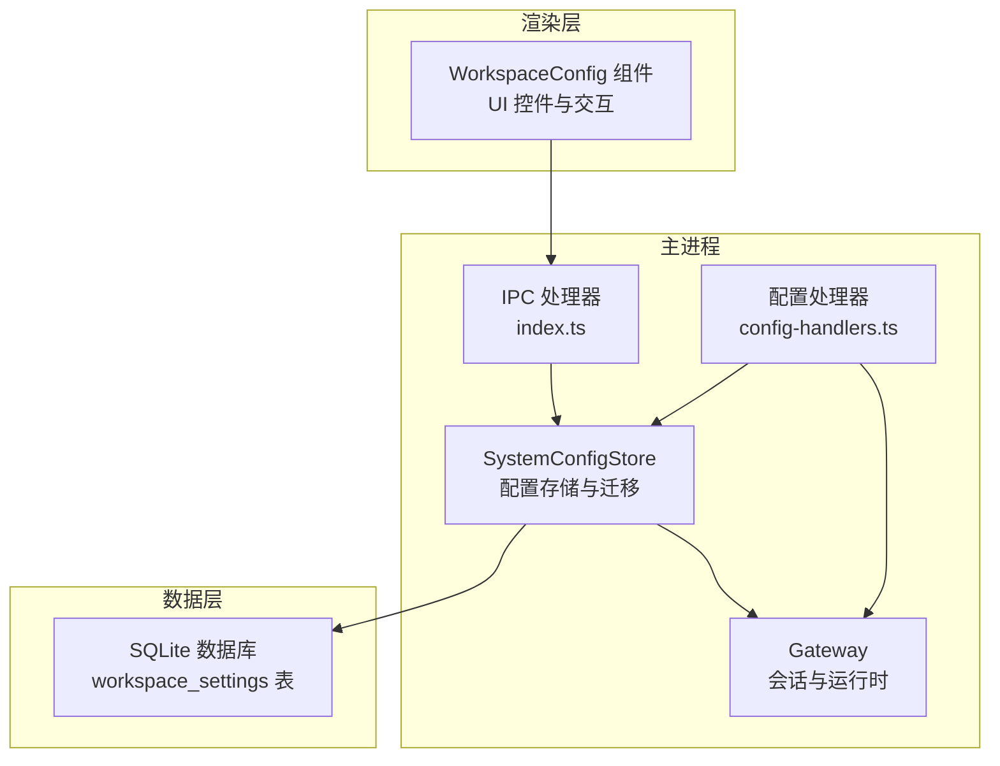
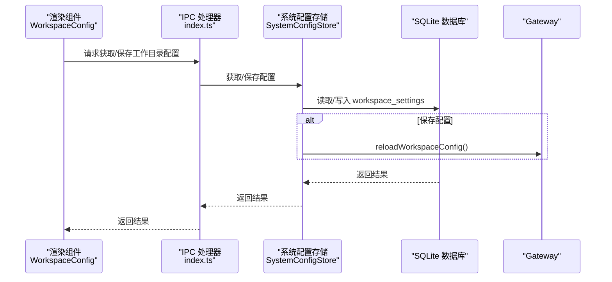
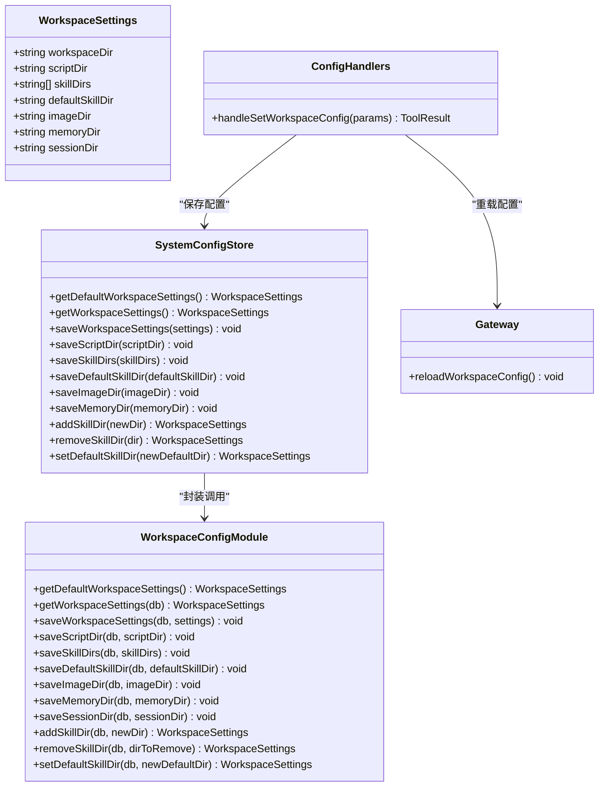

# 工作目录配置

<cite>
**本文引用的文件**
- [src/main/database/workspace-config.ts](file://src/main/database/workspace-config.ts)
- [src/main/database/config-types.ts](file://src/main/database/config-types.ts)
- [src/main/database/system-config-store.ts](file://src/main/database/system-config-store.ts)
- [src/main/tools/handlers/config-handlers.ts](file://src/main/tools/handlers/config-handlers.ts)
- [src/main/utils/ensure-directories.ts](file://src/main/utils/ensure-directories.ts)
- [src/main/gateway.ts](file://src/main/gateway.ts)
- [src/main/index.ts](file://src/main/index.ts)
- [src/renderer/components/settings/WorkspaceConfig.tsx](file://src/renderer/components/settings/WorkspaceConfig.tsx)
- [src/shared/utils/fs-utils.ts](file://src/shared/utils/fs-utils.ts)
- [src/shared/utils/path-utils.ts](file://src/shared/utils/path-utils.ts)
- [src/server/routes/config.ts](file://src/server/routes/config.ts)
</cite>

## 目录
1. [简介](#简介)
2. [项目结构](#项目结构)
3. [核心组件](#核心组件)
4. [架构总览](#架构总览)
5. [详细组件分析](#详细组件分析)
6. [依赖关系分析](#依赖关系分析)
7. [性能考量](#性能考量)
8. [故障排查指南](#故障排查指南)
9. [结论](#结论)
10. [附录](#附录)

## 简介
本文件面向 DeepBot 的“工作目录配置”功能，系统性阐述其设计与实现，覆盖以下方面：
- 工作空间创建、路径设置、权限与安全隔离
- 工作目录结构设计、文件组织与存储策略
- 配置验证、迁移与数据库一致性
- 多工作目录支持与切换机制
- 最佳实践：存储空间管理、数据安全与性能优化
- 备份与恢复建议（基于现有能力的扩展思路）

## 项目结构
工作目录配置涉及三层协作：
- 渲染层（Renderer）：提供图形界面，允许用户编辑默认工作目录、脚本目录、图片生成目录、记忆目录、会话目录以及多 Skill 目录，并进行重置与保存。
- 主进程（Main）：通过系统配置存储与工具处理器，持久化配置、触发 Gateway 重载、提供 IPC 接口。
- 数据层（SQLite）：以键值形式存储工作目录配置；系统配置存储负责建表、迁移与封装。

图表来源
- [src/renderer/components/settings/WorkspaceConfig.tsx:1-670](file://src/renderer/components/settings/WorkspaceConfig.tsx#L1-L670)
- [src/main/index.ts:449-491](file://src/main/index.ts#L449-L491)
- [src/main/database/system-config-store.ts:1-576](file://src/main/database/system-config-store.ts#L1-L576)
- [src/main/tools/handlers/config-handlers.ts:85-140](file://src/main/tools/handlers/config-handlers.ts#L85-L140)
- [src/main/gateway.ts:150-171](file://src/main/gateway.ts#L150-L171)

章节来源
- [src/renderer/components/settings/WorkspaceConfig.tsx:1-670](file://src/renderer/components/settings/WorkspaceConfig.tsx#L1-L670)
- [src/main/database/system-config-store.ts:1-576](file://src/main/database/system-config-store.ts#L1-L576)
- [src/main/index.ts:449-491](file://src/main/index.ts#L449-L491)

## 核心组件
- 工作目录配置类型定义：定义了工作目录配置的完整结构，包括默认工作目录、脚本目录、Skill 目录集合与默认 Skill 目录、图片生成目录、记忆目录、会话目录。
- 工作目录配置管理：负责默认值计算、从数据库批量读取、保存单项与整体保存、新增/删除/设置默认 Skill 目录。
- 系统配置存储：封装 SQLite 初始化、建表与迁移逻辑，提供统一的配置读写入口。
- 配置处理器：接收设置请求，合并当前配置，保存并触发 Gateway 重载。
- 目录初始化工具：应用启动时确保所有配置的目录存在。
- 渲染组件：提供 UI 交互、脏状态跟踪、保存与重置、Docker 模式提示。
- 文件系统工具：提供安全读写、目录创建、复制与删除等基础能力。
- 路由与 IPC：提供 API 与 IPC 接口，供前端与服务端调用。

章节来源
- [src/main/database/config-types.ts:19-29](file://src/main/database/config-types.ts#L19-L29)
- [src/main/database/workspace-config.ts:1-219](file://src/main/database/workspace-config.ts#L1-L219)
- [src/main/database/system-config-store.ts:335-379](file://src/main/database/system-config-store.ts#L335-L379)
- [src/main/tools/handlers/config-handlers.ts:85-140](file://src/main/tools/handlers/config-handlers.ts#L85-L140)
- [src/main/utils/ensure-directories.ts:16-53](file://src/main/utils/ensure-directories.ts#L16-L53)
- [src/renderer/components/settings/WorkspaceConfig.tsx:1-670](file://src/renderer/components/settings/WorkspaceConfig.tsx#L1-L670)
- [src/shared/utils/fs-utils.ts:19-79](file://src/shared/utils/fs-utils.ts#L19-L79)

## 架构总览
工作目录配置的端到端流程如下：

图表来源
- [src/main/index.ts:449-491](file://src/main/index.ts#L449-L491)
- [src/main/database/system-config-store.ts:341-347](file://src/main/database/system-config-store.ts#L341-L347)
- [src/main/tools/handlers/config-handlers.ts:125-131](file://src/main/tools/handlers/config-handlers.ts#L125-L131)

章节来源
- [src/main/index.ts:449-491](file://src/main/index.ts#L449-L491)
- [src/main/tools/handlers/config-handlers.ts:85-140](file://src/main/tools/handlers/config-handlers.ts#L85-L140)
- [src/main/gateway.ts:150-171](file://src/main/gateway.ts#L150-L171)

## 详细组件分析

### 工作目录配置类型与默认值
- WorkspaceSettings 定义了工作目录配置的全部字段，包括默认工作目录、脚本目录、Skill 目录数组与默认 Skill 目录、图片生成目录、记忆目录、会话目录。
- 默认值计算：
  - Docker 模式：优先读取环境变量（本地调试），否则固定为 /data/* 路径。
  - 非 Docker 模式：默认工作目录为主目录，其他目录位于用户主目录下的 .deepbot 与 .agents 子目录中。

章节来源
- [src/main/database/config-types.ts:19-29](file://src/main/database/config-types.ts#L19-L29)
- [src/main/database/workspace-config.ts:17-46](file://src/main/database/workspace-config.ts#L17-L46)

### 配置读取与保存
- 读取：从数据库批量读取 workspace_settings 的 key-value，解析 JSON 数组（skillDirs），并与默认值合并。
- 保存：支持单项保存（工作目录、脚本目录、Skill 目录、默认 Skill 目录、图片生成目录、记忆目录、会话目录），也支持整体保存。
- Docker 模式：强制使用默认路径，忽略数据库配置。

章节来源
- [src/main/database/workspace-config.ts:51-89](file://src/main/database/workspace-config.ts#L51-L89)
- [src/main/database/workspace-config.ts:94-102](file://src/main/database/workspace-config.ts#L94-L102)

### 多 Skill 目录管理
- 新增：校验重复后追加到列表并持久化。
- 删除：禁止删除默认 Skill 目录，且必须存在于列表中。
- 设置默认：要求目录存在于列表中。

章节来源
- [src/main/database/workspace-config.ts:163-200](file://src/main/database/workspace-config.ts#L163-L200)
- [src/main/database/workspace-config.ts:205-218](file://src/main/database/workspace-config.ts#L205-L218)

### 配置处理器与 Gateway 重载
- 处理器接收部分配置，与当前配置合并后保存。
- 保存成功后触发 Gateway 重载工作目录配置，保证运行时一致。

章节来源
- [src/main/tools/handlers/config-handlers.ts:85-140](file://src/main/tools/handlers/config-handlers.ts#L85-L140)

### 应用启动时的目录初始化
- 启动时读取工作目录配置，确保默认工作目录、脚本目录、默认 Skill 目录、图片生成目录、记忆目录存在；同时确保所有 Skill 目录存在。
- 使用安全的目录创建工具，避免异常。

章节来源
- [src/main/utils/ensure-directories.ts:16-53](file://src/main/utils/ensure-directories.ts#L16-L53)
- [src/shared/utils/fs-utils.ts:19-26](file://src/shared/utils/fs-utils.ts#L19-L26)

### 渲染组件与用户交互
- 支持浏览、重置、保存各目录；对默认工作目录进行必填校验。
- Docker 模式下禁用可编辑控件并提示由容器挂载决定。
- 提示信息强调安全边界（AI 只能在工作目录及其子目录内操作）。

章节来源
- [src/renderer/components/settings/WorkspaceConfig.tsx:86-135](file://src/renderer/components/settings/WorkspaceConfig.tsx#L86-L135)
- [src/renderer/components/settings/WorkspaceConfig.tsx:358-430](file://src/renderer/components/settings/WorkspaceConfig.tsx#L358-L430)

### 文件系统与路径工具
- 安全读写：自动创建父目录，失败时返回默认值。
- 目录创建：递归创建，返回是否新建。
- 路径展开：支持 ~ 符号展开与绝对路径解析。

章节来源
- [src/shared/utils/fs-utils.ts:39-79](file://src/shared/utils/fs-utils.ts#L39-L79)
- [src/shared/utils/fs-utils.ts:19-26](file://src/shared/utils/fs-utils.ts#L19-L26)
- [src/shared/utils/path-utils.ts:21-33](file://src/shared/utils/path-utils.ts#L21-L33)

### 会话目录与 Gateway 集成
- Gateway 在初始化时读取工作目录配置中的会话目录，创建 SessionManager 并注入到 Tab 管理器、连接器处理器与消息处理器。
- 会话目录变更后，通过 Gateway 重载使新配置生效。

章节来源
- [src/main/gateway.ts:150-171](file://src/main/gateway.ts#L150-L171)
- [src/main/tools/handlers/config-handlers.ts:125-131](file://src/main/tools/handlers/config-handlers.ts#L125-L131)

### API 与 IPC 接口
- 渲染层通过 IPC 获取/保存工作目录配置。
- 服务器路由提供 /api/config 的获取与更新接口，内部委托 GatewayAdapter。

章节来源
- [src/main/index.ts:449-491](file://src/main/index.ts#L449-L491)
- [src/server/routes/config.ts:14-38](file://src/server/routes/config.ts#L14-L38)

## 依赖关系分析

图表来源
- [src/main/database/config-types.ts:19-29](file://src/main/database/config-types.ts#L19-L29)
- [src/main/database/system-config-store.ts:335-379](file://src/main/database/system-config-store.ts#L335-L379)
- [src/main/database/workspace-config.ts:1-219](file://src/main/database/workspace-config.ts#L1-L219)
- [src/main/tools/handlers/config-handlers.ts:85-140](file://src/main/tools/handlers/config-handlers.ts#L85-L140)
- [src/main/gateway.ts:150-171](file://src/main/gateway.ts#L150-L171)

章节来源
- [src/main/database/system-config-store.ts:335-379](file://src/main/database/system-config-store.ts#L335-L379)
- [src/main/database/workspace-config.ts:1-219](file://src/main/database/workspace-config.ts#L1-L219)
- [src/main/tools/handlers/config-handlers.ts:85-140](file://src/main/tools/handlers/config-handlers.ts#L85-L140)

## 性能考量
- 数据库读写：批量键值读取与单项保存，SQLite WAL 模式提升并发写入性能。
- 启动时目录检查：仅在应用启动阶段执行，避免频繁 IO。
- Gateway 重载：仅在配置变更时触发，避免不必要的重载。
- 前端保存：采用脏状态标记与分项保存，减少无效请求。

章节来源
- [src/main/database/system-config-store.ts:55-57](file://src/main/database/system-config-store.ts#L55-L57)
- [src/main/utils/ensure-directories.ts:16-53](file://src/main/utils/ensure-directories.ts#L16-L53)
- [src/renderer/components/settings/WorkspaceConfig.tsx:54-67](file://src/renderer/components/settings/WorkspaceConfig.tsx#L54-L67)

## 故障排查指南
- 无法保存工作目录
  - 检查默认工作目录是否为空；Docker 模式下不可编辑。
  - 查看 IPC 与处理器日志，确认保存流程是否抛错。
- 目录不存在或无权限
  - 使用目录初始化工具确认目录已创建；检查文件系统权限。
- 配置未生效
  - 确认 Gateway 是否已重载工作目录配置；查看处理器日志。
- Docker 模式路径不可变
  - 修改容器挂载卷或环境变量后重启容器。

章节来源
- [src/renderer/components/settings/WorkspaceConfig.tsx:113-135](file://src/renderer/components/settings/WorkspaceConfig.tsx#L113-L135)
- [src/main/index.ts:449-491](file://src/main/index.ts#L449-L491)
- [src/main/tools/handlers/config-handlers.ts:125-131](file://src/main/tools/handlers/config-handlers.ts#L125-L131)
- [src/shared/utils/fs-utils.ts:19-26](file://src/shared/utils/fs-utils.ts#L19-L26)

## 结论
工作目录配置通过清晰的分层设计实现了安全、可扩展与易维护的文件系统边界控制。默认值与 Docker 模式的差异化处理兼顾了开发与生产场景；多 Skill 目录与会话目录的引入增强了灵活性。配合启动时目录初始化与 Gateway 重载，确保配置变更即时生效且不影响运行时稳定性。

## 附录

### 工作目录结构与文件组织
- 默认工作目录：所有受限操作的根目录。
- 脚本目录：存放 AI 生成的 Python 脚本。
- Skill 目录：存放技能包，支持多个路径与默认路径。
- 图片生成目录：存放 AI 生成的图片。
- 记忆目录：存放 AI 记忆文件。
- 会话目录：按 Tab 存放对话历史。

章节来源
- [src/main/database/config-types.ts:19-29](file://src/main/database/config-types.ts#L19-L29)
- [src/main/gateway.ts:150-171](file://src/main/gateway.ts#L150-L171)

### 验证机制与迁移
- 验证：前端必填校验与后端保存合并；Docker 模式强制默认路径。
- 迁移：系统配置存储在初始化时创建表并执行迁移，确保字段兼容性。

章节来源
- [src/renderer/components/settings/WorkspaceConfig.tsx:113-135](file://src/renderer/components/settings/WorkspaceConfig.tsx#L113-L135)
- [src/main/database/system-config-store.ts:221-315](file://src/main/database/system-config-store.ts#L221-L315)

### 备份与恢复建议
- 备份：导出 SQLite 数据库文件（system-config.db）与关键目录（脚本、图片、记忆、会话）。
- 恢复：在相同或不同环境中还原数据库与目录，必要时调整路径并重新加载 Gateway。

章节来源
- [src/main/database/system-config-store.ts:41-60](file://src/main/database/system-config-store.ts#L41-L60)
- [src/main/utils/ensure-directories.ts:16-53](file://src/main/utils/ensure-directories.ts#L16-L53)