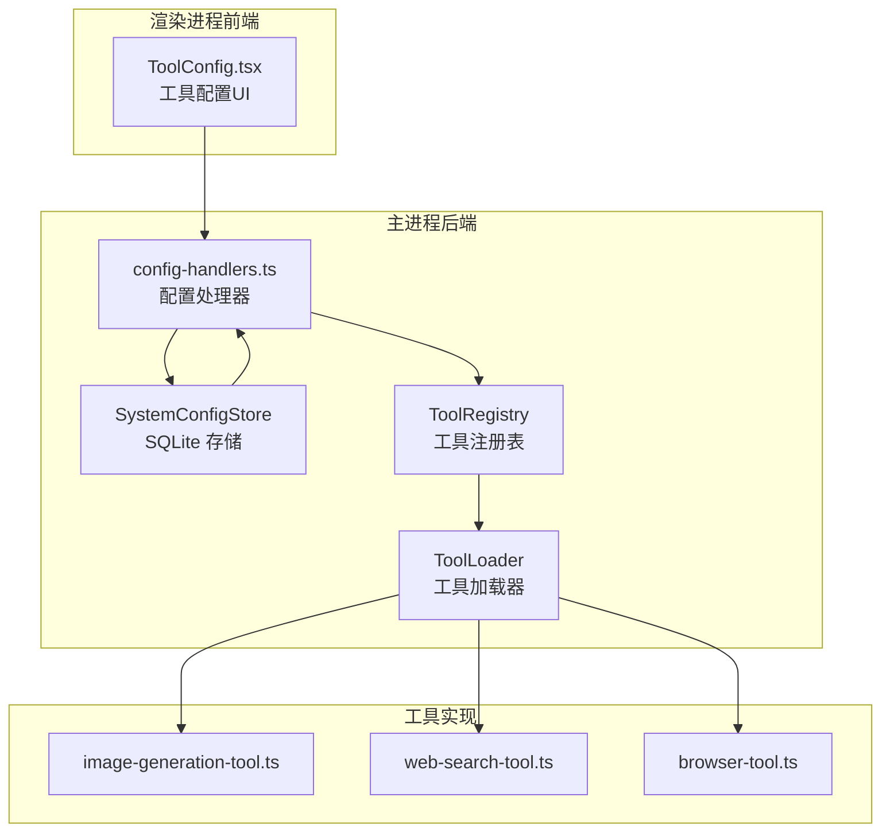
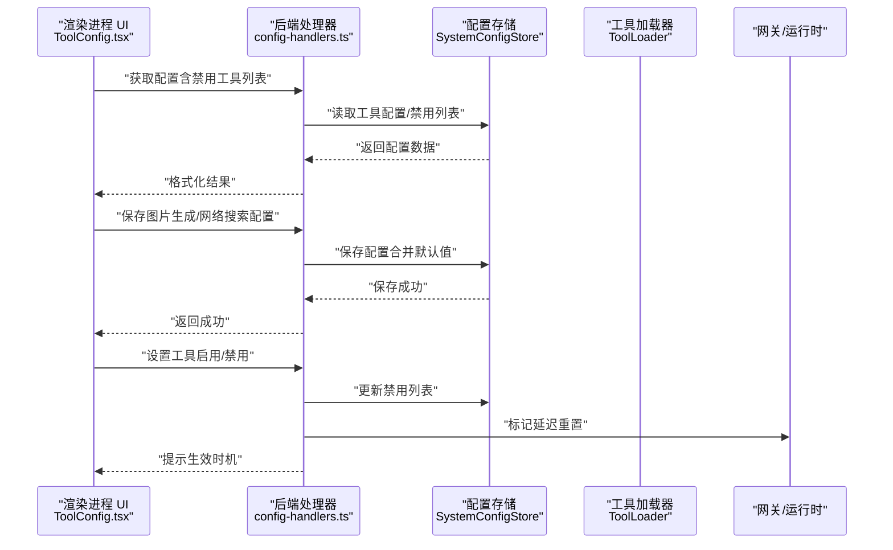
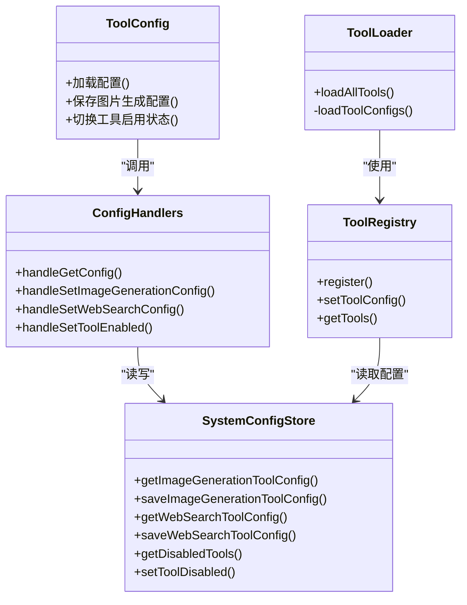

# 工具配置

<cite>
**本文引用的文件**
- [ToolConfig.tsx](file://src/renderer/components/settings/ToolConfig.tsx)
- [tool-config.ts](file://src/main/database/tool-config.ts)
- [system-config-store.ts](file://src/main/database/system-config-store.ts)
- [config-handlers.ts](file://src/main/tools/handlers/config-handlers.ts)
- [default-configs.ts](file://src/shared/config/default-configs.ts)
- [tool-registry.ts](file://src/main/tools/registry/tool-registry.ts)
- [tool-loader.ts](file://src/main/tools/registry/tool-loader.ts)
- [tool-names.ts](file://src/main/tools/tool-names.ts)
- [image-generation-tool.ts](file://src/main/tools/image-generation-tool.ts)
- [web-search-tool.ts](file://src/main/tools/web-search-tool.ts)
- [browser-tool.ts](file://src/main/tools/browser-tool.ts)
</cite>

## 目录
1. [简介](#简介)
2. [项目结构](#项目结构)
3. [核心组件](#核心组件)
4. [架构总览](#架构总览)
5. [详细组件分析](#详细组件分析)
6. [依赖关系分析](#依赖关系分析)
7. [性能考量](#性能考量)
8. [故障排除指南](#故障排除指南)
9. [结论](#结论)
10. [附录](#附录)

## 简介
本章节概述 史丽慧小助理 工具配置组件的目标与范围，包括：
- 支持的工具类别：图片生成、网络搜索、浏览器控制、日历读取/创建、邮件发送（通过 Skill 扩展）、工具启用/禁用管理等。
- 配置持久化与加载：前端通过统一的配置入口读取与保存，后端以 SQLite 存储为核心，配合处理器与工具加载器实现配置生效。
- 配置验证与约束：前端基础校验（必填项、格式），后端严格校验（API Key、地址、模型等），确保工具可用性与安全性。
- 生效机制：工具启用/禁用采用“延迟重置”策略，在当前对话完成后重载运行时工具集，避免中断任务。

## 项目结构
工具配置涉及三层协作：
- 前端设置页：提供工具配置 UI 与交互，负责加载/保存配置，并展示工具管理面板。
- 后端配置存储与处理器：负责配置的读取、合并默认值、持久化与对外接口。
- 工具加载与运行时：根据配置决定工具是否启用，动态加载工具插件并注入配置。

图表来源
- [ToolConfig.tsx:38-153](file://src/renderer/components/settings/ToolConfig.tsx#L38-L153)
- [system-config-store.ts:37-566](file://src/main/database/system-config-store.ts#L37-L566)
- [config-handlers.ts:29-83](file://src/main/tools/handlers/config-handlers.ts#L29-L83)
- [tool-registry.ts:36-310](file://src/main/tools/registry/tool-registry.ts#L36-L310)
- [tool-loader.ts:40-311](file://src/main/tools/registry/tool-loader.ts#L40-L311)
- [image-generation-tool.ts:183-364](file://src/main/tools/image-generation-tool.ts#L183-L364)
- [web-search-tool.ts:409-533](file://src/main/tools/web-search-tool.ts#L409-L533)
- [browser-tool.ts:171-800](file://src/main/tools/browser-tool.ts#L171-L800)

章节来源
- [ToolConfig.tsx:38-153](file://src/renderer/components/settings/ToolConfig.tsx#L38-L153)
- [system-config-store.ts:37-566](file://src/main/database/system-config-store.ts#L37-L566)
- [config-handlers.ts:29-83](file://src/main/tools/handlers/config-handlers.ts#L29-L83)
- [tool-registry.ts:36-310](file://src/main/tools/registry/tool-registry.ts#L36-L310)
- [tool-loader.ts:40-311](file://src/main/tools/registry/tool-loader.ts#L40-L311)

## 核心组件
- 前端工具配置页（ToolConfig.tsx）
  - 提供“图片生成”“网络搜索”“浏览器”“邮件发送”“工具管理”五个标签页。
  - 图片生成配置包含提供商选择、API 地址、模型 ID、API Key；前端校验必填项。
  - 工具管理支持勾选启用/取消禁用内置工具，保存后立即生效。
- 后端配置存储（SystemConfigStore）
  - 统一管理 SQLite 表：工具配置（图片生成、Web 搜索）、工具禁用列表、连接器配置等。
  - 提供读取/保存工具配置的方法，兼容历史字段迁移。
- 配置处理器（config-handlers.ts）
  - 提供获取/设置工作空间、模型、图片生成、Web 搜索等配置的接口。
  - 设置工具启用/禁用时，标记“延迟重置”，在当前对话结束后重载运行时工具集。
- 工具注册与加载（ToolRegistry/ToolLoader）
  - ToolRegistry 管理工具插件注册与配置注入。
  - ToolLoader 加载内置工具，读取工具禁用配置，按开关过滤工具实例。
- 工具实现
  - 图片生成工具：读取数据库配置，按提供商调用对应生成/解析能力。
  - 网络搜索工具：读取数据库配置，按提供商调用 Qwen/Gemini 搜索能力。
  - 浏览器工具：基于 agent-browser 插件，无需额外配置即可连接系统 Chrome。

章节来源
- [ToolConfig.tsx:19-25](file://src/renderer/components/settings/ToolConfig.tsx#L19-L25)
- [ToolConfig.tsx:117-153](file://src/renderer/components/settings/ToolConfig.tsx#L117-L153)
- [system-config-store.ts:401-423](file://src/main/database/system-config-store.ts#L401-L423)
- [config-handlers.ts:250-280](file://src/main/tools/handlers/config-handlers.ts#L250-L280)
- [tool-registry.ts:237-249](file://src/main/tools/registry/tool-registry.ts#L237-L249)
- [tool-loader.ts:77-99](file://src/main/tools/registry/tool-loader.ts#L77-L99)
- [image-generation-tool.ts:28-67](file://src/main/tools/image-generation-tool.ts#L28-L67)
- [web-search-tool.ts:24-54](file://src/main/tools/web-search-tool.ts#L24-L54)
- [browser-tool.ts:171-181](file://src/main/tools/browser-tool.ts#L171-L181)

## 架构总览
工具配置的端到端流程如下：

图表来源
- [ToolConfig.tsx:60-90](file://src/renderer/components/settings/ToolConfig.tsx#L60-L90)
- [config-handlers.ts:29-83](file://src/main/tools/handlers/config-handlers.ts#L29-L83)
- [config-handlers.ts:207-242](file://src/main/tools/handlers/config-handlers.ts#L207-L242)
- [config-handlers.ts:250-280](file://src/main/tools/handlers/config-handlers.ts#L250-L280)
- [system-config-store.ts:544-556](file://src/main/database/system-config-store.ts#L544-L556)
- [tool-loader.ts:112-114](file://src/main/tools/registry/tool-loader.ts#L112-L114)

## 详细组件分析

### 前端工具配置页（ToolConfig.tsx）
- 功能要点
  - 图片生成配置：提供提供商选择、API 地址、模型 ID、API Key 的输入与校验；支持“如何获取 API Key”的帮助弹窗。
  - 工具管理：列出可禁用的内置工具，勾选即启用，取消即禁用；保存后立即生效。
  - 并行加载：同时读取图片生成配置与禁用列表，避免重复加载。
- 验证规则
  - 图片生成保存前校验模型 ID、API 地址、API Key 三者均非空。
- 交互细节
  - 提供商变更时联动更新默认 API 地址与模型 ID。
  - 保存按钮带加载态，避免重复提交。

章节来源
- [ToolConfig.tsx:19-25](file://src/renderer/components/settings/ToolConfig.tsx#L19-L25)
- [ToolConfig.tsx:117-127](file://src/renderer/components/settings/ToolConfig.tsx#L117-L127)
- [ToolConfig.tsx:129-153](file://src/renderer/components/settings/ToolConfig.tsx#L129-L153)
- [ToolConfig.tsx:60-90](file://src/renderer/components/settings/ToolConfig.tsx#L60-L90)

### 后端配置存储与处理器
- SystemConfigStore
  - 负责初始化 SQLite 表（工具配置、禁用列表、连接器等），并提供读取/保存方法。
  - 兼容历史字段迁移（如为工具配置表添加 provider 字段）。
- config-handlers.ts
  - 获取配置：支持一次性获取全部配置（含禁用工具列表、浏览器工具状态等）。
  - 设置配置：工作空间、模型、图片生成、Web 搜索等配置均支持合并默认值后保存。
  - 设置工具启用/禁用：更新禁用列表后，标记“延迟重置”，避免中断当前任务。

章节来源
- [system-config-store.ts:82-225](file://src/main/database/system-config-store.ts#L82-L225)
- [system-config-store.ts:401-423](file://src/main/database/system-config-store.ts#L401-L423)
- [system-config-store.ts:544-556](file://src/main/database/system-config-store.ts#L544-L556)
- [config-handlers.ts:29-83](file://src/main/tools/handlers/config-handlers.ts#L29-L83)
- [config-handlers.ts:207-242](file://src/main/tools/handlers/config-handlers.ts#L207-L242)
- [config-handlers.ts:250-280](file://src/main/tools/handlers/config-handlers.ts#L250-L280)

### 工具注册与加载（ToolRegistry/ToolLoader）
- ToolRegistry
  - 维护插件注册表、已加载工具实例与工具配置映射。
  - 支持按配置禁用工具（disabled 状态）。
- ToolLoader
  - 从用户工作区与系统目录加载工具配置（tools-config.json），注入 ToolRegistry。
  - 根据禁用列表过滤内置工具，仅加载启用的工具实例。

章节来源
- [tool-registry.ts:36-310](file://src/main/tools/registry/tool-registry.ts#L36-L310)
- [tool-loader.ts:77-99](file://src/main/tools/registry/tool-loader.ts#L77-L99)
- [tool-loader.ts:112-114](file://src/main/tools/registry/tool-loader.ts#L112-L114)

### 图片生成工具（image-generation-tool.ts）
- 配置读取
  - 从 SystemConfigStore 严格读取图片生成配置，若缺失关键字段则抛错。
  - 根据 provider 或模型名判断提供商（gemini/qwen）。
- 执行流程
  - 支持生成与解析两种动作；根据提供商调用对应实现。
  - 输出图片保存至工作区图片目录或默认目录，返回保存路径。
- 参数与约束
  - 支持宽高比、分辨率、参考图片、输出路径等参数。
  - 对 AbortSignal 进行检查，支持取消。

章节来源
- [image-generation-tool.ts:28-67](file://src/main/tools/image-generation-tool.ts#L28-L67)
- [image-generation-tool.ts:183-364](file://src/main/tools/image-generation-tool.ts#L183-L364)

### 网络搜索工具（web-search-tool.ts）
- 配置读取
  - 从 SystemConfigStore 严格读取 Web 搜索配置，若缺失关键字段则抛错。
- 执行流程
  - 根据提供商选择 Qwen（enable_search）或 Gemini（Grounding with Google Search）调用。
  - 对查询文本长度进行限制，避免超长导致 API 失败或超时。
- 结果格式
  - 返回答案与来源列表，使用 Markdown 格式化输出。

章节来源
- [web-search-tool.ts:24-54](file://src/main/tools/web-search-tool.ts#L24-L54)
- [web-search-tool.ts:409-533](file://src/main/tools/web-search-tool.ts#L409-L533)

### 浏览器工具（browser-tool.ts）
- 配置与依赖
  - 无需额外配置，直接连接系统 Chrome（或 Docker 下的 Playwright Chromium）。
  - 通过 agent-browser 插件实现 CDP 连接与自动化操作。
- 核心能力
  - 打开网页、快照、点击、填充、截图、标签页管理、前进/后退/刷新等。
  - 强制使用“阅读模式”快照以获取完整文本与可交互元素列表。
- 安全与稳定性
  - Docker 模式下自动启动 Headless Chromium；非 Docker 模式下尝试启动系统 Chrome。
  - 对操作进行 AbortSignal 检查，支持取消。

章节来源
- [browser-tool.ts:171-181](file://src/main/tools/browser-tool.ts#L171-L181)
- [browser-tool.ts:215-361](file://src/main/tools/browser-tool.ts#L215-L361)
- [browser-tool.ts:387-467](file://src/main/tools/browser-tool.ts#L387-L467)

## 依赖关系分析

图表来源
- [ToolConfig.tsx:60-153](file://src/renderer/components/settings/ToolConfig.tsx#L60-L153)
- [system-config-store.ts:401-423](file://src/main/database/system-config-store.ts#L401-L423)
- [config-handlers.ts:29-83](file://src/main/tools/handlers/config-handlers.ts#L29-L83)
- [tool-registry.ts:237-249](file://src/main/tools/registry/tool-registry.ts#L237-L249)
- [tool-loader.ts:57-71](file://src/main/tools/registry/tool-loader.ts#L57-L71)

章节来源
- [ToolConfig.tsx:60-153](file://src/renderer/components/settings/ToolConfig.tsx#L60-L153)
- [system-config-store.ts:401-423](file://src/main/database/system-config-store.ts#L401-L423)
- [config-handlers.ts:29-83](file://src/main/tools/handlers/config-handlers.ts#L29-L83)
- [tool-registry.ts:237-249](file://src/main/tools/registry/tool-registry.ts#L237-L249)
- [tool-loader.ts:57-71](file://src/main/tools/registry/tool-loader.ts#L57-L71)

## 性能考量
- 配置读取与保存
  - 前端并行加载配置，减少等待时间。
  - 后端保存配置后立即返回，避免阻塞 UI。
- 工具加载与生效
  - 工具启用/禁用采用“延迟重置”，避免中断当前对话，提升用户体验。
- 网络搜索
  - 对查询文本长度进行限制，降低超时风险与无效请求。
- 浏览器工具
  - Docker 模式下使用 Headless Chromium，减少图形栈开销；非 Docker 模式连接系统 Chrome，避免额外进程启动成本。

## 故障排除指南
- 图片生成工具报错
  - 现象：提示未配置 API Key/地址/模型。
  - 处理：在“图片生成”标签页补齐配置，保存后重试。
  - 参考：工具实现严格校验配置完整性。
- 网络搜索无结果或超时
  - 现象：返回空回答或超时。
  - 处理：缩短查询文本、确认 API Key/地址正确、检查网络；必要时切换提供商。
- 浏览器工具无法连接
  - 现象：提示无法连接 Chrome。
  - 处理：Docker 模式下确保 Playwright 已安装并可启动 Chromium；非 Docker 模式确保系统已安装 Chrome 并允许远程调试。
- 工具启用/禁用未生效
  - 现象：保存后仍显示旧状态。
  - 处理：等待当前对话结束后，系统会自动重载工具集；也可手动结束当前任务后重试。

章节来源
- [image-generation-tool.ts:35-51](file://src/main/tools/image-generation-tool.ts#L35-L51)
- [web-search-tool.ts:434-439](file://src/main/tools/web-search-tool.ts#L434-L439)
- [browser-tool.ts:254-361](file://src/main/tools/browser-tool.ts#L254-L361)
- [config-handlers.ts:267-271](file://src/main/tools/handlers/config-handlers.ts#L267-L271)

## 结论
工具配置组件通过前后端协同，实现了对内置工具的灵活启用/禁用、参数配置与即时生效。前端提供直观的 UI 与校验，后端以 SQLite 存储为核心，结合处理器与工具加载器，确保配置在运行时正确注入并按约定生效。通过“延迟重置”机制与严格的配置校验，系统在保证功能可用性的同时兼顾了稳定性与安全性。

## 附录
- 默认配置常量
  - 提供商预设（史丽慧小助理/Qwen/Gemini/DeepSeek/MiniMax/自定义）与默认模型、API 地址等。
  - 图片生成与 Web 搜索工具的默认配置。
- 工具名称常量
  - 统一管理所有工具名称，避免硬编码，便于工具启用/禁用与路由调用。

章节来源
- [default-configs.ts:11-54](file://src/shared/config/default-configs.ts#L11-L54)
- [default-configs.ts:61-98](file://src/shared/config/default-configs.ts#L61-L98)
- [default-configs.ts:103-132](file://src/shared/config/default-configs.ts#L103-L132)
- [tool-names.ts:8-94](file://src/main/tools/tool-names.ts#L8-L94)