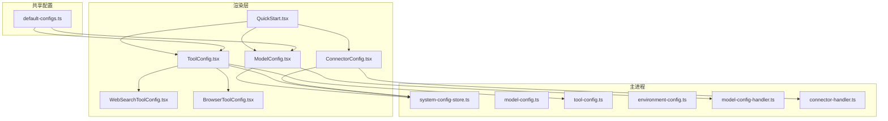
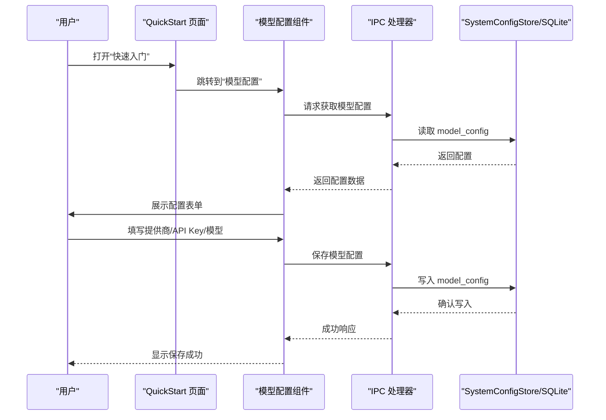
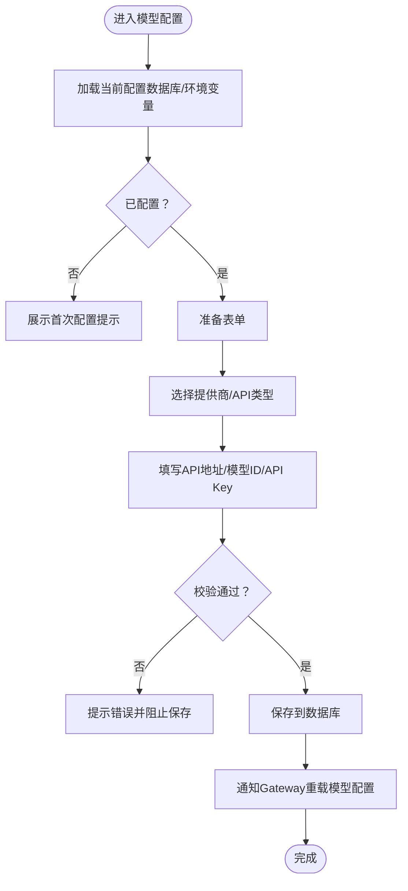
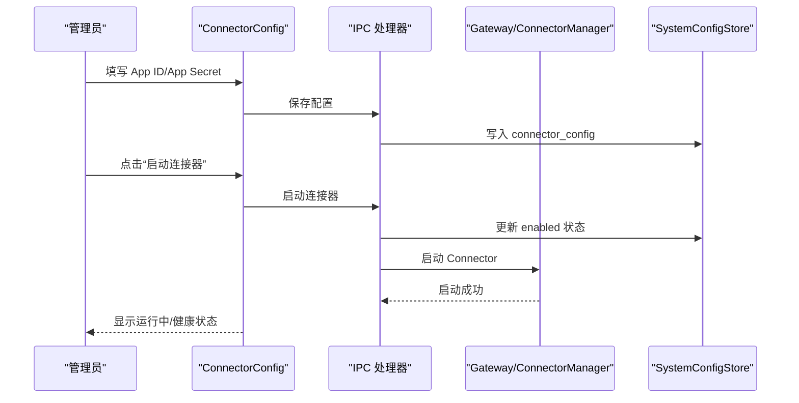
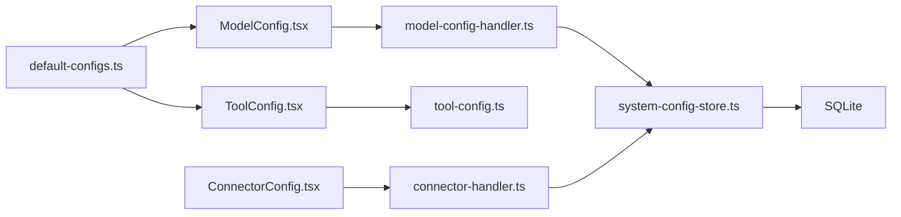

# 快速入门配置

<cite>
**本文档引用的文件**
- [QuickStart.tsx](file://src/renderer/components/settings/QuickStart.tsx)
- [ModelConfig.tsx](file://src/renderer/components/settings/ModelConfig.tsx)
- [ToolConfig.tsx](file://src/renderer/components/settings/ToolConfig.tsx)
- [ConnectorConfig.tsx](file://src/renderer/components/settings/ConnectorConfig.tsx)
- [WebSearchToolConfig.tsx](file://src/renderer/components/settings/WebSearchToolConfig.tsx)
- [BrowserToolConfig.tsx](file://src/renderer/components/settings/BrowserToolConfig.tsx)
- [default-configs.ts](file://src/shared/config/default-configs.ts)
- [config.ts](file://src/main/config.ts)
- [system-config-store.ts](file://src/main/database/system-config-store.ts)
- [model-config.ts](file://src/main/database/model-config.ts)
- [tool-config.ts](file://src/main/database/tool-config.ts)
- [environment-config.ts](file://src/main/database/environment-config.ts)
- [model-config-handler.ts](file://src/main/ipc/model-config-handler.ts)
- [connector-handler.ts](file://src/main/ipc/connector-handler.ts)
</cite>

## 目录
1. [简介](#简介)
2. [项目结构](#项目结构)
3. [核心组件](#核心组件)
4. [架构总览](#架构总览)
5. [详细组件分析](#详细组件分析)
6. [依赖关系分析](#依赖关系分析)
7. [性能考虑](#性能考虑)
8. [故障排除指南](#故障排除指南)
9. [结论](#结论)

## 简介
本文件面向 DeepBot 的“快速入门配置”组件，旨在帮助新用户以最短路径完成系统初始化与关键配置。内容覆盖：
- 快速入门页面的交互设计与导航逻辑
- 模型选择与配置流程
- 工具启用与关键设置项的快速配置方法
- 外部通讯（飞书）连接器配置
- 环境依赖安装与验证
- 常见问题与最佳实践

## 项目结构
快速入门配置涉及渲染层组件与主进程配置存储、IPC 处理器的协同工作：
- 渲染层：QuickStart.tsx 作为入口页面，聚合模型、工具、连接器等配置组件
- 主进程：SystemConfigStore 负责 SQLite 持久化；各配置模块提供 CRUD；IPC 处理器桥接前后端
- 共享配置：default-configs.ts 提供提供商预设与默认值

图表来源
- [QuickStart.tsx:35-132](file://src/renderer/components/settings/QuickStart.tsx#L35-L132)
- [ModelConfig.tsx:31-84](file://src/renderer/components/settings/ModelConfig.tsx#L31-L84)
- [ToolConfig.tsx:38-90](file://src/renderer/components/settings/ToolConfig.tsx#L38-L90)
- [ConnectorConfig.tsx:78-148](file://src/renderer/components/settings/ConnectorConfig.tsx#L78-L148)
- [WebSearchToolConfig.tsx:24-50](file://src/renderer/components/settings/WebSearchToolConfig.tsx#L24-L50)
- [BrowserToolConfig.tsx:13-21](file://src/renderer/components/settings/BrowserToolConfig.tsx#L13-L21)
- [default-configs.ts:11-54](file://src/shared/config/default-configs.ts#L11-L54)
- [system-config-store.ts:37-70](file://src/main/database/system-config-store.ts#L37-L70)
- [model-config.ts:60-95](file://src/main/database/model-config.ts#L60-L95)
- [tool-config.ts:13-32](file://src/main/database/tool-config.ts#L13-L32)
- [environment-config.ts:11-27](file://src/main/database/environment-config.ts#L11-L27)
- [model-config-handler.ts:40-61](file://src/main/ipc/model-config-handler.ts#L40-L61)
- [connector-handler.ts:65-104](file://src/main/ipc/connector-handler.ts#L65-L104)

章节来源
- [QuickStart.tsx:35-132](file://src/renderer/components/settings/QuickStart.tsx#L35-L132)
- [default-configs.ts:11-54](file://src/shared/config/default-configs.ts#L11-L54)
- [system-config-store.ts:37-70](file://src/main/database/system-config-store.ts#L37-L70)

## 核心组件
- 快速入门页面（QuickStart.tsx）：提供“快速配置”“环境依赖”“可用工具”“外部通讯”“Skill 使用指南”“外部工具使用指南”“指令系统”“推荐工具和 Skill”等模块，通过滚动定位与网格布局提升新用户的上手效率。
- 模型配置（ModelConfig.tsx）：支持多家提供商预设与自定义 API 类型，提供 API Key 获取指引与上下文窗口推断。
- 工具配置（ToolConfig.tsx）：统一管理图片生成、网络搜索、浏览器、邮件等工具的配置与开关。
- 连接器配置（ConnectorConfig.tsx）：飞书连接器的完整配置流程，包含 Pairing 管理与健康检查。
- 默认配置（default-configs.ts）：集中管理提供商预设、默认模型与工具配置。

章节来源
- [QuickStart.tsx:134-206](file://src/renderer/components/settings/QuickStart.tsx#L134-L206)
- [ModelConfig.tsx:31-84](file://src/renderer/components/settings/ModelConfig.tsx#L31-L84)
- [ToolConfig.tsx:38-90](file://src/renderer/components/settings/ToolConfig.tsx#L38-L90)
- [ConnectorConfig.tsx:78-148](file://src/renderer/components/settings/ConnectorConfig.tsx#L78-L148)
- [default-configs.ts:11-54](file://src/shared/config/default-configs.ts#L11-L54)

## 架构总览
快速入门配置的端到端流程如下：

图表来源
- [QuickStart.tsx:35-132](file://src/renderer/components/settings/QuickStart.tsx#L35-L132)
- [ModelConfig.tsx:58-84](file://src/renderer/components/settings/ModelConfig.tsx#L58-L84)
- [model-config-handler.ts:42-61](file://src/main/ipc/model-config-handler.ts#L42-L61)
- [system-config-store.ts:383-397](file://src/main/database/system-config-store.ts#L383-L397)

## 详细组件分析

### 快速入门页面（QuickStart）
- 设计目标：以“步骤化 + 导航目录”的方式降低新用户的学习成本，突出“主大模型配置”“工具配置”“环境依赖”三大关键步骤。
- 交互逻辑：
  - 导航目录支持平滑滚动到对应章节
  - “快速配置”提供三步走流程：配置主大模型 → 配置工具 → 安装环境依赖
  - “环境依赖”提供 Python/Chrome/Node.js 的快速安装与验证建议
  - “外部通讯（飞书）”提供连接器配置与 Pairing 管理说明
  - “Skill 使用指南”“外部工具使用指南”“指令系统”“推荐工具和 Skill”等模块增强扩展能力
- 用户体验：采用卡片化布局、图标与颜色区分模块，提供“如何获取 API Key”“如何安装 Python”等实用提示。

章节来源
- [QuickStart.tsx:35-132](file://src/renderer/components/settings/QuickStart.tsx#L35-L132)
- [QuickStart.tsx:134-206](file://src/renderer/components/settings/QuickStart.tsx#L134-L206)
- [QuickStart.tsx:209-287](file://src/renderer/components/settings/QuickStart.tsx#L209-L287)
- [QuickStart.tsx:348-423](file://src/renderer/components/settings/QuickStart.tsx#L348-L423)
- [QuickStart.tsx:425-525](file://src/renderer/components/settings/QuickStart.tsx#L425-L525)
- [QuickStart.tsx:527-608](file://src/renderer/components/settings/QuickStart.tsx#L527-L608)
- [QuickStart.tsx:610-792](file://src/renderer/components/settings/QuickStart.tsx#L610-L792)
- [QuickStart.tsx:794-806](file://src/renderer/components/settings/QuickStart.tsx#L794-L806)

### 模型配置（ModelConfig）
- 配置项与优先级：
  - 优先使用 UI 保存的数据库配置（SystemConfigStore）
  - 其次回退到环境变量（AI_API_KEY、AI_BASE_URL、AI_MODEL_ID 等）
  - 若均缺失，抛出错误提示用户配置
- 关键流程：
  - 提供商选择（DeepBot/Qwen/DeepSeek/Gemini/MiniMax/custom）
  - API 类型（OpenAI 兼容/Gemini 原生）
  - API Key 获取指引（扫码/官网申请）
  - 上下文窗口：支持自动推断与手动覆盖
  - 保存后触发 Gateway 重载与前端提示
- 错误处理：必填项校验、保存异常提示、首次配置延迟关闭窗口

图表来源
- [ModelConfig.tsx:58-84](file://src/renderer/components/settings/ModelConfig.tsx#L58-L84)
- [ModelConfig.tsx:104-149](file://src/renderer/components/settings/ModelConfig.tsx#L104-L149)
- [model-config-handler.ts:64-112](file://src/main/ipc/model-config-handler.ts#L64-L112)
- [config.ts:38-83](file://src/main/config.ts#L38-L83)

章节来源
- [ModelConfig.tsx:31-84](file://src/renderer/components/settings/ModelConfig.tsx#L31-L84)
- [ModelConfig.tsx:104-149](file://src/renderer/components/settings/ModelConfig.tsx#L104-L149)
- [config.ts:38-83](file://src/main/config.ts#L38-L83)
- [model-config-handler.ts:64-112](file://src/main/ipc/model-config-handler.ts#L64-L112)

### 工具配置（ToolConfig）
- 管理范围：图片生成、网络搜索、浏览器、日历、邮件等工具
- 工具管理：支持启用/禁用内置工具，优先使用已安装的 Skill
- 图片生成与网络搜索：提供提供商预设（DeepBot/Qwen/Gemini）、API 地址与模型 ID、API Key
- 浏览器工具：Electron 模式提供“快速启动 Chrome（端口 9222）”，Docker 模式说明无头 Chromium 安装与 Playwright 使用

章节来源
- [ToolConfig.tsx:38-90](file://src/renderer/components/settings/ToolConfig.tsx#L38-L90)
- [ToolConfig.tsx:117-153](file://src/renderer/components/settings/ToolConfig.tsx#L117-L153)
- [WebSearchToolConfig.tsx:24-50](file://src/renderer/components/settings/WebSearchToolConfig.tsx#L24-L50)
- [WebSearchToolConfig.tsx:62-81](file://src/renderer/components/settings/WebSearchToolConfig.tsx#L62-L81)
- [BrowserToolConfig.tsx:13-21](file://src/renderer/components/settings/BrowserToolConfig.tsx#L13-L21)
- [BrowserToolConfig.tsx:23-37](file://src/renderer/components/settings/BrowserToolConfig.tsx#L23-L37)

### 连接器配置（ConnectorConfig）
- 飞书连接器：提供 App ID/App Secret 配置、启动/停止、健康检查、Pairing 管理（批准/设为管理员/删除）
- 配置流程：先在 DeepBot 填写凭证并启动，再在飞书开放平台配置事件订阅与权限
- Pairing 管理：管理员可批准用户配对码、设置管理员、删除记录；支持待批准数量广播

图表来源
- [ConnectorConfig.tsx:267-331](file://src/renderer/components/settings/ConnectorConfig.tsx#L267-L331)
- [connector-handler.ts:199-231](file://src/main/ipc/connector-handler.ts#L199-L231)
- [system-config-store.ts:445-463](file://src/main/database/system-config-store.ts#L445-L463)

章节来源
- [ConnectorConfig.tsx:78-148](file://src/renderer/components/settings/ConnectorConfig.tsx#L78-L148)
- [ConnectorConfig.tsx:267-331](file://src/renderer/components/settings/ConnectorConfig.tsx#L267-L331)
- [connector-handler.ts:199-231](file://src/main/ipc/connector-handler.ts#L199-L231)

### 默认配置与优先级
- 默认配置：default-configs.ts 提供多家提供商的预设（URL、默认模型、API 类型），以及工具默认配置
- 配置优先级：数据库配置 > 环境变量 > 抛错提示
- 模型上下文窗口：支持从模型 ID 推断，也可手动覆盖

章节来源
- [default-configs.ts:11-54](file://src/shared/config/default-configs.ts#L11-L54)
- [default-configs.ts:102-132](file://src/shared/config/default-configs.ts#L102-L132)
- [config.ts:38-83](file://src/main/config.ts#L38-L83)
- [model-config.ts:60-95](file://src/main/database/model-config.ts#L60-L95)

## 依赖关系分析
- 渲染层组件依赖共享配置（default-configs.ts）进行提供商预设与默认值填充
- 渲染层通过 IPC 通道与主进程交互，主进程使用 SystemConfigStore 持久化配置
- 模型配置保存后触发 Gateway 重载，确保运行时生效
- 连接器配置变更时，若连接器正在运行则先停止再应用新配置

图表来源
- [default-configs.ts:11-54](file://src/shared/config/default-configs.ts#L11-L54)
- [ModelConfig.tsx:31-42](file://src/renderer/components/settings/ModelConfig.tsx#L31-L42)
- [ToolConfig.tsx:8-11](file://src/renderer/components/settings/ToolConfig.tsx#L8-L11)
- [model-config-handler.ts:40-61](file://src/main/ipc/model-config-handler.ts#L40-L61)
- [tool-config.ts:13-32](file://src/main/database/tool-config.ts#L13-L32)
- [connector-handler.ts:65-104](file://src/main/ipc/connector-handler.ts#L65-104)
- [system-config-store.ts:37-70](file://src/main/database/system-config-store.ts#L37-L70)

章节来源
- [default-configs.ts:11-54](file://src/shared/config/default-configs.ts#L11-L54)
- [system-config-store.ts:37-70](file://src/main/database/system-config-store.ts#L37-L70)

## 性能考虑
- 数据库缓存：模型配置在内存中缓存，保存/删除后清空缓存，避免重复查询与日志打印
- WAL 模式：SQLite 使用 WAL 模式并显式 checkpoint，确保写入及时持久化
- 健康检查：连接器健康状态采用“检查中/健康/不健康”状态机，避免重复检查
- 并发加载：工具配置中图片生成与禁用工具列表采用 Promise.all 并行加载

章节来源
- [model-config.ts:14-16](file://src/main/database/model-config.ts#L14-L16)
- [model-config.ts:121-126](file://src/main/database/model-config.ts#L121-L126)
- [ConnectorConfig.tsx:124-141](file://src/renderer/components/settings/ConnectorConfig.tsx#L124-L141)
- [ToolConfig.tsx:63-66](file://src/renderer/components/settings/ToolConfig.tsx#L63-L66)

## 故障排除指南
- 模型未配置错误：当数据库与环境变量均无有效配置时，抛出“模型未配置，请在系统设置中配置 AI 模型”错误
- API Key/地址/模型为空：保存前进行必填项校验，阻止无效配置
- 连接器启动失败：检查凭证、事件订阅与权限配置；确认端口未被占用；必要时先停止再启动
- Pairing 记录异常：核对配对码、用户状态与管理员权限；通过“批准/设为管理员/删除”修复

章节来源
- [config.ts:68-72](file://src/main/config.ts#L68-L72)
- [ModelConfig.tsx:104-119](file://src/renderer/components/settings/ModelConfig.tsx#L104-L119)
- [ConnectorConfig.tsx:295-331](file://src/renderer/components/settings/ConnectorConfig.tsx#L295-L331)
- [connector-handler.ts:325-361](file://src/main/ipc/connector-handler.ts#L325-L361)

## 结论
快速入门配置通过“步骤化引导 + 一键直达”的交互设计，将新用户的上手路径压缩至最小。配合默认配置、优先级策略与 IPC 持久化机制，既能满足快速部署，也能保证配置的可维护性与安全性。建议在首次使用时优先完成“主大模型配置”“工具启用”“环境依赖安装”，随后按需配置“外部通讯（飞书）”与“Skill/外部工具”。