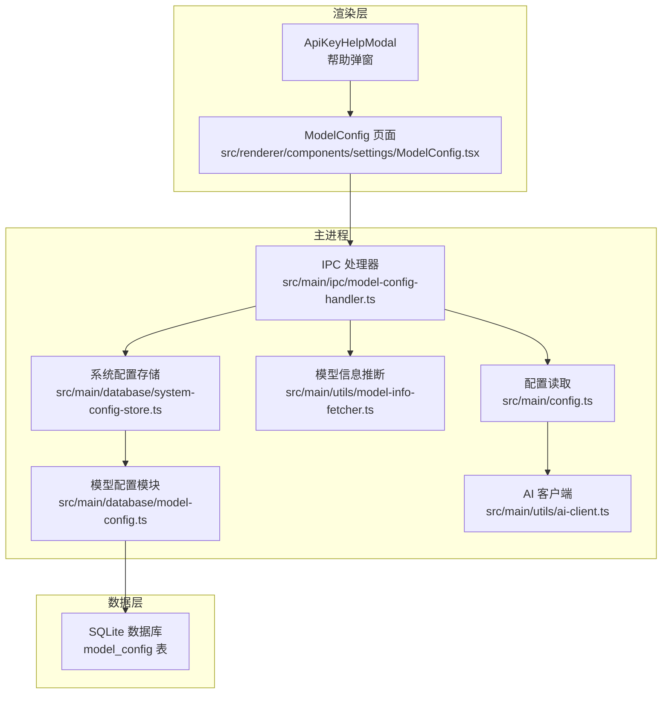
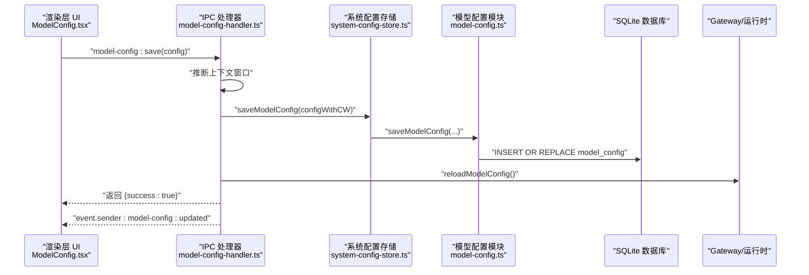
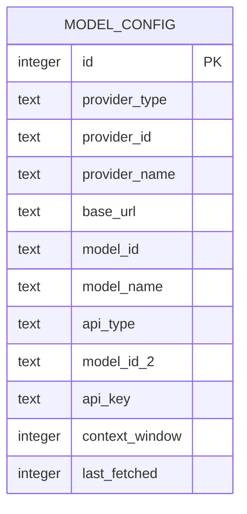
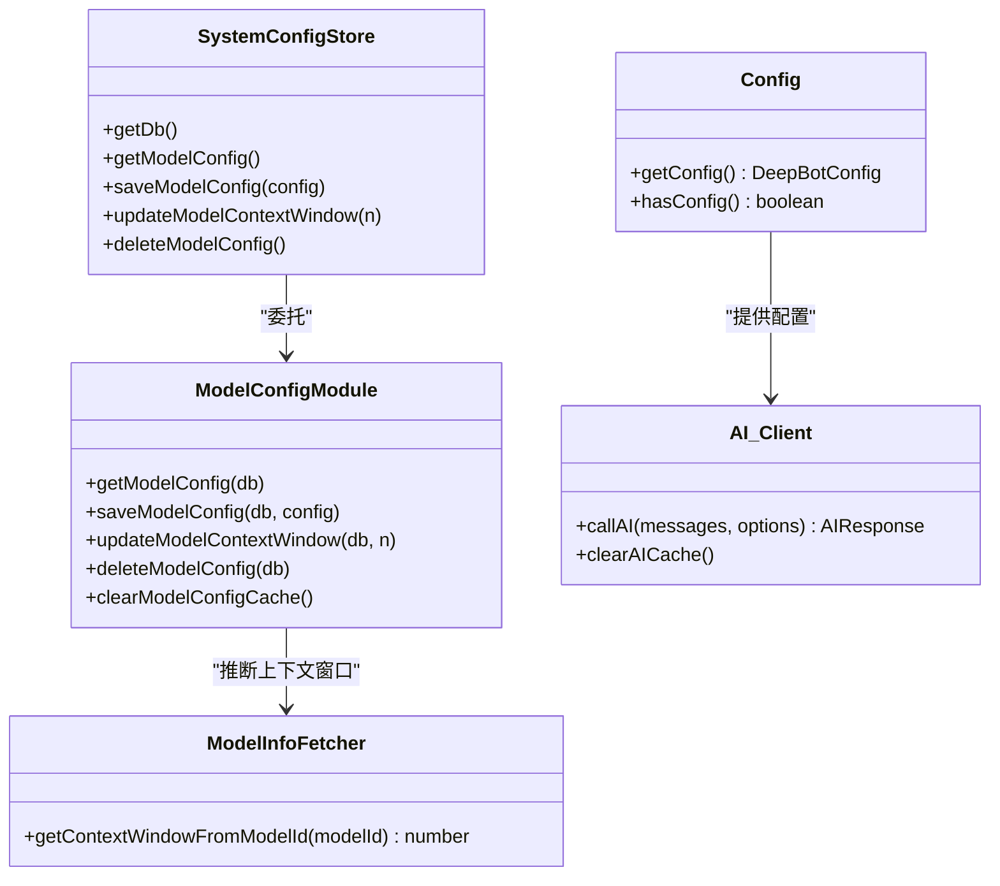

# 模型配置

<cite>
**本文引用的文件**
- [src/renderer/components/settings/ModelConfig.tsx](file://src/renderer/components/settings/ModelConfig.tsx)
- [src/main/ipc/model-config-handler.ts](file://src/main/ipc/model-config-handler.ts)
- [src/shared/config/default-configs.ts](file://src/shared/config/default-configs.ts)
- [src/main/database/model-config.ts](file://src/main/database/model-config.ts)
- [src/main/utils/model-info-fetcher.ts](file://src/main/utils/model-info-fetcher.ts)
- [src/types/ipc.ts](file://src/types/ipc.ts)
- [src/main/database/system-config-store.ts](file://src/main/database/system-config-store.ts)
- [src/main/utils/ai-client.ts](file://src/main/utils/ai-client.ts)
- [src/main/config.ts](file://src/main/config.ts)
- [src/shared/utils/text-utils.ts](file://src/shared/utils/text-utils.ts)
- [src/renderer/api/web-client.ts](file://src/renderer/api/web-client.ts)
</cite>

## 目录
1. [简介](#简介)
2. [项目结构](#项目结构)
3. [核心组件](#核心组件)
4. [架构总览](#架构总览)
5. [详细组件分析](#详细组件分析)
6. [依赖关系分析](#依赖关系分析)
7. [性能考量](#性能考量)
8. [故障排查指南](#故障排查指南)
9. [结论](#结论)
10. [附录](#附录)

## 简介
本章节面向 DeepBot 的“模型配置”页面，系统性说明其功能、实现与运行机制。内容覆盖：
- 支持的模型提供商与类型（Qwen、DeepSeek、Gemini、MiniMax、DeepBot 自研、自定义）
- 参数调整与校验（API 地址、模型 ID、API Key、上下文窗口、快速模型等）
- 配置保存流程与错误处理
- 模型切换与上下文窗口推断机制
- 安全与隐私保护（API Key 存储策略、最小暴露原则）
- 性能优化与最佳实践（连接池、缓存、快速模型）

## 项目结构
模型配置涉及三层协作：
- 渲染层（Renderer）：提供图形界面与用户交互，负责加载/保存配置、展示提示与帮助
- 主进程（Main）：IPC 处理器负责持久化、上下文窗口推断、配置更新通知、连接测试
- 数据层（Database）：SQLite 存储模型配置，支持环境变量回退与迁移

**图表来源**
- [src/renderer/components/settings/ModelConfig.tsx:1-432](file://src/renderer/components/settings/ModelConfig.tsx#L1-L432)
- [src/main/ipc/model-config-handler.ts:1-228](file://src/main/ipc/model-config-handler.ts#L1-L228)
- [src/main/database/system-config-store.ts:1-576](file://src/main/database/system-config-store.ts#L1-L576)
- [src/main/database/model-config.ts:1-162](file://src/main/database/model-config.ts#L1-L162)
- [src/main/utils/model-info-fetcher.ts:1-84](file://src/main/utils/model-info-fetcher.ts#L1-L84)
- [src/main/config.ts:1-108](file://src/main/config.ts#L1-L108)
- [src/main/utils/ai-client.ts:1-365](file://src/main/utils/ai-client.ts#L1-L365)

**章节来源**
- [src/renderer/components/settings/ModelConfig.tsx:1-432](file://src/renderer/components/settings/ModelConfig.tsx#L1-L432)
- [src/main/ipc/model-config-handler.ts:1-228](file://src/main/ipc/model-config-handler.ts#L1-L228)
- [src/main/database/system-config-store.ts:1-576](file://src/main/database/system-config-store.ts#L1-L576)
- [src/main/database/model-config.ts:1-162](file://src/main/database/model-config.ts#L1-L162)
- [src/main/utils/model-info-fetcher.ts:1-84](file://src/main/utils/model-info-fetcher.ts#L1-L84)
- [src/main/config.ts:1-108](file://src/main/config.ts#L1-L108)
- [src/main/utils/ai-client.ts:1-365](file://src/main/utils/ai-client.ts#L1-L365)

## 核心组件
- 模型配置页面（React 组件）
  - 提供提供商选择、API 类型、API 地址、模型 ID、快速模型 ID、API Key、上下文窗口等输入
  - 保存时进行基础必填校验，并通过 IPC 调用保存
  - 首次配置时提供提示，来自环境变量时显示提示
- IPC 模型配置处理器
  - 提供“获取配置”“保存配置”“测试配置”三类 IPC 接口
  - 保存时自动推断上下文窗口，写入数据库并通知前端更新
- 系统配置存储与模型配置模块
  - 优先读取数据库配置；若无则回退至环境变量
  - 提供保存、更新上下文窗口、删除配置等能力
- 模型信息推断工具
  - 基于模型 ID 的模糊匹配推断上下文窗口大小
- 配置读取与 AI 客户端
  - 统一读取当前配置，支持快速模型切换
  - AI 客户端采用连接池与缓存，提升性能并减少重复初始化

**章节来源**
- [src/renderer/components/settings/ModelConfig.tsx:13-149](file://src/renderer/components/settings/ModelConfig.tsx#L13-L149)
- [src/main/ipc/model-config-handler.ts:40-227](file://src/main/ipc/model-config-handler.ts#L40-L227)
- [src/main/database/system-config-store.ts:383-397](file://src/main/database/system-config-store.ts#L383-L397)
- [src/main/database/model-config.ts:60-134](file://src/main/database/model-config.ts#L60-L134)
- [src/main/utils/model-info-fetcher.ts:13-83](file://src/main/utils/model-info-fetcher.ts#L13-L83)
- [src/main/config.ts:38-83](file://src/main/config.ts#L38-L83)
- [src/main/utils/ai-client.ts:99-187](file://src/main/utils/ai-client.ts#L99-L187)

## 架构总览
以下序列图展示“保存配置”的端到端流程：

**图表来源**
- [src/renderer/components/settings/ModelConfig.tsx:104-149](file://src/renderer/components/settings/ModelConfig.tsx#L104-L149)
- [src/main/ipc/model-config-handler.ts:64-112](file://src/main/ipc/model-config-handler.ts#L64-L112)
- [src/main/database/system-config-store.ts:387-389](file://src/main/database/system-config-store.ts#L387-L389)
- [src/main/database/model-config.ts:100-134](file://src/main/database/model-config.ts#L100-L134)

## 详细组件分析

### 模型配置页面（渲染层）
- 功能要点
  - 提供提供商下拉选择（DeepBot、Qwen、DeepSeek、Gemini、MiniMax、自定义）
  - 自定义模式下可切换 API 类型（OpenAI 兼容 vs Google 原生）
  - 输入 API 地址、主模型 ID、可选快速模型 ID、API Key、上下文窗口
  - 保存前进行必填校验，成功后重新加载配置并提示
  - 首次配置与来自环境变量的配置分别提示
- 交互细节
  - DeepBot 模式下主模型 ID 支持下拉选择与手动输入
  - 上下文窗口留空则自动推断
  - API Key 输入框为密码类型，提示本地加密存储

**章节来源**
- [src/renderer/components/settings/ModelConfig.tsx:31-432](file://src/renderer/components/settings/ModelConfig.tsx#L31-L432)
- [src/shared/config/default-configs.ts:11-54](file://src/shared/config/default-configs.ts#L11-L54)

### IPC 模型配置处理器（主进程）
- 接口职责
  - 获取配置：返回数据库或环境变量配置
  - 保存配置：推断上下文窗口、写入数据库、触发 Gateway 重载、通知前端
  - 测试配置：校验必填项，构造模型并发送测试请求，验证响应
- 关键行为
  - 上下文窗口推断：若用户未设置，则基于模型 ID 的模糊匹配计算
  - Gateway 重载：保存成功后主动通知运行时刷新配置
  - 错误处理：捕获异常并返回结构化错误信息

**章节来源**
- [src/main/ipc/model-config-handler.ts:40-227](file://src/main/ipc/model-config-handler.ts#L40-L227)
- [src/main/utils/model-info-fetcher.ts:13-83](file://src/main/utils/model-info-fetcher.ts#L13-L83)

### 系统配置存储与模型配置模块
- 优先级与回退
  - 优先使用数据库配置（UI 设置）
  - 数据库无配置时回退到环境变量（仅当三要素齐全）
- 数据库设计
  - model_config 表包含提供商类型、API 类型、主/快速模型 ID、API Key、上下文窗口、最后获取时间等字段
  - 支持迁移：自动补齐缺失列（如 provider_type、context_window、api_type、model_id_2）
- 缓存与一致性
  - 内存缓存避免重复查询
  - 保存后强制同步 WAL 并清理缓存，保证读取一致性

**章节来源**
- [src/main/database/system-config-store.ts:104-135](file://src/main/database/system-config-store.ts#L104-L135)
- [src/main/database/system-config-store.ts:247-289](file://src/main/database/system-config-store.ts#L247-L289)
- [src/main/database/model-config.ts:24-95](file://src/main/database/model-config.ts#L24-L95)
- [src/main/database/model-config.ts:100-134](file://src/main/database/model-config.ts#L100-L134)

### 模型信息推断工具
- 策略
  - 基于模型 ID 的字符串匹配，对主流模型族给出合理上下文窗口估计
  - 未知模型返回默认值，便于后续人工修正
- 用途
  - 保存配置时自动填充上下文窗口，减少用户干预

**章节来源**
- [src/main/utils/model-info-fetcher.ts:13-83](file://src/main/utils/model-info-fetcher.ts#L13-L83)

### 配置读取与 AI 客户端
- 配置读取
  - 优先数据库配置；其次环境变量；均无则抛错
  - 支持快速模型（modelId2）按需切换
- AI 客户端
  - 连接池与缓存：复用 Model 实例与 HTTP 连接，降低冷启动成本
  - 统一错误处理与超时控制
  - 特殊处理：移除 <think> 标签，过滤推理过程

**章节来源**
- [src/main/config.ts:38-83](file://src/main/config.ts#L38-L83)
- [src/main/utils/ai-client.ts:99-187](file://src/main/utils/ai-client.ts#L99-L187)
- [src/main/utils/ai-client.ts:196-365](file://src/main/utils/ai-client.ts#L196-L365)
- [src/shared/utils/text-utils.ts:22-37](file://src/shared/utils/text-utils.ts#L22-L37)

### 数据模型（SQLite）

**图表来源**
- [src/main/database/system-config-store.ts:104-119](file://src/main/database/system-config-store.ts#L104-L119)

## 依赖关系分析
- 渲染层依赖
  - IPC 通道：model-config:get/save/test
  - 默认提供商预设：PROVIDER_PRESETS
- 主进程依赖
  - SystemConfigStore -> model-config 模块 -> SQLite
  - model-info-fetcher：上下文窗口推断
  - config：统一读取当前配置
  - ai-client：连接池与缓存
- 类关系（简化）

**图表来源**
- [src/main/database/system-config-store.ts:383-397](file://src/main/database/system-config-store.ts#L383-L397)
- [src/main/database/model-config.ts:60-134](file://src/main/database/model-config.ts#L60-L134)
- [src/main/utils/model-info-fetcher.ts:13-83](file://src/main/utils/model-info-fetcher.ts#L13-L83)
- [src/main/config.ts:38-83](file://src/main/config.ts#L38-L83)
- [src/main/utils/ai-client.ts:99-187](file://src/main/utils/ai-client.ts#L99-L187)

**章节来源**
- [src/types/ipc.ts:42-46](file://src/types/ipc.ts#L42-L46)
- [src/main/database/system-config-store.ts:383-397](file://src/main/database/system-config-store.ts#L383-L397)
- [src/main/database/model-config.ts:60-134](file://src/main/database/model-config.ts#L60-L134)
- [src/main/utils/model-info-fetcher.ts:13-83](file://src/main/utils/model-info-fetcher.ts#L13-L83)
- [src/main/config.ts:38-83](file://src/main/config.ts#L38-L83)
- [src/main/utils/ai-client.ts:99-187](file://src/main/utils/ai-client.ts#L99-L187)

## 性能考量
- 连接池与缓存
  - AI 客户端缓存 Model 实例与 pi-ai 模块，避免重复导入与初始化
  - 配置变更时清空缓存，确保一致性
- 上下文窗口推断
  - 保存时自动推断，减少用户输入与查询成本
- 数据持久化
  - SQLite 使用 WAL 模式并主动 checkpoint，保障写入及时性与可靠性
- 快速模型
  - 通过 modelId2 提供轻量级模型，适合低延迟场景；AI 客户端按需切换

**章节来源**
- [src/main/utils/ai-client.ts:56-91](file://src/main/utils/ai-client.ts#L56-L91)
- [src/main/utils/ai-client.ts:159-187](file://src/main/utils/ai-client.ts#L159-L187)
- [src/main/database/model-config.ts:121-126](file://src/main/database/model-config.ts#L121-L126)
- [src/main/database/model-config.ts:140-149](file://src/main/database/model-config.ts#L140-L149)
- [src/main/utils/model-info-fetcher.ts:13-83](file://src/main/utils/model-info-fetcher.ts#L13-L83)

## 故障排查指南
- 常见问题与定位
  - 保存失败：检查 IPC 返回的错误信息；确认 API 地址、模型 ID、API Key 均非空
  - 测试失败：确认 API Key 有效、网络可达、模型 ID 正确；查看处理器日志
  - 配置未生效：确认 Gateway 已重载；前端收到 model-config:updated 通知
  - 上下文窗口异常：若留空则使用推断值；可手动设置精确值
- 安全与隐私
  - API Key 在渲染层以密码输入，后端保存时进行环境变量回退与提示
  - 建议优先使用 UI 配置而非环境变量，避免密钥泄露风险

**章节来源**
- [src/main/ipc/model-config-handler.ts:115-224](file://src/main/ipc/model-config-handler.ts#L115-L224)
- [src/renderer/components/settings/ModelConfig.tsx:104-149](file://src/renderer/components/settings/ModelConfig.tsx#L104-L149)
- [src/main/database/model-config.ts:24-52](file://src/main/database/model-config.ts#L24-L52)

## 结论
模型配置页面提供了直观、可靠的 AI 模型接入体验。通过“提供商预设 + 自定义配置 + 上下文窗口推断 + 快速模型”的组合，兼顾易用性与灵活性。配合主进程的 IPC 处理器、系统配置存储与 AI 客户端的连接池机制，整体具备良好的性能与稳定性。建议在生产环境中优先使用 UI 配置并结合测试功能验证连通性。

## 附录

### 支持的模型类型与推荐
- DeepBot：主模型与快速模型均可在 UI 中选择
- Qwen：推荐主模型 qwen-max 或 qwen-plus，快速模型 qwen-plus
- DeepSeek：推荐 deepseek-chat
- Gemini：推荐 gemini-3-pro-preview（高质量）或 gemini-3-flash-preview（快速）
- MiniMax：推荐 MiniMax-M2.5（高质量）或 MiniMax-M2.5-highspeed（快速）
- 自定义：OpenAI 兼容或 Google 原生 API

**章节来源**
- [src/shared/config/default-configs.ts:11-54](file://src/shared/config/default-configs.ts#L11-L54)
- [src/renderer/components/settings/ModelConfig.tsx:268-368](file://src/renderer/components/settings/ModelConfig.tsx#L268-L368)

### 配置示例与最佳实践
- 成本控制
  - 使用快速模型（modelId2）处理轻量任务，降低 token 成本
  - 通过上下文窗口推断与手动设置，避免过长上下文导致费用上升
- 性能调优
  - 启用连接池与缓存，减少重复初始化
  - 在稳定网络环境下适当提高超时阈值
- 兼容性
  - 自定义模式下正确选择 API 类型（OpenAI 兼容 vs Google 原生）
  - 若提供商返回推理过程（如 <think> 标签），AI 客户端会自动过滤

**章节来源**
- [src/main/utils/ai-client.ts:196-365](file://src/main/utils/ai-client.ts#L196-L365)
- [src/shared/utils/text-utils.ts:22-37](file://src/shared/utils/text-utils.ts#L22-L37)

### 数据验证与保存机制
- 前端校验
  - API 地址、模型 ID、API Key 为必填项
- 后端校验与处理
  - 保存时推断上下文窗口，写入数据库并触发 Gateway 重载
  - 返回结构化结果，前端据此提示用户

**章节来源**
- [src/renderer/components/settings/ModelConfig.tsx:104-149](file://src/renderer/components/settings/ModelConfig.tsx#L104-L149)
- [src/main/ipc/model-config-handler.ts:64-112](file://src/main/ipc/model-config-handler.ts#L64-L112)

### 安全与隐私保护
- API Key 存储
  - 建议通过 UI 配置而非环境变量，避免密钥泄露
  - 渲染层以密码输入，后端进行环境变量回退与提示
- 最小暴露原则
  - 配置变更时清空缓存，确保新配置立即生效
  - 错误信息中避免泄露敏感字段

**章节来源**
- [src/renderer/components/settings/ModelConfig.tsx:370-397](file://src/renderer/components/settings/ModelConfig.tsx#L370-L397)
- [src/main/database/model-config.ts:24-52](file://src/main/database/model-config.ts#L24-L52)
- [src/main/utils/ai-client.ts:87-91](file://src/main/utils/ai-client.ts#L87-L91)