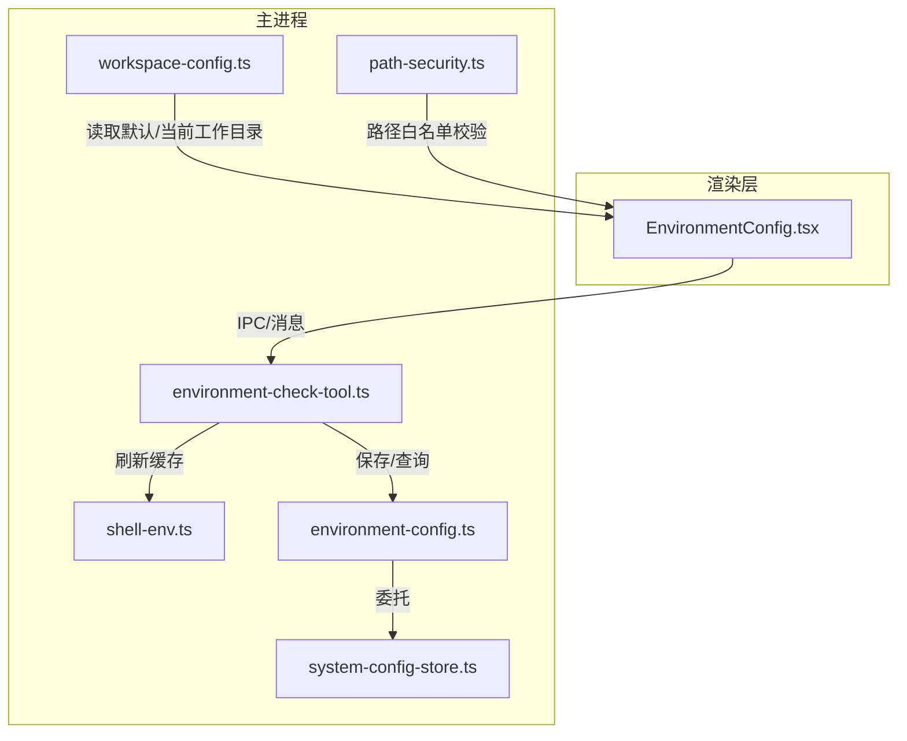
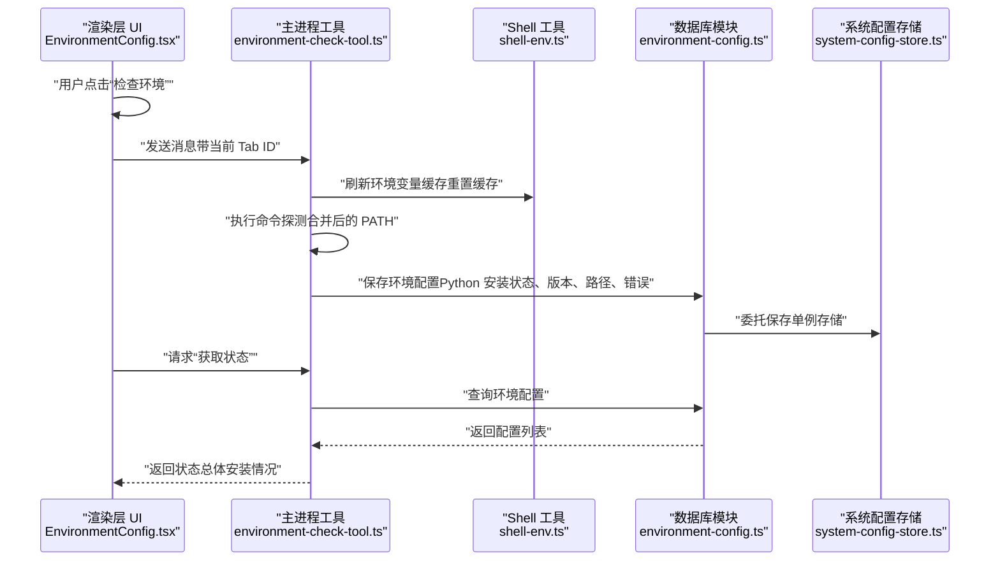
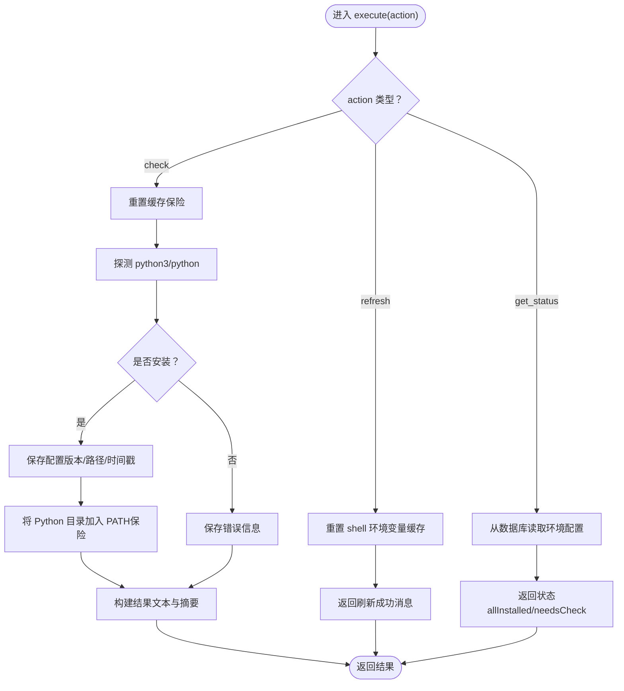
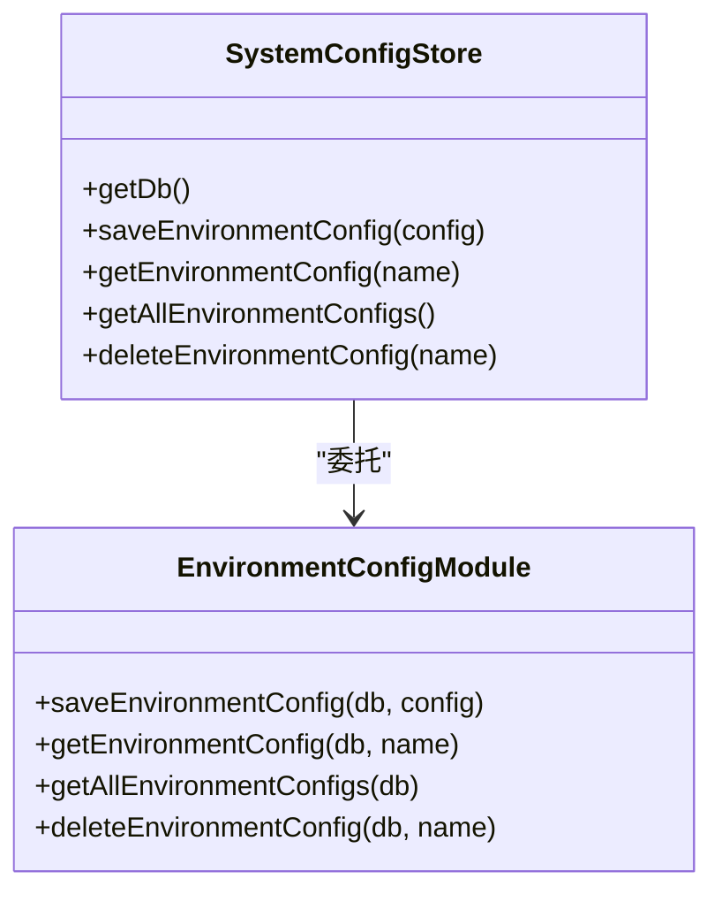
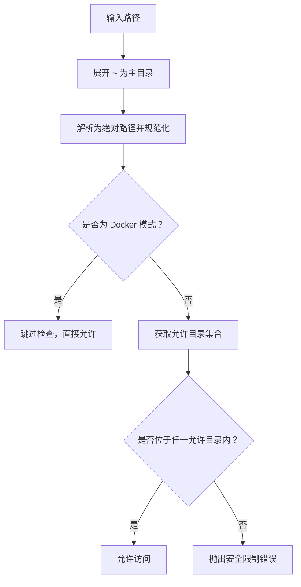
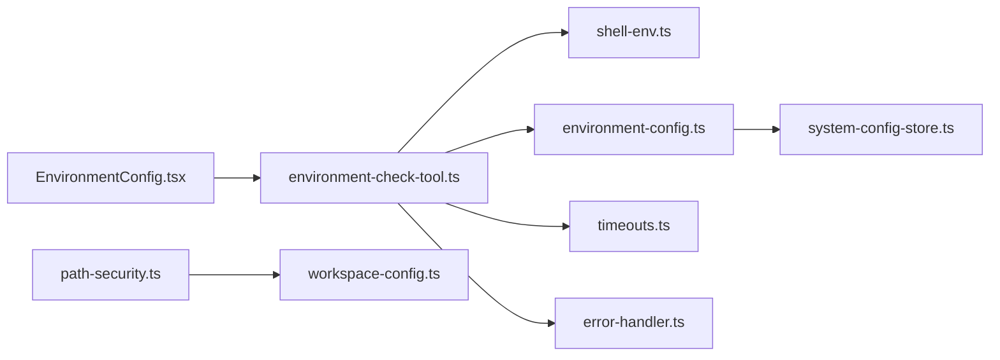

# 环境配置

<cite>
**本文引用的文件**
- [EnvironmentConfig.tsx](file://src/renderer/components/settings/EnvironmentConfig.tsx)
- [environment-check-tool.ts](file://src/main/tools/environment-check-tool.ts)
- [shell-env.ts](file://src/main/tools/shell-env.ts)
- [environment-config.ts](file://src/main/database/environment-config.ts)
- [system-config-store.ts](file://src/main/database/system-config-store.ts)
- [workspace-config.ts](file://src/main/database/workspace-config.ts)
- [path-security.ts](file://src/main/utils/path-security.ts)
- [docker-utils.ts](file://src/shared/utils/docker-utils.ts)
- [timeouts.ts](file://src/main/config/timeouts.ts)
- [error-handler.ts](file://src/shared/utils/error-handler.ts)
</cite>

## 目录
1. [简介](#简介)
2. [项目结构](#项目结构)
3. [核心组件](#核心组件)
4. [架构总览](#架构总览)
5. [组件详解](#组件详解)
6. [依赖关系分析](#依赖关系分析)
7. [性能与安全考量](#性能与安全考量)
8. [故障排查指南](#故障排查指南)
9. [结论](#结论)
10. [附录：跨平台配置指南](#附录跨平台配置指南)

## 简介
本章节面向 DeepBot 的“环境配置”功能，系统性阐述其在渲染层（UI）与主进程（工具与数据库）之间的协作机制，重点覆盖：
- 环境状态展示与一键检查流程
- 环境变量（尤其是 PATH）的获取与合并策略
- 工作目录与路径白名单的安全控制
- 环境检测的验证规则、保存流程与错误处理
- 不同操作系统下的最佳实践与注意事项

## 项目结构
围绕“环境配置”的关键文件分布如下：
- 渲染层 UI：EnvironmentConfig 页面负责展示状态、触发检查、呈现安装指引
- 主进程工具：环境检查工具负责实际检测、刷新环境变量缓存、持久化结果
- 工具与辅助：shell-env 提供从登录 shell 合并 PATH 与环境变量；path-security 提供路径白名单校验
- 数据持久化：SystemConfigStore 作为统一入口，environment-config 与 workspace-config 提供具体 CRUD

图表来源
- [EnvironmentConfig.tsx:31-76](file://src/renderer/components/settings/EnvironmentConfig.tsx#L31-L76)
- [environment-check-tool.ts:104-317](file://src/main/tools/environment-check-tool.ts#L104-L317)
- [shell-env.ts:284-327](file://src/main/tools/shell-env.ts#L284-L327)
- [environment-config.ts:11-79](file://src/main/database/environment-config.ts#L11-L79)
- [system-config-store.ts:319-333](file://src/main/database/system-config-store.ts#L319-L333)
- [workspace-config.ts:51-89](file://src/main/database/workspace-config.ts#L51-L89)
- [path-security.ts:59-83](file://src/main/utils/path-security.ts#L59-L83)

章节来源
- [EnvironmentConfig.tsx:1-323](file://src/renderer/components/settings/EnvironmentConfig.tsx#L1-L323)
- [environment-check-tool.ts:1-318](file://src/main/tools/environment-check-tool.ts#L1-L318)
- [shell-env.ts:1-417](file://src/main/tools/shell-env.ts#L1-L417)
- [environment-config.ts:1-80](file://src/main/database/environment-config.ts#L1-L80)
- [system-config-store.ts:1-576](file://src/main/database/system-config-store.ts#L1-L576)
- [workspace-config.ts:1-219](file://src/main/database/workspace-config.ts#L1-L219)
- [path-security.ts:1-118](file://src/main/utils/path-security.ts#L1-L118)

## 核心组件
- 渲染层环境配置页：负责展示 Python 环境状态、一键触发检查、显示总体安装情况与安装指引
- 环境检查工具：封装“检查/获取状态/刷新环境变量”三类动作，执行系统命令探测、合并 PATH 并持久化结果
- Shell 环境工具：解决 Electron 主进程环境变量不完整问题，合并登录 shell 与配置文件中的 PATH 与变量
- 环境配置数据库模块：提供保存、查询、删除环境配置记录的 CRUD
- 系统配置存储：统一数据库初始化、表结构迁移与各配置模块的门面
- 工作目录与路径安全：提供默认工作目录、多目录配置与路径白名单校验

章节来源
- [EnvironmentConfig.tsx:15-134](file://src/renderer/components/settings/EnvironmentConfig.tsx#L15-L134)
- [environment-check-tool.ts:104-317](file://src/main/tools/environment-check-tool.ts#L104-L317)
- [shell-env.ts:284-416](file://src/main/tools/shell-env.ts#L284-L416)
- [environment-config.ts:11-79](file://src/main/database/environment-config.ts#L11-L79)
- [system-config-store.ts:319-333](file://src/main/database/system-config-store.ts#L319-L333)
- [workspace-config.ts:17-89](file://src/main/database/workspace-config.ts#L17-L89)
- [path-security.ts:59-117](file://src/main/utils/path-security.ts#L59-L117)

## 架构总览
下面的序列图展示了“点击检查环境”到“状态更新”的端到端流程。

图表来源
- [EnvironmentConfig.tsx:61-76](file://src/renderer/components/settings/EnvironmentConfig.tsx#L61-L76)
- [environment-check-tool.ts:118-282](file://src/main/tools/environment-check-tool.ts#L118-L282)
- [shell-env.ts:130-150](file://src/main/tools/shell-env.ts#L130-L150)
- [environment-config.ts:11-49](file://src/main/database/environment-config.ts#L11-L49)
- [system-config-store.ts:319-333](file://src/main/database/system-config-store.ts#L319-L333)

## 组件详解

### 渲染层：环境配置页面（EnvironmentConfig）
- 功能要点
  - 展示 Python 环境状态（是否安装、版本、路径、错误信息）
  - 一键触发环境检查（通过主进程工具执行检查动作）
  - 显示总体安装状态与安装指引
  - 支持主题切换（浅色/深色/自动）

- 交互流程
  - 组件挂载时加载状态
  - 点击“检查环境”：构造提示词并发送至当前会话（Tab）ID，随后关闭配置页
  - 根据返回的状态决定渲染“已检查/未检查/总体状态/安装指引”

- 关键实现路径
  - 状态加载与错误处理：[EnvironmentConfig.tsx:37-50](file://src/renderer/components/settings/EnvironmentConfig.tsx#L37-L50)
  - 触发检查动作与关闭窗口：[EnvironmentConfig.tsx:61-76](file://src/renderer/components/settings/EnvironmentConfig.tsx#L61-L76)
  - 渲染环境项与总体状态：[EnvironmentConfig.tsx:78-134](file://src/renderer/components/settings/EnvironmentConfig.tsx#L78-L134)

章节来源
- [EnvironmentConfig.tsx:31-134](file://src/renderer/components/settings/EnvironmentConfig.tsx#L31-L134)

### 主进程：环境检查工具（environment-check-tool）
- 功能要点
  - 支持三种动作：check（检查）、get_status（获取状态）、refresh（刷新环境变量缓存）
  - 检查逻辑：优先探测 python3，其次 python；捕获版本与路径；失败时记录错误
  - 安全增强：若检测到 Python 路径，将其追加到当前进程 PATH（避免后续执行找不到可执行文件）
  - 结果持久化：将检查结果写入 environment_config 表

- 关键实现路径
  - 参数与执行入口：[environment-check-tool.ts:104-123](file://src/main/tools/environment-check-tool.ts#L104-L123)
  - 刷新缓存动作：[environment-check-tool.ts:127-146](file://src/main/tools/environment-check-tool.ts#L127-L146)
  - 检查动作（合并 PATH、探测命令、写入数据库）：[environment-check-tool.ts:146-233](file://src/main/tools/environment-check-tool.ts#L146-L233)
  - 获取状态动作（查询数据库）：[environment-check-tool.ts:234-282](file://src/main/tools/environment-check-tool.ts#L234-L282)
  - 错误处理与返回结构：[environment-check-tool.ts:298-314](file://src/main/tools/environment-check-tool.ts#L298-L314)

图表来源
- [environment-check-tool.ts:118-282](file://src/main/tools/environment-check-tool.ts#L118-L282)
- [environment-config.ts:11-49](file://src/main/database/environment-config.ts#L11-L49)

章节来源
- [environment-check-tool.ts:104-317](file://src/main/tools/environment-check-tool.ts#L104-L317)

### Shell 环境变量与 PATH 合并（shell-env）
- 背景与目标
  - Electron 主进程在某些平台（如 macOS 通过 Dock/Finder 启动）不会加载用户 shell 配置，导致 PATH 与自定义变量缺失
  - 该模块通过登录 shell 获取完整环境，并合并配置文件与 nvm 等来源的 PATH

- 关键能力
  - 从登录 shell 获取 PATH 与环境变量（带降级策略）
  - 合并当前 PATH、登录 shell PATH 与配置文件 PATH，去重保序
  - 缓存机制避免重复执行 shell
  - 支持重置缓存（/reload-env）

- 关键实现路径
  - 获取登录 shell PATH：[shell-env.ts:284-327](file://src/main/tools/shell-env.ts#L284-L327)
  - 合并 PATH 与去重：[shell-env.ts:257-277](file://src/main/tools/shell-env.ts#L257-L277)
  - 从配置文件提取 PATH 与变量：[shell-env.ts:129-168](file://src/main/tools/shell-env.ts#L129-L168)、[shell-env.ts:51-81](file://src/main/tools/shell-env.ts#L51-L81)
  - 重置缓存：[shell-env.ts:332-336](file://src/main/tools/shell-env.ts#L332-L336)

章节来源
- [shell-env.ts:284-327](file://src/main/tools/shell-env.ts#L284-L327)
- [shell-env.ts:257-277](file://src/main/tools/shell-env.ts#L257-L277)
- [shell-env.ts:129-168](file://src/main/tools/shell-env.ts#L129-L168)
- [shell-env.ts:51-81](file://src/main/tools/shell-env.ts#L51-L81)
- [shell-env.ts:332-336](file://src/main/tools/shell-env.ts#L332-L336)

### 数据持久化：环境配置与系统配置存储
- 环境配置表（environment_config）
  - 字段：id、name、is_installed、version、path、last_checked、error
  - 提供保存、查询、删除、查询全部

- 系统配置存储（SystemConfigStore）
  - 单例管理、数据库初始化与表结构迁移
  - 对外暴露 save/get/delete 环境配置方法，内部委托给 environment-config 模块

- 关键实现路径
  - 保存/查询/删除环境配置：[environment-config.ts:11-79](file://src/main/database/environment-config.ts#L11-L79)
  - 委托与单例入口：[system-config-store.ts:319-333](file://src/main/database/system-config-store.ts#L319-L333)

图表来源
- [system-config-store.ts:319-333](file://src/main/database/system-config-store.ts#L319-L333)
- [environment-config.ts:11-79](file://src/main/database/environment-config.ts#L11-L79)

章节来源
- [environment-config.ts:11-79](file://src/main/database/environment-config.ts#L11-L79)
- [system-config-store.ts:319-333](file://src/main/database/system-config-store.ts#L319-L333)

### 工作目录与路径白名单（workspace-config 与 path-security）
- 工作目录配置
  - 默认值根据 Docker 模式与普通模式分别设定
  - 支持保存/读取脚本目录、Skill 目录列表、默认 Skill 目录、图片/记忆/会话目录
  - Docker 模式下强制使用固定路径，忽略数据库配置

- 路径安全检查
  - 展开 ~ 为主目录
  - 规范化绝对路径，判断是否位于允许目录集合（工作目录、脚本、Skill、图片、记忆、会话等）
  - Docker 模式下跳过检查

- 关键实现路径
  - 默认工作目录与读取：[workspace-config.ts:17-89](file://src/main/database/workspace-config.ts#L17-L89)
  - 路径展开与白名单判定：[path-security.ts:17-83](file://src/main/utils/path-security.ts#L17-L83)
  - Docker 模式判断与目录来源：[docker-utils.ts:10-24](file://src/shared/utils/docker-utils.ts#L10-L24)

图表来源
- [path-security.ts:59-117](file://src/main/utils/path-security.ts#L59-L117)
- [workspace-config.ts:51-89](file://src/main/database/workspace-config.ts#L51-L89)
- [docker-utils.ts:10-24](file://src/shared/utils/docker-utils.ts#L10-L24)

章节来源
- [workspace-config.ts:17-89](file://src/main/database/workspace-config.ts#L17-L89)
- [path-security.ts:59-117](file://src/main/utils/path-security.ts#L59-L117)
- [docker-utils.ts:10-24](file://src/shared/utils/docker-utils.ts#L10-L24)

## 依赖关系分析
- 渲染层依赖主进程工具提供的消息通道与状态查询
- 环境检查工具依赖 shell-env 合并 PATH，依赖 system-config-store 与 environment-config 持久化
- 路径安全模块依赖工作目录配置与 Docker 模式判断
- 超时与错误处理贯穿工具执行链路

图表来源
- [EnvironmentConfig.tsx:37-76](file://src/renderer/components/settings/EnvironmentConfig.tsx#L37-L76)
- [environment-check-tool.ts:118-150](file://src/main/tools/environment-check-tool.ts#L118-L150)
- [shell-env.ts:284-327](file://src/main/tools/shell-env.ts#L284-L327)
- [environment-config.ts:11-49](file://src/main/database/environment-config.ts#L11-L49)
- [system-config-store.ts:319-333](file://src/main/database/system-config-store.ts#L319-L333)
- [workspace-config.ts:51-89](file://src/main/database/workspace-config.ts#L51-L89)
- [path-security.ts:59-83](file://src/main/utils/path-security.ts#L59-L83)
- [timeouts.ts:32-33](file://src/main/config/timeouts.ts#L32-L33)
- [error-handler.ts:8-13](file://src/shared/utils/error-handler.ts#L8-L13)

章节来源
- [EnvironmentConfig.tsx:37-76](file://src/renderer/components/settings/EnvironmentConfig.tsx#L37-L76)
- [environment-check-tool.ts:118-150](file://src/main/tools/environment-check-tool.ts#L118-L150)
- [shell-env.ts:284-327](file://src/main/tools/shell-env.ts#L284-L327)
- [environment-config.ts:11-49](file://src/main/database/environment-config.ts#L11-L49)
- [system-config-store.ts:319-333](file://src/main/database/system-config-store.ts#L319-L333)
- [workspace-config.ts:51-89](file://src/main/database/workspace-config.ts#L51-L89)
- [path-security.ts:59-83](file://src/main/utils/path-security.ts#L59-L83)
- [timeouts.ts:32-33](file://src/main/config/timeouts.ts#L32-L33)
- [error-handler.ts:8-13](file://src/shared/utils/error-handler.ts#L8-L13)

## 性能与安全考量
- 性能
  - 环境变量缓存：shell-env 提供缓存以避免重复执行 shell，减少 PATH 合并开销
  - 超时控制：命令执行与浏览器等操作均设置合理超时，避免阻塞
  - 数据库 WAL 模式：SystemConfigStore 初始化时启用 WAL，提升并发读写性能

- 安全
  - 路径白名单：严格限制文件访问范围，防止越权访问
  - Docker 模式：容器内目录固定，跳过路径检查但通过其他机制保证隔离
  - 环境变量注入：仅允许从登录 shell 与配置文件补充变量，避免外部污染

章节来源
- [shell-env.ts:16-18](file://src/main/tools/shell-env.ts#L16-L18)
- [timeouts.ts:32-33](file://src/main/config/timeouts.ts#L32-L33)
- [system-config-store.ts:55-56](file://src/main/database/system-config-store.ts#L55-L56)
- [path-security.ts:59-83](file://src/main/utils/path-security.ts#L59-L83)
- [docker-utils.ts:10-24](file://src/shared/utils/docker-utils.ts#L10-L24)

## 故障排查指南
- 症状：点击“检查环境”无响应或状态未更新
  - 排查步骤
    - 确认主进程工具已执行 refresh（重置缓存）后再执行 check
    - 查看工具返回的错误消息（包含命令执行失败原因）
  - 参考实现
    - 刷新缓存动作：[environment-check-tool.ts:127-146](file://src/main/tools/environment-check-tool.ts#L127-L146)
    - 错误消息提取：[error-handler.ts:8-13](file://src/shared/utils/error-handler.ts#L8-L13)

- 症状：Python 已安装但检测不到
  - 排查步骤
    - 确认 PATH 已正确合并（shell-env 会尝试登录 shell 与配置文件）
    - 若使用 nvm/n，确认 nvm 路径已被识别并合并
  - 参考实现
    - 合并 PATH 与变量：[shell-env.ts:284-327](file://src/main/tools/shell-env.ts#L284-L327)
    - nvm 路径检测：[shell-env.ts:173-231](file://src/main/tools/shell-env.ts#L173-L231)

- 症状：路径访问报安全限制
  - 排查步骤
    - 检查工作目录与各子目录是否已在系统设置中配置
    - 在 Docker 模式下确认容器内目录映射正确
  - 参考实现
    - 白名单判定与错误提示：[path-security.ts:91-117](file://src/main/utils/path-security.ts#L91-L117)
    - 默认工作目录与读取：[workspace-config.ts:51-89](file://src/main/database/workspace-config.ts#L51-L89)

章节来源
- [environment-check-tool.ts:127-146](file://src/main/tools/environment-check-tool.ts#L127-L146)
- [error-handler.ts:8-13](file://src/shared/utils/error-handler.ts#L8-L13)
- [shell-env.ts:284-327](file://src/main/tools/shell-env.ts#L284-L327)
- [shell-env.ts:173-231](file://src/main/tools/shell-env.ts#L173-L231)
- [path-security.ts:91-117](file://src/main/utils/path-security.ts#L91-L117)
- [workspace-config.ts:51-89](file://src/main/database/workspace-config.ts#L51-L89)

## 结论
DeepBot 的环境配置体系通过“渲染层 UI + 主进程工具 + Shell 环境合并 + 数据持久化 + 路径安全控制”的组合，实现了：
- 可靠的环境检测与状态展示
- 跨平台的环境变量与 PATH 合并
- 可配置的工作目录与严格的路径白名单
- 清晰的错误处理与可观测性

建议在生产环境中：
- 定期刷新环境变量缓存（/reload-env）
- 在 Docker 部署时明确设置相关环境变量以确保路径与权限正确
- 保持工作目录与各子目录的最小必要授权，遵循最小权限原则

## 附录：跨平台配置指南
- macOS
  - Electron 通过 Dock/Finder 启动时，主进程环境变量可能不完整。建议使用“刷新环境变量”后再次检查
  - 若使用 nvm/n，确保默认版本路径被正确识别并合并到 PATH
  - 安装 Python：使用包管理器安装 python3 与 pip

- Linux
  - 确保 PATH 合并包含用户 shell 配置文件（如 .bashrc、.zshrc）
  - 如使用虚拟环境或 nvm，确认 PATH 合并逻辑已包含对应 bin 目录

- Windows
  - PATH 合并逻辑对 Windows 直接使用当前环境变量，无需登录 shell 获取
  - 确认已安装 Python 并可在命令行执行 python --version

- Docker
  - 使用环境变量设置工作目录与各子目录（WORKSPACE_DIR、SKILLS_DIR、MEMORY_DIR、SESSIONS_DIR、SCRIPTS_DIR、IMAGES_DIR）
  - 数据库目录由 DB_DIR 控制，默认 /data/db
  - 容器内路径固定，路径白名单检查跳过

章节来源
- [shell-env.ts:292-295](file://src/main/tools/shell-env.ts#L292-L295)
- [shell-env.ts:173-231](file://src/main/tools/shell-env.ts#L173-L231)
- [workspace-config.ts:18-35](file://src/main/database/workspace-config.ts#L18-L35)
- [docker-utils.ts:19-24](file://src/shared/utils/docker-utils.ts#L19-L24)