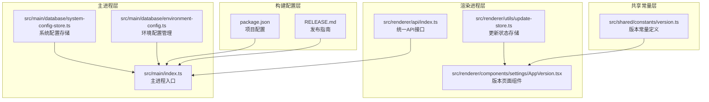
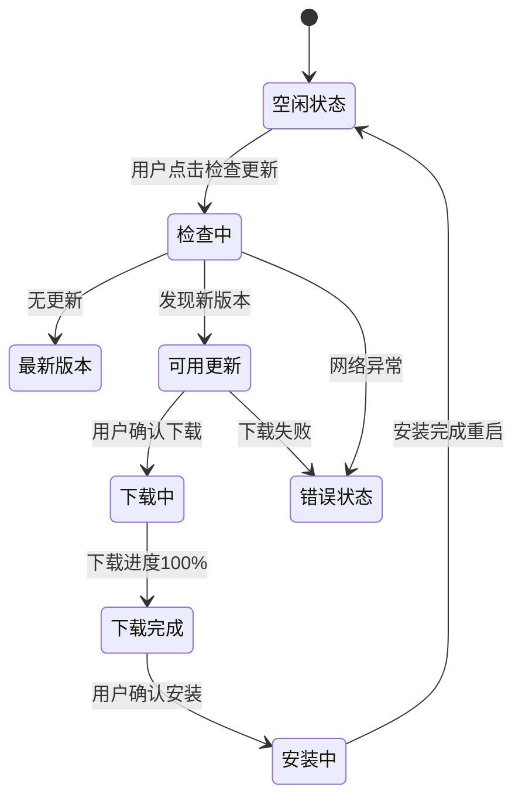
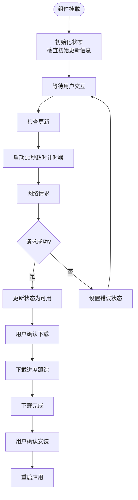
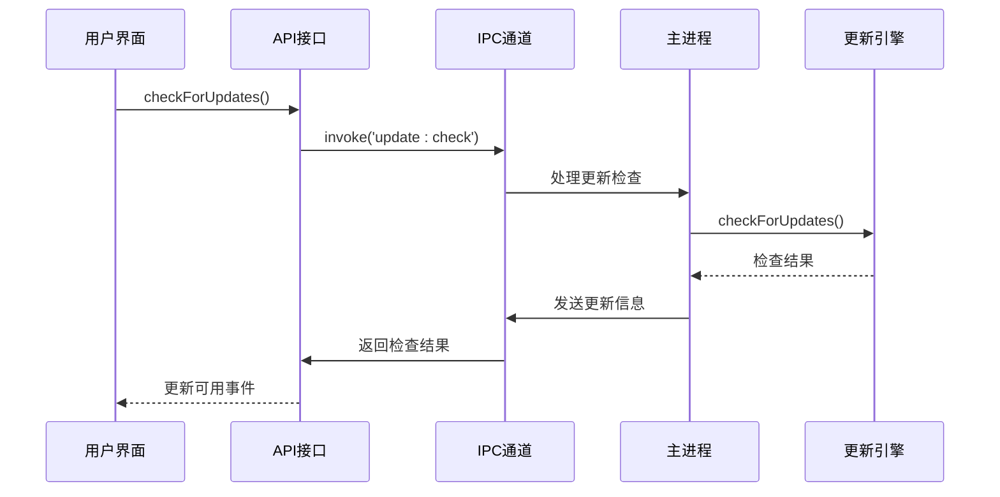
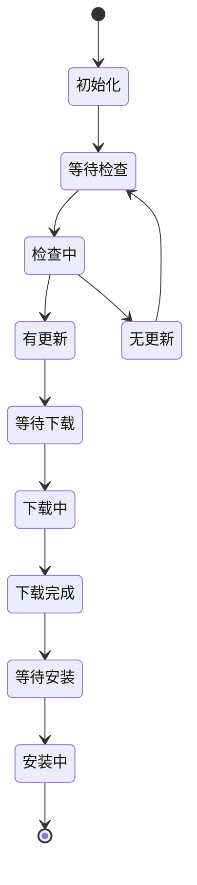
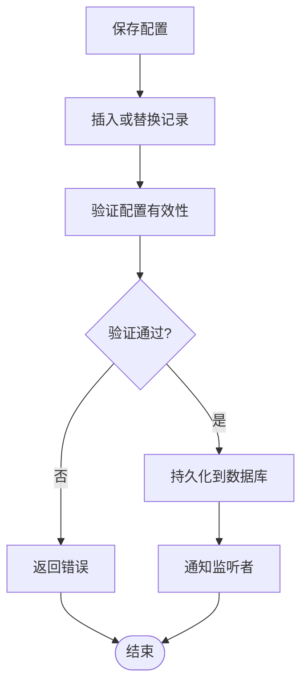
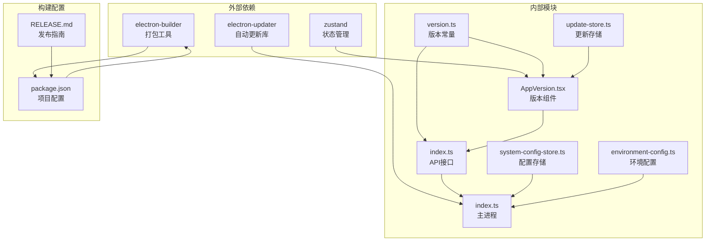

# 系统版本配置

<cite>
**本文档引用的文件**
- [src/shared/constants/version.ts](file://src/shared/constants/version.ts)
- [src/renderer/components/settings/AppVersion.tsx](file://src/renderer/components/settings/AppVersion.tsx)
- [src/renderer/api/index.ts](file://src/renderer/api/index.ts)
- [src/main/index.ts](file://src/main/index.ts)
- [src/renderer/utils/update-store.ts](file://src/renderer/utils/update-store.ts)
- [src/main/database/system-config-store.ts](file://src/main/database/system-config-store.ts)
- [src/main/database/environment-config.ts](file://src/main/database/environment-config.ts)
- [package.json](file://package.json)
- [RELEASE.md](file://RELEASE.md)
- [README.md](file://README.md)
</cite>

## 目录
1. [简介](#简介)
2. [项目结构](#项目结构)
3. [核心组件](#核心组件)
4. [架构概览](#架构概览)
5. [详细组件分析](#详细组件分析)
6. [依赖关系分析](#依赖关系分析)
7. [性能考虑](#性能考虑)
8. [故障排除指南](#故障排除指南)
9. [结论](#结论)
10. [附录](#附录)

## 简介

DeepBot 系统版本配置组件是一个完整的版本管理系统，负责应用程序的版本信息显示、更新检查、版本切换和版本回滚等功能。该系统基于 Electron 架构，实现了桌面应用程序的自动更新机制，支持手动检查更新、自动后台更新和离线安装等多种更新方式。

系统版本配置组件的核心目标是确保用户始终使用最新版本的 DeepBot 应用程序，同时提供透明的版本管理体验。它不仅管理应用程序本身的版本，还负责环境配置的版本跟踪和兼容性检查。

## 项目结构

DeepBot 版本配置系统的文件组织遵循模块化设计原则，主要分布在以下几个关键目录中：



**图表来源**
- [src/shared/constants/version.ts:1-22](file://src/shared/constants/version.ts#L1-L22)
- [src/renderer/components/settings/AppVersion.tsx:1-257](file://src/renderer/components/settings/AppVersion.tsx#L1-L257)
- [src/main/index.ts:1-800](file://src/main/index.ts#L1-L800)

**章节来源**
- [src/shared/constants/version.ts:1-22](file://src/shared/constants/version.ts#L1-L22)
- [src/renderer/components/settings/AppVersion.tsx:1-257](file://src/renderer/components/settings/AppVersion.tsx#L1-L257)
- [src/main/index.ts:1-800](file://src/main/index.ts#L1-L800)

## 核心组件

### 版本常量系统

版本常量系统是整个版本管理的基础，提供了统一的版本信息管理机制：

| 组件 | 功能 | 实现细节 |
|------|------|----------|
| APP_VERSION | 应用程序版本号 | 静态字符串常量，与 package.json 同步 |
| APP_NAME | 应用程序名称 | 标准化应用标识符 |
| APP_DESCRIPTION | 应用程序描述 | 用户界面显示信息 |
| MAX_TABS | 最大标签页数量 | 系统资源限制配置 |

### 版本页面组件

AppVersion 组件是用户交互的核心界面，提供了完整的版本管理功能：



**图表来源**
- [src/renderer/components/settings/AppVersion.tsx:13-25](file://src/renderer/components/settings/AppVersion.tsx#L13-L25)

### 自动更新机制

DeepBot 实现了基于 electron-updater 的自动更新系统，支持多种更新模式：

| 更新模式 | 触发方式 | 特点 | 适用场景 |
|----------|----------|------|----------|
| 自动后台更新 | 应用启动后延迟检查 | 用户无感知 | 生产环境稳定版本 |
| 手动检查更新 | 用户主动触发 | 完全可控 | 开发测试环境 |
| 离线安装更新 | 本地文件安装 | 无网络依赖 | 内网环境部署 |

**章节来源**
- [src/renderer/components/settings/AppVersion.tsx:1-257](file://src/renderer/components/settings/AppVersion.tsx#L1-L257)
- [src/renderer/api/index.ts:504-550](file://src/renderer/api/index.ts#L504-L550)
- [src/main/index.ts:1194-1291](file://src/main/index.ts#L1194-L1291)

## 架构概览

DeepBot 版本配置系统采用分层架构设计，确保各层职责清晰、耦合度低：

```mermaid
graph TB
subgraph "用户界面层"
UI[版本页面组件<br/>AppVersion]
Toast[通知系统<br/>状态提示]
end
subgraph "API 层"
API[统一API接口<br/>渲染进程]
IPC[IPC通信<br/>主进程交互]
end
subgraph "业务逻辑层"
Updater[自动更新引擎<br/>electron-updater]
Config[配置管理<br/>SQLite持久化]
Store[状态存储<br/>内存缓存]
end
subgraph "基础设施层"
FS[文件系统<br/>更新包管理]
Net[网络层<br/>版本检查]
DB[(SQLite)<br/>配置存储]
end
UI --> API
API --> IPC
IPC --> Updater
IPC --> Config
Updater --> FS
Updater --> Net
Config --> DB
Store --> UI
```

**图表来源**
- [src/renderer/components/settings/AppVersion.tsx:1-257](file://src/renderer/components/settings/AppVersion.tsx#L1-L257)
- [src/renderer/api/index.ts:1-551](file://src/renderer/api/index.ts#L1-L551)
- [src/main/index.ts:1-800](file://src/main/index.ts#L1-L800)

系统架构的关键特点：

1. **分层设计**：清晰的职责分离，便于维护和扩展
2. **异步处理**：所有网络操作和文件操作都采用异步模式
3. **错误处理**：完善的异常捕获和用户提示机制
4. **状态管理**：集中化的状态存储和事件通知

## 详细组件分析

### 版本页面组件分析

AppVersion 组件是版本管理系统的用户界面核心，实现了完整的版本控制功能：

#### 组件状态管理



**图表来源**
- [src/renderer/components/settings/AppVersion.tsx:35-88](file://src/renderer/components/settings/AppVersion.tsx#L35-L88)

#### 用户交互流程

组件支持多种用户交互模式：

| 交互类型 | 触发方式 | 界面反馈 | 系统行为 |
|----------|----------|----------|----------|
| 手动检查更新 | 点击"检查更新"按钮 | 加载动画 | 调用 API 检查版本 |
| 自动更新检查 | 应用启动后 | 隐式检查 | 延迟10秒执行检查 |
| 下载更新 | 新版本可用时 | 下载进度条 | electron-updater 下载 |
| 安装更新 | 下载完成后 | 重启提示 | 应用程序重启 |

**章节来源**
- [src/renderer/components/settings/AppVersion.tsx:1-257](file://src/renderer/components/settings/AppVersion.tsx#L1-L257)

### API 接口层分析

统一 API 接口层提供了跨平台的版本管理功能：

#### API 方法分类

| 方法类别 | 方法名 | 功能描述 | 实现方式 |
|----------|--------|----------|----------|
| 版本检查 | checkForUpdates | 检查应用程序更新 | IPC 调用主进程 |
| 更新下载 | downloadUpdate | 下载新版本 | IPC 调用主进程 |
| 安装更新 | installUpdate | 安装并重启 | IPC 调用主进程 |
| 事件监听 | onUpdateAvailable | 监听更新可用事件 | IPC 事件订阅 |
| 进度跟踪 | onUpdateDownloadProgress | 监听下载进度 | IPC 事件订阅 |

#### IPC 通信机制



**图表来源**
- [src/renderer/api/index.ts:506-522](file://src/renderer/api/index.ts#L506-L522)
- [src/main/index.ts:1209-1217](file://src/main/index.ts#L1209-L1217)

**章节来源**
- [src/renderer/api/index.ts:1-551](file://src/renderer/api/index.ts#L1-L551)
- [src/main/index.ts:1194-1291](file://src/main/index.ts#L1194-L1291)

### 主进程更新管理

主进程负责实际的更新操作，使用 electron-updater 库实现：

#### 更新生命周期管理



**图表来源**
- [src/main/index.ts:1245-1281](file://src/main/index.ts#L1245-L1281)

#### 错误处理机制

主进程实现了完善的错误处理：

| 错误类型 | 处理方式 | 用户反馈 |
|----------|----------|----------|
| 网络连接失败 | 记录错误日志 | 设置错误状态 |
| 版本检查超时 | 自动重试机制 | 提示网络问题 |
| 下载中断 | 断点续传支持 | 重新下载提示 |
| 安装失败 | 回滚机制 | 错误恢复提示 |

**章节来源**
- [src/main/index.ts:1245-1291](file://src/main/index.ts#L1245-L1291)

### 配置存储系统

系统配置存储提供了版本相关信息的持久化管理：

#### 数据库表结构

| 表名 | 字段 | 类型 | 描述 |
|------|------|------|------|
| environment_config | id | TEXT | 环境配置唯一标识 |
| environment_config | name | TEXT | 环境名称 |
| environment_config | is_installed | INTEGER | 安装状态 |
| environment_config | version | TEXT | 版本号 |
| environment_config | path | TEXT | 安装路径 |
| environment_config | last_checked | INTEGER | 最后检查时间 |
| environment_config | error | TEXT | 错误信息 |

#### 配置管理流程



**图表来源**
- [src/main/database/environment-config.ts:11-27](file://src/main/database/environment-config.ts#L11-L27)

**章节来源**
- [src/main/database/system-config-store.ts:1-576](file://src/main/database/system-config-store.ts#L1-L576)
- [src/main/database/environment-config.ts:1-57](file://src/main/database/environment-config.ts#L1-L57)

## 依赖关系分析

DeepBot 版本配置系统涉及多个层面的依赖关系：



**图表来源**
- [package.json:62](file://package.json#L62)
- [src/shared/constants/version.ts:1-22](file://src/shared/constants/version.ts#L1-L22)

### 核心依赖关系

| 依赖类型 | 依赖方 | 被依赖方 | 作用 |
|----------|--------|----------|------|
| 运行时依赖 | 主进程 | electron-updater | 自动更新功能 |
| 构建依赖 | 构建脚本 | electron-builder | 应用程序打包 |
| 状态管理 | 版本组件 | zustand | 组件状态管理 |
| 配置管理 | 主进程 | SQLite | 配置持久化存储 |

**章节来源**
- [package.json:45-107](file://package.json#L45-L107)
- [src/main/index.ts:25](file://src/main/index.ts#L25)

## 性能考虑

DeepBot 版本配置系统在设计时充分考虑了性能优化：

### 内存管理

- **懒加载策略**：版本检查和更新下载采用延迟加载，避免不必要的资源消耗
- **状态缓存**：使用 update-store.ts 缓存更新状态，减少重复检查
- **事件清理**：及时清理 IPC 事件监听器，防止内存泄漏

### 网络优化

- **超时控制**：10秒检查超时，避免长时间等待
- **断点续传**：支持更新包断点续传，节省带宽
- **并发控制**：限制同时进行的更新操作数量

### 存储优化

- **增量更新**：只下载变更的部分，减少下载体积
- **压缩传输**：使用压缩算法减少网络传输时间
- **本地缓存**：缓存版本信息，减少重复查询

## 故障排除指南

### 常见问题及解决方案

#### 版本检查失败

**问题症状**：检查更新时显示网络错误

**可能原因**：
- 网络连接不稳定
- 防火墙阻止访问
- 代理服务器配置错误

**解决方案**：
1. 检查网络连接状态
2. 配置正确的代理设置
3. 重试检查更新操作

#### 更新下载失败

**问题症状**：下载进度卡在某个百分比

**可能原因**：
- 网络中断
- 磁盘空间不足
- 文件权限问题

**解决方案**：
1. 检查磁盘空间
2. 重新下载更新包
3. 检查文件权限

#### 安装失败

**问题症状**：安装过程中出现错误

**可能原因**：
- 权限不足
- 文件损坏
- 系统兼容性问题

**解决方案**：
1. 以管理员权限运行
2. 重新下载安装包
3. 检查系统兼容性

### 调试工具

系统提供了多种调试工具来帮助诊断问题：

| 调试工具 | 功能 | 使用场景 |
|----------|------|----------|
| 控制台日志 | 查看详细错误信息 | 开发调试 |
| 状态监控 | 监控更新进度 | 用户反馈 |
| 配置检查 | 验证配置有效性 | 环境诊断 |

**章节来源**
- [src/main/index.ts:1249-1251](file://src/main/index.ts#L1249-L1251)

## 结论

DeepBot 系统版本配置组件是一个设计精良、功能完整的版本管理系统。它成功实现了以下目标：

1. **用户体验优化**：提供直观的版本管理界面和流畅的更新体验
2. **系统稳定性**：通过完善的错误处理和回滚机制确保系统稳定运行
3. **扩展性设计**：模块化架构支持功能扩展和定制化需求
4. **性能优化**：采用多种优化策略确保系统高效运行

该系统不仅满足了当前的功能需求，还为未来的功能扩展奠定了坚实的基础。通过持续的优化和完善，DeepBot 版本配置系统将继续为用户提供优质的版本管理体验。

## 附录

### 版本管理最佳实践

#### 更新策略建议

1. **渐进式更新**：采用分阶段发布策略，逐步扩大更新范围
2. **回滚机制**：确保每次更新都有可靠的回滚方案
3. **兼容性测试**：在发布前进行全面的兼容性测试
4. **用户通知**：及时通知用户重要的安全更新

#### 备份恢复策略

1. **配置备份**：定期备份系统配置和用户数据
2. **版本快照**：保存重要版本的快照以便快速恢复
3. **灾难恢复**：制定详细的灾难恢复计划

#### 版本对比功能

虽然当前版本未实现详细的版本对比功能，但系统架构已经为该功能预留了扩展空间。未来可以考虑：

1. **差异分析**：比较两个版本之间的文件差异
2. **变更日志**：自动生成版本变更记录
3. **影响评估**：评估版本更新对系统的影响

### 相关文档

- [发布指南](file://RELEASE.md)：详细的发布流程和版本管理说明
- [项目架构](file://README.md)：整体项目架构和设计理念
- [构建配置](file://package.json)：项目构建和依赖管理配置