# 设置页面组件

<cite>
**本文档引用的文件**
- [SystemSettings.tsx](file://src/renderer/components/SystemSettings.tsx)
- [ModelConfig.tsx](file://src/renderer/components/settings/ModelConfig.tsx)
- [EnvironmentConfig.tsx](file://src/renderer/components/settings/EnvironmentConfig.tsx)
- [ToolConfig.tsx](file://src/renderer/components/settings/ToolConfig.tsx)
- [ConnectorConfig.tsx](file://src/renderer/components/settings/ConnectorConfig.tsx)
- [WorkspaceConfig.tsx](file://src/renderer/components/settings/WorkspaceConfig.tsx)
- [AppVersion.tsx](file://src/renderer/components/settings/AppVersion.tsx)
- [WebSearchToolConfig.tsx](file://src/renderer/components/settings/WebSearchToolConfig.tsx)
- [BrowserToolConfig.tsx](file://src/renderer/components/settings/BrowserToolConfig.tsx)
- [default-configs.ts](file://src/shared/config/default-configs.ts)
- [api/index.ts](file://src/renderer/api/index.ts)
- [system-config-store.ts](file://src/main/database/system-config-store.ts)
</cite>

## 目录
1. [简介](#简介)
2. [项目结构](#项目结构)
3. [核心组件](#核心组件)
4. [架构概览](#架构概览)
5. [详细组件分析](#详细组件分析)
6. [依赖关系分析](#依赖关系分析)
7. [性能考虑](#性能考虑)
8. [故障排除指南](#故障排除指南)
9. [结论](#结论)

## 简介

DeepBot 设置页面组件是一个完整的系统配置管理界面，提供了企业级 AI 助手的全面配置能力。该组件采用左右布局设计，左侧为导航菜单，右侧为具体的设置内容，支持模型配置、环境配置、工具配置、连接器配置、工作目录配置和系统版本管理等功能。

系统设置组件的核心目标是为企业用户提供直观、易用的配置界面，同时确保配置的安全性和持久性。组件支持多种运行环境（Electron 和 Web），并提供了完善的错误处理和用户反馈机制。

## 项目结构

设置页面组件位于 `src/renderer/components/settings/` 目录下，采用模块化设计，每个配置页面都是独立的 React 组件：

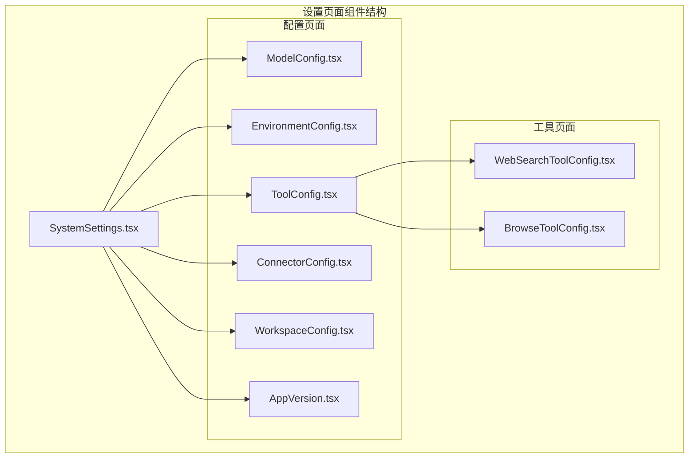

**图表来源**
- [SystemSettings.tsx:1-180](file://src/renderer/components/SystemSettings.tsx#L1-L180)
- [ModelConfig.tsx:1-432](file://src/renderer/components/settings/ModelConfig.tsx#L1-L432)
- [EnvironmentConfig.tsx:1-323](file://src/renderer/components/settings/EnvironmentConfig.tsx#L1-L323)

**章节来源**
- [SystemSettings.tsx:1-180](file://src/renderer/components/SystemSettings.tsx#L1-L180)

## 核心组件

### 系统设置主组件

SystemSettings.tsx 是整个设置页面的主控制器，负责管理页面布局、状态管理和路由切换。该组件实现了响应式布局，支持桌面端和移动端的适配。

主要功能特性：
- 左右布局设计：左侧导航菜单，右侧内容区域
- 多标签页管理：快速入门、模型配置、环境配置、工具配置、工作目录、外部通讯、系统版本
- 状态管理：活动标签页状态、更新状态、全局提示状态
- 主题集成：与应用主题系统无缝集成

### 配置页面架构

每个配置页面都遵循统一的架构模式：

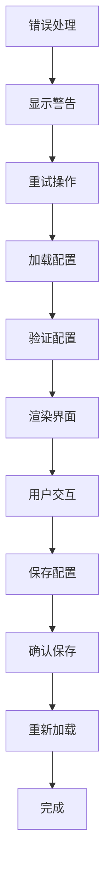

**图表来源**
- [ModelConfig.tsx:58-84](file://src/renderer/components/settings/ModelConfig.tsx#L58-L84)
- [ToolConfig.tsx:60-90](file://src/renderer/components/settings/ToolConfig.tsx#L60-L90)

**章节来源**
- [SystemSettings.tsx:31-179](file://src/renderer/components/SystemSettings.tsx#L31-L179)

## 架构概览

设置页面组件采用了分层架构设计，确保了良好的可维护性和扩展性：

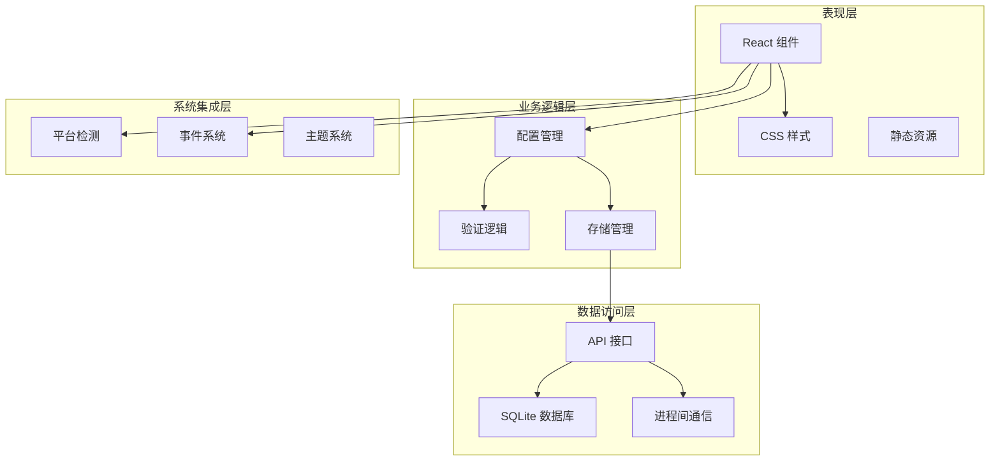

**图表来源**
- [api/index.ts:20-551](file://src/renderer/api/index.ts#L20-L551)
- [system-config-store.ts:37-70](file://src/main/database/system-config-store.ts#L37-L70)

### 数据流架构

设置页面的数据流采用单向数据流设计，确保了数据的一致性和可预测性：

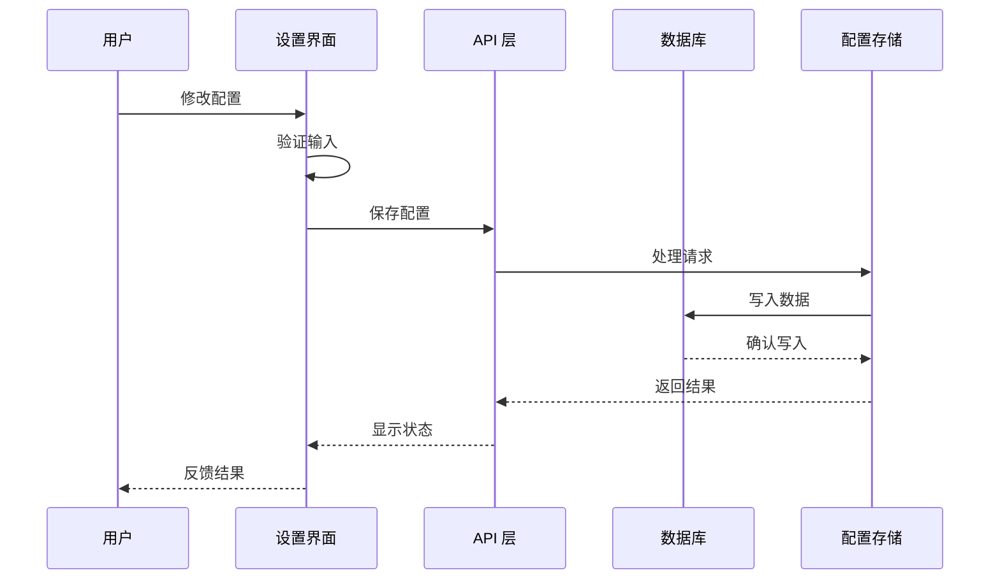

**图表来源**
- [api/index.ts:49-59](file://src/renderer/api/index.ts#L49-L59)
- [system-config-store.ts:383-398](file://src/main/database/system-config-store.ts#L383-L398)

**章节来源**
- [api/index.ts:20-551](file://src/renderer/api/index.ts#L20-L551)
- [system-config-store.ts:37-566](file://src/main/database/system-config-store.ts#L37-L566)

## 详细组件分析

### 模型配置组件

ModelConfig.tsx 提供了完整的模型配置管理功能，支持多种 AI 模型提供商的配置：

#### 核心配置项

| 配置项 | 类型 | 描述 | 默认值 |
|--------|------|------|--------|
| providerType | enum | 模型提供商类型 | qwen |
| baseUrl | string | API 基础地址 | 预设提供商地址 |
| modelId | string | 主模型 ID | 预设模型 ID |
| modelId2 | string | 快速模型 ID | 预设快速模型 |
| apiKey | string | API 密钥 | 空字符串 |
| contextWindow | number | 上下文窗口大小 | 自动推断 |

#### 验证规则

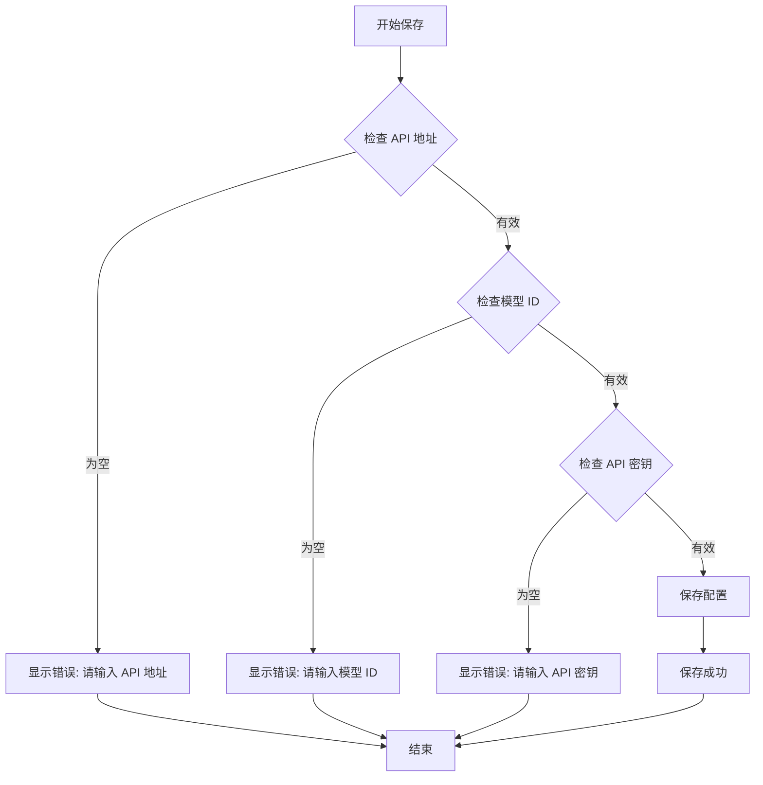

**图表来源**
- [ModelConfig.tsx:104-149](file://src/renderer/components/settings/ModelConfig.tsx#L104-L149)

#### 支持的提供商

组件支持以下 AI 模型提供商：

| 提供商 | 类型 | API 类型 | 特点 |
|--------|------|----------|------|
| DeepBot | 预设 | openai-completions | 推荐，集成度高 |
| Qwen | 预设 | openai-completions | 阿里云，中文优化 |
| DeepSeek | 预设 | openai-completions | 深度求索，性价比高 |
| Gemini | 预设 | google-generative-ai | Google 原生 API |
| MiniMax | 预设 | openai-completions | 小米生态 |
| Custom | 自定义 | openai-completions/google | 兼容 OpenAI 格式 |

**章节来源**
- [ModelConfig.tsx:13-25](file://src/renderer/components/settings/ModelConfig.tsx#L13-L25)
- [ModelConfig.tsx:86-102](file://src/renderer/components/settings/ModelConfig.tsx#L86-L102)
- [default-configs.ts:11-54](file://src/shared/config/default-configs.ts#L11-L54)

### 环境配置组件

EnvironmentConfig.tsx 专注于系统环境的检测和配置管理：

#### 环境状态检测

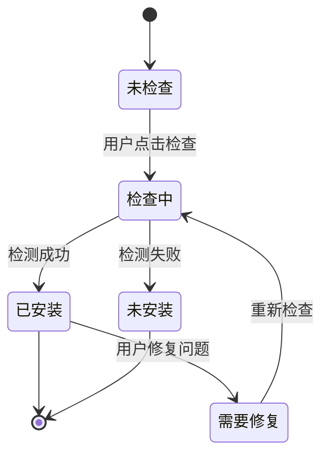

**图表来源**
- [EnvironmentConfig.tsx:37-58](file://src/renderer/components/settings/EnvironmentConfig.tsx#L37-L58)

#### 支持的环境组件

| 组件 | 必需性 | 描述 | 安装建议 |
|------|--------|------|----------|
| Python | 强制 | 执行 Python 脚本和技能 | 推荐 3.8+ |
| Node.js | 可选 | 运行 JavaScript 环境程序 | 16+ LTS |
| Chrome | 可选 | 浏览器工具支持 | 最新稳定版 |
| Git | 可选 | 代码仓库访问 | 2.0+ |

**章节来源**
- [EnvironmentConfig.tsx:15-24](file://src/renderer/components/settings/EnvironmentConfig.tsx#L15-L24)
- [EnvironmentConfig.tsx:60-76](file://src/renderer/components/settings/EnvironmentConfig.tsx#L60-L76)

### 工具配置组件

ToolConfig.tsx 提供了多种系统工具的配置管理：

#### 工具分类

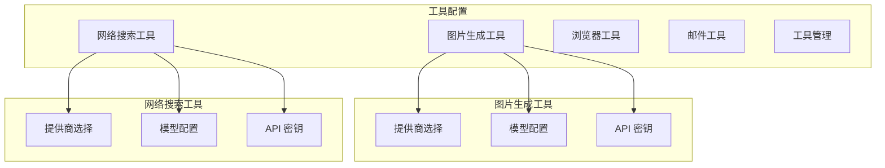

**图表来源**
- [ToolConfig.tsx:38-49](file://src/renderer/components/settings/ToolConfig.tsx#L38-L49)

#### 可禁用工具列表

| 工具名称 | 描述 | 默认状态 |
|----------|------|----------|
| image_generation | 图片生成 | 启用 |
| web_search | 网络搜索 | 启用 |
| browser | 浏览器控制 | 启用 |
| calendar_get_events | 日历读取 | 启用 |
| calendar_create_event | 日历创建 | 启用 |

**章节来源**
- [ToolConfig.tsx:18-25](file://src/renderer/components/settings/ToolConfig.tsx#L18-L25)
- [ToolConfig.tsx:92-99](file://src/renderer/components/settings/ToolConfig.tsx#L92-L99)

### 连接器配置组件

ConnectorConfig.tsx 专门处理外部通讯工具的配置，目前支持飞书连接器：

#### 连接器生命周期

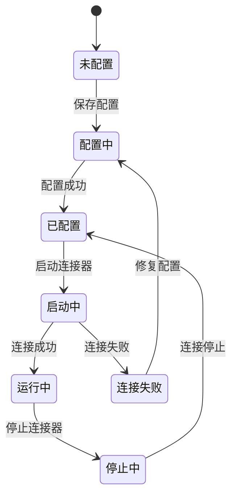

**图表来源**
- [ConnectorConfig.tsx:260-296](file://src/renderer/components/settings/ConnectorConfig.tsx#L260-L296)

#### 飞书连接器功能

| 功能 | 描述 | 状态 |
|------|------|------|
| 私聊支持 | 用户首次私聊需要管理员批准 | 可配置 |
| 群组支持 | @机器人触发回复 | 自动支持 |
| 文档处理 | 读取和操作飞书文档 | 支持 |
| 文件传输 | 发送和接收文件 | 支持 |
| 配对管理 | 用户配对和权限管理 | 支持 |

**章节来源**
- [ConnectorConfig.tsx:43-154](file://src/renderer/components/settings/ConnectorConfig.tsx#L43-L154)

### 工作空间配置组件

WorkspaceConfig.tsx 提供了工作目录和相关路径的配置管理：

#### 目录配置

| 目录类型 | 默认路径 | 用途 | Docker 模式 |
|----------|----------|------|-------------|
| workspaceDir | ~ | 默认工作目录 | /data/workspace |
| scriptDir | ~/.deepbot/scripts | Python 脚本目录 | /data/workspace/.deepbot/scripts |
| imageDir | ~/.deepbot/generated-images | 图片生成目录 | /data/workspace/.deepbot/generated-images |
| memoryDir | ~/.deepbot/memory | 记忆管理目录 | /data/memory |
| sessionDir | ~/.deepbot/sessions | 对话历史目录 | /data/sessions |
| skillDirs | ~/.agents/skills | Skill 目录列表 | /data/skills |

#### 目录管理功能

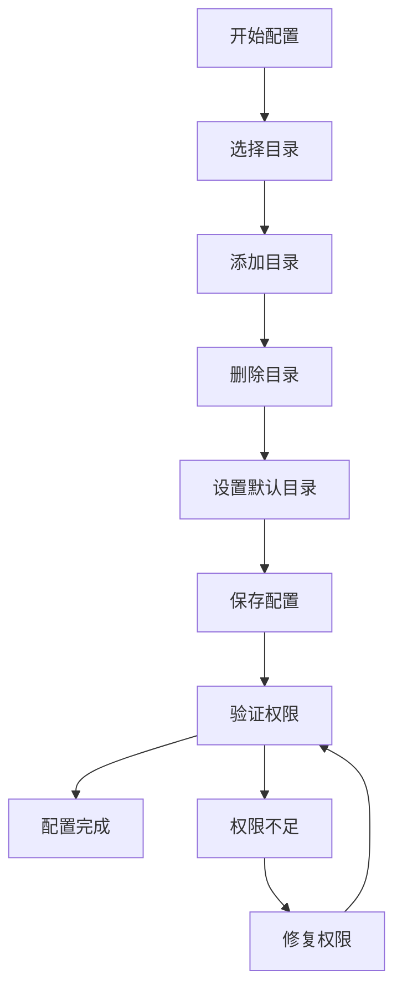

**图表来源**
- [WorkspaceConfig.tsx:175-241](file://src/renderer/components/settings/WorkspaceConfig.tsx#L175-L241)

**章节来源**
- [WorkspaceConfig.tsx:28-46](file://src/renderer/components/settings/WorkspaceConfig.tsx#L28-L46)
- [WorkspaceConfig.tsx:373-430](file://src/renderer/components/settings/WorkspaceConfig.tsx#L373-L430)

### 系统版本组件

AppVersion.tsx 提供了系统版本管理和自动更新功能：

#### 更新流程

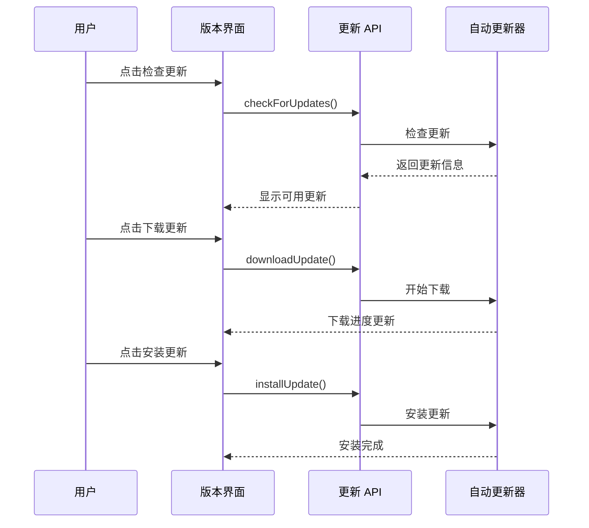

**图表来源**
- [AppVersion.tsx:64-93](file://src/renderer/components/settings/AppVersion.tsx#L64-L93)

**章节来源**
- [AppVersion.tsx:27-62](file://src/renderer/components/settings/AppVersion.tsx#L27-L62)

## 依赖关系分析

### 组件依赖图

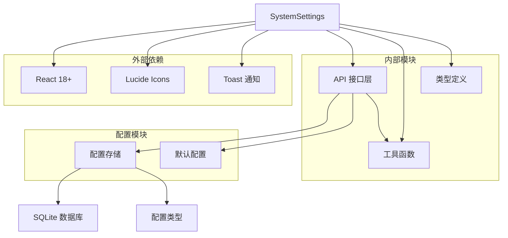

**图表来源**
- [SystemSettings.tsx:9-21](file://src/renderer/components/SystemSettings.tsx#L9-L21)
- [api/index.ts:6-8](file://src/renderer/api/index.ts#L6-L8)

### 数据存储架构

设置页面组件的数据存储采用了分层架构：

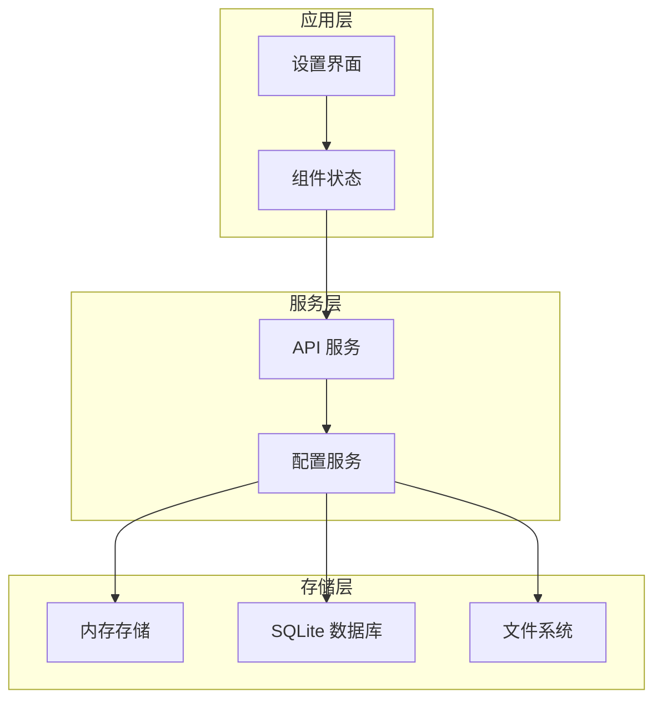

**图表来源**
- [system-config-store.ts:37-70](file://src/main/database/system-config-store.ts#L37-L70)

**章节来源**
- [api/index.ts:20-551](file://src/renderer/api/index.ts#L20-L551)
- [system-config-store.ts:37-566](file://src/main/database/system-config-store.ts#L37-L566)

## 性能考虑

### 加载优化策略

设置页面组件采用了多种性能优化策略：

1. **懒加载机制**：配置页面按需加载，减少初始加载时间
2. **状态缓存**：使用 useRef 避免重复加载配置
3. **并发请求**：使用 Promise.all 并行加载多个配置
4. **虚拟滚动**：对于大量数据的配置项使用虚拟滚动优化

### 存储优化

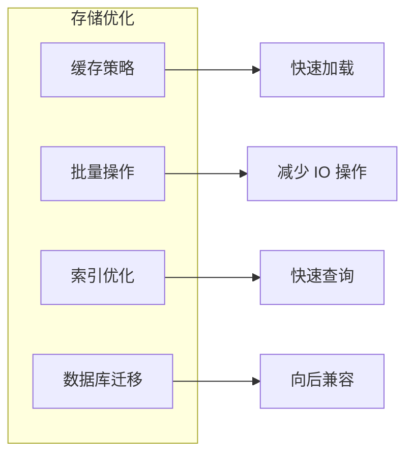

**图表来源**
- [WorkspaceConfig.tsx:54-67](file://src/renderer/components/settings/WorkspaceConfig.tsx#L54-L67)
- [system-config-store.ts:221-315](file://src/main/database/system-config-store.ts#L221-L315)

## 故障排除指南

### 常见问题及解决方案

#### 配置加载失败

**问题症状**：配置页面显示加载失败或空白

**可能原因**：
1. 数据库连接异常
2. 配置文件损坏
3. 权限不足

**解决步骤**：
1. 检查数据库文件是否存在
2. 验证数据库文件权限
3. 重启应用尝试恢复

#### 配置保存失败

**问题症状**：点击保存后无响应或显示错误

**可能原因**：
1. 网络连接问题
2. API 服务不可用
3. 验证规则不满足

**解决步骤**：
1. 检查网络连接
2. 重新启动 API 服务
3. 检查必填字段是否完整

#### 环境检测失败

**问题症状**：环境检测显示未安装或检测失败

**可能原因**：
1. 环境变量未正确设置
2. 程序路径不在 PATH 中
3. 权限不足

**解决步骤**：
1. 检查环境变量配置
2. 验证程序路径
3. 以管理员权限运行

**章节来源**
- [EnvironmentConfig.tsx:46-49](file://src/renderer/components/settings/EnvironmentConfig.tsx#L46-L49)
- [ModelConfig.tsx:80-84](file://src/renderer/components/settings/ModelConfig.tsx#L80-L84)

## 结论

DeepBot 设置页面组件是一个功能完整、架构清晰的企业级配置管理界面。组件设计充分考虑了用户体验、性能和可维护性，提供了以下核心价值：

### 主要优势

1. **模块化设计**：每个配置页面独立开发，便于维护和扩展
2. **统一架构**：遵循一致的设计模式和数据流
3. **多环境支持**：同时支持 Electron 和 Web 环境
4. **安全保障**：敏感信息加密存储，权限控制完善
5. **用户体验**：直观的界面设计和及时的用户反馈

### 技术特色

- **响应式设计**：适配不同屏幕尺寸和设备
- **实时验证**：即时的表单验证和错误提示
- **状态管理**：完善的组件状态管理和生命周期控制
- **错误处理**：全面的错误捕获和用户友好的错误提示

### 扩展建议

1. **配置模板**：提供常用配置模板，简化新用户配置过程
2. **配置导入导出**：支持配置的批量导入导出功能
3. **配置版本控制**：记录配置变更历史，支持回滚操作
4. **配置共享**：支持团队间的配置共享和协作

该组件为 DeepBot 提供了强大的配置管理能力，是企业级 AI 应用的重要基础设施。