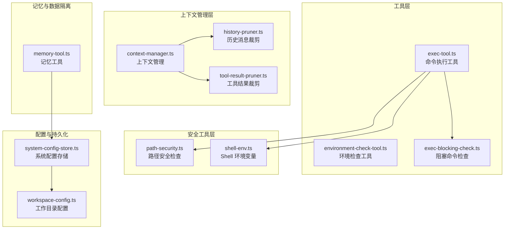
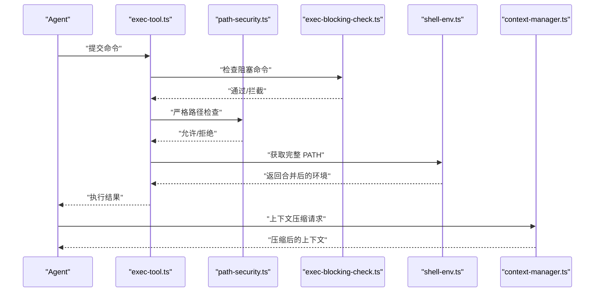
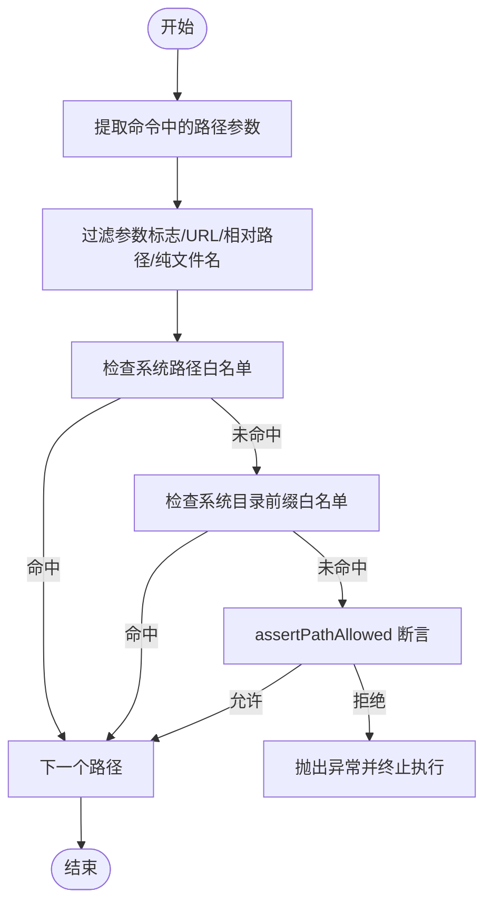
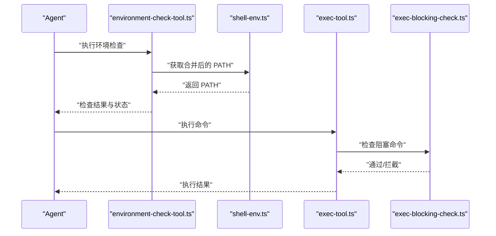
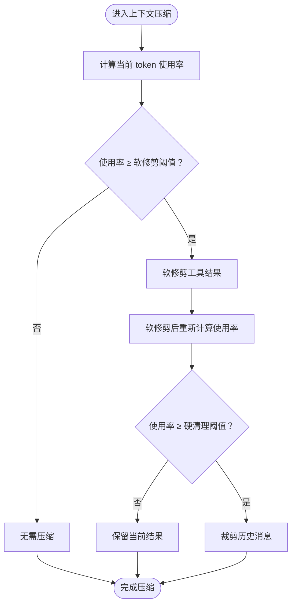
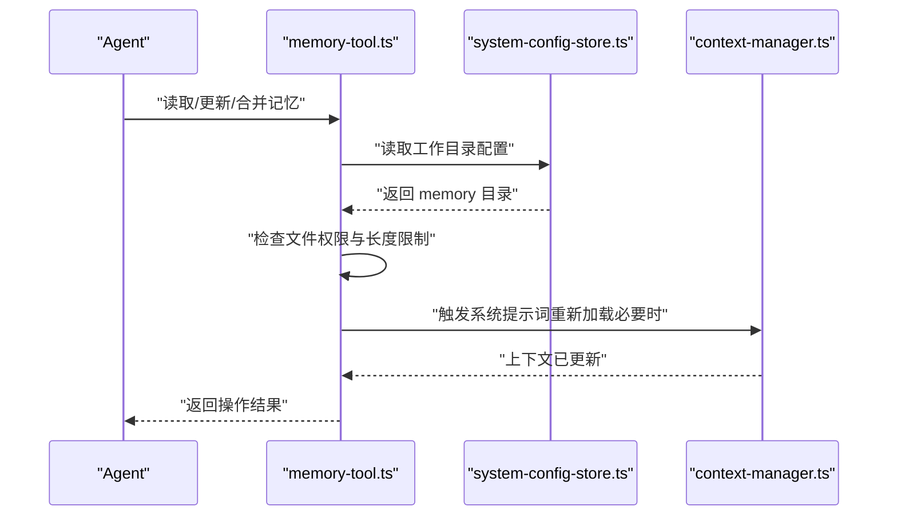
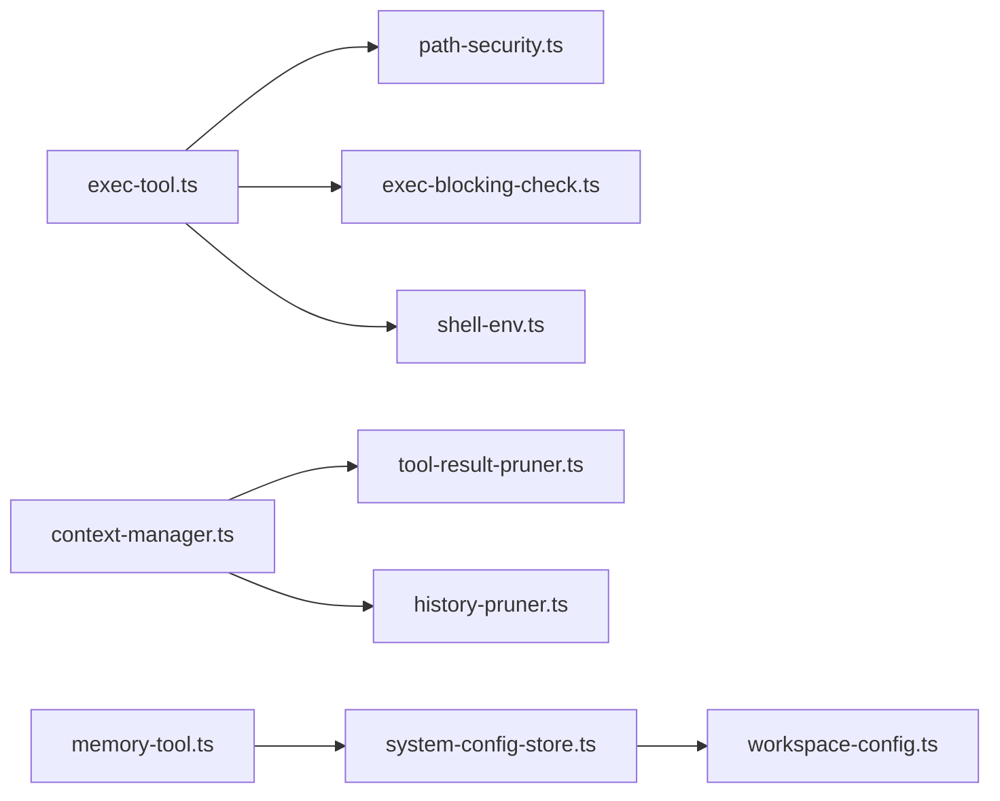

# 安全和权限控制

<cite>
**本文引用的文件**
- [exec-tool.ts](file://src/main/tools/exec-tool.ts)
- [path-security.ts](file://src/main/utils/path-security.ts)
- [environment-check-tool.ts](file://src/main/tools/environment-check-tool.ts)
- [exec-blocking-check.ts](file://src/main/tools/exec-blocking-check.ts)
- [context-manager.ts](file://src/main/context/context-manager.ts)
- [history-pruner.ts](file://src/main/context/history-pruner.ts)
- [tool-result-pruner.ts](file://src/main/context/tool-result-pruner.ts)
- [system-config-store.ts](file://src/main/database/system-config-store.ts)
- [workspace-config.ts](file://src/main/database/workspace-config.ts)
- [shell-env.ts](file://src/main/tools/shell-env.ts)
- [memory-tool.ts](file://src/main/tools/memory-tool.ts)
</cite>

## 目录
1. [简介](#简介)
2. [项目结构](#项目结构)
3. [核心组件](#核心组件)
4. [架构总览](#架构总览)
5. [详细组件分析](#详细组件分析)
6. [依赖关系分析](#依赖关系分析)
7. [性能考量](#性能考量)
8. [故障排除指南](#故障排除指南)
9. [结论](#结论)
10. [附录](#附录)

## 简介
本文件面向 史丽慧小助理 的安全与权限控制体系，系统性阐述路径白名单机制、环境检查与执行阻塞检查的实现原理；深入解析记忆与上下文安全机制（记忆文件权限、上下文修剪与数据隔离策略）；给出安全检查流程与防护措施、最佳实践与故障排除指南，并覆盖权限管理与访问控制机制。

## 项目结构
史丽慧小助理 的安全与权限控制涉及多个层次：
- 工具层：命令执行工具、环境检查工具、阻塞命令检查工具
- 安全工具层：路径安全检查、Shell 环境变量工具
- 上下文管理层：上下文压缩、历史消息裁剪、工具结果裁剪
- 配置与持久化：系统配置存储、工作目录配置
- 记忆与数据隔离：记忆工具、会话与记忆文件隔离

图表来源
- [exec-tool.ts:1-529](file://src/main/tools/exec-tool.ts#L1-L529)
- [path-security.ts:1-118](file://src/main/utils/path-security.ts#L1-L118)
- [environment-check-tool.ts:1-318](file://src/main/tools/environment-check-tool.ts#L1-L318)
- [exec-blocking-check.ts:1-130](file://src/main/tools/exec-blocking-check.ts#L1-L130)
- [context-manager.ts:1-285](file://src/main/context/context-manager.ts#L1-L285)
- [history-pruner.ts:1-299](file://src/main/context/history-pruner.ts#L1-L299)
- [tool-result-pruner.ts:1-448](file://src/main/context/tool-result-pruner.ts#L1-L448)
- [system-config-store.ts:1-576](file://src/main/database/system-config-store.ts#L1-L576)
- [workspace-config.ts:1-219](file://src/main/database/workspace-config.ts#L1-L219)
- [shell-env.ts:1-327](file://src/main/tools/shell-env.ts#L1-L327)
- [memory-tool.ts:1-870](file://src/main/tools/memory-tool.ts#L1-L870)

章节来源
- [exec-tool.ts:1-529](file://src/main/tools/exec-tool.ts#L1-L529)
- [path-security.ts:1-118](file://src/main/utils/path-security.ts#L1-L118)
- [environment-check-tool.ts:1-318](file://src/main/tools/environment-check-tool.ts#L1-L318)
- [exec-blocking-check.ts:1-130](file://src/main/tools/exec-blocking-check.ts#L1-L130)
- [context-manager.ts:1-285](file://src/main/context/context-manager.ts#L1-L285)
- [history-pruner.ts:1-299](file://src/main/context/history-pruner.ts#L1-L299)
- [tool-result-pruner.ts:1-448](file://src/main/context/tool-result-pruner.ts#L1-L448)
- [system-config-store.ts:1-576](file://src/main/database/system-config-store.ts#L1-L576)
- [workspace-config.ts:1-219](file://src/main/database/workspace-config.ts#L1-L219)
- [shell-env.ts:1-327](file://src/main/tools/shell-env.ts#L1-L327)
- [memory-tool.ts:1-870](file://src/main/tools/memory-tool.ts#L1-L870)

## 核心组件
- 路径白名单与严格路径检查：通过系统路径白名单、系统目录前缀白名单与环境变量临时目录白名单，结合严格路径检查函数，确保命令中涉及的绝对路径仅限于允许范围。
- 环境检查与 PATH 合并：从登录 shell 动态获取完整 PATH 与环境变量，解决 Electron 主进程环境变量不完整问题，并支持刷新缓存。
- 执行阻塞检查：拦截会阻塞交互式命令，避免 Agent 卡死。
- 上下文压缩与数据隔离：通过工具结果裁剪与历史消息裁剪，在 token 预算内进行软修剪与硬清理，保护关键消息，实现数据隔离。
- 记忆与会话隔离：记忆文件按 Tab 独立存储，主记忆与 Tab 记忆分离，避免跨会话数据污染。

章节来源
- [path-security.ts:1-118](file://src/main/utils/path-security.ts#L1-L118)
- [exec-tool.ts:1-529](file://src/main/tools/exec-tool.ts#L1-L529)
- [environment-check-tool.ts:1-318](file://src/main/tools/environment-check-tool.ts#L1-L318)
- [exec-blocking-check.ts:1-130](file://src/main/tools/exec-blocking-check.ts#L1-L130)
- [context-manager.ts:1-285](file://src/main/context/context-manager.ts#L1-L285)
- [history-pruner.ts:1-299](file://src/main/context/history-pruner.ts#L1-L299)
- [tool-result-pruner.ts:1-448](file://src/main/context/tool-result-pruner.ts#L1-L448)
- [memory-tool.ts:1-870](file://src/main/tools/memory-tool.ts#L1-L870)

## 架构总览
安全与权限控制贯穿命令执行、上下文管理与数据存储三个维度：

图表来源
- [exec-tool.ts:317-528](file://src/main/tools/exec-tool.ts#L317-L528)
- [path-security.ts:85-117](file://src/main/utils/path-security.ts#L85-L117)
- [exec-blocking-check.ts:44-95](file://src/main/tools/exec-blocking-check.ts#L44-L95)
- [shell-env.ts:284-327](file://src/main/tools/shell-env.ts#L284-L327)
- [context-manager.ts:170-285](file://src/main/context/context-manager.ts#L170-L285)

## 详细组件分析

### 路径白名单与严格路径检查
- 系统路径白名单：包含标准设备文件（/dev/*、Windows 设备文件），精确匹配，确保安全。
- 系统目录前缀白名单：包含临时目录、日志目录、运行时目录等，前缀匹配，限定只读或安全目录。
- 环境变量临时目录白名单：从环境变量（TMPDIR/TEMP/TMP）提取临时目录，动态加入白名单。
- 路径提取与过滤：针对 cd、文件操作、重定向、脚本执行等场景提取路径参数，跳过参数标志、URL、相对路径与纯文件名。
- 严格检查：对每个绝对路径调用断言函数，若不在允许范围则抛出异常，阻止执行。

图表来源
- [exec-tool.ts:88-281](file://src/main/tools/exec-tool.ts#L88-L281)
- [path-security.ts:29-117](file://src/main/utils/path-security.ts#L29-L117)

章节来源
- [exec-tool.ts:88-281](file://src/main/tools/exec-tool.ts#L88-L281)
- [path-security.ts:29-117](file://src/main/utils/path-security.ts#L29-L117)

### 环境检查与执行阻塞检查
- 环境检查工具：
  - 从登录 shell 获取合并后的 PATH，包含用户自定义变量，解决 Electron 主进程环境变量不完整问题。
  - 检查 Python（优先 python3，回退 python），记录安装状态、版本与路径。
  - 保险机制：将 Python 路径追加到 PATH，确保后续命令可直接调用。
  - 支持刷新环境变量缓存，便于 /reload-env 指令。
- 执行阻塞检查：
  - 黑名单拦截纯交互式命令（如 vim/nano/ssh/mysql 等无参场景）。
  - 对编辑器+文件名、监控工具、REPL、远程连接等特殊规则进行判定。
  - 提供友好提示，引导使用非交互式替代方案。

图表来源
- [environment-check-tool.ts:21-200](file://src/main/tools/environment-check-tool.ts#L21-L200)
- [shell-env.ts:284-327](file://src/main/tools/shell-env.ts#L284-L327)
- [exec-tool.ts:412-426](file://src/main/tools/exec-tool.ts#L412-L426)
- [exec-blocking-check.ts:44-95](file://src/main/tools/exec-blocking-check.ts#L44-L95)

章节来源
- [environment-check-tool.ts:1-318](file://src/main/tools/environment-check-tool.ts#L1-L318)
- [shell-env.ts:1-327](file://src/main/tools/shell-env.ts#L1-L327)
- [exec-tool.ts:412-426](file://src/main/tools/exec-tool.ts#L412-L426)
- [exec-blocking-check.ts:1-130](file://src/main/tools/exec-blocking-check.ts#L1-L130)

### 上下文压缩与数据隔离
- 上下文管理器：
  - 统一入口：先裁剪工具结果，再裁剪历史消息，避免过度压缩。
  - 软修剪阈值与硬清理阈值：基于 token 使用率进行分阶段压缩。
  - 保留策略：保护最后若干条 assistant 消息与第一条 user 消息，确保上下文连贯性。
- 历史消息裁剪：
  - 按上下文份额裁剪，保留最新消息，丢弃最旧块。
  - 支持简单裁剪与按 token 限制裁剪两种策略。
- 工具结果裁剪：
  - 软修剪：保留头尾字符，中间省略，适合长文本。
  - 硬清理：用占位符替换，适合超长文本。
  - 保护最后 N 个 assistant 消息，避免关键推理被裁剪。

图表来源
- [context-manager.ts:170-285](file://src/main/context/context-manager.ts#L170-L285)
- [history-pruner.ts:46-88](file://src/main/context/history-pruner.ts#L46-L88)
- [tool-result-pruner.ts:249-447](file://src/main/context/tool-result-pruner.ts#L249-L447)

章节来源
- [context-manager.ts:1-285](file://src/main/context/context-manager.ts#L1-L285)
- [history-pruner.ts:1-299](file://src/main/context/history-pruner.ts#L1-L299)
- [tool-result-pruner.ts:1-448](file://src/main/context/tool-result-pruner.ts#L1-L448)

### 记忆与上下文安全机制
- 记忆文件权限与隔离：
  - 记忆文件位于配置的工作目录下的 memory 目录，受路径安全检查约束。
  - 支持主记忆（memory.md）与各 Tab 独立记忆文件（memory-{tabId}.md）。
  - 记忆文件最大长度限制，防止过度膨胀。
- 上下文修剪与数据隔离：
  - 记忆更新与合并过程使用 AI 提炼，避免记录敏感信息（如姓名）。
  - 合并时解决冲突（当前 Tab 优先），并进行去重与分类整理。
  - 仅在必要时触发系统提示词重新加载，减少不必要的上下文变更。

图表来源
- [memory-tool.ts:146-228](file://src/main/tools/memory-tool.ts#L146-L228)
- [system-config-store.ts:341-347](file://src/main/database/system-config-store.ts#L341-L347)
- [context-manager.ts:170-285](file://src/main/context/context-manager.ts#L170-L285)

章节来源
- [memory-tool.ts:1-870](file://src/main/tools/memory-tool.ts#L1-L870)
- [system-config-store.ts:1-576](file://src/main/database/system-config-store.ts#L1-L576)
- [context-manager.ts:1-285](file://src/main/context/context-manager.ts#L1-L285)

### 权限管理与访问控制
- 工作目录与技能目录：
  - 默认工作目录、脚本目录、技能目录、图片目录、记忆目录、会话目录均来自系统配置存储。
  - Docker 模式下强制使用固定路径，忽略用户自定义配置。
- 记忆与会话隔离：
  - 每个 Tab 可配置独立记忆文件，避免跨 Tab 数据污染。
  - 主记忆与 Tab 记忆分别更新，系统提示词按需重新加载。

章节来源
- [workspace-config.ts:1-219](file://src/main/database/workspace-config.ts#L1-L219)
- [system-config-store.ts:341-347](file://src/main/database/system-config-store.ts#L341-L347)
- [memory-tool.ts:114-138](file://src/main/tools/memory-tool.ts#L114-L138)

## 依赖关系分析
- exec-tool.ts 依赖 path-security.ts 进行路径断言，依赖 exec-blocking-check.ts 进行阻塞命令拦截，依赖 shell-env.ts 获取完整环境变量。
- context-manager.ts 依赖 tool-result-pruner.ts 与 history-pruner.ts 进行上下文压缩。
- memory-tool.ts 依赖 system-config-store.ts 读取工作目录配置，按 Tab 独立管理记忆文件。
- system-config-store.ts 依赖 workspace-config.ts 提供默认与持久化的工作目录配置。

图表来源
- [exec-tool.ts:1-529](file://src/main/tools/exec-tool.ts#L1-L529)
- [path-security.ts:1-118](file://src/main/utils/path-security.ts#L1-L118)
- [exec-blocking-check.ts:1-130](file://src/main/tools/exec-blocking-check.ts#L1-L130)
- [shell-env.ts:1-327](file://src/main/tools/shell-env.ts#L1-L327)
- [context-manager.ts:1-285](file://src/main/context/context-manager.ts#L1-L285)
- [tool-result-pruner.ts:1-448](file://src/main/context/tool-result-pruner.ts#L1-L448)
- [history-pruner.ts:1-299](file://src/main/context/history-pruner.ts#L1-L299)
- [memory-tool.ts:1-870](file://src/main/tools/memory-tool.ts#L1-L870)
- [system-config-store.ts:1-576](file://src/main/database/system-config-store.ts#L1-L576)
- [workspace-config.ts:1-219](file://src/main/database/workspace-config.ts#L1-L219)

章节来源
- [exec-tool.ts:1-529](file://src/main/tools/exec-tool.ts#L1-L529)
- [context-manager.ts:1-285](file://src/main/context/context-manager.ts#L1-L285)
- [memory-tool.ts:1-870](file://src/main/tools/memory-tool.ts#L1-L870)
- [system-config-store.ts:1-576](file://src/main/database/system-config-store.ts#L1-L576)

## 性能考量
- 路径检查与命令解析：仅在命令执行前进行，避免对正常流程产生显著延迟。
- 上下文压缩：分阶段进行（软修剪→硬清理），在 token 使用率超过阈值时才触发，减少不必要的计算。
- 历史消息裁剪：采用分块策略，丢弃最旧块，避免线性扫描带来的高复杂度。
- 工具结果裁剪：对长文本进行局部保留与省略，平衡上下文质量与性能。
- 环境变量获取：缓存登录 shell 的 PATH，支持刷新指令，避免频繁执行外部命令。

## 故障排除指南
- 命令被拦截为危险命令
  - 现象：执行时报“危险命令被拦截”。
  - 排查：确认命令是否在黑名单或匹配危险模式；调整为非危险命令或使用脚本文件执行。
  - 参考
    - [exec-tool.ts:288-306](file://src/main/tools/exec-tool.ts#L288-L306)
- 路径安全检查失败
  - 现象：报错“安全限制：只能访问配置的目录及其子目录内的文件”。
  - 排查：检查命令中绝对路径是否在允许目录（工作目录、脚本目录、技能目录、图片目录、记忆目录、会话目录）内；在系统设置中正确配置工作目录。
  - 参考
    - [path-security.ts:91-117](file://src/main/utils/path-security.ts#L91-L117)
    - [workspace-config.ts:51-89](file://src/main/database/workspace-config.ts#L51-L89)
- 阻塞命令导致执行卡住
  - 现象：执行交互式命令（如 vim、ssh、mysql 等）被拦截。
  - 排查：使用非交互式替代命令；或提供参数避免进入交互模式。
  - 参考
    - [exec-blocking-check.ts:44-95](file://src/main/tools/exec-blocking-check.ts#L44-L95)
- 环境变量不完整导致命令找不到
  - 现象：某些命令无法找到（如用户自定义变量缺失）。
  - 排查：执行 /reload-env 刷新环境变量缓存；确认登录 shell 配置文件中 PATH 设置正确。
  - 参考
    - [environment-check-tool.ts:147-151](file://src/main/tools/environment-check-tool.ts#L147-L151)
    - [shell-env.ts:284-327](file://src/main/tools/shell-env.ts#L284-L327)
- 记忆文件写入失败或内容异常
  - 现象：记忆更新/合并失败或内容不符合预期。
  - 排查：检查记忆文件所在目录权限；确认记忆文件长度未超过限制；查看系统提示词是否正确重新加载。
  - 参考
    - [memory-tool.ts:210-228](file://src/main/tools/memory-tool.ts#L210-L228)
    - [memory-tool.ts:636-762](file://src/main/tools/memory-tool.ts#L636-L762)

章节来源
- [exec-tool.ts:288-306](file://src/main/tools/exec-tool.ts#L288-L306)
- [path-security.ts:91-117](file://src/main/utils/path-security.ts#L91-L117)
- [workspace-config.ts:51-89](file://src/main/database/workspace-config.ts#L51-L89)
- [exec-blocking-check.ts:44-95](file://src/main/tools/exec-blocking-check.ts#L44-L95)
- [environment-check-tool.ts:147-151](file://src/main/tools/environment-check-tool.ts#L147-L151)
- [shell-env.ts:284-327](file://src/main/tools/shell-env.ts#L284-L327)
- [memory-tool.ts:210-228](file://src/main/tools/memory-tool.ts#L210-L228)
- [memory-tool.ts:636-762](file://src/main/tools/memory-tool.ts#L636-L762)

## 结论
史丽慧小助理 的安全与权限控制通过“路径白名单 + 严格断言”、“环境变量合并 + 阻塞命令拦截”、“上下文压缩 + 数据隔离”以及“记忆与会话隔离”的组合，构建了多层次、可配置、可扩展的安全体系。该体系在保障 Agent 安全可控的同时，兼顾了易用性与性能，适用于桌面端与容器环境。

## 附录
- 最佳实践
  - 在系统设置中明确配置工作目录与相关目录，确保路径安全检查生效。
  - 使用非交互式命令替代交互式命令，避免阻塞。
  - 定期刷新环境变量缓存，确保 PATH 与用户自定义变量完整。
  - 合理设置上下文压缩阈值，避免过度裁剪影响推理质量。
  - 记忆更新时避免记录敏感信息，利用 AI 提炼与去重机制提升质量。
- 相关文件定位
  - 路径安全检查：[path-security.ts:1-118](file://src/main/utils/path-security.ts#L1-L118)
  - 命令执行与安全包装：[exec-tool.ts:1-529](file://src/main/tools/exec-tool.ts#L1-L529)
  - 环境检查与 PATH 合并：[environment-check-tool.ts:1-318](file://src/main/tools/environment-check-tool.ts#L1-L318)
  - 阻塞命令检查：[exec-blocking-check.ts:1-130](file://src/main/tools/exec-blocking-check.ts#L1-L130)
  - 上下文管理与裁剪：[context-manager.ts:1-285](file://src/main/context/context-manager.ts#L1-L285)、[history-pruner.ts:1-299](file://src/main/context/history-pruner.ts#L1-L299)、[tool-result-pruner.ts:1-448](file://src/main/context/tool-result-pruner.ts#L1-L448)
  - 记忆与会话隔离：[memory-tool.ts:1-870](file://src/main/tools/memory-tool.ts#L1-L870)
  - 配置与持久化：[system-config-store.ts:1-576](file://src/main/database/system-config-store.ts#L1-L576)、[workspace-config.ts:1-219](file://src/main/database/workspace-config.ts#L1-L219)
  - Shell 环境变量：[shell-env.ts:1-327](file://src/main/tools/shell-env.ts#L1-L327)