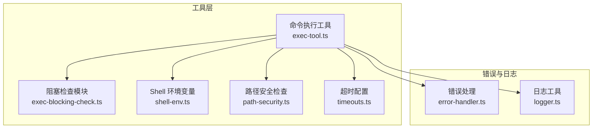
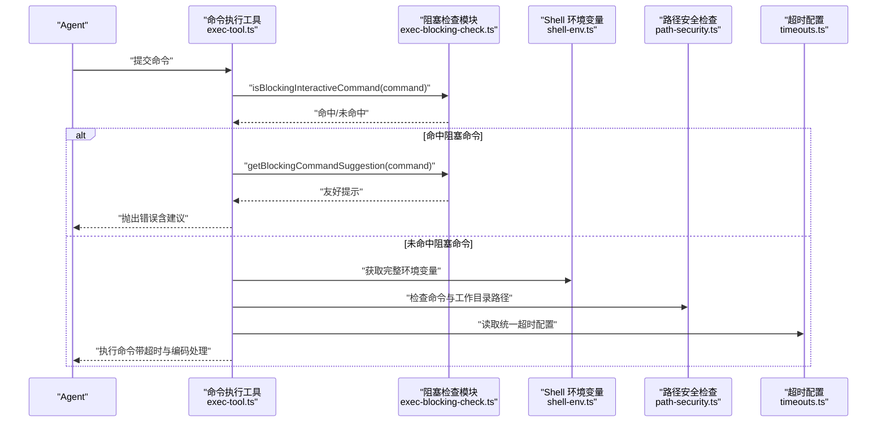
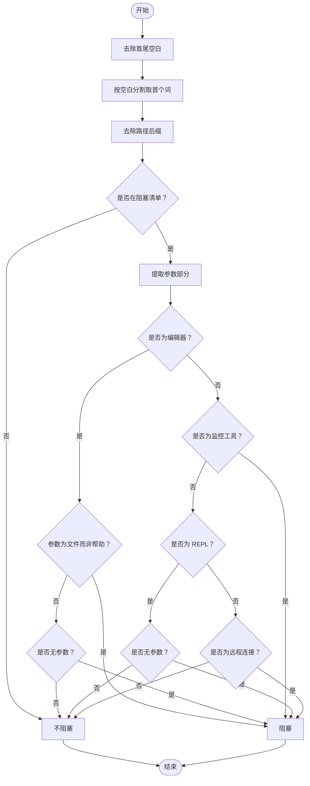
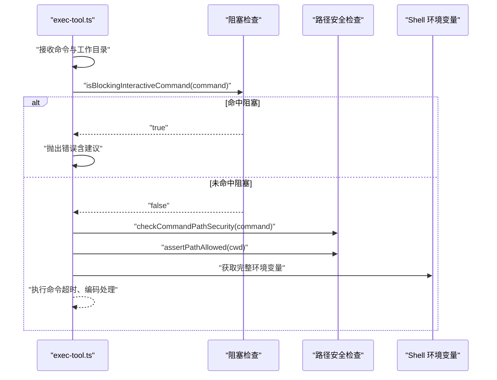
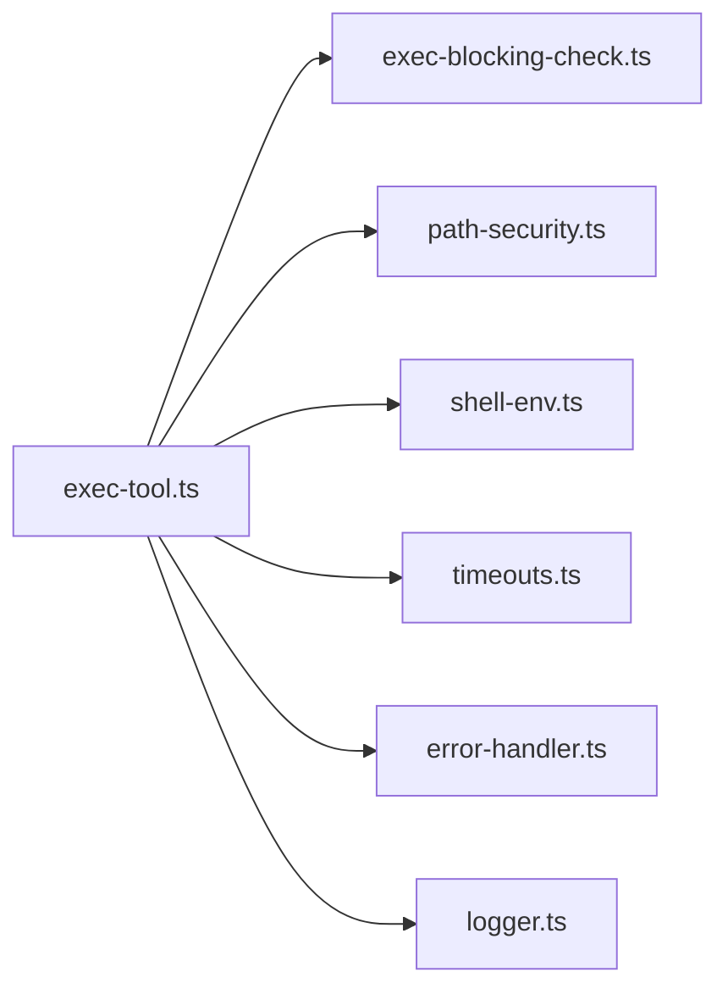

# 执行阻塞检查

<cite>
**本文引用的文件**
- [exec-blocking-check.ts](file://src/main/tools/exec-blocking-check.ts)
- [exec-tool.ts](file://src/main/tools/exec-tool.ts)
- [timeouts.ts](file://src/main/config/timeouts.ts)
- [path-security.ts](file://src/main/utils/path-security.ts)
- [shell-env.ts](file://src/main/tools/shell-env.ts)
- [error-handler.ts](file://src/shared/utils/error-handler.ts)
- [logger.ts](file://src/shared/utils/logger.ts)
</cite>

## 目录
1. [简介](#简介)
2. [项目结构](#项目结构)
3. [核心组件](#核心组件)
4. [架构总览](#架构总览)
5. [详细组件分析](#详细组件分析)
6. [依赖关系分析](#依赖关系分析)
7. [性能考量](#性能考量)
8. [故障排查指南](#故障排查指南)
9. [结论](#结论)

## 简介
本文件面向 史丽慧小助理 的“执行阻塞检查”系统，系统性阐述阻塞交互式命令检测机制的设计与实现，包括：
- 命令识别算法与阻塞判断逻辑
- 拦截策略与错误处理
- 纯交互式命令清单、特殊处理规则与命令参数分析机制
- 如何检测会阻塞等待用户输入的命令（编辑器、监控工具、REPL 环境等）
- 友好提示与替代方案建议
- 检测流程、错误处理与日志记录机制

## 项目结构
阻塞检查功能主要位于工具层，围绕命令执行工具进行安全前置检查：
- 命令识别与拦截：src/main/tools/exec-blocking-check.ts
- 命令执行工具：src/main/tools/exec-tool.ts
- 超时配置：src/main/config/timeouts.ts
- 路径安全检查：src/main/utils/path-security.ts
- Shell 环境变量：src/main/tools/shell-env.ts
- 错误处理与日志：src/shared/utils/error-handler.ts、src/shared/utils/logger.ts

图表来源
- [exec-tool.ts:30-31](file://src/main/tools/exec-tool.ts#L30-L31)
- [exec-blocking-check.ts:18-36](file://src/main/tools/exec-blocking-check.ts#L18-L36)
- [shell-env.ts:355-416](file://src/main/tools/shell-env.ts#L355-L416)
- [path-security.ts:88-118](file://src/main/utils/path-security.ts#L88-L118)
- [timeouts.ts:35-36](file://src/main/config/timeouts.ts#L35-L36)
- [error-handler.ts:8-13](file://src/shared/utils/error-handler.ts#L8-L13)
- [logger.ts:16-30](file://src/shared/utils/logger.ts#L16-L30)

章节来源
- [exec-tool.ts:392-528](file://src/main/tools/exec-tool.ts#L392-L528)
- [exec-blocking-check.ts:18-129](file://src/main/tools/exec-blocking-check.ts#L18-L129)

## 核心组件
- 阻塞交互式命令识别与拦截
  - 纯交互式命令清单：编辑器、监控工具、REPL、远程连接等
  - 命令参数分析：区分“仅帮助参数”与“真正要打开文件”的场景
  - 特殊规则：无参数 REPL、监控工具、远程连接一律阻塞
- 命令执行工具的安全前置检查
  - 危险命令拦截、路径安全检查、环境变量注入、超时控制
  - 在执行前调用阻塞检查，若命中则抛出友好错误并终止执行
- 错误与日志
  - 统一错误消息提取与类型判定
  - 控制台与可选文件日志记录

章节来源
- [exec-blocking-check.ts:18-95](file://src/main/tools/exec-blocking-check.ts#L18-L95)
- [exec-tool.ts:412-416](file://src/main/tools/exec-tool.ts#L412-L416)
- [error-handler.ts:8-27](file://src/shared/utils/error-handler.ts#L8-L27)
- [logger.ts:96-130](file://src/shared/utils/logger.ts#L96-L130)

## 架构总览
阻塞检查在命令执行工具的“前置安全检查阶段”生效，形成如下调用链：

图表来源
- [exec-tool.ts:412-443](file://src/main/tools/exec-tool.ts#L412-L443)
- [exec-blocking-check.ts:44-95](file://src/main/tools/exec-blocking-check.ts#L44-L95)
- [shell-env.ts:355-416](file://src/main/tools/shell-env.ts#L355-L416)
- [path-security.ts:88-118](file://src/main/utils/path-security.ts#L88-L118)
- [timeouts.ts:35-36](file://src/main/config/timeouts.ts#L35-L36)

## 详细组件分析

### 阻塞交互式命令识别与拦截
- 纯交互式命令清单
  - 编辑器：vim、vi、nano、emacs
  - 监控工具：top、htop、less、more
  - REPL：python、node、irb、ipython、mysql、psql
  - 远程连接：ssh、telnet、ftp
- 命令识别算法
  - 去除首尾空白，按空白分割取首个词作为命令名
  - 去除路径后缀，得到最终命令名
  - 在清单中精确匹配
- 参数分析与特殊规则
  - 编辑器：若参数非帮助类（--help/--version/-h），则视为打开文件，阻塞；无参数也阻塞
  - 监控工具：top、htop、less、more 总是阻塞
  - REPL：无参数时阻塞；有脚本/命令参数时不阻塞
  - 远程连接：总是阻塞
- 友好提示与替代方案
  - 针对不同命令给出替代建议（如使用非交互式命令、脚本执行方式等）

图表来源
- [exec-blocking-check.ts:44-95](file://src/main/tools/exec-blocking-check.ts#L44-L95)

章节来源
- [exec-blocking-check.ts:18-129](file://src/main/tools/exec-blocking-check.ts#L18-L129)

### 命令执行工具中的拦截策略
- 调用时机
  - 在执行器内部的 exec 回调中，于路径与工作目录安全检查之前进行阻塞检查
- 拦截行为
  - 若命中阻塞命令，立即构造友好提示并抛出错误
  - 错误消息包含原命令与替代建议
- 与安全检查的关系
  - 阻塞检查先于路径安全检查，避免无效执行
  - 即使未阻塞，仍进行路径与工作目录的安全校验

图表来源
- [exec-tool.ts:412-443](file://src/main/tools/exec-tool.ts#L412-L443)
- [exec-blocking-check.ts:44-95](file://src/main/tools/exec-blocking-check.ts#L44-L95)
- [path-security.ts:88-118](file://src/main/utils/path-security.ts#L88-L118)
- [shell-env.ts:355-416](file://src/main/tools/shell-env.ts#L355-L416)

章节来源
- [exec-tool.ts:412-443](file://src/main/tools/exec-tool.ts#L412-L443)

### 命令参数分析机制
- 关键点
  - 仅当参数非帮助类开关时，才认为是“打开文件”，从而触发阻塞
  - 无参数的 REPL 会被识别为阻塞
  - 监控工具与远程连接无论参数如何均阻塞
- 设计动机
  - 避免将“查看版本/帮助”误判为阻塞
  - 保证对编辑器打开文件场景的准确拦截

章节来源
- [exec-blocking-check.ts:56-91](file://src/main/tools/exec-blocking-check.ts#L56-L91)

### 友好提示与替代方案
- 提示生成
  - 基于命令名映射到建议文案
  - 统一格式：说明拦截原因 + 替代建议
- 示例要点
  - 编辑器：建议使用文件工具或非交互式命令
  - 监控工具：建议使用非交互式列举命令
  - REPL：建议使用脚本执行或一次性命令执行
  - 远程连接：明确不可由 AI Agent 执行

章节来源
- [exec-blocking-check.ts:103-129](file://src/main/tools/exec-blocking-check.ts#L103-L129)

### 错误处理与日志记录
- 错误处理
  - 统一提取错误消息与类型判定
  - 在工具包装层对空输出进行“无输出即成功”的人性化提示修正
- 日志记录
  - 控制台日志支持级别与安全写入（规避 EPIPE）
  - 可选文件日志，按模块与时间戳记录

章节来源
- [error-handler.ts:8-27](file://src/shared/utils/error-handler.ts#L8-L27)
- [logger.ts:96-130](file://src/shared/utils/logger.ts#L96-L130)
- [exec-tool.ts:346-371](file://src/main/tools/exec-tool.ts#L346-L371)

## 依赖关系分析
- 模块耦合
  - exec-tool.ts 依赖阻塞检查模块、路径安全检查、Shell 环境变量与超时配置
  - 阻塞检查模块独立，仅依赖自身清单与参数解析
- 外部依赖
  - 子进程执行、编码处理（Windows GBK/UTF-8）
  - 动态导入外部工具库以封装底层执行

图表来源
- [exec-tool.ts:30-31](file://src/main/tools/exec-tool.ts#L30-L31)
- [exec-blocking-check.ts:18-36](file://src/main/tools/exec-blocking-check.ts#L18-L36)
- [path-security.ts:88-118](file://src/main/utils/path-security.ts#L88-L118)
- [shell-env.ts:355-416](file://src/main/tools/shell-env.ts#L355-L416)
- [timeouts.ts:35-36](file://src/main/config/timeouts.ts#L35-L36)
- [error-handler.ts:8-13](file://src/shared/utils/error-handler.ts#L8-L13)
- [logger.ts:16-30](file://src/shared/utils/logger.ts#L16-L30)

章节来源
- [exec-tool.ts:392-528](file://src/main/tools/exec-tool.ts#L392-L528)

## 性能考量
- 阻塞检查复杂度
  - 命令解析为 O(k)，k 为命令片段数
  - 清单匹配为 O(m)，m 为阻塞命令数量（较小常数集）
  - 整体近似 O(k)，常数极小，开销可忽略
- 执行路径
  - 阻塞检查在执行前短路，避免不必要的子进程启动
  - 超时统一配置，减少重复计算
- 平台差异
  - Windows 编码转换与 chcp 设置带来少量额外开销，但必要且可控

## 故障排查指南
- 症状：命令被拦截并提示“交互式命令会阻塞”
  - 排查要点
    - 确认命令是否为编辑器打开文件、REPL 无参数、监控工具或远程连接
    - 若为“查看版本/帮助”，请改用非交互式参数
  - 处理建议
    - 使用替代命令或脚本执行方式
    - 参考提示中的具体建议
- 症状：路径安全检查失败
  - 排查要点
    - 确认命令涉及的路径是否在允许目录范围内
    - 检查工作目录是否越权
  - 处理建议
    - 将操作限定在允许目录内
    - 在系统设置中调整工作目录
- 症状：执行长时间无响应
  - 排查要点
    - 检查是否误用会阻塞命令
    - 确认超时配置是否合理
  - 处理建议
    - 使用非交互式命令或缩短任务
    - 调整超时阈值（谨慎）

章节来源
- [exec-tool.ts:412-443](file://src/main/tools/exec-tool.ts#L412-L443)
- [path-security.ts:88-118](file://src/main/utils/path-security.ts#L88-L118)
- [timeouts.ts:35-36](file://src/main/config/timeouts.ts#L35-L36)

## 结论
史丽慧小助理 的执行阻塞检查通过“纯交互式命令清单 + 参数分析 + 特殊规则”的组合，实现了对会阻塞等待用户输入命令的高精度识别，并在命令执行工具的前置阶段进行拦截，配合友好提示与替代方案，有效避免了 AI Agent 因交互式命令而卡死的风险。该机制与路径安全检查、环境变量注入、统一超时配置协同工作，构成完整的命令执行安全体系。