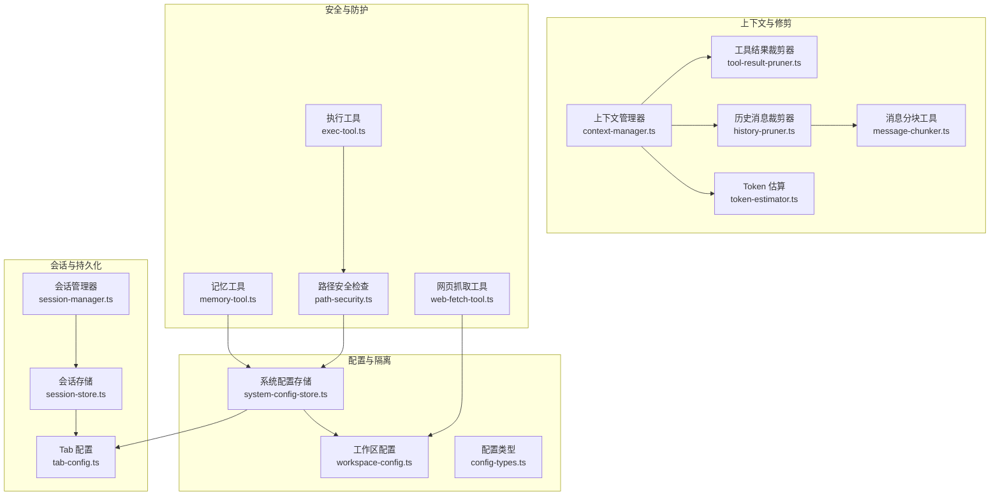
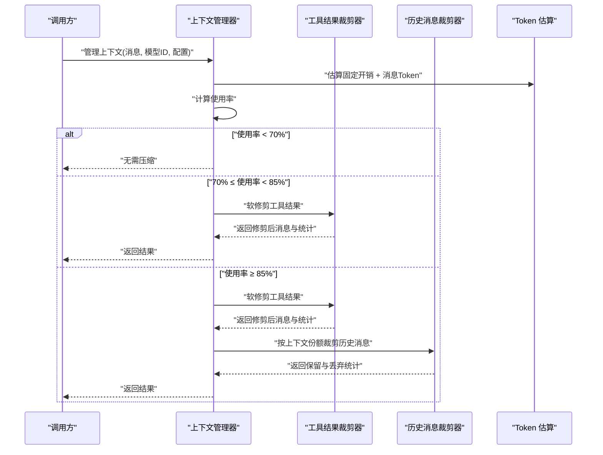
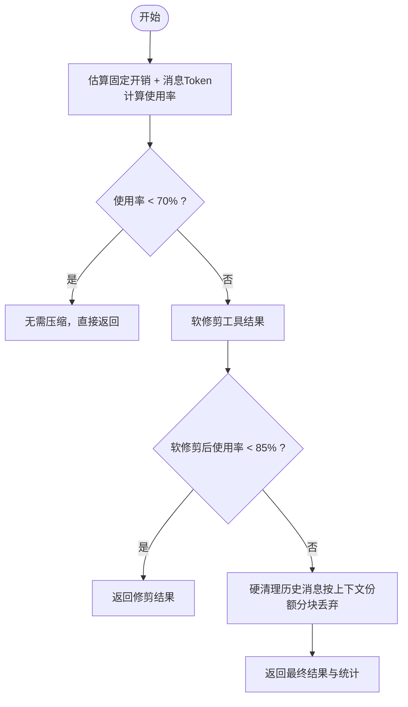
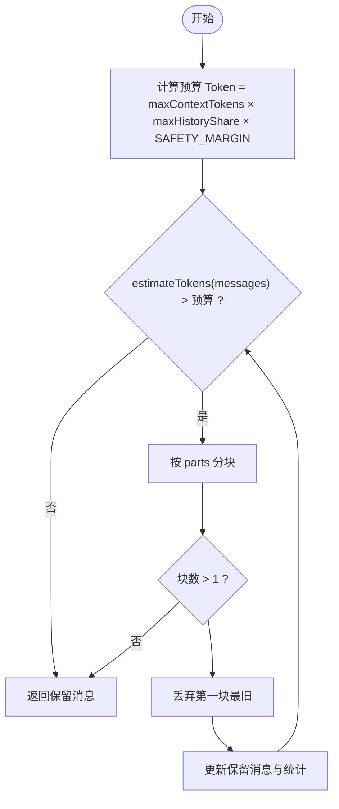
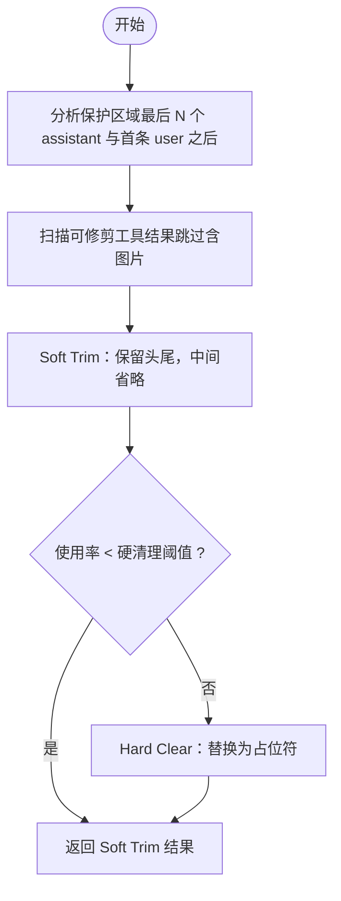
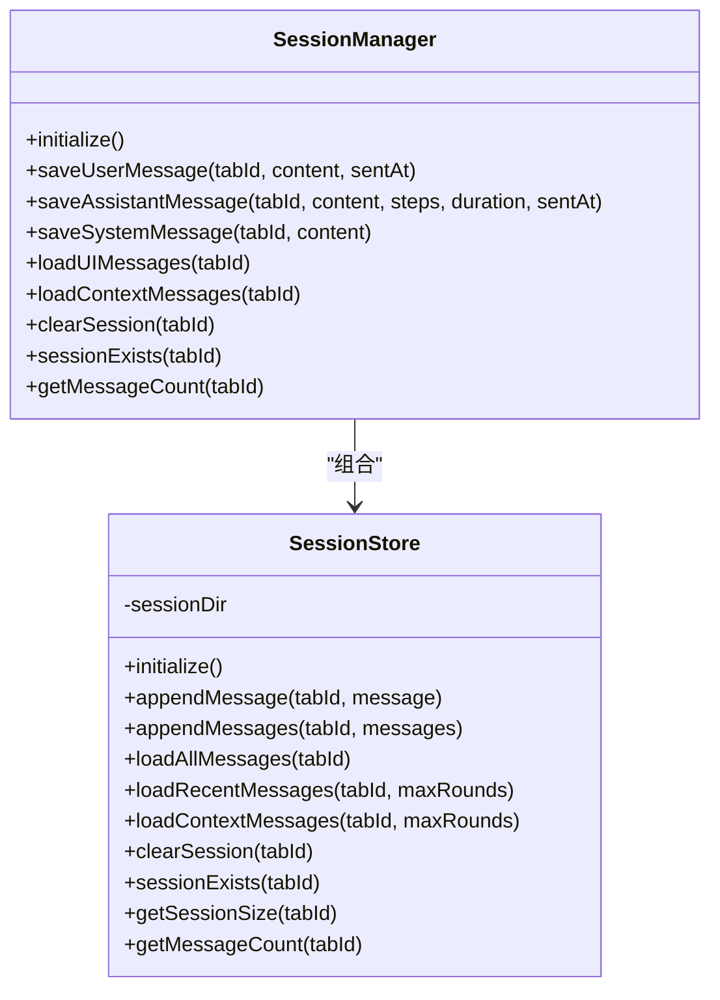
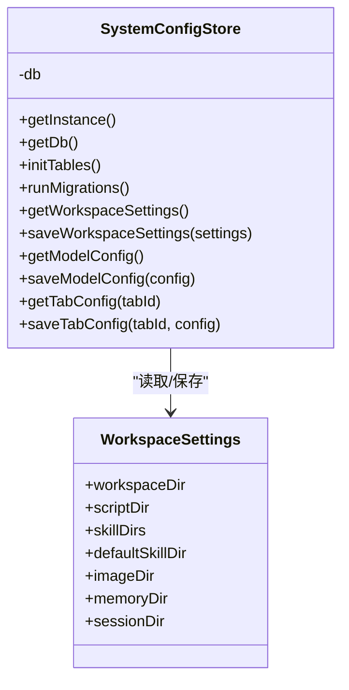
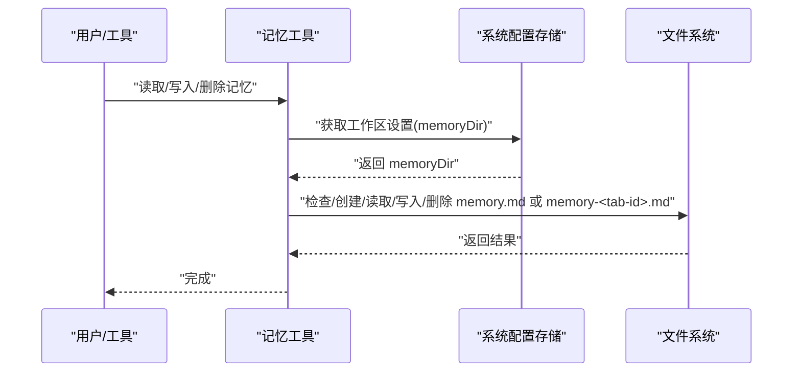
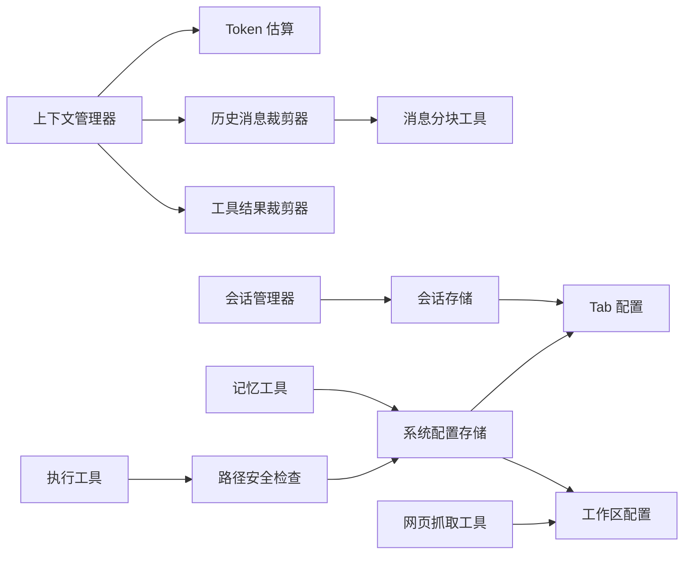

# 记忆和上下文安全

<cite>
**本文引用的文件**
- [src/main/context/context-manager.ts](file://src/main/context/context-manager.ts)
- [src/main/context/history-pruner.ts](file://src/main/context/history-pruner.ts)
- [src/main/context/tool-result-pruner.ts](file://src/main/context/tool-result-pruner.ts)
- [src/main/utils/token-estimator.ts](file://src/main/utils/token-estimator.ts)
- [src/main/utils/message-chunker.ts](file://src/main/utils/message-chunker.ts)
- [src/main/session/session-manager.ts](file://src/main/session/session-manager.ts)
- [src/main/session/session-store.ts](file://src/main/session/session-store.ts)
- [src/main/database/system-config-store.ts](file://src/main/database/system-config-store.ts)
- [src/main/database/workspace-config.ts](file://src/main/database/workspace-config.ts)
- [src/main/database/config-types.ts](file://src/main/database/config-types.ts)
- [src/main/database/tab-config.ts](file://src/main/database/tab-config.ts)
- [src/main/utils/path-security.ts](file://src/main/utils/path-security.ts)
- [src/main/tools/memory-tool.ts](file://src/main/tools/memory-tool.ts)
- [src/main/tools/exec-tool.ts](file://src/main/tools/exec-tool.ts)
- [src/main/tools/web-fetch-tool.ts](file://src/main/tools/web-fetch-tool.ts)
- [README.md](file://README.md)
</cite>

## 目录
1. [简介](#简介)
2. [项目结构](#项目结构)
3. [核心组件](#核心组件)
4. [架构总览](#架构总览)
5. [详细组件分析](#详细组件分析)
6. [依赖分析](#依赖分析)
7. [性能考量](#性能考量)
8. [故障排查指南](#故障排查指南)
9. [结论](#结论)
10. [附录](#附录)

## 简介
本文件聚焦 史丽慧小助理 的“记忆与上下文安全”体系，系统性阐述以下方面：
- 记忆文件权限管理：如何通过路径白名单与工作区配置限制对记忆文件的访问范围，防止越权读写。
- 上下文修剪机制：历史消息与工具结果的两阶段修剪策略，兼顾上下文窗口与任务完整性。
- 数据隔离策略：基于 Tab 的独立记忆文件、会话文件与持久化配置，实现跨角色的数据隔离。
- 敏感信息保护：路径安全检查、输入净化与访问控制，降低泄露风险。
- 安全审计与配置：上下文压缩建议、阈值与统计指标，辅助安全审计与容量规划。

## 项目结构
围绕“记忆与上下文安全”，相关代码主要分布在以下模块：
- 上下文管理与修剪：context-manager、history-pruner、tool-result-pruner、token-estimator、message-chunker
- 会话与持久化：session-manager、session-store、tab-config
- 配置与隔离：system-config-store、workspace-config、config-types
- 安全与防护：path-security、memory-tool、exec-tool、web-fetch-tool
- 文档与说明：README

图表来源
- [src/main/context/context-manager.ts:100-303](file://src/main/context/context-manager.ts#L100-L303)
- [src/main/context/history-pruner.ts:46-88](file://src/main/context/history-pruner.ts#L46-L88)
- [src/main/context/tool-result-pruner.ts:249-447](file://src/main/context/tool-result-pruner.ts#L249-L447)
- [src/main/utils/token-estimator.ts:103-154](file://src/main/utils/token-estimator.ts#L103-L154)
- [src/main/utils/message-chunker.ts:33-73](file://src/main/utils/message-chunker.ts#L33-L73)
- [src/main/session/session-manager.ts:17-130](file://src/main/session/session-manager.ts#L17-L130)
- [src/main/session/session-store.ts:46-321](file://src/main/session/session-store.ts#L46-L321)
- [src/main/database/system-config-store.ts:37-225](file://src/main/database/system-config-store.ts#L37-L225)
- [src/main/database/workspace-config.ts:17-89](file://src/main/database/workspace-config.ts#L17-L89)
- [src/main/database/config-types.ts:21-29](file://src/main/database/config-types.ts#L21-L29)
- [src/main/database/tab-config.ts:46-138](file://src/main/database/tab-config.ts#L46-L138)
- [src/main/utils/path-security.ts:59-83](file://src/main/utils/path-security.ts#L59-L83)
- [src/main/tools/memory-tool.ts:146-186](file://src/main/tools/memory-tool.ts#L146-L186)
- [src/main/tools/exec-tool.ts:88-121](file://src/main/tools/exec-tool.ts#L88-L121)
- [src/main/tools/web-fetch-tool.ts:255-294](file://src/main/tools/web-fetch-tool.ts#L255-L294)

章节来源
- [src/main/context/context-manager.ts:100-303](file://src/main/context/context-manager.ts#L100-L303)
- [src/main/session/session-manager.ts:17-130](file://src/main/session/session-manager.ts#L17-L130)
- [src/main/database/system-config-store.ts:37-225](file://src/main/database/system-config-store.ts#L37-L225)

## 核心组件
- 上下文管理器：统一入口，按阈值进行工具结果软修剪与历史消息硬裁剪，保护关键消息（首条用户消息与最后 N 条助手消息）。
- 历史消息裁剪器：支持按上下文份额分块丢弃、按 token 限制从后向前保留、智能保护策略等。
- 工具结果裁剪器：两阶段策略（Soft Trim → Hard Clear），保护最后 N 个助手消息，避免影响推理连续性。
- 会话管理与存储：按 Tab 维度持久化对话历史，限制加载轮次，支持清空与统计。
- 配置与隔离：通过系统配置存储与工作区配置，集中管理路径白名单与目录，实现数据隔离。
- 安全与防护：路径安全检查、执行工具白名单与严格校验、网页抓取内容净化，降低越权与注入风险。

章节来源
- [src/main/context/context-manager.ts:27-87](file://src/main/context/context-manager.ts#L27-L87)
- [src/main/context/history-pruner.ts:25-88](file://src/main/context/history-pruner.ts#L25-L88)
- [src/main/context/tool-result-pruner.ts:13-62](file://src/main/context/tool-result-pruner.ts#L13-L62)
- [src/main/session/session-manager.ts:17-130](file://src/main/session/session-manager.ts#L17-L130)
- [src/main/session/session-store.ts:46-321](file://src/main/session/session-store.ts#L46-L321)
- [src/main/database/system-config-store.ts:37-225](file://src/main/database/system-config-store.ts#L37-L225)
- [src/main/utils/path-security.ts:59-117](file://src/main/utils/path-security.ts#L59-L117)
- [src/main/tools/exec-tool.ts:88-121](file://src/main/tools/exec-tool.ts#L88-L121)
- [src/main/tools/web-fetch-tool.ts:255-294](file://src/main/tools/web-fetch-tool.ts#L255-L294)

## 架构总览
上下文安全由“感知—决策—执行—反馈”闭环构成：
- 感知：估算上下文使用率与固定开销（系统提示词、工具定义）。
- 决策：根据阈值（软修剪 70%、硬清理 85%）决定修剪策略。
- 执行：先工具结果修剪，再历史消息修剪，保护关键消息。
- 反馈：输出统计与压缩标记，便于审计与告警。

图表来源
- [src/main/context/context-manager.ts:100-303](file://src/main/context/context-manager.ts#L100-L303)
- [src/main/context/tool-result-pruner.ts:249-447](file://src/main/context/tool-result-pruner.ts#L249-L447)
- [src/main/context/history-pruner.ts:46-88](file://src/main/context/history-pruner.ts#L46-L88)
- [src/main/utils/token-estimator.ts:149-154](file://src/main/utils/token-estimator.ts#L149-L154)

## 详细组件分析

### 上下文管理器（Context Manager）
- 功能要点
  - 合成固定开销（系统提示词 + 工具定义字符数估算）与消息 Token，计算使用率。
  - 三阶段策略：使用率低于阈值直接返回；70%-85% 仅软修剪工具结果；≥85% 先软修剪再硬清理历史消息。
  - 保护策略：保留首条用户消息与最后 N 条助手消息，避免任务描述与近期推理中断。
  - 输出统计：工具结果软修剪/硬清理数量与节省 Token、历史丢弃消息与 Token、总节省 Token、上下文窗口等。
- 配置项
  - enabled：是否启用上下文管理。
  - pruning：工具结果修剪配置（软修剪阈值、硬清理阈值、头尾保留字符、占位符、保护助手消息数量、最小可修剪字符）。
  - compaction：历史消息裁剪配置（最大历史占比、预留 Token）。

图表来源
- [src/main/context/context-manager.ts:100-303](file://src/main/context/context-manager.ts#L100-L303)

章节来源
- [src/main/context/context-manager.ts:27-87](file://src/main/context/context-manager.ts#L27-L87)
- [src/main/context/context-manager.ts:100-303](file://src/main/context/context-manager.ts#L100-L303)

### 历史消息裁剪器（History Pruner）
- 策略
  - 按上下文份额裁剪：计算预算 Token（maxContextTokens × maxHistoryShare × 安全系数），按分块丢弃最旧消息，直到满足预算。
  - 简单裁剪：直接丢弃最旧 N 条消息。
  - 按 Token 限制裁剪：从后向前保留，直到达到 maxTokens。
  - 智能裁剪：保护首条用户消息与最后 N 条助手消息，剩余中间消息按剩余预算从后向前挑选。
- 关键参数
  - parts：分块数量（默认 2）。
  - maxHistoryShare：历史消息最大占比（默认 0.5）。
  - SAFETY_MARGIN：安全边界（默认 1.2）。
  - keepLastCount：智能裁剪保护的最后 N 条消息（默认 10）。

图表来源
- [src/main/context/history-pruner.ts:46-88](file://src/main/context/history-pruner.ts#L46-L88)
- [src/main/utils/message-chunker.ts:33-73](file://src/main/utils/message-chunker.ts#L33-L73)

章节来源
- [src/main/context/history-pruner.ts:46-88](file://src/main/context/history-pruner.ts#L46-L88)
- [src/main/context/history-pruner.ts:195-298](file://src/main/context/history-pruner.ts#L195-L298)
- [src/main/utils/message-chunker.ts:33-73](file://src/main/utils/message-chunker.ts#L33-L73)

### 工具结果裁剪器（Tool Result Pruner）
- 两阶段策略
  - Soft Trim：保留头尾固定字符，中间用省略号替代，适用于纯文本工具结果（跳过含图片的结果）。
  - Hard Clear：将工具结果替换为占位符，彻底释放上下文。
- 保护机制
  - 保护最后 N 个 assistant 消息（默认 1），避免影响推理连贯性。
  - 保护首条 user 消息之后的所有消息，确保任务上下文不被误删。
- 配置与统计
  - 软修剪阈值（默认 0.7）、硬清理阈值（默认 0.85）、头尾字符数、最小可修剪字符、占位符、保护助手消息数量。
  - 统计：软修剪数量、硬清理数量、修剪前后 Token 数、节省 Token。

图表来源
- [src/main/context/tool-result-pruner.ts:249-447](file://src/main/context/tool-result-pruner.ts#L249-L447)

章节来源
- [src/main/context/tool-result-pruner.ts:13-62](file://src/main/context/tool-result-pruner.ts#L13-L62)
- [src/main/context/tool-result-pruner.ts:249-447](file://src/main/context/tool-result-pruner.ts#L249-L447)

### 会话管理与存储（Session Manager & Store）
- 会话管理器
  - 限制 UI 显示轮次（默认 100）、Agent 上下文轮次（默认 10）。
  - 提供保存用户/助手/系统消息、加载 UI/上下文消息、清空会话、统计消息数量等能力。
- 会话存储
  - JSONL 格式按 Tab 持久化，支持倒序读取优化，仅加载所需轮次。
  - 提供清空、存在性检查、文件大小与消息数量统计。

图表来源
- [src/main/session/session-manager.ts:17-130](file://src/main/session/session-manager.ts#L17-L130)
- [src/main/session/session-store.ts:46-321](file://src/main/session/session-store.ts#L46-L321)

章节来源
- [src/main/session/session-manager.ts:17-130](file://src/main/session/session-manager.ts#L17-L130)
- [src/main/session/session-store.ts:46-321](file://src/main/session/session-store.ts#L46-L321)

### 配置与数据隔离（System Config Store & Workspace Config）
- 系统配置存储
  - 单例管理，SQLite 持久化，包含环境配置、工作区设置、模型配置、工具配置、连接器配置、Tab 配置等表。
  - Docker 模式与普通模式下的数据库路径差异，保证部署一致性。
- 工作区配置
  - 统一管理工作目录、脚本目录、Skill 目录、图片目录、记忆目录、会话目录等。
  - Docker 模式下强制使用固定路径，避免路径逃逸。
- 配置类型
  - 明确定义各配置的数据结构，确保类型安全。

图表来源
- [src/main/database/system-config-store.ts:37-225](file://src/main/database/system-config-store.ts#L37-L225)
- [src/main/database/workspace-config.ts:17-89](file://src/main/database/workspace-config.ts#L17-L89)
- [src/main/database/config-types.ts:21-29](file://src/main/database/config-types.ts#L21-L29)

章节来源
- [src/main/database/system-config-store.ts:37-225](file://src/main/database/system-config-store.ts#L37-L225)
- [src/main/database/workspace-config.ts:17-89](file://src/main/database/workspace-config.ts#L17-L89)
- [src/main/database/config-types.ts:21-29](file://src/main/database/config-types.ts#L21-L29)

### 记忆文件权限管理与数据隔离
- 记忆文件定位
  - 全局记忆：memory.md，位于工作区记忆目录。
  - 独立记忆：memory-<tab-id>.md，可由 Tab 配置单独指定文件名。
- 路径安全检查
  - 通过路径白名单（工作目录、脚本目录、Skill 目录、图片目录、记忆目录、会话目录等）限制访问范围。
  - Docker 模式下默认放行，避免容器内路径限制带来的复杂性。
- 记忆工具
  - 自动创建默认模板文件，确保首次使用可用。
  - 支持读取、写入、删除独立记忆文件，删除前检查文件存在性。

图表来源
- [src/main/tools/memory-tool.ts:146-186](file://src/main/tools/memory-tool.ts#L146-L186)
- [src/main/database/system-config-store.ts:37-225](file://src/main/database/system-config-store.ts#L37-L225)
- [src/main/database/workspace-config.ts:147-150](file://src/main/database/workspace-config.ts#L147-L150)

章节来源
- [src/main/tools/memory-tool.ts:146-186](file://src/main/tools/memory-tool.ts#L146-L186)
- [src/main/utils/path-security.ts:59-117](file://src/main/utils/path-security.ts#L59-L117)
- [src/main/database/workspace-config.ts:147-150](file://src/main/database/workspace-config.ts#L147-L150)

### 安全与防护机制
- 路径安全检查
  - 严格限制文件访问范围，结合工作区配置与 Docker 模式动态调整。
- 执行工具安全
  - 命令路径白名单与系统设备文件白名单，拒绝越权路径。
- 输入净化
  - 网页抓取工具对 HTML 标签、实体与不可见 Unicode 字符进行清洗，降低注入风险。
- 记忆与会话隔离
  - Tab 级别独立记忆文件与会话文件，配合路径白名单，实现跨角色数据隔离。

章节来源
- [src/main/utils/path-security.ts:59-117](file://src/main/utils/path-security.ts#L59-L117)
- [src/main/tools/exec-tool.ts:88-121](file://src/main/tools/exec-tool.ts#L88-L121)
- [src/main/tools/web-fetch-tool.ts:255-294](file://src/main/tools/web-fetch-tool.ts#L255-L294)
- [src/main/session/session-store.ts:68-70](file://src/main/session/session-store.ts#L68-L70)

## 依赖分析
- 上下文管理器依赖
  - 工具结果裁剪器：用于软修剪与硬清理。
  - 历史消息裁剪器：用于历史消息硬裁剪。
  - Token 估算：用于固定开销与消息 Token 估算、上下文窗口获取。
  - 消息分块工具：用于历史消息按份额分块。
- 会话管理器依赖
  - 会话存储：提供消息持久化与加载。
  - Tab 配置：用于独立记忆文件与 Agent 名称等。
- 配置存储依赖
  - 工作区配置：提供目录白名单。
  - Tab 配置：提供独立记忆文件名。
- 安全依赖
  - 路径安全检查：统一约束文件访问。
  - 执行工具与网页抓取工具：分别处理命令执行与输入净化。

图表来源
- [src/main/context/context-manager.ts:100-303](file://src/main/context/context-manager.ts#L100-L303)
- [src/main/context/history-pruner.ts:46-88](file://src/main/context/history-pruner.ts#L46-L88)
- [src/main/context/tool-result-pruner.ts:249-447](file://src/main/context/tool-result-pruner.ts#L249-L447)
- [src/main/utils/token-estimator.ts:103-154](file://src/main/utils/token-estimator.ts#L103-L154)
- [src/main/utils/message-chunker.ts:33-73](file://src/main/utils/message-chunker.ts#L33-L73)
- [src/main/session/session-manager.ts:17-130](file://src/main/session/session-manager.ts#L17-L130)
- [src/main/session/session-store.ts:46-321](file://src/main/session/session-store.ts#L46-L321)
- [src/main/database/system-config-store.ts:37-225](file://src/main/database/system-config-store.ts#L37-L225)
- [src/main/database/workspace-config.ts:17-89](file://src/main/database/workspace-config.ts#L17-L89)
- [src/main/database/tab-config.ts:46-138](file://src/main/database/tab-config.ts#L46-L138)
- [src/main/utils/path-security.ts:59-117](file://src/main/utils/path-security.ts#L59-L117)
- [src/main/tools/memory-tool.ts:146-186](file://src/main/tools/memory-tool.ts#L146-L186)
- [src/main/tools/exec-tool.ts:88-121](file://src/main/tools/exec-tool.ts#L88-L121)
- [src/main/tools/web-fetch-tool.ts:255-294](file://src/main/tools/web-fetch-tool.ts#L255-L294)

## 性能考量
- 上下文修剪
  - 使用率阈值与安全边界减少不必要的修剪，避免过度裁剪导致任务中断。
  - 智能裁剪保护关键消息，平衡上下文窗口与任务完整性。
- 会话加载
  - 倒序读取与轮次限制（UI 100 轮、上下文 10 轮）显著降低 I/O 与内存占用。
  - JSONL 追加写入，避免大文件重写。
- Token 估算
  - 基于字符数与图片估算的快速估算，适合实时决策；上下文窗口优先从数据库读取，提升准确性。

章节来源
- [src/main/context/context-manager.ts:191-214](file://src/main/context/context-manager.ts#L191-L214)
- [src/main/session/session-store.ts:146-217](file://src/main/session/session-store.ts#L146-L217)
- [src/main/utils/token-estimator.ts:121-154](file://src/main/utils/token-estimator.ts#L121-L154)

## 故障排查指南
- 上下文频繁被修剪
  - 检查使用率统计与阈值配置，适当提高 maxHistoryShare 或 reserveTokens。
  - 确认是否频繁产生长工具结果，必要时调整工具结果修剪阈值。
- 历史消息被误删
  - 检查智能裁剪保护策略（首条用户消息与最后 N 条助手消息）是否生效。
  - 确认 parts 与 SAFETY_MARGIN 设置是否合理。
- 记忆文件读写失败
  - 检查工作区记忆目录配置与路径白名单，确认 Docker 模式下的目录映射。
  - 确认文件存在性与权限，必要时手动创建默认模板文件。
- 会话文件过大
  - 调整 UI/上下文轮次限制，定期清理非持久化 Tab。
  - 检查会话文件大小与消息数量统计，定位异常增长原因。

章节来源
- [src/main/context/context-manager.ts:313-365](file://src/main/context/context-manager.ts#L313-L365)
- [src/main/context/history-pruner.ts:195-298](file://src/main/context/history-pruner.ts#L195-L298)
- [src/main/session/session-store.ts:250-321](file://src/main/session/session-store.ts#L250-L321)
- [src/main/database/workspace-config.ts:147-150](file://src/main/database/workspace-config.ts#L147-L150)

## 结论
史丽慧小助理 的“记忆与上下文安全”体系通过“配置驱动的路径白名单 + 两阶段上下文修剪 + Tab 级别数据隔离 + 输入净化与访问控制”的组合拳，实现了：
- 可控的上下文窗口与任务完整性
- 可审计的修剪统计与使用率监控
- 可扩展的记忆与会话持久化
- 可落地的安全基线与部署适配

建议在生产环境中：
- 明确阈值与预算，结合业务负载动态调整。
- 强化日志与审计，关注修剪统计与使用率趋势。
- 严格限制工作区目录，确保 Docker 与本地部署一致。
- 定期清理非持久化资源，控制存储与会话规模。

## 附录

### 安全配置选项与隐私保护最佳实践
- 上下文管理配置
  - enabled：默认开启，建议在高负载场景谨慎关闭。
  - pruning.softTrimRatio / hardClearRatio：默认 0.7 / 0.85，可根据模型上下文窗口与任务复杂度微调。
  - pruning.headChars / tailChars / minPrunableChars：平衡上下文与可读性。
  - pruning.keepLastAssistants：默认 1，建议保持以维持推理连贯性。
  - compaction.maxHistoryShare：默认 0.5，建议结合业务对话长度调整。
  - compaction.reserveTokens：默认 2000，建议根据系统提示词与工具定义长度调整。
- 路径安全与访问控制
  - 严格配置工作区目录，确保仅允许访问配置的目录及其子目录。
  - Docker 模式下依赖容器挂载与固定路径，避免路径逃逸。
  - 执行工具严格白名单，拒绝越权路径。
- 数据隔离与清理
  - 使用 Tab 独立记忆文件，避免跨角色数据污染。
  - 定期清理非持久化 Tab 与会话文件，控制存储占用。
- 敏感信息保护
  - 网页抓取内容进行标签与实体清洗，去除不可见字符。
  - 记忆与会话内容避免存储明文敏感信息，必要时进行脱敏处理。

章节来源
- [src/main/context/context-manager.ts:27-46](file://src/main/context/context-manager.ts#L27-L46)
- [src/main/context/tool-result-pruner.ts:13-34](file://src/main/context/tool-result-pruner.ts#L13-L34)
- [src/main/utils/path-security.ts:59-117](file://src/main/utils/path-security.ts#L59-L117)
- [src/main/tools/exec-tool.ts:88-121](file://src/main/tools/exec-tool.ts#L88-L121)
- [src/main/tools/web-fetch-tool.ts:255-294](file://src/main/tools/web-fetch-tool.ts#L255-L294)
- [src/main/database/workspace-config.ts:17-46](file://src/main/database/workspace-config.ts#L17-L46)
- [README.md:498-534](file://README.md#L498-L534)