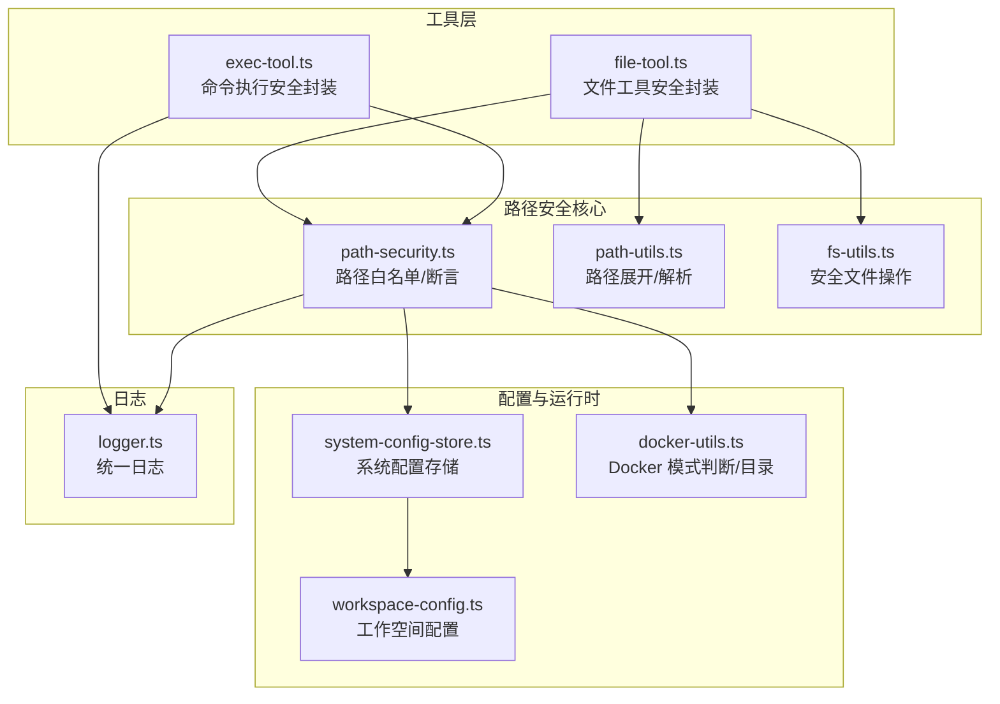
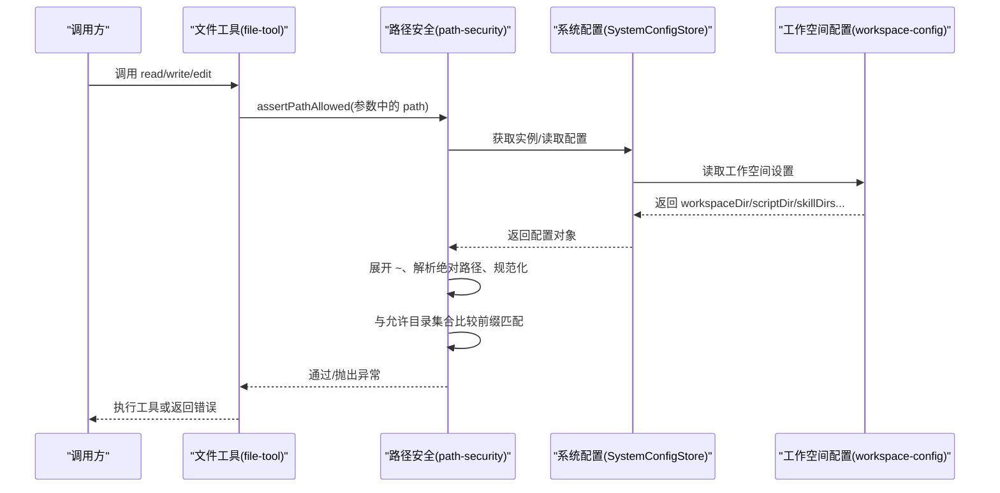
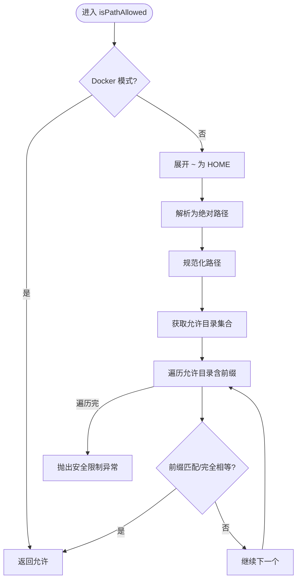
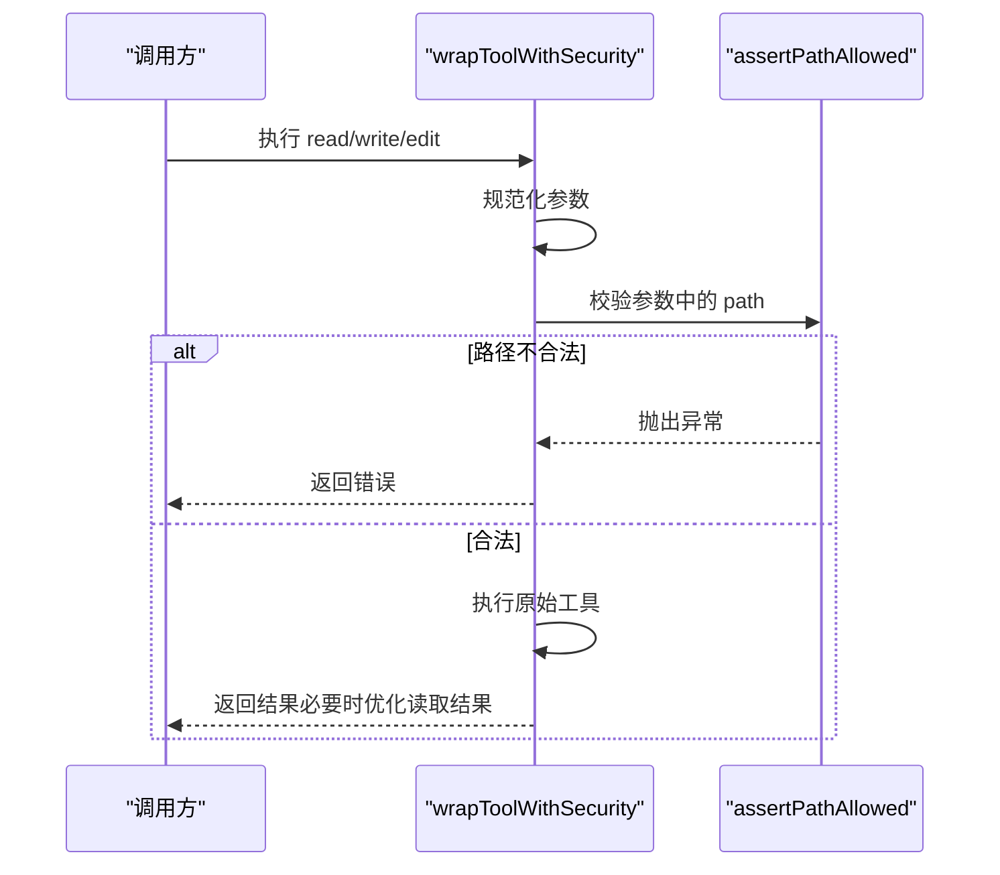
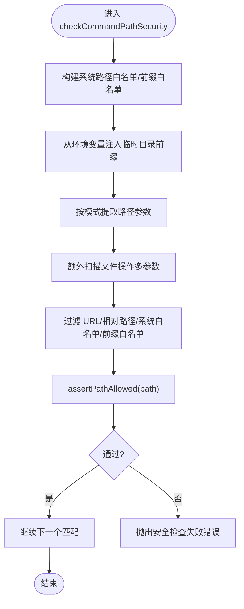
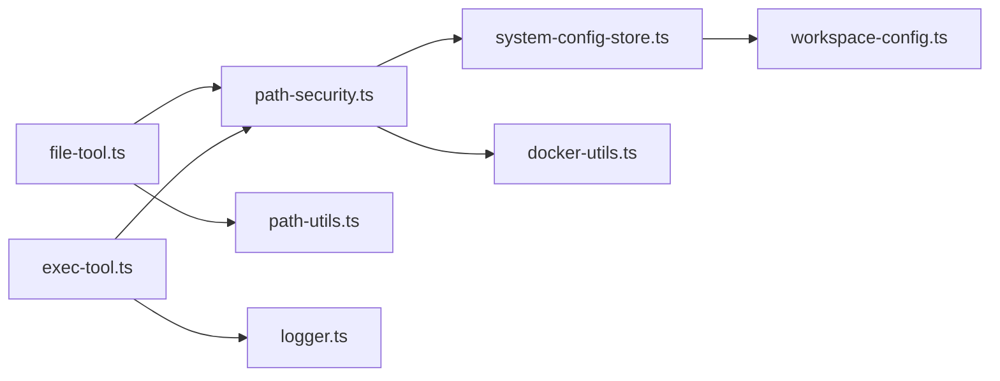

# 路径安全检查

<cite>
**本文引用的文件**
- [src/main/utils/path-security.ts](file://src/main/utils/path-security.ts)
- [src/main/tools/file-tool.ts](file://src/main/tools/file-tool.ts)
- [src/main/tools/exec-tool.ts](file://src/main/tools/exec-tool.ts)
- [src/shared/utils/path-utils.ts](file://src/shared/utils/path-utils.ts)
- [src/main/database/system-config-store.ts](file://src/main/database/system-config-store.ts)
- [src/main/database/workspace-config.ts](file://src/main/database/workspace-config.ts)
- [src/shared/utils/docker-utils.ts](file://src/shared/utils/docker-utils.ts)
- [src/shared/utils/fs-utils.ts](file://src/shared/utils/fs-utils.ts)
- [src/shared/utils/logger.ts](file://src/shared/utils/logger.ts)
</cite>

## 目录
1. [简介](#简介)
2. [项目结构](#项目结构)
3. [核心组件](#核心组件)
4. [架构总览](#架构总览)
5. [详细组件分析](#详细组件分析)
6. [依赖关系分析](#依赖关系分析)
7. [性能考量](#性能考量)
8. [故障排查指南](#故障排查指南)
9. [结论](#结论)
10. [附录](#附录)

## 简介
本文件面向 DeepBot 的路径安全检查机制，系统性阐述路径白名单与边界控制的实现原理、验证算法、检查流程与防护策略。重点覆盖以下方面：
- 如何防止路径遍历攻击、目录穿越与恶意文件访问
- 路径规范化处理、相对路径转换与绝对路径限制
- 白名单机制（精确匹配与前缀匹配）、系统路径豁免与环境变量临时目录注入
- 命令级路径安全检查（exec 工具）与文件工具的安全封装
- 最佳实践与常见威胁的防护方法
- 安全检查日志与可观测性建议

## 项目结构
与路径安全相关的核心文件分布如下：
- 路径安全工具：统一的路径白名单与断言
- 文件工具：对读/写/编辑工具进行安全封装
- 命令执行工具：对 shell 命令进行路径与危险命令双重检查
- 路径与配置工具：路径展开、配置加载、Docker 模式适配
- 日志工具：统一日志输出与文件落盘

**图示来源**
- [src/main/utils/path-security.ts:1-118](file://src/main/utils/path-security.ts#L1-L118)
- [src/main/tools/file-tool.ts:1-219](file://src/main/tools/file-tool.ts#L1-L219)
- [src/main/tools/exec-tool.ts:35-306](file://src/main/tools/exec-tool.ts#L35-L306)
- [src/shared/utils/path-utils.ts:1-48](file://src/shared/utils/path-utils.ts#L1-L48)
- [src/shared/utils/fs-utils.ts:1-162](file://src/shared/utils/fs-utils.ts#L1-L162)
- [src/main/database/system-config-store.ts:1-576](file://src/main/database/system-config-store.ts#L1-L576)
- [src/main/database/workspace-config.ts:1-219](file://src/main/database/workspace-config.ts#L1-L219)
- [src/shared/utils/docker-utils.ts:1-25](file://src/shared/utils/docker-utils.ts#L1-L25)
- [src/shared/utils/logger.ts:1-176](file://src/shared/utils/logger.ts#L1-L176)

**章节来源**
- [src/main/utils/path-security.ts:1-118](file://src/main/utils/path-security.ts#L1-L118)
- [src/main/tools/file-tool.ts:1-219](file://src/main/tools/file-tool.ts#L1-L219)
- [src/main/tools/exec-tool.ts:35-306](file://src/main/tools/exec-tool.ts#L35-L306)
- [src/shared/utils/path-utils.ts:1-48](file://src/shared/utils/path-utils.ts#L1-L48)
- [src/shared/utils/fs-utils.ts:1-162](file://src/shared/utils/fs-utils.ts#L1-L162)
- [src/main/database/system-config-store.ts:1-576](file://src/main/database/system-config-store.ts#L1-L576)
- [src/main/database/workspace-config.ts:1-219](file://src/main/database/workspace-config.ts#L1-L219)
- [src/shared/utils/docker-utils.ts:1-25](file://src/shared/utils/docker-utils.ts#L1-L25)
- [src/shared/utils/logger.ts:1-176](file://src/shared/utils/logger.ts#L1-L176)

## 核心组件
- 路径安全工具（path-security.ts）
  - 提供路径展开、白名单目录聚合、路径合法性断言与错误信息生成
  - Docker 模式下跳过路径检查，普通模式下严格校验
- 文件工具（file-tool.ts）
  - 对读/写/编辑工具进行安全封装，统一调用断言函数
  - 参数规范化（Claude 风格到内部风格），读取结果优化
- 命令执行工具（exec-tool.ts）
  - 危险命令黑名单与正则模式检测
  - 命令级路径提取与白名单/前缀匹配检查，结合 assertPathAllowed
- 路径与配置工具（path-utils.ts、workspace-config.ts、docker-utils.ts）
  - 路径展开（~）、绝对路径解析
  - 工作空间配置（工作目录、脚本目录、技能目录、图片/记忆/会话目录）
  - Docker 模式下的固定目录与环境变量注入
- 日志工具（logger.ts）
  - 统一日志输出、文件落盘与模块化管理

**章节来源**
- [src/main/utils/path-security.ts:1-118](file://src/main/utils/path-security.ts#L1-L118)
- [src/main/tools/file-tool.ts:140-177](file://src/main/tools/file-tool.ts#L140-L177)
- [src/main/tools/exec-tool.ts:35-306](file://src/main/tools/exec-tool.ts#L35-L306)
- [src/shared/utils/path-utils.ts:1-48](file://src/shared/utils/path-utils.ts#L1-L48)
- [src/main/database/workspace-config.ts:1-219](file://src/main/database/workspace-config.ts#L1-L219)
- [src/shared/utils/docker-utils.ts:1-25](file://src/shared/utils/docker-utils.ts#L1-L25)
- [src/shared/utils/logger.ts:1-176](file://src/shared/utils/logger.ts#L1-L176)

## 架构总览
路径安全检查贯穿“配置—工具—执行”链路，形成“白名单+系统豁免+危险命令”的三层防护。

**图示来源**
- [src/main/tools/file-tool.ts:148-177](file://src/main/tools/file-tool.ts#L148-L177)
- [src/main/utils/path-security.ts:59-117](file://src/main/utils/path-security.ts#L59-L117)
- [src/main/database/system-config-store.ts:37-70](file://src/main/database/system-config-store.ts#L37-L70)
- [src/main/database/workspace-config.ts:51-89](file://src/main/database/workspace-config.ts#L51-L89)

## 详细组件分析

### 路径安全工具（path-security.ts）
- 路径展开与规范化
  - 展开 ~ 为主目录；解析为绝对路径并规范化，避免 ../ 等绕过
- 允许目录集合
  - 从系统配置中读取工作目录、脚本目录、技能目录、图片/记忆/会话目录
  - Docker 模式下使用固定目录（/data/*），普通模式下使用用户目录
- 白名单与系统豁免
  - 精确匹配：/dev/null、Windows 设备文件等
  - 前缀匹配：/tmp/、/var/tmp/、/var/log/、/proc/、/sys/、/run/ 等
  - 动态注入：从环境变量（TMPDIR/TEMP/TMP）读取临时目录并追加前缀白名单
- 断言与错误信息
  - 不在允许范围即抛出异常，包含允许目录列表与请求路径，便于定位问题

**图示来源**
- [src/main/utils/path-security.ts:59-117](file://src/main/utils/path-security.ts#L59-L117)
- [src/main/database/workspace-config.ts:17-46](file://src/main/database/workspace-config.ts#L17-L46)
- [src/shared/utils/docker-utils.ts:10-24](file://src/shared/utils/docker-utils.ts#L10-L24)

**章节来源**
- [src/main/utils/path-security.ts:1-118](file://src/main/utils/path-security.ts#L1-L118)
- [src/main/database/workspace-config.ts:1-219](file://src/main/database/workspace-config.ts#L1-L219)
- [src/shared/utils/docker-utils.ts:1-25](file://src/shared/utils/docker-utils.ts#L1-L25)

### 文件工具安全封装（file-tool.ts）
- 参数规范化
  - 将外部传入的 file_path/old_string/new_string 规范化为内部 path/oldText/newText
- 安全检查
  - 从参数中提取 path，调用 assertPathAllowed 进行严格校验
- 读取结果优化
  - 对图片文件移除大体积 base64 数据，仅返回类型、大小与可读性状态
  - 对空文件补充明确提示（存在但为空）

**图示来源**
- [src/main/tools/file-tool.ts:148-177](file://src/main/tools/file-tool.ts#L148-L177)
- [src/main/utils/path-security.ts:91-117](file://src/main/utils/path-security.ts#L91-L117)

**章节来源**
- [src/main/tools/file-tool.ts:1-219](file://src/main/tools/file-tool.ts#L1-L219)
- [src/shared/utils/path-utils.ts:1-48](file://src/shared/utils/path-utils.ts#L1-L48)
- [src/shared/utils/fs-utils.ts:1-162](file://src/shared/utils/fs-utils.ts#L1-L162)

### 命令执行安全封装（exec-tool.ts）
- 危险命令检测
  - 黑名单：如 rm -rf /、格式化命令、关机命令、Fork 炸弹等
  - 正则模式：覆盖常见危险组合
- 命令级路径提取与白名单
  - 提取 cd、文件操作、重定向、脚本执行等场景的路径参数
  - 跳过 URL、相对路径、纯文件名、系统白名单与前缀白名单
  - 对绝对路径调用 assertPathAllowed 进行严格检查
- 环境变量与 PATH 注入
  - 动态获取完整 shell 环境变量，支持 /reload-env 刷新
- 异常与日志
  - 危险命令直接拦截；路径不安全抛出带命令与路径的错误信息

**图示来源**
- [src/main/tools/exec-tool.ts:88-281](file://src/main/tools/exec-tool.ts#L88-L281)
- [src/main/utils/path-security.ts:91-117](file://src/main/utils/path-security.ts#L91-L117)

**章节来源**
- [src/main/tools/exec-tool.ts:35-306](file://src/main/tools/exec-tool.ts#L35-L306)

### 路径展开与解析（path-utils.ts）
- 展开 ~ 为用户主目录
- 解析为绝对路径，兼容相对路径
- 提供检查是否以 ~ 开头与获取用户主目录的工具

**章节来源**
- [src/shared/utils/path-utils.ts:1-48](file://src/shared/utils/path-utils.ts#L1-L48)

### 配置与运行时适配（system-config-store.ts、workspace-config.ts、docker-utils.ts）
- 系统配置存储
  - 单例数据库（SQLite）持久化系统配置
  - 提供工作空间设置的读取、保存与迁移
- 工作空间配置
  - Docker 模式强制使用 /data/* 固定路径
  - 普通模式默认用户目录，支持自定义脚本/技能/图片/记忆/会话目录
- Docker 模式判断与数据库目录
  - 通过环境变量 DEEPBOT_DOCKER 与 DB_DIR 控制行为

**章节来源**
- [src/main/database/system-config-store.ts:1-576](file://src/main/database/system-config-store.ts#L1-L576)
- [src/main/database/workspace-config.ts:1-219](file://src/main/database/workspace-config.ts#L1-L219)
- [src/shared/utils/docker-utils.ts:1-25](file://src/shared/utils/docker-utils.ts#L1-L25)

### 安全检查日志（logger.ts）
- 统一日志输出与文件落盘
- 模块化日志器，支持级别控制与文件开关
- 建议在路径安全检查与危险命令拦截处增加日志记录，便于审计与追踪

**章节来源**
- [src/shared/utils/logger.ts:1-176](file://src/shared/utils/logger.ts#L1-L176)

## 依赖关系分析
- 文件工具依赖路径安全工具与路径展开工具，间接依赖系统配置与 Docker 工具
- 命令执行工具依赖路径安全工具与日志工具
- 路径安全工具依赖系统配置存储与工作空间配置，受 Docker 工具影响

**图示来源**
- [src/main/tools/file-tool.ts:24-30](file://src/main/tools/file-tool.ts#L24-L30)
- [src/main/utils/path-security.ts:7-9](file://src/main/utils/path-security.ts#L7-L9)
- [src/main/tools/exec-tool.ts:317-346](file://src/main/tools/exec-tool.ts#L317-L346)
- [src/shared/utils/logger.ts:1-176](file://src/shared/utils/logger.ts#L1-L176)

**章节来源**
- [src/main/tools/file-tool.ts:1-219](file://src/main/tools/file-tool.ts#L1-L219)
- [src/main/utils/path-security.ts:1-118](file://src/main/utils/path-security.ts#L1-L118)
- [src/main/tools/exec-tool.ts:310-346](file://src/main/tools/exec-tool.ts#L310-L346)
- [src/shared/utils/logger.ts:1-176](file://src/shared/utils/logger.ts#L1-L176)

## 性能考量
- 路径检查复杂度
  - isPathAllowed 对每个请求路径进行一次规范化与一次允许目录集合遍历
  - 允许目录数量有限（通常 5-10 个），整体为 O(k)（k 为允许目录数）
- 白名单与前缀匹配
  - 精确匹配与前缀匹配均在内存中进行，性能开销极低
- 命令解析
  - 正则匹配与多参数扫描在高并发下需关注正则回溯风险，当前实现已尽量避免误匹配
- I/O 与数据库
  - 配置读取为一次性或缓存访问，对路径检查影响可忽略

## 故障排查指南
- 常见错误
  - “安全限制：只能访问配置的目录及其子目录内的文件”
    - 说明：请求路径不在允许目录集合内
    - 排查：确认路径是否位于工作目录、脚本目录、技能目录、图片/记忆/会话目录之一
- 日志建议
  - 在 assertPathAllowed 与危险命令拦截处增加日志记录，包含请求路径、允许目录列表与触发条件
  - 使用统一日志器，开启文件落盘以便审计
- Docker 模式
  - 确认 DEEPBOT_DOCKER 与 DB_DIR 环境变量设置正确
  - 确认 /data/* 目录挂载与权限配置

**章节来源**
- [src/main/utils/path-security.ts:91-117](file://src/main/utils/path-security.ts#L91-L117)
- [src/main/tools/exec-tool.ts:288-306](file://src/main/tools/exec-tool.ts#L288-L306)
- [src/shared/utils/logger.ts:1-176](file://src/shared/utils/logger.ts#L1-L176)

## 结论
DeepBot 的路径安全检查通过“白名单+系统豁免+危险命令”三重防护，结合路径规范化与 Docker 模式适配，有效抵御路径遍历、目录穿越与恶意文件访问。文件工具与命令执行工具在入口处统一接入安全检查，配合日志与配置管理，形成闭环的安全控制体系。

## 附录

### 路径安全最佳实践
- 严格限制允许目录集合，最小化暴露面
- 使用前缀白名单管理临时目录与系统目录
- 禁止在命令中使用相对路径访问受限目录，必要时通过 cwd 限定
- 对外部输入的路径参数进行参数规范化与断言检查
- 在 Docker 环境中固定目录并加强卷挂载权限控制
- 启用统一日志与审计，记录路径检查与危险命令拦截事件

### 常见威胁与防护方法
- 路径遍历（../）
  - 通过规范化与前缀匹配阻止
- 目录穿越（/etc/passwd）
  - 通过精确匹配系统白名单与断言检查阻止
- 恶意文件访问（脚本/配置文件）
  - 通过允许目录集合与前缀白名单限制
- 危险命令（rm -rf、dd、关机）
  - 通过黑名单与正则模式拦截