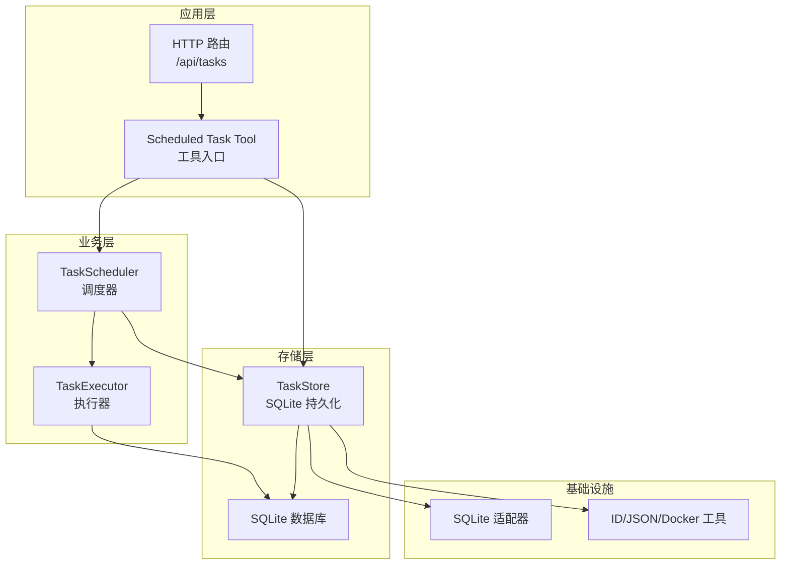
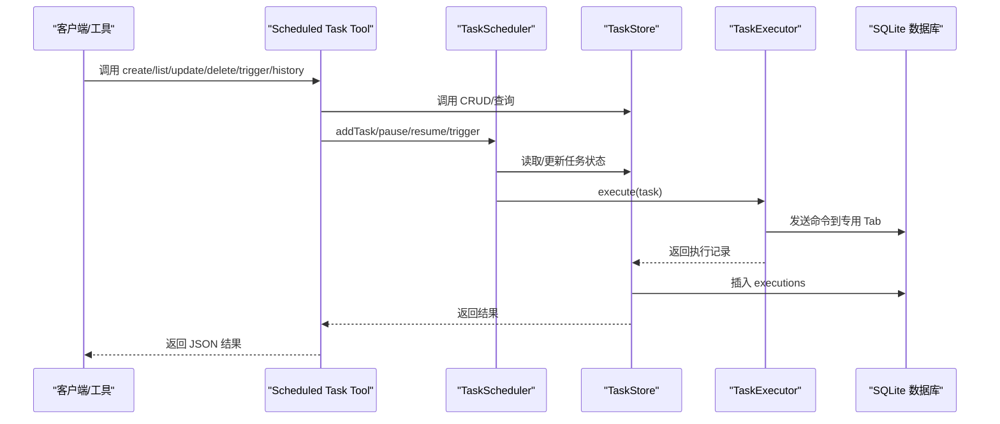
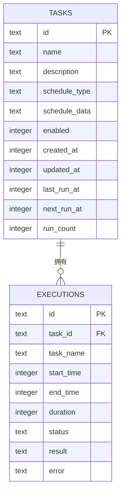
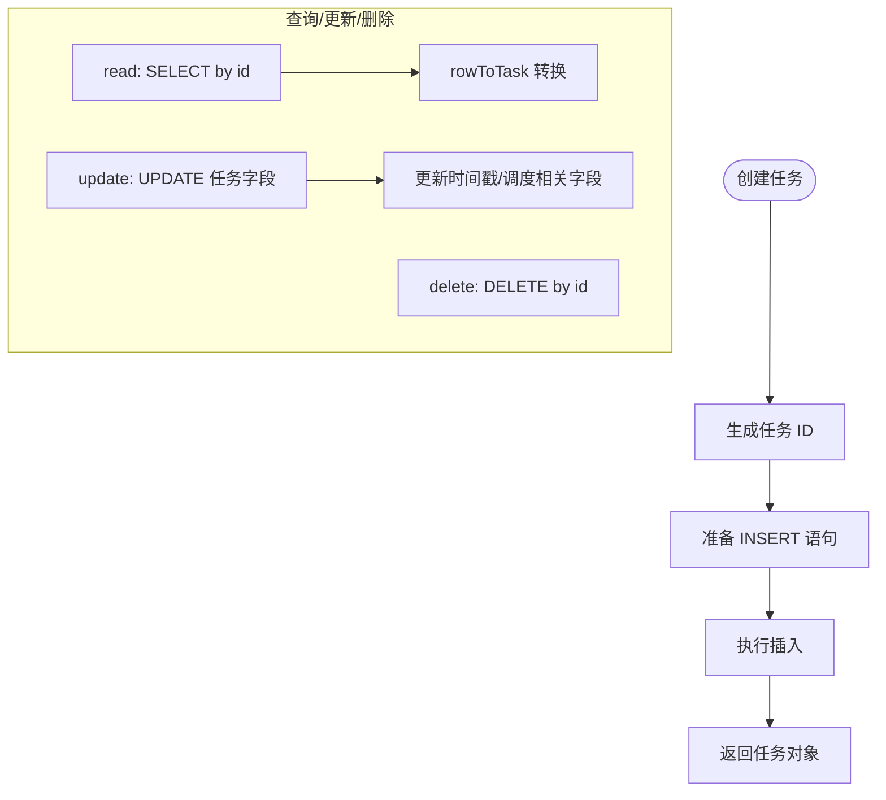
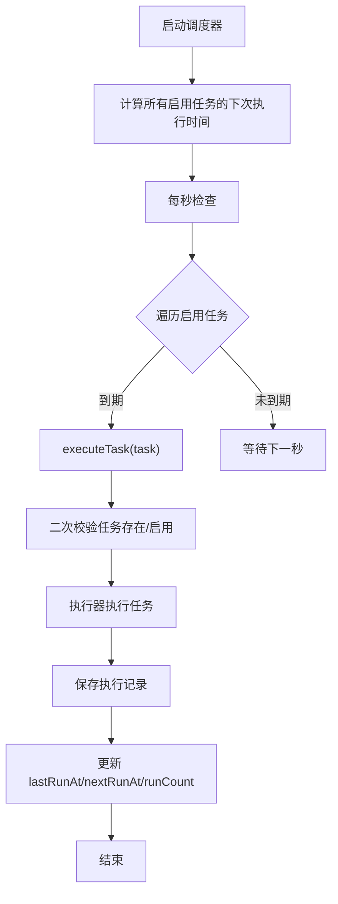
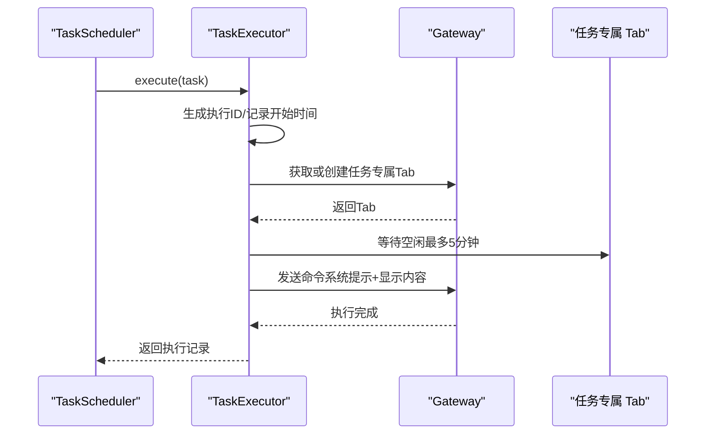
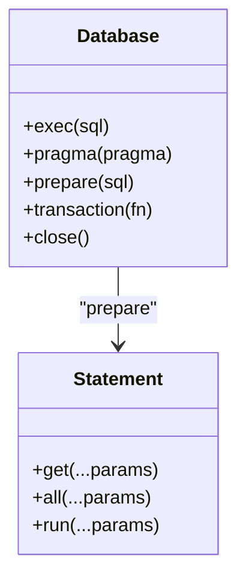
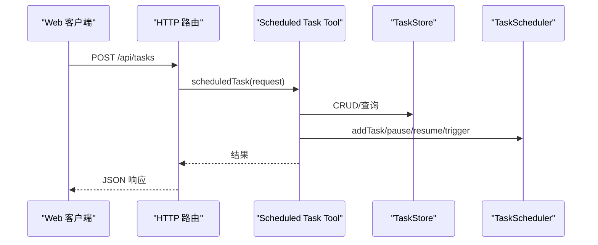
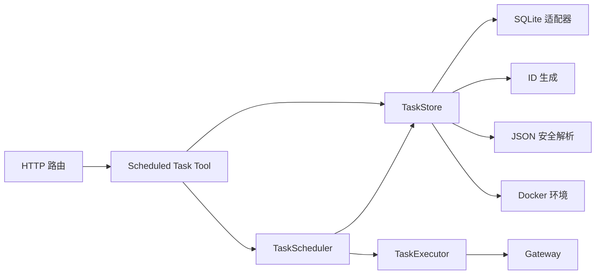

# 任务存储系统

<cite>
**本文引用的文件列表**
- [store.ts](file://src/main/scheduled-tasks/store.ts)
- [types.ts](file://src/main/scheduled-tasks/types.ts)
- [scheduler.ts](file://src/main/scheduled-tasks/scheduler.ts)
- [executor.ts](file://src/main/scheduled-tasks/executor.ts)
- [sqlite-adapter.ts](file://src/shared/utils/sqlite-adapter.ts)
- [db-utils.ts](file://src/shared/utils/db-utils.ts)
- [id-generator.ts](file://src/shared/utils/id-generator.ts)
- [json-utils.ts](file://src/shared/utils/json-utils.ts)
- [docker-utils.ts](file://src/shared/utils/docker-utils.ts)
- [scheduled-task-tool.ts](file://src/main/tools/scheduled-task-tool.ts)
- [tasks.ts](file://src/server/routes/tasks.ts)
- [index.ts](file://src/main/scheduled-tasks/index.ts)
</cite>

## 目录
1. [简介](#简介)
2. [项目结构](#项目结构)
3. [核心组件](#核心组件)
4. [架构总览](#架构总览)
5. [详细组件分析](#详细组件分析)
6. [依赖关系分析](#依赖关系分析)
7. [性能与并发特性](#性能与并发特性)
8. [故障排查指南](#故障排查指南)
9. [结论](#结论)
10. [附录：API 使用示例与最佳实践](#附录api-使用示例与最佳实践)

## 简介
本文件面向 DeepBot 的“任务存储系统”，聚焦于定时任务的持久化与执行生命周期管理。系统围绕 TaskStore 类构建，采用 SQLite 作为本地存储引擎，提供任务的创建、查询、更新、删除与批量操作能力；同时提供执行历史记录的存储与检索，并通过调度器与执行器形成“计划-触发-执行-记录”的闭环。文档将从数据模型、CRUD 实现、事务与并发控制、一致性保障、迁移与性能优化、API 使用示例等维度进行系统化阐述。

## 项目结构
任务存储系统主要分布在以下模块：
- 存储层：TaskStore（SQLite 表结构、CRUD、执行历史）
- 类型定义：ScheduledTask、TaskExecution、TaskSchedule 等
- 调度层：TaskScheduler（计划与触发）
- 执行层：TaskExecutor（在专用 Tab 中执行任务）
- 适配层：SQLite 适配器（兼容 better-sqlite3 API）
- 工具与路由：Scheduled Task Tool 与 HTTP 路由封装
- 辅助工具：ID 生成、JSON 安全解析、Docker 环境判断

图表来源
- [store.ts:23-363](file://src/main/scheduled-tasks/store.ts#L23-L363)
- [scheduler.ts:12-322](file://src/main/scheduled-tasks/scheduler.ts#L12-L322)
- [executor.ts:17-170](file://src/main/scheduled-tasks/executor.ts#L17-L170)
- [sqlite-adapter.ts:14-102](file://src/shared/utils/sqlite-adapter.ts#L14-L102)
- [scheduled-task-tool.ts:128-494](file://src/main/tools/scheduled-task-tool.ts#L128-L494)
- [tasks.ts:9-32](file://src/server/routes/tasks.ts#L9-L32)

章节来源
- [index.ts:1-9](file://src/main/scheduled-tasks/index.ts#L1-L9)

## 核心组件
- TaskStore：单例数据库访问层，负责任务与执行历史的 CRUD、索引与清理。
- TaskScheduler：按调度类型计算下次执行时间，驱动任务触发与状态更新。
- TaskExecutor：在专用 Tab 中执行任务，产出执行记录。
- SQLite 适配器：提供与 better-sqlite3 兼容的 API，支持事务与 PRAGMA。
- 类型系统：统一的任务、执行记录与调度配置的数据契约。
- 工具与路由：对外暴露任务管理能力，内部协调存储与调度。

章节来源
- [store.ts:23-363](file://src/main/scheduled-tasks/store.ts#L23-L363)
- [scheduler.ts:12-322](file://src/main/scheduled-tasks/scheduler.ts#L12-L322)
- [executor.ts:17-170](file://src/main/scheduled-tasks/executor.ts#L17-L170)
- [sqlite-adapter.ts:14-102](file://src/shared/utils/sqlite-adapter.ts#L14-L102)
- [types.ts:1-86](file://src/main/scheduled-tasks/types.ts#L1-L86)

## 架构总览
系统采用“工具/路由 -> 调度器 -> 存储 -> 执行器 -> 数据库”的链路。调度器负责计划与触发，存储负责数据持久化与历史记录，执行器负责实际执行并在专用 Tab 中运行。SQLite 适配器屏蔽底层差异，提供事务与 PRAGMA 支持。

图表来源
- [scheduled-task-tool.ts:171-494](file://src/main/tools/scheduled-task-tool.ts#L171-L494)
- [scheduler.ts:131-240](file://src/main/scheduled-tasks/scheduler.ts#L131-L240)
- [store.ts:133-323](file://src/main/scheduled-tasks/store.ts#L133-L323)
- [executor.ts:21-153](file://src/main/scheduled-tasks/executor.ts#L21-L153)

## 详细组件分析

### 数据模型与表设计
- 任务表（tasks）
  - 主键：id（文本）
  - 名称/描述：name、description（文本）
  - 调度元数据：schedule_type（文本，枚举 once/interval/cron）、schedule_data（JSON 文本）
  - 状态与计数：enabled（整数 0/1）、run_count（整数）
  - 时间戳：created_at、updated_at、last_run_at、next_run_at（整数时间戳）
- 执行记录表（executions）
  - 主键：id（文本）
  - 关联：task_id（外键，引用 tasks.id，级联删除）
  - 执行详情：task_name（文本）、start_time、end_time、duration（整数毫秒）、status（枚举 success/failed）、result、error（文本）

图表来源
- [store.ts:88-128](file://src/main/scheduled-tasks/store.ts#L88-L128)

章节来源
- [store.ts:88-128](file://src/main/scheduled-tasks/store.ts#L88-L128)
- [types.ts:29-55](file://src/main/scheduled-tasks/types.ts#L29-L55)

### TaskStore：数据存储与 CRUD 实现
- 单例模式：getInstance 提供全局唯一实例，避免重复打开数据库。
- 数据库初始化：
  - Docker 模式与普通模式路径不同，自动创建目录。
  - WAL 模式开启，提升并发写入性能。
  - 初始化 tasks 与 executions 表及必要索引。
- 任务 CRUD：
  - create：生成任务 ID，写入基础字段与 JSON 化的调度配置。
  - read：按 id 查询并转换为对象。
  - update：合并更新字段，更新时间戳与调度相关字段。
  - delete：按 id 删除任务。
  - list：支持按 enabled 与 schedule_type 过滤，按创建时间倒序。
  - getEnabledTasks：便捷查询启用任务。
- 执行历史：
  - addExecution：插入执行记录。
  - getExecutions：按任务 id 查询最近 N 条记录。
  - cleanupOldExecutions：按时间阈值清理旧记录。
- 辅助转换：rowToTask 将数据库行安全解析为对象，使用 JSON 安全解析工具。

图表来源
- [store.ts:133-241](file://src/main/scheduled-tasks/store.ts#L133-L241)
- [store.ts:342-355](file://src/main/scheduled-tasks/store.ts#L342-L355)

章节来源
- [store.ts:23-363](file://src/main/scheduled-tasks/store.ts#L23-L363)
- [id-generator.ts:140-142](file://src/shared/utils/id-generator.ts#L140-L142)
- [json-utils.ts:19-29](file://src/shared/utils/json-utils.ts#L19-L29)
- [docker-utils.ts:19-24](file://src/shared/utils/docker-utils.ts#L19-L24)

### 调度器：计划与触发
- 启动与检查：
  - start：每秒检查一次到期任务。
  - recalculateAllTasks：启动时为所有启用任务计算下次执行时间。
- 触发逻辑：
  - checkAndExecute：遍历启用任务，若 nextRunAt 已到则异步触发。
  - executeTask：执行前二次校验任务存在与启用状态；执行后根据调度类型与最大执行次数决定是否禁用任务；更新 lastRunAt、nextRunAt、runCount。
- 计算下次执行时间：
  - once：比较 executeAt 与当前时间。
  - interval：限制最小间隔（10 秒），支持 startAt 首次执行时间。
  - cron：使用 cron 表达式与时区计算下一次时间。
- 并发控制：
  - executingTasks 集合避免同一任务并发执行。
  - 异步触发（void）保证调度器持续检查其他任务。

图表来源
- [scheduler.ts:29-151](file://src/main/scheduled-tasks/scheduler.ts#L29-L151)
- [scheduler.ts:156-240](file://src/main/scheduled-tasks/scheduler.ts#L156-L240)
- [scheduler.ts:245-302](file://src/main/scheduled-tasks/scheduler.ts#L245-L302)

章节来源
- [scheduler.ts:12-322](file://src/main/scheduled-tasks/scheduler.ts#L12-L322)

### 执行器：专用 Tab 执行与记录
- execute：生成执行 ID，记录开始时间，调用 executeInNewTab。
- executeInNewTab：
  - 获取或创建任务专属 Tab（复用同一 Tab）。
  - 若 Tab 正在执行，等待至空闲（最长 5 分钟）。
  - 构造系统提示命令（AI 看）与显示内容（用户看），发送到 Tab 执行。
- 返回执行记录：包含状态、结果或错误、耗时等。

图表来源
- [executor.ts:21-153](file://src/main/scheduled-tasks/executor.ts#L21-L153)

章节来源
- [executor.ts:17-170](file://src/main/scheduled-tasks/executor.ts#L17-L170)

### SQLite 适配器与事务
- Database 类提供与 better-sqlite3 兼容的 API：
  - exec、prepare、pragma、transaction、close。
  - transaction 手动实现 BEGIN/COMMIT/ROLLBACK。
- 适配 node:sqlite（Node.js 22.5+），保持上层代码一致。

图表来源
- [sqlite-adapter.ts:14-102](file://src/shared/utils/sqlite-adapter.ts#L14-L102)

章节来源
- [sqlite-adapter.ts:14-102](file://src/shared/utils/sqlite-adapter.ts#L14-L102)

### 工具与路由：对外接口
- Scheduled Task Tool：
  - 支持 create、list、update、updateSchedule、delete、pause、resume、trigger、history。
  - 参数校验与调度解析（自然语言转调度配置）。
  - 与调度器协作，动态更新任务计划。
- HTTP 路由：
  - /api/tasks 接收请求，转发给 GatewayAdapter 的 scheduledTask 处理。

图表来源
- [tasks.ts:16-27](file://src/server/routes/tasks.ts#L16-L27)
- [scheduled-task-tool.ts:171-494](file://src/main/tools/scheduled-task-tool.ts#L171-L494)

章节来源
- [tasks.ts:1-33](file://src/server/routes/tasks.ts#L1-L33)
- [scheduled-task-tool.ts:128-494](file://src/main/tools/scheduled-task-tool.ts#L128-L494)

## 依赖关系分析
- TaskStore 依赖：
  - SQLite 适配器：Database/Statement。
  - 工具：ID 生成（任务 ID）、JSON 安全解析（调度配置）、Docker 环境判断（路径）。
- TaskScheduler 依赖：
  - TaskStore：读取/更新任务状态。
  - TaskExecutor：执行任务并返回执行记录。
- TaskExecutor 依赖：
  - Gateway：获取/创建 Tab、发送消息。
- 工具与路由：
  - Scheduled Task Tool：封装业务操作，调用存储与调度器。
  - HTTP 路由：统一入口，错误处理。

图表来源
- [store.ts:7-14](file://src/main/scheduled-tasks/store.ts#L7-L14)
- [sqlite-adapter.ts:8-20](file://src/shared/utils/sqlite-adapter.ts#L8-L20)
- [id-generator.ts:140-142](file://src/shared/utils/id-generator.ts#L140-L142)
- [json-utils.ts:19-29](file://src/shared/utils/json-utils.ts#L19-L29)
- [docker-utils.ts:19-24](file://src/shared/utils/docker-utils.ts#L19-L24)
- [scheduler.ts:12-24](file://src/main/scheduled-tasks/scheduler.ts#L12-L24)
- [executor.ts:10-15](file://src/main/scheduled-tasks/executor.ts#L10-L15)
- [scheduled-task-tool.ts:36-41](file://src/main/tools/scheduled-task-tool.ts#L36-L41)
- [tasks.ts:9-32](file://src/server/routes/tasks.ts#L9-L32)

章节来源
- [store.ts:7-14](file://src/main/scheduled-tasks/store.ts#L7-L14)
- [sqlite-adapter.ts:8-20](file://src/shared/utils/sqlite-adapter.ts#L8-L20)
- [id-generator.ts:140-142](file://src/shared/utils/id-generator.ts#L140-L142)
- [json-utils.ts:19-29](file://src/shared/utils/json-utils.ts#L19-L29)
- [docker-utils.ts:19-24](file://src/shared/utils/docker-utils.ts#L19-L24)
- [scheduler.ts:12-24](file://src/main/scheduled-tasks/scheduler.ts#L12-L24)
- [executor.ts:10-15](file://src/main/scheduled-tasks/executor.ts#L10-L15)
- [scheduled-task-tool.ts:36-41](file://src/main/tools/scheduled-task-tool.ts#L36-L41)
- [tasks.ts:9-32](file://src/server/routes/tasks.ts#L9-L32)

## 性能与并发特性
- 存储性能
  - WAL 模式：提升写入吞吐，降低锁竞争。
  - 索引：对 enabled、next_run_at、executions.task_id 建立索引，加速查询。
  - 事务：批量写入（如 setKeyValueBatch）使用事务包裹，减少提交开销。
- 并发控制
  - 调度器内部集合 executingTasks 避免同一任务并发执行。
  - 异步触发（void）保证调度器持续检查其他任务。
  - 执行器等待 Tab 空闲（最多 5 分钟），避免资源争用。
- 一致性保障
  - 任务状态更新与执行记录保存在执行流程中分阶段进行，执行后二次校验任务是否存在，防止竞态。
  - 外键约束与级联删除保证任务删除时同步清理执行记录。
- 资源清理
  - cleanupOldExecutions：按天数阈值清理旧执行记录，控制表增长。

章节来源
- [store.ts:69-128](file://src/main/scheduled-tasks/store.ts#L69-L128)
- [store.ts:328-337](file://src/main/scheduled-tasks/store.ts#L328-L337)
- [db-utils.ts:74-91](file://src/shared/utils/db-utils.ts#L74-L91)
- [scheduler.ts:140-150](file://src/main/scheduled-tasks/scheduler.ts#L140-L150)
- [executor.ts:97-129](file://src/main/scheduled-tasks/executor.ts#L97-L129)

## 故障排查指南
- 数据库文件异常
  - 检测并清理孤立的 -shm/-wal 文件，避免锁冲突。
- 调度器启动失败
  - 工具层提供重试机制（最多 3 次），最终失败静默处理，不影响用户使用。
- 任务执行卡住
  - 执行器等待 Tab 空闲（最多 5 分钟），超时抛错；检查 Tab 是否被外部关闭。
- 任务被删除导致状态更新失败
  - 执行前后均进行存在性校验，若任务在执行过程中被删除，仍保存执行记录并跳过状态更新。
- 调度配置错误
  - validateSchedule 校验调度类型与参数；parseScheduleText 支持自然语言解析，不支持时抛错。

章节来源
- [store.ts:40-65](file://src/main/scheduled-tasks/store.ts#L40-L65)
- [scheduled-task-tool.ts:67-85](file://src/main/tools/scheduled-task-tool.ts#L67-L85)
- [executor.ts:123-129](file://src/main/scheduled-tasks/executor.ts#L123-L129)
- [scheduler.ts:162-193](file://src/main/scheduled-tasks/scheduler.ts#L162-L193)
- [scheduled-task-tool.ts:499-538](file://src/main/tools/scheduled-task-tool.ts#L499-L538)
- [scheduled-task-tool.ts:550-615](file://src/main/tools/scheduled-task-tool.ts#L550-L615)

## 结论
任务存储系统以 TaskStore 为核心，结合 SQLite 的轻量与可靠性，实现了任务与执行历史的完整生命周期管理。通过调度器与执行器的协同，系统具备良好的并发控制与一致性保障。工具与路由提供了简洁的对外接口，便于集成与扩展。建议在生产环境中关注 WAL 模式下的备份策略、定期清理执行记录以及对调度配置的严格校验。

## 附录：API 使用示例与最佳实践
- 创建任务
  - 使用 Scheduled Task Tool 的 create 动作，传入 name/description/schedule。
  - schedule 支持 once/interval/cron 三类，可设置最大执行次数。
- 列出任务
  - 使用 list 动作，可按 enabled 过滤。
- 更新任务
  - update：更新任务描述。
  - updateSchedule：支持自然语言描述解析为调度配置。
- 暂停/恢复/删除/手动触发
  - pause/resume/delete/trigger 动作配合调度器即时生效。
- 查看执行历史
  - history 动作返回最近 N 条执行记录，包含状态、耗时、结果或错误。
- 最佳实践
  - 控制任务数量上限（默认 10），避免过多任务影响调度器性能。
  - 合理设置 interval 最小值（≥10 秒），避免过于频繁的触发。
  - 定期清理旧执行记录，控制数据库体积。
  - 在 Docker 环境下确保 DB_DIR 可写，避免权限问题。

章节来源
- [scheduled-task-tool.ts:180-463](file://src/main/tools/scheduled-task-tool.ts#L180-L463)
- [store.ts:133-323](file://src/main/scheduled-tasks/store.ts#L133-L323)
- [scheduler.ts:245-302](file://src/main/scheduled-tasks/scheduler.ts#L245-L302)