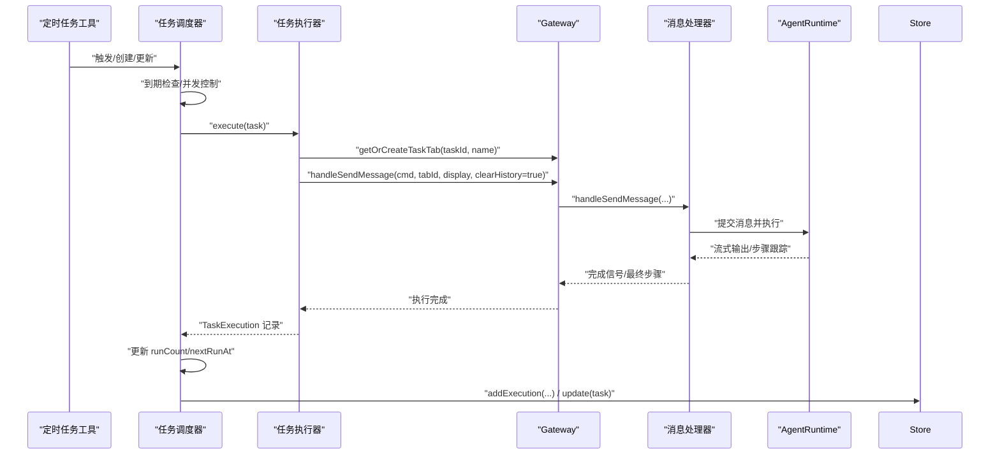
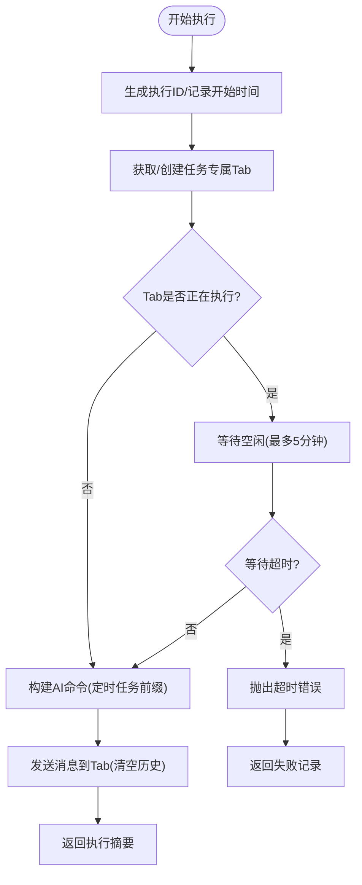
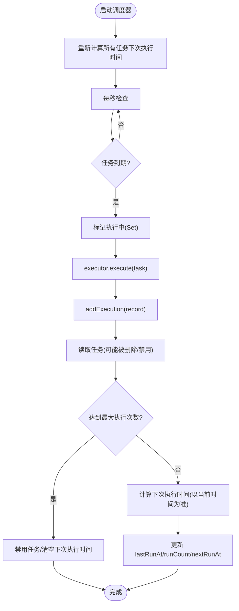
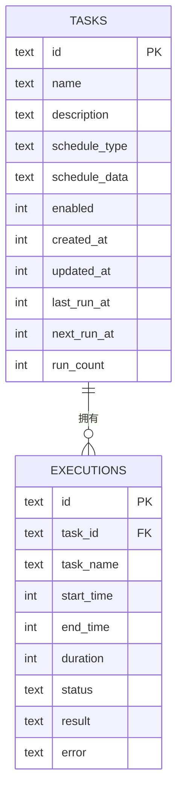
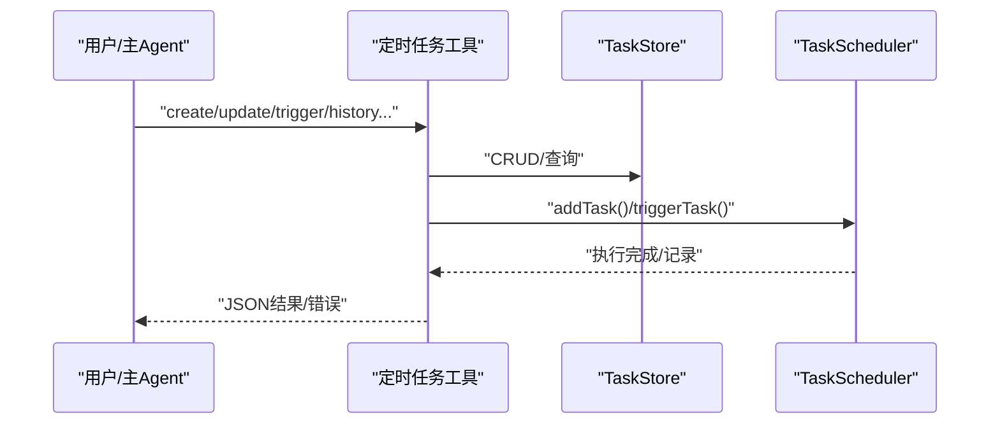
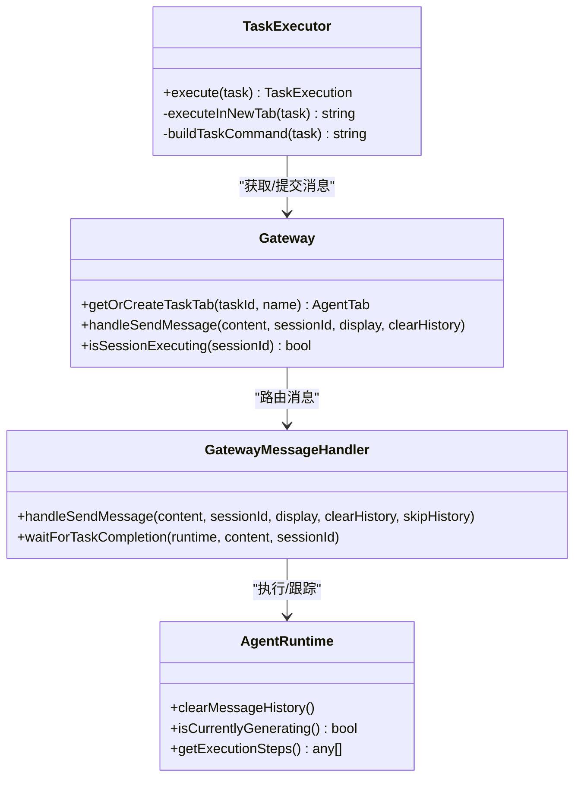
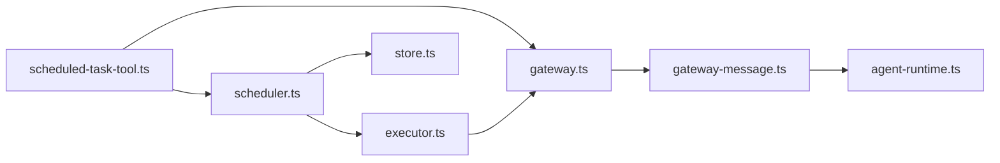

# 任务执行器

<cite>
**本文引用的文件**
- [executor.ts](file://src/main/scheduled-tasks/executor.ts)
- [scheduler.ts](file://src/main/scheduled-tasks/scheduler.ts)
- [types.ts](file://src/main/scheduled-tasks/types.ts)
- [store.ts](file://src/main/scheduled-tasks/store.ts)
- [gateway.ts](file://src/main/gateway.ts)
- [gateway-message.ts](file://src/main/gateway-message.ts)
- [scheduled-task-tool.ts](file://src/main/tools/scheduled-task-tool.ts)
- [agent-runtime.ts](file://src/main/agent-runtime/agent-runtime.ts)
</cite>

## 目录
1. [简介](#简介)
2. [项目结构](#项目结构)
3. [核心组件](#核心组件)
4. [架构总览](#架构总览)
5. [详细组件分析](#详细组件分析)
6. [依赖关系分析](#依赖关系分析)
7. [性能考量](#性能考量)
8. [故障排查指南](#故障排查指南)
9. [结论](#结论)
10. [附录](#附录)

## 简介
本文件面向 史丽慧小助理 的定时任务执行子系统，围绕 TaskExecutor 任务执行器展开，系统性阐述其执行机制、工具调用流程、生命周期管理、状态跟踪与结果处理，并深入说明执行器与工具系统、Gateway 会话管理、AgentRuntime 执行引擎之间的交互关系。文档同时覆盖监控与错误处理策略、超时控制、资源管理与异常恢复机制，并提供使用示例与最佳实践建议。

## 项目结构
定时任务相关的核心代码位于 src/main/scheduled-tasks 目录，配合工具层、网关层与 AgentRuntime 执行层协同工作：
- scheduled-tasks：任务定义、调度、执行、存储
- tools：工具层（含定时任务工具）
- main：网关与消息处理、AgentRuntime 执行引擎
- shared：通用工具（异步等待、错误处理、ID 生成等）

```mermaid
graph TB
subgraph "定时任务子系统"
TTypes["types.ts<br/>任务/调度/执行记录类型"]
TStore["store.ts<br/>SQLite 持久化"]
TScheduler["scheduler.ts<br/>任务调度器"]
TExecutor["executor.ts<br/>任务执行器"]
end
subgraph "工具层"
STool["scheduled-task-tool.ts<br/>定时任务工具"]
end
subgraph "网关与执行层"
GW["gateway.ts<br/>会话/消息路由/Gateway"]
GWMsg["gateway-message.ts<br/>消息处理/队列/等待"]
AR["agent-runtime.ts<br/>AgentRuntime 执行引擎"]
end
STool --> TScheduler
TScheduler --> TExecutor
TExecutor --> GW
GW --> GWMsg
GWMsg --> AR
TStore <- --> TScheduler
TStore <- --> TExecutor
```

**图表来源**
- [executor.ts:17-79](file://src/main/scheduled-tasks/executor.ts#L17-L79)
- [scheduler.ts:12-240](file://src/main/scheduled-tasks/scheduler.ts#L12-L240)
- [types.ts:8-55](file://src/main/scheduled-tasks/types.ts#L8-L55)
- [store.ts:23-363](file://src/main/scheduled-tasks/store.ts#L23-L363)
- [scheduled-task-tool.ts:33-119](file://src/main/tools/scheduled-task-tool.ts#L33-L119)
- [gateway.ts:29-772](file://src/main/gateway.ts#L29-L772)
- [gateway-message.ts:94-441](file://src/main/gateway-message.ts#L94-L441)
- [agent-runtime.ts:27-200](file://src/main/agent-runtime/agent-runtime.ts#L27-L200)

**章节来源**
- [executor.ts:1-170](file://src/main/scheduled-tasks/executor.ts#L1-L170)
- [scheduler.ts:1-322](file://src/main/scheduled-tasks/scheduler.ts#L1-L322)
- [types.ts:1-86](file://src/main/scheduled-tasks/types.ts#L1-L86)
- [store.ts:1-364](file://src/main/scheduled-tasks/store.ts#L1-L364)
- [scheduled-task-tool.ts:1-628](file://src/main/tools/scheduled-task-tool.ts#L1-L628)
- [gateway.ts:1-772](file://src/main/gateway.ts#L1-L772)
- [gateway-message.ts:94-441](file://src/main/gateway-message.ts#L94-L441)
- [agent-runtime.ts:1-200](file://src/main/agent-runtime/agent-runtime.ts#L1-L200)

## 核心组件
- 任务类型与记录：定义任务、调度与执行记录的数据结构，确保跨模块一致的契约。
- 任务存储：基于 SQLite 的持久化，提供任务 CRUD、执行历史记录、索引与清理。
- 任务调度器：周期性检查到期任务，负责并发控制、状态更新与下次执行时间计算。
- 任务执行器：在专用 Tab 中执行任务，负责命令构建、上下文隔离、等待窗口空闲、结果回传。
- 工具层：定时任务工具，提供创建、列表、暂停/恢复、手动触发、查看历史等能力。
- 网关与消息处理：负责会话生命周期、消息路由、队列与等待、进度提醒、停止/状态查询。
- AgentRuntime：执行引擎，承载工具调用、步骤跟踪、流式输出与上下文管理。

**章节来源**
- [types.ts:8-55](file://src/main/scheduled-tasks/types.ts#L8-L55)
- [store.ts:88-128](file://src/main/scheduled-tasks/store.ts#L88-L128)
- [scheduler.ts:12-240](file://src/main/scheduled-tasks/scheduler.ts#L12-L240)
- [executor.ts:17-170](file://src/main/scheduled-tasks/executor.ts#L17-L170)
- [scheduled-task-tool.ts:128-494](file://src/main/tools/scheduled-task-tool.ts#L128-L494)
- [gateway.ts:29-772](file://src/main/gateway.ts#L29-L772)
- [gateway-message.ts:94-441](file://src/main/gateway-message.ts#L94-L441)
- [agent-runtime.ts:27-200](file://src/main/agent-runtime/agent-runtime.ts#L27-L200)

## 架构总览
定时任务从“工具调用”进入，经“调度器”判断到期后交由“执行器”，执行器通过“网关”在专用 Tab 中提交消息给“消息处理器”，再由“AgentRuntime”执行实际工具链，期间通过“进度提醒”与“状态查询”实现可观测性；执行结果写入“存储”。



**图表来源**
- [scheduled-task-tool.ts:171-492](file://src/main/tools/scheduled-task-tool.ts#L171-L492)
- [scheduler.ts:156-240](file://src/main/scheduled-tasks/scheduler.ts#L156-L240)
- [executor.ts:21-153](file://src/main/scheduled-tasks/executor.ts#L21-L153)
- [gateway.ts:455-458](file://src/main/gateway.ts#L455-L458)
- [gateway-message.ts:94-441](file://src/main/gateway-message.ts#L94-L441)
- [agent-runtime.ts:193-200](file://src/main/agent-runtime/agent-runtime.ts#L193-L200)
- [store.ts:278-297](file://src/main/scheduled-tasks/store.ts#L278-L297)

## 详细组件分析

### TaskExecutor 执行机制与工具调用流程
- 任务执行入口：生成执行 ID，记录开始时间，调用内部执行方法。
- 专用 Tab 执行：通过 Gateway 获取或创建任务专属 Tab，若 Tab 正在执行则等待空闲（最长 5 分钟）。
- 命令构建：为 AI 构建明确的“定时任务执行”前缀命令，避免歧义；同时保留原始任务描述作为用户可见内容。
- 提交执行：调用 Gateway 的消息发送接口，携带显示内容与清空历史标志，确保定时任务独立上下文。
- 结果回传：返回“已在专属窗口执行”的摘要信息，具体执行细节由消息处理器与 AgentRuntime 跟踪。



**图表来源**
- [executor.ts:21-153](file://src/main/scheduled-tasks/executor.ts#L21-L153)

**章节来源**
- [executor.ts:17-170](file://src/main/scheduled-tasks/executor.ts#L17-L170)

### 任务执行生命周期管理
- 生命周期阶段：创建 -> 到期检查 -> 执行中标记 -> 执行 -> 记录执行 -> 更新状态 -> 计算下次执行时间。
- 并发控制：使用 Set 记录正在执行的任务 ID，避免重复触发。
- 状态更新：执行完成后读取任务最新状态，检查是否达到最大执行次数或一次性任务完成，决定禁用或继续调度。
- 下次执行时间：根据调度类型（once/interval/cron）与上次执行时间计算，interval 类型强制最小间隔。



**图表来源**
- [scheduler.ts:131-240](file://src/main/scheduled-tasks/scheduler.ts#L131-L240)

**章节来源**
- [scheduler.ts:12-322](file://src/main/scheduled-tasks/scheduler.ts#L12-L322)

### 执行状态跟踪与结果处理
- 执行记录字段：id、taskId、taskName、startTime、endTime、duration、status、result/error。
- 成功/失败分支：成功时记录结果摘要，失败时记录错误信息；两者均包含时长与时间戳。
- 存储策略：执行完成后写入 executions 表，支持历史查询与清理。



**图表来源**
- [store.ts:89-127](file://src/main/scheduled-tasks/store.ts#L89-L127)
- [types.ts:45-55](file://src/main/scheduled-tasks/types.ts#L45-L55)

**章节来源**
- [executor.ts:47-78](file://src/main/scheduled-tasks/executor.ts#L47-L78)
- [store.ts:278-323](file://src/main/scheduled-tasks/store.ts#L278-L323)

### 与工具系统交互：参数传递、上下文管理与结果回传
- 工具入口：定时任务工具提供 create/list/update/updateSchedule/delete/pause/resume/trigger/history 等操作。
- 参数校验与解析：对调度类型与参数进行校验，支持自然语言解析为 Cron/间隔配置。
- 上下文隔离：执行器在专用 Tab 中提交消息，消息处理器在执行前清空历史，确保任务独立上下文。
- 结果回传：工具返回 JSON 文本与 details，便于前端展示与后续处理。



**图表来源**
- [scheduled-task-tool.ts:171-492](file://src/main/tools/scheduled-task-tool.ts#L171-L492)
- [store.ts:133-230](file://src/main/scheduled-tasks/store.ts#L133-L230)
- [scheduler.ts:67-126](file://src/main/scheduled-tasks/scheduler.ts#L67-L126)

**章节来源**
- [scheduled-task-tool.ts:128-494](file://src/main/tools/scheduled-task-tool.ts#L128-L494)

### 执行器与网关、消息处理器、AgentRuntime 的交互
- 执行器通过 Gateway 的 Tab 管理与消息发送接口提交任务命令。
- 消息处理器在执行前清空历史，必要时等待 Agent 空闲，结束后发送完成信号与最终步骤。
- AgentRuntime 负责工具调用、步骤跟踪、流式输出与上下文管理。



**图表来源**
- [executor.ts:86-153](file://src/main/scheduled-tasks/executor.ts#L86-L153)
- [gateway.ts:640-642](file://src/main/gateway.ts#L640-L642)
- [gateway.ts:455-458](file://src/main/gateway.ts#L455-L458)
- [gateway.ts:416-422](file://src/main/gateway.ts#L416-L422)
- [gateway-message.ts:94-132](file://src/main/gateway-message.ts#L94-L132)
- [gateway-message.ts:429-441](file://src/main/gateway-message.ts#L429-L441)
- [agent-runtime.ts:193-200](file://src/main/agent-runtime/agent-runtime.ts#L193-L200)

**章节来源**
- [gateway.ts:640-642](file://src/main/gateway.ts#L640-L642)
- [gateway.ts:455-458](file://src/main/gateway.ts#L455-L458)
- [gateway.ts:416-422](file://src/main/gateway.ts#L416-L422)
- [gateway-message.ts:94-132](file://src/main/gateway-message.ts#L94-L132)
- [gateway-message.ts:429-441](file://src/main/gateway-message.ts#L429-L441)
- [agent-runtime.ts:193-200](file://src/main/agent-runtime/agent-runtime.ts#L193-L200)

## 依赖关系分析
- TaskExecutor 依赖 Gateway 的 Tab 管理与消息发送能力。
- TaskScheduler 依赖 TaskStore 进行任务与执行记录的持久化，依赖 TaskExecutor 执行任务。
- 定时任务工具通过 setGatewayInstance 将 Gateway 注入执行器，启动调度器并提供 UI/CLI 操作入口。
- 网关层将消息路由至消息处理器，消息处理器再委托 AgentRuntime 执行。



**图表来源**
- [scheduled-task-tool.ts:56-86](file://src/main/tools/scheduled-task-tool.ts#L56-L86)
- [scheduler.ts:21-24](file://src/main/scheduled-tasks/scheduler.ts#L21-L24)
- [executor.ts:13-15](file://src/main/scheduled-tasks/executor.ts#L13-L15)
- [gateway.ts:77-98](file://src/main/gateway.ts#L77-L98)
- [gateway-message.ts:94-100](file://src/main/gateway-message.ts#L94-L100)
- [agent-runtime.ts:193-200](file://src/main/agent-runtime/agent-runtime.ts#L193-L200)

**章节来源**
- [scheduled-task-tool.ts:56-86](file://src/main/tools/scheduled-task-tool.ts#L56-L86)
- [scheduler.ts:21-24](file://src/main/scheduled-tasks/scheduler.ts#L21-L24)
- [executor.ts:13-15](file://src/main/scheduled-tasks/executor.ts#L13-L15)
- [gateway.ts:77-98](file://src/main/gateway.ts#L77-L98)

## 性能考量
- 调度频率：调度器每秒检查一次，适合中小规模任务；大规模任务建议合理设置最小间隔与 Cron 表达式。
- 并发控制：通过 Set 记录执行中任务 ID，避免重复触发；任务 Tab 空闲等待最多 5 分钟，防止死锁。
- 存储优化：SQLite 使用 WAL 模式与索引，定期清理历史记录降低表膨胀。
- 执行链路：消息处理器对队列与等待进行节流，避免过载；AgentRuntime 的工具调用具备重复检测与步骤跟踪，减少无效输出。

[本节为通用性能讨论，无需特定文件来源]

## 故障排查指南
- 执行器未设置 Gateway：执行器在执行前会检查 Gateway 实例，未设置将抛出错误。
- Tab 空闲等待超时：若任务 Tab 长时间处于执行状态，等待空闲超时将导致执行失败。
- 任务被删除/禁用：调度器在执行前后均会读取任务状态，若任务被删除或禁用则跳过执行并记录。
- 执行失败：捕获错误并记录错误信息与耗时，便于定位问题。
- 状态查询与停止：通过系统命令/status 与/stop 查询状态与停止执行，消息处理器与网关层提供相应支持。

**章节来源**
- [executor.ts:87-129](file://src/main/scheduled-tasks/executor.ts#L87-L129)
- [executor.ts:57-78](file://src/main/scheduled-tasks/executor.ts#L57-L78)
- [scheduler.ts:161-170](file://src/main/scheduled-tasks/scheduler.ts#L161-L170)
- [gateway-message.ts:644-707](file://src/main/gateway-message.ts#L644-L707)
- [gateway-connector.ts:618-639](file://src/main/gateway-connector.ts#L618-L639)

## 结论
TaskExecutor 通过专用 Tab 与 Gateway 的紧密协作，实现了定时任务的可靠执行与可观测性。结合 TaskScheduler 的到期检查与状态更新、TaskStore 的持久化与清理策略，以及工具层与 AgentRuntime 的执行链路，形成了完整的任务生命周期闭环。建议在生产环境中合理设置调度策略、监控执行状态、及时清理历史记录，并通过系统命令进行状态查询与异常干预。

[本节为总结性内容，无需特定文件来源]

## 附录

### 使用示例与最佳实践
- 创建一次性任务：使用定时任务工具的 create 操作，设置 executeAt 与描述。
- 创建周期性任务：设置 intervalMs（建议不低于 10 秒），可选 startAt 与 maxRuns。
- 创建 Cron 任务：提供合法 Cron 表达式与时区，支持自然语言解析。
- 手动触发：使用 trigger 操作快速执行某任务，适用于调试或紧急场景。
- 观察执行：使用 history 查看执行记录；使用 status 查看当前执行状态；使用 /stop 停止执行。
- 最佳实践：
  - 控制任务数量（默认上限 10），避免过度占用资源。
  - 为复杂任务设置合理的 maxRuns 与超时策略。
  - 使用专用 Tab 执行任务，确保上下文隔离。
  - 定期清理旧的执行记录，保持数据库健康。

**章节来源**
- [scheduled-task-tool.ts:180-218](file://src/main/tools/scheduled-task-tool.ts#L180-L218)
- [scheduled-task-tool.ts:405-426](file://src/main/tools/scheduled-task-tool.ts#L405-L426)
- [scheduled-task-tool.ts:429-462](file://src/main/tools/scheduled-task-tool.ts#L429-L462)
- [gateway-message.ts:644-707](file://src/main/gateway-message.ts#L644-L707)
- [gateway-connector.ts:618-639](file://src/main/gateway-connector.ts#L618-L639)