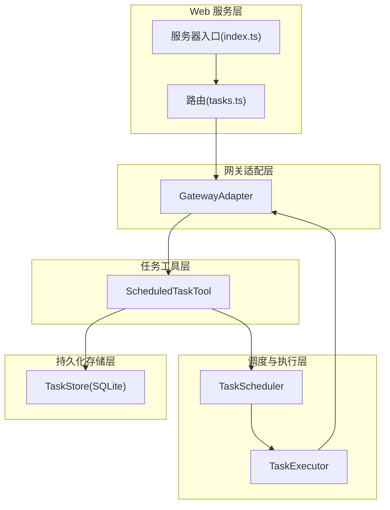
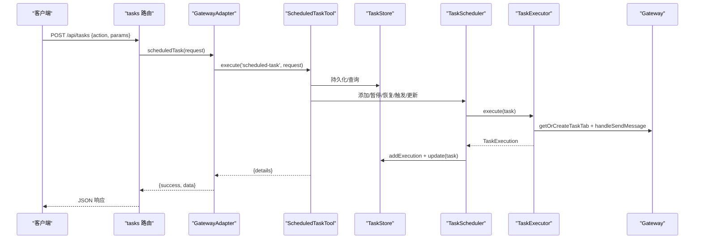
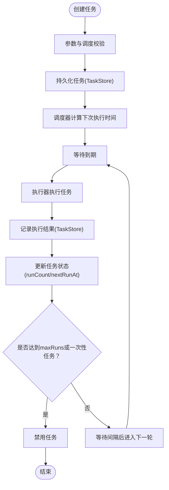
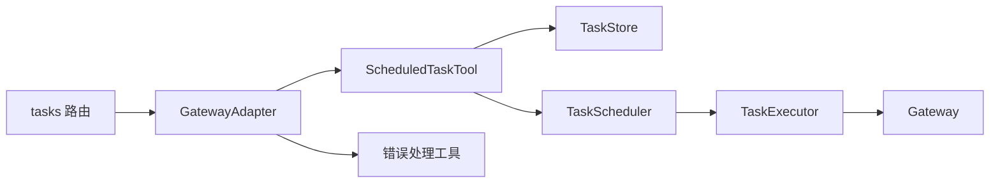

# 任务管理接口

<cite>
**本文引用的文件**
- [src/server/routes/tasks.ts](file://src/server/routes/tasks.ts)
- [src/server/gateway-adapter.ts](file://src/server/gateway-adapter.ts)
- [src/main/tools/scheduled-task-tool.ts](file://src/main/tools/scheduled-task-tool.ts)
- [src/main/scheduled-tasks/types.ts](file://src/main/scheduled-tasks/types.ts)
- [src/main/scheduled-tasks/store.ts](file://src/main/scheduled-tasks/store.ts)
- [src/main/scheduled-tasks/executor.ts](file://src/main/scheduled-tasks/executor.ts)
- [src/main/scheduled-tasks/scheduler.ts](file://src/main/scheduled-tasks/scheduler.ts)
- [src/main/gateway.ts](file://src/main/gateway.ts)
- [src/shared/utils/error-handler.ts](file://src/shared/utils/error-handler.ts)
- [src/shared/utils/id-generator.ts](file://src/shared/utils/id-generator.ts)
- [src/server/index.ts](file://src/server/index.ts)
</cite>

## 目录
1. [简介](#简介)
2. [项目结构](#项目结构)
3. [核心组件](#核心组件)
4. [架构总览](#架构总览)
5. [详细组件分析](#详细组件分析)
6. [依赖关系分析](#依赖关系分析)
7. [性能考量](#性能考量)
8. [故障排除指南](#故障排除指南)
9. [结论](#结论)
10. [附录](#附录)

## 简介
本文件面向 DeepBot 的“任务管理接口”，系统性阐述定时任务的 Web API 设计与实现，覆盖任务创建、配置、监控与维护全流程；解释任务配置验证、参数校验与错误处理机制；给出任务生命周期管理的完整流程；涵盖任务状态查询、执行历史查看与统计信息获取；解释批量操作与批量状态更新能力；提供 Web API 接口规范与客户端使用示例；最后总结最佳实践与常见问题排查。

## 项目结构
DeepBot 的任务管理由“Web 服务层”“网关适配层”“任务工具层”“调度与执行层”“持久化存储层”构成，采用清晰的分层职责划分，便于扩展与维护。

图表来源
- [src/server/routes/tasks.ts:1-33](file://src/server/routes/tasks.ts#L1-L33)
- [src/server/gateway-adapter.ts:532-539](file://src/server/gateway-adapter.ts#L532-L539)
- [src/main/tools/scheduled-task-tool.ts:128-494](file://src/main/tools/scheduled-task-tool.ts#L128-L494)
- [src/main/scheduled-tasks/scheduler.ts:12-322](file://src/main/scheduled-tasks/scheduler.ts#L12-L322)
- [src/main/scheduled-tasks/executor.ts:17-170](file://src/main/scheduled-tasks/executor.ts#L17-L170)
- [src/main/scheduled-tasks/store.ts:23-364](file://src/main/scheduled-tasks/store.ts#L23-L364)
- [src/server/index.ts:33-128](file://src/server/index.ts#L33-L128)

章节来源
- [src/server/index.ts:33-128](file://src/server/index.ts#L33-L128)
- [src/server/routes/tasks.ts:9-32](file://src/server/routes/tasks.ts#L9-L32)
- [src/server/gateway-adapter.ts:532-539](file://src/server/gateway-adapter.ts#L532-L539)

## 核心组件
- Web API 路由：提供统一的 POST /api/tasks 接口，接收任务管理请求，交由网关适配器处理。
- 网关适配器：封装 Gateway 能力，将任务管理请求委派给 ScheduledTaskTool，并负责错误消息提取与统一响应。
- 任务工具：实现任务 CRUD、暂停/恢复、手动触发、历史查询等操作；内置参数校验与调度解析。
- 调度器：按秒级轮询检查任务到期情况，负责任务状态更新与下次执行时间计算。
- 执行器：在专用 Tab 中执行任务，等待窗口空闲、构建命令、发送消息并记录执行结果。
- 存储层：基于 SQLite 的 TaskStore，持久化任务与执行记录，提供增删改查、索引与清理策略。

章节来源
- [src/server/routes/tasks.ts:16-29](file://src/server/routes/tasks.ts#L16-L29)
- [src/server/gateway-adapter.ts:532-539](file://src/server/gateway-adapter.ts#L532-L539)
- [src/main/tools/scheduled-task-tool.ts:128-494](file://src/main/tools/scheduled-task-tool.ts#L128-L494)
- [src/main/scheduled-tasks/scheduler.ts:12-322](file://src/main/scheduled-tasks/scheduler.ts#L12-L322)
- [src/main/scheduled-tasks/executor.ts:17-170](file://src/main/scheduled-tasks/executor.ts#L17-L170)
- [src/main/scheduled-tasks/store.ts:23-364](file://src/main/scheduled-tasks/store.ts#L23-L364)

## 架构总览
任务管理的端到端流程如下：

图表来源
- [src/server/routes/tasks.ts:16-29](file://src/server/routes/tasks.ts#L16-L29)
- [src/server/gateway-adapter.ts:532-539](file://src/server/gateway-adapter.ts#L532-L539)
- [src/main/tools/scheduled-task-tool.ts:171-492](file://src/main/tools/scheduled-task-tool.ts#L171-L492)
- [src/main/scheduled-tasks/scheduler.ts:156-240](file://src/main/scheduled-tasks/scheduler.ts#L156-L240)
- [src/main/scheduled-tasks/executor.ts:21-153](file://src/main/scheduled-tasks/executor.ts#L21-L153)
- [src/main/gateway.ts:640-642](file://src/main/gateway.ts#L640-L642)

## 详细组件分析

### Web API 接口规范
- 路径：POST /api/tasks
- 认证：受保护路由，需携带有效 Token
- 请求体：包含 action 与相关参数（见“任务工具参数定义”）
- 响应：统一 { success: boolean, data|details|error } 结构

章节来源
- [src/server/routes/tasks.ts:16-29](file://src/server/routes/tasks.ts#L16-L29)
- [src/server/index.ts:88-95](file://src/server/index.ts#L88-L95)

### 任务工具参数与行为
- 支持动作：create、list、update、updateSchedule、delete、pause、resume、trigger、history
- 参数校验：对 schedule 类型、字段完整性进行严格校验；对 interval 最小间隔进行约束；对 cron 表达式进行格式校验
- 调度解析：支持自然语言描述（如“每隔N秒/分钟/小时”“每天X点”“Cron表达式：…”），解析为标准 TaskSchedule
- 任务数量限制：最多允许创建固定数量的任务（防止资源滥用）

章节来源
- [src/main/tools/scheduled-task-tool.ts:128-494](file://src/main/tools/scheduled-task-tool.ts#L128-L494)
- [src/main/tools/scheduled-task-tool.ts:499-538](file://src/main/tools/scheduled-task-tool.ts#L499-L538)
- [src/main/tools/scheduled-task-tool.ts:550-615](file://src/main/tools/scheduled-task-tool.ts#L550-L615)

### 任务数据模型与存储
- 任务模型：包含 id、name、description、schedule、enabled、时间戳与执行计数
- 执行记录：包含任务关联、起止时间、耗时、状态、结果/错误
- 存储策略：SQLite，WAL 模式；任务表与执行记录表；索引优化；定期清理旧执行记录

章节来源
- [src/main/scheduled-tasks/types.ts:29-85](file://src/main/scheduled-tasks/types.ts#L29-L85)
- [src/main/scheduled-tasks/store.ts:88-128](file://src/main/scheduled-tasks/store.ts#L88-L128)
- [src/main/scheduled-tasks/store.ts:133-241](file://src/main/scheduled-tasks/store.ts#L133-L241)
- [src/main/scheduled-tasks/store.ts:278-337](file://src/main/scheduled-tasks/store.ts#L278-L337)

### 调度器与执行器
- 调度器：每秒轮询；计算下次执行时间；并发去重（正在执行集合）；根据 maxRuns 与一次性任务自动停止；更新任务状态
- 执行器：在专用 Tab 中执行；等待窗口空闲；构建命令并发送；记录执行结果；失败时捕获错误并写入执行记录

章节来源
- [src/main/scheduled-tasks/scheduler.ts:12-62](file://src/main/scheduled-tasks/scheduler.ts#L12-L62)
- [src/main/scheduled-tasks/scheduler.ts:131-240](file://src/main/scheduled-tasks/scheduler.ts#L131-L240)
- [src/main/scheduled-tasks/executor.ts:21-153](file://src/main/scheduled-tasks/executor.ts#L21-L153)

### 网关适配与消息路由
- GatewayAdapter 将 Web 模式下的虚拟窗口与 Gateway 能力对接；将任务执行结果通过事件通道转发至 WebSocket
- 任务 Tab 管理：按任务 id 获取或创建专用 Tab；检测会话执行状态并等待空闲

章节来源
- [src/server/gateway-adapter.ts:45-65](file://src/server/gateway-adapter.ts#L45-L65)
- [src/main/gateway.ts:640-642](file://src/main/gateway.ts#L640-L642)

### 生命周期管理流程

图表来源
- [src/main/tools/scheduled-task-tool.ts:180-220](file://src/main/tools/scheduled-task-tool.ts#L180-L220)
- [src/main/scheduled-tasks/scheduler.ts:156-240](file://src/main/scheduled-tasks/scheduler.ts#L156-L240)
- [src/main/scheduled-tasks/store.ts:278-337](file://src/main/scheduled-tasks/store.ts#L278-L337)

## 依赖关系分析
- 路由依赖网关适配器；适配器依赖任务工具；工具依赖存储、调度与执行；执行器依赖网关以创建/复用任务 Tab 并发送消息
- 错误处理：统一通过错误提取工具输出字符串；路由层捕获异常并返回标准化错误响应

图表来源
- [src/server/routes/tasks.ts:16-29](file://src/server/routes/tasks.ts#L16-L29)
- [src/server/gateway-adapter.ts:532-539](file://src/server/gateway-adapter.ts#L532-L539)
- [src/main/tools/scheduled-task-tool.ts:128-494](file://src/main/tools/scheduled-task-tool.ts#L128-L494)
- [src/main/scheduled-tasks/scheduler.ts:12-322](file://src/main/scheduled-tasks/scheduler.ts#L12-L322)
- [src/main/scheduled-tasks/executor.ts:17-170](file://src/main/scheduled-tasks/executor.ts#L17-L170)
- [src/shared/utils/error-handler.ts:8-13](file://src/shared/utils/error-handler.ts#L8-L13)

章节来源
- [src/shared/utils/error-handler.ts:8-13](file://src/shared/utils/error-handler.ts#L8-L13)

## 性能考量
- 轮询频率：调度器每秒检查一次，兼顾实时性与 CPU 占用
- 最小间隔：interval 类型任务最小间隔限制，避免过于频繁触发
- 并发控制：执行中标记正在执行的任务 ID 集合，避免重复执行
- 存储优化：为任务表与执行记录表建立索引；定期清理旧执行记录
- 执行等待：执行器等待窗口空闲，避免竞争与冲突

章节来源
- [src/main/scheduled-tasks/scheduler.ts:17-19](file://src/main/scheduled-tasks/scheduler.ts#L17-L19)
- [src/main/scheduled-tasks/scheduler.ts:263-266](file://src/main/scheduled-tasks/scheduler.ts#L263-L266)
- [src/main/scheduled-tasks/scheduler.ts:14-20](file://src/main/scheduled-tasks/scheduler.ts#L14-L20)
- [src/main/scheduled-tasks/store.ts:122-128](file://src/main/scheduled-tasks/store.ts#L122-L128)
- [src/main/scheduled-tasks/store.ts:328-337](file://src/main/scheduled-tasks/store.ts#L328-L337)
- [src/main/scheduled-tasks/executor.ts:97-129](file://src/main/scheduled-tasks/executor.ts#L97-L129)

## 故障排除指南
- 任务未触发
  - 检查任务是否启用、是否到达下次执行时间
  - 查看执行器等待窗口空闲日志，确认是否存在长时间占用
- 执行失败
  - 查看执行记录中的错误字段；检查网关适配器事件通道是否正常
- 调度异常
  - 检查 cron 表达式格式；确认时区配置；查看调度器日志
- 存储问题
  - 检查 SQLite 数据库文件与 WAL/SHM 文件状态；必要时清理孤立文件
- 接口错误
  - 确认请求体参数完整；查看统一错误响应中的错误信息

章节来源
- [src/main/scheduled-tasks/executor.ts:108-129](file://src/main/scheduled-tasks/executor.ts#L108-L129)
- [src/main/scheduled-tasks/scheduler.ts:293-296](file://src/main/scheduled-tasks/scheduler.ts#L293-L296)
- [src/main/scheduled-tasks/store.ts:40-65](file://src/main/scheduled-tasks/store.ts#L40-L65)
- [src/shared/utils/error-handler.ts:8-13](file://src/shared/utils/error-handler.ts#L8-L13)
- [src/server/routes/tasks.ts:21-26](file://src/server/routes/tasks.ts#L21-L26)

## 结论
DeepBot 的任务管理接口以清晰的分层架构实现了从 Web API 到任务执行的完整闭环。通过严格的参数校验、完善的生命周期管理与可观测的执行记录，系统在易用性与稳定性之间取得良好平衡。建议在生产环境中结合健康检查、日志监控与资源配额，持续优化调度与执行性能。

## 附录

### Web API 接口规范（摘要）
- 路径：POST /api/tasks
- 认证：需要 Token
- 请求体关键字段
  - action: create | list | update | updateSchedule | delete | pause | resume | trigger | history
  - taskId: 任务 ID（部分操作必填）
  - name/description/schedule: 创建任务时必填
  - scheduleText: 更新调度时的自然语言描述
  - enabled: 列表时可筛选启用状态
  - limit: 历史记录数量限制
- 响应
  - 成功：{ success: true, data|details }
  - 失败：{ success: false, error }

章节来源
- [src/server/routes/tasks.ts:16-29](file://src/server/routes/tasks.ts#L16-L29)
- [src/server/index.ts:88-95](file://src/server/index.ts#L88-L95)
- [src/main/tools/scheduled-task-tool.ts:134-169](file://src/main/tools/scheduled-task-tool.ts#L134-L169)

### 任务配置验证与参数校验要点
- schedule.type 必填；once 需要 executeAt；interval 需要 intervalMs 且不小于最小间隔；cron 需要 cronExpr 且格式正确
- updateSchedule 支持自然语言解析，自动提取 maxRuns

章节来源
- [src/main/tools/scheduled-task-tool.ts:499-538](file://src/main/tools/scheduled-task-tool.ts#L499-L538)
- [src/main/tools/scheduled-task-tool.ts:550-615](file://src/main/tools/scheduled-task-tool.ts#L550-L615)

### 任务生命周期与状态流转
- 创建：校验 → 持久化 → 计算下次执行时间 → 加入调度
- 执行：到期 → 并发去重 → 执行器执行 → 记录执行 → 更新状态
- 结束：达到 maxRuns 或一次性任务完成后禁用

章节来源
- [src/main/scheduled-tasks/scheduler.ts:156-240](file://src/main/scheduled-tasks/scheduler.ts#L156-L240)
- [src/main/scheduled-tasks/store.ts:278-337](file://src/main/scheduled-tasks/store.ts#L278-L337)

### 执行历史与统计
- 历史查询：按 taskId 查询最近 N 条执行记录
- 统计：runCount、lastRunAt、nextRunAt、状态分布

章节来源
- [src/main/scheduled-tasks/store.ts:302-323](file://src/main/scheduled-tasks/store.ts#L302-L323)
- [src/main/tools/scheduled-task-tool.ts:429-463](file://src/main/tools/scheduled-task-tool.ts#L429-L463)

### 客户端使用示例（步骤说明）
- 登录认证：POST /api/auth/login 获取 Token
- 创建任务：POST /api/tasks，action=create，携带 name、description、schedule
- 列表任务：POST /api/tasks，action=list，可选 enabled 筛选
- 更新调度：POST /api/tasks，action=updateSchedule，携带 taskId 与 scheduleText
- 触发任务：POST /api/tasks，action=trigger，携带 taskId
- 查看历史：POST /api/tasks，action=history，携带 taskId 与 limit
- 删除/暂停/恢复：分别使用 delete/pause/resume 动作

章节来源
- [src/server/index.ts:85-95](file://src/server/index.ts#L85-L95)
- [src/main/tools/scheduled-task-tool.ts:180-463](file://src/main/tools/scheduled-task-tool.ts#L180-L463)