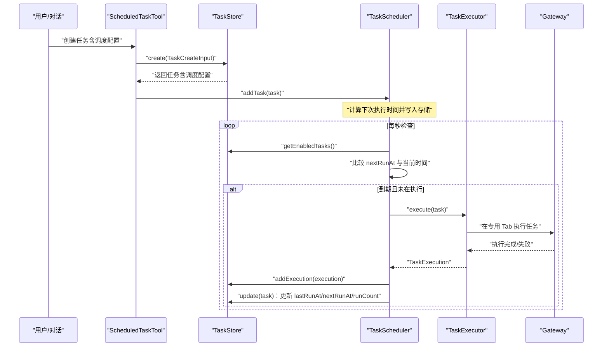
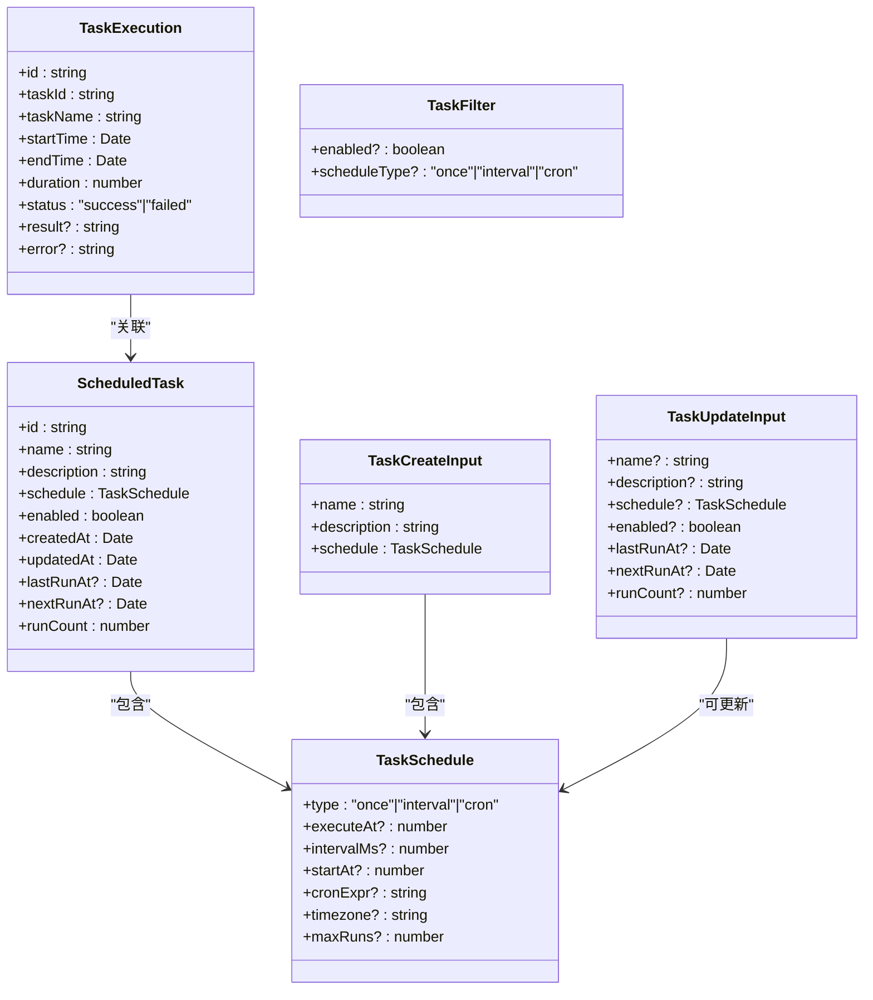
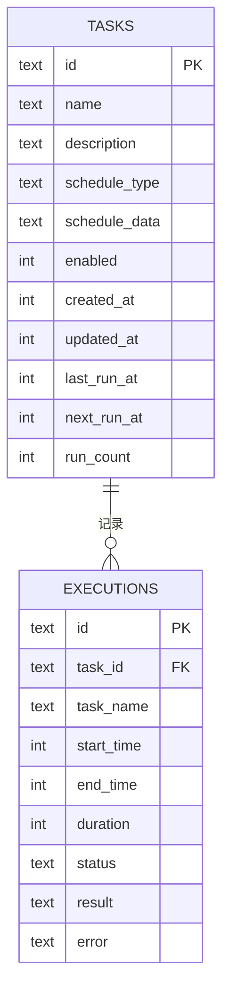
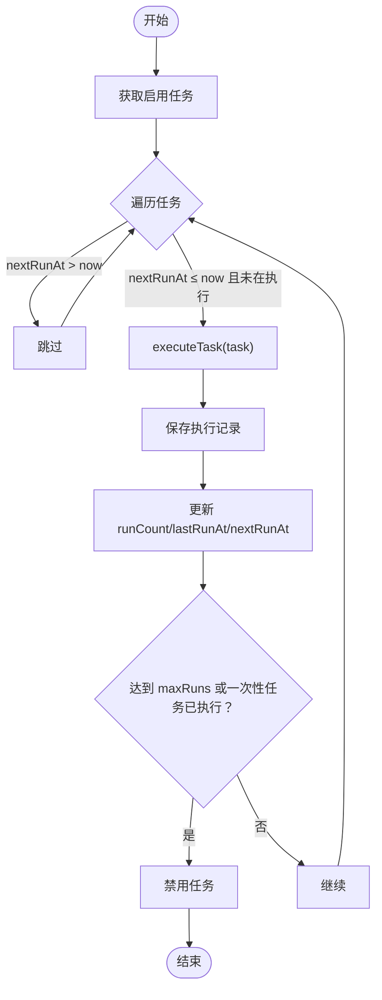
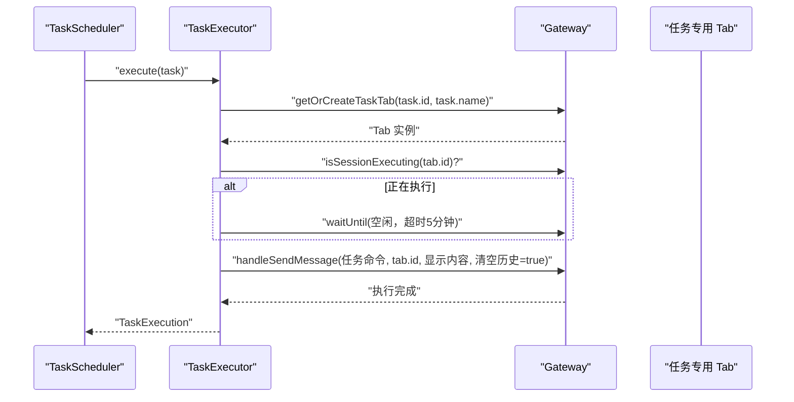
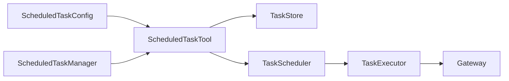

# 任务类型和配置

<cite>
**本文引用的文件**
- [types.ts](file://src/main/scheduled-tasks/types.ts)
- [index.ts](file://src/main/scheduled-tasks/index.ts)
- [scheduler.ts](file://src/main/scheduled-tasks/scheduler.ts)
- [store.ts](file://src/main/scheduled-tasks/store.ts)
- [executor.ts](file://src/main/scheduled-tasks/executor.ts)
- [scheduled-task-tool.ts](file://src/main/tools/scheduled-task-tool.ts)
- [ScheduledTaskConfig.tsx](file://src/renderer/components/settings/ScheduledTaskConfig.tsx)
- [ScheduledTaskManager.tsx](file://src/renderer/components/ScheduledTaskManager.tsx)
- [validation.ts](file://src/shared/utils/validation.ts)
- [timeouts.ts](file://src/main/config/timeouts.ts)
- [version.ts](file://src/shared/constants/version.ts)
- [README.md](file://README.md)
</cite>

## 目录
1. [简介](#简介)
2. [项目结构](#项目结构)
3. [核心组件](#核心组件)
4. [架构总览](#架构总览)
5. [详细组件分析](#详细组件分析)
6. [依赖分析](#依赖分析)
7. [性能考量](#性能考量)
8. [故障排查指南](#故障排查指南)
9. [结论](#结论)
10. [附录](#附录)

## 简介
本文件系统化阐述 DeepBot 的定时任务类型与配置体系，围绕 ScheduledTask 接口与 TaskSchedule 类型定义，详解一次性任务、周期性任务与 Cron 任务的配置参数、使用场景与最佳实践；解释调度参数的语义与取值范围；给出任务配置验证规则、版本兼容与迁移策略，并提供可视化流程图帮助理解。

## 项目结构
定时任务系统主要由以下模块组成：
- 类型定义：定义任务、调度、执行记录与输入输出接口
- 存储层：基于 SQLite 的持久化存储与索引
- 调度器：按秒轮询检查到期任务并触发执行
- 执行器：在专用 Tab 中执行任务，屏蔽重复与并发冲突
- 工具层：对外暴露创建、暂停/恢复、手动触发、历史查询等操作
- 渲染层：提供前端配置与管理界面

```mermaid
graph TB
subgraph "定时任务子系统"
Types["类型定义<br/>types.ts"]
Store["存储层<br/>store.ts"]
Scheduler["调度器<br/>scheduler.ts"]
Executor["执行器<br/>executor.ts"]
Tool["工具层<br/>scheduled-task-tool.ts"]
UI1["设置界面<br/>ScheduledTaskConfig.tsx"]
UI2["管理面板<br/>ScheduledTaskManager.tsx"]
end
Types --> Store
Types --> Scheduler
Types --> Executor
Store <- --> Scheduler
Scheduler --> Executor
Tool --> Store
Tool --> Scheduler
UI1 --> Tool
UI2 --> Tool
```

图表来源
- [types.ts:1-86](file://src/main/scheduled-tasks/types.ts#L1-L86)
- [store.ts:1-364](file://src/main/scheduled-tasks/store.ts#L1-L364)
- [scheduler.ts:1-322](file://src/main/scheduled-tasks/scheduler.ts#L1-L322)
- [executor.ts:1-170](file://src/main/scheduled-tasks/executor.ts#L1-L170)
- [scheduled-task-tool.ts:1-628](file://src/main/tools/scheduled-task-tool.ts#L1-L628)
- [ScheduledTaskConfig.tsx:1-358](file://src/renderer/components/settings/ScheduledTaskConfig.tsx#L1-L358)
- [ScheduledTaskManager.tsx:1-571](file://src/renderer/components/ScheduledTaskManager.tsx#L1-L571)

章节来源
- [index.ts:1-9](file://src/main/scheduled-tasks/index.ts#L1-L9)
- [types.ts:1-86](file://src/main/scheduled-tasks/types.ts#L1-L86)

## 核心组件
- ScheduledTask：任务实体，包含标识、名称、描述、调度配置、启用状态、时间戳与执行计数
- TaskSchedule：调度配置，支持 once、interval、cron 三类
- TaskExecution：执行记录，包含开始/结束时间、耗时、状态与结果/错误
- TaskFilter/TaskCreateInput/TaskUpdateInput：过滤、创建与更新输入
- TaskStore：SQLite 持久化，提供 CRUD、列表、执行历史、清理旧记录
- TaskScheduler：调度器，按秒轮询，计算下次执行时间，处理最大执行次数与一次性任务禁用
- TaskExecutor：执行器，通过 Gateway 在专用 Tab 执行任务，具备等待空闲与超时控制
- ScheduledTaskTool：对外工具，封装 create/list/delete/pause/resume/trigger/history/update/updateSchedule 等操作，内置调度参数校验与自然语言解析

章节来源
- [types.ts:29-85](file://src/main/scheduled-tasks/types.ts#L29-L85)
- [store.ts:133-230](file://src/main/scheduled-tasks/store.ts#L133-L230)
- [scheduler.ts:12-322](file://src/main/scheduled-tasks/scheduler.ts#L12-L322)
- [executor.ts:17-170](file://src/main/scheduled-tasks/executor.ts#L17-L170)
- [scheduled-task-tool.ts:128-494](file://src/main/tools/scheduled-task-tool.ts#L128-L494)

## 架构总览
定时任务从“对话/工具调用”创建任务，经存储层持久化，调度器按秒检查到期任务，执行器在专用 Tab 执行，执行结果回写存储层并更新任务状态。



图表来源
- [scheduled-task-tool.ts:171-494](file://src/main/tools/scheduled-task-tool.ts#L171-L494)
- [store.ts:133-230](file://src/main/scheduled-tasks/store.ts#L133-L230)
- [scheduler.ts:131-240](file://src/main/scheduled-tasks/scheduler.ts#L131-L240)
- [executor.ts:21-153](file://src/main/scheduled-tasks/executor.ts#L21-L153)

## 详细组件分析

### 类型定义与调度参数
- TaskSchedule.type：once/interval/cron
- once.executeAt：必填，时间戳（毫秒）
- interval.intervalMs：必填，毫秒，最小值 10 秒（低于阈值将被自动调整）
- interval.startAt：可选，首次执行时间戳（若未设置，从 now + intervalMs 推导）
- cron.cronExpr：必填，Cron 表达式（至少 5 段，最多 6 段）
- cron.timezone：可选，默认 Asia/Shanghai
- common.maxRuns：可选，最大执行次数，达到后自动禁用任务
- ScheduledTask：包含 id/name/description/schedule/enabled/时间戳/执行计数等字段
- TaskExecution：包含执行 id、任务 id/名称、起止时间、耗时、状态与结果/错误
- TaskFilter/TaskCreateInput/TaskUpdateInput：用于筛选、创建与更新



图表来源
- [types.ts:8-85](file://src/main/scheduled-tasks/types.ts#L8-L85)

章节来源
- [types.ts:8-85](file://src/main/scheduled-tasks/types.ts#L8-L85)

### 存储层（TaskStore）
- 数据库：SQLite，WAL 模式
- 表结构：
  - tasks：任务主表，包含调度类型与序列化的调度数据
  - executions：执行记录表，外键关联 tasks
- 索引：tasks.enabled、tasks.next_run、executions.task_id
- 关键能力：
  - create/read/update/delete/list/getEnabledTasks
  - addExecution/getExecutions/cleanupOldExecutions
  - rowToTask：反序列化 schedule_data 为 TaskSchedule
- 特殊处理：
  - Docker 模式与普通模式下数据库路径差异
  - 启动时检测并清理孤立的 -shm/-wal 文件
  - 任务数量上限（工具层限制）



图表来源
- [store.ts:88-128](file://src/main/scheduled-tasks/store.ts#L88-L128)

章节来源
- [store.ts:23-364](file://src/main/scheduled-tasks/store.ts#L23-L364)

### 调度器（TaskScheduler）
- 启动：启动后计算所有启用任务的 nextRunAt 并进入每秒检查循环
- 关键行为：
  - checkAndExecute：遍历启用任务，若 nextRunAt ≤ now 且未在执行，则异步触发 executeTask
  - executeTask：执行前二次确认任务存在与启用；执行后保存执行记录并更新 runCount/lastRunAt/nextRunAt；若达到 maxRuns 或一次性任务执行完毕则禁用任务
  - calculateNextRun：
    - once：返回 executeAt，若已过期则返回 null
    - interval：若未 lastRun 则优先 startAt，否则 now + intervalMs；intervalMs 小于 10 秒时自动调整为 10 秒
    - cron：使用 cron 库解析，指定 timezone，默认 Asia/Shanghai；非法表达式返回 null
  - recalculateAllTasks：批量重算启用任务的 nextRunAt



图表来源
- [scheduler.ts:131-240](file://src/main/scheduled-tasks/scheduler.ts#L131-L240)
- [scheduler.ts:245-302](file://src/main/scheduled-tasks/scheduler.ts#L245-L302)

章节来源
- [scheduler.ts:12-322](file://src/main/scheduled-tasks/scheduler.ts#L12-L322)

### 执行器（TaskExecutor）
- 通过 Gateway 在专用 Tab 执行任务，具备以下特性：
  - 等待 Tab 空闲（最长 5 分钟），避免并发冲突
  - 构造明确的系统前缀命令，避免 AI 将定时任务误认为“创建任务”
  - 返回统一的 TaskExecution 结构，包含开始/结束时间、耗时、状态与结果/错误



图表来源
- [executor.ts:86-153](file://src/main/scheduled-tasks/executor.ts#L86-L153)

章节来源
- [executor.ts:17-170](file://src/main/scheduled-tasks/executor.ts#L17-L170)

### 工具层（ScheduledTaskTool）
- 职责：对外提供 create/list/delete/pause/resume/trigger/history/update/updateSchedule 等操作
- 关键点：
  - 参数校验：validateSchedule，强制 type 与对应字段，interval 最小 10 秒，cron 表达式格式校验
  - 自然语言解析：parseScheduleText 支持“每隔X秒/分钟/小时”、“每天X点”、“Cron表达式：...”等
  - 任务数量限制：最多 10 个
  - 异步启动调度器：setGatewayInstance 中延时并重试启动
  - 执行历史：history 操作支持 limit 控制条数

章节来源
- [scheduled-task-tool.ts:128-494](file://src/main/tools/scheduled-task-tool.ts#L128-L494)
- [scheduled-task-tool.ts:499-615](file://src/main/tools/scheduled-task-tool.ts#L499-L615)

### 渲染层（前端界面）
- ScheduledTaskConfig：设置页展示任务列表、暂停/恢复、立即执行、删除
- ScheduledTaskManager：管理面板支持编辑任务内容、编辑调度方式（自然语言）、查看历史
- 两者均通过 API 调用工具层，实现与后端一致的操作

章节来源
- [ScheduledTaskConfig.tsx:36-358](file://src/renderer/components/settings/ScheduledTaskConfig.tsx#L36-L358)
- [ScheduledTaskManager.tsx:41-571](file://src/renderer/components/ScheduledTaskManager.tsx#L41-L571)

## 依赖分析
- 组件耦合：
  - TaskScheduler 依赖 TaskStore 与 TaskExecutor
  - TaskExecutor 依赖 Gateway（通过 setGatewayForExecutor 注入）
  - ScheduledTaskTool 依赖 TaskStore、TaskScheduler、TaskExecutor
  - 前端组件依赖 API（封装工具层调用）
- 外部依赖：
  - cron 库用于 Cron 表达式解析
  - SQLite 适配器用于持久化
- 潜在风险：
  - 调度器每秒检查可能带来 CPU 压力，但通过“仅遍历启用任务 + Set 去重执行”降低开销
  - Cron 表达式非法会导致计算 nextRunAt 为 null，任务不会执行



图表来源
- [scheduled-task-tool.ts:101-119](file://src/main/tools/scheduled-task-tool.ts#L101-L119)
- [scheduler.ts:21-24](file://src/main/scheduled-tasks/scheduler.ts#L21-L24)
- [executor.ts:13-15](file://src/main/scheduled-tasks/executor.ts#L13-L15)

章节来源
- [scheduled-task-tool.ts:1-628](file://src/main/tools/scheduled-task-tool.ts#L1-L628)
- [scheduler.ts:1-322](file://src/main/scheduled-tasks/scheduler.ts#L1-L322)
- [executor.ts:1-170](file://src/main/scheduled-tasks/executor.ts#L1-L170)

## 性能考量
- 调度轮询：每秒检查一次，适合中小规模任务（工具层限制最多 10 个）
- 执行并发：通过 executingTasks Set 防止同一任务并发执行
- 存储优化：WAL 模式提升写入性能；为 tasks/next_run 与 executions/task_id 建立索引
- Cron 解析：仅在计算 nextRunAt 时解析，异常时返回 null，避免持续失败
- 执行等待：执行器等待 Tab 空闲最长 5 分钟，避免死等

[本节为通用性能讨论，不直接分析具体文件]

## 故障排查指南
- 任务未执行
  - 检查 enabled 状态与 nextRunAt 是否已过期
  - 查看调度器日志与执行器日志
  - 验证 Cron 表达式是否合法
- 执行器报错“Gateway 实例未设置”
  - 确认已调用 setGatewayInstance 并正确注入
- 任务被自动禁用
  - 达到 maxRuns 或一次性任务执行完毕
- 任务数量超过上限
  - 工具层限制最多 10 个，需先删除再创建
- 执行器等待超时
  - Tab 长时间处于执行状态，等待超时（5 分钟）

章节来源
- [scheduler.ts:156-240](file://src/main/scheduled-tasks/scheduler.ts#L156-L240)
- [executor.ts:86-129](file://src/main/scheduled-tasks/executor.ts#L86-L129)
- [scheduled-task-tool.ts:499-538](file://src/main/tools/scheduled-task-tool.ts#L499-L538)

## 结论
DeepBot 的定时任务系统以清晰的类型定义为基础，结合 SQLite 持久化、每秒轮询调度与专用 Tab 执行，提供了稳定可靠的自动化执行能力。通过自然语言解析与严格的参数校验，降低了用户配置门槛；通过 maxRuns、禁用与历史记录等机制，保障了可控性与可观测性。

[本节为总结性内容，不直接分析具体文件]

## 附录

### 任务类型与配置参数详解
- 一次性任务（type: once）
  - executeAt：必填，时间戳（毫秒）
  - maxRuns：可选，达到后自动禁用
  - 使用场景：单次提醒、一次性检查
- 周期性任务（type: interval）
  - intervalMs：必填，毫秒，最小 10 秒
  - startAt：可选，首次执行时间戳
  - maxRuns：可选，达到后自动禁用
  - 使用场景：定时巡检、周期报表
- Cron 任务（type: cron）
  - cronExpr：必填，Cron 表达式（至少 5 段，最多 6 段）
  - timezone：可选，默认 Asia/Shanghai
  - maxRuns：可选，达到后自动禁用
  - 使用场景：日程化任务、跨时区调度

章节来源
- [types.ts:8-24](file://src/main/scheduled-tasks/types.ts#L8-L24)
- [scheduler.ts:251-297](file://src/main/scheduled-tasks/scheduler.ts#L251-L297)
- [scheduled-task-tool.ts:506-538](file://src/main/tools/scheduled-task-tool.ts#L506-L538)

### 配置验证规则
- 必填字段：type 与对应字段（once.executeAt、interval.intervalMs、cron.cronExpr）
- 取值范围：
  - intervalMs ≥ 10 秒（低于阈值自动调整）
  - cron 表达式段数为 5 或 6
- 工具层限制：
  - 最多 10 个任务
  - updateSchedule 支持自然语言解析

章节来源
- [scheduled-task-tool.ts:499-538](file://src/main/tools/scheduled-task-tool.ts#L499-L538)
- [scheduled-task-tool.ts:550-615](file://src/main/tools/scheduled-task-tool.ts#L550-L615)

### 最佳实践与常见模式
- 优先使用自然语言描述更新调度（如“每隔10秒”、“每天早上9点”），由工具层解析为标准配置
- 对高频任务设置合理的 maxRuns，避免无限执行造成资源压力
- Cron 表达式建议明确 timezone，避免时区偏差
- 任务内容与调度分离：先更新 description，再通过 updateSchedule 修改调度，避免误触发
- 使用“立即执行”验证任务逻辑，不改变原定计划

章节来源
- [ScheduledTaskManager.tsx:108-146](file://src/renderer/components/ScheduledTaskManager.tsx#L108-L146)
- [scheduled-task-tool.ts:365-403](file://src/main/tools/scheduled-task-tool.ts#L365-L403)

### 版本兼容与迁移策略
- 版本常量：APP_VERSION 为 0.4.0
- 迁移建议：
  - 若升级后发现 Cron 表达式行为异常，检查 timezone 与表达式段数
  - 若任务数量超过 10 个，需先清理旧任务再创建新任务
  - 历史记录清理：默认保留 30 天，可通过 cleanupOldExecutions 调整

章节来源
- [version.ts](file://src/shared/constants/version.ts#L6)
- [store.ts:328-337](file://src/main/scheduled-tasks/store.ts#L328-L337)

### 任务优先级、执行超时与重试机制
- 优先级：系统未提供任务优先级字段，调度按到期时间与启用状态执行
- 执行超时：执行器在专用 Tab 执行，等待空闲最长 5 分钟；工具层未对单次任务设置独立超时
- 重试机制：系统未提供任务级重试配置，建议通过 cron 或 interval 重试策略替代

章节来源
- [executor.ts:97-129](file://src/main/scheduled-tasks/executor.ts#L97-L129)
- [timeouts.ts:58-77](file://src/main/config/timeouts.ts#L58-L77)

### 使用示例与场景
- “每天早上9点提醒我开会”：由工具层解析为 cron 表达式，设置 timezone 为 Asia/Shanghai
- “每隔5分钟执行一次，最多100次”：解析为 intervalMs=300000，maxRuns=100
- “Cron表达式：0 9 * * *”：直接使用标准 Cron 表达式

章节来源
- [scheduled-task-tool.ts:550-615](file://src/main/tools/scheduled-task-tool.ts#L550-L615)
- [README.md:549-567](file://README.md#L549-L567)