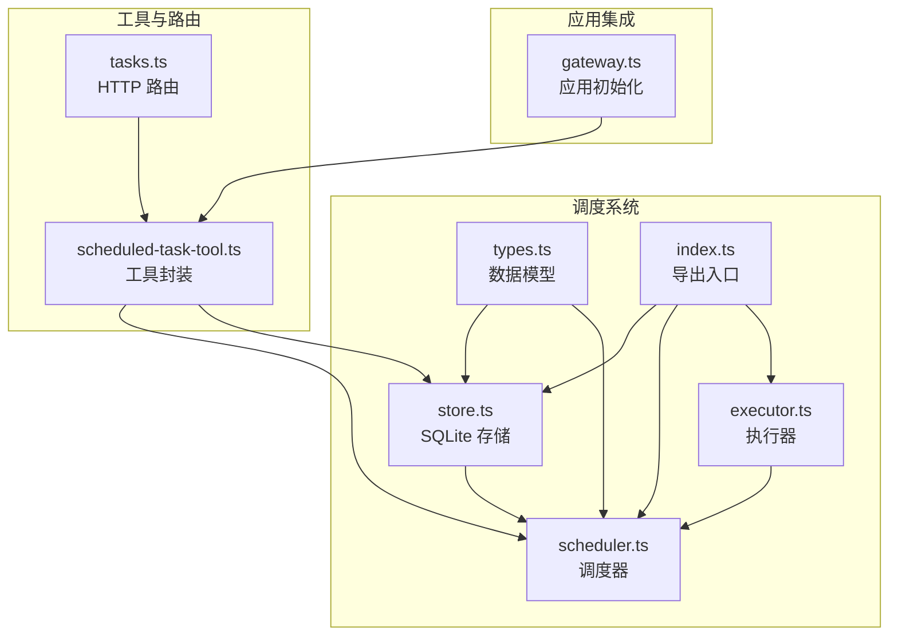
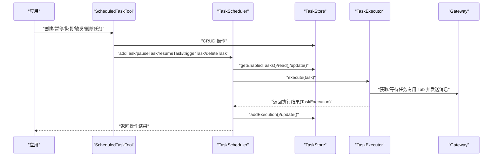
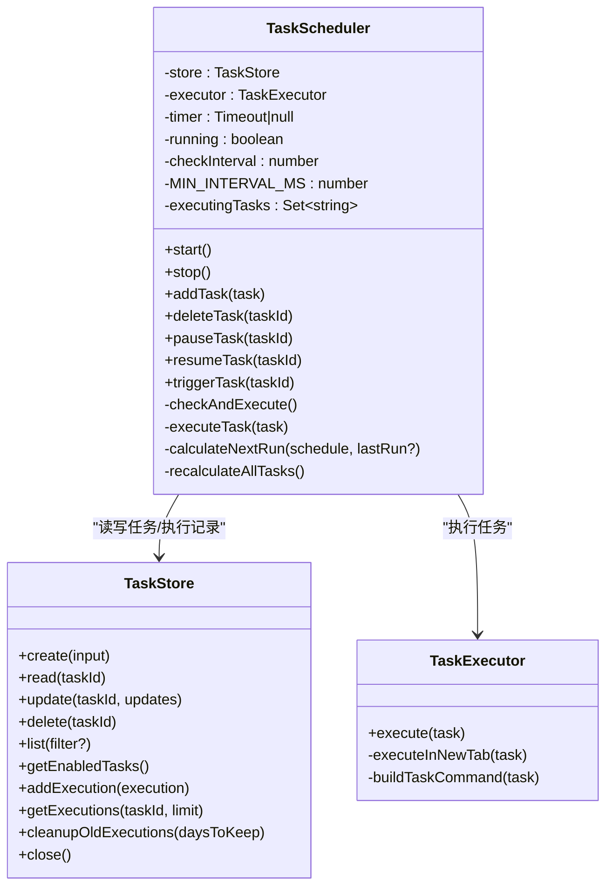
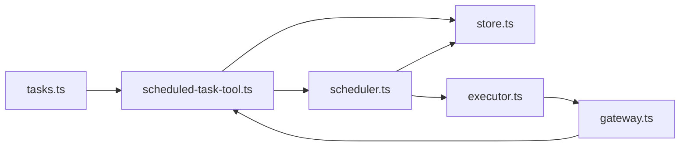

# 任务调度器

<cite>
**本文引用的文件**
- [scheduler.ts](file://src/main/scheduled-tasks/scheduler.ts)
- [types.ts](file://src/main/scheduled-tasks/types.ts)
- [store.ts](file://src/main/scheduled-tasks/store.ts)
- [executor.ts](file://src/main/scheduled-tasks/executor.ts)
- [index.ts](file://src/main/scheduled-tasks/index.ts)
- [scheduled-task-tool.ts](file://src/main/tools/scheduled-task-tool.ts)
- [tasks.ts](file://src/server/routes/tasks.ts)
- [gateway.ts](file://src/main/gateway.ts)
</cite>

## 目录
1. [简介](#简介)
2. [项目结构](#项目结构)
3. [核心组件](#核心组件)
4. [架构总览](#架构总览)
5. [详细组件分析](#详细组件分析)
6. [依赖关系分析](#依赖关系分析)
7. [性能与并发特性](#性能与并发特性)
8. [故障排查指南](#故障排查指南)
9. [结论](#结论)
10. [附录：API 使用示例与最佳实践](#附录api-使用示例与最佳实践)

## 简介
本文件面向 史丽慧小助理 的任务调度系统，围绕 TaskScheduler 类进行深入设计与实现解析，覆盖以下主题：
- 调度器的启动与停止机制
- 任务检查循环与执行控制
- 不同类型任务的调度策略：一次性、周期性、Cron 表达式
- 任务状态管理、执行标记与并发控制
- 任务增删改查、暂停/恢复、手动触发的操作指南
- 错误处理、日志记录与性能优化策略
- 实际代码示例路径，帮助正确使用调度器 API

## 项目结构
调度系统位于 src/main/scheduled-tasks 目录，核心文件如下：
- types.ts：任务与调度配置的数据模型定义
- store.ts：基于 SQLite 的任务持久化存储
- executor.ts：任务执行器，负责在专用 Tab 中执行任务
- scheduler.ts：调度器，负责定时检查与触发任务
- index.ts：导出模块入口

此外，工具层 scheduled-task-tool.ts 提供对外 API，封装调度器与存储；服务端路由 tasks.ts 将外部请求转发至工具层；Gateway 在应用初始化时设置调度器依赖。

图表来源
- [scheduler.ts:1-322](file://src/main/scheduled-tasks/scheduler.ts#L1-L322)
- [store.ts:1-364](file://src/main/scheduled-tasks/store.ts#L1-L364)
- [executor.ts:1-170](file://src/main/scheduled-tasks/executor.ts#L1-L170)
- [types.ts:1-86](file://src/main/scheduled-tasks/types.ts#L1-L86)
- [index.ts:1-9](file://src/main/scheduled-tasks/index.ts#L1-L9)
- [scheduled-task-tool.ts:1-628](file://src/main/tools/scheduled-task-tool.ts#L1-L628)
- [tasks.ts:1-33](file://src/server/routes/tasks.ts#L1-L33)
- [gateway.ts:1-200](file://src/main/gateway.ts#L1-L200)

章节来源
- [scheduler.ts:1-322](file://src/main/scheduled-tasks/scheduler.ts#L1-L322)
- [store.ts:1-364](file://src/main/scheduled-tasks/store.ts#L1-L364)
- [executor.ts:1-170](file://src/main/scheduled-tasks/executor.ts#L1-L170)
- [types.ts:1-86](file://src/main/scheduled-tasks/types.ts#L1-L86)
- [index.ts:1-9](file://src/main/scheduled-tasks/index.ts#L1-L9)
- [scheduled-task-tool.ts:1-628](file://src/main/tools/scheduled-task-tool.ts#L1-L628)
- [tasks.ts:1-33](file://src/server/routes/tasks.ts#L1-L33)
- [gateway.ts:1-200](file://src/main/gateway.ts#L1-L200)

## 核心组件
- TaskScheduler：调度器核心，负责启动/停止、任务检查循环、执行控制与状态更新
- TaskStore：任务持久化存储，提供 CRUD、查询、执行历史记录与清理
- TaskExecutor：任务执行器，负责在专用 Tab 中执行任务并记录执行结果
- ScheduledTaskTool：对外工具封装，提供创建、列表、暂停/恢复、手动触发等操作，并负责调度器初始化与依赖注入
- HTTP 路由：tasks.ts 将外部请求转发给工具层

章节来源
- [scheduler.ts:12-322](file://src/main/scheduled-tasks/scheduler.ts#L12-L322)
- [store.ts:23-364](file://src/main/scheduled-tasks/store.ts#L23-L364)
- [executor.ts:17-170](file://src/main/scheduled-tasks/executor.ts#L17-L170)
- [scheduled-task-tool.ts:128-494](file://src/main/tools/scheduled-task-tool.ts#L128-L494)
- [tasks.ts:9-32](file://src/server/routes/tasks.ts#L9-L32)

## 架构总览
调度系统采用“存储-执行-调度”三层协作：
- 存储层：TaskStore 使用 SQLite 持久化任务与执行记录，提供索引加速查询
- 执行层：TaskExecutor 通过 Gateway 的专用 Tab 执行任务，保证隔离与并发安全
- 调度层：TaskScheduler 周期性检查任务到期情况，触发执行并更新状态

图表来源
- [scheduled-task-tool.ts:171-492](file://src/main/tools/scheduled-task-tool.ts#L171-L492)
- [scheduler.ts:131-240](file://src/main/scheduled-tasks/scheduler.ts#L131-L240)
- [executor.ts:21-153](file://src/main/scheduled-tasks/executor.ts#L21-L153)
- [store.ts:133-230](file://src/main/scheduled-tasks/store.ts#L133-L230)

## 详细组件分析

### TaskScheduler 设计与实现
- 启动与停止
  - start：若未运行则标记运行中，计算所有启用任务的下次执行时间，启动每秒检查的定时器
  - stop：停止定时器并重置运行状态
- 任务检查循环
  - 每秒检查一次，遍历启用任务，跳过正在执行的任务集合，若到达下次执行时间则异步触发执行
- 执行控制与并发
  - 使用 Set 标记正在执行的任务 ID，避免同一任务并发执行
  - 执行前/后均进行任务存在性与启用状态校验，防止竞态条件
- 状态更新与生命周期
  - 成功执行后更新 lastRunAt、runCount，并根据调度类型与 maxRuns 重新计算 nextRunAt 或禁用任务
  - 一次性任务在执行完成后自动禁用
- 调度策略
  - once：按指定时间戳执行，若已过期则不执行
  - interval：按间隔毫秒数递增，支持 startAt 首次执行时间，最小间隔 10 秒
  - cron：使用 cron 库解析表达式，支持时区，默认 Asia/Shanghai
- 辅助方法
  - addTask/deleteTask/pauseTask/resumeTask/triggerTask：封装对存储与调度器状态的变更
  - recalculateAllTasks：批量重新计算启用任务的下次执行时间

图表来源
- [scheduler.ts:12-322](file://src/main/scheduled-tasks/scheduler.ts#L12-L322)
- [store.ts:23-364](file://src/main/scheduled-tasks/store.ts#L23-L364)
- [executor.ts:17-170](file://src/main/scheduled-tasks/executor.ts#L17-L170)

章节来源
- [scheduler.ts:29-62](file://src/main/scheduled-tasks/scheduler.ts#L29-L62)
- [scheduler.ts:131-151](file://src/main/scheduled-tasks/scheduler.ts#L131-L151)
- [scheduler.ts:156-240](file://src/main/scheduled-tasks/scheduler.ts#L156-L240)
- [scheduler.ts:245-302](file://src/main/scheduled-tasks/scheduler.ts#L245-L302)
- [scheduler.ts:307-320](file://src/main/scheduled-tasks/scheduler.ts#L307-L320)

### TaskStore 数据持久化与查询
- 数据库与表结构
  - 任务表：id、name、description、schedule_type、schedule_data、enabled、created_at、updated_at、last_run_at、next_run_at、run_count
  - 执行记录表：id、task_id、task_name、start_time、end_time、duration、status、result、error
  - 索引：tasks.enabled、tasks.next_run_at、executions.task_id
- 单例模式与初始化
  - getInstance 返回唯一实例，自动创建目录与 WAL 模式
  - Docker 与普通模式下数据库路径不同，支持自动清理孤立的 -shm/-wal 文件
- CRUD 与查询
  - create/read/update/delete/list/getEnabledTasks
  - addExecution/getExecutions/cleanupOldExecutions
- JSON 序列化
  - schedule 字段以 JSON 文本存储，读取时安全解析

章节来源
- [store.ts:27-83](file://src/main/scheduled-tasks/store.ts#L27-L83)
- [store.ts:88-128](file://src/main/scheduled-tasks/store.ts#L88-L128)
- [store.ts:133-230](file://src/main/scheduled-tasks/store.ts#L133-L230)
- [store.ts:278-337](file://src/main/scheduled-tasks/store.ts#L278-L337)
- [store.ts:342-355](file://src/main/scheduled-tasks/store.ts#L342-L355)

### TaskExecutor 任务执行流程
- 执行入口
  - execute(task)：记录开始时间与执行 ID，捕获异常并构造执行记录
- 执行细节
  - executeInNewTab：获取或创建任务专用 Tab，等待窗口空闲（最长 5 分钟），发送命令并返回执行结果
  - buildTaskCommand：构建明确的系统提示，避免 AI 将定时任务误认为“创建定时任务”
- 依赖注入
  - 通过 setGatewayForExecutor 注入 Gateway 实例，供执行器使用

章节来源
- [executor.ts:21-79](file://src/main/scheduled-tasks/executor.ts#L21-L79)
- [executor.ts:86-153](file://src/main/scheduled-tasks/executor.ts#L86-L153)
- [executor.ts:17-17](file://src/main/scheduled-tasks/executor.ts#L17-L17)

### ScheduledTaskTool 工具封装与调度器初始化
- 依赖注入与启动
  - setGatewayInstance：设置 Gateway 实例并注入执行器，延迟 2 秒异步启动调度器，最多重试 3 次
  - getScheduler/getExecutor：懒加载单例
- 操作接口
  - create/list/update/updateSchedule/delete/pause/resume/trigger/history
  - 对应调用 TaskStore 与 TaskScheduler 的方法
- 调度解析与校验
  - validateSchedule：校验调度类型与参数，interval 最小 10 秒
  - parseScheduleText：支持自然语言描述解析为调度配置

章节来源
- [scheduled-task-tool.ts:56-86](file://src/main/tools/scheduled-task-tool.ts#L56-L86)
- [scheduled-task-tool.ts:101-119](file://src/main/tools/scheduled-task-tool.ts#L101-L119)
- [scheduled-task-tool.ts:180-492](file://src/main/tools/scheduled-task-tool.ts#L180-L492)
- [scheduled-task-tool.ts:499-538](file://src/main/tools/scheduled-task-tool.ts#L499-L538)
- [scheduled-task-tool.ts:550-615](file://src/main/tools/scheduled-task-tool.ts#L550-L615)

### HTTP 路由与应用集成
- HTTP 路由 tasks.ts：接收 POST /api/tasks 请求，调用 gatewayAdapter.scheduledTask 并返回结果
- 应用初始化 gateway.ts：在构造函数中调用 setGatewayInstance(this)，将 Gateway 实例传递给调度器工具

章节来源
- [tasks.ts:16-27](file://src/server/routes/tasks.ts#L16-L27)
- [gateway.ts:76-77](file://src/main/gateway.ts#L76-L77)

## 依赖关系分析
- TaskScheduler 依赖 TaskStore 与 TaskExecutor
- TaskStore 依赖 SQLite 适配器与工具类（ID 生成、JSON 解析、文件系统、Docker 工具）
- TaskExecutor 依赖 Gateway（通过 setGatewayForExecutor 注入）
- ScheduledTaskTool 依赖 TaskStore、TaskScheduler、TaskExecutor，并负责调度器初始化
- HTTP 路由依赖 GatewayAdapter 将请求转发给工具层

图表来源
- [scheduled-task-tool.ts:101-119](file://src/main/tools/scheduled-task-tool.ts#L101-L119)
- [scheduler.ts:13-24](file://src/main/scheduled-tasks/scheduler.ts#L13-L24)
- [executor.ts:13-15](file://src/main/scheduled-tasks/executor.ts#L13-L15)
- [tasks.ts:19](file://src/server/routes/tasks.ts#L19-L19)
- [gateway.ts:76-77](file://src/main/gateway.ts#L76-L77)

## 性能与并发特性
- 检查频率与并发控制
  - 每秒检查一次，避免频繁 IO；通过 executingTasks 集合避免同一任务并发执行
- 最小间隔保护
  - interval 类型最小间隔 10 秒，防止过于频繁的任务导致资源争用
- 数据库优化
  - WAL 模式提升并发写入性能；为 tasks.enabled、tasks.next_run_at、executions.task_id 建立索引
- 执行等待与超时
  - 执行器等待任务 Tab 空闲最长 5 分钟，避免死锁
- 执行记录清理
  - 支持按天清理旧执行记录，控制存储增长

章节来源
- [scheduler.ts:17-19](file://src/main/scheduled-tasks/scheduler.ts#L17-L19)
- [scheduler.ts:263-266](file://src/main/scheduled-tasks/scheduler.ts#L263-L266)
- [store.ts:69](file://src/main/scheduled-tasks/store.ts#L69)
- [store.ts:124-127](file://src/main/scheduled-tasks/store.ts#L124-L127)
- [executor.ts:108-121](file://src/main/scheduled-tasks/executor.ts#L108-L121)
- [store.ts:328-337](file://src/main/scheduled-tasks/store.ts#L328-L337)

## 故障排查指南
- 调度器启动失败
  - 现象：调度器启动重试 3 次后仍失败
  - 排查：确认数据库初始化完成、网络与权限正常；查看日志中的警告与错误
- Cron 表达式无效
  - 现象：计算下次执行时间为 null
  - 排查：检查表达式格式与时区；表达式需满足 cron 库要求
- 任务执行卡住
  - 现象：任务长时间处于执行中
  - 排查：检查任务 Tab 是否空闲；执行器等待超时为 5 分钟；确认 Gateway 实例已注入
- 任务被删除或禁用
  - 现象：执行过程中任务状态变化
  - 排查：调度器在执行前后均进行存在性与启用状态校验，确保幂等性
- 存储异常
  - 现象：WAL/SHM 文件残留导致连接失败
  - 排查：系统会自动清理孤立文件；如失败，手动删除对应文件后重启

章节来源
- [scheduled-task-tool.ts:65-85](file://src/main/tools/scheduled-task-tool.ts#L65-L85)
- [scheduler.ts:293-296](file://src/main/scheduled-tasks/scheduler.ts#L293-L296)
- [executor.ts:87-89](file://src/main/scheduled-tasks/executor.ts#L87-L89)
- [executor.ts:108-121](file://src/main/scheduled-tasks/executor.ts#L108-L121)
- [store.ts:40-65](file://src/main/scheduled-tasks/store.ts#L40-L65)

## 结论
史丽慧小助理 的任务调度系统通过清晰的分层设计实现了高可用与可维护性：
- TaskScheduler 提供稳定的时间驱动调度与并发控制
- TaskStore 以 SQLite 为基础，兼顾性能与可靠性
- TaskExecutor 将任务执行与 UI 隔离，保障用户体验
- ScheduledTaskTool 与 HTTP 路由提供简洁易用的外部接口
建议在生产环境中结合日志监控与定期清理策略，确保长期稳定运行。

## 附录：API 使用示例与最佳实践

### 启动与停止
- 启动：应用初始化时由 Gateway 注入 Gateway 实例，工具层延迟 2 秒启动调度器并重试最多 3 次
- 停止：应用关闭时调用 stopScheduler()

章节来源
- [gateway.ts:76-77](file://src/main/gateway.ts#L76-L77)
- [scheduled-task-tool.ts:65-85](file://src/main/tools/scheduled-task-tool.ts#L65-L85)
- [scheduled-task-tool.ts:620-627](file://src/main/tools/scheduled-task-tool.ts#L620-L627)

### 添加任务
- 使用 ScheduledTaskTool 的 create 操作，传入 name/description/schedule
- schedule 支持 once/interval/cron 三类，interval 最小 10 秒
- 工具层会校验参数并调用 TaskStore.create 与 TaskScheduler.addTask

章节来源
- [scheduled-task-tool.ts:180-220](file://src/main/tools/scheduled-task-tool.ts#L180-L220)
- [store.ts:133-168](file://src/main/scheduled-tasks/store.ts#L133-L168)
- [scheduler.ts:67-75](file://src/main/scheduled-tasks/scheduler.ts#L67-L75)

### 删除任务
- 使用 delete 操作，内部调用 TaskScheduler.deleteTask 与 TaskStore.delete
- 若存在任务 Tab，会尝试关闭对应 Tab

章节来源
- [scheduled-task-tool.ts:249-280](file://src/main/tools/scheduled-task-tool.ts#L249-L280)

### 暂停与恢复
- pause：禁用任务，尝试重置对应任务 Tab 的会话运行时
- resume：启用任务并重新计算下次执行时间，同时重置执行计数

章节来源
- [scheduled-task-tool.ts:282-337](file://src/main/tools/scheduled-task-tool.ts#L282-L337)
- [scheduler.ts:88-113](file://src/main/scheduled-tasks/scheduler.ts#L88-L113)

### 手动触发
- trigger：异步触发任务执行，不等待完成，便于快速验证

章节来源
- [scheduled-task-tool.ts:405-427](file://src/main/tools/scheduled-task-tool.ts#L405-L427)
- [scheduler.ts:118-126](file://src/main/scheduled-tasks/scheduler.ts#L118-L126)

### 查看执行历史
- history：查询最近 N 条执行记录，包含开始/结束时间、耗时、状态与结果/错误

章节来源
- [scheduled-task-tool.ts:429-463](file://src/main/tools/scheduled-task-tool.ts#L429-L463)
- [store.ts:302-323](file://src/main/scheduled-tasks/store.ts#L302-L323)

### 调度策略详解
- 一次性任务（once）
  - executeAt 指定执行时间，若已过期则不执行
- 周期性任务（interval）
  - intervalMs 为间隔毫秒数，最小 10 秒；startAt 可指定首次执行时间
- Cron 表达式（cron）
  - cronExpr 支持标准表达式，timezone 默认 Asia/Shanghai

章节来源
- [scheduler.ts:251-301](file://src/main/scheduled-tasks/scheduler.ts#L251-L301)
- [types.ts:8-24](file://src/main/scheduled-tasks/types.ts#L8-L24)

### 最佳实践
- 控制任务数量：工具层限制最多 10 个任务
- 合理设置间隔：避免小于 10 秒的 interval，减少资源压力
- 使用 Cron 表达式：复杂时间规则优先使用 cron，提高可读性
- 监控执行历史：定期清理旧记录，保持数据库健康
- 并发安全：利用调度器内置的并发控制，避免手工并发触发同一任务

章节来源
- [scheduled-task-tool.ts:51](file://src/main/tools/scheduled-task-tool.ts#L51)
- [scheduler.ts:263-266](file://src/main/scheduled-tasks/scheduler.ts#L263-L266)
- [store.ts:328-337](file://src/main/scheduled-tasks/store.ts#L328-L337)