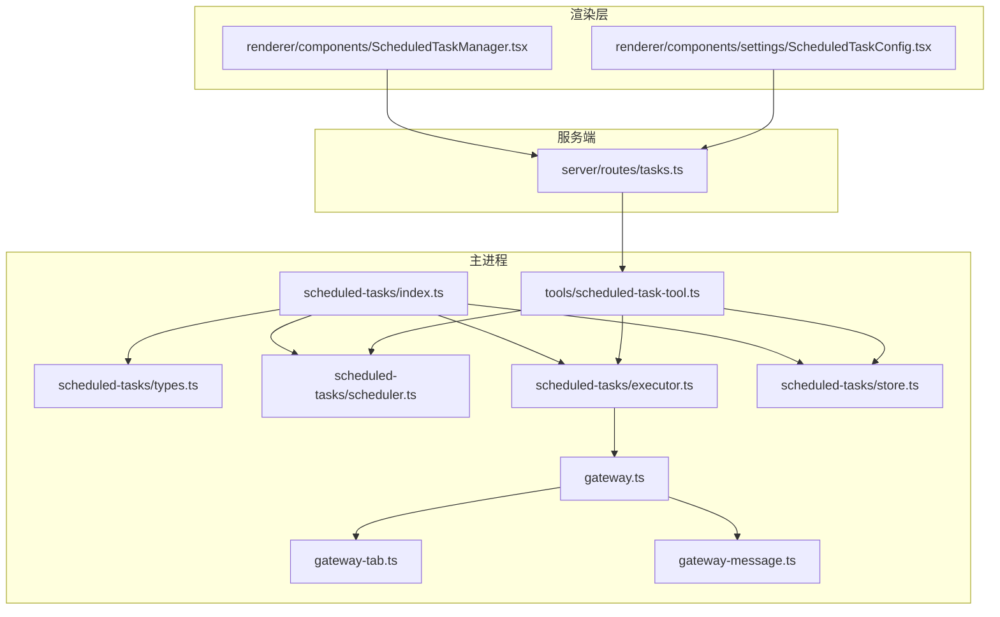
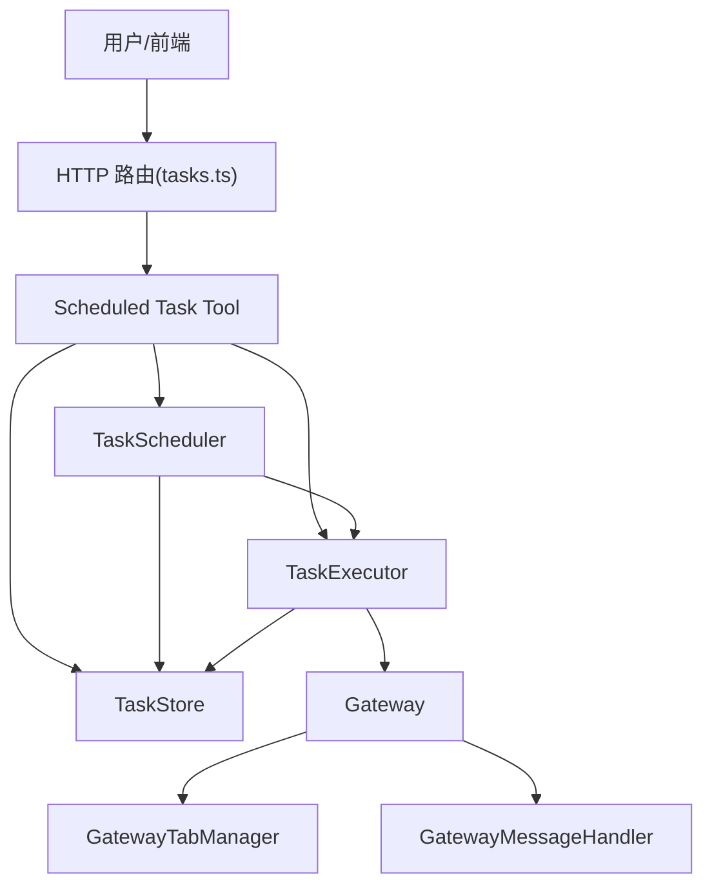
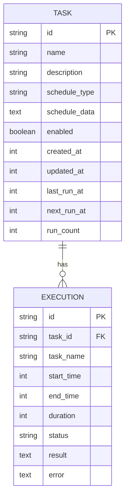
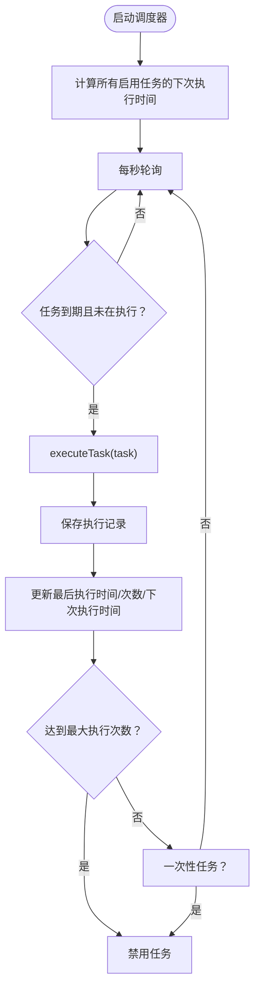
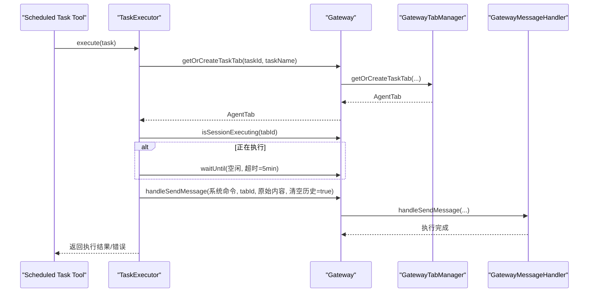
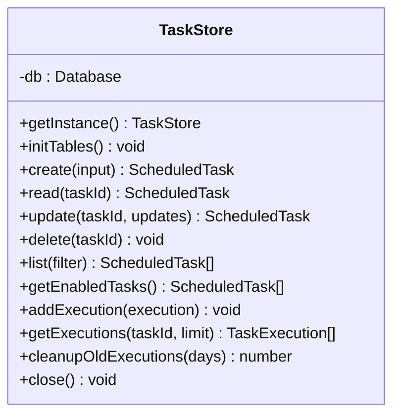
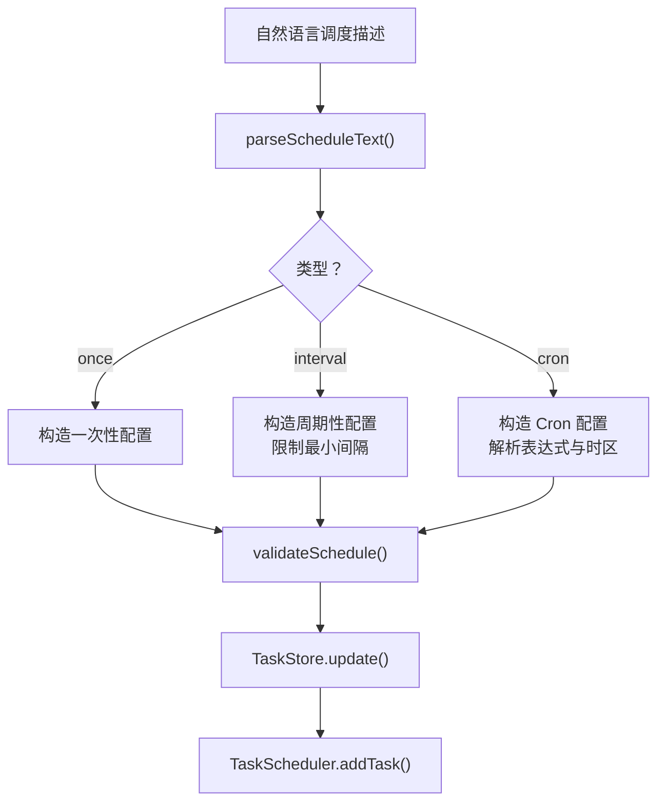
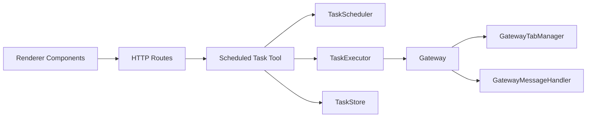

# 定时任务系统

<cite>
**本文档引用的文件**
- [src/main/scheduled-tasks/index.ts](file://src/main/scheduled-tasks/index.ts)
- [src/main/scheduled-tasks/types.ts](file://src/main/scheduled-tasks/types.ts)
- [src/main/scheduled-tasks/scheduler.ts](file://src/main/scheduled-tasks/scheduler.ts)
- [src/main/scheduled-tasks/executor.ts](file://src/main/scheduled-tasks/executor.ts)
- [src/main/scheduled-tasks/store.ts](file://src/main/scheduled-tasks/store.ts)
- [src/main/tools/scheduled-task-tool.ts](file://src/main/tools/scheduled-task-tool.ts)
- [src/server/routes/tasks.ts](file://src/server/routes/tasks.ts)
- [src/renderer/components/ScheduledTaskManager.tsx](file://src/renderer/components/ScheduledTaskManager.tsx)
- [src/renderer/components/settings/ScheduledTaskConfig.tsx](file://src/renderer/components/settings/ScheduledTaskConfig.tsx)
- [src/main/gateway.ts](file://src/main/gateway.ts)
- [src/main/gateway-tab.ts](file://src/main/gateway-tab.ts)
- [src/main/gateway-message.ts](file://src/main/gateway-message.ts)
- [src/main/tools/tool-names.ts](file://src/main/tools/tool-names.ts)
</cite>

## 目录
1. [简介](#简介)
2. [项目结构](#项目结构)
3. [核心组件](#核心组件)
4. [架构总览](#架构总览)
5. [详细组件分析](#详细组件分析)
6. [依赖关系分析](#依赖关系分析)
7. [性能考量](#性能考量)
8. [故障排查指南](#故障排查指南)
9. [结论](#结论)
10. [附录](#附录)

## 简介
本文件为 DeepBot 定时任务系统的综合技术文档，覆盖任务调度架构、Cron 表达式解析与调度器设计、执行器实现机制与任务状态管理、任务存储与执行历史、任务配置管理、操作指南、监控与错误处理机制，以及面向开发者的自定义任务类型扩展指南。目标是帮助开发者快速理解系统设计、正确使用与维护定时任务，并在此基础上进行扩展。

## 项目结构
定时任务系统主要分布在以下模块：
- 主进程核心：调度器、执行器、存储层、工具入口
- 服务端接口：HTTP 路由封装
- 渲染层组件：任务管理界面与设置页
- 网关集成：任务专属 Tab、消息路由与执行控制

**图表来源**
- [src/main/scheduled-tasks/index.ts:1-9](file://src/main/scheduled-tasks/index.ts#L1-L9)
- [src/main/scheduled-tasks/types.ts:1-86](file://src/main/scheduled-tasks/types.ts#L1-L86)
- [src/main/scheduled-tasks/scheduler.ts:1-322](file://src/main/scheduled-tasks/scheduler.ts#L1-L322)
- [src/main/scheduled-tasks/executor.ts:1-170](file://src/main/scheduled-tasks/executor.ts#L1-L170)
- [src/main/scheduled-tasks/store.ts:1-364](file://src/main/scheduled-tasks/store.ts#L1-L364)
- [src/main/tools/scheduled-task-tool.ts:1-628](file://src/main/tools/scheduled-task-tool.ts#L1-L628)
- [src/server/routes/tasks.ts:1-33](file://src/server/routes/tasks.ts#L1-L33)
- [src/renderer/components/ScheduledTaskManager.tsx:1-571](file://src/renderer/components/ScheduledTaskManager.tsx#L1-L571)
- [src/renderer/components/settings/ScheduledTaskConfig.tsx:1-358](file://src/renderer/components/settings/ScheduledTaskConfig.tsx#L1-L358)
- [src/main/gateway.ts:1-772](file://src/main/gateway.ts#L1-L772)
- [src/main/gateway-tab.ts:600-796](file://src/main/gateway-tab.ts#L600-L796)
- [src/main/gateway-message.ts:1-525](file://src/main/gateway-message.ts#L1-L525)

**章节来源**
- [src/main/scheduled-tasks/index.ts:1-9](file://src/main/scheduled-tasks/index.ts#L1-L9)
- [src/main/scheduled-tasks/types.ts:1-86](file://src/main/scheduled-tasks/types.ts#L1-L86)
- [src/main/scheduled-tasks/scheduler.ts:1-322](file://src/main/scheduled-tasks/scheduler.ts#L1-L322)
- [src/main/scheduled-tasks/executor.ts:1-170](file://src/main/scheduled-tasks/executor.ts#L1-L170)
- [src/main/scheduled-tasks/store.ts:1-364](file://src/main/scheduled-tasks/store.ts#L1-L364)
- [src/main/tools/scheduled-task-tool.ts:1-628](file://src/main/tools/scheduled-task-tool.ts#L1-L628)
- [src/server/routes/tasks.ts:1-33](file://src/server/routes/tasks.ts#L1-L33)
- [src/renderer/components/ScheduledTaskManager.tsx:1-571](file://src/renderer/components/ScheduledTaskManager.tsx#L1-L571)
- [src/renderer/components/settings/ScheduledTaskConfig.tsx:1-358](file://src/renderer/components/settings/ScheduledTaskConfig.tsx#L1-L358)
- [src/main/gateway.ts:1-772](file://src/main/gateway.ts#L1-L772)
- [src/main/gateway-tab.ts:600-796](file://src/main/gateway-tab.ts#L600-L796)
- [src/main/gateway-message.ts:1-525](file://src/main/gateway-message.ts#L1-L525)

## 核心组件
- 任务类型定义：统一的任务结构、调度配置、执行记录与过滤器等类型定义，确保前后端一致的数据契约。
- 调度器：负责周期性检查、触发任务、计算下次执行时间、任务启停与手动触发。
- 执行器：在任务专属 Tab 中执行任务，构建命令、等待窗口空闲、发送消息并记录执行结果。
- 存储层：SQLite 持久化任务与执行记录，提供 CRUD、查询与清理策略。
- 工具入口：将调度器、执行器、存储与网关集成，暴露统一的工具接口与自然语言调度解析。
- 服务端路由：提供 HTTP 接口，转发到工具入口。
- 渲染组件：提供任务管理界面与设置页，支持编辑、暂停/恢复、立即执行、删除与查看历史。

**章节来源**
- [src/main/scheduled-tasks/types.ts:1-86](file://src/main/scheduled-tasks/types.ts#L1-L86)
- [src/main/scheduled-tasks/scheduler.ts:12-322](file://src/main/scheduled-tasks/scheduler.ts#L12-L322)
- [src/main/scheduled-tasks/executor.ts:17-170](file://src/main/scheduled-tasks/executor.ts#L17-L170)
- [src/main/scheduled-tasks/store.ts:23-364](file://src/main/scheduled-tasks/store.ts#L23-L364)
- [src/main/tools/scheduled-task-tool.ts:128-628](file://src/main/tools/scheduled-task-tool.ts#L128-L628)
- [src/server/routes/tasks.ts:9-32](file://src/server/routes/tasks.ts#L9-L32)
- [src/renderer/components/ScheduledTaskManager.tsx:41-571](file://src/renderer/components/ScheduledTaskManager.tsx#L41-L571)
- [src/renderer/components/settings/ScheduledTaskConfig.tsx:36-358](file://src/renderer/components/settings/ScheduledTaskConfig.tsx#L36-L358)

## 架构总览
定时任务系统采用“工具 + 调度器 + 执行器 + 存储 + 网关”的分层架构：
- 工具入口负责参数校验、调度解析与调用调度器/执行器/存储。
- 调度器按秒轮询，根据任务状态与下次执行时间触发执行。
- 执行器通过网关创建/复用任务专属 Tab，发送消息到 AI 流程执行，记录执行结果。
- 存储层使用 SQLite，提供任务与执行记录的持久化与查询。
- 服务端路由与渲染组件提供用户交互入口。

**图表来源**
- [src/main/tools/scheduled-task-tool.ts:128-628](file://src/main/tools/scheduled-task-tool.ts#L128-L628)
- [src/main/scheduled-tasks/scheduler.ts:12-322](file://src/main/scheduled-tasks/scheduler.ts#L12-L322)
- [src/main/scheduled-tasks/executor.ts:17-170](file://src/main/scheduled-tasks/executor.ts#L17-L170)
- [src/main/scheduled-tasks/store.ts:23-364](file://src/main/scheduled-tasks/store.ts#L23-L364)
- [src/main/gateway.ts:638-642](file://src/main/gateway.ts#L638-L642)
- [src/main/gateway-tab.ts:616-652](file://src/main/gateway-tab.ts#L616-L652)
- [src/main/gateway-message.ts:76-160](file://src/main/gateway-message.ts#L76-L160)
- [src/server/routes/tasks.ts:9-32](file://src/server/routes/tasks.ts#L9-L32)

## 详细组件分析

### 任务类型与数据模型
- 任务结构包含标识、名称、描述、调度配置、启用状态、时间戳与执行计数。
- 调度配置支持一次性、周期性与 Cron 三种类型，支持最大执行次数限制与时区。
- 执行记录包含任务标识、起止时间、耗时、状态与结果/错误信息。
- 过滤器支持按启用状态与调度类型筛选任务。

**图表来源**
- [src/main/scheduled-tasks/types.ts:29-55](file://src/main/scheduled-tasks/types.ts#L29-L55)
- [src/main/scheduled-tasks/store.ts:88-128](file://src/main/scheduled-tasks/store.ts#L88-L128)

**章节来源**
- [src/main/scheduled-tasks/types.ts:1-86](file://src/main/scheduled-tasks/types.ts#L1-L86)
- [src/main/scheduled-tasks/store.ts:88-128](file://src/main/scheduled-tasks/store.ts#L88-L128)

### 调度器设计与 Cron 解析
- 启动/停止：启动时计算所有启用任务的下次执行时间，随后每秒轮询检查。
- 任务启停与手动触发：支持添加、删除、暂停、恢复与手动触发。
- 并发控制：使用集合跟踪正在执行的任务 ID，避免重复执行。
- 下次执行时间计算：
  - 一次性：比较执行时刻与当前时间。
  - 周期性：限制最小间隔（10 秒），支持首次执行时间与开始时间。
  - Cron：使用外部库解析表达式与时区，异常时返回空值。
- 执行后状态更新：保存执行记录，更新最后执行时间、次数与下次执行时间；达到最大执行次数或一次性任务完成后自动禁用。

**图表来源**
- [src/main/scheduled-tasks/scheduler.ts:29-322](file://src/main/scheduled-tasks/scheduler.ts#L29-L322)

**章节来源**
- [src/main/scheduled-tasks/scheduler.ts:12-322](file://src/main/scheduled-tasks/scheduler.ts#L12-L322)

### 执行器实现机制
- 任务专属 Tab：通过网关获取或创建任务专属 Tab（锁定状态），复用同一 Tab。
- 窗口空闲等待：若 Tab 正在执行，等待最多 5 分钟，避免并发冲突。
- 命令构建与发送：构建明确的系统前缀命令，避免 AI 将定时任务误认为重复创建；同时向前端展示原始任务内容。
- 执行结果记录：捕获异常并记录错误信息，区分成功与失败状态。

**图表来源**
- [src/main/scheduled-tasks/executor.ts:86-153](file://src/main/scheduled-tasks/executor.ts#L86-L153)
- [src/main/gateway.ts:638-642](file://src/main/gateway.ts#L638-L642)
- [src/main/gateway-tab.ts:616-652](file://src/main/gateway-tab.ts#L616-L652)
- [src/main/gateway-message.ts:76-196](file://src/main/gateway-message.ts#L76-L196)

**章节来源**
- [src/main/scheduled-tasks/executor.ts:17-170](file://src/main/scheduled-tasks/executor.ts#L17-L170)
- [src/main/gateway.ts:638-642](file://src/main/gateway.ts#L638-L642)
- [src/main/gateway-tab.ts:616-652](file://src/main/gateway-tab.ts#L616-L652)
- [src/main/gateway-message.ts:76-196](file://src/main/gateway-message.ts#L76-L196)

### 任务存储与执行历史
- 单例存储：初始化数据库路径（Docker 模式与普通模式），清理孤立 WAL/SHM 文件，开启 WAL 模式。
- 表结构：任务表与执行记录表，带索引优化查询。
- CRUD 与查询：创建、读取、更新、删除任务；列出任务、获取启用任务、添加执行记录、查询历史、清理旧记录。
- 数据一致性：更新任务状态前二次确认任务是否存在，避免并发删除导致的状态不一致。

**图表来源**
- [src/main/scheduled-tasks/store.ts:23-364](file://src/main/scheduled-tasks/store.ts#L23-L364)

**章节来源**
- [src/main/scheduled-tasks/store.ts:23-364](file://src/main/scheduled-tasks/store.ts#L23-L364)

### 任务配置管理与自然语言调度解析
- 工具入口：提供创建、列出、更新、暂停/恢复、删除、手动触发、查看历史等操作。
- 参数校验：限制任务数量上限（默认 10），校验调度类型与必要字段。
- 自然语言解析：支持“每隔X秒/分钟/小时”、“每天X点”、“Cron表达式：...”等格式，提取最大执行次数。
- 调度器启动：延迟启动并重试，避免阻塞网关初始化。

**图表来源**
- [src/main/tools/scheduled-task-tool.ts:540-615](file://src/main/tools/scheduled-task-tool.ts#L540-L615)
- [src/main/tools/scheduled-task-tool.ts:499-538](file://src/main/tools/scheduled-task-tool.ts#L499-L538)
- [src/main/scheduled-tasks/scheduler.ts:67-75](file://src/main/scheduled-tasks/scheduler.ts#L67-L75)

**章节来源**
- [src/main/tools/scheduled-task-tool.ts:128-628](file://src/main/tools/scheduled-task-tool.ts#L128-L628)

### 用户界面与操作指南
- 管理器组件：支持编辑任务内容、编辑调度方式、暂停/恢复、立即执行、删除与查看历史。
- 设置页组件：提供简洁的任务管理视图，支持暂停/恢复、立即执行与删除。
- 刷新策略：启用任务时按 30 秒频率刷新，减少不必要的请求。

**章节来源**
- [src/renderer/components/ScheduledTaskManager.tsx:41-571](file://src/renderer/components/ScheduledTaskManager.tsx#L41-L571)
- [src/renderer/components/settings/ScheduledTaskConfig.tsx:36-358](file://src/renderer/components/settings/ScheduledTaskConfig.tsx#L36-L358)

## 依赖关系分析
- 工具入口依赖调度器、执行器与存储层，负责业务编排与参数校验。
- 调度器依赖存储与执行器，负责状态推进与触发。
- 执行器依赖网关，通过网关创建/复用任务专属 Tab 并发送消息。
- 网关依赖 Tab 管理器与消息处理器，保证任务执行的并发安全与消息路由。
- 服务端路由与渲染组件提供用户交互入口，最终调用工具入口。

**图表来源**
- [src/main/tools/scheduled-task-tool.ts:128-628](file://src/main/tools/scheduled-task-tool.ts#L128-L628)
- [src/main/scheduled-tasks/scheduler.ts:12-322](file://src/main/scheduled-tasks/scheduler.ts#L12-L322)
- [src/main/scheduled-tasks/executor.ts:17-170](file://src/main/scheduled-tasks/executor.ts#L17-L170)
- [src/main/gateway.ts:638-642](file://src/main/gateway.ts#L638-L642)
- [src/main/gateway-tab.ts:616-652](file://src/main/gateway-tab.ts#L616-L652)
- [src/main/gateway-message.ts:76-196](file://src/main/gateway-message.ts#L76-L196)
- [src/server/routes/tasks.ts:9-32](file://src/server/routes/tasks.ts#L9-L32)

**章节来源**
- [src/main/tools/scheduled-task-tool.ts:128-628](file://src/main/tools/scheduled-task-tool.ts#L128-L628)
- [src/main/scheduled-tasks/scheduler.ts:12-322](file://src/main/scheduled-tasks/scheduler.ts#L12-L322)
- [src/main/scheduled-tasks/executor.ts:17-170](file://src/main/scheduled-tasks/executor.ts#L17-L170)
- [src/main/gateway.ts:638-642](file://src/main/gateway.ts#L638-L642)
- [src/main/gateway-tab.ts:616-652](file://src/main/gateway-tab.ts#L616-L652)
- [src/main/gateway-message.ts:76-196](file://src/main/gateway-message.ts#L76-L196)
- [src/server/routes/tasks.ts:9-32](file://src/server/routes/tasks.ts#L9-L32)

## 性能考量
- 轮询频率：调度器每秒检查一次，平衡实时性与 CPU 开销。
- 并发控制：使用集合标记正在执行的任务，避免重复触发。
- 最小间隔限制：周期性任务最小间隔为 10 秒，防止过于频繁的执行。
- 数据库优化：WAL 模式提升并发写入性能，索引加速查询。
- 前端刷新：启用任务时按 30 秒刷新，降低网络与渲染压力。
- 执行等待：任务 Tab 等待最长 5 分钟，避免长时间阻塞。

[本节为通用性能建议，无需特定文件来源]

## 故障排查指南
- 调度器启动失败：工具入口对调度器启动进行重试与降级处理，若失败会记录错误但不影响用户使用。
- Cron 表达式无效：调度器在解析 Cron 时捕获异常并返回空的下次执行时间，需检查表达式格式与时区。
- 任务执行失败：执行器捕获异常并记录错误信息，可在执行历史中查看。
- 任务专属 Tab 无法获取：确认网关实例已设置并通过工具入口启动；检查 Tab 是否被意外关闭。
- 前端无响应：检查渲染组件的刷新逻辑与网络请求状态；确认服务端路由正常。

**章节来源**
- [src/main/tools/scheduled-task-tool.ts:63-85](file://src/main/tools/scheduled-task-tool.ts#L63-L85)
- [src/main/scheduled-tasks/scheduler.ts:284-296](file://src/main/scheduled-tasks/scheduler.ts#L284-L296)
- [src/main/scheduled-tasks/executor.ts:57-78](file://src/main/scheduled-tasks/executor.ts#L57-L78)
- [src/main/gateway.ts:76-82](file://src/main/gateway.ts#L76-L82)

## 结论
DeepBot 定时任务系统通过清晰的分层设计与严格的并发控制，实现了稳定可靠的自动化执行能力。调度器、执行器与存储层协同工作，结合网关的 Tab 管理与消息路由，确保任务在隔离环境中可靠执行。工具入口提供自然语言调度解析与统一操作接口，渲染组件提供直观的管理体验。整体架构具备良好的扩展性，便于后续新增任务类型与增强监控能力。

[本节为总结性内容，无需特定文件来源]

## 附录

### 操作指南（创建、修改、删除）
- 创建任务
  - 通过工具入口的 create 操作传入名称、描述与调度配置。
  - 调度配置支持一次性、周期性与 Cron 三种类型。
  - 达到任务数量上限（默认 10）时将拒绝创建。
- 修改任务
  - 更新任务内容：使用 update 操作传入 taskId 与新的描述。
  - 更新调度方式：使用 updateSchedule 操作传入自然语言描述，系统自动解析并校验。
- 删除任务
  - 使用 delete 操作传入 taskId；同时尝试关闭对应任务 Tab。
- 暂停/恢复任务
  - 使用 pause/resume 操作传入 taskId；暂停时会重置对应任务 Tab 的运行时。
- 手动触发任务
  - 使用 trigger 操作传入 taskId；异步触发，不等待完成。
- 查看执行历史
  - 使用 history 操作传入 taskId 与可选 limit；返回最近执行记录。

**章节来源**
- [src/main/tools/scheduled-task-tool.ts:180-463](file://src/main/tools/scheduled-task-tool.ts#L180-L463)
- [src/main/scheduled-tasks/store.ts:302-323](file://src/main/scheduled-tasks/store.ts#L302-L323)

### 监控与错误处理
- 执行历史：存储层提供执行记录查询与清理策略（默认保留 30 天）。
- 错误记录：执行器捕获异常并记录错误信息，便于定位问题。
- 调度器日志：启动、停止、添加、删除、暂停、恢复、手动触发与执行过程均有日志输出。
- 前端提示：渲染组件提供操作反馈与使用提示，支持确认删除与立即执行。

**章节来源**
- [src/main/scheduled-tasks/store.ts:328-337](file://src/main/scheduled-tasks/store.ts#L328-L337)
- [src/main/scheduled-tasks/executor.ts:57-78](file://src/main/scheduled-tasks/executor.ts#L57-L78)
- [src/main/scheduled-tasks/scheduler.ts:36-113](file://src/main/scheduled-tasks/scheduler.ts#L36-L113)
- [src/renderer/components/ScheduledTaskManager.tsx:174-237](file://src/renderer/components/ScheduledTaskManager.tsx#L174-L237)

### 自定义任务类型的扩展指南
- 新增调度类型
  - 在类型定义中扩展 TaskSchedule，增加新的字段与约束。
  - 在调度器的计算逻辑中添加新的分支，实现“计算下次执行时间”的规则。
  - 在工具入口的参数校验与自然语言解析中支持新类型的输入。
- 新增执行流程
  - 在执行器中扩展执行逻辑，确保任务专属 Tab 的安全使用与消息发送。
  - 如需额外的网关交互，通过网关提供的方法进行封装。
- 数据持久化
  - 在存储层的表结构与序列化逻辑中兼容新类型字段。
  - 在渲染组件中提供相应的编辑与展示能力。
- 工具名称与常量
  - 在工具名称常量中添加新工具名称，保持统一管理。

**章节来源**
- [src/main/scheduled-tasks/types.ts:8-24](file://src/main/scheduled-tasks/types.ts#L8-L24)
- [src/main/scheduled-tasks/scheduler.ts:245-302](file://src/main/scheduled-tasks/scheduler.ts#L245-L302)
- [src/main/tools/scheduled-task-tool.ts:499-615](file://src/main/tools/scheduled-task-tool.ts#L499-L615)
- [src/main/scheduled-tasks/executor.ts:86-153](file://src/main/scheduled-tasks/executor.ts#L86-L153)
- [src/main/tools/tool-names.ts:8-94](file://src/main/tools/tool-names.ts#L8-L94)