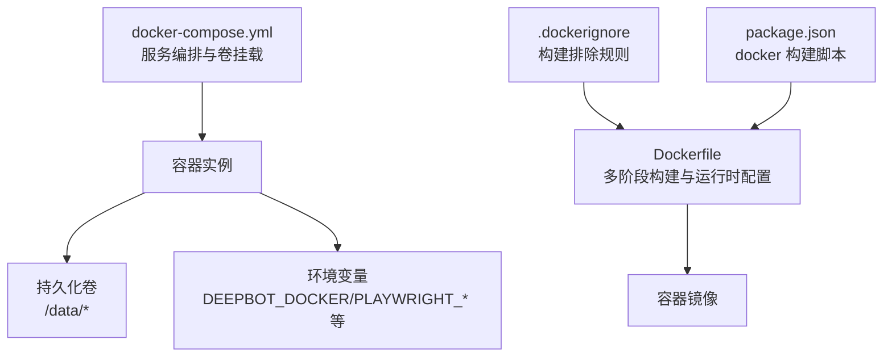
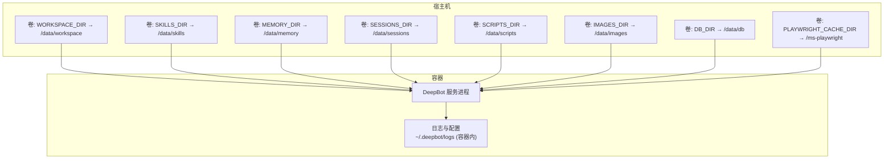
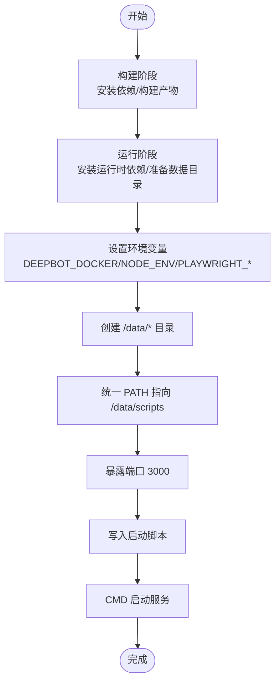
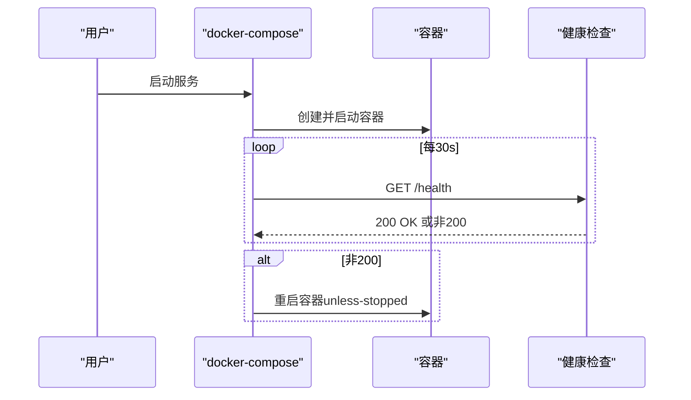
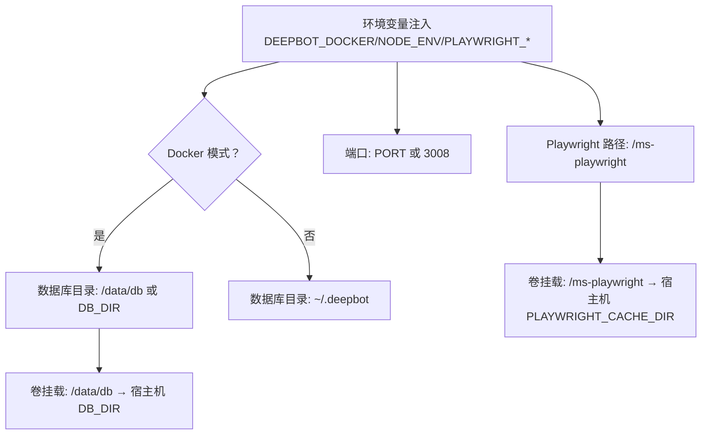
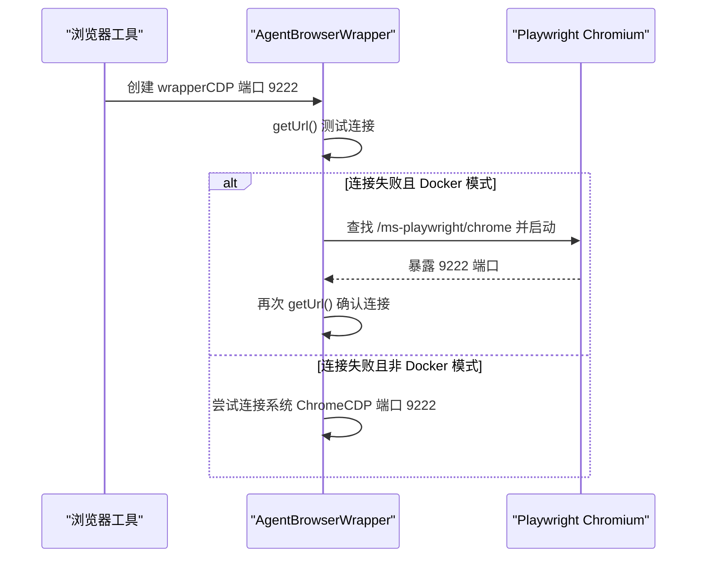
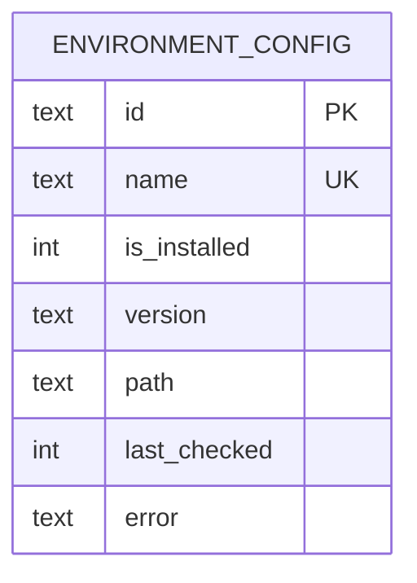
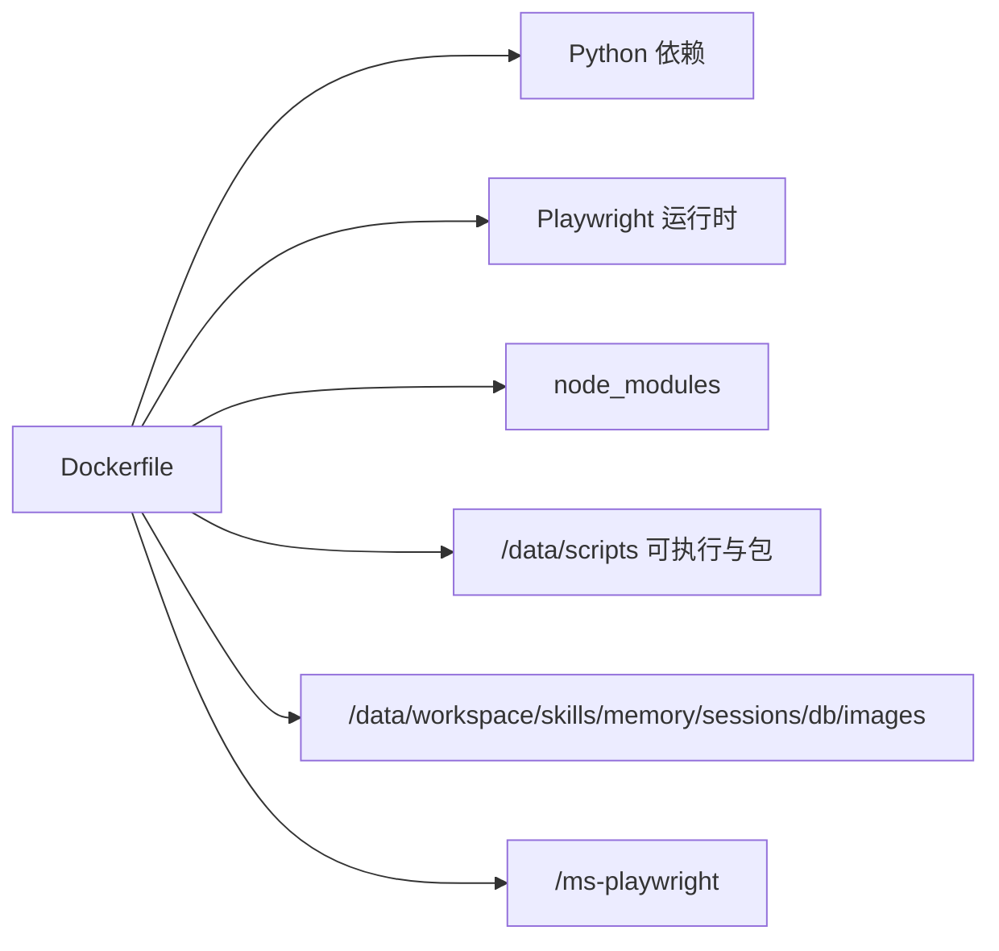

# Docker 部署

<cite>
**本文引用的文件**
- [Dockerfile](file://Dockerfile)
- [docker-compose.yml](file://docker-compose.yml)
- [.dockerignore](file://.dockerignore)
- [package.json](file://package.json)
- [src/shared/utils/docker-utils.ts](file://src/shared/utils/docker-utils.ts)
- [src/main/tools/browser-tool.ts](file://src/main/tools/browser-tool.ts)
- [src/main/browser/agent-browser-wrapper.ts](file://src/main/browser/agent-browser-wrapper.ts)
- [src/shared/utils/logger.ts](file://src/shared/utils/logger.ts)
- [src/main/database/system-config-store.ts](file://src/main/database/system-config-store.ts)
- [src/main/database/environment-config.ts](file://src/main/database/environment-config.ts)
- [src/main/tools/shell-env.ts](file://src/main/tools/shell-env.ts)
- [src/main/config/timeouts.ts](file://src/main/config/timeouts.ts)
</cite>

## 目录
1. [简介](#简介)
2. [项目结构](#项目结构)
3. [核心组件](#核心组件)
4. [架构总览](#架构总览)
5. [详细组件分析](#详细组件分析)
6. [依赖关系分析](#依赖关系分析)
7. [性能考虑](#性能考虑)
8. [故障排除指南](#故障排除指南)
9. [结论](#结论)
10. [附录](#附录)

## 简介
本指南面向希望以 Docker 方式部署 DeepBot 的用户，系统讲解镜像构建流程（含多阶段与缓存优化）、Compose 服务编排（网络、卷、环境变量）、不同部署场景（单容器与多服务）、容器环境变量与数据持久化策略，并提供最佳实践、性能优化建议以及容器监控、日志与故障排除方法。

## 项目结构
与 Docker 部署直接相关的关键文件如下：
- Dockerfile：定义多阶段构建、运行时依赖、环境变量与启动脚本
- docker-compose.yml：服务编排、端口映射、卷挂载、健康检查与环境变量来源
- .dockerignore：构建阶段排除不必要的文件，加速构建
- package.json：包含 docker 构建与运维脚本，便于本地验证
- 运行时配置与持久化相关模块：docker-utils、browser-tool、agent-browser-wrapper、logger、system-config-store、environment-config、shell-env、timeouts

**图表来源**
- [Dockerfile:1-122](file://Dockerfile#L1-L122)
- [docker-compose.yml:1-65](file://docker-compose.yml#L1-L65)
- [.dockerignore:1-52](file://.dockerignore#L1-L52)
- [package.json:1-235](file://package.json#L1-L235)

**章节来源**
- [Dockerfile:1-122](file://Dockerfile#L1-L122)
- [docker-compose.yml:1-65](file://docker-compose.yml#L1-L65)
- [.dockerignore:1-52](file://.dockerignore#L1-L52)
- [package.json:1-235](file://package.json#L1-L235)

## 核心组件
- 多阶段构建镜像
  - 构建阶段：安装 pnpm、按需剔除 Electron 重建依赖、使用 BuildKit 缓存加速、构建 Web 与服务端产物、仅安装生产依赖并 mock Electron
  - 运行阶段：安装 Python 3、pip、虚拟环境与 Playwright 运行时依赖；准备 /data/* 数据目录；设置 DEEPBOT_DOCKER、NODE_ENV、PLAYWRIGHT_BROWSERS_PATH 等环境变量；统一 PATH 指向 /data/scripts；暴露 3000 端口；提供启动脚本
- Compose 服务
  - 端口映射：默认 3008→3008，可通过环境变量覆盖
  - 环境变量：固定注入 DEEPBOT_DOCKER 与 PLAYWRIGHT_BROWSERS_PATH；从 .env 注入用户配置（如 API Key、密码、端口等）
  - 卷挂载：工作区、Skill、记忆、会话、脚本、图片、数据库、Playwright 缓存等，均指向 /data/* 并可由宿主机路径覆盖
  - 健康检查：对 /health 发起 HTTP 请求进行探活
- 运行时配置与持久化
  - Docker 模式下数据库目录默认 /data/db，可通过 DB_DIR 覆盖
  - Playwright 浏览器二进制与缓存持久化至 /ms-playwright，避免重复下载
  - Python 与 npm 全局包安装路径统一指向 /data/scripts，确保重启后仍可用

**章节来源**
- [Dockerfile:49-122](file://Dockerfile#L49-L122)
- [docker-compose.yml:13-65](file://docker-compose.yml#L13-L65)
- [src/shared/utils/docker-utils.ts:1-25](file://src/shared/utils/docker-utils.ts#L1-L25)
- [src/main/database/system-config-store.ts:41-94](file://src/main/database/system-config-store.ts#L41-L94)

## 架构总览
Docker 部署采用“单容器服务”模式，容器内运行 DeepBot Web 服务与浏览器自动化能力（Playwright）。Compose 通过卷挂载实现数据持久化，通过环境变量与 .env 文件注入用户配置。

**图表来源**
- [docker-compose.yml:27-55](file://docker-compose.yml#L27-L55)
- [Dockerfile:91-110](file://Dockerfile#L91-L110)

**章节来源**
- [docker-compose.yml:1-65](file://docker-compose.yml#L1-L65)
- [Dockerfile:1-122](file://Dockerfile#L1-L122)

## 详细组件分析

### Dockerfile 多阶段构建策略
- 构建阶段（builder）
  - 基于 node:22-bookworm-slim，安装 git，配置 pnpm 源，使用 BuildKit cache mount 提升依赖安装速度
  - 剔除 @electron/rebuild 与 electron-rebuild，避免 Electron 相关依赖
  - 执行 pnpm run build:web 产出前端与服务端产物
  - 仅安装生产依赖到临时目录并 mock Electron，减小镜像体积
- 运行阶段
  - 安装 Python 3、pip、虚拟环境与 Playwright 运行时依赖
  - 复制构建产物与生产依赖，修正 agent-browser 二进制权限
  - 创建 /data/* 目录，设置 DEEPBOT_DOCKER、NODE_ENV、PLAYWRIGHT_BROWSERS_PATH 等环境变量
  - 配置统一 PATH 指向 /data/scripts，使 Python 与 npm 全局包可执行
  - 暴露 3000 端口，提供启动脚本并以 CMD 启动服务

**图表来源**
- [Dockerfile:4-48](file://Dockerfile#L4-L48)
- [Dockerfile:49-122](file://Dockerfile#L49-L122)

**章节来源**
- [Dockerfile:1-122](file://Dockerfile#L1-L122)

### docker-compose.yml 服务编排
- 服务名：deepbot
- 镜像来源：基于 Dockerfile 构建，支持多架构平台（注释中给出 buildx 平台参数）
- 端口映射：默认 3008→3008，可通过 PORT 覆盖
- 环境变量：
  - 固定注入 DEEPBOT_DOCKER=true 与 PLAYWRIGHT_BROWSERS_PATH=/ms-playwright
  - 从 .env 注入用户配置（API Key、密码、端口等）
- 卷挂载（全部映射到 /data/*）：
  - 工作目录：/data/workspace
  - Skill 目录：/data/skills
  - 记忆目录：/data/memory
  - 会话目录：/data/sessions
  - 脚本目录：/data/scripts
  - 图片目录：/data/images
  - 数据库目录：/data/db
  - Playwright 缓存：/ms-playwright
- 重启策略：unless-stopped
- 健康检查：对 /health 发起 HTTP 请求，间隔 30s，超时 10s，重试 3 次，启动期 15s

**图表来源**
- [docker-compose.yml:58-65](file://docker-compose.yml#L58-L65)

**章节来源**
- [docker-compose.yml:1-65](file://docker-compose.yml#L1-L65)

### 容器环境变量与数据持久化
- 环境变量
  - DEEPBOT_DOCKER=true：用于识别 Docker 模式，影响数据库目录与行为
  - NODE_ENV=production：生产模式
  - PLAYWRIGHT_BROWSERS_PATH=/ms-playwright：Playwright Chromium 二进制与缓存路径
  - DB_DIR：数据库目录（默认 /data/db），可由宿主机覆盖
  - PORT：服务端口（默认 3008），可由宿主机覆盖
  - 其他敏感配置通过 .env 注入（如 API Key、密码等）
- 数据持久化
  - /data/workspace：工作区（AI 文件操作根目录）
  - /data/skills：Skill 安装目录
  - /data/memory：记忆文件目录
  - /data/sessions：对话历史目录
  - /data/scripts：脚本与 Python/npm 全局包安装目录
  - /data/images：图片生成目录
  - /data/db：SQLite 数据库目录
  - /ms-playwright：Playwright Chromium 二进制与缓存

**图表来源**
- [Dockerfile:94-107](file://Dockerfile#L94-L107)
- [docker-compose.yml:16-55](file://docker-compose.yml#L16-L55)
- [src/shared/utils/docker-utils.ts:14-24](file://src/shared/utils/docker-utils.ts#L14-L24)

**章节来源**
- [Dockerfile:94-107](file://Dockerfile#L94-L107)
- [docker-compose.yml:16-55](file://docker-compose.yml#L16-L55)
- [src/shared/utils/docker-utils.ts:1-25](file://src/shared/utils/docker-utils.ts#L1-L25)

### 浏览器自动化（Playwright）在容器中的行为
- Docker 模式：强制使用 Headless Chromium（Playwright），通过远程调试端口 9222 暴露
- 若未检测到 CDP 连接，则自动启动 Chromium 可执行文件（位于 /ms-playwright），并等待连接成功
- 非 Docker 模式：尝试连接系统 Chrome（CDP 端口 9222）

**图表来源**
- [src/main/tools/browser-tool.ts:212-303](file://src/main/tools/browser-tool.ts#L212-L303)
- [src/main/browser/agent-browser-wrapper.ts:70-116](file://src/main/browser/agent-browser-wrapper.ts#L70-L116)

**章节来源**
- [src/main/tools/browser-tool.ts:212-303](file://src/main/tools/browser-tool.ts#L212-L303)
- [src/main/browser/agent-browser-wrapper.ts:1-116](file://src/main/browser/agent-browser-wrapper.ts#L1-L116)

### 数据库与配置持久化
- 系统配置存储
  - Docker 模式：默认 /data/db/system-config.db，可通过 DB_DIR 覆盖
  - 非 Docker 模式：默认 ~/.deepbot/system-config.db
- 环境配置
  - 通过 environment_config 表存储环境工具链（如 Python、Node 等）的安装状态、版本、路径与最后检查时间
- Shell 环境变量回退
  - 从 shell 配置文件提取 export 变量（排除 PATH），并在 Skill 的 .env 优先级最高

**图表来源**
- [src/main/database/environment-config.ts:1-79](file://src/main/database/environment-config.ts#L1-L79)
- [src/main/database/system-config-store.ts:82-94](file://src/main/database/system-config-store.ts#L82-L94)

**章节来源**
- [src/main/database/system-config-store.ts:41-94](file://src/main/database/system-config-store.ts#L41-L94)
- [src/main/database/environment-config.ts:1-79](file://src/main/database/environment-config.ts#L1-L79)
- [src/main/tools/shell-env.ts:47-125](file://src/main/tools/shell-env.ts#L47-L125)

### 日志与错误处理
- 日志工具
  - 控制台输出带模块前缀，支持 DEBUG/INFO/WARN/ERROR 级别
  - 可选启用文件日志（默认不启用），文件位于 ~/.deepbot/logs/deepbot.log
  - 安全写入控制台，忽略 EPIPE（管道关闭）错误
- 建议
  - 在容器中启用文件日志以便持久化查看
  - 结合 Compose 日志输出与卷挂载，将日志目录映射到宿主机

**章节来源**
- [src/shared/utils/logger.ts:1-176](file://src/shared/utils/logger.ts#L1-L176)

## 依赖关系分析
- 构建与运行时依赖
  - 构建阶段：pnpm、git、Node.js 22
  - 运行阶段：Python 3、pip、虚拟环境、Playwright 运行时依赖
- 容器内二进制与可执行
  - Playwright Chromium 可执行文件位于 /ms-playwright
  - agent-browser 二进制权限在构建阶段修正
- 环境变量与路径
  - PATH 统一包含 /data/scripts 与 /data/scripts/npm-global/bin
  - PYTHONUSERBASE 与 NPM_CONFIG_PREFIX 指向 /data/scripts，确保可执行与包持久化

**图表来源**
- [Dockerfile:52-107](file://Dockerfile#L52-L107)

**章节来源**
- [Dockerfile:52-107](file://Dockerfile#L52-L107)

## 性能考虑
- 构建性能
  - 使用 BuildKit cache mount（/root/.local/share/pnpm/store）提升依赖安装速度
  - 剔除 Electron 重建相关依赖，缩小镜像与构建时间
  - 仅复制生产依赖到最终镜像，减少体积
- 运行性能
  - Playwright Chromium 二进制与缓存持久化至 /ms-playwright，避免重复下载
  - 统一 PATH 指向 /data/scripts，减少查找开销
  - 合理设置超时（TIMEOUTS）与长任务阈值，避免阻塞
- 资源与稳定性
  - 健康检查定期探测 /health，异常自动重启（unless-stopped）
  - 建议在宿主机上为 /data/* 卷挂载使用高性能磁盘与足够空间

**章节来源**
- [Dockerfile:29-47](file://Dockerfile#L29-L47)
- [src/main/config/timeouts.ts:1-77](file://src/main/config/timeouts.ts#L1-L77)
- [docker-compose.yml:58-65](file://docker-compose.yml#L58-L65)

## 故障排除指南
- 容器无法访问 /health
  - 检查 PORT 环境变量与端口映射是否一致
  - 查看容器日志：docker-compose logs -f
- Playwright 无法启动或找不到 Chromium
  - 确认 /ms-playwright 卷已正确挂载
  - 在容器内执行 find /ms-playwright -name "chrome" 验证二进制是否存在
  - 首次启动时等待容器自动安装 Chromium（约 15s）
- 数据丢失或权限问题
  - 确认 /data/* 卷映射到宿主机的绝对路径（避免 ~ 展开问题）
  - 检查宿主机目录权限，确保容器用户可读写
- 日志未落盘
  - 在容器内启用文件日志（Logger.setFileLogging(true)），或在宿主机挂载日志目录
  - 查看 ~/.deepbot/logs/deepbot.log（容器内路径）

**章节来源**
- [docker-compose.yml:13-14](file://docker-compose.yml#L13-L14)
- [docker-compose.yml:58-65](file://docker-compose.yml#L58-L65)
- [Dockerfile:91-107](file://Dockerfile#L91-L107)
- [src/shared/utils/logger.ts:24-49](file://src/shared/utils/logger.ts#L24-L49)

## 结论
通过多阶段构建与运行时依赖精简、卷挂载与环境变量统一管理，DeepBot 的 Docker 部署实现了可复现、可扩展与易维护的目标。结合健康检查、日志与持久化策略，可在生产环境中稳定运行并快速定位问题。

## 附录

### 不同部署场景示例
- 单容器部署（推荐入门/演示）
  - 使用 docker-compose.yml 的默认配置，仅启动 deepbot 服务
  - 通过 .env 注入必要配置（如端口、API Key 等）
- 多服务架构（高级）
  - 可在 Compose 中新增数据库服务（如 PostgreSQL/MySQL）与反向代理（Nginx/Traefik）
  - 将 /data/db 挂载替换为外部数据库连接（调整 DB_DIR 与连接字符串）
  - 将 /data/scripts 与 /ms-playwright 持久化到共享存储，实现多节点部署

### 最佳实践清单
- 构建
  - 使用 BuildKit cache mount，避免重复下载依赖
  - 保持 .dockerignore 排除无关文件，缩短构建时间
- 运行
  - 为 /data/* 卷使用独立磁盘分区，预留充足空间
  - 为 /ms-playwright 与 /data/scripts 卷开启备份策略
  - 通过 .env 管理敏感配置，避免硬编码
- 监控与日志
  - 启用健康检查与容器日志输出
  - 将日志目录映射到宿主机，定期归档与轮转
- 安全
  - 限制容器权限，仅开放必要端口
  - 定期更新基础镜像与依赖，修补漏洞