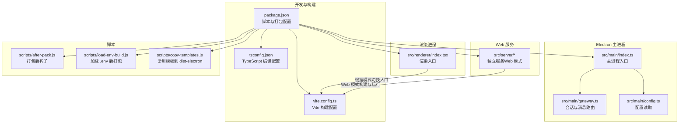
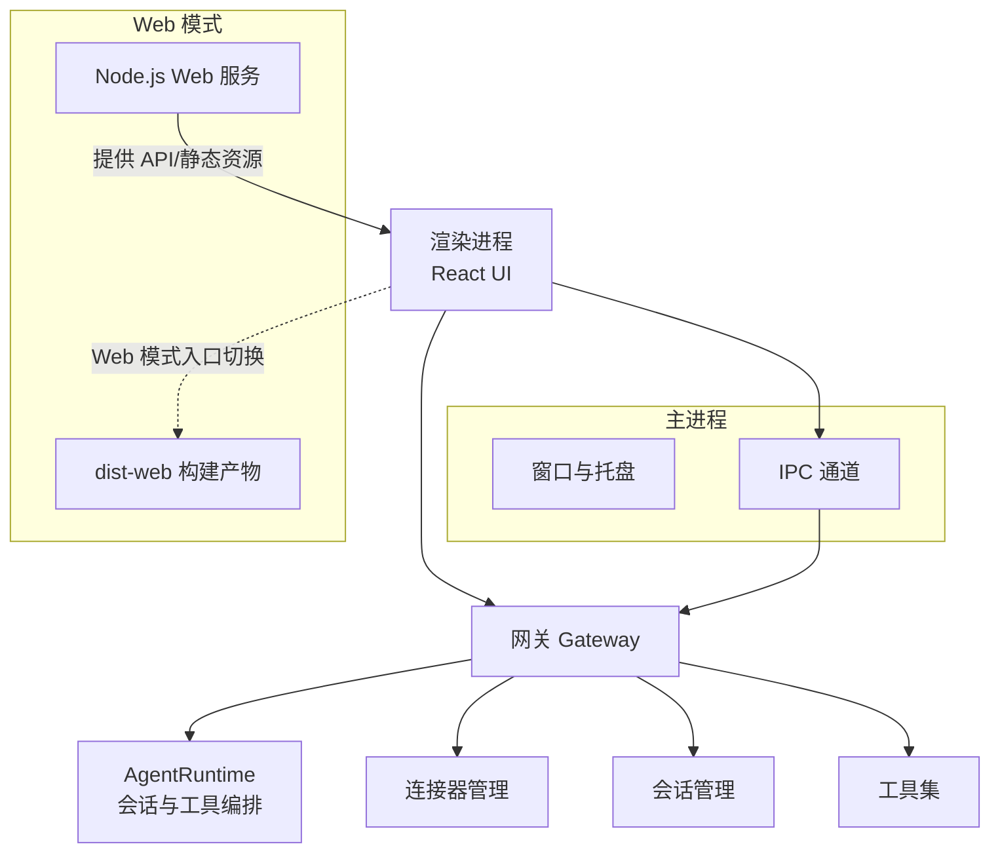
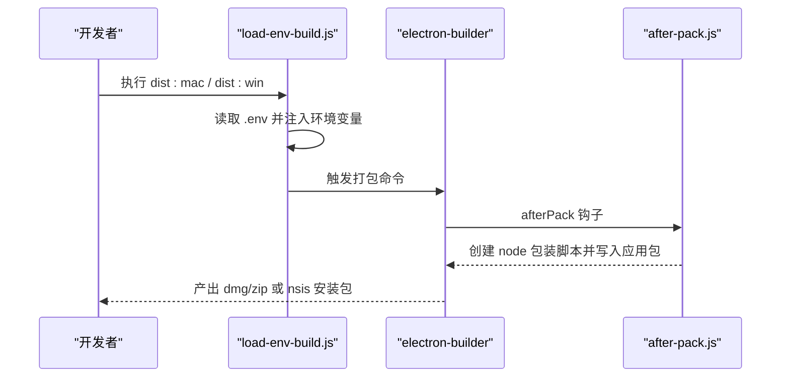
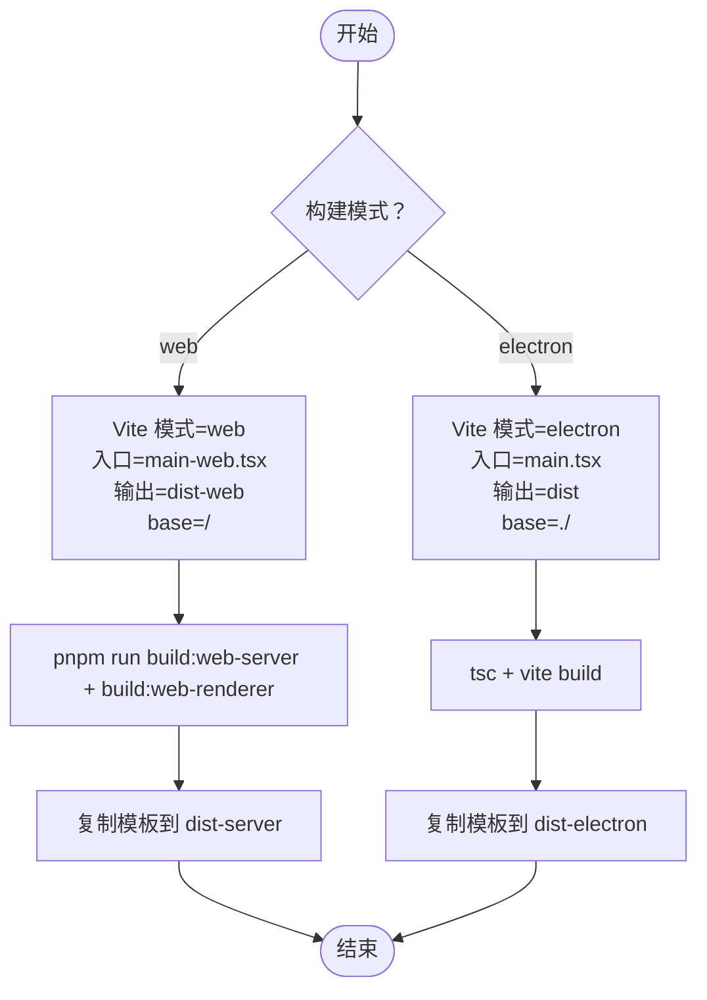
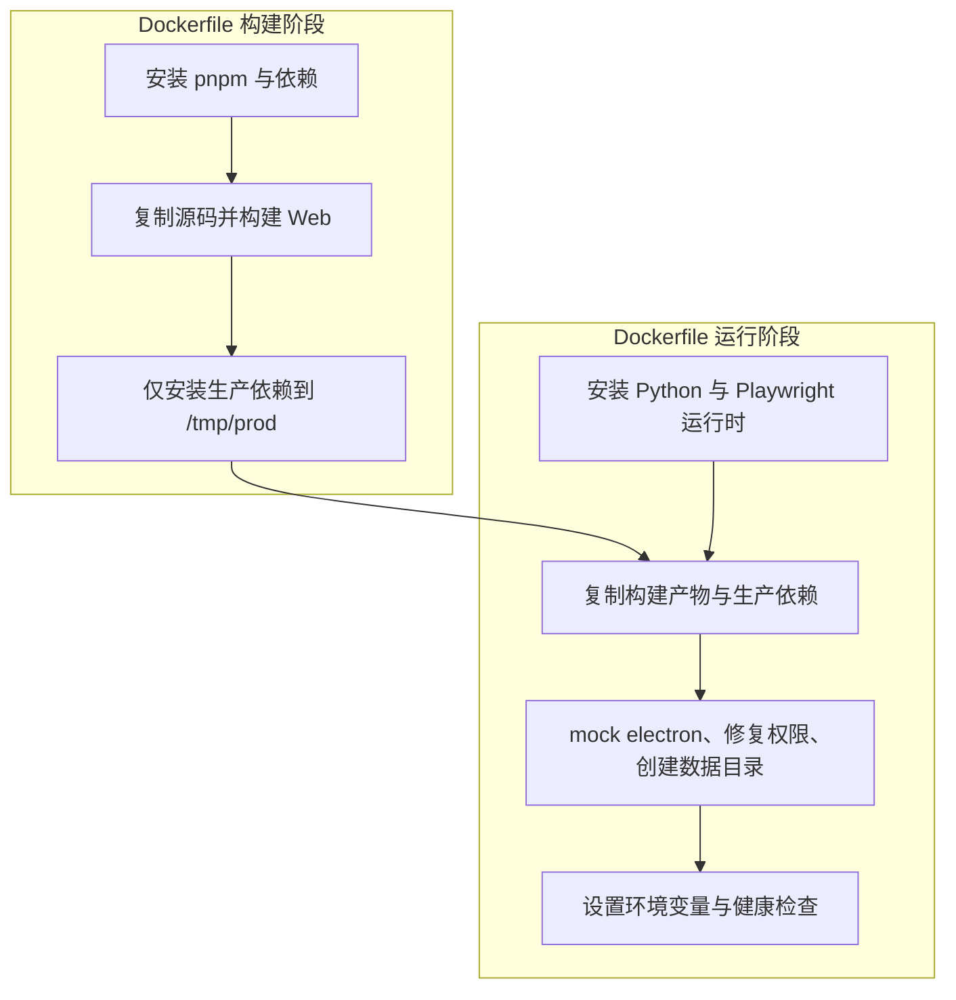
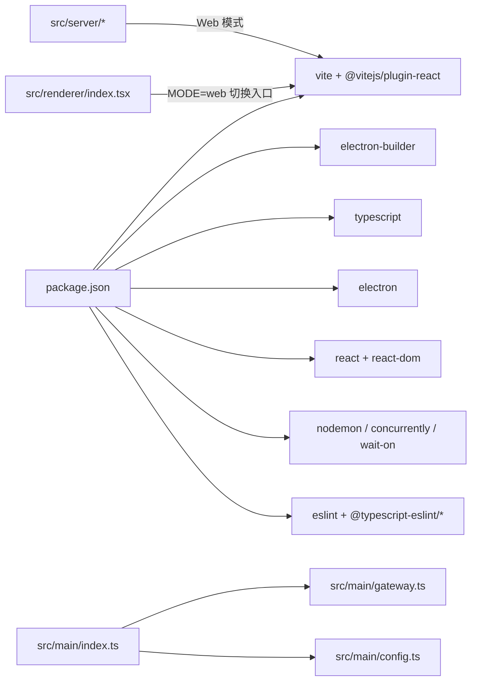

# 开发和部署

<cite>
**本文引用的文件**
- [package.json](file://package.json)
- [Dockerfile](file://Dockerfile)
- [docker-compose.yml](file://docker-compose.yml)
- [vite.config.ts](file://vite.config.ts)
- [tsconfig.json](file://tsconfig.json)
- [scripts/after-pack.js](file://scripts/after-pack.js)
- [scripts/load-env-build.js](file://scripts/load-env-build.js)
- [scripts/copy-templates.js](file://scripts/copy-templates.js)
- [src/main/index.ts](file://src/main/index.ts)
- [src/renderer/index.tsx](file://src/renderer/index.tsx)
- [src/main/config.ts](file://src/main/config.ts)
- [src/shared/config/default-configs.ts](file://src/shared/config/default-configs.ts)
- [src/main/gateway.ts](file://src/main/gateway.ts)
- [README.md](file://README.md)
</cite>

## 目录
1. [简介](#简介)
2. [项目结构](#项目结构)
3. [核心组件](#核心组件)
4. [架构总览](#架构总览)
5. [详细组件分析](#详细组件分析)
6. [依赖关系分析](#依赖关系分析)
7. [性能考虑](#性能考虑)
8. [故障排查指南](#故障排查指南)
9. [结论](#结论)
10. [附录](#附录)

## 简介
本指南面向 DeepBot 的开发者与运维人员，覆盖开发环境搭建、依赖安装、开发脚本配置；构建与打包流程（含 Electron 打包配置与 Web 构建流程）；Docker 部署的完整步骤（镜像构建与容器编排）；不同平台的部署策略与优化建议；调试与性能监控方法；以及贡献指南与代码规范。文档以仓库实际文件为依据，提供可追溯的来源标注与可视化图示。

## 项目结构
项目采用 Electron + React 前端 + Node.js 服务端的混合架构，同时提供 Web 模式构建与运行能力。关键目录与职责概览：
- src/main：Electron 主进程入口与核心逻辑（窗口、IPC、网关、会话、工具等）
- src/renderer：React 前端入口与组件
- src/server：独立的 Node.js Web 服务（用于 Docker/Web 模式）
- scripts：打包、签名、模板复制等构建辅助脚本
- 配置文件：package.json（脚本与打包）、vite.config.ts（Vite 构建）、tsconfig.json（TypeScript 编译）

**图表来源**
- [package.json:1-235](file://package.json#L1-L235)
- [vite.config.ts:1-63](file://vite.config.ts#L1-L63)
- [tsconfig.json:1-23](file://tsconfig.json#L1-L23)
- [src/main/index.ts:1-800](file://src/main/index.ts#L1-L800)
- [src/renderer/index.tsx:1-21](file://src/renderer/index.tsx#L1-L21)
- [src/main/gateway.ts:1-200](file://src/main/gateway.ts#L1-L200)
- [scripts/after-pack.js:1-46](file://scripts/after-pack.js#L1-L46)
- [scripts/load-env-build.js:1-39](file://scripts/load-env-build.js#L1-L39)
- [scripts/copy-templates.js:1-72](file://scripts/copy-templates.js#L1-L72)

**章节来源**
- [package.json:9-44](file://package.json#L9-L44)
- [vite.config.ts:5-61](file://vite.config.ts#L5-L61)
- [tsconfig.json:1-23](file://tsconfig.json#L1-L23)
- [README.md:37-98](file://README.md#L37-L98)

## 核心组件
- Electron 主进程入口与窗口管理：负责创建窗口、系统托盘、拦截导航、IPC 注册、加载 Gateway 等。
- 渲染入口：根据构建模式（Electron 或 Web）选择不同的入口组件。
- 网关（Gateway）：会话管理、消息路由、连接器管理、定时任务集成等。
- 配置系统：优先从数据库读取，其次从环境变量读取，缺失则抛错提示。
- 构建与打包：Vite（Electron/Web 模式）、TypeScript 编译、electron-builder、辅助脚本。

**章节来源**
- [src/main/index.ts:119-331](file://src/main/index.ts#L119-L331)
- [src/renderer/index.tsx:15-21](file://src/renderer/index.tsx#L15-L21)
- [src/main/gateway.ts:29-114](file://src/main/gateway.ts#L29-L114)
- [src/main/config.ts:38-107](file://src/main/config.ts#L38-L107)

## 架构总览
DeepBot 采用“主进程 + 渲染进程 + 网关 + 工具集”的分层架构。主进程负责窗口与系统交互，网关负责会话与消息路由，渲染进程承载 UI 与用户交互，工具集提供文件、命令、浏览器、图片生成、Web 搜索等能力。Web 模式下，独立的 Node.js 服务提供 API 与静态资源。

**图表来源**
- [src/main/index.ts:307-331](file://src/main/index.ts#L307-L331)
- [src/main/gateway.ts:29-114](file://src/main/gateway.ts#L29-L114)
- [src/renderer/index.tsx:15-21](file://src/renderer/index.tsx#L15-L21)
- [vite.config.ts:12-24](file://vite.config.ts#L12-L24)

## 详细组件分析

### 开发环境与依赖安装
- 环境要求：Node.js 20+、Python 3.11+、pnpm 10.23.0+（可选）
- 安装依赖：使用 pnpm 安装，自动处理 electron-builder 安装依赖
- 开发启动：一键并发启动渲染、主进程、模板复制与 Electron 启动

**章节来源**
- [README.md:39-58](file://README.md#L39-L58)
- [package.json:22](file://package.json#L22)
- [package.json:10](file://package.json#L10)

### 开发脚本与构建流程
- 开发脚本
  - dev：并发启动渲染、主进程、模板复制，并等待 Vite 启动后启动 Electron
  - dev:main/dev:renderer：分别监听主进程/渲染进程 TypeScript
  - copy:templates：复制 Markdown 模板到 dist-electron
  - start:electron：开发时指定 VITE_DEV_SERVER_URL 启动 Electron
- 构建脚本
  - build：先编译主进程，再复制模板，最后构建渲染
  - build:main/build:renderer：分别编译主进程与渲染
  - build:web/build:web-server/build:web-renderer：Web 模式构建
  - type-check/lint：类型检查与 ESLint
- Web 模式
  - dev:web/dev:web-docker：开发模式（本地/容器）
  - build:web：构建 Web 服务与前端
  - start:web：启动 Web 服务

**章节来源**
- [package.json:9-44](file://package.json#L9-L44)
- [scripts/copy-templates.js:1-72](file://scripts/copy-templates.js#L1-L72)
- [vite.config.ts:5-61](file://vite.config.ts#L5-L61)

### Electron 打包配置与签名
- electron-builder 配置
  - appId/productName/icon/publish
  - asar 关闭、文件包含规则、压缩等级
  - mac/win 目标与架构、签名与公证（macOS）、NSIS 安装器选项
  - electronDownload 镜像与缓存
- 打包钩子
  - afterPack：在签名前创建 node 包装脚本，确保其被签名范围覆盖
  - afterSign：签名后执行（脚本文件存在）
- 加载 .env 后打包
  - load-env-build：在执行打包前读取 .env，保证 Apple 公证所需变量可用
  - Windows：额外下载 node.exe 并参与打包

**图表来源**
- [scripts/load-env-build.js:1-39](file://scripts/load-env-build.js#L1-L39)
- [scripts/after-pack.js:10-45](file://scripts/after-pack.js#L10-L45)
- [package.json:112-233](file://package.json#L112-L233)

**章节来源**
- [scripts/after-pack.js:10-45](file://scripts/after-pack.js#L10-L45)
- [scripts/load-env-build.js:10-39](file://scripts/load-env-build.js#L10-L39)
- [package.json:112-233](file://package.json#L112-L233)

### Web 构建流程
- Vite 模式切换
  - mode=web：入口替换为 main-web.tsx，输出到 dist-web，base 设为“/”
  - Electron 模式：入口为 main.tsx，输出到 dist，base 设为“./”
- 构建命令
  - build:web：编译 server 与渲染，复制模板到 dist-server
  - dev:web：监听 server 与渲染，使用 nodemon 监控 dist-server
- 环境变量
  - Web 模式下定义 IS_WEB 标记，便于前端判断

**图表来源**
- [vite.config.ts:5-61](file://vite.config.ts#L5-L61)
- [package.json:35-37](file://package.json#L35-L37)
- [scripts/copy-templates.js:10-71](file://scripts/copy-templates.js#L10-L71)

**章节来源**
- [vite.config.ts:5-61](file://vite.config.ts#L5-L61)
- [package.json:35-37](file://package.json#L35-L37)
- [scripts/copy-templates.js:10-71](file://scripts/copy-templates.js#L10-L71)

### Docker 部署指南
- 镜像构建
  - 多阶段构建：builder 阶段安装 pnpm、构建 Web 服务与前端；运行阶段安装 Python 与 Playwright 运行时依赖
  - 仅安装生产依赖，复制 dist-server、dist-web、生产依赖与提示模板
  - Docker 环境下 mock electron，修复 agent-browser 二进制权限
- 容器编排
  - docker-compose：端口映射、环境变量（DEEPBOT_DOCKER、PLAYWRIGHT_BROWSERS_PATH）、数据卷挂载（工作区、技能、记忆、会话、脚本、图片、数据库、Playwright 缓存）
  - 健康检查：基于 /health 接口
- 运行
  - CMD 启动脚本执行 node dist-server/server/index.js
  - 端口 3000（可在 .env 中调整）

**图表来源**
- [Dockerfile:4-122](file://Dockerfile#L4-L122)
- [docker-compose.yml:1-65](file://docker-compose.yml#L1-L65)

**章节来源**
- [Dockerfile:4-122](file://Dockerfile#L4-L122)
- [docker-compose.yml:16-65](file://docker-compose.yml#L16-L65)
- [README.md:73-98](file://README.md#L73-L98)

### 不同平台的部署策略与优化建议
- macOS
  - 使用 hardenedRuntime 与公证配置；afterPack 创建 node 包装脚本并纳入签名范围
  - 本地开发可使用空 identity 与禁用公证进行快速测试
- Windows
  - NSIS 安装器配置：可更改安装目录、桌面/开始菜单快捷方式、语言等
  - 打包前下载 node.exe 参与安装包
- Linux/Docker
  - 使用 docker-compose 管理服务与数据卷；Playwright 浏览器缓存持久化
  - 健康检查保障容器状态可观测

**章节来源**
- [package.json:155-232](file://package.json#L155-L232)
- [scripts/load-env-build.js:32-34](file://scripts/load-env-build.js#L32-L34)
- [docker-compose.yml:16-65](file://docker-compose.yml#L16-L65)

### 调试工具与性能监控
- 开发调试
  - 主进程控制台输出：渲染进程 console-message 事件转发至主进程
  - 开发者工具：生产环境仍可通过快捷键打开
  - Web 模式：dev:web 与 dev:web-docker 支持热更新与 nodemon 监控
- 性能监控
  - 建议在生产环境引入性能指标采集（如内存、CPU、请求耗时），结合容器日志与健康检查
  - Web 模式下可利用浏览器开发者工具定位前端性能瓶颈

**章节来源**
- [src/main/index.ts:162-177](file://src/main/index.ts#L162-L177)
- [package.json:29-34](file://package.json#L29-L34)

### 贡献指南与代码规范
- 代码风格与校验
  - ESLint 与 TypeScript 类型检查脚本
- 提交与分支
  - 建议遵循项目既有分支策略与提交规范（如 Conventional Commits）
- 测试与发布
  - 使用 electron-builder 进行多平台打包与发布配置

**章节来源**
- [package.json:21](file://package.json#L21)
- [package.json:112-233](file://package.json#L112-L233)

## 依赖关系分析

**图表来源**
- [package.json:45-107](file://package.json#L45-L107)
- [src/main/index.ts:23-36](file://src/main/index.ts#L23-L36)
- [src/renderer/index.tsx:15-21](file://src/renderer/index.tsx#L15-L21)

**章节来源**
- [package.json:45-107](file://package.json#L45-L107)

## 性能考虑
- 构建优化
  - 使用 pnpm 与缓存（Dockerfile 中使用 BuildKit cache mount）
  - electron-builder 关闭 asar 以提升冷启动与调试体验（按需可开启）
- 运行优化
  - Web 模式下 base 设置为“/”，确保静态资源路径正确
  - Playwright 浏览器缓存持久化，减少重复下载
- 资源隔离
  - 数据卷分离工作区、技能、记忆、会话、脚本、图片与数据库，便于维护与备份

**章节来源**
- [Dockerfile:30-31](file://Dockerfile#L30-L31)
- [package.json:124](file://package.json#L124)
- [vite.config.ts:30](file://vite.config.ts#L30)
- [docker-compose.yml:27-54](file://docker-compose.yml#L27-L54)

## 故障排查指南
- macOS 首次打开安全提示
  - “应用已损坏”：清除 quarantine 属性
  - “无法验证开发者”：右键打开或系统设置中允许
- Windows 安装问题
  - NSIS 安装器可自定义安装目录与快捷方式；若签名失败，检查证书与公证配置
- Docker 启动失败
  - 确认 .env 配置（API Key、端口、路径变量）；检查数据卷挂载路径是否为绝对路径
  - 使用健康检查接口 /health 验证服务状态
- 模板文件缺失
  - 确保执行 copy:templates 或 build:* 后模板复制到 dist-electron

**章节来源**
- [README.md:100-126](file://README.md#L100-L126)
- [package.json:28](file://package.json#L28)
- [docker-compose.yml:59-65](file://docker-compose.yml#L59-L65)
- [scripts/copy-templates.js:34-63](file://scripts/copy-templates.js#L34-L63)

## 结论
本指南基于仓库实际配置与脚本，提供了从开发到部署的全流程实践路径。通过合理使用 Vite、electron-builder、Docker 与 docker-compose，开发者可以在多平台上高效构建与交付 DeepBot。建议在生产环境中结合健康检查、日志采集与数据卷策略，确保稳定性与可维护性。

## 附录
- 默认配置预设：提供多种提供商与模型的默认配置，便于快速上手
- 配置读取优先级：数据库 > 环境变量 > 抛错提示

**章节来源**
- [src/shared/config/default-configs.ts:11-133](file://src/shared/config/default-configs.ts#L11-L133)
- [src/main/config.ts:38-83](file://src/main/config.ts#L38-L83)