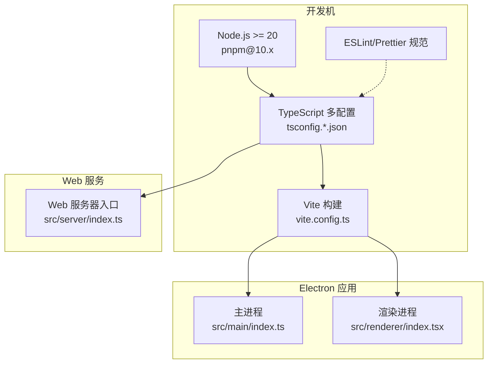
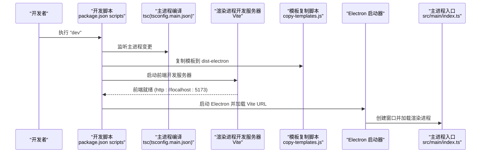
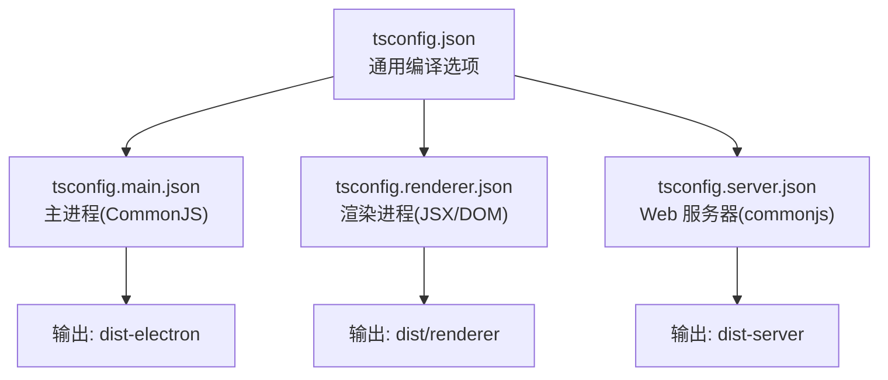
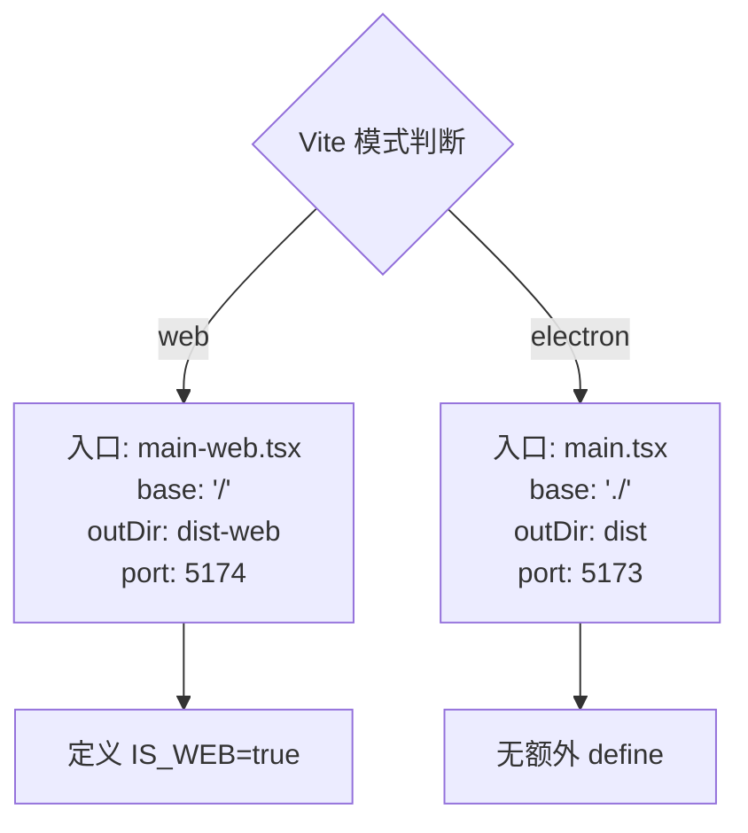
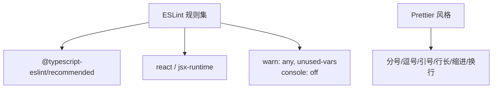
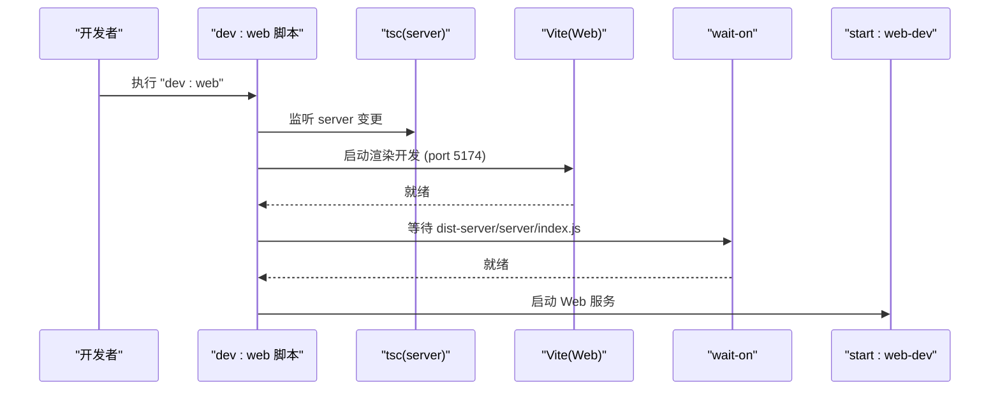
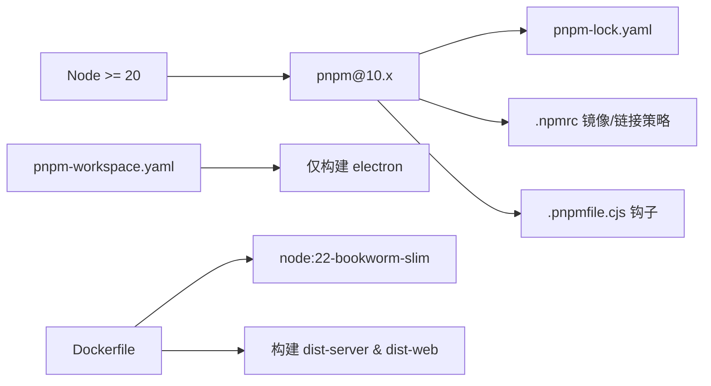

# 开发环境搭建

<cite>
**本文引用的文件**
- [package.json](file://package.json)
- [tsconfig.json](file://tsconfig.json)
- [tsconfig.main.json](file://tsconfig.main.json)
- [tsconfig.renderer.json](file://tsconfig.renderer.json)
- [tsconfig.server.json](file://tsconfig.server.json)
- [vite.config.ts](file://vite.config.ts)
- [.prettierrc.json](file://.prettierrc.json)
- [.eslintrc.json](file://.eslintrc.json)
- [.npmrc](file://.npmrc)
- [.pnpmfile.cjs](file://.pnpmfile.cjs)
- [pnpm-workspace.yaml](file://pnpm-workspace.yaml)
- [postcss.config.js](file://postcss.config.js)
- [tailwind.config.js](file://tailwind.config.js)
- [Dockerfile](file://Dockerfile)
- [scripts/copy-templates.js](file://scripts/copy-templates.js)
- [scripts/load-env-build.js](file://scripts/load-env-build.js)
- [scripts/reset-dev-data.sh](file://scripts/reset-dev-data.sh)
- [src/main/index.ts](file://src/main/index.ts)
- [src/renderer/index.tsx](file://src/renderer/index.tsx)
- [src/server/index.ts](file://src/server/index.ts)
</cite>

## 目录
1. [简介](#简介)
2. [项目结构](#项目结构)
3. [核心组件](#核心组件)
4. [架构总览](#架构总览)
5. [详细组件分析](#详细组件分析)
6. [依赖关系分析](#依赖关系分析)
7. [性能考虑](#性能考虑)
8. [故障排查指南](#故障排查指南)
9. [结论](#结论)
10. [附录](#附录)

## 简介
本指南面向 DeepBot 的开发与维护人员，提供从零搭建开发环境的完整流程，涵盖 Node.js 版本要求（>=20）、包管理器选择（pnpm）、TypeScript 多环境配置、ESLint 与 Prettier 规范、开发脚本与 IDE 建议、以及三种开发模式（主进程、渲染进程、Web 模式）的启动与差异。同时给出常见问题排查与解决方案，帮助快速定位并修复开发过程中的典型问题。

## 项目结构
DeepBot 采用多进程架构：Electron 主进程负责窗口与系统集成；渲染进程承载 React UI；独立的 Web 服务器提供 HTTP/WebSocket API 与静态资源服务。项目通过多份 tsconfig 与 Vite 模式实现主/渲染/Web 三类构建目标，配合脚本完成模板复制、打包与容器化部署。

图表来源
- [package.json:9-44](file://package.json#L9-L44)
- [tsconfig.json:1-23](file://tsconfig.json#L1-L23)
- [vite.config.ts:1-63](file://vite.config.ts#L1-L63)
- [src/main/index.ts:1-800](file://src/main/index.ts#L1-L800)
- [src/renderer/index.tsx:1-21](file://src/renderer/index.tsx#L1-L21)
- [src/server/index.ts:1-156](file://src/server/index.ts#L1-L156)

章节来源
- [package.json:1-235](file://package.json#L1-L235)
- [tsconfig.json:1-23](file://tsconfig.json#L1-L23)
- [vite.config.ts:1-63](file://vite.config.ts#L1-L63)

## 核心组件
- Node.js 与包管理器
  - Node.js 版本要求：>=20.0.0
  - 包管理器：pnpm（版本固定于 packageManager 字段）
- TypeScript 配置
  - 根配置 tsconfig.json 控制通用编译选项
  - 主进程 tsconfig.main.json、渲染进程 tsconfig.renderer.json、Web 服务器 tsconfig.server.json 分别覆盖模块目标、库与类型
- 构建与开发脚本
  - Vite 驱动渲染进程开发与构建
  - 多脚本组合实现主进程监听、模板复制、等待前端、启动 Electron
  - Web 模式通过 Vite 模式切换与自定义入口实现
- 代码规范
  - ESLint：基于 TypeScript/React 推荐规则，开启 @typescript-eslint 插件
  - Prettier：统一缩进、引号、换行等风格
- 其他工具链
  - PostCSS + TailwindCSS：样式管线与主题配置
  - .npmrc：镜像与 node-linker 配置，解决打包与依赖问题
  - .pnpmfile.cjs：允许所有包运行构建脚本
  - pnpm-workspace.yaml：仅构建指定依赖（如 electron）

章节来源
- [package.json:108-111](file://package.json#L108-L111)
- [tsconfig.json:1-23](file://tsconfig.json#L1-L23)
- [tsconfig.main.json:1-17](file://tsconfig.main.json#L1-L17)
- [tsconfig.renderer.json:1-12](file://tsconfig.renderer.json#L1-L12)
- [tsconfig.server.json:1-31](file://tsconfig.server.json#L1-L31)
- [vite.config.ts:1-63](file://vite.config.ts#L1-L63)
- [.eslintrc.json:1-35](file://.eslintrc.json#L1-L35)
- [.prettierrc.json:1-11](file://.prettierrc.json#L1-L11)
- [postcss.config.js:1-7](file://postcss.config.js#L1-L7)
- [tailwind.config.js:1-76](file://tailwind.config.js#L1-L76)
- [.npmrc:1-10](file://.npmrc#L1-L10)
- [.pnpmfile.cjs:1-13](file://.pnpmfile.cjs#L1-L13)
- [pnpm-workspace.yaml:1-3](file://pnpm-workspace.yaml#L1-L3)

## 架构总览
下图展示三种开发模式的启动流程与关键组件交互：

图表来源
- [package.json:9-15](file://package.json#L9-L15)
- [scripts/copy-templates.js:1-72](file://scripts/copy-templates.js#L1-L72)
- [src/main/index.ts:148-159](file://src/main/index.ts#L148-L159)

章节来源
- [package.json:9-15](file://package.json#L9-L15)
- [scripts/copy-templates.js:1-72](file://scripts/copy-templates.js#L1-L72)
- [src/main/index.ts:148-159](file://src/main/index.ts#L148-L159)

## 详细组件分析

### TypeScript 配置详解
- 根配置（tsconfig.json）
  - 目标与模块：ES2022/ESNext，启用声明、映射与 sourceMap
  - 严格模式与类型：strict、esModuleInterop、skipLibCheck、resolveJsonModule
  - 输出目录与根目录：outDir、rootDir 指向 dist 与 src
- 主进程（tsconfig.main.json）
  - CommonJS 目标，lib ES2020，输出至 dist-electron
  - 仅包含主进程与共享类型目录
- 渲染进程（tsconfig.renderer.json）
  - DOM/DOM.Iterable，jsx 使用 react-jsx，输出至 dist/renderer
  - 类型包含 node 与 vite/client
- Web 服务器（tsconfig.server.json）
  - commonjs，ES2022，严格模式，输出至 dist-server
  - 包含 server、main、shared 目录

图表来源
- [tsconfig.json:1-23](file://tsconfig.json#L1-L23)
- [tsconfig.main.json:1-17](file://tsconfig.main.json#L1-L17)
- [tsconfig.renderer.json:1-12](file://tsconfig.renderer.json#L1-L12)
- [tsconfig.server.json:1-31](file://tsconfig.server.json#L1-L31)

章节来源
- [tsconfig.json:1-23](file://tsconfig.json#L1-L23)
- [tsconfig.main.json:1-17](file://tsconfig.main.json#L1-L17)
- [tsconfig.renderer.json:1-12](file://tsconfig.renderer.json#L1-L12)
- [tsconfig.server.json:1-31](file://tsconfig.server.json#L1-L31)

### Vite 与多模式构建
- 模式检测：根据 MODE/web 切换
- 入口替换：Web 模式将 index.html 内的入口替换为 main-web.tsx
- 基础路径：Web 模式使用绝对路径“/”，Electron 使用相对路径“./”
- 输出目录：Web 模式 dist-web，Electron 模式 dist
- 端口：Web 模式 5174，Electron 模式 5173
- 环境变量：Web 模式注入 IS_WEB 标识

图表来源
- [vite.config.ts:5-61](file://vite.config.ts#L5-L61)
- [src/renderer/index.tsx:15-20](file://src/renderer/index.tsx#L15-L20)

章节来源
- [vite.config.ts:1-63](file://vite.config.ts#L1-L63)
- [src/renderer/index.tsx:1-21](file://src/renderer/index.tsx#L1-L21)

### 代码规范：ESLint 与 Prettier
- ESLint
  - 解析器：@typescript-eslint/parser
  - 扩展：eslint:recommended、@typescript-eslint/recommended、react、react/jsx-runtime
  - 环境：browser、node、es2022
  - 规则：对 any 与未使用变量发出警告；允许 console
- Prettier
  - 分号、尾随逗号、单引号、行长、缩进、箭头括号、换行符等统一风格

图表来源
- [.eslintrc.json:1-35](file://.eslintrc.json#L1-L35)
- [.prettierrc.json:1-11](file://.prettierrc.json#L1-L11)

章节来源
- [.eslintrc.json:1-35](file://.eslintrc.json#L1-L35)
- [.prettierrc.json:1-11](file://.prettierrc.json#L1-L11)

### 开发脚本与 IDE 设置建议
- 开发脚本
  - dev：并发启动主进程监听、模板复制、渲染进程开发服务器，等待前端就绪后启动 Electron
  - dev:main/dev:renderer：分别监听主/渲染进程变化
  - dev:web / dev:web-server / dev:web-renderer：Web 模式开发链路
  - build/build:main/build:renderer：构建主/渲染产物
  - type-check / type-check:server：类型检查
  - lint：ESLint 检查
  - reset-dev：重置开发数据脚本
- IDE 建议
  - VS Code：安装 ESLint、Prettier、TailwindCSS IntelliSense、ES7+ React/Redux/React Toolkit
  - 设置 Editor: Format on Save 与 Editor: Default Formatter 为 Prettier
  - 设置 TypeScript 编译器为项目内 tsserver（或使用内置 TS Server）
  - 在工作区设置中启用 ESLint 自动修复与 Prettier 格式化

章节来源
- [package.json:9-44](file://package.json#L9-L44)
- [scripts/reset-dev-data.sh:1-65](file://scripts/reset-dev-data.sh#L1-L65)

### 三种开发模式与启动方式
- 主进程模式（Electron）
  - 启动：dev → tsc 监听主进程 → Vite 渲染开发 → wait-on → Electron 启动
  - 特点：主进程使用 CommonJS，lib ES2020，输出 dist-electron
- 渲染进程模式（React/Vite）
  - 启动：dev:renderer → Vite 开发服务器（端口 5173）
  - 特点：JSX/DOM 类型，输出 dist/renderer
- Web 模式
  - 启动：dev:web → 并发启动 Web 服务器与渲染开发 → wait-on dist-server → 启动 Web
  - 特点：Vite 模式 web，入口 main-web.tsx，输出 dist-web，端口 5174

图表来源
- [package.json:29-34](file://package.json#L29-L34)
- [vite.config.ts:44-48](file://vite.config.ts#L44-L48)
- [src/server/index.ts:68-73](file://src/server/index.ts#L68-L73)

章节来源
- [package.json:9-44](file://package.json#L9-L44)
- [vite.config.ts:1-63](file://vite.config.ts#L1-L63)
- [src/server/index.ts:1-156](file://src/server/index.ts#L1-L156)

## 依赖关系分析
- Node 与 pnpm
  - engines.node >= 20
  - packageManager 固定 pnpm 版本
- .npmrc
  - electron_mirror 与 electron_builder_binaries_mirror 镜像
  - node-linker=hoisted 避免符号链接导致的打包问题
- .pnpmfile.cjs
  - 允许所有包运行构建脚本，便于原生模块编译
- pnpm-workspace.yaml
  - onlyBuiltDependencies: electron，减少不必要的构建与体积
- Dockerfile
  - 使用 node:22-bookworm-slim，pnpm 安装，构建 Web 与渲染产物，运行时安装 Playwright 依赖

图表来源
- [package.json:108-111](file://package.json#L108-L111)
- [.npmrc:1-10](file://.npmrc#L1-L10)
- [.pnpmfile.cjs:1-13](file://.pnpmfile.cjs#L1-L13)
- [pnpm-workspace.yaml:1-3](file://pnpm-workspace.yaml#L1-L3)
- [Dockerfile:1-122](file://Dockerfile#L1-L122)

章节来源
- [package.json:108-111](file://package.json#L108-L111)
- [.npmrc:1-10](file://.npmrc#L1-L10)
- [.pnpmfile.cjs:1-13](file://.pnpmfile.cjs#L1-L13)
- [pnpm-workspace.yaml:1-3](file://pnpm-workspace.yaml#L1-L3)
- [Dockerfile:1-122](file://Dockerfile#L1-L122)

## 性能考虑
- 构建与缓存
  - 使用 pnpm 与缓存目录（.pnpmstore）加速依赖安装
  - Docker 构建阶段使用 BuildKit cache mount 提升安装速度
- 运行时优化
  - Web 模式下静态资源与入口路径使用绝对路径，减少路由与资源解析成本
  - 渲染进程与主进程分离，避免阻塞
- 开发体验
  - Vite 快速热更新与按需编译
  - TypeScript 多配置隔离编译范围，提升增量编译效率

## 故障排查指南
- Node 版本过低
  - 现象：安装依赖时报错或运行时异常
  - 处理：升级 Node 至 >=20.0.0
  - 参考：engines.node
- pnpm 版本不匹配
  - 现象：安装失败或构建产物不一致
  - 处理：使用 packageManager 指定的 pnpm 版本
  - 参考：packageManager
- Electron 打包镜像/签名问题
  - 现象：构建阶段下载缓慢或公证失败
  - 处理：配置 .npmrc 镜像；使用 scripts/load-env-build.js 加载 .env 环境变量后再打包
  - 参考：.npmrc、scripts/load-env-build.js
- 模板文件缺失导致主进程异常
  - 现象：开发或运行时找不到 Prompt 模板
  - 处理：确保 copy-templates.js 成功复制到 dist-electron
  - 参考：scripts/copy-templates.js
- Web 模式静态资源 404
  - 现象：生产模式下访问 / 无法加载前端
  - 处理：确认 dist-server 在生产模式下挂载 dist-web；检查 Vite base 与 outDir
  - 参考：vite.config.ts、src/server/index.ts
- 开发数据残留影响调试
  - 现象：配置/数据库状态异常
  - 处理：执行 reset-dev 脚本清理 ~/.deepbot 下的数据库文件
  - 参考：scripts/reset-dev-data.sh
- ESLint/Prettier 冲突
  - 现象：保存时格式化与 Lint 报错冲突
  - 处理：VS Code 设置中启用 ESLint 自动修复与 Prettier 格式化；保持 .eslintrc.json 与 .prettierrc.json 风格一致
  - 参考：.eslintrc.json、.prettierrc.json

章节来源
- [package.json:108-111](file://package.json#L108-L111)
- [.npmrc:1-10](file://.npmrc#L1-L10)
- [scripts/load-env-build.js:1-39](file://scripts/load-env-build.js#L1-L39)
- [scripts/copy-templates.js:1-72](file://scripts/copy-templates.js#L1-L72)
- [vite.config.ts:28-42](file://vite.config.ts#L28-L42)
- [src/server/index.ts:68-73](file://src/server/index.ts#L68-L73)
- [scripts/reset-dev-data.sh:1-65](file://scripts/reset-dev-data.sh#L1-L65)
- [.eslintrc.json:1-35](file://.eslintrc.json#L1-L35)
- [.prettierrc.json:1-11](file://.prettierrc.json#L1-L11)

## 结论
通过遵循本指南，您可以快速搭建 DeepBot 的开发环境：使用 Node >=20 与 pnpm，结合多份 TypeScript 配置与 Vite 模式，实现主进程、渲染进程与 Web 模式的高效开发与调试；配合 ESLint 与 Prettier 统一代码风格；利用脚本与 Docker 完成自动化构建与部署。遇到问题时，可依据故障排查章节逐项定位并解决。

## 附录
- 常用命令速查
  - 安装依赖：pnpm install
  - 开发（Electron）：pnpm run dev
  - 开发（Web）：pnpm run dev:web
  - 类型检查：pnpm run type-check / type-check:server
  - Lint：pnpm run lint
  - 构建：pnpm run build / build:web
  - 重置开发数据：pnpm run reset-dev
- Docker 相关
  - 构建镜像：pnpm run docker:build
  - 启停服务：pnpm run docker:up / docker:down
  - 查看日志：pnpm run docker:logs