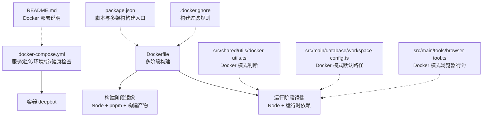
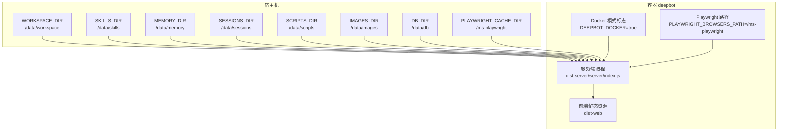
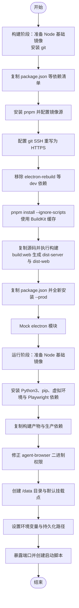
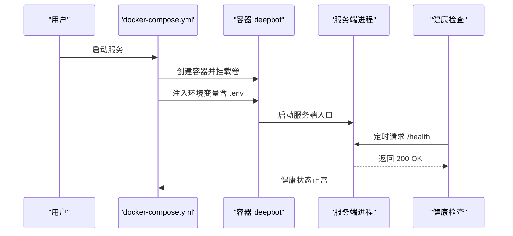
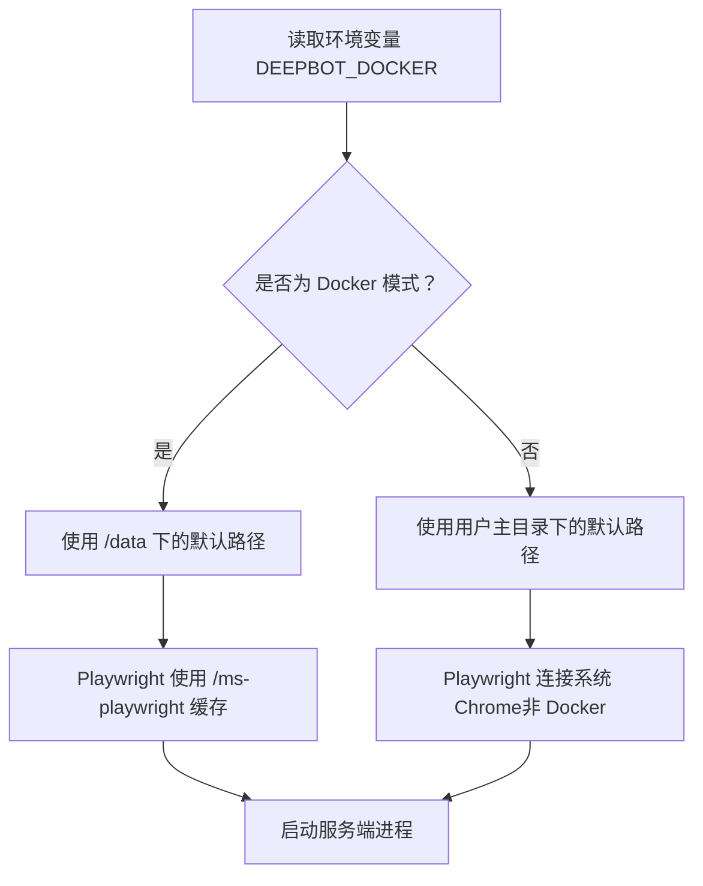
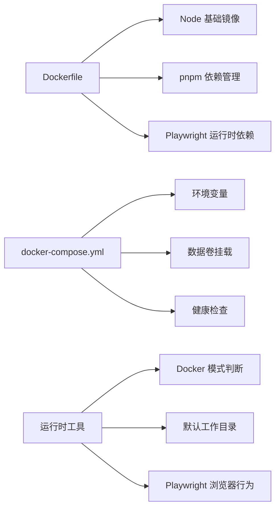

# Docker 构建配置

<cite>
**本文引用的文件**
- [Dockerfile](file://Dockerfile)
- [docker-compose.yml](file://docker-compose.yml)
- [.dockerignore](file://.dockerignore)
- [package.json](file://package.json)
- [README.md](file://README.md)
- [src/shared/utils/docker-utils.ts](file://src/shared/utils/docker-utils.ts)
- [src/main/database/workspace-config.ts](file://src/main/database/workspace-config.ts)
- [src/main/tools/browser-tool.ts](file://src/main/tools/browser-tool.ts)
</cite>

## 目录
1. [简介](#简介)
2. [项目结构](#项目结构)
3. [核心组件](#核心组件)
4. [架构总览](#架构总览)
5. [详细组件分析](#详细组件分析)
6. [依赖分析](#依赖分析)
7. [性能考虑](#性能考虑)
8. [故障排查指南](#故障排查指南)
9. [结论](#结论)
10. [附录](#附录)

## 简介
本指南面向使用 DeepBot 的开发者与运维人员，系统讲解基于 Docker 的容器化部署方案，涵盖多阶段构建流程、镜像优化策略、Compose 服务与网络配置、.dockerignore 过滤规则、容器化优势与适用场景、开发/生产差异化配置、以及完整的构建、运行与调试流程。同时说明环境变量与数据卷挂载的配置要点，帮助您在不同环境中稳定、高效地运行 DeepBot。

## 项目结构
与 Docker 相关的关键文件位于仓库根目录，配合项目内的脚本与工具函数实现容器化运行时的行为差异与数据持久化。

图表来源
- [Dockerfile:1-122](file://Dockerfile#L1-L122)
- [docker-compose.yml:1-65](file://docker-compose.yml#L1-L65)
- [.dockerignore:1-52](file://.dockerignore#L1-L52)
- [package.json:39-43](file://package.json#L39-L43)
- [README.md:73-98](file://README.md#L73-L98)
- [src/shared/utils/docker-utils.ts:1-25](file://src/shared/utils/docker-utils.ts#L1-L25)
- [src/main/database/workspace-config.ts:17-35](file://src/main/database/workspace-config.ts#L17-L35)
- [src/main/tools/browser-tool.ts:212-303](file://src/main/tools/browser-tool.ts#L212-L303)

章节来源
- [Dockerfile:1-122](file://Dockerfile#L1-L122)
- [docker-compose.yml:1-65](file://docker-compose.yml#L1-L65)
- [.dockerignore:1-52](file://.dockerignore#L1-L52)
- [package.json:39-43](file://package.json#L39-L43)
- [README.md:73-98](file://README.md#L73-L98)

## 核心组件
- 多阶段 Dockerfile：构建阶段安装依赖并产出 Web 与服务端产物；运行阶段仅复制必要产物与运行时依赖，最小化镜像体积。
- docker-compose：定义服务、环境变量、数据卷挂载、端口映射与健康检查。
- .dockerignore：排除构建无关与产物目录，加速构建并减少镜像大小。
- 运行时工具：通过环境变量判断 Docker 模式，并据此调整数据库目录、默认工作目录与浏览器启动策略。
- 构建脚本：提供一键构建与多架构构建命令，便于 CI/CD 集成。

章节来源
- [Dockerfile:1-122](file://Dockerfile#L1-L122)
- [docker-compose.yml:1-65](file://docker-compose.yml#L1-L65)
- [.dockerignore:1-52](file://.dockerignore#L1-L52)
- [src/shared/utils/docker-utils.ts:1-25](file://src/shared/utils/docker-utils.ts#L1-L25)
- [src/main/database/workspace-config.ts:17-35](file://src/main/database/workspace-config.ts#L17-L35)
- [src/main/tools/browser-tool.ts:212-303](file://src/main/tools/browser-tool.ts#L212-L303)
- [package.json:39-43](file://package.json#L39-L43)

## 架构总览
Docker 化部署将 Web 服务与前端产物打包到运行镜像，通过数据卷持久化关键目录，使用健康检查保障服务可用性。Compose 通过环境变量与卷挂载实现开发与生产的灵活切换。

图表来源
- [docker-compose.yml:27-54](file://docker-compose.yml#L27-L54)
- [Dockerfile:91-110](file://Dockerfile#L91-L110)
- [src/shared/utils/docker-utils.ts:10-24](file://src/shared/utils/docker-utils.ts#L10-L24)
- [src/main/database/workspace-config.ts:17-35](file://src/main/database/workspace-config.ts#L17-L35)

## 详细组件分析

### 多阶段构建流程与镜像优化
- 构建阶段（builder）
  - 基础镜像：使用 slim 版 Node，安装 git 以便 pnpm 从 SSH 源拉取。
  - 依赖安装：通过 pnpm 安装依赖，并使用 BuildKit cache mount 提升缓存命中率。
  - 产物生成：执行 Web 与服务端构建，生成 dist-server 与 dist-web。
  - 生产依赖剥离：复制 package.json 并全新安装 --prod，避免 devDependencies。
  - Electron Mock：在构建阶段创建空的 electron 模块，避免运行时加载失败。
- 运行阶段
  - 基础镜像：同样使用 slim 版 Node。
  - 运行时依赖：安装 Python 3、pip、虚拟环境与 Playwright Chromium 运行时依赖。
  - 产物复制：仅复制 dist-server、dist-web、生产依赖与必要的提示词资源。
  - 权限修正：赋予 agent-browser 二进制可执行权限。
  - 数据目录：预创建 /data 下的工作目录、技能、记忆、会话、数据库、图片等目录。
  - 环境变量：设置 DEEPBOT_DOCKER、NODE_ENV、PLAYWRIGHT_BROWSERS_PATH 等。
  - Python/NPM 全局包持久化：通过环境变量指向 /data/scripts 下的用户目录，配合卷挂载实现持久化。
  - 端口与启动：暴露 3000，创建启动脚本并以 CMD 启动服务端入口。

图表来源
- [Dockerfile:4-48](file://Dockerfile#L4-L48)
- [Dockerfile:49-122](file://Dockerfile#L49-L122)

章节来源
- [Dockerfile:4-122](file://Dockerfile#L4-L122)

### Docker Compose 服务定义与网络设置
- 服务与镜像
  - 使用本地 Dockerfile 构建镜像，镜像名为 deepbot:latest。
  - 平台支持：注释中给出多架构构建示例（linux/amd64, linux/arm64），可结合 buildx 使用。
- 端口映射
  - 通过环境变量 PORT 控制宿主机与容器端口映射，默认 3008。
- 环境变量
  - DEEPBOT_DOCKER=true：用于运行时识别容器模式。
  - PLAYWRIGHT_BROWSERS_PATH=/ms-playwright：指定 Playwright 浏览器缓存路径。
  - env_file:.env：从 .env 文件加载用户配置（如 API Key、密码、端口等）。
- 数据卷挂载
  - WORKSPACE_DIR → /data/workspace：工作目录（AI 文件操作根目录）。
  - SKILLS_DIR → /data/skills：Skill 安装目录。
  - MEMORY_DIR → /data/memory：记忆文件目录。
  - SESSIONS_DIR → /data/sessions：对话历史目录。
  - SCRIPTS_DIR → /data/scripts：AI 生成脚本与 Python/NPM 全局包持久化目录。
  - IMAGES_DIR → /data/images：图片生成目录。
  - DB_DIR → /data/db：SQLite 数据库存放目录。
  - PLAYWRIGHT_CACHE_DIR → /ms-playwright：Playwright Chromium 缓存持久化。
- 健康检查
  - 通过 HTTP 请求探测 /health，间隔 30s，超时 10s，重试 3 次，启动期 15s。

图表来源
- [docker-compose.yml:13-65](file://docker-compose.yml#L13-L65)

章节来源
- [docker-compose.yml:1-65](file://docker-compose.yml#L1-L65)

### .dockerignore 文件过滤规则
- 排除依赖目录：node_modules/（构建阶段会重新安装）。
- 排除构建产物：dist/、dist-electron/、dist-web/、dist-server/、release/、build/。
- 排除开发环境文件：.env、.env.local、.env.web、.env.*.local。
- 排除 Electron 平台产物：*.dmg、*.exe、*.AppImage、*.deb、node.exe、DeveloperIDG2CA.cer。
- 排除数据库文件：*.db、*.sqlite、*.sqlite3。
- 排除日志与进程文件：*.log、*.pid。
- 排除系统文件：.DS_Store、Thumbs.db。
- 排除 IDE 目录：.vscode/、.idea/、.kiro/。
- 排除 Git 目录：.git/、.github/。
- 排除测试目录：coverage/。

这些规则显著减少构建上下文大小，提升构建速度并降低镜像体积。

章节来源
- [.dockerignore:1-52](file://.dockerignore#L1-L52)

### 运行时行为差异（Docker 模式）
- Docker 模式判断
  - 通过环境变量 DEEPBOT_DOCKER 是否为 "true" 判断。
- 数据目录默认值
  - 工作目录、技能、记忆、会话、脚本、图片、数据库等均指向 /data 下的固定路径，且可通过环境变量覆盖。
- Playwright 浏览器
  - Docker 模式下强制使用 Playwright 的 Chromium，通过远程调试端口 9222 暴露；若未找到 Chromium 可执行文件，会报错提示先安装 Playwright。
- 启动脚本
  - 容器内启动脚本直接执行服务端入口，确保进程前台运行，便于容器管理。

图表来源
- [src/shared/utils/docker-utils.ts:10-24](file://src/shared/utils/docker-utils.ts#L10-L24)
- [src/main/database/workspace-config.ts:17-35](file://src/main/database/workspace-config.ts#L17-L35)
- [src/main/tools/browser-tool.ts:212-303](file://src/main/tools/browser-tool.ts#L212-L303)
- [Dockerfile:91-110](file://Dockerfile#L91-L110)

章节来源
- [src/shared/utils/docker-utils.ts:1-25](file://src/shared/utils/docker-utils.ts#L1-L25)
- [src/main/database/workspace-config.ts:17-35](file://src/main/database/workspace-config.ts#L17-L35)
- [src/main/tools/browser-tool.ts:212-303](file://src/main/tools/browser-tool.ts#L212-L303)
- [Dockerfile:91-110](file://Dockerfile#L91-L110)

### 开发环境与生产环境的差异化配置
- 开发环境
  - 使用 package.json 中的开发脚本进行本地联调，例如 dev:web、dev:web-docker 等。
  - Docker 开发模式：通过 .env.docker 加载开发环境变量，便于在容器内快速迭代。
- 生产环境
  - 使用 docker-compose.yml 的默认卷挂载与环境变量，确保数据持久化与运行时一致性。
  - 通过 .env 文件集中管理 API Key、端口等敏感配置。
  - 健康检查保障服务可用性，重启策略为 unless-stopped。

章节来源
- [package.json:29-34](file://package.json#L29-L34)
- [docker-compose.yml:16-25](file://docker-compose.yml#L16-L25)
- [README.md:73-98](file://README.md#L73-L98)

### 完整构建、运行与调试流程
- 构建镜像
  - 本地构建：使用 package.json 中的 docker:build 脚本。
  - 多架构构建：使用 docker buildx 构建并推送（示例已在注释中给出）。
- 启动服务
  - 使用 docker-compose up -d 后台启动。
  - 查看日志：docker-compose logs -f。
  - 停止服务：docker-compose down。
- 调试建议
  - 进入容器：docker-compose exec deepbot bash。
  - 检查健康：curl http://localhost:PORT/health。
  - 查看 Playwright：确认 /ms-playwright 是否存在并包含 Chromium。

章节来源
- [package.json:39-43](file://package.json#L39-L43)
- [docker-compose.yml:56-65](file://docker-compose.yml#L56-L65)
- [README.md:73-98](file://README.md#L73-L98)

## 依赖分析
- Dockerfile 依赖
  - Node 基础镜像、git、pnpm、BuildKit 缓存、Playwright 运行时依赖。
- Compose 依赖
  - 环境变量、卷挂载路径、健康检查脚本。
- 运行时依赖
  - Python3、pip、虚拟环境、Playwright Chromium、agent-browser 二进制。

图表来源
- [Dockerfile:5-122](file://Dockerfile#L5-L122)
- [docker-compose.yml:16-65](file://docker-compose.yml#L16-L65)
- [src/shared/utils/docker-utils.ts:10-24](file://src/shared/utils/docker-utils.ts#L10-L24)

章节来源
- [Dockerfile:5-122](file://Dockerfile#L5-L122)
- [docker-compose.yml:16-65](file://docker-compose.yml#L16-L65)
- [src/shared/utils/docker-utils.ts:10-24](file://src/shared/utils/docker-utils.ts#L10-L24)

## 性能考虑
- 多阶段构建：仅复制生产所需产物，显著减小最终镜像体积。
- BuildKit 缓存：利用 pnpm store 缓存提升依赖安装速度。
- 运行时依赖精简：仅安装 Playwright 所需系统库，避免安装完整桌面环境。
- 数据卷持久化：将频繁变更的目录（脚本、图片、Playwright 缓存）挂载到宿主机，提升 IO 效率并减少镜像膨胀。
- 健康检查：通过定时探活及时发现异常，减少无效流量。

## 故障排查指南
- Playwright 未找到 Chromium
  - 现象：Docker 模式下启动浏览器时报错，提示未找到 Chromium。
  - 处理：先在容器内执行 Playwright 安装命令，确保 /ms-playwright 中存在 Chromium。
  - 参考：容器内通过 find 命令定位 Chromium 的逻辑。
- 端口冲突
  - 现象：容器启动后无法访问服务。
  - 处理：检查宿主机端口占用，调整 docker-compose.yml 中的 PORT 映射。
- 数据卷路径不生效
  - 现象：修改 .env 后容器内目录未变化。
  - 处理：先 docker-compose down，再 docker-compose up -d 重建容器。
- 健康检查失败
  - 现象：容器反复重启。
  - 处理：查看日志，确认服务端监听端口与健康检查路径一致。

章节来源
- [src/main/tools/browser-tool.ts:256-298](file://src/main/tools/browser-tool.ts#L256-L298)
- [docker-compose.yml:13-14](file://docker-compose.yml#L13-L14)
- [docker-compose.yml:27-54](file://docker-compose.yml#L27-L54)
- [docker-compose.yml:59-63](file://docker-compose.yml#L59-L63)

## 结论
通过多阶段构建与精简运行时依赖，DeepBot 的 Docker 镜像实现了体积与性能的平衡；借助 Compose 的环境变量与数据卷挂载，可在开发与生产环境之间无缝切换；运行时工具对 Docker 模式的适配确保了浏览器与数据目录的一致性。遵循本文提供的构建、运行与调试流程，可稳定地在各类 Linux 环境中部署 DeepBot。

## 附录
- 常用命令
  - 构建镜像：使用 package.json 中的 docker:build 或 docker buildx 多架构构建。
  - 启动服务：docker-compose up -d。
  - 查看日志：docker-compose logs -f。
  - 停止服务：docker-compose down。
- 关键环境变量
  - DEEPBOT_DOCKER：标记容器模式。
  - PLAYWRIGHT_BROWSERS_PATH：Playwright 缓存路径。
  - PORT：服务端口映射。
  - 各目录变量：WORKSPACE_DIR、SKILLS_DIR、MEMORY_DIR、SESSIONS_DIR、SCRIPTS_DIR、IMAGES_DIR、DB_DIR、PLAYWRIGHT_CACHE_DIR。

章节来源
- [package.json:39-43](file://package.json#L39-L43)
- [docker-compose.yml:16-54](file://docker-compose.yml#L16-L54)
- [Dockerfile:95-107](file://Dockerfile#L95-L107)