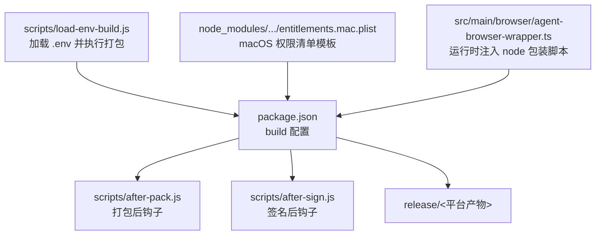
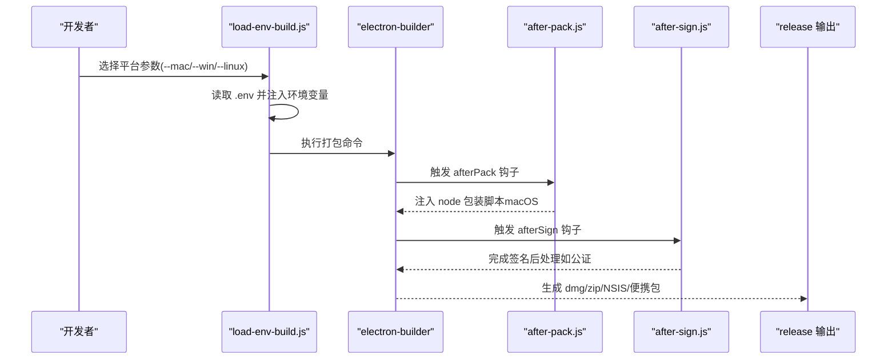
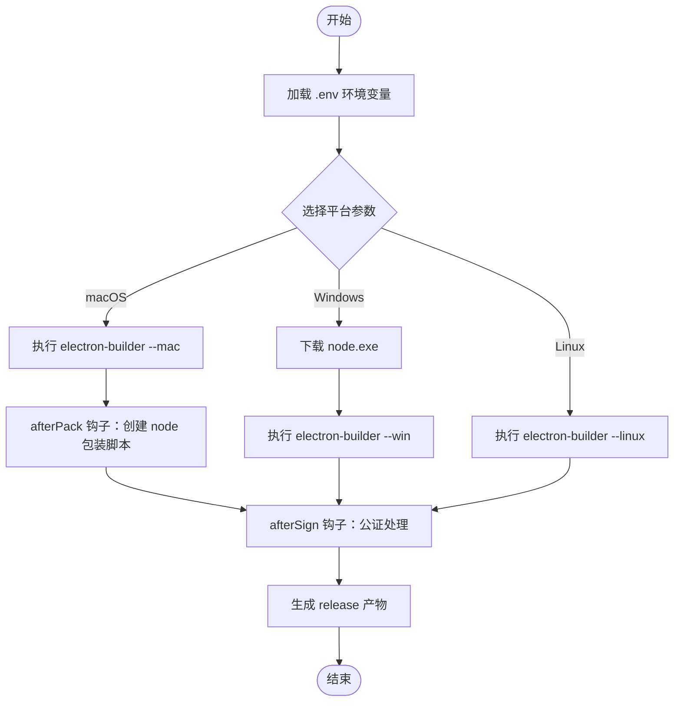
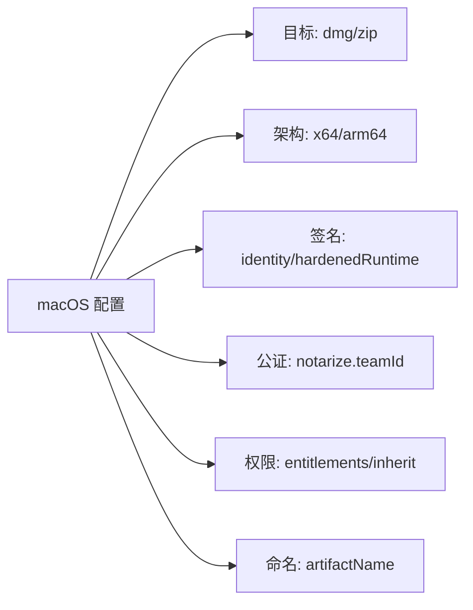
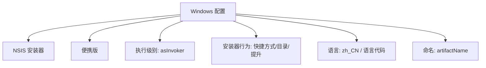
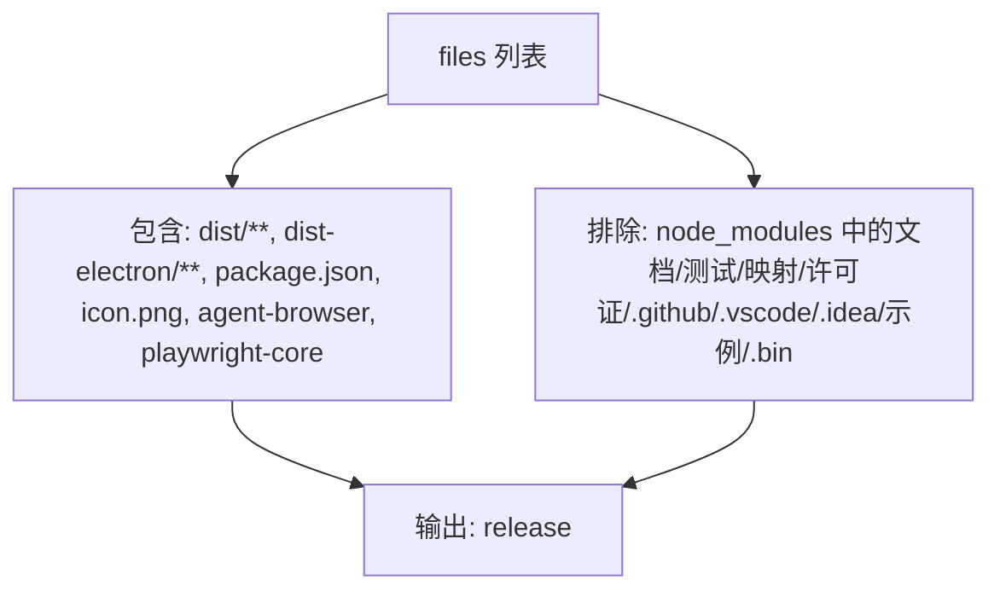
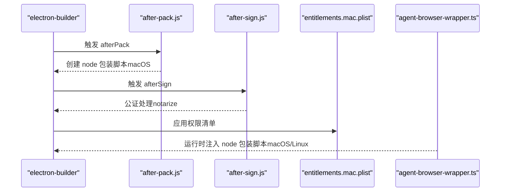
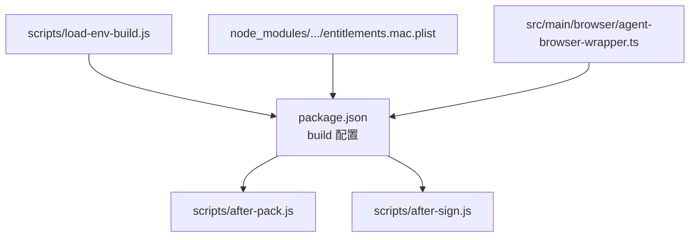

# Electron 打包配置

<cite>
**本文引用的文件**
- [package.json](file://package.json)
- [after-pack.js](file://scripts/after-pack.js)
- [after-sign.js](file://scripts/after-sign.js)
- [load-env-build.js](file://scripts/load-env-build.js)
- [entitlements.mac.plist](file://node_modules/app-builder-lib/templates/entitlements.mac.plist)
- [agent-browser-wrapper.ts](file://src/main/browser/agent-browser-wrapper.ts)
</cite>

## 目录
1. [简介](#简介)
2. [项目结构](#项目结构)
3. [核心组件](#核心组件)
4. [架构总览](#架构总览)
5. [详细组件分析](#详细组件分析)
6. [依赖关系分析](#依赖关系分析)
7. [性能考虑](#性能考虑)
8. [故障排除指南](#故障排除指南)
9. [结论](#结论)
10. [附录](#附录)

## 简介
本文件面向 史丽慧小助理 Electron 应用的打包与分发，系统性解析 package.json 中的 build 字段配置、跨平台打包策略（macOS、Windows、Linux）、文件过滤规则、签名与公证、沙箱权限、asar 压缩、图标与安装器定制，以及构建脚本与自定义打包流程。同时提供各平台打包命令与参数说明，帮助开发者在不同环境下稳定产出可分发的应用包。

## 项目结构
史丽慧小助理 的打包相关配置集中在 package.json 的 build 字段中，并通过一系列脚本实现跨平台构建、签名与公证流程。关键目录与文件如下：
- 构建产物输出：release 目录（由 build.directories.output 指定）
- 打包钩子：scripts/after-pack.js、scripts/after-sign.js
- 环境变量加载与平台选择：scripts/load-env-build.js
- macOS 权限清单模板：node_modules/app-builder-lib/templates/entitlements.mac.plist
- 运行时节点包装脚本注入：src/main/browser/agent-browser-wrapper.ts

**图表来源**
- [package.json:112-233](file://package.json#L112-L233)
- [after-pack.js:1-46](file://scripts/after-pack.js#L1-L46)
- [after-sign.js:1-12](file://scripts/after-sign.js#L1-L12)
- [load-env-build.js:1-39](file://scripts/load-env-build.js#L1-L39)
- [entitlements.mac.plist:1-15](file://node_modules/app-builder-lib/templates/entitlements.mac.plist#L1-L15)
- [agent-browser-wrapper.ts:157-185](file://src/main/browser/agent-browser-wrapper.ts#L157-L185)

**章节来源**
- [package.json:112-233](file://package.json#L112-L233)

## 核心组件
本节聚焦 package.json 中 build 字段的关键配置项及其作用：
- 基础标识与下载镜像
  - appId、productName、icon：应用标识、显示名称与图标
  - publish.provider/url：更新发布地址
  - electronDownload.mirror/cache：Electron 下载镜像与缓存路径
- 打包与产物控制
  - asar=false：禁用 asar 压缩
  - compression=normal：压缩级别
  - removePackageScripts/removePackageKeywords：移除脚本与关键字以减小体积
  - directories.output：输出目录 release
- 文件过滤规则（files）
  - 包含 dist/**、dist-electron/**、package.json、icon.png、渲染端资源与 agent-browser、playwright-core 等
  - 排除 node_modules 中的文档、测试、源码映射、许可证文件、编辑器配置、示例与 bin 目录等
- 平台特定配置
  - macOS：dmg/zip 目标、x64/arm64 架构、身份、硬化运行时、公证 teamId、权限清单、签名忽略正则
  - Windows：NSIS 与便携版目标、请求执行级别、桌面/开始菜单快捷方式、语言与安装器行为
  - NSIS 定制：一键安装、允许变更安装目录、创建快捷方式、提升权限、安装后运行、语言与区域设置

**章节来源**
- [package.json:112-233](file://package.json#L112-L233)

## 架构总览
下图展示从脚本到打包器再到最终产物的整体流程，涵盖环境变量加载、打包钩子、签名与公证、产物生成与命名。

**图表来源**
- [load-env-build.js:1-39](file://scripts/load-env-build.js#L1-L39)
- [after-pack.js:1-46](file://scripts/after-pack.js#L1-L46)
- [after-sign.js:1-12](file://scripts/after-sign.js#L1-L12)
- [package.json:112-233](file://package.json#L112-L233)

## 详细组件分析

### 打包脚本与自定义流程
- load-env-build.js
  - 作用：加载 .env 中的 Apple 公证所需环境变量（如 APPLE_ID），并根据传入平台参数调用 electron-builder
  - 行为：支持 --mac、--win、--linux；Windows 场景会先下载 node.exe
- after-pack.js
  - 作用：在打包完成后、签名前创建 node 包装脚本，确保其被签名范围覆盖
  - 平台限制：仅 macOS 生效；写入 app 目录下的 node 可执行文件，模式 0755
- after-sign.js
  - 作用：签名后钩子，当前版本不执行额外操作，公证由 electron-builder 内置 notarize 处理

**图表来源**
- [load-env-build.js:1-39](file://scripts/load-env-build.js#L1-L39)
- [after-pack.js:1-46](file://scripts/after-pack.js#L1-L46)
- [after-sign.js:1-12](file://scripts/after-sign.js#L1-L12)

**章节来源**
- [load-env-build.js:1-39](file://scripts/load-env-build.js#L1-L39)
- [after-pack.js:1-46](file://scripts/after-pack.js#L1-L46)
- [after-sign.js:1-12](file://scripts/after-sign.js#L1-L12)

### 跨平台打包配置

#### macOS 配置要点
- 目标与架构
  - 支持 dmg 与 zip，x64 与 arm64
- 签名与公证
  - identity：应用签名身份
  - hardenedRuntime：启用硬化运行时
  - notarize.teamId：公证团队 ID
  - signIgnore：对 .json 文件忽略签名
- 权限与继承
  - entitlements/entitlementsInherit：指向模板权限清单
- 产物命名
  - artifactName：包含版本、架构与扩展名

**图表来源**
- [package.json:155-186](file://package.json#L155-L186)
- [entitlements.mac.plist:1-15](file://node_modules/app-builder-lib/templates/entitlements.mac.plist#L1-L15)

**章节来源**
- [package.json:155-186](file://package.json#L155-L186)
- [entitlements.mac.plist:1-15](file://node_modules/app-builder-lib/templates/entitlements.mac.plist#L1-L15)

#### Windows 配置要点
- 目标与架构
  - NSIS 与 portable，x64
- 安全与权限
  - requestedExecutionLevel：asInvoker
  - verifyUpdateCodeSignature：关闭签名验证
- 安装器定制
  - oneClick=false、允许变更安装目录、创建桌面/开始菜单快捷方式、允许提升、安装后运行
  - 语言与区域：安装器语言列表与语言代码
- 产物命名
  - artifactName：包含产品名、版本与架构

**图表来源**
- [package.json:187-232](file://package.json#L187-L232)

**章节来源**
- [package.json:187-232](file://package.json#L187-L232)

#### Linux 配置要点
- 当前仓库未在 build 字段中显式配置 linux 段落，需在实际打包时通过 electron-builder 参数或补充配置
- 建议参考其他项目经验，通常包含目标类型（如 AppImage、deb、rpm）与架构选择

**章节来源**
- [package.json:112-233](file://package.json#L112-L233)

### 文件过滤规则与打包目录结构
- 包含规则
  - dist/**、dist-electron/**、package.json、icon.png
  - 渲染端资源与 agent-browser、playwright-core 相关模块
- 排除规则
  - node_modules 中的文档、测试、源码映射、许可证、编辑器配置、示例与二进制工具
- 输出目录
  - release（由 directories.output 指定）

**图表来源**
- [package.json:133-154](file://package.json#L133-L154)

**章节来源**
- [package.json:133-154](file://package.json#L133-L154)

### 签名、公证与沙箱权限
- 签名
  - macOS：通过 identity 指定签名身份；signIgnore 对 .json 忽略签名
- 公证
  - notarize.teamId：由 electron-builder 内置处理
- 权限清单
  - entitlements 与 entitlementsInherit 指向模板，包含 JIT/无签名内存执行/库验证禁用等键值
- 运行时注入
  - after-pack.js 在 macOS 上创建 node 包装脚本，确保其被签名范围覆盖
  - 运行时 agent-browser-wrapper.ts 在 macOS/Linux 上动态创建 node 包装脚本，保证浏览器工具可用

**图表来源**
- [after-pack.js:1-46](file://scripts/after-pack.js#L1-L46)
- [after-sign.js:1-12](file://scripts/after-sign.js#L1-L12)
- [entitlements.mac.plist:1-15](file://node_modules/app-builder-lib/templates/entitlements.mac.plist#L1-L15)
- [agent-browser-wrapper.ts:157-185](file://src/main/browser/agent-browser-wrapper.ts#L157-L185)

**章节来源**
- [package.json:155-186](file://package.json#L155-L186)
- [after-pack.js:1-46](file://scripts/after-pack.js#L1-L46)
- [after-sign.js:1-12](file://scripts/after-sign.js#L1-L12)
- [entitlements.mac.plist:1-15](file://node_modules/app-builder-lib/templates/entitlements.mac.plist#L1-L15)
- [agent-browser-wrapper.ts:157-185](file://src/main/browser/agent-browser-wrapper.ts#L157-L185)

### asar 压缩配置
- asar=false：禁用 asar 压缩，便于调试与直接访问资源文件
- 影响：产物体积略增，但开发与排障更便利

**章节来源**
- [package.json:124](file://package.json#L124)

### 图标设置与安装程序定制
- 图标
  - build.icon：主图标
  - mac.icon/win.icon：平台特定图标
- 安装程序定制（Windows NSIS）
  - 快捷方式、安装目录、提升权限、语言与区域、安装后运行等

**章节来源**
- [package.json:115](file://package.json#L115)
- [package.json:156](file://package.json#L156)
- [package.json:188](file://package.json#L188)
- [package.json:211-232](file://package.json#L211-L232)

### 打包命令与参数说明
- 通用命令
  - pack：构建并以目录形式打包（用于本地验证）
  - dist：构建并打包为最终产物
- 平台命令
  - dist:mac：通过 load-env-build.js 加载 .env 后打包 macOS
  - dist:mac:local：本地打包（禁用公证与指定 identity=null）
  - dist:win：通过 load-env-build.js 加载 .env 后打包 Windows（Windows 场景会先下载 node.exe）
- 参数说明
  - --mac/--win/--linux：选择目标平台
  - --config.mac.identity=null：临时禁用签名身份（本地测试）
  - --config.mac.notarize=false：临时禁用公证（本地测试）

**章节来源**
- [package.json:23-28](file://package.json#L23-L28)
- [load-env-build.js:28-34](file://scripts/load-env-build.js#L28-L34)

## 依赖关系分析
- 构建器与脚本耦合
  - load-env-build.js 与 .env 环境变量耦合，确保 after-sign.js 能读取 APPLE_ID 等变量
  - after-pack.js 与 macOS 平台耦合，负责创建 node 包装脚本
  - after-sign.js 与 notarize 配置耦合，负责公证后的收尾
- 权限清单依赖
  - entitlements.mac.plist 提供默认权限键值，macOS 打包时生效
- 运行时依赖
  - agent-browser-wrapper.ts 在运行时动态注入 node 包装脚本，保障浏览器工具可用

**图表来源**
- [package.json:112-233](file://package.json#L112-L233)
- [after-pack.js:1-46](file://scripts/after-pack.js#L1-L46)
- [after-sign.js:1-12](file://scripts/after-sign.js#L1-L12)
- [load-env-build.js:1-39](file://scripts/load-env-build.js#L1-L39)
- [entitlements.mac.plist:1-15](file://node_modules/app-builder-lib/templates/entitlements.mac.plist#L1-L15)
- [agent-browser-wrapper.ts:157-185](file://src/main/browser/agent-browser-wrapper.ts#L157-L185)

**章节来源**
- [package.json:112-233](file://package.json#L112-L233)

## 性能考虑
- asar=false：便于调试，但会增加磁盘占用与启动时文件访问开销
- 文件过滤：合理排除 node_modules 中的文档与测试资源，显著减少打包体积
- 压缩级别：compression=normal 在体积与速度间取得平衡
- 平台目标：macOS 同时产出 dmg 与 zip，便于用户选择；Windows 仅 NSIS 与 portable，减少维护成本

[本节为通用建议，无需特定文件引用]

## 故障排除指南
- Apple 公证失败
  - 确认 .env 中 APPLE_ID、APPLE_APP_SPECIFIC_PASSWORD、APPLE_TEAM_ID 是否正确加载
  - 使用 dist:mac:local 临时禁用公证与签名进行问题定位
- macOS 签名后权限异常
  - 检查 entitlements 与 entitlementsInherit 是否正确指向模板
  - 确保 after-pack.js 成功创建 node 包装脚本并具备执行权限
- Windows 安装器语言或快捷方式异常
  - 检查 nsis 段落的语言与快捷方式配置
  - 确认 requestedExecutionLevel 与 allowElevation 设置符合预期
- 运行时 node 包装脚本缺失
  - macOS/Linux：确认 agent-browser-wrapper.ts 的运行时注入逻辑是否正常执行

**章节来源**
- [load-env-build.js:10-26](file://scripts/load-env-build.js#L10-L26)
- [package.json:178-185](file://package.json#L178-L185)
- [after-pack.js:20-44](file://scripts/after-pack.js#L20-L44)
- [agent-browser-wrapper.ts:172-185](file://src/main/browser/agent-browser-wrapper.ts#L172-L185)
- [package.json:211-232](file://package.json#L211-L232)

## 结论
史丽慧小助理 的打包配置以 electron-builder 为核心，结合自定义钩子与环境变量加载脚本，实现了跨平台、可定制且可审计的分发流程。macOS 强化了签名与公证，Windows 提供丰富的安装器定制能力，文件过滤规则有效控制产物体积。通过 dist:mac:local 等命令，可在本地快速验证与调试。建议在 CI 环境中统一管理 .env，确保公证与签名流程稳定可靠。

[本节为总结性内容，无需特定文件引用]

## 附录

### 常用打包命令速查
- 本地打包（目录形式）：用于快速验证
- 正式打包（生成最终产物）：按平台分别执行
- 本地 macOS 打包（禁用公证与签名）：便于快速回归
- Windows 打包：自动下载 node.exe 并执行打包

**章节来源**
- [package.json:23-28](file://package.json#L23-L28)
- [load-env-build.js:28-34](file://scripts/load-env-build.js#L28-L34)