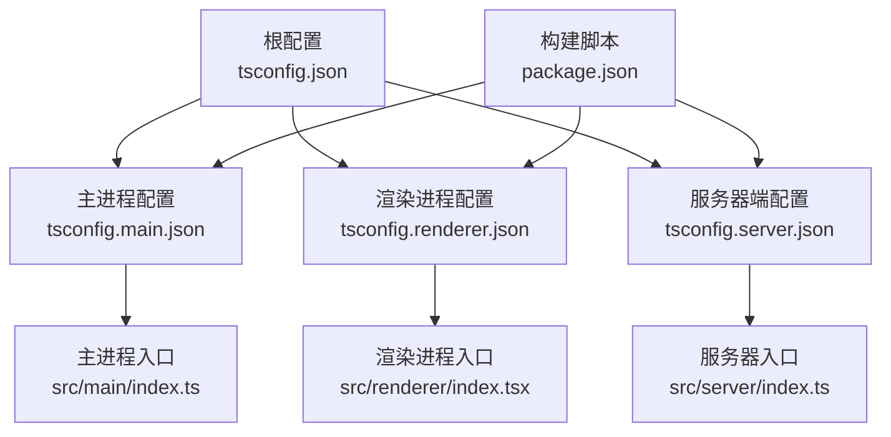
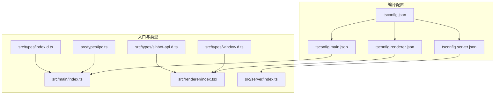
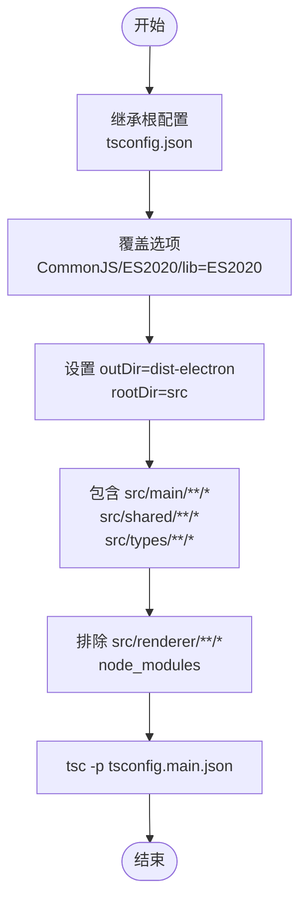
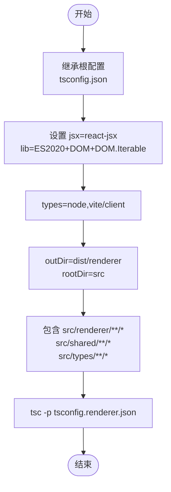
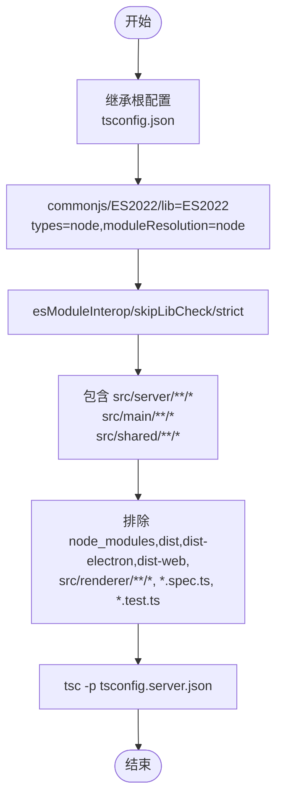
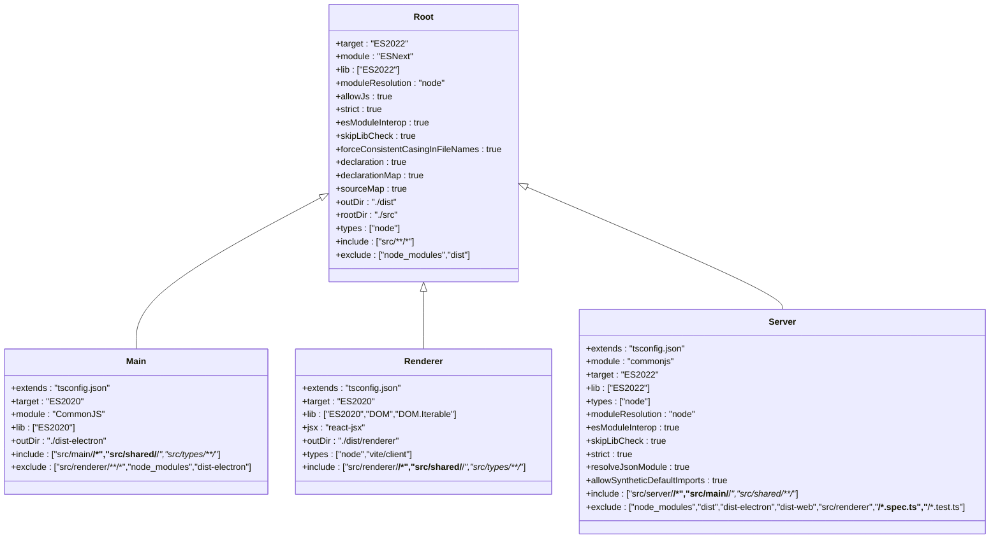
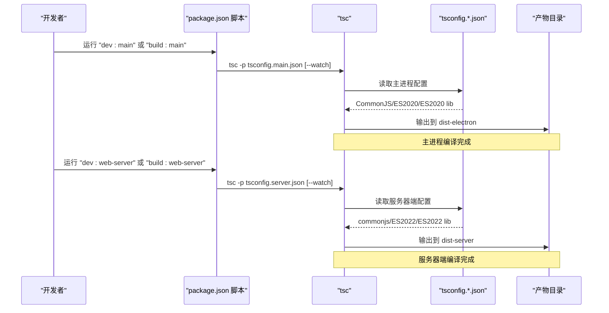

# TypeScript 编译配置

<cite>
**本文引用的文件**
- [tsconfig.json](file://tsconfig.json)
- [tsconfig.main.json](file://tsconfig.main.json)
- [tsconfig.renderer.json](file://tsconfig.renderer.json)
- [tsconfig.server.json](file://tsconfig.server.json)
- [package.json](file://package.json)
- [src/main/index.ts](file://src/main/index.ts)
- [src/renderer/index.tsx](file://src/renderer/index.tsx)
- [src/server/index.ts](file://src/server/index.ts)
- [src/main/preload.ts](file://src/main/preload.ts)
- [src/types/window.d.ts](file://src/types/window.d.ts)
- [src/types/ipc.ts](file://src/types/ipc.ts)
- [src/types/index.d.ts](file://src/types/index.d.ts)
- [src/types/slhbot-api.d.ts](file://src/types/slhbot-api.d.ts)
</cite>

## 目录
1. [简介](#简介)
2. [项目结构](#项目结构)
3. [核心组件](#核心组件)
4. [架构总览](#架构总览)
5. [详细组件分析](#详细组件分析)
6. [依赖分析](#依赖分析)
7. [性能考虑](#性能考虑)
8. [故障排查指南](#故障排查指南)
9. [结论](#结论)
10. [附录](#附录)

## 简介
本文件系统性梳理 史丽慧小助理 项目的 TypeScript 编译配置，围绕根配置与三大子配置展开：主进程、渲染进程与服务器端。文档解释各配置的继承关系、模块解析策略、目标平台与严格模式设置，并结合项目实际入口与类型定义，说明编译选项、路径映射与类型声明处理方式，最后提供常见问题排查与性能优化建议。

## 项目结构
史丽慧小助理 采用多配置分层设计：
- 根配置 tsconfig.json 定义通用编译选项与基础包含/排除规则，作为所有子配置的基础。
- 子配置分别覆盖主进程、渲染进程与服务器端的差异化需求，通过 extends 继承根配置。
- package.json 中的脚本明确调用各配置进行编译与类型检查，体现配置的实际使用场景。

**图表来源**
- [tsconfig.json:1-23](file://tsconfig.json#L1-L23)
- [tsconfig.main.json:1-17](file://tsconfig.main.json#L1-L17)
- [tsconfig.renderer.json:1-12](file://tsconfig.renderer.json#L1-L12)
- [tsconfig.server.json:1-31](file://tsconfig.server.json#L1-L31)
- [package.json:9-44](file://package.json#L9-L44)

**章节来源**
- [tsconfig.json:1-23](file://tsconfig.json#L1-L23)
- [tsconfig.main.json:1-17](file://tsconfig.main.json#L1-L17)
- [tsconfig.renderer.json:1-12](file://tsconfig.renderer.json#L1-L12)
- [tsconfig.server.json:1-31](file://tsconfig.server.json#L1-L31)
- [package.json:9-44](file://package.json#L9-L44)

## 核心组件
- 根配置（tsconfig.json）
  - 目标与模块：ES2022/ESNext，库包含 ES2022。
  - 模块解析：node。
  - JS 支持：允许 JS，解析 JSON 模块。
  - 严格模式：开启严格模式，保持一致性与类型安全。
  - 互操作：启用 esModuleInterop。
  - 检查与映射：跳过库检查，强制文件名大小写一致；生成声明与源映射；输出目录 dist，根目录 src。
  - 类型：内置类型 node。
- 主进程配置（tsconfig.main.json）
  - 继承根配置，覆盖目标为 ES2020，模块为 CommonJS，库为 ES2020。
  - 输出目录 dist-electron，根目录 src。
  - 包含 src/main、src/shared、src/types，排除 src/renderer。
- 渲染进程配置（tsconfig.renderer.json）
  - 继承根配置，目标 ES2020，库包含 DOM/DOM.Iterable。
  - JSX 使用 react-jsx，输出目录 dist/renderer。
  - 类型包含 node 与 vite/client。
  - 包含 src/renderer、src/shared、src/types。
- 服务器端配置（tsconfig.server.json）
  - 继承根配置，CommonJS、ES2022、ES2022 库。
  - 类型 node，模块解析 node，esModuleInterop、skipLibCheck、strict、resolveJsonModule、allowSyntheticDefaultImports。
  - 包含 src/server、src/main、src/shared，排除 node_modules、dist、dist-electron、dist-web、src/renderer 以及测试文件。

**章节来源**
- [tsconfig.json:2-19](file://tsconfig.json#L2-L19)
- [tsconfig.main.json:3-15](file://tsconfig.main.json#L3-L15)
- [tsconfig.renderer.json:3-10](file://tsconfig.renderer.json#L3-L10)
- [tsconfig.server.json:3-29](file://tsconfig.server.json#L3-L29)

## 架构总览
下图展示三类配置与对应入口的关系，以及类型声明对编译的影响。

**图表来源**
- [tsconfig.json:1-23](file://tsconfig.json#L1-L23)
- [tsconfig.main.json:1-17](file://tsconfig.main.json#L1-L17)
- [tsconfig.renderer.json:1-12](file://tsconfig.renderer.json#L1-L12)
- [tsconfig.server.json:1-31](file://tsconfig.server.json#L1-L31)
- [src/main/index.ts:1-1335](file://src/main/index.ts#L1-L1335)
- [src/renderer/index.tsx:1-21](file://src/renderer/index.tsx#L1-L21)
- [src/server/index.ts:1-156](file://src/server/index.ts#L1-L156)
- [src/types/window.d.ts:1-93](file://src/types/window.d.ts#L1-L93)
- [src/types/ipc.ts:1-470](file://src/types/ipc.ts#L1-L470)
- [src/types/index.d.ts:1-36](file://src/types/index.d.ts#L1-L36)
- [src/types/slhbot-api.d.ts:1-12](file://src/types/slhbot-api.d.ts#L1-L12)

## 详细组件分析

### 主进程编译配置（tsconfig.main.json）
- 继承关系：通过 extends 继承根配置，复用严格模式与通用选项。
- 模块解析与目标平台：moduleResolution 为 node，target 为 ES2020，module 为 CommonJS，lib 为 ES2020，适配 Electron 主进程运行时。
- 输出与根目录：outDir 为 dist-electron，rootDir 为 src，确保产物与源码结构清晰。
- 包含/排除范围：仅编译 src/main、src/shared、src/types，排除 src/renderer，避免将渲染代码编译进主进程产物。
- 互操作与检查：esModuleInterop、allowSyntheticDefaultImports、skipLibCheck、strict 保持兼容与稳定性。

**图表来源**
- [tsconfig.main.json:1-17](file://tsconfig.main.json#L1-L17)

**章节来源**
- [tsconfig.main.json:1-17](file://tsconfig.main.json#L1-L17)
- [src/main/index.ts:1-1335](file://src/main/index.ts#L1-L1335)

### 渲染进程编译配置（tsconfig.renderer.json）
- 继承关系：同样继承根配置，复用严格模式与通用选项。
- React 特定设置：lib 包含 DOM/DOM.Iterable，jsx 使用 react-jsx，满足 React JSX 编译需求。
- 类型声明：types 包含 node 与 vite/client，使渲染进程具备 Node 环境类型与 Vite 开发服务器类型。
- 输出与包含范围：outDir 为 dist/renderer，包含 src/renderer、src/shared、src/types，便于与主进程产物隔离。

**图表来源**
- [tsconfig.renderer.json:1-12](file://tsconfig.renderer.json#L1-L12)

**章节来源**
- [tsconfig.renderer.json:1-12](file://tsconfig.renderer.json#L1-L12)
- [src/renderer/index.tsx:1-21](file://src/renderer/index.tsx#L1-L21)
- [src/types/window.d.ts:1-93](file://src/types/window.d.ts#L1-L93)
- [src/types/slhbot-api.d.ts:1-12](file://src/types/slhbot-api.d.ts#L1-L12)

### 服务器端编译配置（tsconfig.server.json）
- 继承关系：继承根配置，统一严格模式与通用选项。
- Node.js 环境设置：module 为 commonjs，target 为 ES2022，lib 为 ES2022，types 为 node，moduleResolution 为 node，esModuleInterop、skipLibCheck、strict、resolveJsonModule、allowSyntheticDefaultImports。
- 包含/排除范围：包含 src/server、src/main、src/shared，排除 node_modules、dist、dist-electron、dist-web、src/renderer 以及测试文件，确保服务器端独立构建。
- 入口与运行：服务器入口为 src/server/index.ts，使用 Express、ws 等 Node 生态库。

**图表来源**
- [tsconfig.server.json:1-31](file://tsconfig.server.json#L1-L31)

**章节来源**
- [tsconfig.server.json:1-31](file://tsconfig.server.json#L1-L31)
- [src/server/index.ts:1-156](file://src/server/index.ts#L1-L156)

### 根配置（tsconfig.json）与继承关系
- 通用选项：target/module/lib/moduleResolution/allowJs/strict/esModuleInterop/skipLibCheck/forceConsistentCasingInFileNames/declaration/declarationMap/sourceMap/outDir/rootDir/types。
- 包含/排除：include 为 src/**/*，exclude 为 node_modules、dist，确保类型声明与源码分离。
- 继承策略：主进程、渲染进程、服务器端均通过 extends 继承该根配置，再按需覆盖特定选项。

**图表来源**
- [tsconfig.json:1-23](file://tsconfig.json#L1-L23)
- [tsconfig.main.json:1-17](file://tsconfig.main.json#L1-L17)
- [tsconfig.renderer.json:1-12](file://tsconfig.renderer.json#L1-L12)
- [tsconfig.server.json:1-31](file://tsconfig.server.json#L1-L31)

**章节来源**
- [tsconfig.json:1-23](file://tsconfig.json#L1-L23)

### 编译选项说明与类型声明处理
- 编译选项要点
  - target/module/lib：决定运行时能力与模块系统，主进程与服务器端偏向 CommonJS/ES2020/ES2022，渲染进程包含 DOM。
  - moduleResolution：统一为 node，保证 Electron/Vite/Node 环境下的模块解析一致性。
  - strict/esModuleInterop/skipLibCheck：严格模式提升类型安全，esModuleInterop 与 allowSyntheticDefaultImports 保证第三方包兼容。
  - declaration/declarationMap/sourceMap：生成声明与映射，便于 IDE 与调试。
  - resolveJsonModule：允许导入 .json，配合 Node 环境使用。
- 类型声明处理
  - 渲染进程：window.d.ts 与 slhbot-api.d.ts 为渲染进程提供全局类型与 API 类型，确保 preload 暴露的 API 在渲染侧可用。
  - 主进程：ipc.ts 定义 IPC 通道与请求/响应类型，preload.ts 暴露 API，二者共同保障主/渲染类型安全。
  - 服务器端：index.d.ts 与相关类型文件为服务器端提供业务类型支撑。

**章节来源**
- [src/types/window.d.ts:1-93](file://src/types/window.d.ts#L1-L93)
- [src/types/slhbot-api.d.ts:1-12](file://src/types/slhbot-api.d.ts#L1-L12)
- [src/types/ipc.ts:1-470](file://src/types/ipc.ts#L1-L470)
- [src/main/preload.ts:1-427](file://src/main/preload.ts#L1-L427)
- [src/types/index.d.ts:1-36](file://src/types/index.d.ts#L1-L36)

## 依赖分析
- 构建脚本与配置映射
  - 主进程开发/构建：dev:main/build:main 对应 tsconfig.main.json。
  - 渲染进程开发/构建：dev:renderer/build:renderer 对应 Vite（非 tsc），但 tsconfig.renderer.json 仍用于类型检查与 IDE 支持。
  - 服务器端开发/构建：dev:web-server/build:web-server 对应 tsconfig.server.json。
  - 类型检查：type-check/type-check:server 分别针对主/渲染与服务器端配置执行 --noEmit。
- 入口文件与配置耦合
  - 主进程入口 src/main/index.ts 与主进程配置强关联，确保模块解析与运行时 API 一致。
  - 渲染进程入口 src/renderer/index.tsx 与渲染进程配置强关联，确保 JSX 与 DOM 类型可用。
  - 服务器入口 src/server/index.ts 与服务器端配置强关联，确保 Node 生态与类型声明一致。

**图表来源**
- [package.json:9-44](file://package.json#L9-L44)
- [tsconfig.main.json:1-17](file://tsconfig.main.json#L1-L17)
- [tsconfig.server.json:1-31](file://tsconfig.server.json#L1-L31)

**章节来源**
- [package.json:9-44](file://package.json#L9-L44)

## 性能考虑
- 并行与增量编译
  - 使用 --watch 结合各自配置进行增量编译，缩短开发反馈周期。
  - 主进程与服务器端分别 watch，避免相互干扰。
- 排除策略
  - 通过 exclude 精确排除 node_modules、dist、dist-electron、dist-web、src/renderer 与测试文件，减少不必要的扫描与编译。
- 源映射与声明
  - 启用 sourceMap 与 declarationMap，提升调试与类型推断效率。
- 模块解析
  - 统一 moduleResolution 为 node，减少解析歧义与失败风险。

[本节为通用建议，无需具体文件引用]

## 故障排查指南
- 常见编译错误与定位
  - 严格模式错误：根配置开启 strict，若出现类型不匹配，优先检查 src/types 下的类型声明与实现是否一致。
  - 模块解析失败：确认 moduleResolution 为 node，且路径映射与实际文件结构一致。
  - JSX/React 类型错误：渲染进程配置需包含 DOM/DOM.Iterable 与 react-jsx，确保 React 组件与 Vite 类型可用。
  - Node 环境类型缺失：服务器端配置需包含 types=node，确保 Express、ws 等类型可用。
- 类型检查脚本
  - 使用 type-check 与 type-check:server 分别对主/渲染与服务器端配置执行 --noEmit，提前发现类型问题。
- 运行时入口验证
  - 主进程入口与 preload 暴露 API 类型需保持一致，避免运行时报错。
  - 渲染进程入口根据 MODE 选择不同组件，确保类型与运行时行为一致。

**章节来源**
- [tsconfig.json:9-18](file://tsconfig.json#L9-L18)
- [tsconfig.renderer.json:3-8](file://tsconfig.renderer.json#L3-L8)
- [tsconfig.server.json:3-14](file://tsconfig.server.json#L3-L14)
- [package.json:19-20](file://package.json#L19-L20)

## 结论
史丽慧小助理 的 TypeScript 编译配置通过根配置统一基础选项，再以主进程、渲染进程、服务器端三个子配置覆盖差异化需求。继承关系清晰、模块解析与目标平台设置合理，配合类型声明与入口文件，形成稳定可靠的编译体系。遵循本文档的配置说明与最佳实践，可有效提升开发体验与构建质量。

## 附录
- 关键入口与类型文件
  - 主进程入口：src/main/index.ts
  - 渲染进程入口：src/renderer/index.tsx
  - 服务器入口：src/server/index.ts
  - 类型声明：src/types/window.d.ts、src/types/ipc.ts、src/types/index.d.ts、src/types/slhbot-api.d.ts
  - 预加载桥接：src/main/preload.ts

**章节来源**
- [src/main/index.ts:1-1335](file://src/main/index.ts#L1-L1335)
- [src/renderer/index.tsx:1-21](file://src/renderer/index.tsx#L1-L21)
- [src/server/index.ts:1-156](file://src/server/index.ts#L1-L156)
- [src/types/window.d.ts:1-93](file://src/types/window.d.ts#L1-L93)
- [src/types/ipc.ts:1-470](file://src/types/ipc.ts#L1-L470)
- [src/types/index.d.ts:1-36](file://src/types/index.d.ts#L1-L36)
- [src/types/slhbot-api.d.ts:1-12](file://src/types/slhbot-api.d.ts#L1-L12)
- [src/main/preload.ts:1-427](file://src/main/preload.ts#L1-L427)