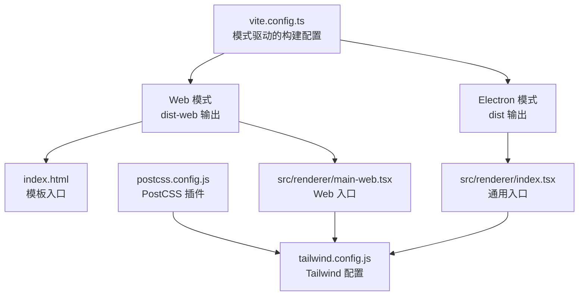
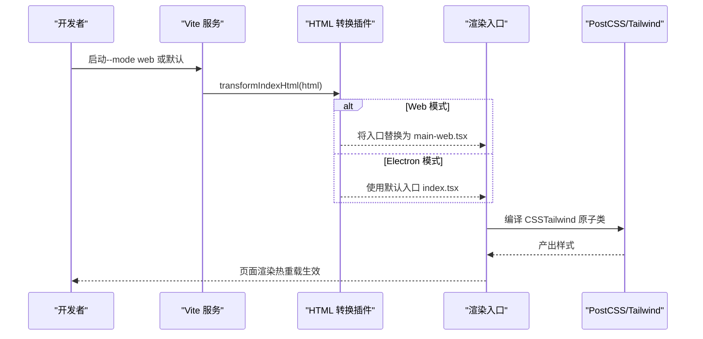
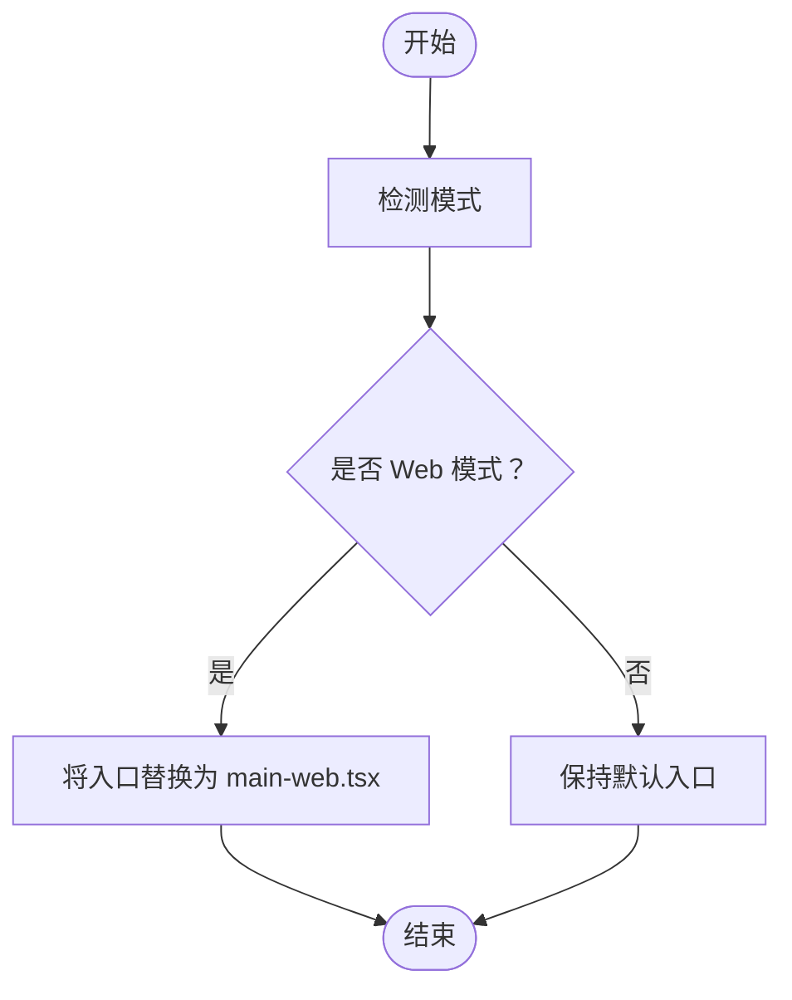
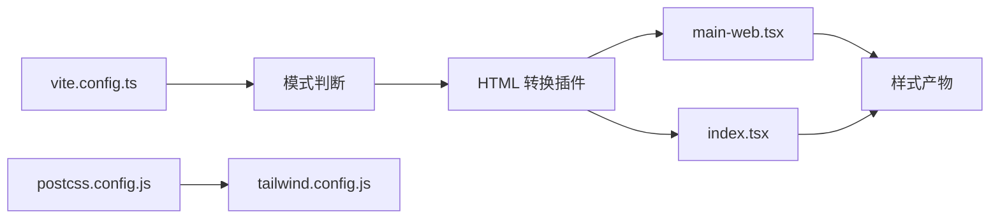

# Vite 构建配置

<cite>
**本文引用的文件**
- [vite.config.ts](file://vite.config.ts)
- [package.json](file://package.json)
- [postcss.config.js](file://postcss.config.js)
- [tailwind.config.js](file://tailwind.config.js)
- [index.html](file://index.html)
- [src/renderer/index.tsx](file://src/renderer/index.tsx)
- [src/renderer/main-web.tsx](file://src/renderer/main-web.tsx)
- [scripts/copy-templates.js](file://scripts/copy-templates.js)
- [scripts/copy-templates-web.js](file://scripts/copy-templates-web.js)
- [scripts/load-env-build.js](file://scripts/load-env-build.js)
- [tsconfig.json](file://tsconfig.json)
- [tsconfig.main.json](file://tsconfig.main.json)
- [tsconfig.renderer.json](file://tsconfig.renderer.json)
</cite>

## 目录
1. [简介](#简介)
2. [项目结构](#项目结构)
3. [核心组件](#核心组件)
4. [架构总览](#架构总览)
5. [详细组件分析](#详细组件分析)
6. [依赖关系分析](#依赖关系分析)
7. [性能考量](#性能考量)
8. [故障排查指南](#故障排查指南)
9. [结论](#结论)
10. [附录](#附录)

## 简介
本指南围绕 DeepBot 的 Vite 构建配置展开，系统性讲解以下主题：
- 插件配置与入口切换机制
- 路径别名与基础路径（base）策略
- 开发服务器端口与热重载行为
- 生产构建输出与 Rollup 输入配置
- Web 模式与 Electron 模式的差异
- PostCSS 与 Tailwind CSS 集成
- 构建性能优化与常见问题解决

## 项目结构
本项目采用多入口、多模式的构建策略：
- Vite 主配置通过模式区分 Web 与 Electron，动态调整入口、输出目录与基础路径
- Web 模式使用独立的渲染入口与 HTML 模板，Electron 模式复用默认入口
- PostCSS 与 Tailwind CSS 在 Web 模式下协同工作，提供样式编译与原子化类支持

图表来源
- [vite.config.ts:5-61](file://vite.config.ts#L5-L61)
- [index.html:1-27](file://index.html#L1-L27)
- [src/renderer/main-web.tsx:1-14](file://src/renderer/main-web.tsx#L1-L14)
- [src/renderer/index.tsx:15-21](file://src/renderer/index.tsx#L15-L21)
- [postcss.config.js:1-7](file://postcss.config.js#L1-L7)
- [tailwind.config.js:1-76](file://tailwind.config.js#L1-L76)

章节来源
- [vite.config.ts:5-61](file://vite.config.ts#L5-L61)
- [package.json:9-44](file://package.json#L9-L44)

## 核心组件
- 模式驱动的插件与入口切换
  - 使用插件对 index.html 进行二次转换，实现 Web/Electron 入口的动态替换
  - Web 模式将入口指向 Web 专用入口文件，Electron 模式保持默认
- 路径别名与基础路径
  - 通过别名将 @ 指向 src，提升导入可读性
  - base 根据模式分别设置为 / 或 ./，满足不同部署需求
- 构建输出与 Rollup 输入
  - Web 模式输出至 dist-web，Electron 模式输出至 dist
  - Web 模式显式声明 Rollup 输入为 index.html，确保静态资源正确打包
- 开发服务器端口
  - Web 模式端口 5174，Electron 模式端口 5173，避免冲突
- 环境变量注入
  - Web 模式注入 IS_WEB 标记，便于运行时分支逻辑

章节来源
- [vite.config.ts:9-61](file://vite.config.ts#L9-L61)
- [src/renderer/index.tsx:15-21](file://src/renderer/index.tsx#L15-L21)

## 架构总览
下图展示 Vite 在不同模式下的构建与运行路径，以及样式管线：

图表来源
- [vite.config.ts:12-24](file://vite.config.ts#L12-L24)
- [src/renderer/main-web.tsx:1-14](file://src/renderer/main-web.tsx#L1-L14)
- [src/renderer/index.tsx:15-21](file://src/renderer/index.tsx#L15-L21)
- [postcss.config.js:1-7](file://postcss.config.js#L1-L7)
- [tailwind.config.js:1-76](file://tailwind.config.js#L1-L76)

## 详细组件分析

### 插件与入口切换机制
- 插件职责
  - 在 index.html 转换阶段，依据模式动态替换入口文件
  - Web 模式将入口从默认渲染入口替换为 Web 专用入口
- 入口文件差异
  - Web 模式入口：Web 专用渲染入口，直接挂载 Web 应用组件
  - Electron 模式入口：通用渲染入口，根据运行时 MODE 切换组件

图表来源
- [vite.config.ts:12-24](file://vite.config.ts#L12-L24)
- [src/renderer/main-web.tsx:1-14](file://src/renderer/main-web.tsx#L1-L14)
- [src/renderer/index.tsx:15-21](file://src/renderer/index.tsx#L15-L21)

章节来源
- [vite.config.ts:9-25](file://vite.config.ts#L9-L25)
- [src/renderer/index.tsx:15-21](file://src/renderer/index.tsx#L15-L21)

### 路径别名与基础路径
- 别名设置
  - 将 @ 解析到 src，简化导入路径书写
- 基础路径
  - Web 模式使用绝对路径 /，适合静态托管
  - Electron 模式使用相对路径 ./，适配本地文件协议

章节来源
- [vite.config.ts:50-54](file://vite.config.ts#L50-L54)

### 开发服务器配置
- 端口策略
  - Web 模式：5174
  - Electron 模式：5173
- 热重载
  - Vite 默认启用，无需额外配置；配合 React 插件实现组件级热更新

章节来源
- [vite.config.ts:44-48](file://vite.config.ts#L44-L48)
- [package.json:32-32](file://package.json#L32-L32)

### 生产构建配置
- 输出目录
  - Web 模式：dist-web
  - Electron 模式：dist
- Rollup 输入
  - Web 模式显式声明输入为 index.html，确保静态资源打包
- 与打包脚本的协作
  - Web 构建脚本同时构建服务端与渲染端，并将模板复制到服务端目录

章节来源
- [vite.config.ts:32-42](file://vite.config.ts#L32-L42)
- [package.json:37-37](file://package.json#L37-L37)
- [scripts/copy-templates-web.js:1-30](file://scripts/copy-templates-web.js#L1-L30)

### Web 模式与 Electron 模式的差异
- 入口文件
  - Web：main-web.tsx
  - Electron：index.tsx（运行时根据 MODE 切换组件）
- 基础路径与输出目录
  - Web：base=/，outDir=dist-web
  - Electron：base=./，outDir=dist
- 环境变量
  - Web：注入 IS_WEB 标记
- 模板与 CSP
  - index.html 提供通用模板与 CSP，Web 模式需允许本地后端 API 与 WebSocket

章节来源
- [vite.config.ts:6-61](file://vite.config.ts#L6-L61)
- [index.html:7-19](file://index.html#L7-L19)
- [src/renderer/index.tsx:15-21](file://src/renderer/index.tsx#L15-L21)

### PostCSS 与 Tailwind CSS 集成
- PostCSS 配置
  - 启用 tailwindcss 与 autoprefixer 插件
- Tailwind 配置
  - content 覆盖 HTML 与 src 下的 TSX/TS 文件
  - 自定义主题颜色、字体族、字号与字重
- 构建流程
  - Vite 在开发与生产构建中均调用 PostCSS/Tailwind 进行样式处理

章节来源
- [postcss.config.js:1-7](file://postcss.config.js#L1-L7)
- [tailwind.config.js:1-76](file://tailwind.config.js#L1-L76)

### 构建脚本与模板复制
- Electron 构建
  - 构建主进程 → 复制模板 → 构建渲染端
  - 模板复制脚本将 Markdown 模板复制到 dist-electron 目录
- Web 构建
  - 构建服务端 → 复制模板到 dist-server → 构建渲染端
  - 通过独立脚本保证服务端与客户端模板一致

章节来源
- [package.json:16-18](file://package.json#L16-L18)
- [package.json:35-37](file://package.json#L35-L37)
- [scripts/copy-templates.js:1-72](file://scripts/copy-templates.js#L1-L72)
- [scripts/copy-templates-web.js:1-30](file://scripts/copy-templates-web.js#L1-L30)

### TypeScript 配置与类型检查
- 顶层 tsconfig 控制通用编译选项
- main 与 renderer 分别针对主进程与渲染进程进行独立配置
- 类型检查脚本分别对主进程与渲染进程执行

章节来源
- [tsconfig.json:1-23](file://tsconfig.json#L1-L23)
- [tsconfig.main.json:1-17](file://tsconfig.main.json#L1-L17)
- [tsconfig.renderer.json:1-12](file://tsconfig.renderer.json#L1-L12)
- [package.json:19-20](file://package.json#L19-L20)

## 依赖关系分析
- Vite 与模式
  - 通过 mode 参数控制插件行为与入口替换
- 插件与入口
  - HTML 转换插件与渲染入口文件形成耦合，确保模式切换时入口正确
- 样式管线
  - PostCSS 与 Tailwind 配置影响样式产物，进而影响最终包体大小与加载性能
- 构建脚本
  - 与模板复制脚本共同保证服务端与客户端资源一致性

图表来源
- [vite.config.ts:5-61](file://vite.config.ts#L5-L61)
- [postcss.config.js:1-7](file://postcss.config.js#L1-L7)
- [tailwind.config.js:1-76](file://tailwind.config.js#L1-L76)

章节来源
- [vite.config.ts:5-61](file://vite.config.ts#L5-L61)
- [postcss.config.js:1-7](file://postcss.config.js#L1-L7)
- [tailwind.config.js:1-76](file://tailwind.config.js#L1-L76)

## 性能考量
- 代码分割与懒加载
  - 使用动态导入实现路由与组件级别的代码分割，减少首屏体积
- 样式体积控制
  - Tailwind content 范围明确，避免无用类导致的体积膨胀
- 构建缓存与增量编译
  - Vite 默认启用模块联邦与缓存，结合 TypeScript 的增量编译提升开发体验
- 资源优化
  - 生产构建建议开启压缩与资源内联策略，结合 CDN 使用进一步优化加载速度

## 故障排查指南
- 端口冲突
  - 症状：启动失败或端口占用
  - 处理：调整开发服务器端口或释放占用端口
- 入口替换异常
  - 症状：页面空白或组件未渲染
  - 排查：确认模式参数与 HTML 转换插件是否生效，检查入口文件是否存在
- 样式未生效
  - 症状：Tailwind 类无效
  - 排查：确认 PostCSS/Tailwind 配置文件存在且内容正确，清理缓存后重试
- 模板复制失败
  - 症状：服务端无法读取模板
  - 处理：检查模板复制脚本的源目录与目标目录权限，确保构建脚本执行顺序正确
- 打包环境变量缺失
  - 症状：签名或发布失败
  - 处理：使用加载环境变量脚本确保 .env 中的变量在打包时可用

章节来源
- [vite.config.ts:44-48](file://vite.config.ts#L44-L48)
- [vite.config.ts:12-24](file://vite.config.ts#L12-L24)
- [postcss.config.js:1-7](file://postcss.config.js#L1-L7)
- [tailwind.config.js:1-76](file://tailwind.config.js#L1-L76)
- [scripts/copy-templates.js:1-72](file://scripts/copy-templates.js#L1-L72)
- [scripts/load-env-build.js:1-39](file://scripts/load-env-build.js#L1-L39)

## 结论
本指南梳理了 DeepBot 的 Vite 构建配置，重点在于：
- 通过模式驱动实现 Web 与 Electron 的差异化构建
- 利用插件与别名提升开发效率与部署灵活性
- 依托 PostCSS 与 Tailwind 实现高效样式工程化
- 结合脚本与配置保障构建产物的一致性与稳定性

## 附录
- 常用命令
  - 开发：启动渲染端与主进程，等待开发服务器就绪后启动 Electron
  - 构建：先构建主进程与模板，再构建渲染端
  - Web 开发/构建：分别启动 Web 服务端与渲染端，构建时指定模式与输出目录
- 环境变量
  - 开发时通过跨平台环境变量工具设置开发服务器地址
  - 打包时通过脚本加载 .env 中的签名相关变量

章节来源
- [package.json:9-44](file://package.json#L9-L44)
- [scripts/load-env-build.js:1-39](file://scripts/load-env-build.js#L1-L39)