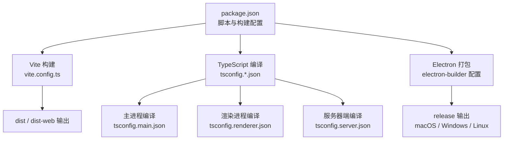
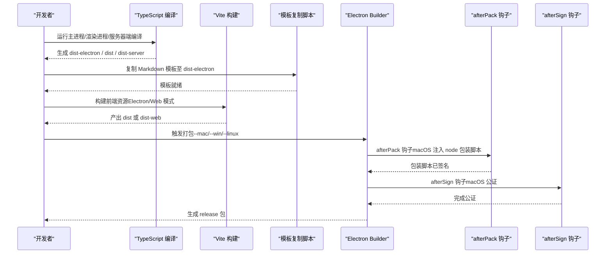
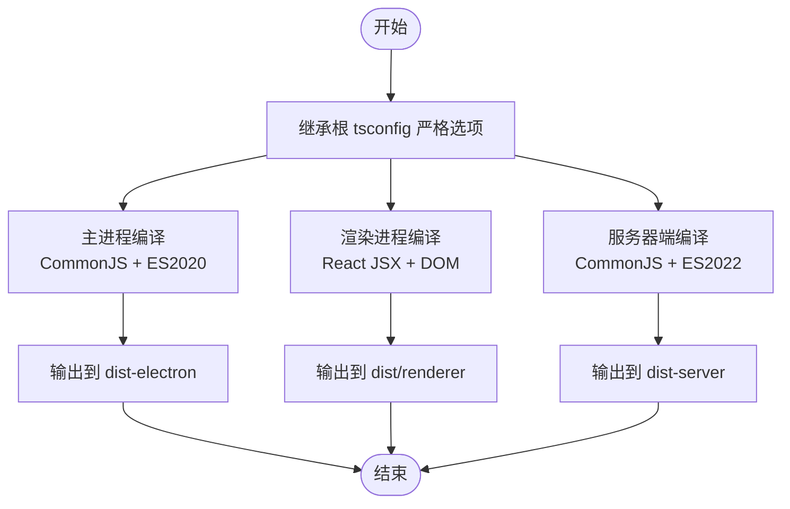
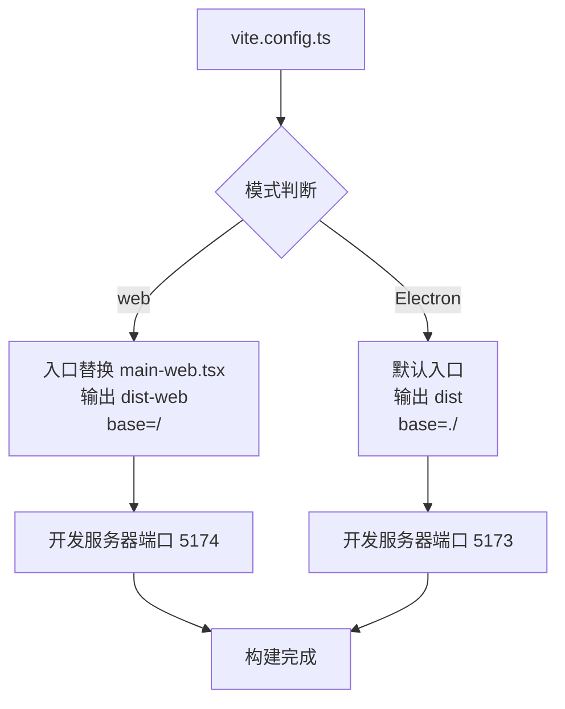
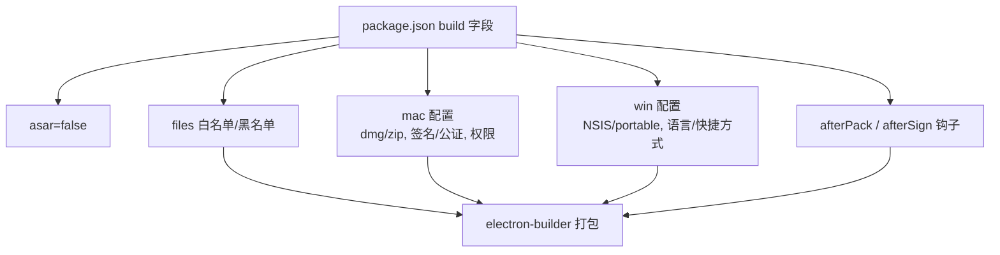
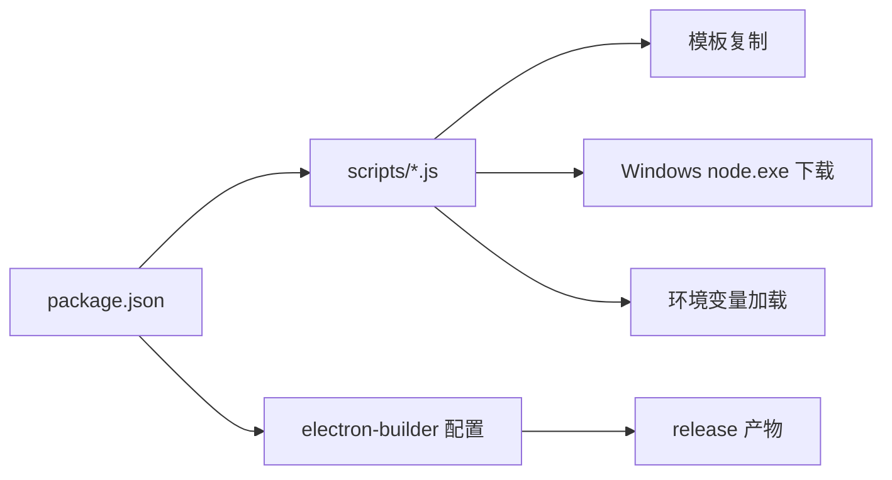

# 构建和打包

<cite>
**本文引用的文件**
- [package.json](file://package.json)
- [vite.config.ts](file://vite.config.ts)
- [tsconfig.json](file://tsconfig.json)
- [tsconfig.main.json](file://tsconfig.main.json)
- [tsconfig.renderer.json](file://tsconfig.renderer.json)
- [tsconfig.server.json](file://tsconfig.server.json)
- [scripts/after-pack.js](file://scripts/after-pack.js)
- [scripts/after-sign.js](file://scripts/after-sign.js)
- [scripts/load-env-build.js](file://scripts/load-env-build.js)
- [scripts/copy-templates.js](file://scripts/copy-templates.js)
- [scripts/download-node-win.js](file://scripts/download-node-win.js)
- [scripts/rebuild-sqlite-node.js](file://scripts/rebuild-sqlite-node.js)
- [scripts/check-dependencies.js](file://scripts/check-dependencies.js)
</cite>

## 目录
1. [简介](#简介)
2. [项目结构](#项目结构)
3. [核心组件](#核心组件)
4. [架构总览](#架构总览)
5. [详细组件分析](#详细组件分析)
6. [依赖关系分析](#依赖关系分析)
7. [性能考量](#性能考量)
8. [故障排查指南](#故障排查指南)
9. [结论](#结论)
10. [附录](#附录)

## 简介
本指南面向 DeepBot 的构建与打包体系，覆盖以下主题：
- TypeScript 编译配置与多目标编译（主进程、渲染进程、服务器端、共享类型）。
- Vite 构建配置与前端资源打包策略（含 Web 模式与 Electron 模式的差异）。
- Electron 打包配置（asar、文件过滤、平台特定设置、公证与签名）。
- 不同平台（Windows、macOS、Linux）的构建参数与签名配置。
- 开发构建与发布构建的区别。
- 构建优化技巧与常见问题的解决方案。

## 项目结构
本项目采用“多 tsconfig + Vite + Electron Builder”的混合构建方案：
- TypeScript 分层编译：主进程、渲染进程、服务器端、共享类型分别使用独立 tsconfig，确保严格的类型边界与最小化编译范围。
- Vite 用于前端资源构建，支持开发热更新与生产打包；通过模式区分 Electron 与 Web。
- Electron Builder 负责最终应用分发包生成，支持多平台、多目标与签名公证。

图表来源
- [package.json:1-235](file://package.json#L1-L235)
- [vite.config.ts:1-63](file://vite.config.ts#L1-L63)
- [tsconfig.json:1-23](file://tsconfig.json#L1-L23)
- [tsconfig.main.json:1-17](file://tsconfig.main.json#L1-L17)
- [tsconfig.renderer.json:1-12](file://tsconfig.renderer.json#L1-L12)
- [tsconfig.server.json:1-31](file://tsconfig.server.json#L1-L31)

章节来源
- [package.json:1-235](file://package.json#L1-L235)
- [vite.config.ts:1-63](file://vite.config.ts#L1-L63)
- [tsconfig.json:1-23](file://tsconfig.json#L1-L23)

## 核心组件
- TypeScript 多目标编译
  - 根配置统一严格选项与源码根目录，按功能域拆分 tsconfig，避免相互干扰。
  - 主进程：CommonJS、ES2020、仅包含主进程与共享代码。
  - 渲染进程：React JSX、DOM 类库、仅包含渲染侧与共享代码。
  - 服务器端：CommonJS、ES2022、包含服务端与主进程共享逻辑。
- Vite 构建
  - 模式区分：web 模式与 Electron 模式，切换入口、输出目录、基础路径与开发服务器端口。
  - 插件：React 插件与自定义 HTML 转换插件，实现 Web 模式下入口替换。
- Electron 打包
  - asar 关闭（便于调试与动态资源访问）、文件白名单与黑名单过滤、平台特定目标与属性。
  - macOS：公证与签名、沙箱权限、辅助工具清单、包装脚本注入。
  - Windows：NSIS 安装器与便携版目标、语言与快捷方式策略。

章节来源
- [tsconfig.main.json:1-17](file://tsconfig.main.json#L1-L17)
- [tsconfig.renderer.json:1-12](file://tsconfig.renderer.json#L1-L12)
- [tsconfig.server.json:1-31](file://tsconfig.server.json#L1-L31)
- [vite.config.ts:1-63](file://vite.config.ts#L1-L63)
- [package.json:112-233](file://package.json#L112-L233)

## 架构总览
下图展示从开发到发布的整体流程，涵盖编译、资源打包、模板复制、平台打包与签名公证等关键节点。

图表来源
- [package.json:9-44](file://package.json#L9-L44)
- [scripts/copy-templates.js:1-72](file://scripts/copy-templates.js#L1-L72)
- [scripts/after-pack.js:1-46](file://scripts/after-pack.js#L1-L46)
- [scripts/after-sign.js:1-12](file://scripts/after-sign.js#L1-L12)
- [vite.config.ts:1-63](file://vite.config.ts#L1-L63)

## 详细组件分析

### TypeScript 编译配置与多目标编译
- 设计原则
  - 以“功能域隔离”为目标，避免跨域编译耦合。
  - 统一严格选项于根配置，差异化模块系统与目标版本于子配置。
- 关键点
  - 主进程：CommonJS、ES2020，限定 include/exclude，确保仅编译主进程与共享类型。
  - 渲染进程：启用 JSX、DOM 类库，限定 include/exclude，确保仅编译渲染侧与共享类型。
  - 服务器端：CommonJS、ES2022，包含主进程与服务器端共享逻辑，排除渲染侧。
  - 根配置：统一 outDir/rootDir、严格模式、声明文件与 sourcemap 生成策略。
- 复杂度与性能
  - 分层编译降低增量编译成本，提升开发体验。
  - 合理的 include/exclude 减少扫描与解析开销。

图表来源
- [tsconfig.json:1-23](file://tsconfig.json#L1-L23)
- [tsconfig.main.json:1-17](file://tsconfig.main.json#L1-L17)
- [tsconfig.renderer.json:1-12](file://tsconfig.renderer.json#L1-L12)
- [tsconfig.server.json:1-31](file://tsconfig.server.json#L1-L31)

章节来源
- [tsconfig.json:1-23](file://tsconfig.json#L1-L23)
- [tsconfig.main.json:1-17](file://tsconfig.main.json#L1-L17)
- [tsconfig.renderer.json:1-12](file://tsconfig.renderer.json#L1-L12)
- [tsconfig.server.json:1-31](file://tsconfig.server.json#L1-L31)

### Vite 构建配置与前端资源打包策略
- 模式区分
  - web 模式：入口替换为主 web 入口、输出到 dist-web、基础路径为“/”、开发端口 5174。
  - Electron 模式：默认入口、输出到 dist、基础路径为“./”、开发端口 5173。
- 构建行为
  - Electron 模式：Rollup 输入保持默认，输出目录与空目录清理策略明确。
  - Web 模式：显式指定 Rollup 输入，适配单页应用部署。
- 别名与环境变量
  - @ 别名指向 src，提升导入可读性。
  - Web 模式注入 IS_WEB 环境变量，便于运行时分支控制。
- 与打包的关系
  - Vite 产物作为 Electron 应用的静态资源或 Web 模式下的独立站点。

图表来源
- [vite.config.ts:1-63](file://vite.config.ts#L1-L63)

章节来源
- [vite.config.ts:1-63](file://vite.config.ts#L1-L63)

### Electron 打包配置（asar、文件过滤、平台特定设置）
- asar 与压缩
  - asar 关闭，便于调试与动态资源访问；压缩等级为 normal。
- 文件过滤规则
  - 白名单：dist/**/*、dist-electron/**/*、package.json、图标、agent-browser 与 playwright-core 相关内容。
  - 黑名单：大量文档、测试、示例、源码映射、许可证文件、IDE 目录、docs、.bin 等。
- 平台特定设置
  - macOS：dmg 与 zip 目标，x64/arm64 架构；公证与签名开启；沙箱权限与辅助工具清单；签名忽略 JSON。
  - Windows：NSIS 安装器与 portable 目标，x64 架构；安装器语言与快捷方式策略；执行级别 asInvoker。
- 打包钩子
  - afterPack：在 macOS 上创建 node 包装脚本，确保其被签名范围覆盖。
  - afterSign：由 electron-builder 内置 notarize 处理，无需额外操作。

图表来源
- [package.json:112-233](file://package.json#L112-L233)
- [scripts/after-pack.js:1-46](file://scripts/after-pack.js#L1-L46)
- [scripts/after-sign.js:1-12](file://scripts/after-sign.js#L1-L12)

章节来源
- [package.json:112-233](file://package.json#L112-L233)
- [scripts/after-pack.js:1-46](file://scripts/after-pack.js#L1-L46)
- [scripts/after-sign.js:1-12](file://scripts/after-sign.js#L1-L12)

### 不同平台（Windows、macOS、Linux）的构建参数与签名配置
- macOS
  - 目标：dmg 与 zip，双架构。
  - 签名：使用团队 ID、硬加固、公证配置。
  - 辅助工具：Helper 进程清单与权限继承。
  - 钩子：afterPack 注入 node 包装脚本，afterSign 由 builder 内置 notarize 处理。
- Windows
  - 目标：NSIS 安装器与 portable 可移植版，x64。
  - 安装器：交互式安装、桌面/开始菜单快捷方式、语言与区域设置。
  - 执行级别：asInvoker。
- Linux（配置项）
  - 项目中未见 Linux 目标配置字段，如需支持请在 build.linux 下补充。

章节来源
- [package.json:155-232](file://package.json#L155-L232)
- [scripts/after-pack.js:1-46](file://scripts/after-pack.js#L1-L46)
- [scripts/after-sign.js:1-12](file://scripts/after-sign.js#L1-L12)

### 开发构建与发布构建的区别
- 开发构建
  - 主进程：tsc -p tsconfig.main.json --watch。
  - 渲染进程：vite（热更新）。
  - 启动：通过交叉环境变量与等待脚本组合启动 Electron。
  - 模板复制：构建前复制模板，保证提示词模板可用。
- 发布构建
  - 全量编译：主进程、模板复制、渲染进程。
  - 打包：electron-builder，支持 --dir（预览）与直接打包。
  - 平台脚本：load-env-build.js 加载 .env，确保 Apple 公证所需环境变量可用。
  - Windows 特殊：download-node-win.js 在打包前下载 node.exe，供 agent-browser 的 Rust 二进制使用。

章节来源
- [package.json:9-44](file://package.json#L9-L44)
- [scripts/load-env-build.js:1-39](file://scripts/load-env-build.js#L1-L39)
- [scripts/download-node-win.js:1-95](file://scripts/download-node-win.js#L1-L95)
- [scripts/copy-templates.js:1-72](file://scripts/copy-templates.js#L1-L72)

### 构建优化技巧
- 编译层面
  - 使用分层 tsconfig，缩小编译范围，提升增量编译效率。
  - 严格模式与声明文件有助于 IDE 与类型检查，减少运行期错误。
- 构建层面
  - Vite 模式区分明确，避免不必要的资源转换与打包差异。
  - 仅保留必要文件到发布包，减少体积与扫描时间。
- 平台层面
  - macOS 使用 afterPack 注入包装脚本，避免签名后二次修改导致公证失效。
  - Windows 打包前准备 node.exe，避免运行时找不到可执行文件。

章节来源
- [tsconfig.main.json:1-17](file://tsconfig.main.json#L1-L17)
- [tsconfig.renderer.json:1-12](file://tsconfig.renderer.json#L1-L12)
- [vite.config.ts:1-63](file://vite.config.ts#L1-L63)
- [package.json:133-154](file://package.json#L133-L154)
- [scripts/after-pack.js:1-46](file://scripts/after-pack.js#L1-L46)
- [scripts/download-node-win.js:1-95](file://scripts/download-node-win.js#L1-L95)

## 依赖关系分析
- 脚本与配置的耦合
  - package.json 的 scripts 与 electron-builder 配置强关联，确保构建顺序与产物一致。
  - load-env-build.js 与 .env 协作，保障 macOS 公证所需的环境变量。
- 资源与模板
  - copy-templates.js 在构建阶段复制模板，避免运行时查找失败。
- 平台差异
  - download-node-win.js 与 Windows 目标配合，确保运行时依赖可用。

图表来源
- [package.json:9-44](file://package.json#L9-L44)
- [scripts/copy-templates.js:1-72](file://scripts/copy-templates.js#L1-L72)
- [scripts/download-node-win.js:1-95](file://scripts/download-node-win.js#L1-L95)
- [scripts/load-env-build.js:1-39](file://scripts/load-env-build.js#L1-L39)

章节来源
- [package.json:9-44](file://package.json#L9-L44)
- [scripts/copy-templates.js:1-72](file://scripts/copy-templates.js#L1-L72)
- [scripts/download-node-win.js:1-95](file://scripts/download-node-win.js#L1-L95)
- [scripts/load-env-build.js:1-39](file://scripts/load-env-build.js#L1-L39)

## 性能考量
- 编译性能
  - 分层 tsconfig 显著降低全量编译时间，建议在大型项目中持续维护 include/exclude 的精确性。
- 构建体积
  - 使用 files 白名单与黑名单过滤，剔除文档、测试、映射与 IDE 目录，有效减小发布包体积。
- 运行时性能
  - asar 关闭便于调试与动态资源访问，但会增加文件数量；若对性能敏感可评估开启 asar 的可行性与影响面。

## 故障排查指南
- 依赖缺失或子依赖不完整
  - 使用依赖检查脚本定位缺失的子依赖，优先执行安装命令补齐。
- macOS 公证失败
  - 确认 .env 已正确加载，且 APPLE_ID、APPLE_APP_SPECIFIC_PASSWORD 等变量存在；使用 load-env-build.js 脚本触发打包。
- Windows 运行时报找不到 node.exe
  - 确认 download-node-win.js 已执行并生成 node.exe；确保其被包含在打包 files 中。
- 模板未生效
  - 确认 copy-templates.js 成功复制到 dist-electron；检查主进程读取路径是否正确。
- 打包后签名失败或公证异常
  - 检查 afterPack 是否在 macOS 平台创建了 node 包装脚本；确认签名 identity 与公证 teamId 配置正确。

章节来源
- [scripts/check-dependencies.js:1-106](file://scripts/check-dependencies.js#L1-L106)
- [scripts/load-env-build.js:1-39](file://scripts/load-env-build.js#L1-L39)
- [scripts/download-node-win.js:1-95](file://scripts/download-node-win.js#L1-L95)
- [scripts/copy-templates.js:1-72](file://scripts/copy-templates.js#L1-L72)
- [scripts/after-pack.js:1-46](file://scripts/after-pack.js#L1-L46)
- [package.json:155-232](file://package.json#L155-L232)

## 结论
本项目通过“多 tsconfig + Vite + Electron Builder”的组合，实现了清晰的编译边界、灵活的前端打包策略以及完善的多平台打包与签名公证流程。建议在后续迭代中：
- 明确 Linux 目标配置，完善跨平台一致性。
- 持续优化文件过滤规则，平衡包体大小与运行时便利性。
- 在 macOS 平台上评估开启 asar 的可行性与风险。

## 附录
- 常用命令速查
  - 开发：主进程监听、渲染进程热更新、模板复制、启动 Electron。
  - 构建：编译主进程、复制模板、渲染进程构建。
  - 打包：本地预览打包与正式打包。
  - 平台打包：加载 .env 后执行 macOS/Windows 打包。
- Web 模式与 Electron 模式的差异
  - 入口文件、输出目录、基础路径与开发端口均存在差异，需根据模式选择对应脚本。

章节来源
- [package.json:9-44](file://package.json#L9-L44)
- [vite.config.ts:1-63](file://vite.config.ts#L1-L63)