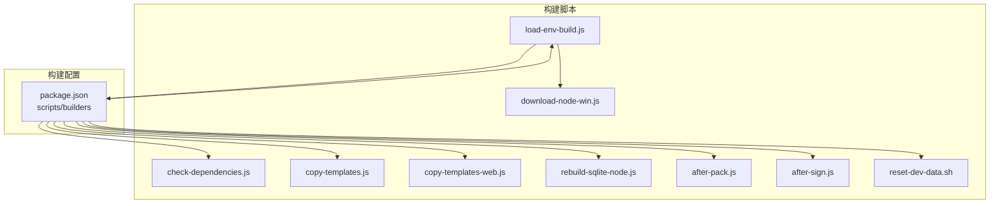
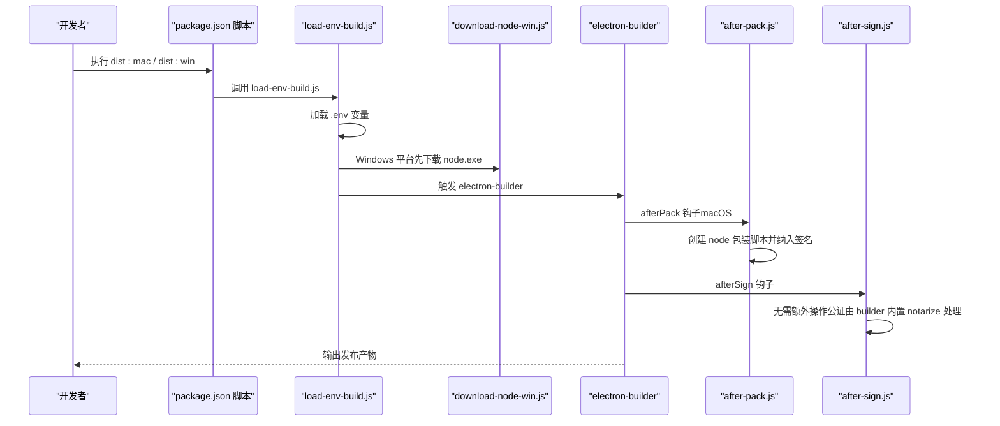
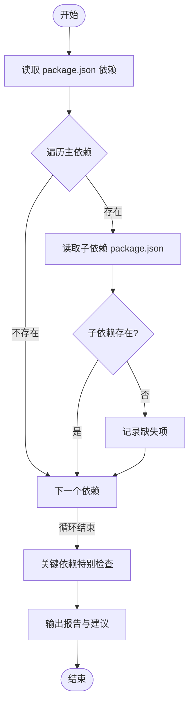
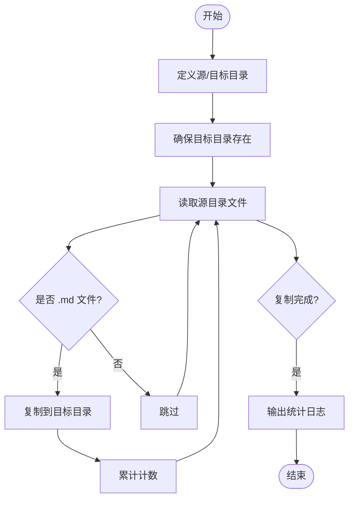
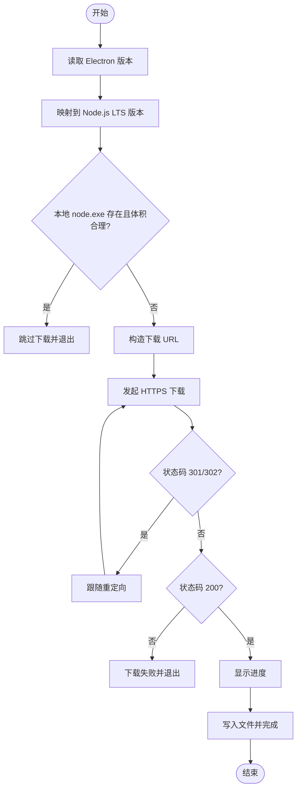
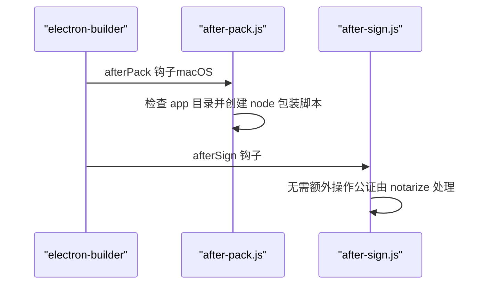
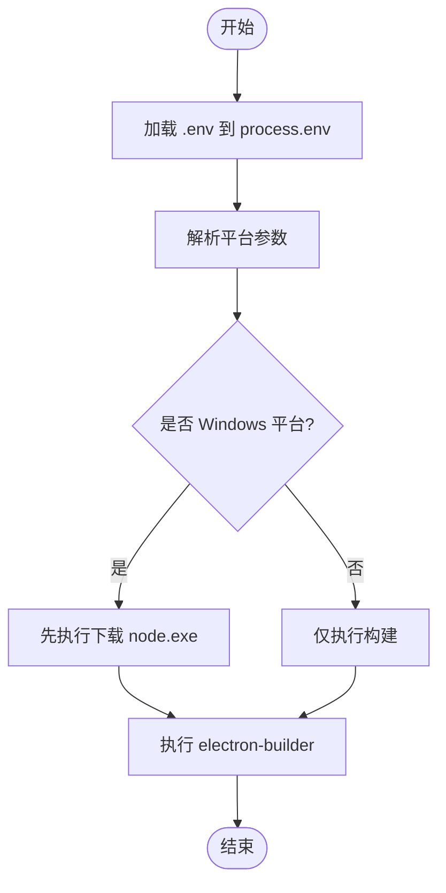
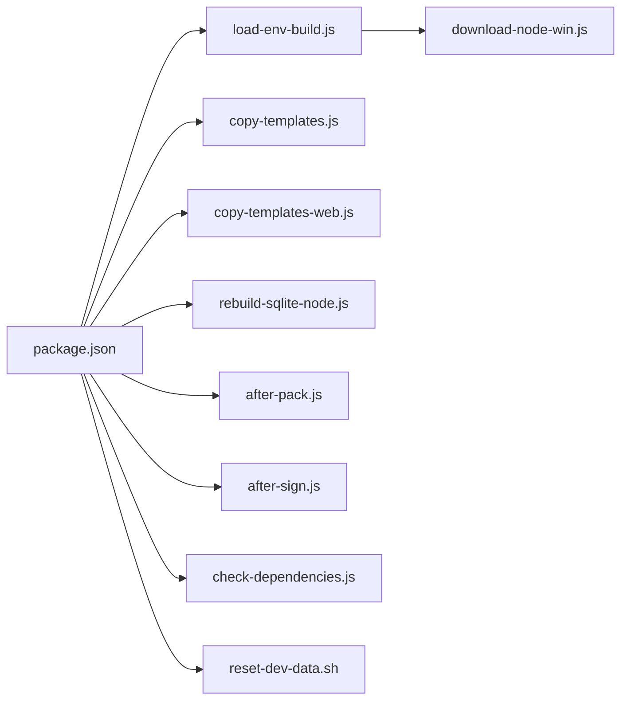

# 构建脚本系统

<cite>
**本文档引用的文件**
- [check-dependencies.js](file://scripts/check-dependencies.js)
- [copy-templates.js](file://scripts/copy-templates.js)
- [copy-templates-web.js](file://scripts/copy-templates-web.js)
- [download-node-win.js](file://scripts/download-node-win.js)
- [rebuild-sqlite-node.js](file://scripts/rebuild-sqlite-node.js)
- [after-pack.js](file://scripts/after-pack.js)
- [after-sign.js](file://scripts/after-sign.js)
- [load-env-build.js](file://scripts/load-env-build.js)
- [reset-dev-data.sh](file://scripts/reset-dev-data.sh)
- [package.json](file://package.json)
</cite>

## 目录
1. [简介](#简介)
2. [项目结构](#项目结构)
3. [核心组件](#核心组件)
4. [架构总览](#架构总览)
5. [详细组件分析](#详细组件分析)
6. [依赖关系分析](#依赖关系分析)
7. [性能考虑](#性能考虑)
8. [故障排除指南](#故障排除指南)
9. [结论](#结论)
10. [附录](#附录)

## 简介
本文件系统性梳理 DeepBot 的构建脚本体系，覆盖依赖检查、模板复制、平台特定下载与重建、打包后处理以及环境加载等关键环节。文档重点解释各脚本的功能、执行顺序、参数传递与错误处理机制，并提供自定义构建脚本的开发指南，帮助开发者在不同平台上稳定复现构建流程。

## 项目结构
构建脚本集中于 scripts/ 目录，配合 package.json 的 scripts 字段与 electron-builder 配置协同工作。核心脚本包括：
- 依赖检查：确保打包时不会遗漏子依赖
- 模板复制：将 Prompt 模板复制到 Electron 与 Web 构建产物目录
- 平台特定：Windows 节点下载与 SQLite 重建
- 打包后处理：macOS 包装脚本创建与公证钩子
- 环境加载：在打包前加载 .env 变量并触发构建命令
- 开发辅助：重置开发数据脚本

图表来源
- [package.json:9-44](file://package.json#L9-L44)
- [load-env-build.js:28-38](file://scripts/load-env-build.js#L28-L38)
- [download-node-win.js:34-40](file://scripts/download-node-win.js#L34-L40)
- [copy-templates.js:10-12](file://scripts/copy-templates.js#L10-L12)
- [copy-templates-web.js:8-9](file://scripts/copy-templates-web.js#L8-L9)
- [rebuild-sqlite-node.js:9-11](file://scripts/rebuild-sqlite-node.js#L9-L11)
- [after-pack.js:10-14](file://scripts/after-pack.js#L10-L14)
- [after-sign.js:7-11](file://scripts/after-sign.js#L7-L11)
- [check-dependencies.js:10-22](file://scripts/check-dependencies.js#L10-L22)

章节来源
- [package.json:9-44](file://package.json#L9-L44)

## 核心组件
- 依赖检查脚本：扫描主依赖及其子依赖，检测缺失项并给出修复建议
- 模板复制脚本：将 Markdown 模板复制到 Electron 与 Web 构建产物目录
- 平台特定脚本：Windows 节点下载与 SQLite 重建
- 打包后处理脚本：after-pack.js 与 after-sign.js，分别在签名前后执行
- 环境加载脚本：加载 .env 变量并统一触发打包命令
- 开发辅助脚本：重置开发数据

章节来源
- [check-dependencies.js:10-106](file://scripts/check-dependencies.js#L10-L106)
- [copy-templates.js:10-72](file://scripts/copy-templates.js#L10-L72)
- [copy-templates-web.js:8-30](file://scripts/copy-templates-web.js#L8-L30)
- [download-node-win.js:16-95](file://scripts/download-node-win.js#L16-L95)
- [rebuild-sqlite-node.js:9-23](file://scripts/rebuild-sqlite-node.js#L9-L23)
- [after-pack.js:10-45](file://scripts/after-pack.js#L10-L45)
- [after-sign.js:7-11](file://scripts/after-sign.js#L7-L11)
- [load-env-build.js:10-38](file://scripts/load-env-build.js#L10-L38)
- [reset-dev-data.sh:8-65](file://scripts/reset-dev-data.sh#L8-L65)

## 架构总览
下图展示从命令入口到最终产物的关键流程，涵盖依赖检查、模板复制、平台特定处理、打包与公证。

图表来源
- [package.json:25-28](file://package.json#L25-L28)
- [load-env-build.js:28-38](file://scripts/load-env-build.js#L28-L38)
- [download-node-win.js:34-40](file://scripts/download-node-win.js#L34-L40)
- [after-pack.js:10-14](file://scripts/after-pack.js#L10-L14)
- [after-sign.js:7-11](file://scripts/after-sign.js#L7-L11)

## 详细组件分析

### 依赖检查脚本（check-dependencies.js）
- 功能概述
  - 读取项目依赖，遍历每个依赖的 package.json，检查其子依赖是否存在于 node_modules
  - 对关键依赖进行特别检查，输出缺失项并提示运行安装命令
- 关键逻辑
  - 读取 package.json 的 dependencies
  - 遍历每个依赖，解析其 package.json 的 dependencies
  - 检查子依赖目录是否存在，收集缺失项
  - 输出汇总并建议执行安装
- 错误处理
  - 解析子依赖包信息异常时记录错误并继续
  - 最终根据缺失列表决定退出码
- 性能与复杂度
  - 时间复杂度近似 O(D + S)，D 为主依赖数，S 为子依赖总数
  - I/O 主要集中在文件系统读取与 JSON 解析

图表来源
- [check-dependencies.js:12-103](file://scripts/check-dependencies.js#L12-L103)

章节来源
- [check-dependencies.js:10-106](file://scripts/check-dependencies.js#L10-L106)

### 模板复制脚本（Electron：copy-templates.js）
- 功能概述
  - 将 src/main/prompts/templates 下的所有 .md 文件复制到 dist-electron/main/prompts/templates
  - 确保构建产物中包含 Prompt 模板文件
- 关键逻辑
  - 定义源目录与目标目录
  - 递归创建目标目录
  - 读取源目录文件列表，仅复制 .md 文件
  - 统计复制数量并输出日志
- 错误处理
  - 源目录不存在时直接退出
  - 复制过程中异常捕获并退出

图表来源
- [copy-templates.js:10-63](file://scripts/copy-templates.js#L10-L63)

章节来源
- [copy-templates.js:10-72](file://scripts/copy-templates.js#L10-L72)

### 模板复制脚本（Web：copy-templates-web.js）
- 功能概述
  - 将相同模板复制到 Web 服务器构建目录 dist-server/main/prompts/templates
- 关键逻辑
  - 读取源目录文件列表，复制所有 .md 文件
  - 递归创建目标目录
  - 输出复制数量日志

章节来源
- [copy-templates-web.js:8-30](file://scripts/copy-templates-web.js#L8-L30)

### Windows 节点下载脚本（download-node-win.js）
- 功能概述
  - 在 Windows 平台上下载独立的 node.exe，供 agent-browser 的 Rust 二进制在运行时调用
  - 下载地址基于 Electron 版本推导的 Node.js LTS 版本
- 关键逻辑
  - 从 package.json 读取 Electron 版本，映射到 Node.js LTS 版本
  - 若本地已存在且体积合理则跳过下载
  - 支持 301/302 重定向处理，显示下载进度
  - 输出下载完成或失败信息
- 错误处理
  - 重定向次数过多、HTTP 非 200、IO 异常均导致进程退出

图表来源
- [download-node-win.js:16-94](file://scripts/download-node-win.js#L16-L94)

章节来源
- [download-node-win.js:16-95](file://scripts/download-node-win.js#L16-L95)

### SQLite 重建脚本（rebuild-sqlite-node.js）
- 功能概述
  - 在非 Electron（Web 服务器模式）下，将 better-sqlite3 重新编译为目标系统 Node.js 版本
- 关键逻辑
  - 定位 better-sqlite3 目录
  - 使用 node-gyp rebuild 执行重建
  - 输出结果并处理异常

章节来源
- [rebuild-sqlite-node.js:9-23](file://scripts/rebuild-sqlite-node.js#L9-L23)

### 打包后处理脚本（after-pack.js / after-sign.js）
- 功能概述
  - after-pack.js：在 macOS 打包完成后、签名前创建 node 包装脚本，确保其被签名范围覆盖
  - after-sign.js：macOS 签名后阶段，无需额外操作，公证由 electron-builder 内置 notarize 处理
- 关键逻辑
  - after-pack.js 仅在 darwin 平台执行
  - 计算 app 路径与 Resources/app 目录，创建可执行的 node 包装脚本
  - after-sign.js 保持空实现，避免重复操作

图表来源
- [after-pack.js:10-45](file://scripts/after-pack.js#L10-L45)
- [after-sign.js:7-11](file://scripts/after-sign.js#L7-L11)

章节来源
- [after-pack.js:10-45](file://scripts/after-pack.js#L10-L45)
- [after-sign.js:7-11](file://scripts/after-sign.js#L7-L11)

### 环境加载与打包脚本（load-env-build.js）
- 功能概述
  - 在执行 electron-builder 前加载 .env 文件中的环境变量，确保公证等步骤可用
  - 根据传入的平台参数选择是否先执行 Windows 节点下载
- 关键逻辑
  - 读取 .env 文件并注入 process.env
  - 解析命令行参数（--mac/--win），拼接构建命令
  - 使用 execSync 同步执行构建命令，继承环境变量

图表来源
- [load-env-build.js:10-38](file://scripts/load-env-build.js#L10-L38)

章节来源
- [load-env-build.js:10-38](file://scripts/load-env-build.js#L10-L38)

### 开发数据重置脚本（reset-dev-data.sh）
- 功能概述
  - 清理用户目录下的 DeepBot 开发数据，模拟首次启动
  - 删除系统配置、定时任务、Skill 管理等数据库文件
- 关键逻辑
  - 检查目录是否存在
  - 列出将要删除的数据库文件
  - 用户确认后执行删除并输出提示

章节来源
- [reset-dev-data.sh:8-65](file://scripts/reset-dev-data.sh#L8-L65)

## 依赖关系分析
- 脚本间耦合
  - load-env-build.js 是打包入口，条件性地串联 download-node-win.js 与 electron-builder
  - copy-templates.js 与 copy-templates-web.js 分别服务于 Electron 与 Web 构建产物
  - after-pack.js 与 after-sign.js 与 electron-builder 配置强耦合
- 外部依赖
  - electron-builder 配置在 package.json 中集中管理
  - Windows 平台需要 node.exe，由 download-node-win.js 提供
  - macOS 平台需要公证，由 after-pack.js 创建包装脚本，after-sign.js 交由 notarize 处理

图表来源
- [package.json:9-44](file://package.json#L9-L44)
- [load-env-build.js:28-38](file://scripts/load-env-build.js#L28-L38)
- [download-node-win.js:34-40](file://scripts/download-node-win.js#L34-L40)
- [copy-templates.js:10-12](file://scripts/copy-templates.js#L10-L12)
- [copy-templates-web.js:8-9](file://scripts/copy-templates-web.js#L8-L9)
- [rebuild-sqlite-node.js:9-11](file://scripts/rebuild-sqlite-node.js#L9-L11)
- [after-pack.js:10-14](file://scripts/after-pack.js#L10-L14)
- [after-sign.js:7-11](file://scripts/after-sign.js#L7-L11)
- [check-dependencies.js:10-22](file://scripts/check-dependencies.js#L10-L22)
- [reset-dev-data.sh:8-17](file://scripts/reset-dev-data.sh#L8-L17)

章节来源
- [package.json:112-227](file://package.json#L112-L227)

## 性能考虑
- I/O 优化
  - 模板复制脚本仅复制 .md 文件，减少无关文件传输
  - Windows 节点下载脚本对本地文件进行体积校验，避免重复下载
- 并行与顺序
  - 依赖检查脚本串行遍历依赖，建议在 CI 中结合缓存策略提升整体效率
- 构建产物精简
  - electron-builder 的 files 白名单与过滤规则有效控制打包体积

## 故障排除指南
- 依赖缺失
  - 现象：after-pack.js 报告 app 目录不存在或 node 包装脚本创建失败
  - 排查：确认构建已完成且路径正确；检查 macOS 平台 afterPack 钩子是否执行
- Windows 平台无法运行
  - 现象：缺少 node.exe 导致 agent-browser 无法启动
  - 排查：确认 download-node-win.js 成功下载并位于打包 files 列表中
- 公证失败
  - 现象：Apple 公证报错
  - 排查：确认 .env 中 APPLE_ID 等变量已加载；after-pack.js 已创建 node 包装脚本并纳入签名
- SQLite 编译失败
  - 现象：better-sqlite3 在非 Electron 环境无法加载
  - 排查：执行 rebuild-sqlite-node.js，确保与当前 Node.js 版本匹配

章节来源
- [after-pack.js:22-25](file://scripts/after-pack.js#L22-L25)
- [download-node-win.js:34-40](file://scripts/download-node-win.js#L34-L40)
- [load-env-build.js:10-26](file://scripts/load-env-build.js#L10-L26)
- [rebuild-sqlite-node.js:13-22](file://scripts/rebuild-sqlite-node.js#L13-L22)

## 结论
DeepBot 的构建脚本系统围绕“环境准备—模板复制—平台特定处理—打包与公证”形成闭环。通过明确的执行顺序、参数传递与错误处理机制，确保在多平台环境下稳定复现构建流程。建议在团队内统一使用 load-env-build.js 作为打包入口，并在 CI 中预热依赖与缓存，以进一步提升构建稳定性与效率。

## 附录
- 自定义构建脚本开发指南
  - 命名规范：以功能命名，如 copy-templates.js、download-node-win.js
  - 参数传递：通过 process.argv 获取平台参数；通过 .env 注入环境变量
  - 错误处理：对关键步骤进行 try/catch 与进程退出码控制
  - 与 electron-builder 集成：在 package.json 的 build 配置中注册钩子
  - 日志输出：统一使用 console.log 输出状态，便于 CI 查看
  - 平台适配：在脚本内部判断平台（如 darwin/win32/linux），仅在适用平台执行