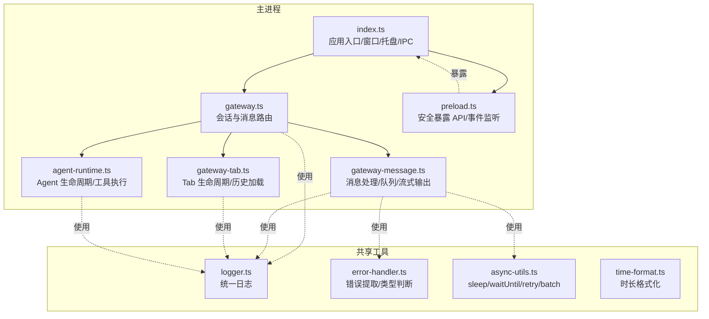
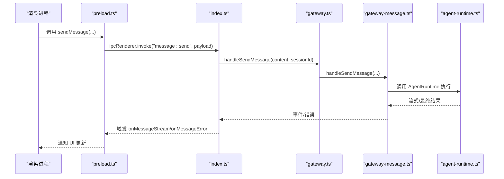
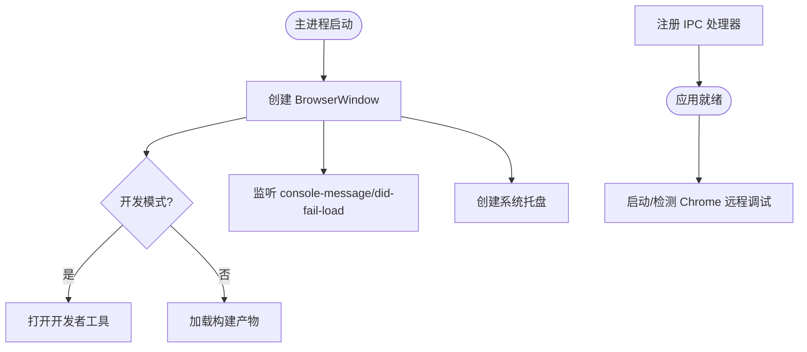
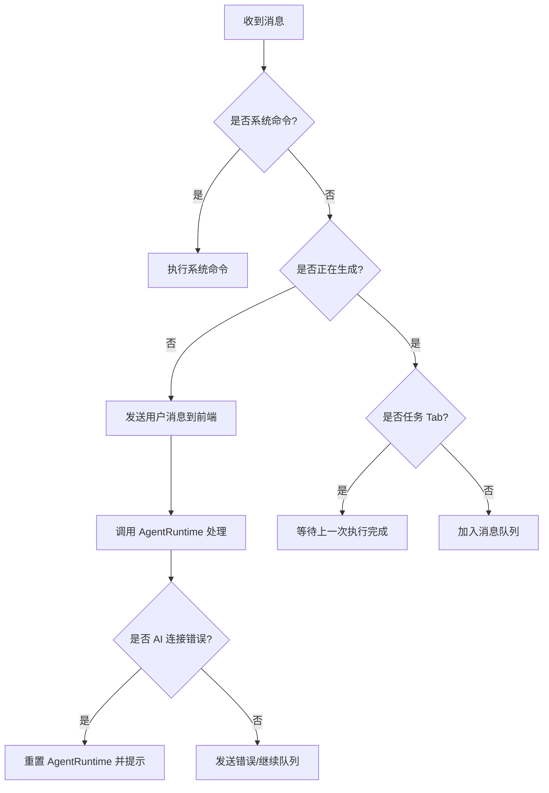
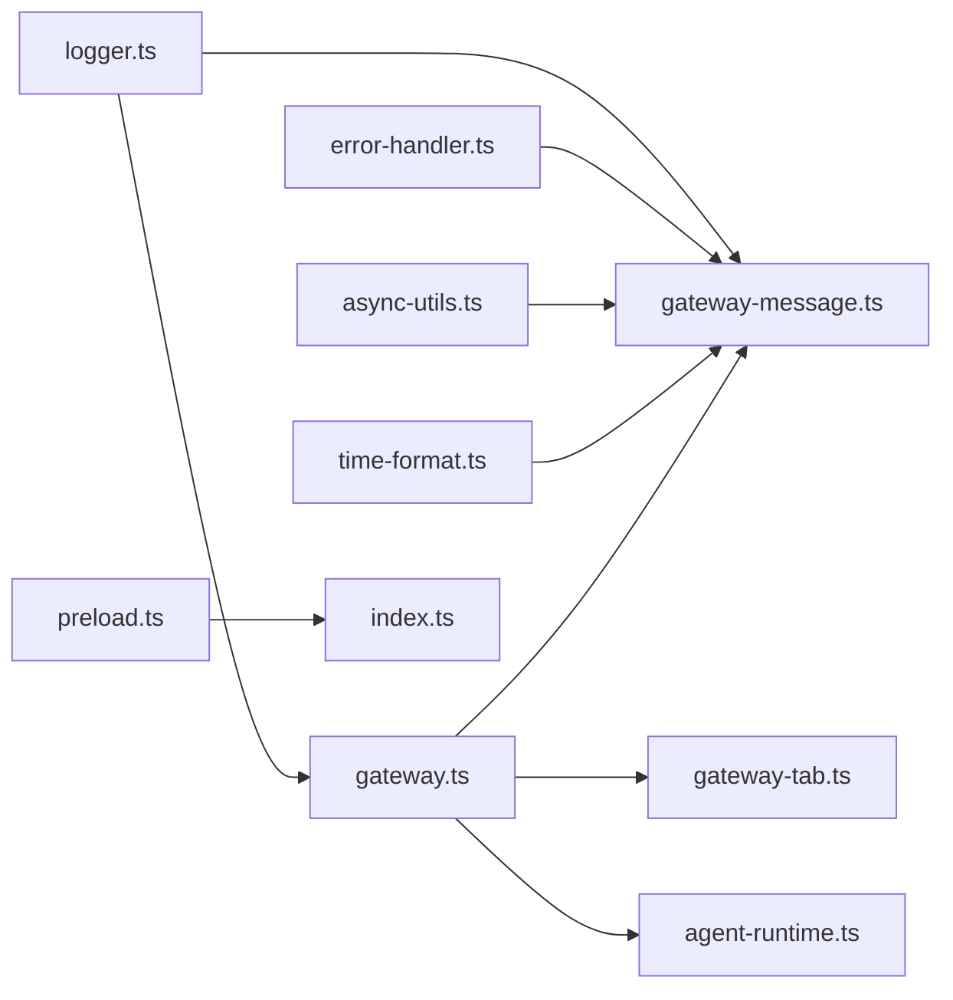

# 调试和监控

<cite>
**本文档引用的文件**
- [logger.ts](file://src/shared/utils/logger.ts)
- [error-handler.ts](file://src/shared/utils/error-handler.ts)
- [index.ts](file://src/main/index.ts)
- [gateway.ts](file://src/main/gateway.ts)
- [gateway-message.ts](file://src/main/gateway-message.ts)
- [gateway-tab.ts](file://src/main/gateway-tab.ts)
- [agent-runtime.ts](file://src/main/agent-runtime/agent-runtime.ts)
- [preload.ts](file://src/main/preload.ts)
- [async-utils.ts](file://src/shared/utils/async-utils.ts)
- [time-format.ts](file://src/shared/utils/time-format.ts)
- [package.json](file://package.json)
</cite>

## 目录
1. [简介](#简介)
2. [项目结构](#项目结构)
3. [核心组件](#核心组件)
4. [架构总览](#架构总览)
5. [详细组件分析](#详细组件分析)
6. [依赖关系分析](#依赖关系分析)
7. [性能考虑](#性能考虑)
8. [故障排查指南](#故障排查指南)
9. [结论](#结论)
10. [附录](#附录)

## 简介
本指南面向 DeepBot 的调试与监控体系，覆盖日志系统配置与使用、错误处理与异常捕获策略、Electron 应用主进程与渲染进程调试技巧、性能监控指标与分析工具、远程调试与生产环境问题排查，以及调试工具链配置与自动化监控建议。目标是帮助开发者快速定位问题、优化性能，并在生产环境中稳定运行。

## 项目结构
DeepBot 采用 Electron + TypeScript 架构，主进程负责窗口、IPC、网关与工具调度，渲染进程承载 UI 与交互；共享工具提供日志、错误处理、异步工具等基础能力。

图表来源
- [index.ts:119-331](file://src/main/index.ts#L119-L331)
- [gateway.ts:29-114](file://src/main/gateway.ts#L29-L114)
- [gateway-message.ts:31-71](file://src/main/gateway-message.ts#L31-L71)
- [gateway-tab.ts:26-61](file://src/main/gateway-tab.ts#L26-L61)
- [agent-runtime.ts:27-188](file://src/main/agent-runtime/agent-runtime.ts#L27-L188)
- [preload.ts:75-409](file://src/main/preload.ts#L75-L409)
- [logger.ts:16-144](file://src/shared/utils/logger.ts#L16-L144)
- [error-handler.ts:8-50](file://src/shared/utils/error-handler.ts#L8-L50)
- [async-utils.ts:16-175](file://src/shared/utils/async-utils.ts#L16-L175)
- [time-format.ts:16-49](file://src/shared/utils/time-format.ts#L16-L49)

章节来源
- [index.ts:119-331](file://src/main/index.ts#L119-L331)
- [gateway.ts:29-114](file://src/main/gateway.ts#L29-L114)
- [gateway-message.ts:31-71](file://src/main/gateway-message.ts#L31-L71)
- [gateway-tab.ts:26-61](file://src/main/gateway-tab.ts#L26-L61)
- [agent-runtime.ts:27-188](file://src/main/agent-runtime/agent-runtime.ts#L27-L188)
- [preload.ts:75-409](file://src/main/preload.ts#L75-L409)
- [logger.ts:16-144](file://src/shared/utils/logger.ts#L16-L144)
- [error-handler.ts:8-50](file://src/shared/utils/error-handler.ts#L8-L50)
- [async-utils.ts:16-175](file://src/shared/utils/async-utils.ts#L16-L175)
- [time-format.ts:16-49](file://src/shared/utils/time-format.ts#L16-L49)

## 核心组件
- 日志系统：统一 Logger，支持模块化、级别过滤、文件落盘与安全控制台输出。
- 错误处理：统一错误提取、类型判断、错误响应封装。
- 主进程：窗口创建、托盘、IPC 注册、渲染进程控制台与错误监听、快捷键调试。
- 网关与消息：消息队列、流式输出、系统命令、AI 连接错误自动恢复。
- 渲染进程桥接：安全暴露 API、事件监听、任务监控、连接器管理。
- 异步工具：sleep、withTimeout、waitUntil、retry、batchExecute。
- 性能辅助：时长格式化、超时配置、重试与并发控制。

章节来源
- [logger.ts:9-144](file://src/shared/utils/logger.ts#L9-L144)
- [error-handler.ts:8-50](file://src/shared/utils/error-handler.ts#L8-L50)
- [index.ts:148-176](file://src/main/index.ts#L148-L176)
- [gateway-message.ts:76-160](file://src/main/gateway-message.ts#L76-L160)
- [preload.ts:75-409](file://src/main/preload.ts#L75-L409)
- [async-utils.ts:16-175](file://src/shared/utils/async-utils.ts#L16-L175)
- [time-format.ts:16-49](file://src/shared/utils/time-format.ts#L16-L49)

## 架构总览
主进程负责应用生命周期与 IPC，网关协调会话与消息路由，AgentRuntime 协调工具与模型调用，渲染进程通过 preload 暴露安全 API 与事件订阅。

图表来源
- [preload.ts:75-409](file://src/main/preload.ts#L75-L409)
- [index.ts:336-421](file://src/main/index.ts#L336-L421)
- [gateway.ts:455-458](file://src/main/gateway.ts#L455-L458)
- [gateway-message.ts:76-160](file://src/main/gateway-message.ts#L76-L160)
- [agent-runtime.ts:193-200](file://src/main/agent-runtime/agent-runtime.ts#L193-L200)

## 详细组件分析

### 日志系统
- 级别与输出
  - 级别：DEBUG/INFO/WARN/ERROR，支持全局级别与模块级别。
  - 控制台：带模块前缀与表情符号，安全输出（EPIPE 捕获）。
  - 文件：按模块与时间戳落盘，启动时追加分隔符。
- 配置与使用
  - 通过 createLogger(module, enableFileLogging) 创建实例。
  - setGlobalLogLevel 可调整全局级别；setFileLogging 可动态开关文件日志。
  - getLogFilePath 获取日志文件路径，便于收集与上传。
- 建议
  - 开发阶段可开启文件日志，生产环境谨慎开启，避免磁盘压力。
  - 对关键流程（AgentRuntime 初始化、消息发送、工具执行）增加日志点。

章节来源
- [logger.ts:9-144](file://src/shared/utils/logger.ts#L9-L144)
- [logger.ts:152-174](file://src/shared/utils/logger.ts#L152-L174)

### 错误处理与异常捕获
- 统一错误提取与类型判断
  - getErrorMessage：兼容 Error 与任意值。
  - isErrorType/isAbortError/isCancelError：快速识别错误类型。
- 错误响应
  - createErrorResponse：标准化错误响应结构。
- 主流程中的使用
  - IPC 处理器对异常进行捕获并返回错误响应。
  - 网关消息处理器对 AI 连接错误进行自动恢复与降级处理。

章节来源
- [error-handler.ts:8-50](file://src/shared/utils/error-handler.ts#L8-L50)
- [index.ts:369-378](file://src/main/index.ts#L369-L378)
- [gateway-message.ts:142-153](file://src/main/gateway-message.ts#L142-L153)

### Electron 主进程调试
- 窗口与托盘
  - 创建窗口、系统托盘、右键菜单、外部链接拦截与保存图片。
- 渲染进程调试
  - 监听 console-message 与 did-fail-load，生产环境仍可通过快捷键 Cmd+Option+I 打开开发者工具。
- IPC 与事件
  - 注册大量 IPC 处理器，涵盖消息发送、停止生成、技能管理、定时任务、环境检查、工作目录配置、文件上传/下载等。
- 远程调试
  - 提供启动 Chrome 并开启远程调试端口的能力，跨平台命令拼装与就绪检测。

图表来源
- [index.ts:148-176](file://src/main/index.ts#L148-L176)
- [index.ts:336-522](file://src/main/index.ts#L336-L522)
- [index.ts:904-999](file://src/main/index.ts#L904-L999)

章节来源
- [index.ts:148-176](file://src/main/index.ts#L148-L176)
- [index.ts:336-522](file://src/main/index.ts#L336-L522)
- [index.ts:904-999](file://src/main/index.ts#L904-L999)

### 渲染进程桥接与调试
- 安全暴露 API
  - 通过 contextBridge.exposeInMainWorld 暴露 sendMessage、stopGeneration、技能管理、定时任务、工作目录、图片/文件上传、连接器管理、任务监控等。
- 事件监听
  - onMessageStream/onMessageError/onExecutionStepUpdate/onClearAllMessages 等事件驱动 UI 更新。
- 任务监控
  - onMainTaskCreated/onMainTaskUpdated/onSubTaskAdded/onSubTaskUpdated/onTasksCleared 等事件驱动任务面板刷新。

章节来源
- [preload.ts:75-409](file://src/main/preload.ts#L75-L409)

### 网关与消息处理
- 消息队列与并发
  - 每个会话独立队列，正在生成时普通 Tab 入队，任务 Tab 等待上一次执行完成。
- 流式输出与错误恢复
  - 通过 onMessageStream 推送增量内容；AI 连接错误自动重置 AgentRuntime 并提示。
- 系统命令
  - 以 “/” 开头的命令（如 new/memory/history/reload-env）直接执行，绕过 Agent。

图表来源
- [gateway-message.ts:76-160](file://src/main/gateway-message.ts#L76-L160)
- [gateway-message.ts:165-196](file://src/main/gateway-message.ts#L165-L196)

章节来源
- [gateway-message.ts:76-160](file://src/main/gateway-message.ts#L76-L160)
- [gateway-message.ts:165-196](file://src/main/gateway-message.ts#L165-L196)

### AgentRuntime 生命周期与工具执行
- 初始化与配置
  - 从系统配置读取模型参数，推断上下文窗口与 maxTokens，打印调试信息。
- 工具执行与重复检测
  - 使用 OperationTracker 进行重复操作检测与统计，支持清空追踪记录。
- 销毁与重置
  - 支持按会话销毁 Runtime，配合网关进行自动重置与恢复。

章节来源
- [agent-runtime.ts:65-188](file://src/main/agent-runtime/agent-runtime.ts#L65-L188)
- [agent-runtime.ts:193-200](file://src/main/agent-runtime/agent-runtime.ts#L193-L200)

### 异步工具与性能辅助
- sleep：延时等待。
- withTimeout：竞速超时控制。
- waitUntil：轮询等待条件满足，支持进度回调。
- retry：带退避的重试执行。
- batchExecute：并发控制的批量执行。
- formatDuration：将毫秒转为可读时长。

章节来源
- [async-utils.ts:16-175](file://src/shared/utils/async-utils.ts#L16-L175)
- [time-format.ts:16-49](file://src/shared/utils/time-format.ts#L16-L49)

## 依赖关系分析
- 主进程依赖
  - index.ts 依赖 gateway.ts、ipc 处理器、preload 暴露的 API。
  - gateway.ts 依赖 gateway-message.ts、gateway-tab.ts、agent-runtime.ts。
- 日志与错误
  - 网关与消息处理器广泛使用 logger.ts 与 error-handler.ts。
- 渲染进程
  - 通过 preload.ts 暴露 API，监听事件，驱动 UI。

图表来源
- [gateway.ts:29-114](file://src/main/gateway.ts#L29-L114)
- [gateway-message.ts:31-71](file://src/main/gateway-message.ts#L31-L71)
- [gateway-tab.ts:26-61](file://src/main/gateway-tab.ts#L26-L61)
- [agent-runtime.ts:27-188](file://src/main/agent-runtime/agent-runtime.ts#L27-L188)
- [preload.ts:75-409](file://src/main/preload.ts#L75-L409)
- [logger.ts:16-144](file://src/shared/utils/logger.ts#L16-L144)
- [error-handler.ts:8-50](file://src/shared/utils/error-handler.ts#L8-L50)
- [async-utils.ts:16-175](file://src/shared/utils/async-utils.ts#L16-L175)
- [time-format.ts:16-49](file://src/shared/utils/time-format.ts#L16-L49)

章节来源
- [gateway.ts:29-114](file://src/main/gateway.ts#L29-L114)
- [gateway-message.ts:31-71](file://src/main/gateway-message.ts#L31-L71)
- [gateway-tab.ts:26-61](file://src/main/gateway-tab.ts#L26-L61)
- [agent-runtime.ts:27-188](file://src/main/agent-runtime/agent-runtime.ts#L27-L188)
- [preload.ts:75-409](file://src/main/preload.ts#L75-L409)
- [logger.ts:16-144](file://src/shared/utils/logger.ts#L16-L144)
- [error-handler.ts:8-50](file://src/shared/utils/error-handler.ts#L8-L50)
- [async-utils.ts:16-175](file://src/shared/utils/async-utils.ts#L16-L175)
- [time-format.ts:16-49](file://src/shared/utils/time-format.ts#L16-L49)

## 性能考虑
- 并发与批处理
  - 使用 batchExecute 控制并发度，避免资源争用。
- 超时与重试
  - withTimeout 与 retry 配合，提升稳定性与用户体验。
- 等待与轮询
  - waitUntil 提供可控轮询，支持进度回调，避免忙等。
- 时长展示
  - formatDuration 将毫秒转换为可读格式，便于 UI 展示与日志分析。

章节来源
- [async-utils.ts:16-175](file://src/shared/utils/async-utils.ts#L16-L175)
- [time-format.ts:16-49](file://src/shared/utils/time-format.ts#L16-L49)

## 故障排查指南

### 日志与文件
- 启用文件日志
  - 在需要时通过 Logger.setFileLogging(true) 开启文件落盘，便于收集。
- 日志路径
  - 使用 Logger.getLogFilePath() 获取日志文件路径，生产环境可定期归档。
- 控制台输出
  - 主进程监听渲染进程 console-message，可在控制台查看渲染侧日志。

章节来源
- [logger.ts:74-101](file://src/shared/utils/logger.ts#L74-L101)
- [logger.ts:135-137](file://src/shared/utils/logger.ts#L135-L137)
- [index.ts:161-164](file://src/main/index.ts#L161-L164)

### 错误类型与恢复
- 常见错误
  - AbortError/CancelError：用户取消或信号中断，需优雅终止。
  - AI 连接错误：自动重置 AgentRuntime 并提示，必要时引导用户检查网络/密钥。
- 统一响应
  - 使用 createErrorResponse 返回标准错误结构，前端统一处理。

章节来源
- [error-handler.ts:25-34](file://src/shared/utils/error-handler.ts#L25-L34)
- [gateway-message.ts:146-152](file://src/main/gateway-message.ts#L146-L152)

### 主进程调试要点
- 开发模式
  - VITE_DEV_SERVER_URL 下自动打开开发者工具，便于联调。
- 生产模式
  - 仍可通过 Cmd+Option+I 快捷键打开开发者工具。
- 渲染进程错误
  - 监听 did-fail-load，定位页面加载失败原因。
- 托盘与窗口行为
  - 检查最小化到托盘、窗口关闭事件与图标资源路径。

章节来源
- [index.ts:148-176](file://src/main/index.ts#L148-L176)
- [index.ts:166-169](file://src/main/index.ts#L166-L169)
- [index.ts:182-197](file://src/main/index.ts#L182-L197)

### 渲染进程调试要点
- 事件监听
  - onMessageStream/onMessageError/onExecutionStepUpdate/onClearAllMessages 等事件驱动 UI 更新，排查时优先确认事件是否触发。
- 任务监控
  - 通过任务相关事件确认任务生命周期与状态变更。
- 连接器与工具
  - 使用 connectorGetAll/connectorStart/connectorStop 等 IPC 接口验证连接器状态。

章节来源
- [preload.ts:340-409](file://src/main/preload.ts#L340-L409)
- [preload.ts:290-338](file://src/main/preload.ts#L290-L338)

### 远程调试与生产问题
- Chrome 远程调试
  - 通过 LAUNCH_CHROME_WITH_DEBUG 启动/检测 Chrome，跨平台命令拼装与就绪检测，便于生产环境排查。
- 生产日志
  - 建议开启文件日志并定期归档，结合 getLogFilePath() 定位问题。
- 网络与超时
  - 使用 withTimeout 与 retry 降低外部依赖波动影响。

章节来源
- [index.ts:904-999](file://src/main/index.ts#L904-L999)
- [async-utils.ts:31-41](file://src/shared/utils/async-utils.ts#L31-L41)
- [logger.ts:74-101](file://src/shared/utils/logger.ts#L74-L101)

### 自动化监控建议
- 日志轮转
  - 实现日志清理逻辑（cleanupOldLogs），按天/大小轮转。
- 指标采集
  - 记录消息处理耗时、AgentRuntime 重置次数、工具执行成功率与失败堆栈。
- 告警
  - 对高频错误（如 AI 连接错误）与长时间等待（waitUntil 超时）设置阈值告警。

章节来源
- [logger.ts:142-144](file://src/shared/utils/logger.ts#L142-L144)
- [gateway-message.ts:165-196](file://src/main/gateway-message.ts#L165-L196)

## 结论
DeepBot 的调试与监控体系以统一日志、错误处理与主/渲染进程桥接为核心，辅以网关消息队列、AgentRuntime 生命周期管理与丰富的 IPC 能力，形成从开发到生产的完整闭环。建议在生产环境启用文件日志与错误恢复策略，结合远程调试与自动化监控，持续优化性能与稳定性。

## 附录

### 常用脚本与构建
- 开发与构建脚本定义于 package.json，包含 dev/dev:main/dev:renderer/build 等，便于本地联调与打包。

章节来源
- [package.json:9-44](file://package.json#L9-L44)