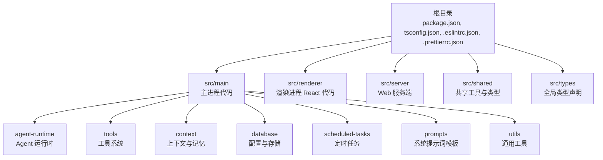
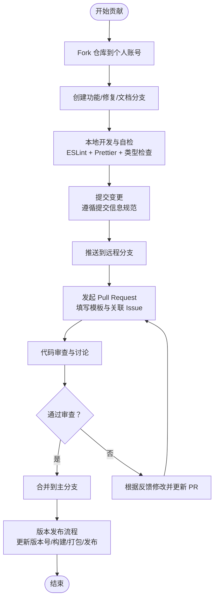
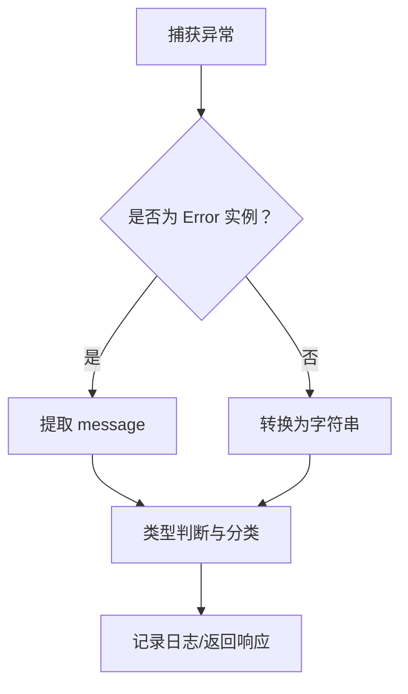
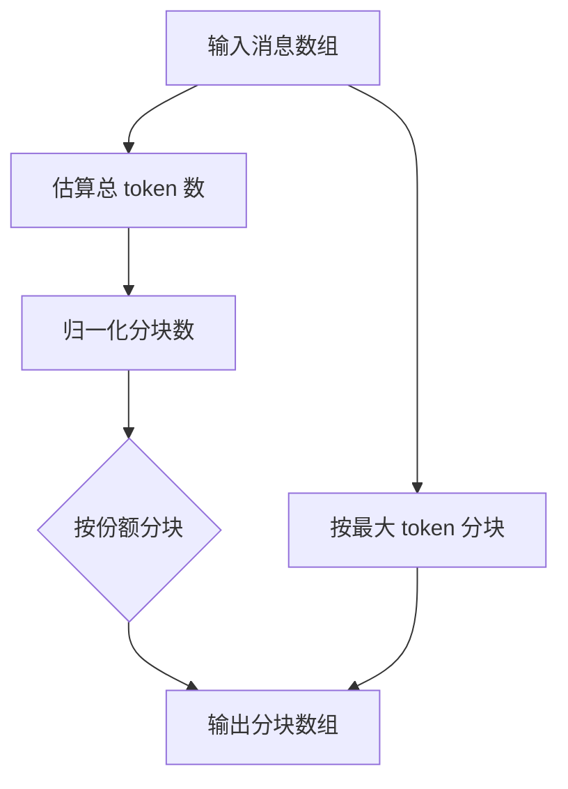
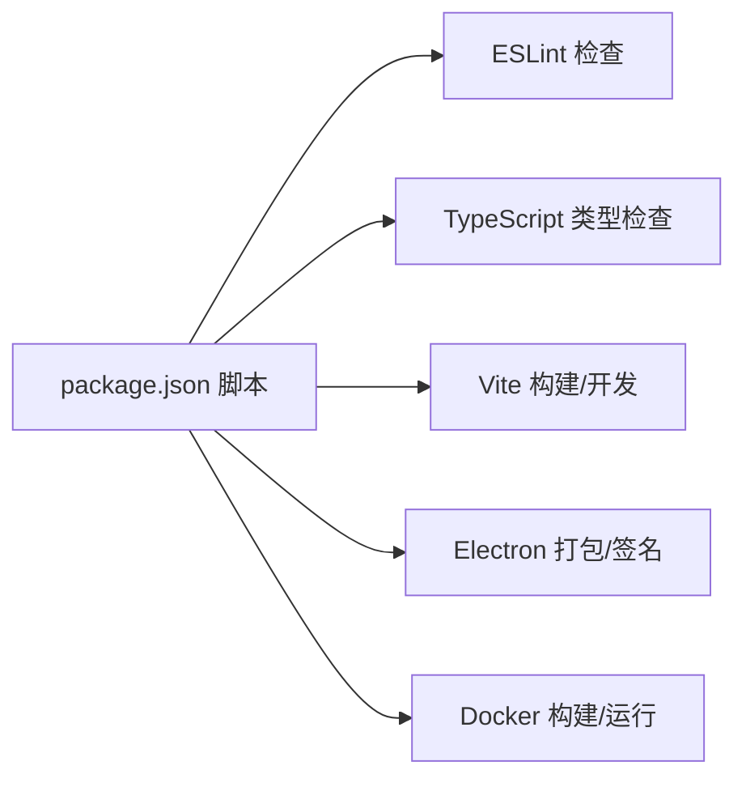

# 贡献指南

<cite>
**本文引用的文件**   
- [README.md](file://README.md)
- [RELEASE.md](file://RELEASE.md)
- [.eslintrc.json](file://.eslintrc.json)
- [.prettierrc.json](file://.prettierrc.json)
- [package.json](file://package.json)
- [tsconfig.json](file://tsconfig.json)
- [src/main/tools/registry/tool-interface.ts](file://src/main/tools/registry/tool-interface.ts)
- [src/main/tools/registry/tool-loader.ts](file://src/main/tools/registry/tool-loader.ts)
- [src/shared/utils/error-handler.ts](file://src/shared/utils/error-handler.ts)
- [src/main/config/constants.ts](file://src/main/config/constants.ts)
- [src/main/utils/message-chunker.ts](file://src/main/utils/message-chunker.ts)
</cite>

## 目录
1. [简介](#简介)
2. [项目结构](#项目结构)
3. [核心组件](#核心组件)
4. [架构总览](#架构总览)
5. [详细组件分析](#详细组件分析)
6. [依赖分析](#依赖分析)
7. [性能考虑](#性能考虑)
8. [故障排查指南](#故障排查指南)
9. [结论](#结论)
10. [附录](#附录)

## 简介
本指南面向 DeepBot 项目的贡献者，提供从 Fork、分支管理到 Pull Request 提交流程的完整规范；统一代码风格（ESLint 规则与 Prettier 格式化）、开发规范（命名、注释、错误处理）、测试要求与覆盖率标准、提交信息规范以及版本发布流程。同时给出新贡献者的入门路径与常见问题解答，帮助快速上手并高质量交付代码。

## 项目结构
DeepBot 采用多进程架构（Electron 主进程 + 渲染进程 + Web 服务端），核心代码位于 src/ 目录，包含主进程、渲染端、共享工具与类型定义。根目录提供构建、打包、发布与质量保障相关的配置文件。



图表来源
- [README.md: 708-727:708-727](file://README.md#L708-L727)
- [package.json: 1-235:1-235](file://package.json#L1-L235)

章节来源
- [README.md: 708-727:708-727](file://README.md#L708-L727)
- [package.json: 1-235:1-235](file://package.json#L1-L235)

## 核心组件
- 工具系统与加载器：工具接口定义与加载流程，支持内置工具的动态启用/禁用与配置注入。
- 错误处理工具：统一提取错误、类型判断与日志记录，便于调试与用户反馈。
- 配置常量：消息上限、重试策略、等待时间、文件大小与并发限制等关键参数。
- 消息分块工具：基于 token 的消息分块与统计，支撑上下文裁剪与摘要生成。

章节来源
- [src/main/tools/registry/tool-interface.ts: 1-152:1-152](file://src/main/tools/registry/tool-interface.ts#L1-L152)
- [src/main/tools/registry/tool-loader.ts: 1-312:1-312](file://src/main/tools/registry/tool-loader.ts#L1-L312)
- [src/shared/utils/error-handler.ts: 1-51:1-51](file://src/shared/utils/error-handler.ts#L1-L51)
- [src/main/config/constants.ts: 1-26:1-26](file://src/main/config/constants.ts#L1-L26)
- [src/main/utils/message-chunker.ts: 1-215:1-215](file://src/main/utils/message-chunker.ts#L1-L215)

## 架构总览
贡献流程围绕“Fork → 分支 → 提交 → PR → 审查 → 合并”的闭环展开。质量保障由 ESLint + Prettier + TypeScript 类型检查共同构成；发布流程遵循语义化版本与构建脚本。



图表来源
- [README.md: 708-727:708-727](file://README.md#L708-L727)
- [RELEASE.md: 1-268:1-268](file://RELEASE.md#L1-L268)
- [package.json: 9-44:9-44](file://package.json#L9-L44)

章节来源
- [README.md: 708-727:708-727](file://README.md#L708-L727)
- [RELEASE.md: 1-268:1-268](file://RELEASE.md#L1-L268)
- [package.json: 9-44:9-44](file://package.json#L9-L44)

## 详细组件分析

### 工具系统与加载器
- 工具接口定义：统一元数据、配置、生命周期钩子与加载结果，便于扩展与维护。
- 工具加载器：集中加载内置工具，支持按配置启用/禁用与动态读取用户配置；对各工具进行开关过滤与 Promise 处理，保证健壮性。

```mermaid
classDiagram
class ToolPlugin {
+metadata : ToolMetadata
+create(options) : AgentTool|AgentTool[]
+validateConfig?(config) : {valid,error?}
+initialize?(options) : void
+cleanup?() : void
}
class ToolMetadata {
+id : string
+name : string
+description : string
+version : string
+author?
+category?
+requiresConfig?
+configSchema?
+icon?
+tags?
}
class ToolLoader {
-registry : ToolRegistry
-workspaceDir : string
-sessionId : string
+loadAllTools(configStore?) : AgentTool[]
-loadToolConfigs() : void
-loadBuiltinTools(configStore?) : AgentTool[]
+getRegistry() : ToolRegistry
}
ToolLoader --> ToolPlugin : "加载/注册"
ToolPlugin --> ToolMetadata : "使用"
```

图表来源
- [src/main/tools/registry/tool-interface.ts: 30-152:30-152](file://src/main/tools/registry/tool-interface.ts#L30-L152)
- [src/main/tools/registry/tool-loader.ts: 40-312:40-312](file://src/main/tools/registry/tool-loader.ts#L40-L312)

章节来源
- [src/main/tools/registry/tool-interface.ts: 1-152:1-152](file://src/main/tools/registry/tool-interface.ts#L1-L152)
- [src/main/tools/registry/tool-loader.ts: 1-312:1-312](file://src/main/tools/registry/tool-loader.ts#L1-L312)

### 错误处理模式
- 统一错误提取与类型判断，支持 AbortError、用户取消等特殊场景。
- 提供日志记录与 HTTP 错误响应构造，便于前端与服务端一致化处理。



图表来源
- [src/shared/utils/error-handler.ts: 8-50:8-50](file://src/shared/utils/error-handler.ts#L8-L50)

章节来源
- [src/shared/utils/error-handler.ts: 1-51:1-51](file://src/shared/utils/error-handler.ts#L1-L51)

### 配置常量与上下文管理
- 关键常量：消息上限、重试次数与延迟、页面等待时间、文件大小与批处理数量、并发 Sub Agent 限制等。
- 消息分块：按 token 份额与最大 token 数进行分块，支持统计输出，辅助上下文裁剪与摘要生成。



图表来源
- [src/main/utils/message-chunker.ts: 33-121:33-121](file://src/main/utils/message-chunker.ts#L33-L121)
- [src/main/config/constants.ts: 4-25:4-25](file://src/main/config/constants.ts#L4-L25)

章节来源
- [src/main/config/constants.ts: 1-26:1-26](file://src/main/config/constants.ts#L1-L26)
- [src/main/utils/message-chunker.ts: 1-215:1-215](file://src/main/utils/message-chunker.ts#L1-L215)

## 依赖分析
- 质量工具链：ESLint（TypeScript/React 插件）、Prettier（统一格式）、TypeScript 编译与类型检查。
- 构建与发布：Vite（前端）、Electron（桌面）、electron-builder（打包与签名）、Docker（容器化）。
- 开发脚本：dev、build、lint、type-check、dist 等，覆盖开发、测试与发布全流程。



图表来源
- [package.json: 9-44:9-44](file://package.json#L9-L44)
- [.eslintrc.json: 1-35:1-35](file://.eslintrc.json#L1-L35)
- [.prettierrc.json: 1-11:1-11](file://.prettierrc.json#L1-L11)
- [tsconfig.json: 1-23:1-23](file://tsconfig.json#L1-L23)

章节来源
- [package.json: 9-44:9-44](file://package.json#L9-L44)
- [.eslintrc.json: 1-35:1-35](file://.eslintrc.json#L1-L35)
- [.prettierrc.json: 1-11:1-11](file://.prettierrc.json#L1-L11)
- [tsconfig.json: 1-23:1-23](file://tsconfig.json#L1-L23)

## 性能考虑
- 上下文裁剪：通过消息分块与 token 估算减少上下文长度，提升响应效率与稳定性。
- 并发与重试：合理设置重试次数与退避策略，避免瞬时抖动影响用户体验。
- 文件与网络：限制单次批量文件数量与大小，网络请求增加超时与取消信号支持。

章节来源
- [src/main/utils/message-chunker.ts: 33-121:33-121](file://src/main/utils/message-chunker.ts#L33-L121)
- [src/main/config/constants.ts: 9-25:9-25](file://src/main/config/constants.ts#L9-L25)

## 故障排查指南
- 本地开发问题：确认 Node.js 版本与依赖安装，使用类型检查与 lint 脚本先行定位问题。
- 打包与签名：按发布指南配置证书与公证参数，关注平台差异与输出产物。
- 错误处理：利用统一错误工具进行分类与日志记录，便于定位与回溯。

章节来源
- [RELEASE.md: 181-201:181-201](file://RELEASE.md#L181-L201)
- [src/shared/utils/error-handler.ts: 39-50:39-50](file://src/shared/utils/error-handler.ts#L39-L50)

## 结论
本指南提供了 DeepBot 项目的贡献流程、代码风格、开发规范、测试与发布要点。建议贡献者在提交前完成本地自检，并遵循 PR 审查流程与提交信息规范，确保代码质量与可维护性。

## 附录

### 代码风格与格式化
- ESLint 规则
  - 解析器与插件：TypeScript、React、JSX 运行时。
  - 环境：浏览器、Node、ES2022。
  - 规则要点：禁止未使用变量（忽略以 _ 开头的参数）、any 类型警告、控制台输出宽松策略。
  - 忽略模式：dist、node_modules、.js 文件。
- Prettier 格式化
  - 使用分号、尾随逗号、单引号、行长 100、缩进宽度 2、箭头函数括号始终添加、换行符 LF。

章节来源
- [.eslintrc.json: 1-35:1-35](file://.eslintrc.json#L1-L35)
- [.prettierrc.json: 1-11:1-11](file://.prettierrc.json#L1-L11)

### 开发规范与最佳实践
- 命名约定
  - 工具 ID 使用短横线分隔（kebab-case）。
  - 变量与函数使用小驼峰，类与接口首字母大写。
- 注释规范
  - 公共接口与复杂逻辑提供清晰注释，说明用途、参数与返回值。
- 错误处理
  - 使用统一错误工具进行分类与日志记录，区分用户取消、中止与普通异常。
  - 工具执行支持 AbortSignal，提供可取消能力。

章节来源
- [src/main/tools/registry/tool-interface.ts: 34-63:34-63](file://src/main/tools/registry/tool-interface.ts#L34-L63)
- [src/shared/utils/error-handler.ts: 8-50:8-50](file://src/shared/utils/error-handler.ts#L8-L50)

### 测试要求与覆盖率
- 当前仓库未提供测试框架配置与覆盖率统计脚本。建议新增：
  - 测试框架：Jest 或 Vitest。
  - 覆盖率：语句、分支、函数、行均达到 80% 以上。
  - 命令：新增 test 脚本与 coverage 脚本，并在 CI 中执行。

章节来源
- [package.json: 9-44:9-44](file://package.json#L9-L44)

### 提交信息规范
- 规范建议
  - 类型：feat、fix、docs、style、refactor、perf、test、build、ci、chore、revert。
  - 范围：模块或目录（如 main/tools、renderer/components）。
  - 描述：简洁明了，不超过 50 字；必要时在正文说明动机与影响。
- 示例
  - feat(main/tools): 新增文件工具的批量读取能力
  - fix(renderer): 修复主题切换导致的样式闪烁

章节来源
- [README.md: 708-727:708-727](file://README.md#L708-L727)

### 版本发布流程
- 版本管理：语义化版本，补丁、小版本、大版本变更。
- 发布前检查：更新版本号、类型检查、核心功能测试、更新变更日志。
- 构建与打包：按平台分别执行打包命令，产出 DMG/ZIP（macOS）、NSIS/Portable（Windows）、AppImage/deb（Linux）。
- 代码签名与公证：按平台配置证书与凭据，执行签名与公证流程。
- 发布渠道：GitHub Releases、自建下载服务器、企业内部分发。
- 自动更新：集成 electron-updater 并配置发布源。

章节来源
- [RELEASE.md: 1-268:1-268](file://RELEASE.md#L1-L268)

### 新贡献者入门
- 环境准备：安装 Node.js 20+、pnpm、Python 3.11+。
- 克隆与安装：克隆仓库、安装依赖、运行开发脚本。
- 开发流程：Fork → 分支 → 修改 → 本地自检（lint/type-check）→ 提交 → PR。
- 文档与工具：参考 README 的架构与工具说明，使用工具接口与加载器进行扩展。

章节来源
- [README.md: 37-126:37-126](file://README.md#L37-L126)
- [src/main/tools/registry/tool-interface.ts: 1-26:1-26](file://src/main/tools/registry/tool-interface.ts#L1-L26)
- [src/main/tools/registry/tool-loader.ts: 1-36:1-36](file://src/main/tools/registry/tool-loader.ts#L1-L36)