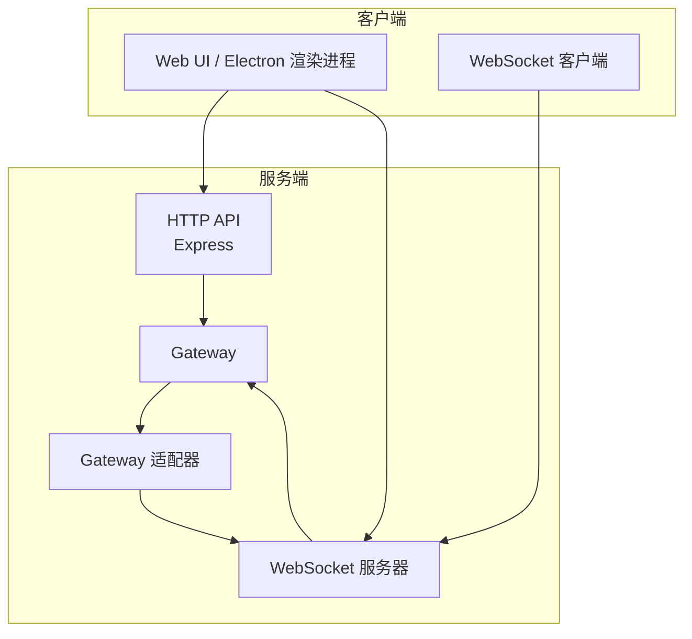
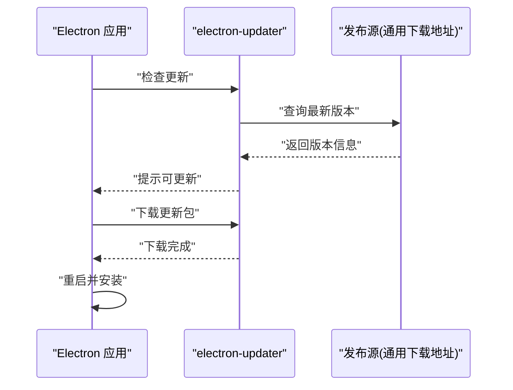
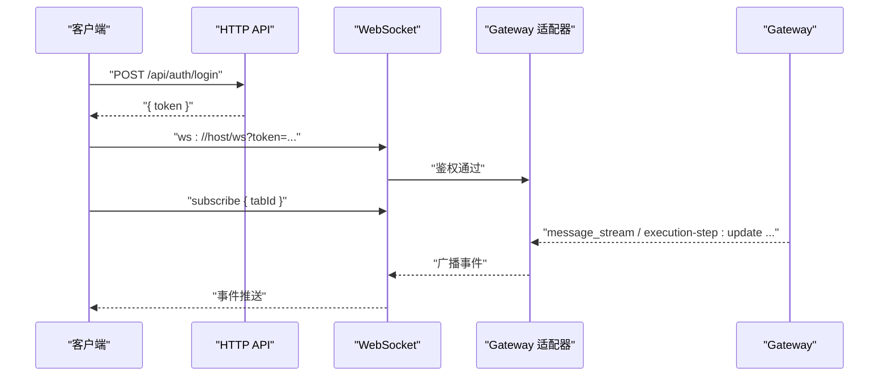
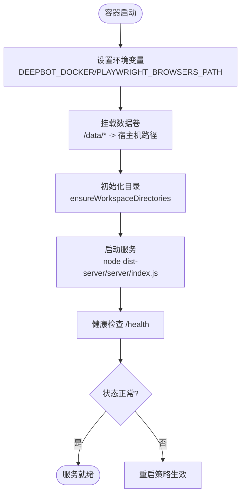
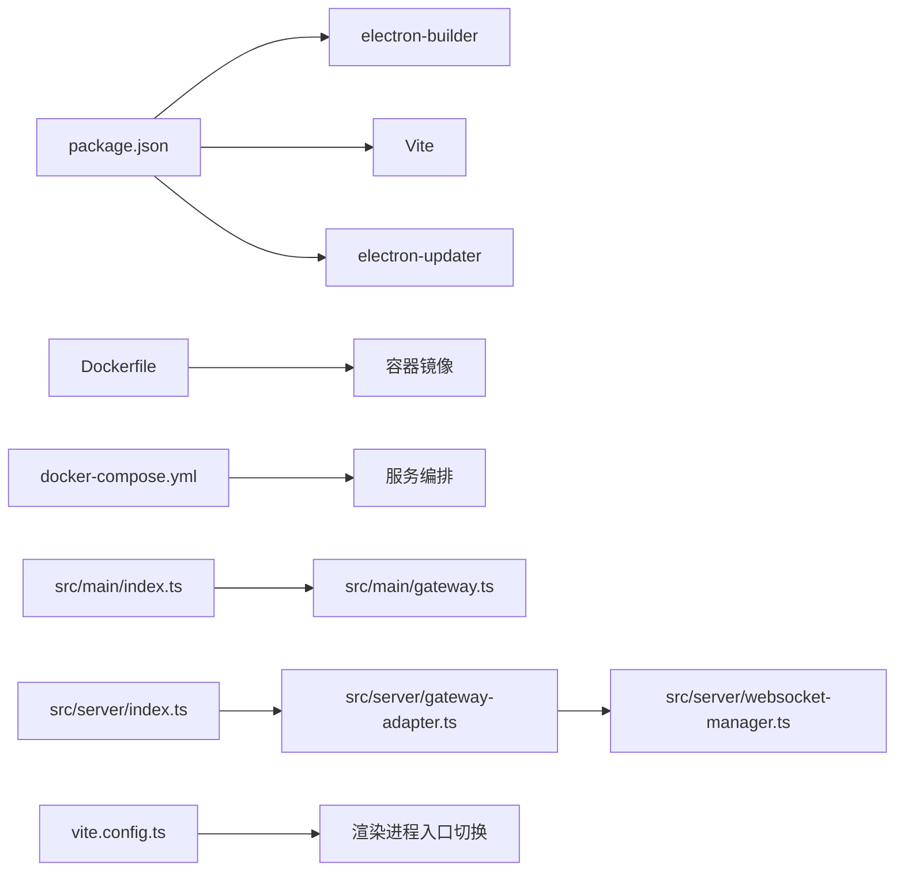

# 部署策略

<cite>
**本文引用的文件**
- [package.json](file://package.json)
- [Dockerfile](file://Dockerfile)
- [docker-compose.yml](file://docker-compose.yml)
- [scripts/after-pack.js](file://scripts/after-pack.js)
- [scripts/after-sign.js](file://scripts/after-sign.js)
- [src/main/index.ts](file://src/main/index.ts)
- [src/main/gateway.ts](file://src/main/gateway.ts)
- [src/server/index.ts](file://src/server/index.ts)
- [src/server/gateway-adapter.ts](file://src/server/gateway-adapter.ts)
- [src/server/websocket-manager.ts](file://src/server/websocket-manager.ts)
- [vite.config.ts](file://vite.config.ts)
- [src/shared/utils/docker-utils.ts](file://src/shared/utils/docker-utils.ts)
- [src/main/utils/ensure-directories.ts](file://src/main/utils/ensure-directories.ts)
- [README.md](file://README.md)
- [RELEASE.md](file://RELEASE.md)
</cite>

## 目录
1. [简介](#简介)
2. [项目结构](#项目结构)
3. [核心组件](#核心组件)
4. [架构总览](#架构总览)
5. [详细组件分析](#详细组件分析)
6. [依赖关系分析](#依赖关系分析)
7. [性能考量](#性能考量)
8. [故障排查指南](#故障排查指南)
9. [结论](#结论)
10. [附录](#附录)

## 简介
本指南面向 史丽慧小助理 的多种部署策略，重点对比 Electron 应用部署与 Web 服务器部署的差异、优缺点与适用场景；覆盖桌面应用分发策略（含自动更新机制与版本管理）、云部署方案与服务器配置要求、CI/CD 流水线配置示例与自动化部署最佳实践，并给出负载均衡、高可用性与灾难恢复策略建议，以及不同部署环境下的安全考虑与权限配置要点。

## 项目结构
史丽慧小助理 同时支持桌面端（Electron）与 Web 服务器两种运行形态，二者共享核心业务逻辑并通过适配器桥接到 Web API 与 WebSocket。关键结构如下：
- 桌面端入口与生命周期管理位于主进程，负责窗口、托盘、IPC、自动更新等。
- Web 服务器入口提供 HTTP API 与 WebSocket，复用 Gateway 以实现会话与消息路由。
- 构建与打包通过 Vite（Electron 模式）与 Web 模式切换，配合 electron-builder 进行多平台分发。
- Dockerfile 与 docker-compose.yml 提供容器化部署与数据持久化方案。

```mermaid
graph TB
subgraph "桌面端(Electron)"
E_Main["主进程入口<br/>src/main/index.ts"]
E_Gateway["Gateway<br/>src/main/gateway.ts"]
E_Renderer["渲染进程(Web UI)<br/>src/renderer/*"]
end
subgraph "Web 服务器"
W_Entry["服务器入口<br/>src/server/index.ts"]
W_Adapter["Gateway 适配器<br/>src/server/gateway-adapter.ts"]
W_WS["WebSocket 管理器<br/>src/server/websocket-manager.ts"]
end
subgraph "构建与打包"
V_Config["Vite 配置<br/>vite.config.ts"]
Pkg["包与构建配置<br/>package.json"]
D_File["Dockerfile"]
DC_Yml["docker-compose.yml"]
end
E_Main --> E_Gateway
E_Gateway <- --> W_Adapter
W_Entry --> W_Adapter
W_Adapter --> W_WS
V_Config --> E_Renderer
V_Config --> W_Entry
Pkg --> D_File
Pkg --> DC_Yml
```

图表来源
- [src/main/index.ts](file://src/main/index.ts)
- [src/main/gateway.ts](file://src/main/gateway.ts)
- [src/server/index.ts](file://src/server/index.ts)
- [src/server/gateway-adapter.ts](file://src/server/gateway-adapter.ts)
- [src/server/websocket-manager.ts](file://src/server/websocket-manager.ts)
- [vite.config.ts](file://vite.config.ts)
- [package.json](file://package.json)
- [Dockerfile](file://Dockerfile)
- [docker-compose.yml](file://docker-compose.yml)

章节来源
- [README.md](file://README.md)
- [package.json](file://package.json)
- [vite.config.ts](file://vite.config.ts)
- [Dockerfile](file://Dockerfile)
- [docker-compose.yml](file://docker-compose.yml)

## 核心组件
- 主进程与窗口管理：负责创建窗口、系统托盘、拦截导航、开发者工具快捷键、IPC 通道注册等。
- Gateway：统一会话管理、消息路由、连接器管理、定时任务、跨 Tab 能力等。
- Web 服务器：Express + WebSocket，提供认证、静态资源、REST API 与 WebSocket 事件广播。
- 适配器：将 Gateway 的事件转换为 WebSocket 事件，屏蔽 Electron/BrowserWindow 差异。
- WebSocket 管理器：连接鉴权、订阅管理、心跳、断连清理、消息广播。
- 构建与打包：Vite 模式切换、electron-builder 多平台打包、Docker 多阶段构建与运行时依赖。

章节来源
- [src/main/index.ts](file://src/main/index.ts)
- [src/main/gateway.ts](file://src/main/gateway.ts)
- [src/server/index.ts](file://src/server/index.ts)
- [src/server/gateway-adapter.ts](file://src/server/gateway-adapter.ts)
- [src/server/websocket-manager.ts](file://src/server/websocket-manager.ts)
- [vite.config.ts](file://vite.config.ts)
- [package.json](file://package.json)

## 架构总览
桌面端与 Web 服务器共享核心业务逻辑，通过适配器与 WebSocket 实现消息流与事件广播。桌面端通过 IPC 与 Gateway 交互，Web 服务器通过适配器与 Gateway 交互，最终由 WebSocket 管理器将事件推送到订阅的客户端。



图表来源
- [src/server/index.ts](file://src/server/index.ts)
- [src/server/gateway-adapter.ts](file://src/server/gateway-adapter.ts)
- [src/server/websocket-manager.ts](file://src/server/websocket-manager.ts)
- [src/main/gateway.ts](file://src/main/gateway.ts)

## 详细组件分析

### 桌面端部署策略（Electron）
- 自动更新机制
  - 使用 electron-updater，通过 package.json 中的 build.publish 配置发布源（示例为通用下载地址）。
  - 支持 macOS ad-hoc 签名与公证流程，便于分发。
- 分发与签名
  - electron-builder 配置包含 mac/win 平台目标、安装器参数、图标、硬编码签名与公证配置。
  - afterPack 钩子在签名前创建 node 包装脚本，确保其被纳入签名范围；afterSign 钩子由构建器内置处理公证。
- 版本管理
  - 语义化版本管理，发布前检查与打标签，配合 GitHub Releases 或自建下载服务器。
- 适用场景
  - 需要系统级能力（托盘、原生窗口、文件系统访问、浏览器控制）的企业桌面部署。
  - 对安装体验与离线可用性有要求的场景。



图表来源
- [package.json](file://package.json)
- [src/main/index.ts](file://src/main/index.ts)

章节来源
- [package.json](file://package.json)
- [scripts/after-pack.js](file://scripts/after-pack.js)
- [scripts/after-sign.js](file://scripts/after-sign.js)
- [RELEASE.md](file://RELEASE.md)

### Web 服务器部署策略
- 运行模式与入口
  - 通过 src/server/index.ts 启动 Express 与 WebSocket 服务，支持静态资源与 SPA 路由。
  - 通过环境变量 PORT 控制端口，NODE_ENV 控制静态资源与日志行为。
- 认证与安全
  - 登录接口无需 Token；受保护 API 需要 Token；WebSocket 连接支持 ACCESS_PASSWORD 与 JWT_SECRET。
  - 未设置 ACCESS_PASSWORD 时允许匿名连接；生产环境务必设置访问密码与强 JWT 密钥。
- 适配器与 WebSocket
  - Gateway 适配器将 Gateway 事件转换为 WebSocket 事件，支持订阅/取消订阅、心跳、断连清理。
  - WebSocket 管理器负责连接鉴权、同一用户多端互斥登录、断连时停止订阅 Tab 的 Agent 执行。
- 适用场景
  - 云端部署、容器化、多租户、集中式管理与横向扩展需求。
  - 与现有 Web 基础设施（反向代理、认证网关）集成更便捷。



图表来源
- [src/server/index.ts](file://src/server/index.ts)
- [src/server/websocket-manager.ts](file://src/server/websocket-manager.ts)
- [src/server/gateway-adapter.ts](file://src/server/gateway-adapter.ts)
- [src/main/gateway.ts](file://src/main/gateway.ts)

章节来源
- [src/server/index.ts](file://src/server/index.ts)
- [src/server/websocket-manager.ts](file://src/server/websocket-manager.ts)
- [src/server/gateway-adapter.ts](file://src/server/gateway-adapter.ts)
- [src/main/gateway.ts](file://src/main/gateway.ts)

### 容器化与云部署
- Dockerfile
  - 多阶段构建：builder 阶段安装 pnpm、构建 web server 与前端；运行阶段安装 Python 与 Playwright 运行时依赖。
  - 通过环境变量 DEEPBOT_DOCKER、PLAYWRIGHT_BROWSERS_PATH、PYTHONUSERBASE、NPM_CONFIG_PREFIX 等实现容器内持久化与可执行路径统一。
  - 修复 agent-browser 二进制执行权限，暴露端口 3000。
- docker-compose.yml
  - 端口映射、环境变量注入、数据卷挂载（工作目录、技能、记忆、会话、脚本、图片、数据库、Playwright 缓存）。
  - 健康检查基于 /health 接口，支持重启策略。
- 服务器配置要求
  - Node.js 20+，Python 3.11+，Playwright Chromium 依赖；根据实际并发与任务复杂度规划 CPU/内存。
  - 如需浏览器自动化，确保容器内网络可达与 DNS 正常。



图表来源
- [Dockerfile](file://Dockerfile)
- [docker-compose.yml](file://docker-compose.yml)
- [src/main/utils/ensure-directories.ts](file://src/main/utils/ensure-directories.ts)
- [src/shared/utils/docker-utils.ts](file://src/shared/utils/docker-utils.ts)

章节来源
- [Dockerfile](file://Dockerfile)
- [docker-compose.yml](file://docker-compose.yml)
- [src/main/utils/ensure-directories.ts](file://src/main/utils/ensure-directories.ts)
- [src/shared/utils/docker-utils.ts](file://src/shared/utils/docker-utils.ts)

### CI/CD 流水线与自动化部署
- 构建与测试
  - 使用 pnpm 脚本进行类型检查、开发与构建（Electron 与 Web），Docker 镜像构建与多架构推送。
- 自动化发布
  - electron-builder 支持多平台打包与签名；发布源可配置为 GitHub Releases 或自建下载服务器。
- 最佳实践
  - 分支保护与 PR 审查；构建前运行类型检查与 lint；镜像构建使用 BuildKit 缓存加速；容器健康检查与滚动更新策略。
  - 通过环境变量注入敏感配置（ACCESS_PASSWORD、JWT_SECRET、数据库连接等）。

章节来源
- [package.json](file://package.json)
- [Dockerfile](file://Dockerfile)
- [RELEASE.md](file://RELEASE.md)

### 负载均衡、高可用与灾难恢复
- 负载均衡
  - 使用反向代理（Nginx/Traefik/Caddy）分发到多实例；WebSocket 需要支持粘性会话或共享状态（如 Redis）。
- 高可用
  - 多副本部署，健康检查失败自动摘除；容器编排使用 docker-compose 或 Kubernetes；数据库使用独立高可用实例。
- 灾难恢复
  - 定期备份数据卷（/data/db、/data/workspace 等）与配置；镜像与制品库版本化管理；演练恢复流程。

[本节为通用指导，不直接分析具体文件]

### 安全考虑与权限配置
- 访问控制
  - 生产环境必须设置 ACCESS_PASSWORD；WebSocket 连接需携带有效 Token；JWT_SECRET 必须强且保密。
- 文件与目录
  - 容器内通过环境变量指定数据目录；Docker 模式下使用 /data/*；普通模式下使用用户主目录。
  - 严格路径白名单与工作空间隔离，避免越权访问。
- 传输与存储
  - 建议启用 TLS；密钥与令牌通过环境变量注入；避免明文存储敏感信息。

章节来源
- [src/server/websocket-manager.ts](file://src/server/websocket-manager.ts)
- [src/shared/utils/docker-utils.ts](file://src/shared/utils/docker-utils.ts)
- [docker-compose.yml](file://docker-compose.yml)

## 依赖关系分析



图表来源
- [package.json](file://package.json)
- [Dockerfile](file://Dockerfile)
- [docker-compose.yml](file://docker-compose.yml)
- [src/main/index.ts](file://src/main/index.ts)
- [src/main/gateway.ts](file://src/main/gateway.ts)
- [src/server/index.ts](file://src/server/index.ts)
- [src/server/gateway-adapter.ts](file://src/server/gateway-adapter.ts)
- [src/server/websocket-manager.ts](file://src/server/websocket-manager.ts)
- [vite.config.ts](file://vite.config.ts)

章节来源
- [package.json](file://package.json)
- [Dockerfile](file://Dockerfile)
- [docker-compose.yml](file://docker-compose.yml)
- [vite.config.ts](file://vite.config.ts)

## 性能考量
- 并发与资源
  - 根据任务复杂度与并发量规划 CPU/内存；WebSocket 连接数与消息吞吐量需监控。
- 存储与 I/O
  - 数据卷挂载与磁盘性能直接影响文件操作与数据库性能；建议使用 SSD 与合适的 I/O 配额。
- 网络与浏览器
  - Playwright 浏览器缓存与预装可减少冷启动时间；网络稳定性影响外部平台集成。
- 缓存与优化
  - 构建阶段使用 pnpm 缓存与 BuildKit；容器镜像分层优化；静态资源缓存与压缩。

[本节为通用指导，不直接分析具体文件]

## 故障排查指南
- 启动失败
  - 检查 Node.js 版本与依赖安装；查看容器日志与健康检查状态。
- WebSocket 连接问题
  - 确认 ACCESS_PASSWORD 与 JWT_SECRET 配置；检查 Token 是否过期；确认订阅与断连清理逻辑。
- 文件与目录权限
  - 确认数据卷挂载路径与权限；Docker 模式下使用 /data/*；普通模式下检查用户主目录。
- 自动更新
  - 检查发布源配置与网络可达性；macOS 需要公证与签名；Windows 需要代码签名证书。

章节来源
- [src/server/websocket-manager.ts](file://src/server/websocket-manager.ts)
- [docker-compose.yml](file://docker-compose.yml)
- [package.json](file://package.json)

## 结论
- 桌面端（Electron）适合需要系统级能力与本地体验的场景，具备自动更新与多平台分发能力。
- Web 服务器适合云原生与容器化部署，易于与现有基础设施集成，支持横向扩展与多租户。
- 容器化提供标准化部署与数据持久化，结合健康检查与编排工具可实现高可用。
- 安全与权限配置是生产部署的关键，务必启用访问密码、强密钥与路径白名单。

[本节为总结，不直接分析具体文件]

## 附录
- 快速开始与部署参考
  - 桌面端构建与分发：参见发布指南与 README。
  - Docker 部署：参见 README 与 docker-compose.yml。
- 关键配置项
  - 端口：PORT（默认 3008）
  - 访问密码：ACCESS_PASSWORD
  - JWT 密钥：JWT_SECRET
  - Docker 模式：DEEPBOT_DOCKER=true
  - Playwright 浏览器缓存：PLAYWRIGHT_BROWSERS_PATH

章节来源
- [README.md](file://README.md)
- [RELEASE.md](file://RELEASE.md)
- [docker-compose.yml](file://docker-compose.yml)
- [src/server/index.ts](file://src/server/index.ts)