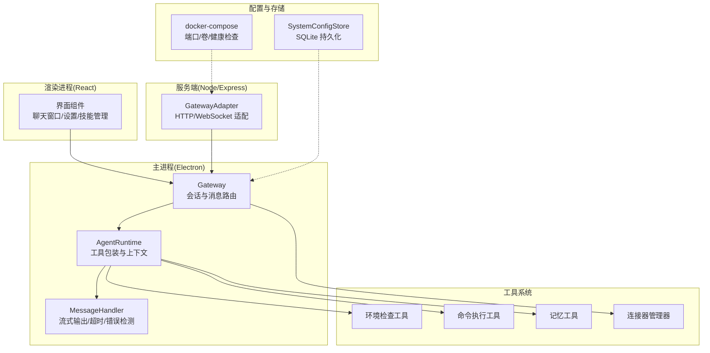
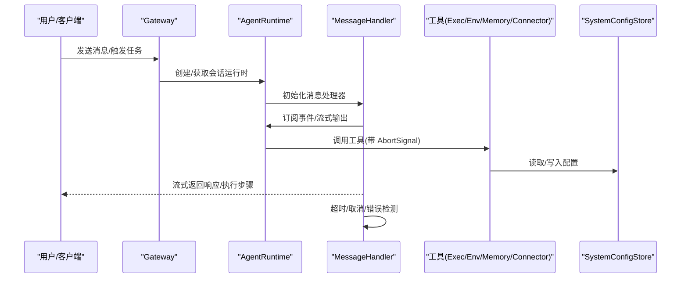
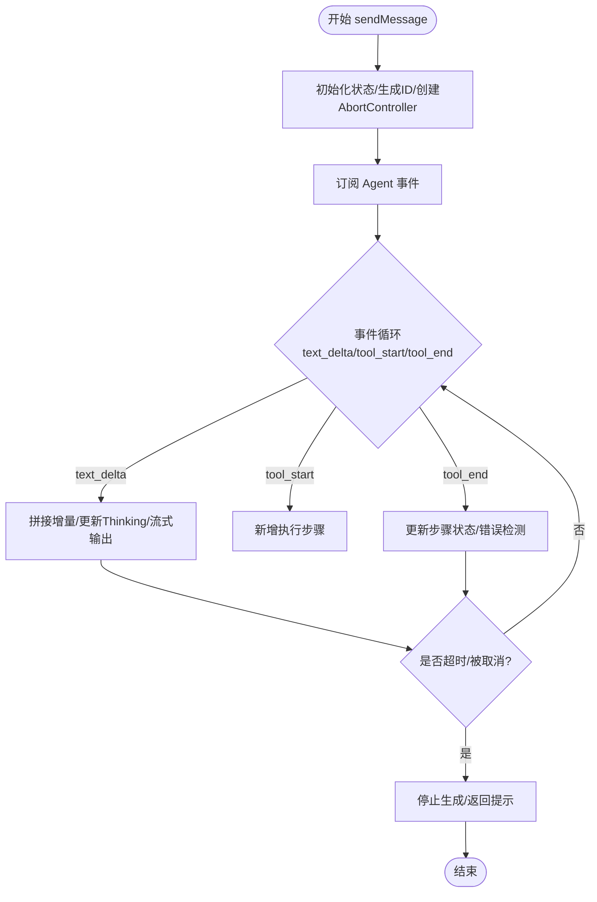
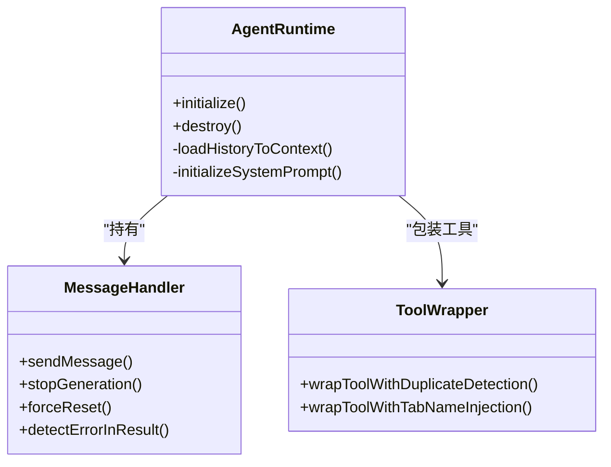
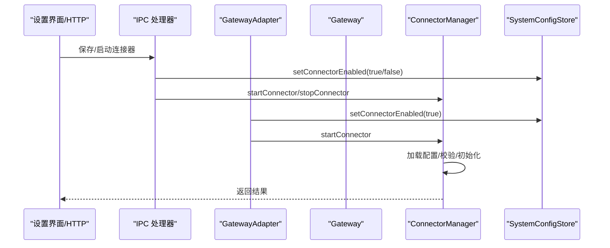
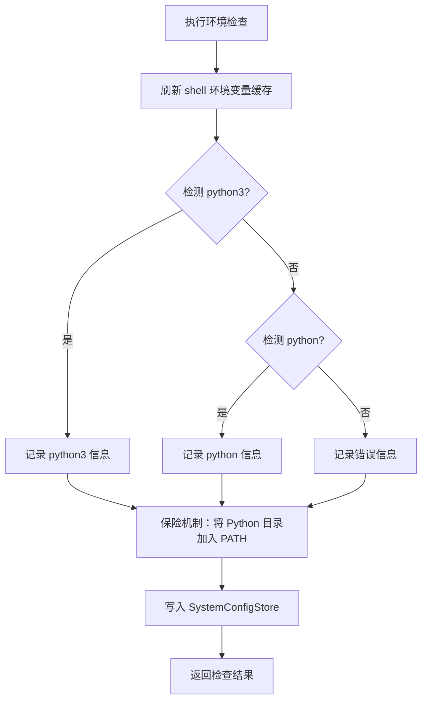
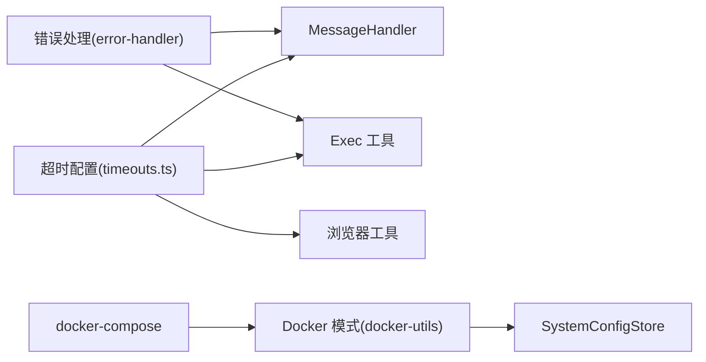

# 常见问题

<cite>
**本文引用的文件**
- [README.md](file://README.md)
- [package.json](file://package.json)
- [docker-compose.yml](file://docker-compose.yml)
- [src/main/agent-runtime/message-handler.ts](file://src/main/agent-runtime/message-handler.ts)
- [src/main/agent-runtime/agent-runtime.ts](file://src/main/agent-runtime/agent-runtime.ts)
- [src/main/gateway.ts](file://src/main/gateway.ts)
- [src/main/gateway-connector.ts](file://src/main/gateway-connector.ts)
- [src/main/gateway-tab.ts](file://src/main/gateway-tab.ts)
- [src/main/ipc/connector-handler.ts](file://src/main/ipc/connector-handler.ts)
- [src/server/gateway-adapter.ts](file://src/server/gateway-adapter.ts)
- [src/main/database/system-config-store.ts](file://src/main/database/system-config-store.ts)
- [src/main/database/environment-config.ts](file://src/main/database/environment-config.ts)
- [src/main/tools/environment-check-tool.ts](file://src/main/tools/environment-check-tool.ts)
- [src/main/tools/exec-tool.ts](file://src/main/tools/exec-tool.ts)
- [src/main/tools/memory-tool.ts](file://src/main/tools/memory-tool.ts)
- [src/main/prompts/templates/MEMORY-TRIGGER.md](file://src/main/prompts/templates/MEMORY-TRIGGER.md)
- [src/main/config/timeouts.ts](file://src/main/config/timeouts.ts)
- [src/shared/utils/error-handler.ts](file://src/shared/utils/error-handler.ts)
- [src/shared/utils/docker-utils.ts](file://src/shared/utils/docker-utils.ts)
- [src/main/tools/shell-env.ts](file://src/main/tools/shell-env.ts)
</cite>

## 目录
1. [简介](#简介)
2. [项目结构](#项目结构)
3. [核心组件](#核心组件)
4. [架构总览](#架构总览)
5. [详细组件分析](#详细组件分析)
6. [依赖分析](#依赖分析)
7. [性能考虑](#性能考虑)
8. [故障排查指南](#故障排查指南)
9. [结论](#结论)
10. [附录](#附录)

## 简介
本指南面向使用 DeepBot 的用户与运维人员，聚焦安装、配置、使用过程中的常见问题与系统性排查流程。内容涵盖启动失败、功能异常、性能问题与兼容性问题，提供问题现象分析、原因定位、解决方案验证与预防性建议，并给出标准化问题报告格式与信息收集清单。

## 项目结构
DeepBot 采用主进程（Electron）、渲染进程（React）、服务端（Node/Express/WebSocket）与工具系统（13 个内置工具）协同的模块化架构。关键模块包括：
- 会话与网关：Gateway 管理 Session、消息路由、连接器与跨 Tab 消息
- Agent 运行时：MessageHandler 负责流式输出、执行步骤追踪与超时控制；AgentRuntime 负责工具包装、上下文加载与系统提示词初始化
- 工具系统：环境检查、命令执行、浏览器控制、文件操作、记忆管理、技能管理、定时任务、外部连接器等
- 配置与持久化：SystemConfigStore 使用 SQLite 存储模型、工具、连接器、Tab 等配置；Docker 模式下通过 docker-compose 管理端口与数据卷
- 外部通讯：飞书等连接器通过 ConnectorManager 管理生命周期与健康检查

图表来源
- [src/main/gateway.ts:150-185](file://src/main/gateway.ts#L150-L185)
- [src/main/agent-runtime/agent-runtime.ts:163-229](file://src/main/agent-runtime/agent-runtime.ts#L163-L229)
- [src/main/agent-runtime/message-handler.ts:114-587](file://src/main/agent-runtime/message-handler.ts#L114-L587)
- [src/server/gateway-adapter.ts:425-458](file://src/server/gateway-adapter.ts#L425-L458)
- [src/main/database/system-config-store.ts:1-576](file://src/main/database/system-config-store.ts#L1-L576)
- [docker-compose.yml:1-65](file://docker-compose.yml#L1-L65)

章节来源
- [README.md:128-288](file://README.md#L128-L288)
- [package.json:1-235](file://package.json#L1-L235)
- [docker-compose.yml:1-65](file://docker-compose.yml#L1-L65)

## 核心组件
- MessageHandler：负责 AI 请求的流式输出、执行步骤收集、超时与取消控制、错误检测与恢复
- AgentRuntime：初始化 Agent、包装工具（重复检测、跨 Tab 名称注入）、加载历史上下文、异步初始化系统提示词
- SystemConfigStore：集中管理模型、工具、连接器、Tab 等配置，支持迁移与索引
- ConnectorManager：注册/启动/停止连接器，执行配置校验与健康检查
- 环境检查工具：检查 Python/Node 等依赖，刷新 PATH 缓存，写入数据库
- 执行工具：严格路径白名单与安全检查，拦截高风险路径与命令
- 记忆工具：全局/独立记忆读取、合并、更新与提炼，支持取消与错误处理

章节来源
- [src/main/agent-runtime/message-handler.ts:1-752](file://src/main/agent-runtime/message-handler.ts#L1-L752)
- [src/main/agent-runtime/agent-runtime.ts:163-229](file://src/main/agent-runtime/agent-runtime.ts#L163-L229)
- [src/main/database/system-config-store.ts:1-576](file://src/main/database/system-config-store.ts#L1-L576)
- [src/main/connectors/connector-manager.ts:21-71](file://src/main/connectors/connector-manager.ts#L21-L71)
- [src/main/tools/environment-check-tool.ts:1-318](file://src/main/tools/environment-check-tool.ts#L1-L318)
- [src/main/tools/exec-tool.ts:79-276](file://src/main/tools/exec-tool.ts#L79-L276)
- [src/main/tools/memory-tool.ts:358-667](file://src/main/tools/memory-tool.ts#L358-L667)

## 架构总览
DeepBot 的消息与任务流经 Gateway → AgentRuntime → MessageHandler → 工具链，期间通过 SystemConfigStore 持久化配置与状态。外部连接器（如飞书）通过 ConnectorManager 管理生命周期，服务端通过 GatewayAdapter 提供 HTTP/WebSocket 接入。

图表来源
- [src/main/gateway.ts:150-185](file://src/main/gateway.ts#L150-L185)
- [src/main/agent-runtime/agent-runtime.ts:163-229](file://src/main/agent-runtime/agent-runtime.ts#L163-L229)
- [src/main/agent-runtime/message-handler.ts:114-587](file://src/main/agent-runtime/message-handler.ts#L114-L587)
- [src/main/database/system-config-store.ts:1-576](file://src/main/database/system-config-store.ts#L1-L576)

## 详细组件分析

### 组件A：消息与执行流（MessageHandler）
- 流式输出：基于事件驱动，逐块产出文本增量，支持 Thinking 模拟与工具执行步骤追踪
- 超时与取消：内置软超时（AbortSignal），支持用户主动停止与强制重置
- 错误检测：对工具结果进行模式匹配，识别系统级错误、安全拦截与异常堆栈
- 状态管理：生成 ID、执行步骤、当前流式内容、用户停止标记

图表来源
- [src/main/agent-runtime/message-handler.ts:114-587](file://src/main/agent-runtime/message-handler.ts#L114-L587)

章节来源
- [src/main/agent-runtime/message-handler.ts:114-587](file://src/main/agent-runtime/message-handler.ts#L114-L587)

### 组件B：AgentRuntime 与工具包装
- 初始化：加载 Agent、工具列表，包装工具（重复检测、跨 Tab 名称注入）
- 上下文：加载历史消息到上下文，异步初始化系统提示词
- 销毁：强制停止生成、重置 Agent 状态、清理 Browser Control Server

图表来源
- [src/main/agent-runtime/agent-runtime.ts:163-229](file://src/main/agent-runtime/agent-runtime.ts#L163-L229)
- [src/main/agent-runtime/agent-runtime.ts:534-564](file://src/main/agent-runtime/agent-runtime.ts#L534-L564)
- [src/main/agent-runtime/message-handler.ts:1-752](file://src/main/agent-runtime/message-handler.ts#L1-L752)

章节来源
- [src/main/agent-runtime/agent-runtime.ts:163-229](file://src/main/agent-runtime/agent-runtime.ts#L163-L229)
- [src/main/agent-runtime/agent-runtime.ts:534-564](file://src/main/agent-runtime/agent-runtime.ts#L534-L564)

### 组件C：连接器生命周期与健康检查
- 注册/启动/停止：ConnectorManager 负责生命周期管理，SystemConfigStore 持久化状态
- IPC/Web 通道：IPC 与 GatewayAdapter 保持一致的状态更新顺序（先写库，再启动/停止）
- 健康检查：Gateway 自动启动已启用连接器，失败不影响其他连接器

图表来源
- [src/main/ipc/connector-handler.ts:143-222](file://src/main/ipc/connector-handler.ts#L143-L222)
- [src/server/gateway-adapter.ts:430-452](file://src/server/gateway-adapter.ts#L430-L452)
- [src/main/gateway.ts:150-185](file://src/main/gateway.ts#L150-L185)
- [src/main/connectors/connector-manager.ts:45-71](file://src/main/connectors/connector-manager.ts#L45-L71)

章节来源
- [src/main/ipc/connector-handler.ts:143-222](file://src/main/ipc/connector-handler.ts#L143-L222)
- [src/server/gateway-adapter.ts:430-452](file://src/server/gateway-adapter.ts#L430-L452)
- [src/main/gateway.ts:150-185](file://src/main/gateway.ts#L150-L185)
- [src/main/connectors/connector-manager.ts:21-71](file://src/main/connectors/connector-manager.ts#L21-L71)

### 组件D：环境检查与 PATH 管理
- 检查顺序：优先 python3，回退 python；刷新 shell 环境变量缓存；保险机制将 Python 目录加入 PATH
- 存储：将检查结果写入 SQLite，支持“获取状态”接口
- Shell 配置：从多个 shell 配置文件提取环境变量，Skill 的 .env 优先覆盖

图表来源
- [src/main/tools/environment-check-tool.ts:146-234](file://src/main/tools/environment-check-tool.ts#L146-L234)
- [src/main/database/environment-config.ts:1-79](file://src/main/database/environment-config.ts#L1-L79)
- [src/main/tools/shell-env.ts:47-125](file://src/main/tools/shell-env.ts#L47-L125)

章节来源
- [src/main/tools/environment-check-tool.ts:1-318](file://src/main/tools/environment-check-tool.ts#L1-L318)
- [src/main/database/environment-config.ts:1-79](file://src/main/database/environment-config.ts#L1-L79)
- [src/main/tools/shell-env.ts:47-125](file://src/main/tools/shell-env.ts#L47-L125)

### 组件E：执行工具安全检查
- 路径白名单：系统设备文件、系统目录前缀、环境变量指向的临时目录
- 命令扫描：针对 cd、cp/mv/rm、重定向、脚本执行等提取路径参数，逐一严格校验
- 安全拦截：命中不安全路径或越权目录时，抛出“命令安全检查失败”等错误

章节来源
- [src/main/tools/exec-tool.ts:79-276](file://src/main/tools/exec-tool.ts#L79-L276)

### 组件F：记忆系统与提示词触发
- 记忆读取/合并/更新：支持主记忆与当前 Tab 独立记忆，更新前可选择是否同步主记忆
- 提示词触发：MEMORY-TRIGGER.md 定义“必须调用 memory 工具”的场景与回复前自检清单
- 错误处理：支持取消、提炼失败兜底与日志记录

章节来源
- [src/main/tools/memory-tool.ts:358-667](file://src/main/tools/memory-tool.ts#L358-L667)
- [src/main/prompts/templates/MEMORY-TRIGGER.md:1-250](file://src/main/prompts/templates/MEMORY-TRIGGER.md#L1-L250)

## 依赖分析
- 超时配置：Agent 消息超时、浏览器操作、HTTP 请求、会话清理等均有明确阈值，支持环境变量覆盖
- Docker 模式：通过 DEEPBOT_DOCKER 与 DB_DIR 切换数据库目录，docker-compose 提供端口映射与数据卷挂载
- 错误处理：统一错误提取、类型判断、AbortError 与取消错误识别，日志记录与错误响应封装

图表来源
- [src/main/config/timeouts.ts:1-78](file://src/main/config/timeouts.ts#L1-L78)
- [src/shared/utils/docker-utils.ts:1-24](file://src/shared/utils/docker-utils.ts#L1-L24)
- [src/main/database/system-config-store.ts:1-576](file://src/main/database/system-config-store.ts#L1-L576)
- [docker-compose.yml:1-65](file://docker-compose.yml#L1-L65)
- [src/shared/utils/error-handler.ts:1-51](file://src/shared/utils/error-handler.ts#L1-L51)

章节来源
- [src/main/config/timeouts.ts:1-78](file://src/main/config/timeouts.ts#L1-L78)
- [src/shared/utils/docker-utils.ts:1-24](file://src/shared/utils/docker-utils.ts#L1-L24)
- [docker-compose.yml:1-65](file://docker-compose.yml#L1-L65)
- [src/shared/utils/error-handler.ts:1-51](file://src/shared/utils/error-handler.ts#L1-L51)

## 性能考虑
- 软超时与取消：通过 AbortSignal 通知工具可取消，避免硬中断造成状态污染
- 流式输出与事件驱动：降低一次性响应体积，提升交互体验
- 执行步骤追踪：便于定位耗时工具与失败节点
- Docker 模式：Playwright 缓存与数据卷持久化减少重复下载与 IO 开销
- 环境变量刷新：避免 PATH 缺失导致的命令找不到，减少重试与失败

章节来源
- [src/main/agent-runtime/message-handler.ts:114-587](file://src/main/agent-runtime/message-handler.ts#L114-L587)
- [src/main/config/timeouts.ts:1-78](file://src/main/config/timeouts.ts#L1-L78)
- [docker-compose.yml:53-54](file://docker-compose.yml#L53-L54)

## 故障排查指南

### 启动失败
- 现象
  - Web 页面无法访问、健康检查失败
  - 桌面端应用启动黑屏或报错
- 诊断步骤
  - 检查端口占用与映射：确认 docker-compose 端口与宿主机映射一致
  - 查看容器健康检查：健康检查命令与端口变量是否匹配
  - Docker 模式开关：DEEPBOT_DOCKER 是否为 true，DB_DIR 是否正确
  - 日志：查看容器日志与应用日志，定位初始化阶段错误
- 解决方案
  - 修正 .env 中 PORT、DB_DIR、WORKSPACE_DIR 等变量
  - 重建容器：docker-compose down && docker-compose up -d
  - 本地开发：确认 Node/依赖安装与脚本执行正常
- 预防措施
  - 使用 docker-compose 管理端口与数据卷，避免路径展开问题
  - 在 .env 中使用绝对路径，避免 ~ 展开异常

章节来源
- [docker-compose.yml:13-65](file://docker-compose.yml#L13-L65)
- [src/shared/utils/docker-utils.ts:1-24](file://src/shared/utils/docker-utils.ts#L1-L24)
- [README.md:73-98](file://README.md#L73-L98)

### 工具执行失败
- 现象
  - 命令执行报“命令安全检查失败”“工作目录安全检查失败”
  - 文件操作失败、权限被拒绝
- 诊断步骤
  - 检查命令中是否包含越权路径或系统目录前缀
  - 确认工作目录白名单与脚本目录配置
  - 查看工具返回的错误文本，是否命中错误检测模式
- 解决方案
  - 将目标路径移动到白名单目录（工作目录/脚本目录/图片目录/技能目录）
  - 使用相对路径或受信任的文件名
  - 若为浏览器工具，检查浏览器缓存与快照生成超时
- 预防措施
  - 在系统设置中配置工作目录与脚本目录
  - 使用环境检查工具确认 Python/Node 等依赖可用

章节来源
- [src/main/tools/exec-tool.ts:79-276](file://src/main/tools/exec-tool.ts#L79-L276)
- [src/main/tools/environment-check-tool.ts:146-234](file://src/main/tools/environment-check-tool.ts#L146-L234)
- [src/main/config/timeouts.ts:14-26](file://src/main/config/timeouts.ts#L14-L26)

### 消息路由异常
- 现象
  - 跨 Tab 消息未到达或重复
  - 连接器消息未被消费或重复响应
- 诊断步骤
  - 检查连接器状态：enabled、配置有效性、健康检查
  - 查看 Gateway 自动启动日志，确认连接器是否成功启动
  - 检查 IPC/Web 通道的配置保存顺序（先写库，再启动/停止）
- 解决方案
  - 重新保存连接器配置并启用
  - 重启连接器或服务端
  - 检查外部平台（如飞书）的授权与策略
- 预防措施
  - 在系统设置中先配置再启用
  - 定期健康检查与日志巡检

章节来源
- [src/main/gateway.ts:150-185](file://src/main/gateway.ts#L150-L185)
- [src/main/ipc/connector-handler.ts:143-222](file://src/main/ipc/connector-handler.ts#L143-L222)
- [src/server/gateway-adapter.ts:430-452](file://src/server/gateway-adapter.ts#L430-L452)
- [README.md:251-288](file://README.md#L251-L288)

### 记忆与提示词异常
- 现象
  - “已记住”但未调用 memory 工具，或调用后未生效
  - 记忆合并/提炼失败、内容重复或冲突
- 诊断步骤
  - 检查 MEMORY-TRIGGER.md 的使用时机与自检清单
  - 查看 memory 工具的执行步骤与错误检测
  - 确认主记忆与当前 Tab 记忆的更新策略
- 解决方案
  - 严格按触发规则调用 memory 工具
  - 使用“合并记忆”功能，避免重复与冲突
  - 在工具执行前检查取消信号，避免半成品写入
- 预防措施
  - 在系统提示词组装层中加入记忆文件变更监听
  - 定期备份记忆文件，避免误删

章节来源
- [src/main/prompts/templates/MEMORY-TRIGGER.md:1-250](file://src/main/prompts/templates/MEMORY-TRIGGER.md#L1-L250)
- [src/main/tools/memory-tool.ts:358-667](file://src/main/tools/memory-tool.ts#L358-L667)

### 性能问题
- 现象
  - 响应缓慢、长时间无输出、CPU/内存占用高
- 诊断步骤
  - 查看 MessageHandler 的超时与日志，关注长任务阈值
  - 检查工具调用次数与耗时，定位瓶颈工具
  - Docker 模式下检查 Playwright 缓存与数据卷 IO
- 解决方案
  - 优化工具调用链，拆分长任务
  - 调整超时阈值（通过环境变量）
  - 清理 Playwright 缓存与临时文件
- 预防措施
  - 使用流式输出与分段处理
  - 合理设置会话清理与归档间隔

章节来源
- [src/main/agent-runtime/message-handler.ts:388-470](file://src/main/agent-runtime/message-handler.ts#L388-L470)
- [src/main/config/timeouts.ts:58-77](file://src/main/config/timeouts.ts#L58-L77)
- [docker-compose.yml:53-54](file://docker-compose.yml#L53-L54)

### 兼容性问题
- 现象
  - macOS 首次打开提示“应用已损坏”或“无法验证开发者”
  - 桌面端与 Web 端行为差异
- 诊断步骤
  - macOS 安全设置与 xattr 清理
  - 确认 Node/依赖版本与包管理器版本
- 解决方案
  - 按 README 的 macOS 安装问题说明处理
  - 使用官方脚本与依赖管理工具
- 预防措施
  - 使用推荐的 Node 版本与包管理器版本
  - 遵循 README 的安装与构建流程

章节来源
- [README.md:100-126](file://README.md#L100-L126)
- [package.json:108-111](file://package.json#L108-L111)

### 配置错误
- 现象
  - 连接器配置保存失败、状态不一致
  - 模型配置无效、工具禁用列表异常
- 诊断步骤
  - 检查 SystemConfigStore 的表结构与迁移日志
  - 确认 IPC/Web 通道的保存顺序一致性
- 解决方案
  - 重新保存配置并启用
  - 手动修复数据库表结构或迁移
- 预防措施
  - 在系统设置中先验证配置再启用
  - 定期备份 SQLite 数据库

章节来源
- [src/main/database/system-config-store.ts:82-225](file://src/main/database/system-config-store.ts#L82-L225)
- [src/main/ipc/connector-handler.ts:143-222](file://src/main/ipc/connector-handler.ts#L143-L222)

## 结论
通过系统化的组件分析与故障排查流程，用户可以快速定位并解决安装、配置、使用中的常见问题。建议在部署与使用前完成环境检查、配置验证与健康检查，日常维护中关注日志与超时阈值，出现问题时遵循“现象—步骤—原因—验证”的闭环流程，必要时提交标准化问题报告以获得更高效的支持。

## 附录

### 问题报告标准格式
- 基本信息
  - DeepBot 版本、Node 版本、操作系统、部署方式（桌面/容器）
  - 端口、数据库目录、工作目录、脚本目录、技能目录、图片目录
- 环境检查
  - Python/Node 等依赖状态与 PATH
- 重现步骤
  - 具体操作步骤、触发条件、期望与实际结果
- 日志与截图
  - 应用日志、容器日志、浏览器控制台、关键页面截图
- 配置信息
  - .env 内容摘要、连接器配置、模型配置、工具禁用列表
- 其他
  - 是否使用 Docker、是否启用特定连接器、是否自定义技能

### 信息收集清单
- 系统与环境
  - 操作系统版本、Node 版本、包管理器版本
  - Docker 模式开关、DB_DIR、端口映射
- 配置与状态
  - 连接器启用状态、配置校验结果
  - 模型配置、工具禁用列表、Tab 配置
- 日志与指标
  - 应用启动日志、Agent 执行日志、工具调用日志
  - 超时与取消事件、错误检测结果
- 复现证据
  - 重现步骤截图、关键配置文件片段、健康检查输出