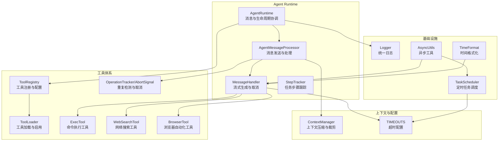
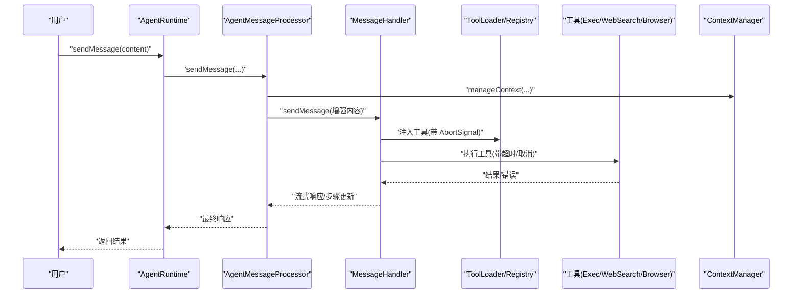
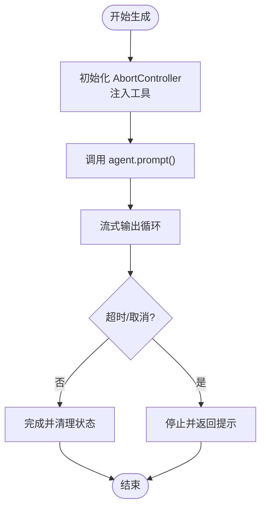
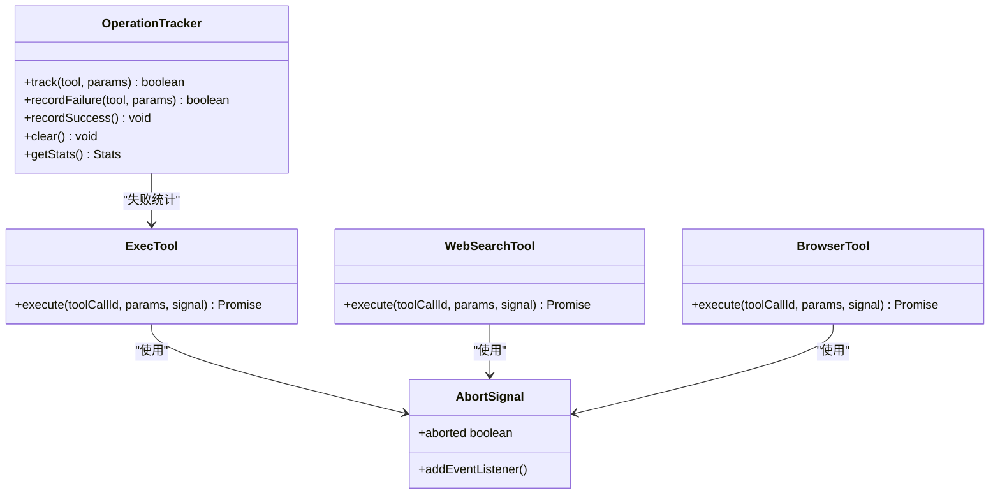
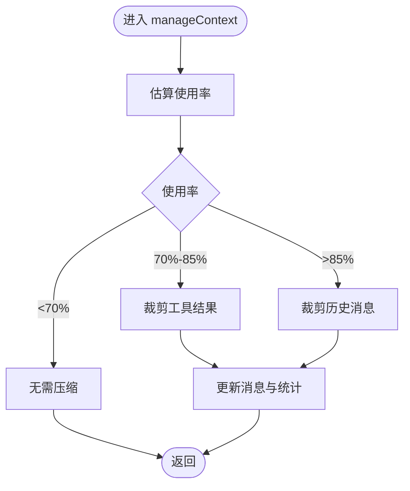
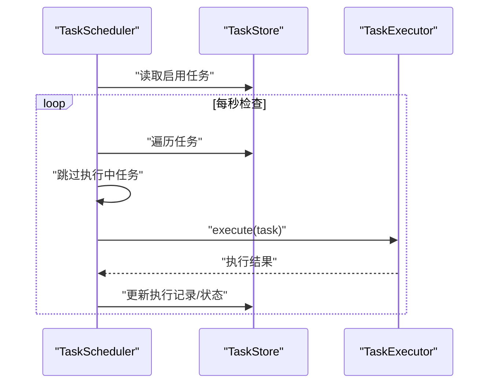
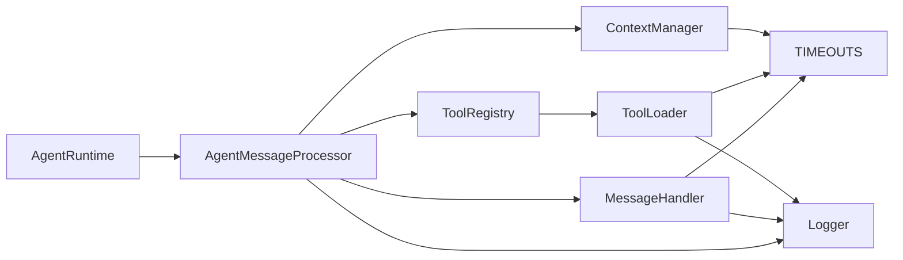

# 性能监控

<cite>
**本文引用的文件**
- [agent-runtime.ts](file://src/main/agent-runtime/agent-runtime.ts)
- [message-handler.ts](file://src/main/agent-runtime/message-handler.ts)
- [agent-message-processor.ts](file://src/main/agent-runtime/agent-message-processor.ts)
- [step-tracker.ts](file://src/main/agent-runtime/step-tracker.ts)
- [tool-abort.ts](file://src/main/tools/tool-abort.ts)
- [tool-registry.ts](file://src/main/tools/registry/tool-registry.ts)
- [tool-loader.ts](file://src/main/tools/registry/tool-loader.ts)
- [exec-tool.ts](file://src/main/tools/exec-tool.ts)
- [web-search-tool.ts](file://src/main/tools/web-search-tool.ts)
- [browser-tool.ts](file://src/main/tools/browser-tool.ts)
- [timeouts.ts](file://src/main/config/timeouts.ts)
- [context-manager.ts](file://src/main/context/context-manager.ts)
- [logger.ts](file://src/shared/utils/logger.ts)
- [scheduler.ts](file://src/main/scheduled-tasks/scheduler.ts)
- [async-utils.ts](file://src/shared/utils/async-utils.ts)
- [time-format.ts](file://src/shared/utils/time-format.ts)
</cite>

## 目录
1. [简介](#简介)
2. [项目结构](#项目结构)
3. [核心组件](#核心组件)
4. [架构总览](#架构总览)
5. [详细组件分析](#详细组件分析)
6. [依赖关系分析](#依赖关系分析)
7. [性能考量](#性能考量)
8. [故障排查指南](#故障排查指南)
9. [结论](#结论)
10. [附录](#附录)

## 简介
本指南面向 DeepBot 的性能监控与调优，聚焦以下目标：
- 系统架构与性能监控的设计与实现
- 关键指标采集（执行时间、资源占用、上下文使用率）
- 性能数据分析与瓶颈识别
- Agent Runtime 的性能监控机制（执行时间统计、内存使用监控、资源消耗分析）
- 工具执行的性能监控（调用耗时、并发执行影响、资源竞争）
- 性能优化实践（缓存策略、异步处理优化、内存管理）
- 性能测试方法与工具、诊断流程
- 开发与生产环境的监控与调优

## 项目结构
DeepBot 的性能监控主要分布在以下模块：
- Agent Runtime：消息处理、生成控制、执行步骤跟踪
- 工具体系：工具注册、加载、执行与取消机制
- 上下文管理：上下文压缩、历史裁剪、Token 估算
- 配置与超时：统一超时配置与软超时机制
- 日志与工具：统一日志、异步工具、时间格式化

**图表来源**
- [agent-runtime.ts:1-909](file://src/main/agent-runtime/agent-runtime.ts#L1-909)
- [agent-message-processor.ts:1-549](file://src/main/agent-runtime/agent-message-processor.ts#L1-549)
- [message-handler.ts:1-752](file://src/main/agent-runtime/message-handler.ts#L1-752)
- [step-tracker.ts:1-199](file://src/main/agent-runtime/step-tracker.ts#L1-199)
- [tool-registry.ts:1-328](file://src/main/tools/registry/tool-registry.ts#L1-328)
- [tool-loader.ts:1-312](file://src/main/tools/registry/tool-loader.ts#L1-312)
- [tool-abort.ts:1-427](file://src/main/tools/tool-abort.ts#L1-427)
- [exec-tool.ts:1-529](file://src/main/tools/exec-tool.ts#L1-529)
- [web-search-tool.ts:1-533](file://src/main/tools/web-search-tool.ts#L1-533)
- [browser-tool.ts:1-976](file://src/main/tools/browser-tool.ts#L1-976)
- [context-manager.ts:1-366](file://src/main/context/context-manager.ts#L1-366)
- [timeouts.ts:1-78](file://src/main/config/timeouts.ts#L1-78)
- [logger.ts:1-176](file://src/shared/utils/logger.ts#L1-176)
- [scheduler.ts:1-322](file://src/main/scheduled-tasks/scheduler.ts#L1-322)
- [async-utils.ts:1-175](file://src/shared/utils/async-utils.ts#L1-175)
- [time-format.ts:1-50](file://src/shared/utils/time-format.ts#L1-50)

**章节来源**
- [agent-runtime.ts:1-909](file://src/main/agent-runtime/agent-runtime.ts#L1-909)
- [tool-loader.ts:1-312](file://src/main/tools/registry/tool-loader.ts#L1-312)
- [context-manager.ts:1-366](file://src/main/context/context-manager.ts#L1-366)

## 核心组件
- AgentRuntime：统一入口，协调初始化、消息处理、工具包装、历史加载与销毁
- AgentMessageProcessor：消息发送与处理，上下文管理、自动继续、重复消息处理、工具注入
- MessageHandler：流式生成、取消控制、执行步骤收集、超时与进度监控
- StepTracker：任务计划与步骤状态管理（含时间戳）
- ToolRegistry/ToolLoader：工具注册、配置、加载与启用
- OperationTracker/AbortSignal：重复检测、失败统计、工具取消
- ExecTool/WebSearchTool/BrowserTool：工具执行性能监控（超时、取消、输出截断）
- ContextManager：上下文压缩、Token 估算、历史裁剪
- TIMEOU TS：统一超时配置（软超时）
- Logger/AsyncUtils/TimeFormat：日志、异步工具、时间格式化

**章节来源**
- [agent-runtime.ts:1-909](file://src/main/agent-runtime/agent-runtime.ts#L1-909)
- [agent-message-processor.ts:1-549](file://src/main/agent-runtime/agent-message-processor.ts#L1-549)
- [message-handler.ts:1-752](file://src/main/agent-runtime/message-handler.ts#L1-752)
- [step-tracker.ts:1-199](file://src/main/agent-runtime/step-tracker.ts#L1-199)
- [tool-registry.ts:1-328](file://src/main/tools/registry/tool-registry.ts#L1-328)
- [tool-loader.ts:1-312](file://src/main/tools/registry/tool-loader.ts#L1-312)
- [tool-abort.ts:1-427](file://src/main/tools/tool-abort.ts#L1-427)
- [exec-tool.ts:1-529](file://src/main/tools/exec-tool.ts#L1-529)
- [web-search-tool.ts:1-533](file://src/main/tools/web-search-tool.ts#L1-533)
- [browser-tool.ts:1-976](file://src/main/tools/browser-tool.ts#L1-976)
- [context-manager.ts:1-366](file://src/main/context/context-manager.ts#L1-366)
- [timeouts.ts:1-78](file://src/main/config/timeouts.ts#L1-78)
- [logger.ts:1-176](file://src/shared/utils/logger.ts#L1-176)
- [async-utils.ts:1-175](file://src/shared/utils/async-utils.ts#L1-175)
- [time-format.ts:1-50](file://src/shared/utils/time-format.ts#L1-50)

## 架构总览
DeepBot 的性能监控围绕“消息-工具-上下文”三轴展开：
- 消息-工具：MessageHandler 负责流式生成与取消；AgentMessageProcessor 注入工具（含 AbortSignal）；工具执行受统一超时与取消控制
- 上下文：ContextManager 在发送前评估上下文使用率，必要时裁剪工具结果与历史消息，降低 Token 压力
- 资源与状态：StepTracker 记录步骤状态与耗时；OperationTracker 防重复与失败统计；Logger 输出性能相关日志

**图表来源**
- [agent-runtime.ts:661-688](file://src/main/agent-runtime/agent-runtime.ts#L661-688)
- [agent-message-processor.ts:345-547](file://src/main/agent-runtime/agent-message-processor.ts#L345-547)
- [message-handler.ts:114-587](file://src/main/agent-runtime/message-handler.ts#L114-587)
- [tool-loader.ts:40-71](file://src/main/tools/registry/tool-loader.ts#L40-71)
- [tool-registry.ts:36-271](file://src/main/tools/registry/tool-registry.ts#L36-271)
- [context-manager.ts:100-303](file://src/main/context/context-manager.ts#L100-303)

## 详细组件分析

### Agent Runtime 性能监控机制
- 执行时间统计
  - MessageHandler 在 agent.prompt() 调用前后记录开始/结束时间，输出耗时日志
  - StepTracker 为每个步骤记录 startTime/endTime，便于任务粒度耗时分析
- 内存使用监控
  - 通过上下文压缩降低消息与工具定义带来的内存压力
  - 工具执行结果裁剪（工具结果与历史消息）减少内存占用
- 资源消耗分析
  - 统一日志输出（Logger）记录关键阶段耗时与状态
  - 超时配置（TIMEOUTS）为长任务提供软超时，避免阻塞

**图表来源**
- [message-handler.ts:114-587](file://src/main/agent-runtime/message-handler.ts#L114-587)
- [step-tracker.ts:94-113](file://src/main/agent-runtime/step-tracker.ts#L94-113)

**章节来源**
- [agent-runtime.ts:661-751](file://src/main/agent-runtime/agent-runtime.ts#L661-751)
- [message-handler.ts:114-587](file://src/main/agent-runtime/message-handler.ts#L114-587)
- [step-tracker.ts:94-113](file://src/main/agent-runtime/step-tracker.ts#L94-113)
- [context-manager.ts:216-285](file://src/main/context/context-manager.ts#L216-285)
- [logger.ts:16-176](file://src/shared/utils/logger.ts#L16-176)

### 工具执行性能监控
- 调用耗时
  - ExecTool：统一超时（120 秒），输出截断，Windows 中文编码处理，取消信号监听
  - WebSearchTool：统一超时（30 秒），参数校验与长度限制，取消信号监听
  - BrowserTool：CDP 连接与启动、超时与错误处理，取消信号监听
- 并发执行影响
  - 工具通过 AbortSignal 与 MessageHandler 的 AbortController 绑定，支持并发取消
  - ToolLoader/Registry 支持按配置启用/禁用工具，减少无效调用
- 资源竞争
  - ExecTool 对危险命令与路径进行拦截，避免资源破坏
  - BrowserTool 在 Docker/非 Docker 模式下分别处理启动与连接，避免端口冲突

**图表来源**
- [tool-abort.ts:149-271](file://src/main/tools/tool-abort.ts#L149-271)
- [exec-tool.ts:442-520](file://src/main/tools/exec-tool.ts#L442-520)
- [web-search-tool.ts:415-532](file://src/main/tools/web-search-tool.ts#L415-532)
- [browser-tool.ts:215-976](file://src/main/tools/browser-tool.ts#L215-976)

**章节来源**
- [exec-tool.ts:1-529](file://src/main/tools/exec-tool.ts#L1-529)
- [web-search-tool.ts:1-533](file://src/main/tools/web-search-tool.ts#L1-533)
- [browser-tool.ts:1-976](file://src/main/tools/browser-tool.ts#L1-976)
- [tool-abort.ts:1-427](file://src/main/tools/tool-abort.ts#L1-427)
- [tool-loader.ts:1-312](file://src/main/tools/registry/tool-loader.ts#L1-312)
- [tool-registry.ts:1-328](file://src/main/tools/registry/tool-registry.ts#L1-328)

### 上下文与内存管理
- 上下文压缩策略
  - 使用率低于 70%：不压缩
  - 使用率 70%-85%：裁剪工具结果
  - 使用率高于 85%：裁剪历史消息
- Token 估算与统计
  - 固定开销（系统提示词 + 工具定义）+ 消息 Token
  - 输出压缩前后消息数、Token 数与使用率对比
- 历史消息裁剪
  - 按最大历史占比与预留 Token 数进行裁剪

**图表来源**
- [context-manager.ts:100-303](file://src/main/context/context-manager.ts#L100-303)

**章节来源**
- [context-manager.ts:1-366](file://src/main/context/context-manager.ts#L1-366)

### 调度与异步处理
- TaskScheduler
  - 每秒检查任务到期，异步执行，避免阻塞
  - 执行前后更新任务状态与下次执行时间
- 异步工具
  - sleep/waitUntil/retry/batchExecute 提供统一的异步控制与重试机制

**图表来源**
- [scheduler.ts:12-322](file://src/main/scheduled-tasks/scheduler.ts#L12-322)
- [async-utils.ts:56-175](file://src/shared/utils/async-utils.ts#L56-175)

**章节来源**
- [scheduler.ts:1-322](file://src/main/scheduled-tasks/scheduler.ts#L1-322)
- [async-utils.ts:1-175](file://src/shared/utils/async-utils.ts#L1-175)

## 依赖关系分析
- AgentRuntime 依赖 AgentMessageProcessor、MessageHandler、StepTracker、ToolRegistry/ToolLoader
- AgentMessageProcessor 依赖 ContextManager、TIMEOUTS、Logger
- MessageHandler 依赖 AbortController、TIMEOUTS、Logger
- 工具层依赖 ToolLoader/Registry、TIMEOUTS、Logger
- 上下文层依赖 ContextManager、TIMEOUTS

**图表来源**
- [agent-runtime.ts:1-909](file://src/main/agent-runtime/agent-runtime.ts#L1-909)
- [agent-message-processor.ts:1-549](file://src/main/agent-runtime/agent-message-processor.ts#L1-549)
- [message-handler.ts:1-752](file://src/main/agent-runtime/message-handler.ts#L1-752)
- [tool-loader.ts:1-312](file://src/main/tools/registry/tool-loader.ts#L1-312)
- [tool-registry.ts:1-328](file://src/main/tools/registry/tool-registry.ts#L1-328)
- [context-manager.ts:1-366](file://src/main/context/context-manager.ts#L1-366)
- [timeouts.ts:1-78](file://src/main/config/timeouts.ts#L1-78)
- [logger.ts:1-176](file://src/shared/utils/logger.ts#L1-176)

**章节来源**
- [agent-runtime.ts:1-909](file://src/main/agent-runtime/agent-runtime.ts#L1-909)
- [agent-message-processor.ts:1-549](file://src/main/agent-runtime/agent-message-processor.ts#L1-549)
- [message-handler.ts:1-752](file://src/main/agent-runtime/message-handler.ts#L1-752)
- [tool-loader.ts:1-312](file://src/main/tools/registry/tool-loader.ts#L1-312)
- [tool-registry.ts:1-328](file://src/main/tools/registry/tool-registry.ts#L1-328)
- [context-manager.ts:1-366](file://src/main/context/context-manager.ts#L1-366)
- [timeouts.ts:1-78](file://src/main/config/timeouts.ts#L1-78)
- [logger.ts:1-176](file://src/shared/utils/logger.ts#L1-176)

## 性能考量
- 执行时间统计
  - MessageHandler 记录 agent.prompt() 完成时间，输出耗时日志
  - StepTracker 为每个步骤记录开始/结束时间，便于任务粒度分析
- 内存使用监控
  - 上下文压缩降低 Token 使用率，缓解内存压力
  - 工具执行结果截断与输出处理，避免大输出占用内存
- 资源消耗分析
  - 统一日志输出，结合 TIMEOU TS 的软超时，避免长时间阻塞
  - 工具取消机制（AbortSignal）在超时或用户停止时及时释放资源

**章节来源**
- [message-handler.ts:395-423](file://src/main/agent-runtime/message-handler.ts#L395-423)
- [step-tracker.ts:94-113](file://src/main/agent-runtime/step-tracker.ts#L94-113)
- [context-manager.ts:216-285](file://src/main/context/context-manager.ts#L216-285)
- [exec-tool.ts:442-520](file://src/main/tools/exec-tool.ts#L442-520)
- [web-search-tool.ts:116-189](file://src/main/tools/web-search-tool.ts#L116-189)
- [browser-tool.ts:250-361](file://src/main/tools/browser-tool.ts#L250-361)
- [timeouts.ts:1-78](file://src/main/config/timeouts.ts#L1-78)
- [logger.ts:16-176](file://src/shared/utils/logger.ts#L16-176)

## 故障排查指南
- 生成卡住或长时间无响应
  - 检查 MessageHandler 的 isCurrentlyGenerating 与 AbortController 状态
  - 使用 forceReset 重置状态，重新创建 Agent 实例
- 工具执行失败或超时
  - 检查工具的超时配置与取消信号
  - 对 ExecTool 的危险命令与路径进行拦截日志排查
- 上下文溢出或性能下降
  - 查看 ContextManager 的压缩统计，确认是否触发工具结果裁剪或历史消息裁剪
- 日志与诊断
  - 启用文件日志，定位关键阶段耗时与错误
  - 使用 waitUntil/retry 等异步工具辅助诊断

**章节来源**
- [message-handler.ts:592-698](file://src/main/agent-runtime/message-handler.ts#L592-698)
- [exec-tool.ts:288-306](file://src/main/tools/exec-tool.ts#L288-306)
- [context-manager.ts:216-303](file://src/main/context/context-manager.ts#L216-303)
- [logger.ts:16-176](file://src/shared/utils/logger.ts#L16-176)
- [async-utils.ts:56-135](file://src/shared/utils/async-utils.ts#L56-135)

## 结论
DeepBot 的性能监控以“消息-工具-上下文”为核心，结合统一超时、取消机制、上下文压缩与日志输出，形成闭环的性能观测与优化体系。通过 StepTracker、OperationTracker、ContextManager 与工具层的超时/取消控制，能够有效识别与缓解性能瓶颈，提升系统稳定性与响应速度。

## 附录
- 性能测试方法与工具
  - 使用 waitUntil/retry/batchExecute 进行稳定性与并发测试
  - 通过 Logger 输出关键阶段耗时，结合 TIMEOU TS 调整软超时
- 诊断流程
  - 生成卡顿：检查 MessageHandler 状态与 AbortController
  - 工具失败：检查超时与取消信号，核对危险命令与路径拦截
  - 上下文膨胀：查看 ContextManager 压缩统计，调整阈值或裁剪策略
- 开发与生产环境调优
  - 开发：开启文件日志，细化日志级别，使用较短超时验证流程
  - 生产：合理设置超时阈值，启用上下文压缩，监控关键指标并定期回顾

**章节来源**
- [async-utils.ts:1-175](file://src/shared/utils/async-utils.ts#L1-175)
- [logger.ts:16-176](file://src/shared/utils/logger.ts#L16-176)
- [timeouts.ts:1-78](file://src/main/config/timeouts.ts#L1-78)
- [context-manager.ts:1-366](file://src/main/context/context-manager.ts#L1-366)
- [message-handler.ts:1-752](file://src/main/agent-runtime/message-handler.ts#L1-752)